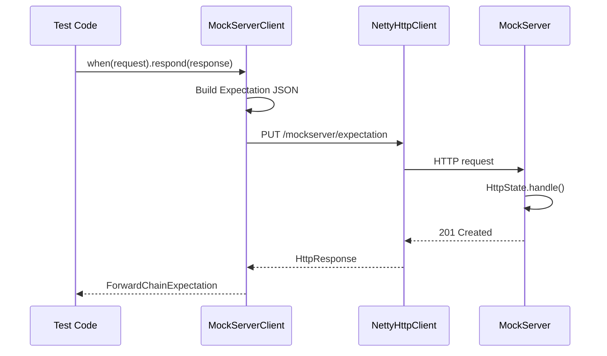
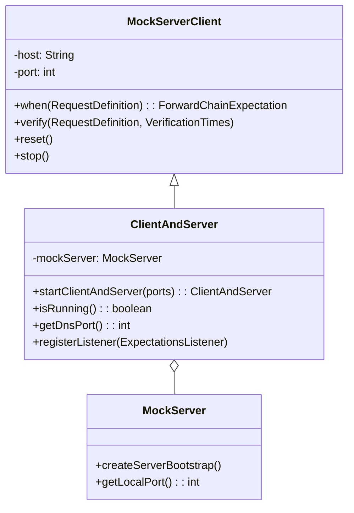
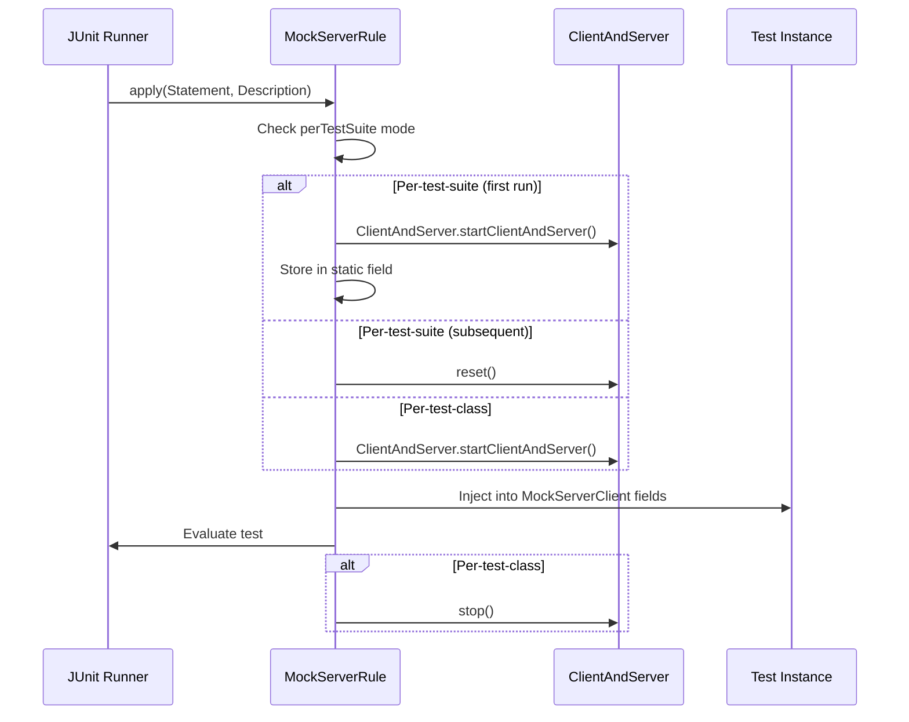
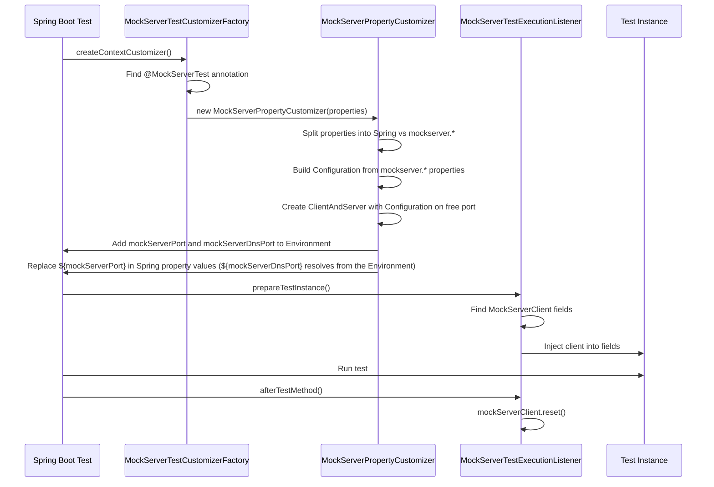
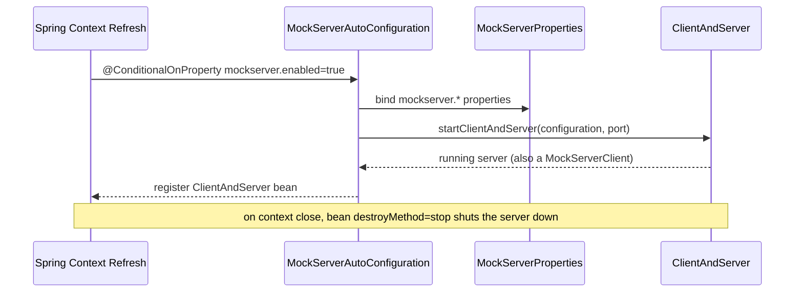

# Client API & Test Integrations

## MockServerClient

`MockServerClient` (`mockserver-client-java`) is the primary Java API for interacting with a running MockServer. All operations are performed via HTTP requests to the MockServer REST API.

### Communication Mechanism



### Fluent API

```java
MockServerClient client = new MockServerClient("localhost", 1080);

// Create expectation
client.when(
    request().withMethod("GET").withPath("/api/users")
).respond(
    response().withStatusCode(200).withBody("{\"users\": []}")
);

// Verify
client.verify(
    request().withPath("/api/users"),
    VerificationTimes.exactly(1)
);

// Retrieve
HttpRequest[] requests = client.retrieveRecordedRequests(
    request().withPath("/api/users")
);
```

### Construction

`MockServerClient` exposes eight constructor overloads spanning `host`/`port`/`contextPath`,
`Configuration`/`ClientConfiguration`, and a `CompletableFuture<Integer>` port. These remain fully
supported and are not deprecated. In addition, `MockServerClient.builder()` returns a fluent `Builder`
that covers every construction dimension in one discoverable place, with sensible defaults
(`host` = `localhost`, `port` = `1080`, empty context path):

```java
MockServerClient client = MockServerClient.builder()
    .host("localhost")
    .port(1080)
    .contextPath("/mockserver")
    .secure(true)                       // withSecure(...)
    .proxyConfiguration(proxy)          // withProxyConfiguration(...)
    .controlPlaneJWT("token")           // withControlPlaneJWT(...)
    .requestOverride(request())         // withRequestOverride(...)
    .configuration(clientConfiguration())
    .build();
```

The builder introduces no new behaviour: `build()` selects the matching constructor and applies the
existing `with...` setters, so a builder-produced client is identical to a directly-constructed one.
Constructor validation is inherited (an empty `host` throws `IllegalArgumentException` from `build()`),
and `portFuture(...)` is mutually exclusive with `host`/`port`/`contextPath` (the future-based
constructor always targets `localhost` with an empty context path). The `Builder` is a nested class in
`mockserver/mockserver-client-java/src/main/java/org/mockserver/client/MockServerClient.java`.

### API Methods

#### Expectation Setup

| Method | Description |
|--------|-------------|
| `when(RequestDefinition)` | Create expectation with unlimited matches |
| `when(RequestDefinition, Times)` | Create expectation with limited matches |
| `when(RequestDefinition, Times, TimeToLive)` | Create with match limit and TTL |
| `when(RequestDefinition, Times, TimeToLive, Integer)` | Create with priority |
| `upsert(Expectation...)` | Create or update expectations (by ID) |
| `upsert(OpenAPIExpectation...)` | Create expectations from OpenAPI specs |

#### Verification

| Method | Description |
|--------|-------------|
| `verify(RequestDefinition, VerificationTimes)` | Verify request count |
| `verify(RequestDefinition...)` | Verify requests received in order |
| `verify(ExpectationId, VerificationTimes)` | Verify by expectation ID |
| `verify(ExpectationId...)` | Verify sequence by expectation IDs |
| `verifyZeroInteractions()` | Verify no requests received |

#### Retrieval

| Method | Return Type | Description |
|--------|-------------|-------------|
| `retrieveRecordedRequests(RequestDefinition)` | `HttpRequest[]` | Received requests |
| `retrieveRecordedRequests(RequestDefinition, Format)` | `String` | Received requests as JSON/Java |
| `retrieveRecordedRequestsAndResponses(RequestDefinition)` | `LogEventRequestAndResponse[]` | Request/response pairs |
| `retrieveRecordedExpectations(RequestDefinition)` | `Expectation[]` | Recorded proxy expectations |
| `retrieveActiveExpectations(RequestDefinition)` | `Expectation[]` | Currently active expectations |
| `retrieveActiveExpectations(RequestDefinition, Format)` | `String` | Active expectations as JSON/Java |
| `retrieveLogMessages(RequestDefinition)` | `String` | Log messages as text |
| `retrieveLogMessagesArray(RequestDefinition)` | `String[]` | Log messages as array |

#### Clear & Reset

| Method | Description |
|--------|-------------|
| `clear(RequestDefinition)` | Clear expectations and logs matching request |
| `clear(RequestDefinition, ClearType)` | Clear specific type (`EXPECTATIONS`, `LOG`, `ALL`) |
| `clear(ExpectationId)` | Clear by expectation ID |
| `clear(String)` | Clear by expectation ID string |
| `reset()` | Reset all state (expectations, logs, WebSocket registry) |

#### Lifecycle

| Method | Description |
|--------|-------------|
| `hasStarted()` | Whether server has started |
| `hasStopped()` | Whether server has stopped |
| `isRunning()` | (deprecated) Use `hasStarted()`/`hasStopped()` |
| `stop()` | Stop server synchronously |
| `stopAsync()` | Stop server asynchronously |
| `close()` | Alias for `stop()` |
| `bind(Integer...)` | Bind additional ports |
| `openUI()` | Launch dashboard UI in browser |

#### Configuration

| Method | Description |
|--------|-------------|
| `withSecure(boolean)` | Enable TLS for client communication |
| `withControlPlaneJWT(String)` | Set static JWT token |
| `withControlPlaneJWT(Supplier<String>)` | Set dynamic JWT supplier |
| `withRequestOverride(HttpRequest)` | Default headers for control-plane requests |
| `withProxyConfiguration(ProxyConfiguration)` | Route via proxy |

**TLS trust.** Over TLS the client verifies MockServer's certificate against the JVM's default trusted CAs plus MockServer's CA certificate (`certificateAuthorityCertificate`, or the dynamically created CA). When control-plane mTLS is required it trusts only `controlPlaneTLSMutualAuthenticationCAChain` (`NettySslContextFactory.controlPlaneTrustCertificates`), not MockServer's CA certificate, so the client's chain must include the CA that signed MockServer's certificate. The server's forward-proxy trust setting (`forwardProxyTLSX509CertificatesTrustManagerType`) does not apply. `MockServerClient` builds its TLS factory with `NettySslContextFactory.forMockServerClient(...)`, which logs this trust at INFO on the first request instead of the server's forward-proxy WARN. Its callback and breakpoint WebSockets take their TLS context from the same factory (`webSocketSslContext()`), so over TLS they trust the same certificates and, with control-plane mTLS, present the same client certificate; they no longer accept any server certificate.

#### gRPC

| Method | Description |
|--------|-------------|
| `uploadGrpcDescriptor(byte[])` | Upload a compiled proto descriptor set to the server |
| `retrieveGrpcServices()` | List all loaded gRPC services and their methods |
| `clearGrpcDescriptors()` | Clear all loaded gRPC descriptors |

#### Contract Testing and Pact

| Method | Description |
|--------|-------------|
| `contractTest(String spec, String baseUrl)` | Exercise every operation in an OpenAPI spec against a live service at `baseUrl`; returns a `ContractReport`. Wraps `PUT /mockserver/contractTest`. |
| `contractTest(String spec, String baseUrl, String operationId)` | Same as above but restricted to a single `operationId`. |
| `trafficValidate(String spec)` | Validate recorded traffic against an OpenAPI spec; returns a `ContractReport`. Wraps `PUT /mockserver/trafficValidate`. |
| `pactImport(String pactJson)` | Import a Pact v3 consumer contract as expectations. Wraps `PUT /mockserver/pact/import`. |
| `pactExport(String consumer, String provider)` | Export active expectations as a Pact v3 contract. Wraps `PUT /mockserver/pact`. |
| `pactVerify(String pactJson)` | Verify a Pact v3 contract against active expectations. Wraps `PUT /mockserver/pact/verify`. |
| `verifySLO(SloCriteria criteria)` | Verify recorded samples against SLO criteria; returns the `SloVerdict` on PASS/INCONCLUSIVE, throws `SloVerdictAssertionError` (an `AssertionError` carrying the verdict) on FAIL. Wraps `PUT /mockserver/verifySLO`. |
| `startChaosExperiment(String experimentJson)` | Start a chaos experiment from its JSON definition; returns the started-status JSON. Wraps `PUT /mockserver/chaosExperiment`. |

`ContractReport` is a `record` on `MockServerClient` with fields: `int total`, `int passed` (count), `int failed`, `boolean allPassed`, `List<ContractResult> results`. Each `ContractResult` carries `operationId`, `method`, `path`, `matchedOperation`, `int statusCode`, `boolean passed`, `List<String> requestErrors`, `List<String> responseErrors`. These types and methods are defined in `mockserver/mockserver-client-java/src/main/java/org/mockserver/client/MockServerClient.java` (around line 3340).

### ForwardChainExpectation

Returned by `when()`, provides terminal methods to define the action:

| Category | Methods |
|----------|---------|
| Response | `respond(HttpResponse)`, `respond(HttpTemplate)`, `respond(HttpClassCallback)`, `respond(ExpectationResponseCallback)` |
| Forward | `forward(HttpForward)`, `forward(HttpTemplate)`, `forward(HttpClassCallback)`, `forward(ExpectationForwardCallback)`, `forward(HttpOverrideForwardedRequest)` |
| Error | `error(HttpError)` |
| gRPC | `respondWithGrpcStream(GrpcStreamResponse)` |
| Configuration | `withId(String)`, `withPriority(int)` |

### Authentication Support

| Method | Purpose |
|--------|---------|
| `withControlPlaneJWT(String)` | Static JWT token |
| `withControlPlaneJWT(Supplier<String>)` | Dynamic JWT supplier |
| `withSecure(boolean)` | Enable TLS for client-to-server |
| `withRequestOverride(HttpRequest)` | Default headers for all control-plane requests |

## ClientAndServer

`ClientAndServer` (`mockserver-netty`) combines an embedded `MockServer` with a `MockServerClient`, used by all test framework integrations:



```java
// Embedded usage
ClientAndServer server = ClientAndServer.startClientAndServer(1080);
server.when(request().withPath("/test")).respond(response().withBody("OK"));
// ... run tests ...
server.stop();
```

**Construction order and what a failed start leaves behind.** `ClientAndServer` extends
`MockServerClient`, so the client half is built first and it opens its event loops
(`clientNioEventLoopThreadCount` selectors) at once. If the server then refuses to start (a
TCP port or the `http3Port` is held, for example), the constructor throws and the caller has
no reference to stop, so `ClientAndServer` releases the client's event loops itself before
rethrowing (`MockServerClient.releaseEventLoops()`, which sends nothing to any server).

A `MockServerClient` built with a port future (`new MockServerClient(configuration, portFuture)`
or `builder().portFuture(...)`) whose future fails or never completes has no server to stop:
`stop()` and `close()` release its event loops the same way and mark it stopped. `stop(boolean)`
still throws the failure to learn the port, as before. This is a behaviour change: a `stop()` that
fails because the port future is not complete used to leave the client usable, and now leaves it
stopped even if the future completes later, so later calls fail with "has already been stopped".

**A WebSocket that could not be registered releases its event loops.** A breakpoint
(`addBreakpoint(...)`) or a closure callback (`respond(callback)` / `forward(callback)`) opens a
WebSocket of its own to MockServer, on a new event loop group of `webSocketClientEventLoopThreadCount`
loops. If the registration fails (it times out after `maxFutureTimeoutInMillis`, is refused, or the
server is unreachable), the caller gets a `ClientException` and nothing it could stop, so the client
stops that WebSocket client, and with it the group, before throwing. Previously the breakpoint group ran
until the JVM exited and the callback group until the client was stopped or reset.
A closure callback is put in `LocalCallbackRegistry` under its `clientId` before the WebSocket is
registered; on that failure it is taken out again, since no expectation will refer to the id. The
registry is process-wide and bounded by `maxWebSocketExpectations`, so a stale entry would otherwise keep
the callback (and what it captured) in memory and take a slot, evicting the entry of a live callback,
whose calls would then go over its WebSocket instead of in-process.

## Test Framework Integrations

### JUnit 4 Rule



**Usage:**

```java
public class MyTest {
    @Rule
    public MockServerRule mockServerRule = new MockServerRule(this);

    private MockServerClient mockServerClient;  // Auto-injected

    @Test
    public void test() {
        mockServerClient.when(request()).respond(response().withBody("OK"));
    }
}
```

**Modes:**
- `new MockServerRule(this)` — auto-allocates port, per-test-class lifecycle
- `new MockServerRule(this, true)` — per-test-suite (static, shared across tests)
- `new MockServerRule(this, 1080)` — specific port, per-test-suite

`getPort()`/`getPorts()` give the TCP ports and `getDnsPort()` the DNS mock's UDP port (-1 while DNS mocking is off, null before a server has started); the JUnit 5 extension's injected `ClientAndServer` has the same `getDnsPort()`.

### JUnit 5 Extension

```java
@MockServerSettings(ports = {1080})
class MyTest {
    @Test
    void test(MockServerClient client) {
        client.when(request()).respond(response().withBody("OK"));
    }
}
```

**`@MockServerSettings` attributes:**
- `perTestSuite` — boolean, default false. If true, single server per JVM.
- `ports` — int[], default empty (auto-allocate).
- `resetBeforeEach` — boolean, default false. When true, the extension calls `reset()` on the shared server in its `BeforeEachCallback`, clearing all expectations and recorded requests before each test method. This fires before any `@BeforeEach` methods, so expectations registered in `@BeforeEach` are applied after the reset and are present for the test. Combined with `perTestSuite = true`, this gives test isolation even across multiple test classes sharing one JVM-wide server. Without `resetBeforeEach`, the historic behaviour is preserved: the shared server is never reset between tests, leaving expectations registered in `@BeforeAll` intact for the whole class.

**Parameter resolution**: Injects `MockServerClient` (or `ClientAndServer`) as test method parameters.

**Lifecycle:**
- `beforeAll`: Creates `ClientAndServer`, optionally registers JVM shutdown hook
- `beforeEach`: Calls `reset()` when `resetBeforeEach = true`
- `afterAll`: Stops server (unless per-test-suite mode)

### Spring Test Integration



**Usage:**

```java
@MockServerTest({
    "my.service.url=http://localhost:${mockServerPort}",
    "mockserver.initializationClass=com.example.MyInit",
    "mockserver.logLevel=WARN"
})
@SpringBootTest
class MyTest {
    private MockServerClient mockServerClient;  // Auto-injected

    @MockServerPort
    private int serverPort;  // Injected via @Value

    @Test
    void test() { ... }
}
```

**How it works:**
1. `MockServerTestCustomizerFactory` (loaded via `spring.factories`) scans for `@MockServerTest`
2. `MockServerPropertyCustomizer` splits annotation properties: `mockserver.*`-prefixed properties are applied to a per-instance `Configuration` object; other properties go to the Spring `Environment`
3. `MockServerPropertyCustomizer` creates a `ClientAndServer` with the `Configuration` on a free port and injects `mockServerPort` and `mockServerDnsPort` (the DNS mock's UDP port, -1 while DNS mocking is off; `@MockServerDnsPort`) into the Spring `Environment`
4. `MockServerTestExecutionListener` injects the `ClientAndServer` into `MockServerClient` fields
5. After each test, `reset()` clears state

### Spring Boot Starter

The `mockserver-spring-boot-starter` module provides **Spring Boot auto-configuration** for main-application
(non-test-runner) use: adding it to the classpath and setting `mockserver.enabled=true` starts a
`ClientAndServer` inside the application context and exposes it as an injectable `MockServerClient` bean. It is
intended for **local development and integration testing** (it starts a real embedded MockServer), and is
disabled by default so its mere presence never changes behaviour.

It uses the Spring Boot 3/4 auto-configuration mechanism (an
`org.springframework.boot.autoconfigure.AutoConfiguration.imports` file under `META-INF/spring/`, not the legacy
`spring.factories`), targeting Spring Boot 4.0.x / Spring Framework 7 (the version already used elsewhere in the
build) on the `jakarta` namespace.



**Configuration properties** (`mockserver.*`):

| Property | Default | Purpose |
|----------|---------|---------|
| `mockserver.enabled` | `false` | Master switch — start MockServer and register the bean |
| `mockserver.port` | `0` | Bind port; `0` picks a free ephemeral port (read the actual port from the bean) |
| `mockserver.initialization-json` | — | Path to an initialization JSON file of expectations to preload |
| `mockserver.log-level` | — | MockServer log level (e.g. `WARN`, `INFO`, `DEBUG`, `OFF`) |

**Usage:**

```java
@SpringBootApplication
public class MyDevApp { }

// application.properties (dev / test profile only):
// mockserver.enabled=true
// mockserver.port=1080

@Service
class MyClient {
    MyClient(MockServerClient mockServerClient) { // injected; also injectable as ClientAndServer
        mockServerClient
            .when(request().withPath("/hello"))
            .respond(response().withBody("world"));
    }
}
```

**How it works:**
1. `MockServerAutoConfiguration` is listed in `META-INF/spring/org.springframework.boot.autoconfigure.AutoConfiguration.imports` and is gated by `@ConditionalOnProperty(prefix = "mockserver", name = "enabled", havingValue = "true")`
2. `MockServerProperties` (`@ConfigurationProperties(prefix = "mockserver")`) binds the `mockserver.*` values
3. A single `ClientAndServer` bean is created (`@ConditionalOnMissingBean`, so you can override it) with `destroyMethod = "stop"`; because `ClientAndServer extends MockServerClient` the one bean satisfies both `ClientAndServer` and `MockServerClient` injection points
4. The server starts on context refresh and stops on context close. A refused start (a port in use, or a `dnsPort` or `http3Port` that cannot be opened) is not caught, so the context fails with a `BeanCreationException` whose cause is MockServer's exception (`MockServerAutoConfigurationTest`)

### Maven Plugin: A Refused Start Fails the Build

The `start`, `run` and `runForked` goals fail the build when MockServer does not start. `start` lets `InstanceHolder.start`'s exception reach Maven; `run` wraps it in a `MojoExecutionException` (before 9.0.0 it logged it and returned, so the build carried on without a server). `runForked` fails when the forked JVM cannot be launched, when it exits before `PUT /mockserver/status` answers (the CLI exits non-zero on a refused start; the message carries the exit status), and when nothing answers within `startAttempts` (150) checks 500 ms apart, after stopping the forked JVM.

### Maven Plugin Glob Support

The Maven plugin's `initializationJson` parameter now supports glob patterns for loading multiple expectation files. The plugin uses `FilePath.expandFilePathGlobs()` to resolve glob characters (`*`, `**`, `?`, `[]`, `{}`) into matching file paths.

Example Maven configuration:
```xml
<initializationJson>src/test/resources/expectations/**/*.json</initializationJson>
```

When a glob pattern is detected (by checking for glob characters in the path), the plugin expands it and concatenates the contents of all matching files into a single JSON array, which is then passed to `initializationJsonPath`. Non-glob paths are passed through unchanged.

## Testcontainers

The `mockserver-testcontainers` module (`org.mock-server:mockserver-testcontainers`) is the **canonical, MockServer-maintained** Testcontainers integration. It supersedes the thin upstream `org.testcontainers:mockserver` module (which exposes only a single TCP port, pins an ancient default image, and offers no configuration helpers).

`MockServerContainer` extends Testcontainers' `GenericContainer` and adds:

| Capability | Method | Mechanism |
|------------|--------|-----------|
| Version-lockstep image | (default constructor) | Image tag derived from `MockServerClient`'s `Implementation-Version` (`mockserver/mockserver:mockserver-<version>`), falling back to `:latest` when run from unpackaged classes |
| Server port | `withServerPort(int)` | Sets `SERVER_PORT`, *replaces* the exposed port (not append), and re-targets the readiness wait at the chosen port |
| Readiness | (constructor) | Waits on `Wait.forHttp("/mockserver/status").withMethod("PUT").forStatusCode(200)` so `start()` returns only once the request pipeline is serving — **not** a listening-port wait, which is satisfied at port-bind while Netty still accepts-then-resets during init (a ~0.2–0.3s race that reset the first request under load) |
| Direct client wiring | `getClient()` | `new MockServerClient(getHost(), getServerPort())` |
| Endpoints | `getEndpoint()` / `getSecureEndpoint()` | HTTP and HTTPS are served on the same unified port |
| DNS | `withDnsPort(int)` | `MOCKSERVER_DNS_ENABLED` + `MOCKSERVER_DNS_PORT`, UDP port exposed |
| Transparent proxy | `withTransparentProxy()` | `MOCKSERVER_TRANSPARENT_PROXY_ENABLED` + `NET_ADMIN` capability (iptables/redirect rules remain the operator's responsibility) |
| HTTP/3 (experimental) | `withHttp3(int)` | `MOCKSERVER_HTTP3_PORT`, UDP port exposed |
| Initialization JSON | `withInitializationJson(String)` | Copies an initialization JSON into the container and sets `MOCKSERVER_INITIALIZATION_JSON_PATH` (startup loading, distinct from `persistExpectations`) |
| Broker networking | `withNetwork(Network)` / `withNetworkAliases(String)` (inherited from `GenericContainer`) | For AsyncAPI broker connectivity / inter-container comms |
| Arbitrary properties | `withProperty(k,v)` / `withProperties(Map)` | Passed through as MockServer env vars |
| Log level | `withLogLevel(String)` | `MOCKSERVER_LOG_LEVEL` |

The builder helpers configure env vars, exposed ports, and Linux capabilities **before** the container starts, so they are introspectable in unit tests without a running Docker daemon (`MockServerContainerConfigTest`).

The Docker-dependent `MockServerContainerIntegrationTest` is gated on `DockerAvailability.isAvailable(() -> DockerClientFactory.instance().isDockerAvailable())`. Gate on that wrapper (from `mockserver-testing`) rather than calling `DockerClientFactory.instance().isDockerAvailable()` directly: the raw probe converts only `IllegalStateException` into `false` and **throws** for every other failure — Ryuk rejection on a user-namespace-remapped daemon, an unpullable Ryuk image, or an `Error` from an incomplete test classpath — which turns "no usable Docker" into a hard ERROR instead of a skip. See `org.mockserver.test.DockerAvailability`.

> **`MockServerContainerIntegrationTest` executes in CI via a dedicated socket-bearing step.** Surefire is configured for `**/*Test.java` and Failsafe for `**/*IntegrationTest.java`; a class ending in `IT` matches neither, and `mockserver-testcontainers` declares no override. The suite was historically named `MockServerContainerIT` and so matched nothing — it compiled but ran nowhere, locally or in CI. It was renamed to `MockServerContainerIntegrationTest` so Failsafe collects it. Because it is Docker-gated and the main `:maven:` build runs without a Docker socket (where it would silently SKIP), it runs in its own step, `.buildkite/scripts/steps/java-testcontainers-test.sh`, which supplies the socket and then asserts the suite actually executed via `assert-suite-ran.sh` — the same fail-closed pattern as the async live-broker and cloud blob-store Docker-gated suites.

Typical usage:
```java
try (MockServerContainer mockServer = new MockServerContainer()) {
    mockServer.start();
    MockServerClient client = mockServer.getClient();
    client.when(request().withPath("/hello")).respond(response().withBody("world"));
    // ... point the system under test at mockServer.getEndpoint() ...
}
```

## On-Demand Binary Launcher (turnkey, no Java/Docker)

Each language client can **start a real MockServer on demand** by downloading the self-contained,
JVM-less binary bundle for the user's OS/arch — no Java install, no Docker. A user adds only the
client; the server is fetched, cached, launched, and stopped programmatically. This mirrors the
esbuild / Playwright "managed binary" model. `mockserver-node/downloadBinary.js` is the reference
implementation; every other client mirrors the same contract.

**Shared contract (identical across all clients):**

| Aspect | Value |
|--------|-------|
| Bundle | `mockserver-<version>-<os>-<arch>.<ext>` — os ∈ {linux, darwin, windows}, arch ∈ {x86_64, aarch64}, ext = tar.gz (linux/darwin) / zip (windows) |
| Source | `${MOCKSERVER_BINARY_BASE_URL:-https://github.com/mock-server/mockserver-monorepo/releases/download/mockserver-<version>}/<file>` |
| Cache | `${MOCKSERVER_BINARY_CACHE:-<OS user cache>}/mockserver/binaries/<version>/<bundle>/bin/mockserver` (`mockserver.bat` on Windows); OS cache = `%LOCALAPPDATA%` (Windows) else `$XDG_CACHE_HOME` or `~/.cache` |
| Integrity | downloads to a `.part` temp, verifies the published `<file>.sha256` (**fail-closed** on missing/empty/mismatch), atomic rename, then `tar -xf` extract |
| Versioned cache GC | after a successful install, prunes other version dirs keeping the current + **one** previous (`maxPrevious = 1`); semver-aware so a **release outranks its `-SNAPSHOT`** (a stable release is never pruned in favour of a pre-release) |
| Env knobs | `MOCKSERVER_BINARY_BASE_URL` (mirror / air-gap), `MOCKSERVER_BINARY_CACHE`, `MOCKSERVER_SKIP_BINARY_DOWNLOAD` (fail instead of download — pre-seeded caches) |
| Default version | the last released MockServer version (`8.0.0`) — see *Version pinning* below |

**Version pinning.** All clients must resolve to the same default version so they fetch the same
bundle and share one cache, but there is no single shared constant: each client records the version
in its own idiomatic place, and the release bump has to touch every one of them.

| Client | Where the version lives | Kind |
|--------|------------------------|------|
| Node | `mockserver-node/package.json` → `version` (passed in by `bin/mockserver.js`; `ensureBinary` has no default) | package manifest |
| Python | `mockserver-client-python/mockserver/launcher.py` → `_CLIENT_VERSION` | source constant |
| PHP | `mockserver-client-php/src/BinaryLauncher.php` → `DEFAULT_VERSION` | source constant |
| Ruby | `mockserver-client-ruby/lib/mockserver/version.rb` → `MockServer::VERSION` (default for the `version:` kwarg) | source constant |
| Go | `mockserver-client-go/VERSION`, embedded via `//go:embed` | build artefact |
| Rust | `Cargo.toml` → `version`, read via `env!("CARGO_PKG_VERSION")` | package manifest |
| .NET | assembly `AssemblyInformationalVersionAttribute` (from the csproj `<Version>`), with `FallbackVersion` in `MockServerBinaryLauncher.cs` if reflection fails | assembly metadata |

Two guards keep these in step, because they have drifted before — Python and PHP sat at `7.1.0` and
Rust at `7.3.0` across three releases, so those clients silently downloaded a stale server:

- `scripts/release/prepare.sh` bumps every path above and **hard-fails** if any pattern does not
  match exactly once, so a renamed constant breaks the release rather than being skipped.
- `.buildkite/scripts/steps/clients-version-consistency.sh` (infra pipeline) asserts on every build
  that all pins equal the last released version, catching drift between releases.

When adding a client, add its version location to **both**.

**Per-client location & API:**

| Client | File(s) | Entry point |
|--------|---------|-------------|
| Node | `mockserver-node/downloadBinary.js` | `ensureBinary` / `runBinary` (reference) |
| Python | `mockserver-client-python/mockserver/launcher.py` | `start(port)` → handle, `stop()` |
| Ruby | `mockserver-client-ruby/lib/mockserver/binary_launcher.rb` | `BinaryLauncher` start/stop |
| Go | `mockserver-client-go/launcher.go` | `StartServer` / handle `Stop` |
| .NET | `mockserver-client-dotnet/.../MockServerBinaryLauncher.cs` | `Start` / `Stop` |
| Rust | `mockserver-client-rust/src/launcher.rs` | `start` / handle `stop` |
| PHP | `mockserver-client-php/src/BinaryLauncher.php` (+ `BinaryHandle.php`) | `BinaryLauncher::start` / `BinaryHandle::stop` |

Hardening common to all: version strings are validated and resolved cache paths are asserted to stay
within the cache root (no path traversal); SHA-256 verification is mandatory on the public path; no launcher
runs through a shell: the Node launcher runs the bundled `java` directly and the other clients
build the `cmd.exe` command line themselves on Windows (see *Launching without a shell* below); child process stdout/stderr are drained to avoid
pipe-buffer deadlock; HTTP downloads use timeouts and stream to disk. Tests are hermetic (no live
network) using `file://` fixtures and a stubbed downloader, plus one integration test that runs only
when a real bundle is available. *(Known minor follow-up: the PHP pruner relies on `version_compare`,
which can treat `8.0.0` and `8.0.0-SNAPSHOT` as equal — prune order between those two is not
guaranteed; tracked as a follow-up.)*

**Launching without a shell.** On Linux and macOS the Python, Ruby, Go, Rust, .NET and PHP clients
execute `bin/mockserver` directly, with no shell.

The Node launcher runs no launcher script at all, on any platform: `bin/mockserver` needs `sh` and
`bin/mockserver.bat` needs `cmd.exe`. It does what the script does instead. It runs
`runtime/bin/java` (`runtime\bin\java.exe` on Windows) with the `-D` options the bundle builder
baked into the script's java line (read from the file, which is refused unless it has that line
and only `-D` options on it), then `MOCKSERVER_JAVA_OPTS`, then `-jar lib/mockserver.jar` and the
caller's arguments. It sets `MOCKSERVER_LAUNCHER=mockserver` unless the caller set it (or, on
Linux and macOS, set it empty, as the script does). `MOCKSERVER_JAVA_OPTS` is split on whitespace,
and text inside double or single quotes stays together with the quotes removed, so
`-Dx="a b"` gives `-Dx=a b`; nothing else in it is interpreted (no variables, wildcards or
command substitution). `shell: false` is forced over any `spawnOptions` a caller passes.

On Windows every argument is double-quoted by the C runtime's rules (backslashes doubled only
before a `"`) and passed with `windowsVerbatimArguments`, with the `java.exe` path as a quoted
`argv0`. The tests prove that line reads back as the original arguments under the C runtime's
rules, which `java.exe` follows; quoting every argument also keeps `java.exe` from treating `*`
or `?` as a file wildcard. Nothing is refused for containing `%`, `&`, `|` or quotes.

The Python, Ruby, Go, Rust, .NET and PHP clients still run the `.bat` under `cmd.exe`, so they build
that line rather than letting a runtime quote it (runtime quoting follows the C runtime's rules,
which `cmd.exe` does not):

- the line is `cmd.exe /d /v:off /s /c ""<launcher>" "<arg>" ..."`: `/d` skips AutoRun, `/v:off` keeps
  `!` literal, and each part is double-quoted so `&`, `|`, `<`, `>`, `^` and parentheses are text;
  a trailing run of backslashes is doubled so it cannot escape the closing quote when Java splits
  the line;
- a line with two or more `%` is refused, because `cmd.exe` expands `%NAME%` even inside quotes and
  nothing escapes it there; so is a launcher path or argument containing a line break or NUL, and
  a launcher path containing `"`, and a `"` in an argument;
- the line reaches `CreateProcess` unchanged: Python passes a string with `shell=False`, Go sets
  `SysProcAttr.CmdLine`, Rust uses `raw_arg`, .NET sets `Arguments`, and PHP passes a string with
  `bypass_shell`. Python, Go, Rust and .NET run cmd.exe by its `%ComSpec%` path (else
  `%SystemRoot%\System32\cmd.exe`, else an error); Ruby and PHP run it by name;
- Ruby has no verbatim form: a command string goes to `CreateProcess` unchanged only while it holds
  no redirection, so Ruby also refuses `<`, `>`, `|` and `&`, and needs a native (mswin or mingw)
  Ruby, since a Cygwin Ruby would hand the string to `/bin/sh`;
- a refusal names the part (`the launcher path` or `argument <i>`) but never
  its value, which may be a secret, and the `%` refusal does not print the line.

The command-line builders are unit-tested in each launcher's suite (Node's against a test-side
reading of the line by the C runtime's rules); no CI agent runs Windows.
The JetBrains plugin passes only the launcher path and a port to IntelliJ's `GeneralCommandLine`,
and the VS Code extension runs the bundled `java` directly.

### Test-Runner Fixtures & Helpers

Thin, framework-native on-ramps wrap the launchers above so users get a ready client with one line of
setup. All follow the same shape: start (or connect to) a server, hand back a reset client, tear down after.

| Client | Framework | Entry point | File |
|--------|-----------|-------------|------|
| Ruby | RSpec | `require 'mockserver/rspec'` → `mockserver` (shared context, `:mockserver` tag) | `mockserver-client-ruby/lib/mockserver/rspec.rb` |
| Python | pytest | `mockserver` fixture (auto-registered via the `pytest11` entry point) + `mockserver_server`/`mockserver_host`/`mockserver_port` | `mockserver-client-python/mockserver/pytest_plugin.py` |
| Node | jest / vitest / mocha / node:test | `setupMockServer(options)` → `{ client, host, serverPort, stop }` | `mockserver-client-node/setupMockServer.js` |

* **pytest** — the `mockserver` fixture connects to an external server when `MOCKSERVER_HOST`/`MOCKSERVER_PORT`
  are set, otherwise launches a self-contained binary (via `launcher.start`) for the session; it resets the
  server before and after every test. Registration via `[project.entry-points.pytest11]` in `pyproject.toml`
  means `pip install`ed users get the fixtures automatically, opt-in by requesting them.
* **Node** — `setupMockServer()` lazily requires `mockserver-node` (kept a devDependency, so importing the
  client never pulls it in) to start/stop the server, and returns a `mockServerClient` plus an idempotent
  `stop()`. Framework-agnostic: usable from `beforeAll`/`afterAll`, a vitest/jest `globalSetup` module, or a
  plain script.

## Node.js Client

The Node.js client (`mockserver-client-node/`) mirrors the Java client's API surface in JavaScript/TypeScript. The primary factory is `mockServerClient(host, port, contextPath?, tls?, caCertPemFilePath?, options?)`, which returns a `MockServerClient` object.

### Fluent `when()` DSL

The client exposes a `when(requestMatcher, times?, timeToLive?, priority?)` method that returns a `ForwardChainExpectation` — a fluent builder mirroring Java's `ForwardChainExpectation`. The optional builder methods refine the expectation before a terminal action sends it to MockServer:

```javascript
const client = mockServerClient('localhost', 1080);

// Fluent style — plain number is treated as remainingTimes
await client
  .when({ path: '/api/users' }, 3)
  .withPriority(10)
  .respond({ statusCode: 200, body: '{"users":[]}' });

// Procedural style (unchanged)
await client.mockSimpleResponse('/api/health', 'OK', 200);
```

**Argument-order caveat:** `when(matcher, times, timeToLive, priority)` takes `times` before `timeToLive` before `priority` — the opposite order from `mockWithCallback` and the other procedural helpers, which take `(matcher, handler, times, priority, timeToLive, id)`. Prefer the fluent builder methods (`.withTimes()`, `.withTimeToLive()`, `.withPriority()`) over positional arguments to avoid confusion.

| Builder method | Effect |
|----------------|--------|
| `.withTimes(times)` | Accepts a `Times` object or a plain number (treated as `remainingTimes`) |
| `.withTimeToLive(ttl)` | Accepts a `TimeToLive` object |
| `.withPriority(n)` | Higher number wins on ties |
| `.withId(id)` | Set a stable expectation ID (enables upsert) |

Terminal action methods:

| Method | Action |
|--------|--------|
| `.respond(response)` | Static HTTP response, template, or class callback |
| `.forward(forward)` | HTTP forward, template, class callback, or override |
| `.error(error)` | HTTP error / connection drop |
| `.callback(fn)` | Local JS callback over the callback WebSocket |
| `.forwardCallback(fn)` | Local JS forward callback over the callback WebSocket |

### TypeScript Types

Full TypeScript definitions are in `mockServerClient.d.ts` and `mockServer.d.ts`. The `ForwardChainExpectation` interface and all request/response types are exported. The client ships type definitions as part of the package; no separate `@types/mockserver` package is needed.

Each `.d.ts` declares the CommonJS module beside it as it is at run time. Every module of the package assigns an object of named members to `module.exports` and none has a `default` property, so each is declared with named exports and no default export. `llm.d.ts` exports the `Provider` and `Role` objects, the factories and the builder constructors by name, with `let`: the module is a plain object, and a test may replace a member (`llm.completion = stub`).

The builder types are declared in `llmTypes.d.ts`, a types-only file with no module beside it. They cannot live in `llm.d.ts`, because there a name such as `Completion` is also the constructor `llm.js` exports, and `index.js` exports no `Completion`: `index.d.ts` exports the builder names from `llmTypes.d.ts`, as types alone, and declares `llm` as a value typed with the `Llm` interface and the constructors, written out, so that an augmentation of `Llm` shows on it. In `llm.d.ts` each builder name is the constructor and an interface that extends the one in `llmTypes.d.ts`. Factories and the builders' own methods return the `llmTypes.d.ts` interfaces, so those are the ones a module augmentation of `mockserver-client` or `mockserver-client/llmTypes` reaches.

Two checks hold this in place. `test/no_proxy/package_contents_test.js` runs the launcher's `mockserver-node/test/packageContents.js` over the client: every function or value a published `.d.ts` exports must be a property of what its module exports, every name a module exports must be declared (the test lists the exceptions), a `.d.ts` with no module beside it must declare types alone, and a declared default export must exist. It also builds the client and each object a caller reaches through it (the `when(...)` chain, a scenario handle, `llm` and every LLM, MCP and A2A builder) and compares each, inherited members included, with the interface that types it: every member the interface requires must be on the object, and every name on the object must be declared, except names starting with `_` (private state) and the names the test lists (the constructors `index.d.ts` declares on `llm` beside `Llm`, and the state a `TurnBuilder` keeps for its conversation). The interface is read as text, member by member; an `extends` clause and index, call and construct signatures are reported as unread. `test/llmImportForms.ts`, compiled by `npm run typecheck`, fails if `llm.d.ts` gains a `default`, if one of the pinned members stops being assignable, if a constructor stops being declared as one, if a builder name stops being an interface, if `Llm` has a member the module does not export by name, or if through the index a builder name becomes a value or `llm` a namespace.

#### Importing from an ES module

An ES module importing a CommonJS module gets its named exports from Node's static scan of the module's source (cjs-module-lexer), which runs no code. It reads `module.exports = { name: identifier, ... }` and stops at the first value that is not a plain identifier, and it reads nothing from `module.exports = someVariable`. So every published module assigns `module.exports` an object literal whose values are local variables: `index.js` and `mockServerClient.js` first assign what they `require` to locals, and `llm.js` writes `var llm = module.exports = { ... }`. `llm.js` also runs in a browser, where there is no `module`; its wrapper function takes `module` as a parameter and is passed a stand-in object there, from which it sets `window.mockServerLlm`. Since 9.0.0 each package has an `exports` map, so an ES module can import a deep path without its extension (`mockserver-client/llm`). The map closes every path it does not name, so it names each published module as `./name` and `./name.js` (and `index.js` as `.` too), each `.d.ts` that has no module beside it with a `types` condition alone, and `./package.json`; a module with typings has `types` first, then `require`, `import` and `default`, all naming the same CommonJS file. The launcher leaves out `bin/mockserver.js` and `tasks/mockServer.js`, which npm and Grunt load by their files. The shared `packageContents.js` derives the map these rules give from the `files` list and fails if `package.json` differs from it, in content or in condition order, and it requires every `exports` target to be a published file as written (Node completes no extension there). Both packages' ES module tests require and import every path of the map by name from a consumer whose `node_modules` links to the package, compare each with the module file, read `package.json`, and check that other paths fail with `ERR_PACKAGE_PATH_NOT_EXPORTED`. The client's `npm run typecheck` also compiles `.mts` and `.cts` consumers of both packages (`mockserver-client-node/test/exports/`, `mockserver-node/test/typescript/`) under `node16` and `bundler` resolution; they import each typed path by the package's own name, which TypeScript resolves through the map, and check it has the typings of its file. `test/no_proxy/es_module_import_test.js` checks that each published module, imported from an ES module, has by name every member `require` returns, runs a consumer `.mjs` against the package installed by name, and runs `llm.js` in a context with only `window`.

The launcher, `mockserver-node`, follows the same rule: `index.js` assigns its literal to `module.exports` inside its wrapper function, and the test-only `_internal` objects of `downloadJar.js` and `downloadBinary.js` are built in locals first. Its `test/esModuleImport_test.js` runs `.mjs` consumers in a child process to check the same things.

#### Closing the callback WebSockets

Each callback (`mockWithCallback`, the `callback` and `forwardCallback` actions, the forward-and-response callback) opens its own WebSocket, and the first breakpoint of a client opens one more. An open WebSocket keeps a Node process running. `mockServerClient.js` records each one in a table shared by every client of the same MockServer (host, port and context path) in the process, so that one client can close what another opened, as the Java client does by port. `close()` closes them all and sends nothing to MockServer; `reset()` closes them and resets MockServer; `Symbol.asyncDispose` does both and waits for both; `Symbol.dispose` fires `reset()`. A closed WebSocket does not reconnect, and a callback or breakpoint registered after a close opens a new WebSocket.

MockServer closes a callback's WebSocket from its side when it removes the callback's expectation (its `times` are used up, or it is cleared or reset, by any client, the REST API or the dashboard; `WebSocketClientRegistry.reset` and `RequestMatchers` call `unregisterClient`) and when the connection drops. The client registers the callback's expectation once, on the first client id, and never again. When the WebSocket closes, it asks MockServer for the expectation by the id MockServer returned when it was created (`retrieve?type=ACTIVE_EXPECTATIONS` with `{"id": ...}`, which answers 400 for an id it does not hold): if MockServer no longer holds it the WebSocket stays closed, with no warning, so nothing MockServer removed comes back and a process whose callbacks are all used up can exit; if it still holds it, or cannot say, the client reconnects (three attempts, 2 to 8 seconds apart) and sends its previous client id in `X-CLIENT-REGISTRATION-ID`, as the Java, Python and Ruby clients do, so the expectation reaches it again with its remaining `times` intact. The breakpoint WebSocket never reconnects: MockServer drops a client's breakpoints when its WebSocket closes, so the next breakpoint opens a new WebSocket. `test/no_proxy/callback_websocket_close_test.js` also checks that a reset made over the REST API stays reset, that 50 callback requests are served over one WebSocket, that a used-up callback is not registered again, and, through a TCP proxy that cuts the WebSocket, that a dropped WebSocket reconnects with its client id and keeps its expectation's remaining times. `test/no_proxy/callback_websocket_close_test.js` runs child processes that register every kind of callback and then close, reset or dispose, and fails if one has not exited by a deadline; a control process that does not close must still be running. Because nothing is left open, the client's own test runner (`test/run_node_tests.js`) runs `node --test` without `--test-force-exit`, so a test that leaves a WebSocket open hangs the run instead of passing.

#### Opening a callback WebSocket settles on registration

`webSocketClient.js` (and the browser transport in `mockServerClient.js`) resolves the WebSocket's promise only once MockServer has sent the `WebSocketClientIdDTO`, so every caller (`mockWithCallback`, the forward and forward-and-response callbacks, the `callback`/`forwardCallback` actions and `addBreakpoint`) receives a client id it can register. Before that point the promise rejects, and the client drops the socket and clears its timers so nothing keeps the process alive, when the first connection is refused (`Can't connect to MockServer running on host: ... and port: ...`), the handshake or TLS fails, MockServer closes the WebSocket first, the `CertificateAuthorityCertificate.pem` download a TLS client without a CA path needs fails, or the client id has not arrived within `callbackWebSocketTimeoutMillis` (a `mockServerClient` option, default 10000 ms, the same 10 s the Python and Ruby clients wait). Each caller passes the rejection to the `then` error callback. Previously the promise resolved straight after `connect()`, so those rejections were dead code and a callback or breakpoint pointed at an unreachable MockServer never settled. Once the client id has arrived the reconnect behaviour above is unchanged; a later drop never rejects. A non-TLS client no longer downloads the CA certificate, as `sendRequest.js` already did not. The download is written to a temporary `.tmp.pem` file beside `CertificateAuthorityCertificate.pem` and renamed into place only once complete, so a download that is cut off, or abandoned when the registration times out, never leaves a truncated certificate for a later run to use. `test/no_proxy/callback_websocket_registration_test.js` covers each case against a fake MockServer, including child processes that must exit after the rejection; `test/no_proxy/browser_callback_websocket_test.js` covers the browser transport with a fake `WebSocket`.

## WebSocket Callback System

For object/closure callbacks, a WebSocket connection between the client JVM and MockServer enables the callback to execute on the client side:

```mermaid
graph TB
    subgraph "Client JVM"
        TEST[Test Code]
        FCE[ForwardChainExpectation]
        LCR[LocalCallbackRegistry]
        WSC[WebSocketClient]
    end

    subgraph "MockServer"
        CWSH[CallbackWebSocketServerHandler]
        WSCR[WebSocketClientRegistry]
        AH[HttpActionHandler]
    end

    TEST -->|respond(callback)| FCE
    FCE -->|store| LCR
    FCE -->|connect| WSC
    WSC <-->|WebSocket| CWSH
    CWSH -->|register| WSCR

    AH -->|RESPONSE_OBJECT_CALLBACK| WSCR
    WSCR -->|send request| CWSH
    CWSH -->|forward to client| WSC
    WSC -->|invoke callback| LCR
    LCR -->|return response| WSC
    WSC -->|send response| CWSH
    CWSH -->|dispatch| WSCR
    WSCR -->|return to| AH
```

### Registration Flow

1. `ForwardChainExpectation.respond(callback)` generates a UUID `clientId`
2. Callback stored in `LocalCallbackRegistry` keyed by `clientId`
3. `WebSocketClient` connects to `/_mockserver_callback_websocket`
4. Server's `CallbackWebSocketServerHandler` performs WebSocket handshake
5. Server's `WebSocketClientRegistry.registerClient(clientId, channel)` stores the mapping
6. Expectation created with `HttpObjectCallback(clientId)`

### Invocation Flow

1. Request arrives, matches expectation with `RESPONSE_OBJECT_CALLBACK`
2. `HttpResponseObjectCallbackActionHandler` calls `WebSocketClientRegistry.sendClientMessage(clientId, request)`
3. Server sends `HttpRequest` JSON to client via WebSocket
4. Client's `WebSocketClient.receivedTextWebSocketFrame()` deserializes request
5. Client looks up callback by `clientId`, invokes `callback.handle(request)`
6. Client sends `HttpResponse` JSON back via WebSocket
7. Server's `WebSocketClientRegistry.receivedTextWebSocketFrame()` dispatches response
8. Original request handler receives response and writes it to the client channel

### Cleanup

`MockServerEventBus` (per-port) publishes `STOP` and `RESET` events. `ForwardChainExpectation` subscribes to these events to close WebSocket connections and unregister callbacks.

## Callback Interfaces

| Interface | Method | Used By |
|-----------|--------|---------|
| `ExpectationResponseCallback` | `handle(HttpRequest): HttpResponse` | `respond(callback)` |
| `ExpectationForwardCallback` | `handle(HttpRequest): HttpRequest` | `forward(callback)` |
| `ExpectationForwardAndResponseCallback` | `handle(HttpRequest, HttpResponse): HttpResponse` | `forward(fwdCallback, respCallback)` |

## Class Reference

| Class | Module | Role |
|-------|--------|------|
| `MockServerClient` | client-java | Java client API (1621 lines) |
| `ForwardChainExpectation` | client-java | Fluent API action builder |
| `MockServerEventBus` | client-java | Internal pub/sub for stop/reset events |
| `ClientAndServer` | netty | Combined embedded server + client |
| `MockServerRule` | junit-rule | JUnit 4 `TestRule` |
| `MockServerExtension` | junit-jupiter | JUnit 5 `Extension` |
| `MockServerSettings` | junit-jupiter | Configuration annotation |
| `MockServerTest` | spring-test-listener | Spring test annotation |
| `MockServerPropertyCustomizer` | spring-test-listener | Spring context customizer |
| `MockServerTestExecutionListener` | spring-test-listener | Spring test lifecycle |
| `MockServerPort` | spring-test-listener | Port injection annotation |
| `MockServerDnsPort` | spring-test-listener | DNS port injection annotation (-1 while DNS mocking is off) |
| `MockServerAutoConfiguration` | spring-boot-starter | Spring Boot auto-configuration (main app) |
| `MockServerProperties` | spring-boot-starter | `mockserver.*` `@ConfigurationProperties` |
| `WebSocketClient` | core | Client-side WebSocket connector |
| `WebSocketClientHandler` | core | Client-side WebSocket handshake |
| `WebSocketClientRegistry` | core | Server-side client registry |
| `CallbackWebSocketServerHandler` | netty | Server-side WebSocket handler |
| `LocalCallbackRegistry` | core | In-JVM callback storage |
| `MockServerServlet` | war | Servlet bridge for WAR deployment |
| `ProxyServlet` | proxy-war | Proxy servlet for WAR deployment |

## IDE Extensions

MockServer ships two IDE extensions that let developers start, stop, and inspect MockServer without leaving their editor. Both are published as part of the standard MockServer release and versioned in lockstep with the server.

### VS Code Extension

**Source:** `mockserver-vscode/`
**Publisher ID:** `mockserver` (extension ID `mockserver.mockserver`)
**Registries:** VS Code Marketplace and Open VSX Registry

The extension is built with TypeScript and bundled via `vsce`. It contributes three commands and a set of JSON snippets.

| Feature | Detail |
|---------|--------|
| Commands | `mockserver.start` (Start Docker), `mockserver.stop`, `mockserver.openDashboard` |
| Snippets | `mockserver-expectation`, `mockserver-forward`, `mockserver-verify` — expand in any `.json` file |
| VS Code minimum | 1.80 |
| Runtime dependency | Docker Desktop (pulls `mockserver/mockserver:<version>` on demand) |

**Release publishing** (`scripts/release/components/vscode.sh`): bumps the version in `package.json`, builds and packages a `.vsix` inside a pinned Node.js Docker container (no host toolchain required), then publishes to VS Code Marketplace via `vsce publish` and to Open VSX via `ovsx publish`. Secrets are loaded from `mockserver-release/vsce` and `mockserver-release/ovsx` in AWS Secrets Manager.

### JetBrains / IntelliJ Plugin

**Source:** `mockserver-jetbrains/`
**Plugin ID:** `com.mock-server.mockserver`
**Registry:** JetBrains Marketplace

The plugin is written in Kotlin and built with the IntelliJ Platform Gradle Plugin 2.x. It targets IntelliJ Platform 2023.3+ (build 233) and is compatible through 2025.3.x (build 253).

| Feature | Detail |
|---------|--------|
| Actions | `MockServer.OpenDashboard`, `MockServer.StartDocker` — added to the **Tools > MockServer** menu group |
| Tool window | Bottom-panel **MockServer** window with buttons for the same two actions |
| Notifications | Balloon notification group `MockServer Notifications` |
| Minimum platform | 2023.3 (build `sinceBuild=243`) |
| Language | Kotlin 2.1.x, JVM toolchain 17 |

**Plugin Verifier (`verifyPlugin`).** The `./gradlew verifyPlugin` gate (IntelliJ Plugin Verifier) is stricter than the JetBrains Marketplace upload check and must pass before publishing. The `untilBuild` target in `gradle.properties` drifts as new IDE EAP builds are released, making this a recurring breakage risk — bump `untilBuild` whenever verifyPlugin fails on a new EAP range. Two stable patterns avoid common verifyPlugin failures:

- **Plugin version**: derive the version at runtime via `(MockServerSettings::class.java.classLoader as? PluginAwareClassLoader)?.pluginDescriptor?.version` (`MockServerSettings.kt`) rather than a hardcoded build constant. `PluginAwareClassLoader` is a public, stable IntelliJ API that exposes the plugin descriptor.
- **Action dispatch**: invoke actions programmatically via `AnActionEvent.createEvent(action, dataContext, place, ...)` (`MockServerToolWindowFactory.kt`) rather than constructing an `AnActionEvent` directly. The factory method is the stable API surface the verifier checks.

**Release publishing** (`scripts/release/components/jetbrains.sh`): bumps `pluginVersion` in `gradle.properties`, builds the plugin ZIP (`./gradlew clean buildPlugin`) inside the pinned Maven Docker image (which ships JDK 17; Gradle is downloaded by the wrapper), then publishes via `./gradlew publishPlugin` with the `JETBRAINS_TOKEN` environment variable set from `mockserver-release/jetbrains` in AWS Secrets Manager.

## MCP (Model Context Protocol) Integration

MockServer exposes its control-plane capabilities via the [Model Context Protocol](https://modelcontextprotocol.io/) (MCP), enabling AI agents and LLM-based tools to interact with MockServer programmatically.

### Protocol Details

| Property | Value |
|----------|-------|
| Transport | Streamable HTTP (POST for JSON-RPC, DELETE for session termination) |
| MCP version | `2025-03-26` |
| Endpoint path | `/mockserver/mcp` |
| Session management | Sessions created by `initialize` JSON-RPC request; tracked via `Mcp-Session-Id` header |
| Enable/disable | `mcpEnabled` configuration property (default: `true`) |

### Available Tools

MCP tools map to MockServer control-plane operations:

| Tool | Description |
|------|-------------|
| `create_expectation` | Create a mock expectation (high-level, simplified parameters) |
| `create_forward_expectation` | Create a forwarding proxy expectation |
| `create_expectation_from_openapi` | Create expectations from an OpenAPI/Swagger specification |
| `verify_request` | Verify that requests matching criteria were received a specific number of times |
| `verify_request_sequence` | Verify that requests were received in a specific order |
| `retrieve_recorded_requests` | Retrieve requests that MockServer has received |
| `retrieve_request_responses` | Retrieve request/response pairs |
| `clear_expectations` | Clear expectations and/or logs matching a request |
| `reset` | Reset all MockServer state |
| `get_status` | Check MockServer running status and bound ports |
| `debug_request_mismatch` | Diagnose why a request did not match any expectation |
| `stop_server` | Stop the MockServer instance |
| `raw_expectation` | Full expectation JSON passthrough |
| `raw_retrieve` | Full retrieve parameters passthrough |
| `raw_verify` | Full verification JSON passthrough |

### Available Resources

MCP resources provide read-only access to MockServer state:

| Resource URI | Description |
|--------------|-------------|
| `mockserver://expectations` | All currently active expectations |
| `mockserver://requests` | All recorded requests |
| `mockserver://logs` | Current MockServer log messages |
| `mockserver://configuration` | Current MockServer configuration properties |

### Authentication

The MCP endpoint enforces the same control-plane authentication (mTLS and/or JWT) as the REST API. See [TLS & Security — MCP Endpoint Authentication](tls-and-security.md#mcp-endpoint-authentication).

### Key Classes

| Class | Module | Role |
|-------|--------|------|
| `McpStreamableHttpHandler` | netty | Netty channel handler; intercepts `/mockserver/mcp` requests, handles JSON-RPC 2.0, auth, session management |
| `McpToolRegistry` | netty | Defines and implements 15 MCP tools (high-level and low-level) by delegating to `HttpState` |
| `McpResourceRegistry` | netty | Implements 4 MCP resource reads by querying `HttpState` |
| `McpSessionManager` | netty | Singleton session store with LRU eviction, TTL, and executor lifecycle |
| `McpSession` | netty | Session state: ID, initialization flag, last-accessed timestamp |
| `JsonRpcMessage` | netty | JSON-RPC 2.0 request/response/error/notification types |
