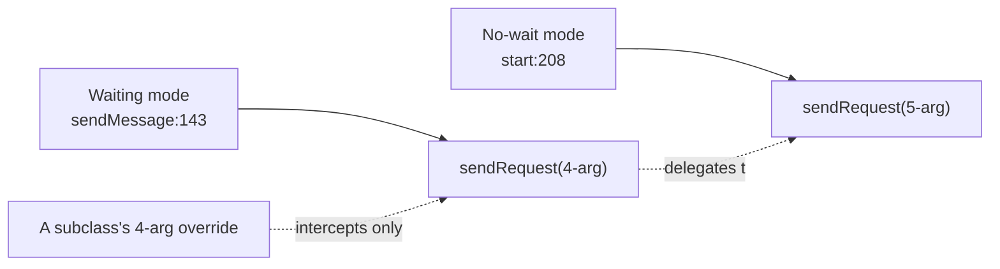

# Decision: accept and document that no-wait binary forwarding bypasses a 4-argument `sendRequest` override

**Decision.** In no-wait binary forwarding, `BinaryRequestProxyingHandler` calls
`NettyHttpClient`'s 5-argument `sendRequest(BinaryMessage, boolean, InetSocketAddress, Long, Consumer<Throwable>)`
directly. A subclass of `NettyHttpClient` that overrides only the 4-argument
`sendRequest(BinaryMessage, boolean, InetSocketAddress, Long)` is therefore **not** called
in that mode. This is accepted, not routed through an overridable hook, because no such
subclass exists in this repository. The place for the user-facing note is the Javadoc of
that 4-argument overload.

**Status:** Decided 2026-10-05 (owner). Closes performance-programme row 147.

**Scope since `forwardBinaryRequestsUseSingleConnection`.** Everything below is about forwarding one message per upstream connection, which is no longer the default: it applies only when `forwardBinaryRequestsUseSingleConnection` is `false`, or to a connection that setting forwards that way (one whose only upstream proxy is `forwardHttpProxy`). `forwardBinaryRequestsWithoutWaitingForResponse` is deprecated and is read only there. A connection given one upstream connection calls neither `sendRequest` overload: it connects through `NettyHttpClient.connectBinaryRelay`, so a subclass that overrides `sendRequest` to intercept binary sends is not called for it either.

## Context

Row 147 was found as a side effect of the fix for performance-programme row 111 (ordering
no-wait binary forwards; commit `33d29b2fc`). `BinaryRequestProxyingHandler.channelRead0`
(`mockserver/mockserver-netty/src/main/java/org/mockserver/netty/proxy/BinaryRequestProxyingHandler.java:72`)
forwards binary (non-HTTP) proxy traffic via `NettyHttpClient`, through `sendMessage`
(line 138):

- When `configuration.forwardBinaryRequestsWithoutWaitingForResponse()` is `false`,
  `sendMessage` (line 143) calls the pre-existing 4-argument
  `sendRequest(BinaryMessage, boolean, InetSocketAddress, Long)`.
- When it is `true`, `sendMessage` queues the request and `start` (line 208) calls the new
  5-argument `sendRequest(BinaryMessage, boolean, InetSocketAddress, Long, Consumer<Throwable>)`
  directly, because this mode needs to know when the request has actually been written to
  the upstream connection — information the 4-argument method's return value does not carry.

`NettyHttpClient` (`mockserver/mockserver-core/src/main/java/org/mockserver/httpclient/NettyHttpClient.java`)
declares:

- `sendRequest(BinaryMessage, boolean, InetSocketAddress, Long)` — the pre-existing
  4-argument overload, which delegates: `return sendRequest(binaryRequest, isSecure, remoteAddress, connectionTimeoutMillis, null);`
- `sendRequest(BinaryMessage, boolean, InetSocketAddress, Long, Consumer<Throwable>)` — the
  5-argument overload added for row 111, whose `onRequestSent` callback fires
  exactly once: with `null` once the request has been written, or with the failure cause.

`NettyHttpClient` is `public` and not `final`. Java method overriding only intercepts calls
made *through* the overridden signature: a subclass's override of the 4-argument method is
still reached from any caller of the 4-argument overload — it is *not* reached from
`start`'s no-wait call (line 208), because that call goes straight to the 5-argument
signature.

## Options considered

The row poses two choices directly: document it, or route no-wait forwarding through an
overridable hook shaped like the 4-argument method.

1. **Route no-wait forwarding through an overridable 4-argument-shaped hook too.** Not
   pursued: ordering no-wait forwards needs to know when each request has been written,
   which the 4-argument signature has no slot for. This reasoning is this record's own, not
   the row's — the row leaves the trade-off open.
2. **Document the gap and leave it**, having first verified it affects nobody today.
   **Chosen** — confirmed no subclass of `NettyHttpClient` overriding the 4-argument
   `sendRequest(BinaryMessage, ...)` exists anywhere in this repository (checked at decision
   time; grep for the method name across all modules). The row states the same: "No such
   subclass exists in this repository."

## Consequences

- An embedder who subclasses `NettyHttpClient` and overrides only
  `sendRequest(BinaryMessage, boolean, InetSocketAddress, Long)` will **not** see that
  override run for binary proxy traffic forwarded with
  `forwardBinaryRequestsWithoutWaitingForResponse=true`. The same override **is** reached
  for binary forwarding that waits for a response (`sendMessage`, line 143) and for any
  other caller of the 4-argument overload.
- To intercept binary no-wait forwarding, a subclass must override the 5-argument overload
  instead (or both).

## Documentation this decision requires

The accepted limitation is recorded here, in [request-processing.md → Binary Mock
Processing](../request-processing.md) (one sentence added there, linking this record), and
belongs as a Javadoc note on
`NettyHttpClient.sendRequest(BinaryMessage, boolean, InetSocketAddress, Long)`
(`mockserver/mockserver-core/src/main/java/org/mockserver/httpclient/NettyHttpClient.java`).
The wording for that Javadoc note:

> A subclass that overrides only this overload is not called when binary requests are
> forwarded without waiting for a response
> ({@code forwardBinaryRequestsWithoutWaitingForResponse}): {@code BinaryRequestProxyingHandler}
> then calls {@link #sendRequest(BinaryMessage, boolean, InetSocketAddress, Long, Consumer)}
> directly, so override that overload, to which this one delegates, to intercept every
> binary send.

This record does not track whether that note has been added; the Javadoc is
the source of truth.

## What would reopen this

- A real subclass of `NettyHttpClient` (in this repo or reported by a user/downstream
  project) that overrides the 4-argument `sendRequest(BinaryMessage, ...)` and is broken by
  this gap — the natural trigger to add the overridable hook from option 1.
- A broader refactor of `NettyHttpClient`'s binary overloads (e.g. collapsing them behind a
  builder or options object) that would resolve this as a side effect.

## Pointers

- `mockserver/mockserver-netty/src/main/java/org/mockserver/netty/proxy/BinaryRequestProxyingHandler.java`
  (`channelRead0`: line 72; `sendMessage`: line 138, 4-arg call at line 143; `start`: line
  204, 5-arg call at line 208)
- `mockserver/mockserver-core/src/main/java/org/mockserver/httpclient/NettyHttpClient.java`
  (the 4-argument and 5-argument `sendRequest(BinaryMessage, ...)` overloads)
- `BinaryRequestProxyingHandlerForwardOrderTest`, `BinaryRequestProxyingHandlerExceptionTest`
  (`mockserver-netty`)
