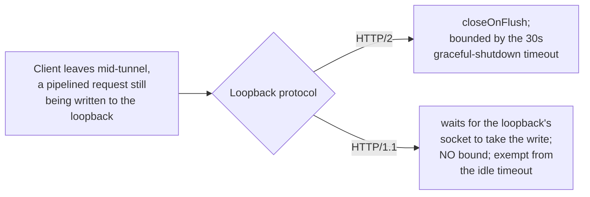

# Decision: accept the unbounded HTTP/1.1 tunnel loopback wait for a pipelined write

**Decision.** On an HTTP/1.1 CONNECT/SOCKS tunnel, nothing bounds how long
`UpstreamProxyRelayHandler` keeps the loopback connection open while a request the client
pipelined is still being written to it. This is accepted at its current (low) priority. It
is **not** given a bound of its own (such as the idle timeout). A real-socket integration
test for the behaviour is still wanted — that part is **not** closed by this decision and
remains tracked as a plan item (see below).

**Status:** Decided 2026-10-05 (owner) for the limitation. The test gap is open, not
decided. Closes the "accept" half of performance-programme row 156 (originally found
closing row 139, commit `aff3a4dcb`); the "add a real-socket test" half is carried forward.

## Context

`UpstreamProxyRelayHandler` leaves the loopback open until the last request write completes
or fails. On an HTTP/2 loopback the wait has the graceful shutdown's 30 s bound (once the
close has been asked, which itself waits for the loopback's outbound buffer to flush); on an
HTTP/1.1 loopback it lasts until the socket takes the request, so for as long as MockServer
does not read its side (a held breakpoint, a connection delay). The loopback leg MockServer
accepts is exempt from the idle timeout entirely — see
[netty-pipeline.md → Inbound Connection Bounds](../netty-pipeline.md#inbound-connection-bounds)
("the loopback leg MockServer accepts stays long-lived, so it is never closed on its own"),
and [→ Relay close](../netty-pipeline.md#relay-close) for how each leg closes once the tunnel
ends.

This already held when no response write failed; row 139's fix makes the failed-write path
share it instead of cutting the loopback at once and losing the request.

## Evidence

The row 139 review probed the HTTP/1.1 case on real sockets (cleartext CONNECT, an 8 MB
response never read, a 2 MB POST pipelined behind it, then half-close): received 0 of 4
before the fix and 4 of 4 after. That probe is not a committed test (only an
`EmbeddedChannel` test covers the HTTP/1.1 rule).

## Options considered

The row poses this as accepting the limitation, or giving the wait a bound of its own (the
idle timeout being the natural candidate):

1. **Give the HTTP/1.1 wait its own bound**, the idle timeout. Not chosen: applying it here
   would cut a pipelined request out from under a legitimately slow MockServer-side
   consumer (a held breakpoint, a configured connection delay).
2. **Accept it.** **Chosen**, at low priority.

## Consequences

- A loopback can stay open indefinitely while MockServer itself is slow to read it (a held
  breakpoint, `connectionDelay`), with a pipelined request still in flight. The row records
  this as low priority; it does not characterise the risk further.
- The correctness fix from row 139 (not losing a pipelined request when a response write
  fails) remains dependent on this wait existing; reopening this decision to add a bound
  must keep that guarantee.

## What would reopen this

- A reported case where this unbounded wait causes a problem.
- A case where the idle-timeout exemption on the loopback leg is itself revisited for other
  reasons, which would be a natural point to also reconsider bounding this wait.

## Still open (not closed by this decision)

**Add the real-socket HTTP/1.1 pipelined probe as an integration test.** The row 139
review's probe (cleartext CONNECT, 8 MB unread response, 2 MB pipelined POST, half-close,
0/4 before the fix and 4/4 after) was never committed as a test; only the `EmbeddedChannel`
unit test exists. This is carried forward as a plan item, not resolved by accepting the
limitation above.

## Pointers

- [netty-pipeline.md → Inbound Connection Bounds](../netty-pipeline.md#inbound-connection-bounds)
- [netty-pipeline.md → Relay close](../netty-pipeline.md#relay-close)
- `mockserver/mockserver-netty/src/main/java/org/mockserver/netty/proxy/relay/UpstreamProxyRelayHandler.java`
- `DownstreamProxyRelayHandlerWriteFailureTest.shouldLeaveTheLoopbackOpenForARequestStillBeingWrittenWhenAWriteFailsToAProxyClientThatHasGone`
  (`mockserver-netty`; the `EmbeddedChannel`-based coverage of the HTTP/1.1 rule referenced above)
