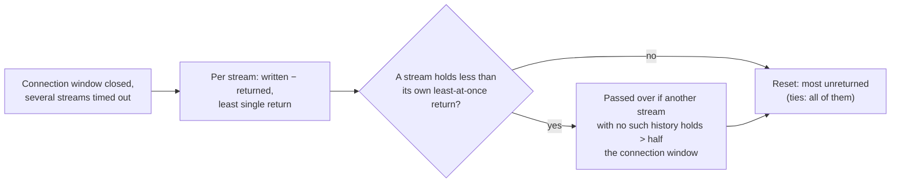

# Decision: accept the remaining HTTP/2 write-stall reset-pick limits

**Decision.** Three limits in how `Http2StreamWriteStallHandler` picks which stream to
reset under a closed connection window are accepted as the limit of what the server can
observe (or, for one, as the documented contract), not as open bugs to fix:

1. Five residual cases ((a) to (e) below) where the "most unreturned" pick can still be
   wrong because no stream-level signal distinguishes a healthy stream from a stalled one.
2. A client that returns one byte of window per check period keeps every open-windowed
   stream on its connection alive — accepted as the contract; no rate floor.
3. An HTTP/2 `SETTINGS_INITIAL_WINDOW_SIZE` overflow raised a Netty stream error instead
   of the RFC 9113 connection error, and the watcher did nothing about it as such.
   **No longer applies:** since Netty 4.2.19 the overflow is a connection error (see Row 127).

**Status:** Decided 2026-10-05 (owner). Closes performance-programme rows 107, 114 and 127.

## Context

`Http2StreamWriteStallHandler` resets the stream holding the most unreturned data among
those that have timed out while the connection's flow-control window is closed. Several
streams can time out together — most often one stalled stream beside consumed siblings,
but any number together — and it is this group the pick is made among. It counts, per
stream, data written less the window returned for it, and the least returned at once —
read where the decoder hands each `WINDOW_UPDATE` to the remote flow controller, on both the
frame-codec path and the relay's client leg. Found closing performance-programme #102
(commit `f2e6b49a9`); the pick was changed once since. See
[netty-pipeline.md → Response Write-Stall Timeout](../netty-pipeline.md#response-write-stall-timeout),
in particular the bold run-in paragraph *"Which stream is reset first"* within that section,
for the mechanism and its history.

## Row 107 — residual reset-pick cases

### What was measured

A Netty client in memory, 372 randomised scenarios (the scenarios are a reviewer's probes,
not in the repository) run against the previous rule and the current one (one or two
stalled streams, read not at all, to a cut-off, or in bursts; one to three consumed
streams):

| Stream window | Scenarios | Wrong before | Wrong after | Net |
|---|---|---|---|---|
| default | 125 | 2 | 2 (unchanged) | 0 |
| 100,000 B | 119 | 41 | 24 | 19 put right, 2 made wrong |
| 300,000 B | 128 | 56 | 50 | 8 put right, 2 made wrong |

42 further targeted default-window scenarios (a stalled stream that read a whole window at
once beside young consumed streams; a response arriving in parts) were right before and
after.

**Shown by tests:** the stalled stream alone reset and the consumed one completing for a
100,000-byte stream window (`Http2StreamWriteStallHandlerTest.shouldResetOnlyTheStalledStreamWhenAConsumedSiblingHoldsMoreOfTheConnectionWindow`
and its tunnel twin `...InsideATunnelWhenAConsumedSiblingHoldsMoreOfTheConnectionWindow`); a
grant ahead of the data
(`shouldResetAStalledStreamItsClientGrantedWindowBeyondTheInitialWindow` and
`...InsideATunnelItsClientGrantedWindowBeyondTheInitialWindow`) and a return at seven tenths
of a window (`shouldResetOnlyTheStalledStreamWhenItsClientReturnsAConsumedSiblingsWindowLate`
and `...InsideATunnelWhenItsClientReturnsAConsumedSiblingsWindowLate`), each on both paths;
two stalled streams of which the first holds more than half
(`shouldResetEachStalledStreamInTurnWhenTheOneHoldingTheConnectionWindowHoldsMoreThanHalfOfIt`);
a real Netty client at a 1 MiB stream window
(`ResponseWriteStallTimeoutIntegrationTest.shouldResetOnlyTheStalledHttp2StreamWhenItsClientLeavesMoreOfAConsumedStreamUnreturned`).

The scenario scripts are not in the repository; their counts are recorded in this table.

### Alternatives tried and rejected

- A first version added the unexplained streams' unreturned data up across streams, and so
  reset healthy streams at the default windows (a client returning at half a window leaves a
  stream it is consuming up to half a stream window unreturned before its first return,
  already returned at connection level; two such streams pass a summed gate).
- A gate that also adds up the unexplained streams that have each had a return was tried and
  made no difference in any scenario.

Both are why the rule treats one stream alone, never a sum across streams (see *Which
stream is reset first* in netty-pipeline.md, linked above, for the full "why one stream
alone, and why half" argument).

### The five residual cases

- **(a) Nothing returned yet for the consumed stream.** Until a client sends a stream-level
  `WINDOW_UPDATE` it sends the same frames whether it is consuming the stream or not, so
  two streams with nothing returned are told apart only by how much each was sent. A client
  that returns at half a window sends its first `WINDOW_UPDATE` after half a stream window
  is consumed, so a response shorter than that is always in this case. Pinned at 80,000
  (tie) and 200,000 (the consumed stream first).
- **(b) A stalled stream that looks consumed**, at a stream window above the connection
  window: a stream that stalls after its client has returned window for it, holding less
  than the least of those returns, is passed over for a consumed stream that has had none
  returned and has more than half the connection window unreturned; the previous rule reset
  the stalled stream first when it had the most unreturned. This is the one case that is
  new: it trades the old rule's wrong pick (a consumed stream with returns and more
  unreturned than the stalled one) for a different wrong pick. Reproduced with a Netty
  client at 200,000 and 300,000, and pinned by
  `Http2StreamWriteStallHandlerTest.shouldResetAConsumedStreamWithNoWindowReturnedBeforeAStreamThatStalledHoldingLessThanItsClientReturnedForIt`
  at 200,000 (stalled after 140,000 consumed, holding 66,272 with a smallest return of
  114,687, against 32,768 unreturned and nothing returned). Every scenario the change made
  wrong in the sweep above is this one. A client that returns a stream's window later than
  half (three quarters, say) can have 32,768–49,151 unreturned on a stream it is consuming
  and so reach (b) at equal windows; reasoned from the rule, not reproduced (0 made wrong, 4
  put right, in 257 late-return scenarios in review).
- **(c) A grant sent while data is unreturned** is taken as a return of that data.
  Read from the code, not tested.
- **(d) Several stalled streams, none holding more than half the connection window.**
  Unchanged: a consumed stream with more unreturned is reset first, because such streams
  look exactly like young consumed streams (which is why stalled streams' data is not added
  up across streams). Pinned at the default windows with three stalled streams. With two
  stalled streams, the one passed over can be the one whose reset would have freed the
  window (an explained stalled stream with most of its data unread beside an unexplained one
  whose unreturned data is mostly consumed); the mirror arrangement is put right. Both
  arrangements are argued, not reproduced: neither came up in 900 scripted default-window
  scenarios.
- **(e) A client that leaves more than half the connection window unreturned on consumed
  streams**: the pick is the most unreturned among all, as before. Reasoned.

Nothing in this area ran on Linux, and no HTTP/2 client other than Netty's own codec was
tried, for any of the five cases.

### Why accepted

Case (b) trades one wrong pick (the old rule's) for another (the new rule's), and the sweep
shows it putting right more scenarios than it breaks (19-for-2 at 100,000; 8-for-2 at
300,000). Whether real clients raise the stream window above the connection window at all,
and how nghttp2 or Go return window, would say how much either case matters — the row leaves
this as an open question, not a known frequency. Accepting this is explicitly a decision to
stop at the limit of what the server can observe from the frames it receives — not a claim
that the five cases could not be reasoned about further.

## Row 114 — one byte per period keeps a stream alive

Found closing performance-programme #106 and #109 (a client that took none of a stream's
data could keep it with `SETTINGS_INITIAL_WINDOW_SIZE` changes or 1-byte `WINDOW_UPDATE`s;
`Http2StreamWriteStallHandler` now counts the bytes written for a stream where they leave
the flow controller — commit `84b963cfb`). This one is by design since performance-programme
#72 (commit `6bc8f7af6`, which introduced `responseWriteStallTimeoutMillis` and the write-
stall watchers), and is the documented contract: **a client that takes some of the response
once per period is not affected.** Any data written for a stream is progress, and an
open-windowed stream counts as progressing while data is written for any stream on its
connection, because it may be waiting behind others by weight or priority. So a client that
lets one byte through per period (a 1-byte `WINDOW_UPDATE` with the connection window open,
a 1-byte connection `WINDOW_UPDATE`, or an initial window raised a byte at a time) keeps its
stream; and since a stream `WINDOW_UPDATE` opens a stream's window for free, one byte per
period on a connection keeps every stream on it (up to 100) with its queued response.
`WriteStallTimeoutHandler` has the same shape: one byte read per period keeps an HTTP/1.1
connection.

Pinned by `Http2StreamWriteStallHandlerTest.shouldNotResetAStreamWhoseClientTakesOneByteOfItBeforeEveryCheck`
(single-stream half) and
`ResponseWriteStallTimeoutIntegrationTest.shouldNotResetAnHttp2StreamQueuedBehindAStreamItsClientIsTaking`
(the open-window allowance). The two combined are reasoned from the code, not probed.
Nothing in this area has run on Linux since that change (`84b963cfb`) — macOS only; the
epoll-only integration test was skipped.

Rejected alternative: a minimum rate (bytes per period, or a cap on how long a stream may be
spared by other streams' data while releasing none of its own). Rejected because it would
also cut off a genuinely slow reader that MockServer serves correctly today — there is no
way from the frames alone to tell a deliberate one-byte trickle from a real client on a very
slow or constrained link.

## Row 127 — `SETTINGS_INITIAL_WINDOW_SIZE` overflow is a stream error, not a connection error

**Resolved upstream.** Netty 4.2.19's `DefaultHttp2RemoteFlowController` turns the overflow
into a connection error (`FLOW_CONTROL_ERROR`), so the connection is closed with a GOAWAY on
both the frame-codec path and the relay's client leg, and no stream is left with a window the
rise skipped. `Http2StreamWriteStallHandlerTest.shouldCloseTheConnectionWhenItsClientOverflowsAnEarlierStreamsWindowWithItsInitialWindow`
and its tunnel twin assert this (both fail on Netty 4.2.18). The text below records the
4.2.18 behaviour the decision was made on.

RFC 9113 §6.9.2 asks for a connection error (`FLOW_CONTROL_ERROR`) when a
`SETTINGS_INITIAL_WINDOW_SIZE` change would make a stream's flow-control window exceed
2³¹−1. Netty 4.2.18's `DefaultHttp2RemoteFlowController` instead raises a stream error at
the first stream whose window would overflow
(`FlowState.incrementStreamWindow`: `if (delta > 0 && Integer.MAX_VALUE - delta < window) throw streamError(...)`),
and `initialWindowSize`'s `forEachActiveStream` visitor applies the rise to the streams
visited before the overflowing one only, because the thrown exception stops the iteration.
MockServer inherits this via Netty's codec; it is not MockServer's own code.

**Low priority:** it harms only the misbehaving client's own connection, and the
stall-watcher consequence (a client exploiting the gap to extend a stream's timeout) is
already closed — the watcher counts only data written for a stream, see
[netty-pipeline.md → Response Write-Stall Timeout](../netty-pipeline.md#response-write-stall-timeout).

### Options considered

1. **Work around it in MockServer's own handler chain** — detect the overflow case and raise
   the RFC 9113 connection error ourselves, ahead of or instead of Netty's stream error.
2. **Accept it as a Netty limitation.** **Chosen.** No upstream Netty issue is known to
   have been filed; filing one is not part of this decision.

## Consequences

- The five cases in row 107 remain possible. Of the five, (c) and (e) are known only by
  reading the code (c) or by reasoning from the rule (e), not by testing; (d)'s
  two-stalled-stream arrangements (the mirror being the one put right) and (b)'s
  late-return variant at equal windows are known only by argument, not reproduced. A
  maintainer should not read "measured" into any of those four without re-running the
  scenario sweep this record describes.
- No rate floor will be added for the one-byte-per-period case (row 114); a genuinely slow
  reader is treated identically to a deliberate trickle, and that is intentional.
- The `SETTINGS_INITIAL_WINDOW_SIZE` overflow (row 127) was left to Netty, not
  special-cased; Netty 4.2.19 made it the RFC 9113 connection error.

## What would reopen this

- **Row 107:** a second HTTP/2 client implementation (e.g. nghttp2, Go's `net/http2`)
  measured against the same scenario sweep, to see whether real clients return window later
  than half, or raise their stream window above the connection window at all; or a Linux
  run of the existing sweep showing different results.
- **Row 114:** evidence that the one-byte-trickle contract is being exploited in practice
  (a DoS report), weighed against how many genuinely slow readers a rate floor would newly
  cut off.
- **Row 127:** nothing left to reopen: Netty 4.2.19 raises the RFC 9113 connection error.
  A Netty release that went back to a stream error would fail the two tests named above.

## Pointers

- [netty-pipeline.md → Response Write-Stall Timeout](../netty-pipeline.md#response-write-stall-timeout)
  (see *Which stream is reset first* within that section)
- `Http2StreamWriteStallHandlerTest` (unit scenarios, `mockserver-netty`)
- `ResponseWriteStallTimeoutIntegrationTest` (real-client integration, `mockserver-netty`)
