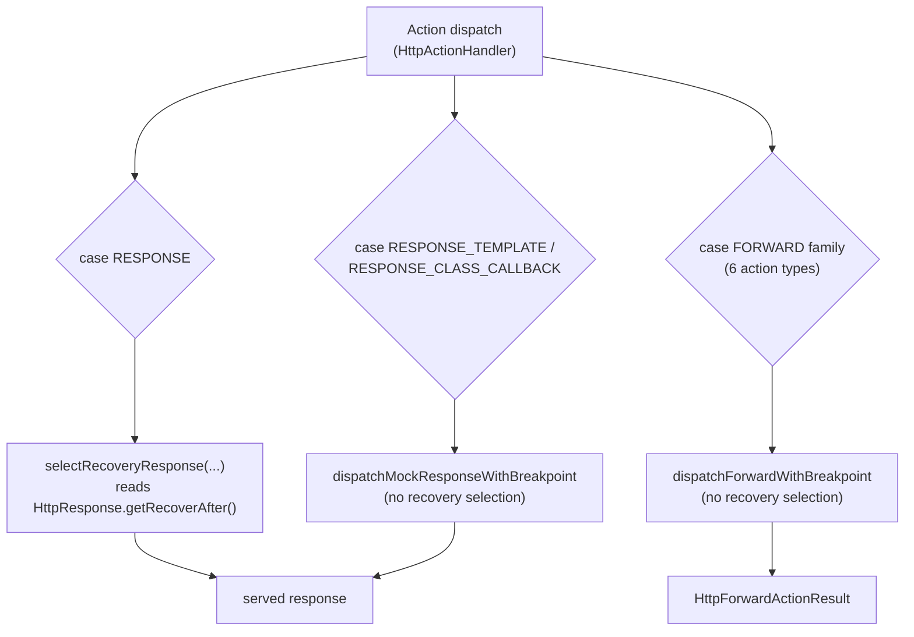

# Decision: `recoverAfter` stays `HttpResponse`-only

**Decision.** `recoverAfter` (fail the first N matches, then succeed) is not extended to
`FORWARD`-family actions. It stays a field on `HttpResponse` only, applied on the
`RESPONSE` action path. Extending it to forwards is deferred, not implemented
piecemeal, because the cost is an M–L cross-cutting change, not a small gap-fill.

**Status:** Decided 2026-07-21. Re-verified against code 2026-10-04 (`HttpActionHandler`,
`HttpResponse`, the five forward-action models). Revisit if the evidence below changes —
see [What would change this decision](#what-would-change-this-decision).

## Context

A 2026-07 feature-value review flagged `recoverAfter` coverage on `FORWARD` actions as
*partial/unverified* and asked whether the gap should be closed. `recoverAfter` already
works on the `RESPONSE` action: an expectation can be configured to answer with a
`failResponse` (default `503`) for the first N matches, then switch to its real response,
optionally keyed per client via an `idempotencyHeader` (tracked in
`RecoveryAttemptRegistry`). The question was whether the same clause should work on a
`FORWARD` expectation — "fail the first N forward attempts, then forward for real."

## The shape of the gap

`recoverAfter` is not a response clause with a forward blind spot — it is a capability
that exists only on `HttpResponse` and is read only from the two `case RESPONSE` arms in
`HttpActionHandler`. Nothing else in the dispatch tree looks at it.

## Evidence (verified against code)

- `getRecoverAfter()` / `withRecoverAfter(...)` are defined only on
  `org.mockserver.model.HttpResponse`. None of the forward action models —
  `HttpForward`, `HttpTemplate` (used for `FORWARD_TEMPLATE`),
  `HttpForwardValidateAction`, `HttpForwardWithFallback`,
  `HttpOverrideForwardedRequest` — declare the field.
- `HttpActionHandler.selectRecoveryResponse(...)` is called from exactly two sites, both
  inside a `case RESPONSE` arm (the early-response branch and the main dispatch path).
  `RESPONSE_TEMPLATE` (`HttpTemplate`) and `RESPONSE_CLASS_CALLBACK` (`HttpClassCallback`)
  dispatch straight through `dispatchMockResponseWithBreakpoint` with no recovery
  selection, because neither carries an `HttpResponse`.
- `HttpActionHandler.dispatchForwardWithBreakpoint(...)` is called from all six
  forward-family cases (`FORWARD`, `FORWARD_TEMPLATE`, `FORWARD_CLASS_CALLBACK`,
  `FORWARD_REPLACE`, `FORWARD_VALIDATE`, `FORWARD_WITH_FALLBACK`); none references
  `recoverAfter` or `selectRecoveryResponse`.
- A user cannot construct "a forward that fails N times then succeeds" today — the
  clause has no home on a forward expectation, let alone an unwired implementation.

## Options considered

1. **Port `recoverAfter` onto one forward action (e.g. `HttpForward`) as a quick win.**
   Rejected — this would ship an inconsistent surface where the clause works on one
   forward type and silently no-ops on the other five, which is worse than not having
   it, since it's not obviously advertised as partial.
2. **Add `recoverAfter` to every forward action model and thread recovery selection into
   all six `dispatchForwardWithBreakpoint` call sites.** This is the real scope of
   "support it on forwards." It needs the field, its DTO/serializer wiring, and a
   forward action's JSON schema to reference the existing `recoverAfter.json`
   sub-schema, on five forward-specific models plus the shared `HttpClassCallback`
   (used by both `RESPONSE_CLASS_CALLBACK` and `FORWARD_CLASS_CALLBACK` — adding the
   field there bleeds into the response side too). The six dispatch sites yield an
   `HttpForwardActionResult`, not an `HttpResponse`, so "serve `failResponse` for the
   first N, then forward" is a different shape from the response path, not a copy-paste.
   Viable, but M–L in size with its own round-trip tests per action type — not a small
   gap-fill, which is why it is deferred rather than done now.
3. **Fold "fail then recover" into the existing forward chaos surface
   (`HttpChaosProfile`: `errorProbability`, `errorStatus`, `dropConnectionProbability`,
   time/degradation windows, applied via `forwardChaos`) as a count-windowed variant,
   instead of adding a second mechanism.** Attractive because it avoids two overlapping
   ways to express almost the same thing, but it is a deliberate design decision (unify
   vs. duplicate), not a mechanical port, and was not designed in detail.

**Decision: neither 2 nor 3 is done now; both stay open options if this is picked up.**
Option 1 is rejected outright — it is not on the table even as a stopgap.

## Consequences

- A `FORWARD`-family expectation cannot use `recoverAfter` today. Its author must use
  `HttpChaosProfile`'s probabilistic fault injection, or forward to a stub upstream that
  itself fails the first N times, to get an equivalent effect.
- The same clause therefore behaves inconsistently across action families: it exists on
  `RESPONSE` and is entirely absent — not degraded, not partial — on every forward
  action and on `RESPONSE_TEMPLATE` / `RESPONSE_CLASS_CALLBACK`.
- No schema, DTO, or dispatch change is pending from this decision; it is a closed
  question until new evidence (see below) reopens it.

## What would change this decision

Pick this up as a single M–L unit with an explicit design gate first: decide whether
forward "fail-then-recover" is (a) a new `recoverAfter` field ported onto the forward
action models (option 2 above) or (b) a count-window extension of `HttpChaosProfile`
(option 3). If (a): add the field, its DTO/serializer wiring, and forward-action schema
references to the forward-specific models in one change (and decide how to treat the
shared `HttpClassCallback` used by `FORWARD_CLASS_CALLBACK`), thread a forward-shaped
recovery selection into every `dispatchForwardWithBreakpoint` call site, and add
per-action round-trip and behavioural tests mirroring the existing `RESPONSE`-path
recovery tests. Keep the `HttpResponse` semantics (1-based attempt count, optional
`idempotencyHeader` via `RecoveryAttemptRegistry`, default `503` `failResponse`)
identical so the clause behaves consistently across action families. A real user request
for forward-side `recoverAfter`, or a chaos-profile redesign that already touches
`forwardChaos`, would be the natural trigger to re-open this.
