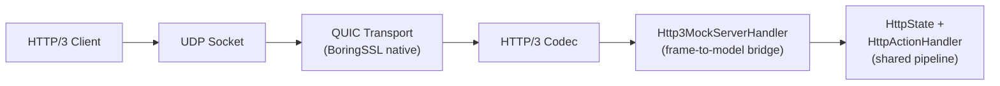
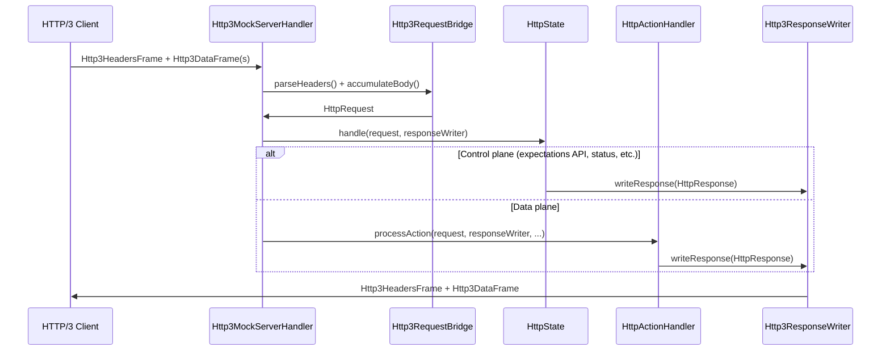
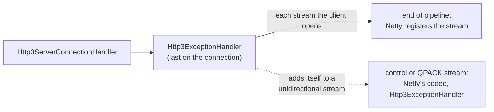
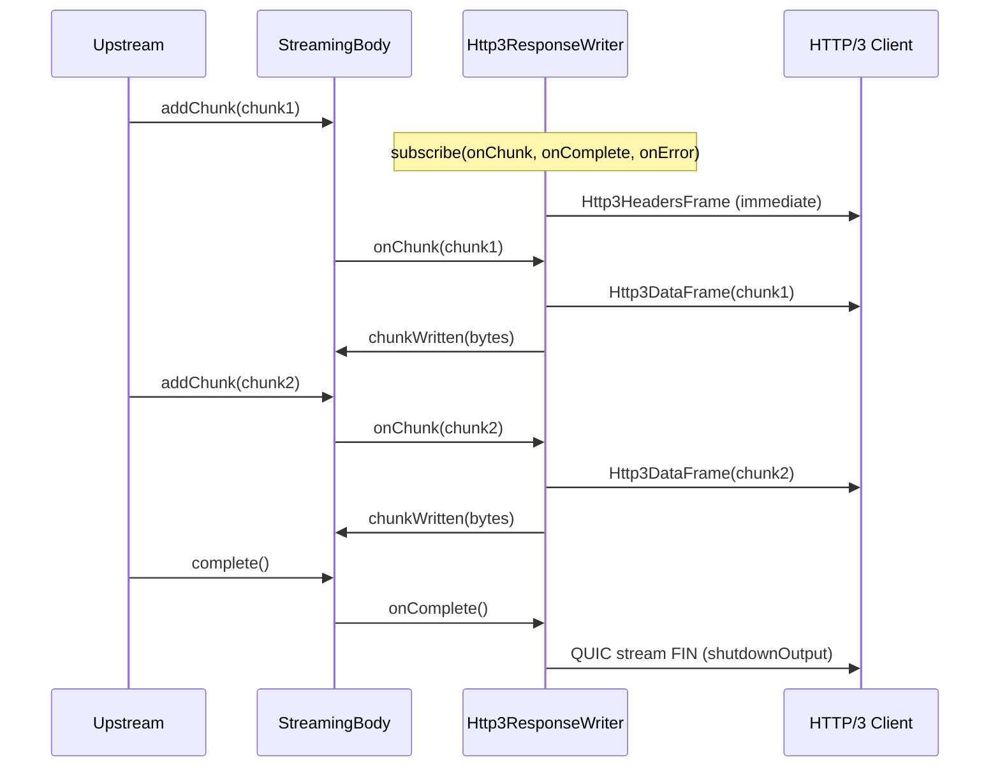

# Experimental HTTP/3 (QUIC) Support

## Status

**EXPERIMENTAL** -- HTTP/3 support is fully integrated with MockServer's request
pipeline (expectation matching, actions, recording, proxy forwarding). It is off
by default and must be explicitly enabled. The "experimental" label reflects the
fact that the underlying QUIC codec is still evolving, although it has now
graduated from the Netty incubator into the mainline Netty 4.2 release as
`io.netty:netty-codec-http3`.

## Getting the QUIC native library

**HTTP/3's native binaries do not ship in the default artifacts.** They are ~11 MiB across five
platforms — the largest single item in the standalone jar — for a feature that is experimental and
inert unless `http3Port` is set, so they are packaged separately and everyone else stops paying for
them.

The QUIC *classes* are still bundled, so nothing fails to load. When `http3Port` is set and the
native cannot be loaded, MockServer **refuses to start** and prints the fixes for this runtime (see
*Fail-fast startup* below), rather than starting a server that silently ignores the port it was told
to listen on.

| How you run MockServer | How to get HTTP/3 |
|---|---|
| Docker, Docker Compose, Kubernetes | the `mockserver/mockserver:<version>-http3` image (`snapshot-http3` for `master` builds); Helm `image.variant=http3` |
| Standalone jar | `mockserver-netty-<version>-jar-with-dependencies-http3.jar` instead of the default jar |
| Maven / Gradle | `org.mock-server:mockserver-netty` brings `io.netty:netty-codec-native-quic` for every platform transitively; add it explicitly only if you exclude it or manage Netty yourself (same version as the rest of Netty) |

**Why the published images need their own variant.** Every published image (standard, `-graaljs`,
`-clustered`, `-aot`) runs the SHADED `mockserver-netty-docker` jar (the `mockserver-netty-no-dependencies` jar with JNA unrelocated), which relocates Netty
to `shaded_package.io.netty`. Netty's `NativeLibraryLoader` then asks for a prefixed library —
`libshaded_1package_netty_quiche42_linux_<arch>.so` — while every published native (inside the shaded
jar itself, or in `netty-codec-native-quic`) is named `libnetty_quiche42_linux_<arch>.so`. So no
published image has ever served HTTP/3 (8.0.0 logged `native QUIC transport not available` and
ignored `http3Port`), and mounting the stock native jar into `/libs` does not help either. The same
applies to Maven users of `mockserver-netty-no-dependencies`.

**The `-http3` image** (`docker/http3/Dockerfile`) is layered `FROM` the standard image digest and
adds exactly one file: this architecture's quiche `.so`, installed in `/usr/lib` (on
`java.library.path`, which Netty tries first) under the name the base image's Netty asks for — derived
at build time from where `NativeLibraryLoader.class` sits in the base jar, with the same mangling
Netty applies. The bytes come from the base jar itself when it carries them (the shaded jar does, so
the version always matches); otherwise, for an unshaded base such as `docker/Dockerfile`, from
`netty-codec-native-quic-<netty version>-linux-<arch>.jar` on Maven Central, sha256-verified, with the
version read from the base jar's `META-INF/io.netty.versions.properties`. The build fails if the
result is not an ELF library for the target architecture. Loading from `/usr/lib` means nothing is
extracted to `/tmp`, so the image serves HTTP/3 under `--read-only`. See
[docker.md](../infrastructure/docker.md#http3-image-variant).

## Overview

MockServer can optionally listen for HTTP/3 requests over QUIC (UDP). HTTP/3
requests are routed through the same expectation matching, action handling,
recording, and proxy forwarding pipeline used by HTTP/1.1 and HTTP/2, providing
full protocol parity.



## How to Enable

Set the `http3Port` configuration property to a non-zero UDP port number:

| Method | Example |
|--------|---------|
| System property | `-Dmockserver.http3Port=8443` |
| Environment variable | `MOCKSERVER_HTTP3_PORT=8443` |
| Configuration API | `Configuration.configuration().http3Port(8443)` |

When `http3Port` is `0` (the default), the HTTP/3 listener is **not started** and
has zero impact on the existing TCP/HTTP server.

## Architecture

### Components

| Class | Module | Purpose |
|-------|--------|---------|
| `Http3Server` | `mockserver-netty` | Bootstraps the QUIC/HTTP3 server, manages lifecycle |
| `Http3MockServerHandler` | `mockserver-netty` | Per-stream handler: accumulates HTTP/3 frames, converts to HttpRequest, routes through the shared pipeline |
| `Http3RequestBridge` | `mockserver-netty` | Pure conversion helpers: HTTP/3 frames to/from HttpRequest/HttpResponse |
| `Http3RequestDecompressor` | `mockserver-netty` | Decompresses one `Content-Encoding` request body with the same `MockServerHttpContentDecompressor` HTTP/1.1 and HTTP/2 install, bounded by `maxRequestBodySize` on the decompressed size |
| `Http3ResponseWriter` | `mockserver-netty` | ResponseWriter subclass that serialises HttpResponse as HTTP/3 frames |
| `Http3StreamWriteStallHandler` / `Http3ConnectionWriteStallWatcher` | `mockserver-netty` | First in each request stream's pipeline when `responseWriteStallTimeoutMillis` is above 0: passes every write to QUIC in parts of at most 32 KiB, so a slow reader's progress shows whichever writer made the write, and resets a stream whose client takes none of its data for the timeout. One watcher per QUIC connection times its streams together, by the timeout its first watched stream read (see [netty-pipeline.md](netty-pipeline.md#response-write-stall-timeout)) |
| `Http3ListenerExceptionHandler` | `mockserver-netty` | Last handler of the UDP listener's pipeline, after Netty's QUIC codec: logs an exception that reaches it in MockServer's log, a repeated socket error once at `WARN`, and closes nothing (see [Exceptions on a connection](#exceptions-on-a-connection)) |
| `Http3ExceptionHandler` | `mockserver-netty` | Last handler of each QUIC connection's pipeline, after Netty's `Http3ServerConnectionHandler`, and of each control or QPACK stream a client opens: logs an exception that reaches it once in MockServer's log, and on the client's control stream lowers a `SETTINGS_QPACK_BLOCKED_STREAMS` Netty's encoder cannot take (see [Exceptions on a connection](#exceptions-on-a-connection)) |
| `Http3ConnectUdpHandler` | `mockserver-netty` | CONNECT-UDP (MASQUE, RFC 9298) relay; intercepts extended CONNECT requests with `:protocol=connect-udp` when `http3ConnectUdpEnabled=true`; opens a UDP channel to the target authority and relays datagrams bidirectionally. Destination-restricted by `http3ConnectUdpAllowedTargets` (allowlist) and `forwardProxyBlockPrivateNetworks` (SSRF block) |
| `SourceAddressQuicTokenHandler` | `mockserver-netty` | Source-address-validating QUIC retry token handler (HMAC-SHA256 over client IP + dcid); replaces Netty's forgeable `InsecureQuicTokenHandler` to mitigate address-spoofing / amplification |
| `GrpcHttp3Adapter` | `mockserver-netty` | Pure helper: detects gRPC content-type, decodes gRPC framing to JSON (reusing `GrpcFrameCodec` + `GrpcProtoDescriptorStore`), builds H3 HEADERS/DATA frames for gRPC responses with correct trailing HEADERS framing |
| `Http3GrpcResponseWriter` | `mockserver-netty` | `ResponseWriter` subclass that writes gRPC responses over H3 with initial HEADERS + DATA + trailing HEADERS (grpc-status) framing; also implements `GrpcStreamResponseWriter` for server-streaming responses |
| `Http3GrpcBidiStreamHandler` | `mockserver-netty` | Drives true bidirectional gRPC streaming over a single full-duplex QUIC stream (HTTP/3 analogue of `GrpcBidiStreamHandler`); driven incrementally by `Http3MockServerHandler` |
| `GrpcStreamResponseWriter` | `mockserver-core` | Transport-neutral seam `HttpActionHandler` uses to delegate `GRPC_STREAM_RESPONSE` writing to the HTTP/3 writer (HTTP/2 keeps using `GrpcStreamResponseActionHandler`) |
| `GrpcStreamMessageEncoder` / `GrpcBidiRuleMatcher` | `mockserver-core` | Shared encoding + rule-matching helpers so HTTP/2 and HTTP/3 streaming behave identically |
| `Configuration.http3Port()` | `mockserver-core` | Configuration property |
| `ConfigurationProperties.http3Port()` | `mockserver-core` | Static/system-property access |
| `Configuration.http3MaxIdleTimeout()` | `mockserver-core` | QUIC max idle timeout (ms) |
| `Configuration.http3InitialMaxData()` | `mockserver-core` | Connection-level flow control (bytes) |
| `Configuration.http3InitialMaxStreamDataBidirectional()` | `mockserver-core` | Per-stream flow control (bytes) |
| `Configuration.http3InitialMaxStreamsBidirectional()` | `mockserver-core` | Max concurrent bidirectional streams |
| `Configuration.http3QpackMaxTableCapacity()` | `mockserver-core` | QPACK dynamic table capacity (bytes, 0 = disabled) |
| `McpRequestProcessor` | `mockserver-netty` | Transport-neutral MCP JSON-RPC processor shared by TCP (`McpStreamableHttpHandler`) and HTTP/3 (`Http3MockServerHandler`) paths |
| `AltSvcHeaderHandler` | `mockserver-netty` | Outbound handler that adds `Alt-Svc: h3=":<http3Port>"; ma=<maxAge>` to TCP (HTTP/1.1 + HTTP/2) responses when HTTP/3 is enabled; does not clobber user-set Alt-Svc headers |
| `Configuration.http3AltSvcMaxAge()` | `mockserver-core` | Max-age in seconds for the Alt-Svc header (default 86400) |
| `Configuration.http3AdvertiseAltSvc()` | `mockserver-core` | Whether to advertise Alt-Svc on TCP responses (default true) |

### Request Processing

HTTP/3 requests flow through the same pipeline as HTTP/1.1 and HTTP/2:



### Exceptions on a connection

**An exception on an HTTP/3 connection, or on one of the streams Netty's codec keeps for itself, is logged once in MockServer's log.** Netty's `Http3ServerConnectionHandler` handles no exception, so whatever QUIC fires on a connection used to reach the end of Netty's pipeline, which logs it at `WARN` with a stack trace through Netty's own logger. The same held for a client's control stream and QPACK streams, whose pipelines hold only Netty's handlers.



| What reached it | Logged |
|-----------------|--------|
| Netty's direct memory limit | `ERROR`, the message the other handlers use; the channel is closed |
| An `Http3Exception` (a connection error Netty's codec fires before it closes the connection with the error code) | `WARN`, the client's address, the error code and the cause |
| An `SSLException` (a failed handshake, such as a client that offers no ALPN protocol MockServer serves) | `WARN` for the first from a client address, `DEBUG` after that, by the server's `ClientTlsHandshakeFailureLog` (see [tls-and-security.md](tls-and-security.md#a-clients-failed-tls-handshake)); the client's address, the bounded message and a probable cause, no stack trace (Netty builds the exception from an error code) |
| A client's close of the connection with a TLS alert (a `QuicConnectionCloseEvent` whose `isTlsError()` is true, such as a client that does not trust MockServer's Certificate Authority), which fires no exception | As the row above, with the alert's number and name as the reason; the event is passed on |
| An SSL or decoder fault (`isSslOrDecoderFault`), such as a frame Netty's codec throws on | `WARN`, the client's address, the exception's class and its bounded message; no stack trace. Tested ahead of the next row, whose check is also `false` for every decoder fault |
| A stream its client reset (`QuicStreamResetException`), a closed channel, a reset connection | `DEBUG`, the client's address and the message |
| Any other `QuicException` (a QUIC transport error) | `WARN`, the client's address and the bounded message |
| Anything else | `ERROR` and the cause |

It closes nothing except for the direct memory limit: Netty closes the connection for a failed handshake, a QUIC error and an HTTP/3 connection error, and a stream its client reset is no reason to. A frame the codec throws on closed nothing before this handler existed and closes nothing now (the test's connection carries on and is still served), so a client can cause one `WARN` for each such frame, where it caused one Netty warning with a stack trace.

**Streams.** The handler sees each stream a client opens as it passes to the end of the connection's pipeline, where Netty registers it, and adds a second instance to a unidirectional one. It leaves a request stream alone: `Http3MockServerHandler` is the last handler there and takes every exception, and anything added at that point would sit ahead of it. On the control stream the instance ends up between Netty's frame codec and its control-stream handler, which is enough for what the codec fires (a frame type the stream may not carry, for example). Both instances are shared by every connection of the server, and hold no state but the server's log of failed handshakes, so the cost is one pipeline context a connection and one for each unidirectional stream, of which a client may open three.

**Request streams.** `Http3MockServerHandler` logs a request stream its client reset (`QuicStreamResetException`) or a closed stream channel at `DEBUG`, with the client's address and the message, and closes the stream, as the row above does for any other stream; a client that abandons a request part-way through its body is an ordinary event. Over TCP a reset connection logs nothing. Any other exception on a request stream except an oversized header section is still `WARN` with its stack trace. An exception from data-plane processing (`HttpActionHandler.processAction`) is logged once at `ERROR` with a correlation id and the stack trace, and, unless the stream already carries a response, answered `500` with the generic body naming the correlation id, as over HTTP/1.1 and HTTP/2, or on the gRPC path the gRPC `INTERNAL` status with that message (`Http3MockServerHandlerTest`).

**CONNECT-UDP streams.** `Http3ConnectUdpHandler` takes the server's `MockServerLogger`, so each of its entries reaches MockServer's log, its level and the event log the dashboard shows. A reason that can hold the client's `:authority` is cut to 256 characters, and an exception's message is bounded as the other handlers bound it.

| Entry | Logged |
|-------|--------|
| A tunnel requested, then established | `DEBUG`, then `INFO`, with the client's address and the target |
| A refused request (a missing or malformed `:authority`, `400`) or target (allowlist, private-network block, unresolvable, `403`) | `WARN`, the client's address and the reason; the client sees only the generic body |
| The relay socket failed to bind or connect (`502`) | `ERROR` and the cause |
| The relay socket failed later, such as the target's ICMP port unreachable | `WARN`, the target, the client's address and the exception's class and message; a stack trace only for an exception that is not a `SocketException`. The socket is closed |
| A DATA frame after that, which is dropped; a datagram that could not be sent; the relay socket closed | `DEBUG` |
| The client reset its CONNECT-UDP stream (`QuicStreamResetException`) or a closed stream channel | `DEBUG`, the client's address and the message; the stream is closed, as for a request stream |
| Any other exception on a CONNECT-UDP stream | `WARN`, the client's address, the bounded description and the cause |

**The UDP listener.** The listener's pipeline holds Netty's QUIC codec, which takes no exception, followed by `Http3ListenerExceptionHandler`, one per listener. It closes nothing itself, and logs by what Netty's NIO datagram channel (`Http3Server` uses it on every platform) does after a read error (`NioDatagramChannel.closeOnReadError`):

| What reached it | Netty after a read error | Logged |
|-----------------|--------------------------|--------|
| A `PortUnreachableException` (a client that has gone, reported by ICMP) | keeps reading | `DEBUG` |
| Any other `SocketException` | keeps reading, so it can recur with each datagram | the first of each class on a listener at `WARN`, with the class and message and no stack trace; any more at `DEBUG` |
| Netty's direct memory limit | closes the listener | `ERROR` with a hint, no stack trace |
| Anything else (another `IOException`, an error) | closes the listener, which ends HTTP/3 on that port | `ERROR` with the cause |

Netty's epoll datagram channel closes on no read error, but `Http3Server` does not use it. The codec still catches a packet it cannot process and logs it through Netty's logger at `DEBUG`.

**The streams MockServer's side opens** (its own control and QPACK streams) have no MockServer handler: Netty creates each with its handler in place and registers and activates it in the same call (`QuicChannel.createStream`), without passing it down the connection's pipeline, so Netty 4.2.18 offers no point at which to add one before the stream can fire an exception. Only one exception is known to be fired there: the QPACK encoder stream's `QPACK_ENCODER_STREAM_ERROR`, when `http3QpackMaxTableCapacity` is above 0 and the client's `SETTINGS_QPACK_BLOCKED_STREAMS` is more than an `int` holds, which RFC 9204 allows (up to 2^62-1) but Netty's encoder does not take. Netty logged it at `WARN` with a stack trace and closed the connection. The stream instance on the client's control stream sits ahead of Netty's control-stream handler, so it lowers such a value to `Integer.MAX_VALUE` before Netty acts on it and logs that once at `DEBUG`; an encoder may always block fewer streams than the client allows, so the connection is served. The local streams read nothing (a local unidirectional stream's input is shut down by spec), and the control stream's own failures close the connection without firing one. The legacy echo mode's request streams (the no-argument `Http3Server` constructor, which only tests use) are left as they were.

`Http3ConnectionErrorLoggingIntegrationTest` checks, with a QUIC client that has no HTTP/3 codec, that nothing reaches Netty's logger for a handshake that offers another ALPN protocol, a frame type reserved for HTTP/2 on the control stream (the connection is still closed with `H3_FRAME_UNEXPECTED`), a `SETTINGS` frame whose `ENABLE_CONNECT_PROTOCOL` is 2, which Netty's codec throws on (the connection carries on), a reset unidirectional stream (the connection carries on), and a request stream its client resets part-way through its body (one `DEBUG` entry, no `WARN`, and the connection still serves the next request). `Http3QpackBlockedStreamsIntegrationTest` checks, with such a client against a server whose dynamic table is enabled, that a request is served, the connection stays open and nothing reaches Netty's logger. `Http3ExceptionHandlerTest` checks each row and the limit, `Http3MockServerHandlerTest` the request stream's levels, and `Http3ListenerExceptionHandlerTest` and `Http3ListenerExceptionLoggingIntegrationTest` (an exception fired on a real listener reaches MockServer's log, not Netty's, a repeated socket error is one `WARN`, and the listener stays open) the listener's. `Http3ConnectUdpLoggingIntegrationTest` checks with a real client that a tunnel's entries reach MockServer's log and event log, that a client's reset of its tunnel is `DEBUG` with no `WARN`, that a refused target is `WARN`, and that a target with nothing listening fails the relay socket with one `WARN` and no stack trace, after which a frame is dropped at `DEBUG`; `Http3ConnectUdpHandlerTest` checks each row and the bounds.

### Streaming Response Path

When the response carries a `StreamingBody` (SSE, chunked proxy forwarding, LLM
streaming), `Http3ResponseWriter` sends the headers immediately and subscribes
to the body to forward each chunk as an HTTP/3 DATA frame:



Key design points:
- **Same matching**: uses `HttpState.firstMatchingExpectation()` and `HttpActionHandler.processAction()` -- identical to HTTP/1.1 and HTTP/2
- **Same recording**: requests are logged in `MockServerEventLog` for verification
- **Same proxy forwarding**: unmatched requests can be forwarded when configured
- **Body handling**: `Http3RequestBridge` decodes every request body with `BodyDecoderEncoder.bytesToBody` and the request's `Content-Type`, as the HTTP/1.1 and HTTP/2 mapper does, so the body type (JSON, XML, string or binary), its charset and its raw bytes are the same on all three protocols. A `text/*` body with no charset is read as ISO-8859-1 for matching, as on HTTP/1.1 and HTTP/2. An uncompressed body's raw bytes are the bytes received, so it is forwarded byte-identical
- **Request decompression**: a body with a `Content-Encoding` that HTTP/1.1 decodes (`gzip`, `x-gzip`, `deflate`, `x-deflate`, `snappy` in either its raw block or its framing format, and `zstd` / `br` when their native libraries are on the classpath) is decompressed by `Http3RequestDecompressor`, which runs the same `MockServerHttpContentDecompressor` over each DATA frame in 8 KiB slices, so the request is the one HTTP/1.1 builds: the decompressed body is matched, the wire bytes are kept as its original body, `content-length` (when sent) becomes the decompressed size and `content-encoding` is kept, moved after the other headers. A forward then treats the body exactly as an HTTP/1.1 forward does: an unchanged body is forwarded as the wire bytes, and a changed one is encoded again (see [request-processing.md](request-processing.md#bodies-with-a-content-encoding)). `maxRequestBodySize` bounds the decompressed size as well as the wire size (413 when over; a raw Snappy block that declares more is refused as corrupt before it is decoded, on every protocol), and a body that fails to decompress closes the request stream without a response, as HTTP/2 resets the stream and HTTP/1.1 closes the connection. A list of codings, `identity` or an unknown coding is not decompressed, on any protocol
- **Streaming support**: `Http3ResponseWriter` subscribes to `StreamingBody` and forwards each chunk as an HTTP/3 DATA frame with backpressure, matching the pattern used by `NettyResponseWriter` for HTTP/1.1
- **A response to `HEAD`**: RFC 9110 section 9.3.2 gives a response to `HEAD` no content, so when the request was `HEAD`, `Http3ResponseWriter` writes the header section a `GET` is sent (keeping a static response's `content-length`; a streamed one has none, as for `GET`) and ends the stream with it: no DATA frame and no trailers. A streamed body is discarded as it arrives (each chunk still reported to `chunkWritten`) and its upstream closed. `Http3MockServerHandler`'s own responses, the MCP result and the 413 for an oversized body, do the same. `Http3HeadResponseIntegrationTest` compares HEAD with GET over a real QUIC connection; the HTTP/2 equivalent is in [netty-pipeline.md](netty-pipeline.md). gRPC (`Http3GrpcResponseWriter`) is left as it is: a gRPC call is always `POST`

### Lifecycle Integration

The HTTP/3 server is started automatically by `MockServer.createServerBootstrap()`
when `http3Port > 0`. It is stopped during `MockServer.stopAsync()`. The lifecycle
mirrors how the DNS mock server is conditionally started.

**Fail-fast startup**: if the QUIC native is not available, `MockServer.requireQuicNative()`
throws `Http3NativeUnavailableException` (an `IllegalStateException`). Its message names every fix
for THIS runtime: the image tag for this MockServer version (`snapshot-http3` for a `-SNAPSHOT`),
the Helm value, the `-http3` jar name, and the `netty-codec-native-quic` coordinate with the Netty
version on the classpath (`io.netty.util.Version.identify()`, falling back to the build-time
`Version.getNettyVersion()` because the shaded jar strips Netty's version resources) and the
platform classifier from `PlatformDependent`. Under relocated Netty it says to depend on
`mockserver-netty` instead, since the stock native cannot load there; on a platform with no published
native it offers only the container. When a native under the name this Netty asks for IS present
(a classpath resource, a `java.library.path` directory, or `/usr/lib` where the `-http3` image puts
it) the message instead says it is present but failed to load, so a different image or jar will not
help — otherwise a `-http3` user with a broken `java.library.path` would be told to use the image
they are running. Every variant ends with one `underlying error: <root cause simple name>: <first
message line>` line. The CLI (`Main.logStartupFailure`) prints the message alone,
without the stack trace or Netty's nested `UnsatisfiedLinkError`s. It is called at the TOP of
`createServerBootstrap`, before `bindServerPorts` — and that ordering is load-bearing, not
incidental. The throw escapes the constructor, so the caller never receives a reference and can
never call `stop()`; anything already allocated would be orphaned for the life of the JVM. Embedded
users (`MockServerRule`, the JUnit 5 extension, Spring) run long-lived JVMs and would leak a
listening socket per failed construction. It also calls `stop()` before rethrowing, because
`LifeCycle`'s constructor has already created the boss/worker event-loop groups by then — hoisting
alone does not release those.
This replaced a fail-soft path that logged a warning and continued — which was defensible while the
native shipped in every jar and the only way to hit it was an unsupported platform, but became a
silent misconfiguration once the natives moved to their own classifier: the user set a UDP port and
got a server that never listened on it. `startHttp3Server` asserts the check ran, so a future second
call site cannot reinstate the silent-disable behaviour. See *Getting the QUIC native library*.

**Any other failed HTTP/3 start refuses start-up too.** `MockServer.startHttp3Server` runs after the TCP
ports are bound. If `Http3Server.start` throws for any reason, it calls `stop()` and throws
`Http3StartupException`, so the constructor fails as it does for a TCP port that cannot be bound
(`RuntimeException("Exception while binding MockServer to port N", cause)`). `stop()` closes the TCP
listeners, the DNS channel and the boss and worker event loops and waits for them; `Http3Server.start`
shuts down its own event loop when it fails, with no quiet period, and waits for it as `stop()` does (up
to 5 s, then a warning), so its thread, which is not a daemon, has ended when the constructor throws.
With Netty's default 2 s quiet period it outlived the refusal, and an embedded JVM waited for it to exit. Before that shutdown, the channel of a bind that failed or was interrupted is closed and the start waits for a task queued from the loop after the close: the QUIC codec frees the direct buffer it allocates when added only when Netty tears the pipeline down, on a task the close queues, and a loop shut down with no quiet period can end without running it. Without that, the first start in a JVM that was interrupted while it bound leaked the buffer every time, and later ones did not, so `Http3StartFailureTest.shouldLeakNoBufferWhenTheFirstHttp3StartInAJvmIsInterruptedWhileItBinds` makes that start in a fresh JVM under the build's leak detector and reads the count of leaks it reports.
`Http3StartFailureTest` checks that no non-daemon thread is left 500 ms after the throw (Netty's process-wide `globalEventExecutor` thread, which no server owns and which ends a second after its last task, is not counted), for a refusal before the bind
and for a failed bind. The caller gets no reference, so nothing may be left for it to stop.
The catch is for `Throwable`: an `Error` from the start (a native that will not link) refuses and stops
as well. `stop()` does not wait on an interrupted thread, so every refusal path in `MockServer` (the
QUIC native check, a TCP bind, DNS and HTTP/3) stops through one private method that clears the
interrupt flag for the stop and sets it again after it. Only the flag counts: an `InterruptedException`
in the cause chain can come from another thread (a future's failure), so a wait of the starting thread
that is interrupted sets the flag again where it is caught (the TCP bind in `LifeCycle.bindPorts`, the
UDP bind in `Http3Server`, which waits with `await()` rather than `sync()` because `sync()` also rethrows
a failed bind's cause). The held port is most often another
MockServer given the same `http3Port`; before, the first served HTTP/3 and the rest served TCP only.

| Failure | Message (one line, the cause kept as `getCause()`) | CLI output |
|---|---|---|
| The UDP port cannot be bound (a `BindException` in the cause chain: the port is held, the macOS IPv4 probe refused it, or the process may not bind it, since the JDK maps `EACCES` to `BindException: Permission denied`) | `HTTP/3 is enabled (http3Port=N) but UDP port N could not be bound, so MockServer cannot start: free the port if another application holds it, choose a different http3Port, or remove http3Port to run without HTTP/3 (underlying error: BindException: ...)` | The message alone, exit status 1 |
| Anything else (the TLS context for QUIC cannot be built, a port above 65535, a transport parameter the codec rejects) | `HTTP/3 is enabled (http3Port=N) but its server could not start on UDP port N, so MockServer cannot start: fix the underlying error or remove http3Port to run without HTTP/3 (underlying error: <root cause simple name>: <first message line>)` | `exception while starting:` with the stack trace, exit status 1 |

`Http3StartupException` extends `RuntimeException` and nothing narrower, whatever its cause:
`Main.RunCommand` treats an `IllegalArgumentException` as a usage error and exits 0, which an
out-of-range `http3Port` would otherwise reach. `MockServer` does not log the failure itself (the TCP
path logs it at ERROR and the CLI then logs it again); the exception is the report, and the CLI prints
it once. Embedded callers get the exception from `new MockServer(...)`,
`ClientAndServer.startClientAndServer(...)`, `MockServerRule`, `MockServerExtension` and the Spring
`MockServerPropertyCustomizer`, none of which catch it. An `http3Port` of 0 or below still means
HTTP/3 is off, so there is no ephemeral HTTP/3 port to fail on.

This replaced a path that logged `exception starting HTTP/3 server on port N - HTTP/3 disabled` at
WARN and kept serving TCP with `getHttp3Port()` returning -1. `Http3StartFailureTest` covers both
rows (a port held on IPv4, a port held by a dual-stack socket so that the bind itself fails on every
platform, a port above 65535, an unparsable mTLS trust chain, an `Error`, an interrupt, a failure on an
interrupted thread, and a DNS port bound before the refusal, which must be free at the throw) and
`ClientAndServer`. `RefusedStartOnAnInterruptedThreadTest` covers the TCP and QUIC native refusals on an
interrupted thread; the shared harness is `org.mockserver.lifecycle.RefusedStart` in the test sources. `Permission denied` is not exercised: macOS lets any process bind a low port. On the
starting thread, as soon as the constructor has thrown, it checks that the stop is complete (not merely
begun), that the TCP port refuses connections and that the UDP port can be bound again. It runs each start in a thread group of its own and then
waits until no thread of that group is alive, bar the JDK `HttpClient` selector thread every
`HttpState` creates for cluster fan-in, which outlives a normal `stop()` as well.
`MainTest` covers the exit status and the CLI output; `Http3NativeStartupIntegrationTest` runs the real
`-http3` jar against a held port. A test that needs HTTP/3 must not configure a fixed `http3Port`
(`AltSvcIntegrationTest` used 8443 and 443): a port it cannot bind now fails the test.

The bound HTTP/3 port is accessible via `MockServer.getHttp3Port()`.

**Stop releases the port before it returns.** A Netty NIO channel's socket is closed only when its event
loop deregisters it, not when `close()` completes, so `Http3Server.stop()` also waits (up to 5 s, quiet
period 0) for the server's own event-loop group to terminate, and logs a warning naming the port if it
does not. Before, an immediate restart on the same
port failed with `Address already in use` on most attempts, on macOS and Linux alike.
`Http3ServerIpv4PortConflictTest.shouldReleaseAStoppedPortForAnImmediateRestart` restarts 25 times in one
JVM.

### Alt-Svc Auto-Discovery

When `http3Port > 0` and `http3AdvertiseAltSvc` is `true` (the default), MockServer
automatically adds an `Alt-Svc` header to every response served over the TCP
(HTTP/1.1 and HTTP/2) paths:

```
Alt-Svc: h3=":<http3Port>"; ma=<http3AltSvcMaxAge>
```

This follows RFC 7838 and tells HTTP/3-capable clients that a QUIC endpoint is
available on the same host. Clients that support HTTP/3 will automatically
upgrade to QUIC on subsequent requests, with transparent fallback to HTTP/2 or
HTTP/1.1 if QUIC is unavailable.

```mermaid
sequenceDiagram
    participant C as HTTP Client
    participant TCP as MockServer TCP
    participant H3 as MockServer HTTP/3

    C->>TCP: GET /api (HTTP/1.1 or HTTP/2)
    TCP->>C: 200 OK + Alt-Svc: h3=":8443"; ma=86400
    Note over C: Client caches Alt-Svc
    C->>H3: GET /api (HTTP/3 over QUIC)
    H3->>C: 200 OK
```

**Design decisions:**

- The `AltSvcHeaderHandler` is a `@Sharable` `ChannelDuplexHandler` added to the
  outbound pipeline at the same point as `TraceContextHandler` in all three TCP
  switch paths (`switchToHttp`, `switchToHttp2`, `switchToH2c`) and in the HTTP/2
  multiplex child initializer.
- The handler intercepts outbound `HttpResponse` writes (MockServer model objects,
  before they are converted to Netty wire format) and adds the header if not already
  present.
- A user-set `Alt-Svc` header in an expectation is never overwritten.
- The handler is NOT added on the HTTP/3 (QUIC) response path itself, since there
  is no point advertising h3 to an h3 client.
- When `http3Port` is `0` (default) or `http3AdvertiseAltSvc` is `false`, no handler
  is added and behaviour is byte-for-byte unchanged.

| Property | Default | Env var | System property |
|----------|---------|---------|-----------------|
| `http3AltSvcMaxAge` | `86400` (24 hours) | `MOCKSERVER_HTTP3_ALT_SVC_MAX_AGE` | `mockserver.http3AltSvcMaxAge` |
| `http3AdvertiseAltSvc` | `true` | `MOCKSERVER_HTTP3_ADVERTISE_ALT_SVC` | `mockserver.http3AdvertiseAltSvc` |

### TLS

The HTTP/3 server uses MockServer's configured TLS certificate material -- the same
private key and certificate chain used by the HTTPS server. This is obtained via
`KeyAndCertificateFactoryFactory.createKeyAndCertificateFactory()`, which respects
the `privateKeyPath`, `x509CertificatePath`, and other TLS configuration properties.

If no configuration is provided (legacy/echo mode), the server falls back to
generating a self-signed EC certificate using BouncyCastle. This certificate is
simultaneously trust anchor *and* server certificate and has no renewal loop
behind it, so it deliberately keeps the long **10-year** CA-style validity
(`KeyAndCertificateFactory.CERTIFICATE_VALIDITY_YEARS`) rather than the short
397-day leaf validity used on the configured path — a short-lived self-signed
anchor with nothing to renew it would simply expire the echo endpoint. It is
otherwise brought up to standard: a 5-day back-dated `notBefore` (clock-skew
tolerance), a positive serial (RFC 5280 §4.1.2.2), a SAN covering
`localhost` / `127.0.0.1` / `::1`, a `serverAuth` (+ `clientAuth`)
`extendedKeyUsage`, and a TLS-server `keyUsage`. The configured path
(`configuration != null`) instead goes through the real
`KeyAndCertificateFactory` and gets the hardened short-lived leaf.

### Metrics

When metrics are enabled, HTTP/3 requests increment the `REQUESTS_RECEIVED_COUNT`
counter, consistent with HTTP/1.1 and HTTP/2 request counting.

## Native QUIC Platform Requirement

The QUIC transport requires a native BoringSSL library. The
`netty-codec-http3` dependency transitively pulls in
`netty-codec-native-quic` with classifier-specific JARs.

### Supported platforms

- `linux-x86_64`
- `linux-aarch_64`
- `osx-x86_64`
- `osx-aarch_64`
- `windows-x86_64`

### CI native classifier note

The Maven dependency is declared without a platform classifier, relying on the
transitive resolution from `netty-codec-http3`. This brings in native
libraries for all supported platforms. If the shaded/uber JAR build strips
native libraries (e.g., via maven-shade-plugin filters), ensure the QUIC natives
are included for the target platform.

### Test skip behavior

The `Http3ServerTest` checks `Quic.isAvailable()` at test startup and uses
JUnit 4's `Assume.assumeTrue(...)` to skip gracefully on platforms where the
native library cannot be loaded. The tests will **never fail the build** due to
platform incompatibility.

The missing-native path runs everywhere anyway: `Http3NativeUnavailableExceptionTest` asserts the
message for each case, and `Http3NativeStartupIntegrationTest` boots the real default jar (no native)
with `http3Port` set and asserts it exits non-zero printing every fix and no stack trace, and boots the
`-http3` jar and asserts HTTP/3 starts. For images, `.buildkite/scripts/steps/docker-http3-smoke.sh`
makes a real HTTP/3 request to a `-http3` container with the JDK's own HTTP/3 client
(`.buildkite/scripts/lib/Http3Probe.java`, JDK 26+) and checks the base image refuses `http3Port`
with the message. A smoke failure fails the per-merge `snapshot-http3` publish and its step, as it
does the release's `-http3` publish.

### Test UDP sockets (macOS port shadowing)

HTTP/3 tests must start their server through `Http3TestServer.startWithHttp3(...)` (in
`mockserver-netty`'s test sources), which takes candidate UDP ports from
`TestPortFactory.findFreeUdpPort()`, and build every
test-side datagram channel (QUIC clients, test QUIC servers, UDP echo targets) with
`.channelFactory(Ipv4DatagramChannelFactory.INSTANCE)`, never a plain `NioDatagramChannel` bound to
port 0. On macOS a dual-stack socket's port allocator ignores IPv4 sockets, so it can hand out a port
that another process (for example `homed`) holds on IPv4, and datagrams to `127.0.0.1:port` then go to
that process. A QUIC client affected this way never sees the server's reply, and the test fails with
`TimeoutException` in `QuicChannel` connect. On a developer Mac about 0.1% of dual-stack client binds
and 0.15% of dual-stack port probes were affected, with or without CPU load, which is consistent with
about one HTTP/3 test failing per full `mockserver-netty` run. Linux never hands out such a port.

`http3Port` cannot ask for an ephemeral port, so a candidate can be taken between being found and
being bound, and the server then refuses to start. `startWithHttp3` starts the server on a candidate.
A start that throws with a `BindException` in its cause chain is repeated on the next candidate only
when a bind probe shows the port is held by another socket (at most five candidates). A start refused
on a port the probe finds free fails the test at once with the refusal as its cause, as does any other
exception, and a server that started without HTTP/3 on its candidate is stopped and fails the test. The
probe runs after the refusing server has released what it bound, so a port whose holder went away in
between is reported as free. It has forms for a `Configuration`, for a function that builds the
`MockServer`, for a bare `Http3Server`, and for a server that is not an in-process `MockServer` (the
forked jar of `Http3NativeStartupIntegrationTest`, which throws an `UncheckedIOException` wrapping a
`BindException` when the process exits with the port-could-not-be-bound line).

`Http3PortFindThenBindGuardTest` (in `mockserver-core`, scanning every module's test sources and the
main sources of the test-support modules and `mockserver-benchmark`) keeps new tests on the starter.
It fails the build on a `findFreeUdpPort`, on an `http3Port(...)` given anything but 0 outside the arguments of a
`startWithHttp3(...)` call, and on a `mockserver.http3Port` or `MOCKSERVER_HTTP3_PORT` outside a
comment, unless the file is in its allow-list with a reason and that exact count. The allow-list holds
the starter, `TestPortFactory`, and the tests that need a bare port: one the server must fail to bind,
never binds, or that the test contests itself. It is a textual check: it does not see a bare
`Http3Server` started on a port found another way, or an `http3Port` read from a file.

The CONNECT-UDP relay socket (`Http3ConnectUdpHandler.bindRelaySocket`) is bound to port 0 in the
family of the validated target: an IPv4 socket for an IPv4 target (including an IPv4-mapped IPv6
literal, which the JDK resolves to IPv4), the default dual-stack socket otherwise. It was dual-stack
for every target. On a developer Mac, with another process holding 300 IPv4 UDP ports, a
dual-stack socket bound to port 0 and connected to a `127.0.0.1` echo target was given a held port
29 and 38 times in 2,000 (holder on `127.0.0.1`, then on `0.0.0.0`), yet lost no reply: a connected
socket receives its peer's datagrams. Unconnected dual-stack sockets in the same runs lost the reply
on every held port (31 of 31, 25 of 25), and IPv4 sockets were never given a held port. So the
change is hardening: the relay no longer shares a port with another process's IPv4 socket and does
not rely on that demultiplexing order.

The server guards against the same quirk (`org.mockserver.lifecycle.Ipv4UdpPortProbe`, the UDP
counterpart of the TCP listeners' `LoopbackShadowProbe`, shared with the DNS listener, which is
described in [netty-pipeline.md](netty-pipeline.md#dns-start-up-refusal)). On macOS a dual-stack wildcard bind succeeds on a port another
process holds on `0.0.0.0`, and that process then receives the server's `127.0.0.1` traffic; Linux
refuses the bind. So before binding an explicit port, `Http3Server.start` tries an IPv4 bind of
`0.0.0.0:port` (no `SO_REUSEADDR`) and releases it. If that bind failed, it tries the dual-stack bind
the server would make with a plain `DatagramChannel` that is never registered with a selector, so closing
it frees the port at once. If that succeeds, `start` throws a `BindException` naming the port, the
conflict and `lsof -nP -iUDP:<port>` without having created a Netty channel; where it fails (Linux, or
an IPv4-only stack) the server's own bind runs and its error is kept. The test bind is what makes a
refused port free when `start` throws: refusing after Netty had bound left the socket open until the
event loop deregistered it, so the caller could not rebind the port for up to about 200 ms. The probe has to come first: on both macOS and Linux an IPv4 bind fails once the same process's
own dual-stack socket holds the port, so a probe after the bind cannot tell MockServer's socket from
another application's. An application that binds the port on `0.0.0.0` in the moment between the probe
and the bind is caught after the bind instead (`Ipv4UdpPortProbe.loopbackReachesAnotherSocket`): a
datagram is sent from an IPv4 socket on `127.0.0.1`, connected to `127.0.0.1:port`, and a handler added
first in the listener's pipeline must take it (it is never passed on to the QUIC codec). If up to three
datagrams, 200 ms apart, do not arrive while the event loop is responsive, `start` throws the same
`BindException` as the probe. An ICMP port unreachable on the probe socket (nothing listens on IPv4, as
with `IPV6_V6ONLY`), a stalled event loop or an unavailable IPv4 stack leave the start alone. The check
runs only on macOS: on Linux the bind itself fails in that race, so there is nothing to catch, and an
iptables `REDIRECT` of loopback UDP (DNS redirection by a Kubernetes sidecar) would divert the probe and
refuse a good start. It is also skipped when `localBoundIP` names a single address, since only a wildcard
bind can share the port. Port 0 is bound as before, without the probe
(the check after the bind still runs): `MockServer` starts HTTP/3 only
for an `http3Port` above 0, and tests take their port through `Http3TestServer.startWithHttp3`. A refused
`http3Port` fails `MockServer` start-up (see *Lifecycle Integration*). `Http3ServerIpv4PortConflictTest` covers the probe, rebinding a refused port 25 times in one JVM, and a
port taken just after it; `Ipv4UdpLoopbackProbeTest` covers the check after the bind.

### Test QUIC client writes (flush every awaited write)

A test that writes to a `QuicStreamChannel` from its own thread and then waits on the write must use
`writeAndFlush(...)`, never `write(...).sync()`. Netty queues a write without a flush from outside the
event loop as a lazy task that does not wake the loop. Once a QUIC connection has gone quiet, the next
wake-up is the idle timer, so the write and the test stall for up to `maxIdleTimeout` (30 s in these
tests). The tests still pass, because the write goes out when the timer wakes the loop, before the
connection times out. Server code is not affected: each of its `ctx.write(...)` calls is followed by a
`writeAndFlush` or `flush`, which wakes the loop and runs the queued write in order. The
performance programme traced three tests that took about 30 s each in full-suite runs to this
(item 57, closed and removed from the plan — see its history).

## Dependencies

| Artifact | Version | Scope |
|----------|---------|-------|
| `io.netty:netty-codec-http3` | `${netty.version}` (currently 4.2.19.Final) | compile |
| `io.netty:netty-codec-native-quic` | `${netty.version}` (transitive) | runtime |
| `io.netty:netty-codec-classes-quic` | `${netty.version}` (transitive) | compile |

The HTTP/3 codec graduated from the Netty incubator into the mainline Netty 4.2
release. The version is now aligned with `${netty.version}` -- no separate
version property is needed. The native QUIC artifact is bundled with platform
classifiers for all supported platforms (`linux-x86_64`, `linux-aarch_64`,
`osx-x86_64`, `osx-aarch_64`, `windows-x86_64`) as transitive runtime
dependencies of `netty-codec-http3`. No additional classifier-specific dependency
declarations are needed -- they resolve automatically.

## What Works

- QUIC server binds to a UDP port and negotiates TLS 1.3 with ALPN `h3`
- HTTP/3 requests are decoded and routed through the full expectation pipeline
- Expectation matching, response actions, template actions, and proxy forwarding
- Request body reading (text and binary content types)
- Request recording for verification via the standard event log
- MockServer TLS certificate reuse (same key/cert as HTTPS)
- Lifecycle integration: start/stop with MockServer
- Fail-fast startup with an actionable message when the native QUIC library is absent, and when the
  HTTP/3 server cannot start on `http3Port` (the UDP port is held, or any other failure)
- Metrics: HTTP/3 requests counted in `REQUESTS_RECEIVED_COUNT`
- **Streaming/SSE responses**: `StreamingBody` (SSE, chunked proxy forwarding,
  LLM streaming) responses are fully supported over HTTP/3. Each chunk is sent
  as an HTTP/3 DATA frame with backpressure via `StreamingBody.chunkWritten(bytes)`, which requests the next
  upstream read once the unwritten backlog has drained.
  The QUIC stream output is shut down on stream completion or error.
- Unit-tested frame conversion (no native QUIC needed for bridge tests)
- Unit-tested streaming response writer (no native QUIC needed)
- Integration-tested pipeline parity (expectation matching via HTTP/3)
- Integration-tested streaming over QUIC (in-JVM Netty QUIC client, gated on
  native QUIC availability)
- **CONNECT-UDP (MASQUE, RFC 9298)**: when `http3ConnectUdpEnabled=true`, extended
  CONNECT requests with `:protocol=connect-udp` are intercepted and relayed. The
  handler opens a UDP channel to the target authority parsed from `:authority`
  (an IPv4 socket for an IPv4 target, the default socket otherwise; see
  [Test UDP sockets](#test-udp-sockets-macos-port-shadowing)),
  relays DATA frame payloads as UDP datagrams bidirectionally, and tears down on
  stream close/error. Normal HTTP/3 requests pass through unchanged. The server
  advertises `SETTINGS_ENABLE_CONNECT_PROTOCOL=1` (RFC 9220) when the flag is on.
  The relay destination is restricted by the `http3ConnectUdpAllowedTargets`
  allowlist and (when enabled) the `forwardProxyBlockPrivateNetworks` SSRF block —
  see Risks. Rejected targets receive a `403` and no datagrams are relayed.
- Integration-tested CONNECT-UDP relay (in-JVM QUIC client + local UDP echo server,
  verifies round-trip datagram relay through the tunnel)
- **gRPC unary over HTTP/3**: gRPC unary requests (content-type `application/grpc`,
  `application/grpc+proto`, `application/grpc+json`) are automatically detected on
  the HTTP/3 path and routed through the gRPC adapter. When proto descriptors are
  loaded, the request body is decoded from gRPC length-prefixed protobuf to JSON for
  expectation matching, and the matched response is re-encoded to gRPC-framed
  protobuf. The `grpc-status` and `grpc-message` are conveyed in a **trailing
  HTTP/3 HEADERS frame** (separate from the initial HEADERS), which is the correct
  gRPC wire framing that strict gRPC clients require. Without proto descriptors,
  gRPC requests pass through with binary bodies for raw matching, and grpc-status
  is still correctly framed in trailing HEADERS. Error responses (unknown method,
  decode failure) use the gRPC "trailers-only" pattern (single HEADERS frame with
  both `:status` and `grpc-status`). Non-gRPC requests are unaffected.
- **HTTP/3 gRPC behaves identically to HTTP/1.1 and HTTP/2.** Status resolution is
  shared, not reimplemented per transport: `GrpcResponseStatusResolver` (in
  `mockserver-core`) is used by `GrpcHttp3Adapter` and `Http3GrpcResponseWriter` as
  well as by `GrpcToHttpResponseHandler`. This closed three HTTP/3-only divergences —
  `grpc-status` is now read from response **trailers** as well as headers (the form
  the consumer docs recommend, previously reported as `OK` over HTTP/3 while
  correctly reported as the authored status over HTTP/2); an **unmatched** request
  no longer fabricates a success with the 404 body as its payload; and a unary
  response now carries the expectation's own headers instead of dropping them
  (`buildInitialHeadersFrame(response)` / `buildTrailersOnlyFrame(..., response)`,
  excluding gRPC protocol metadata the frame builder emits itself).
- **User-authored gRPC trailing metadata is emitted over HTTP/3.** A fourth
  HTTP/3-only divergence: the frames were built by hand and carried only
  `grpc-status`/`grpc-message`, so `response().withTrailer(...)` and the chaos
  profile's `customTrailers` never reached an HTTP/3 client at all, in either branch.
  They now ride the terminal frame — the trailing HEADERS frame when the response has
  a body, and the Trailers-Only frame when it does not, which is the shape gRPC
  defines for that form and keeps the frame terminal. The shared
  `GrpcResponseStatusResolver.passThroughTrailers` excludes
  `grpc-status`/`grpc-message`/`grpc-status-name` so a trailer cannot spoof the
  resolved status, and excludes the connection-specific and pseudo-header names RFC
  9114 forbids in a trailer section. See
  [ai-protocol-mocking.md](ai-protocol-mocking.md#user-authored-trailing-metadata-on-http3).
- `grpc-message` is percent-encoded on the HTTP/3 path too, from the same shared
  `GrpcStatusMapper.percentEncodeMessage` helper — see
  [ai-protocol-mocking.md](ai-protocol-mocking.md#grpc-message-percent-encoding).
- **`grpc-timeout` is honoured over HTTP/3.** `Http3GrpcResponseWriter.scheduleDeadline`
  schedules the deadline on the QUIC stream's own event loop — each HTTP/3 request is
  its own `QuicStreamChannel`, so the timer is naturally per-stream and dies with the
  stream. An `AtomicBoolean completed` makes the deadline and the real response
  mutually exclusive, so a `Delay` that outruns the client's deadline cannot write a
  second response onto a stream that already ended with DEADLINE_EXCEEDED.
- Integration-tested gRPC-over-HTTP/3 (in-JVM Netty QUIC client with manual gRPC
  framing, verifies unary call round-trip, trailing HEADERS framing, error status,
  user-authored trailing metadata on both the body and body-less branches — asserting
  the HEADERS-frame count so the trailer cannot arrive at the cost of the frame's
  terminality — and non-gRPC regression)
- **gRPC server-streaming over HTTP/3**: a `grpcStreamResponse` expectation streams
  each configured message as its own HTTP/3 DATA frame (honouring per-message delays),
  then a trailing HEADERS frame with `grpc-status`. The unary request is matched
  exactly as for unary gRPC; only the response side fans out. The message encoding is
  shared with the HTTP/2 path via `GrpcStreamMessageEncoder`, and `HttpActionHandler`
  routes the `GRPC_STREAM_RESPONSE` action to the transport-specific
  `GrpcStreamResponseWriter` (implemented by `Http3GrpcResponseWriter`) when the request
  arrived over HTTP/3. When a matching `RESPONSE_STREAM` breakpoint is registered,
  each outbound DATA frame is parked in `StreamFrameBreakpointRegistry`
  (stream-id suffix `-h3-grpc-stream`, `Direction.OUTBOUND`) before writing,
  supporting per-frame continue/modify/drop/inject/close decisions. Frame bytes are `byte[]` from `GrpcStreamMessageEncoder` --
  no ByteBuf is retained. Decision callbacks run on the QUIC stream's event loop.
  Held frames are evicted on stream close.
- **gRPC bidi-streaming over HTTP/3**: a `grpcBidiResponse` expectation drives true
  bidirectional streaming on a single (full-duplex) QUIC stream. Enabled by
  `grpcBidiStreamingEnabled` (same flag as HTTP/2). At HEADERS time the stream is routed
  to `Http3GrpcBidiStreamHandler` when the `:path` resolves to a client+server-streaming
  method AND a matching `GrpcBidiResponse` expectation is found (same two-phase
  peek-then-consume protocol as the HTTP/2 `GrpcBidiRouterHandler`). It writes the initial
  HEADERS plus any eager messages, then for each inbound request message evaluates the
  `GrpcBidiRule`s (shared `GrpcBidiRuleMatcher`) and emits the first match's responses,
  writing the trailing HEADERS once the client half-closes and all responses have drained.
  When a matching `INBOUND_STREAM` breakpoint is registered for the stream (resolved once at
  HEADERS time, default-off), each inbound (client→server) gRPC DATA frame is parked in
  `StreamFrameBreakpointRegistry` / `StreamFrameCallbackDispatcher`
  (stream-id `grpc-bidi-inbound-<path>-h3-<uuid>`, `Direction.INBOUND`, `INBOUND_STREAM`
  phase) before it is decoded, supporting per-frame continue/modify/drop/inject/close — the
  HTTP/3 analogue of the inbound interception in the HTTP/2 `GrpcBidiStreamHandler`. Because
  the driver copies each frame to a `byte[]` and releases the `Http3DataFrame` before calling
  `onData`, no `ByteBuf` is retained and the QUIC flow-control window is never pinned by a held
  frame; per-frame ordering is preserved by dispatching one frame at a time and buffering any
  frames the client sends while one is held (bounded by `maxRequestBodySize`). Held frames are
  evicted on stream close. (Outbound bidi response frames are not breakpointed, matching the
  HTTP/2 bidi handler.)
- **Inbound metadata matching is at parity with HTTP/2.** `Http3RequestBridge.toHttpRequest`
  has always mapped every real inbound header onto the matched `HttpRequest`, so an
  expectation could be qualified by gRPC metadata (`withHeader("x-tenant-id", …)`) on an
  HTTP/3 bidi stream. The HTTP/2 `GrpcBidiRouterHandler` used to synthesise its request from
  the `:path` alone and discard all inbound metadata, so the same expectation matched over h3
  and silently did not over h2; it now maps the non-pseudo headers the same way. Binary
  (`-bin`) metadata values are passed through verbatim on both transports and compared
  ignoring base64 padding — see
  [ai-protocol-mocking.md](ai-protocol-mocking.md#binary-metadata--bin-keys).
- **Received header names and values are built as literal `NottableString`s** on both
  transports (`string(value, false)`), the convention `FullHttpRequestToMockServerHttpRequest`
  uses for an actual received message. `Http3RequestBridge` previously used the `String`
  overload, which parses a leading `!` as a negation and a leading `?` as "optional" — so a
  received `x-flag: !literal` became a *negated* matcher and silently inverted its own
  matching. A `-bin` value can never begin with `!`, but an ordinary metadata value can.
- **`x-grpc-service` / `x-grpc-method` are server-derived, not client-supplied.** Both the
  h3 adapter and the h3 bidi path strip any client-sent copy via `GrpcDerivedHeaders.strip`
  before setting the value parsed from the `:path`, because `withHeader` appends rather than
  replaces. Without it a forged header survived alongside the real one and, header matching
  being SUB_SET, an expectation qualified by the forged service name could match a stream
  belonging to a different service.
- **Stream-level error injection (HttpError streamError)**: an `httpError` action carrying a
  `streamError` resets the matched QUIC request stream with the given HTTP/3 error code (RFC 9114
  §8.1, e.g. `H3_REQUEST_CANCELLED`=0x10c) instead of returning a response. Reached via the
  transport-neutral `StreamErrorWriter` seam: `Http3ResponseWriter.writeStreamError(code)` calls
  `QuicStreamChannel.shutdownOutput(code)`, sending a QUIC `RESET_STREAM` for just that stream; other
  streams on the connection are unaffected and no ByteBuf is allocated. (On HTTP/2 the same action
  sends `RST_STREAM`; on HTTP/1.1 it falls back to dropping the connection.)
- **Alt-Svc auto-discovery (RFC 7838)**: when `http3Port > 0`, responses served over
  the TCP (HTTP/1.1 and HTTP/2) paths include an `Alt-Svc: h3=":<port>"; ma=<maxAge>`
  header so HTTP/3-capable clients automatically upgrade to QUIC. The max-age is
  configurable via `http3AltSvcMaxAge` (default 86400s). Advertisement can be
  suppressed via `http3AdvertiseAltSvc=false`. User-set Alt-Svc headers in
  expectations are never overwritten.
- **W3C trace-context propagation**: `traceparent` and `tracestate` headers are
  parsed from inbound HTTP/3 requests (or generated when `otelGenerateTraceId` is
  enabled) and stored on the channel attribute, exactly like the TCP path's
  `TraceContextHandler`. When `otelPropagateTraceContext` is enabled, the trace
  headers are copied onto outbound HTTP/3 responses. This enables distributed
  tracing across H3 and TCP requests. Both features are default-off (same config
  gates as TCP).
- **mTLS client-certificate capture**: when `tlsMutualAuthenticationRequired` is
  enabled (or a `tlsMutualAuthenticationCertificateChain` is configured), the QUIC
  SSL context requests client certificates under the same conditions as the TCP
  path. Peer certificates are extracted from the `QuicChannel` `SSLEngine` session
  and plumbed into the `HttpRequest` via `withClientCertificateChain`. The chain is
  captured and serialized, so it is available for retrieval over HTTP/3 (the
  serialized recorded request includes it). Expectations can also **match** on the
  presented chain via the `clientCertificate` matcher (leaf-certificate subject /
  issuer / SHA-256 fingerprint — see [domain-model.md](domain-model.md) and
  [tls-and-security.md](tls-and-security.md)); because verification routes through the
  same `HttpRequestPropertiesMatcher`, a `clientCertificate` criterion constrains
  verification identically. This works over HTTP/3 with no H3-specific handling —
  matching reads the already-captured `clientCertificateChain` regardless of transport.
  When no client cert is presented, the request proceeds without a cert chain (no error),
  and a non-blank `clientCertificate` criterion simply does not match.
- **MCP (Model Context Protocol) over HTTP/3**: the MCP Streamable HTTP transport
  (`/mockserver/mcp`) works over HTTP/3 with the same behaviour as TCP, including
  JSON-RPC request/response, session management, tool calls, resource reads, batch
  requests, notifications, **control-plane authentication** (JWT and mTLS), and
  **CORS headers**. Specifically:
  - **Control-plane authentication** is enforced for POST, GET, and DELETE requests
    on the MCP path, exactly mirroring the TCP handler's `authenticateRequest()`
    logic. The `HttpRequest` already carries the client certificate chain (captured
    earlier in `captureClientCertificates`), so mTLS auth works. OPTIONS (CORS
    preflight) is exempt from authentication, matching TCP behaviour. On auth
    failure, the H3 path returns the same 401 status and JSON-RPC error body as
    the TCP path.
  - **CORS headers** (`Access-Control-Allow-Origin`, `Allow-Methods`,
    `Allow-Headers`, `Expose-Headers`, `Max-Age`) are added to every MCP response
    when the request carries an `Origin` header, matching the TCP handler's
    `addCorsHeaders()` logic.
  - The MCP protocol logic is extracted into a transport-neutral `McpRequestProcessor`
    that is shared between the TCP handler (`McpStreamableHttpHandler`) and the
    HTTP/3 dispatch in `Http3MockServerHandler`. Each transport creates its own
    `McpRequestProcessor` instance, but both share the same `McpSessionManager` (and
    thus the same session state); the tool and resource registries are stateless.
  - Integration-tested with a native QUIC client (initialize, tools/list, tools/call,
    resources/list, ping, batch, notifications, DELETE, parse errors, GET 405,
    auth-reject-without-credentials, auth-accept-with-credentials, CORS headers).

## HTTP/3 Parity / Known Limitations

All expectation matching, actions, recording, verification, HTTP chaos profiles,
forward-proxy, trace-context propagation, mTLS, MCP (including control-plane
authentication and CORS headers), and gRPC (unary, server-streaming, and
bidi-streaming) work over HTTP/3, matching the TCP (HTTP/1.1 and HTTP/2) path.

### Inherently N/A over HTTP/3

| Feature | Reason |
|---------|--------|
| **TCP chaos (TcpChaosHandler)** | QUIC has no TCP RST/FIN/slow\_close semantics. HTTP-level chaos profiles (latency, error responses, degradation ramp) DO work over H3 |
| **WebSocket callbacks + dashboard WebSocket** | RFC 6455 HTTP/1.1 Upgrade has no HTTP/3 equivalent. The analog is WebTransport (RFC 9220), which is not yet implemented |
| **HTTP/1.1 framing fixups** | `PreserveHeadersNettyRemoves` and `EarlyMatchingHandler` are HTTP/1.1 pipeline handlers that have no meaning in HTTP/3 (QPACK handles header encoding, HTTP/3 frames are self-describing). Request decompression, which `MockServerHttpContentDecompressor` does in those pipelines, is done for HTTP/3 by `Http3RequestDecompressor` (see Request decompression above) |

### Not-yet-supported (deferred by demand)

| Feature | Status |
|---------|--------|
| ~~**MCP-over-H3**~~ | **DONE**: MCP Streamable HTTP transport works over HTTP/3 with full parity. Transport-neutral `McpRequestProcessor` shared between TCP and H3 paths |
| ~~**gRPC server-streaming / bidi-streaming over H3**~~ | **DONE** (G16-FOLLOW-UP-5): server-streaming via `Http3GrpcResponseWriter` + the `GrpcStreamResponseWriter` seam; bidi-streaming via `Http3GrpcBidiStreamHandler` (gated by `grpcBidiStreamingEnabled`). See "What Works". |
| **Per-connection detail in dashboard** | The H3 dashboard chip shows port + aggregate connection count. Per-connection detail (remote address, stream count, duration) is deferred |

## What is NOT Implemented (follow-up work)

- ~~QPACK header compression tuning (G16-FOLLOW-UP-1)~~ -- **DONE**: `http3QpackMaxTableCapacity`
  configuration property controls the QPACK dynamic table size (default 0 = static table only).
- ~~Dashboard UI visibility for HTTP/3 connections (G16-FOLLOW-UP-2)~~ -- **DONE**: active
  connection count tracked in `Http3Server`; exposed via `GET /mockserver/http3status` endpoint;
  dashboard AppBar shows an "H3" chip with port and active connection count when enabled.
  Per-connection detail (remote address, stream count, duration) is deferred as follow-up.
- ~~HTTP/3 specific proxy mode -- CONNECT-UDP / MASQUE (G16-FOLLOW-UP-3)~~ -- **DONE**:
  the `http3ConnectUdpEnabled` configuration flag (default `false`) enables the
  `Http3ConnectUdpHandler` in the QUIC stream pipeline. When enabled, extended
  CONNECT requests with `:protocol=connect-udp` (RFC 9298) are intercepted and
  relayed: a UDP `DatagramChannel` is opened to the target authority, DATA frame
  payloads are forwarded as UDP datagrams, and received datagrams are sent back
  as DATA frames. The server advertises `SETTINGS_ENABLE_CONNECT_PROTOCOL=1`
  (RFC 9220). Normal HTTP/3 requests pass through unchanged. Previously blocked
  on the incubator codec lacking `:protocol` support; unblocked by upgrading to
  the GA `io.netty:netty-codec-http3` (at `${netty.version}`, currently 4.2.19.Final) which includes
  `Http3Headers.PseudoHeaderName.PROTOCOL` and
  `Http3SettingsFrame.HTTP3_SETTINGS_ENABLE_CONNECT_PROTOCOL`.
- ~~Configurable QUIC transport parameters via configuration properties (G16-FOLLOW-UP-4)~~ --
  **DONE**: `http3MaxIdleTimeout`, `http3InitialMaxData`,
  `http3InitialMaxStreamDataBidirectional`, `http3InitialMaxStreamsBidirectional` configuration
  properties added. Defaults match the original hardcoded values.
- ~~gRPC server-streaming / bidi-streaming over HTTP/3 (G16-FOLLOW-UP-5)~~ -- **DONE**:
  rather than reuse the HTTP/2-coupled handlers, the transport-neutral logic was extracted
  to core helpers (`GrpcStreamMessageEncoder` for message framing, `GrpcBidiRuleMatcher` for
  rule matching) shared by both transports. Server-streaming is written by
  `Http3GrpcResponseWriter` (which implements the new core `GrpcStreamResponseWriter` seam
  that `HttpActionHandler` dispatches the `GRPC_STREAM_RESPONSE` action to). Bidi-streaming is
  handled by `Http3GrpcBidiStreamHandler`, driven incrementally by `Http3MockServerHandler`'s
  `channelRead`/`channelInputClosed` over the full-duplex QUIC stream (no HTTP/2 child-channel
  needed). Bidi is gated by `grpcBidiStreamingEnabled` and reuses `IncrementalGrpcFrameDecoder`.
  Both are covered by native-QUIC integration tests (`Http3GrpcStreamingIntegrationTest`).

## Risks

- **Native library compatibility**: the QUIC native (BoringSSL) must be available
  for the target platform. Missing natives will prevent the HTTP/3 server from starting.
- **macOS port shadowing**: on macOS a dual-stack wildcard UDP bind succeeds on a port that another
  process holds on the IPv4 wildcard (`0.0.0.0`), and traffic to `127.0.0.1` then reaches that process.
  The HTTP/3 and DNS servers probe the port on IPv4 before binding and refuse it (see
  [Test UDP sockets](#test-udp-sockets-macos-port-shadowing)); a process that takes the port between the
  probe and the bind is caught by a loopback datagram sent after the bind.
- **API stability**: `netty-codec-http3` has graduated from the incubator into
  mainline Netty 4.2, but the HTTP/3 API may still evolve in future 4.2.x releases.
- **Netty version coupling**: the HTTP/3 codec version is now aligned with the
  project's `${netty.version}` (currently 4.2.19.Final). Version updates are automatic.
- **QUIC source-address validation (retry tokens)**: the QUIC server codec uses a
  source-address-validating token handler (`SourceAddressQuicTokenHandler`) rather
  than Netty's `InsecureQuicTokenHandler`. The insecure handler writes the client
  address into the retry token in plaintext with no cryptographic protection, so an
  attacker can trivially forge a token that embeds a spoofed address and pass
  validation — defeating stateless retry and re-enabling QUIC address-spoofing /
  amplification (a forged-source Initial can elicit a response up to `initialMaxData`).
  `SourceAddressQuicTokenHandler` instead binds the client IP into a keyed HMAC-SHA256
  (per-server random secret): the token is source-address bound (a token minted for
  address A does not validate for B) and unforgeable (without the secret no valid
  token can be produced), so the only way to obtain a valid token is to complete a
  Retry round-trip, which requires actually receiving the Retry at the claimed source
  address. Correct for both IPv4 and IPv6 peers. The secret lives for the lifetime of
  one `Http3Server` start.
- **CONNECT-UDP relay is destination-restricted (SSRF mitigation)**: when
  `http3ConnectUdpEnabled=true` (default `false`), `Http3ConnectUdpHandler` applies two
  checks before establishing a tunnel:
  - **Allowlist** — the `http3ConnectUdpAllowedTargets` property (comma-separated
    `host` or `host:port` entries; IPv6 literals bracketed, e.g. `[::1]:53`). When
    **non-empty**, only targets matching an entry (exact, case-insensitive host; an
    entry without a port matches any port) may be relayed; everything else is refused
    with `403` and no datagrams flow. When empty (the default) the allowlist is not
    enforced.
  - **Private-network block** — the relay honours the same
    `forwardProxyBlockPrivateNetworks` policy the forward proxy uses (via
    `InetAddressValidator`): when that flag is enabled, a CONNECT-UDP target resolving
    to a loopback, link-local, RFC 1918 / RFC 4193 private, RFC 6598 carrier-grade NAT, wildcard, or cloud-metadata
    address (e.g. `169.254.169.254`) is refused with `403`. The authority is resolved
    exactly **once**; the *same* resolved `InetAddress` is both validated and connected
    (and an unresolvable target is refused), so there is no DNS-rebinding / TOCTOU
    window where the checked address and the connected address could differ.

  Refusals return a **generic** `403` body (`"CONNECT-UDP target not permitted"`) —
  identical for allowlist misses, private-network blocks, and unresolvable targets — so
  the relay cannot be used as a recon oracle to probe which internal hosts exist; the
  specific reason and host are logged server-side only, at `WARN` in MockServer's log. With both controls at their
  defaults (empty allowlist, `forwardProxyBlockPrivateNetworks=false`) the relay is
  unrestricted, so existing experimental users are unaffected unless they opt in. It
  remains intended for controlled test environments; never expose a CONNECT-UDP–enabled
  HTTP/3 port to untrusted clients.
- **Request body size cap**: HTTP/3 request bodies are accumulated up to
  `maxRequestBodySize` (default 10 MiB), matching the HTTP/1.1 and HTTP/2 paths;
  a request exceeding the cap is rejected (413 / stream shutdown) rather than
  buffered unboundedly.
- **Request header size cap**: a request's header section (its pseudo-header fields included, each
  field's name and value plus 32 bytes) is limited to `maxHeaderSize` (default 256 KiB), which
  `Http3Server` advertises as `SETTINGS_MAX_FIELD_SECTION_SIZE`. Netty's HTTP/3 codec treats a larger
  one as a connection error, so the connection is closed with `H3_EXCESSIVE_LOAD` and no `431` is sent,
  unlike HTTP/1.1 and HTTP/2; this difference is accepted and documented, not fixed — see
  [decisions/http3-header-limit-closes-connection.md](decisions/http3-header-limit-closes-connection.md).
  `Http3MockServerHandler` logs one `WARN` entry. A `HEADERS` frame longer
  than the limit is refused from its length, and a section that is small on the wire but decodes past
  the limit is refused as it is decoded, the codec no longer keeping fields once the limit is passed
  (`Http3HeaderSectionAllocationIntegrationTest` measures it). A request's trailer section is limited the
  same way, and its WARN names the trailers; the request is not dispatched when its stream's input then
  closes. See
  [netty-pipeline.md → Request line and header limits](netty-pipeline.md#request-line-and-header-limits).
- **Request body components**: a body arrives in pieces of about one QUIC packet, so after its
  first 64 pieces the accumulator copies pieces under 16 KiB into 16 KiB blocks
  (`Http3RequestBridge.accumulateBody`) and keeps at most
  `HttpObjectAggregators.streamComponentLimit(maxRequestBodySize)` components (1,024 by default;
  `Http3RequestBridge.limitComponents`); see
  [memory-management.md → Direct-memory limit](memory-management.md#direct-memory-limit).
- **Request trailers**: a HEADERS frame after the request's first is its trailers; it is ignored,
  as request trailers are on HTTP/1.1 and HTTP/2, and the request and body already received are kept.
- **QUIC transport parameters**: transport parameters (`maxIdleTimeout`,
  `initialMaxData`, `initialMaxStreamDataBidirectional`, `initialMaxStreamsBidirectional`)
  and the QPACK dynamic table capacity are now configurable via `Configuration` /
  `ConfigurationProperties`. The defaults match the original hardcoded values and are
  generous for testing. See the configuration properties documentation for details.
- **Streaming body ordering**: streaming chunks over HTTP/3 are serialised on the
  QUIC stream (QUIC guarantees in-order delivery per stream), but the subscriber
  callbacks run on the upstream event loop. If the upstream event loop differs from
  the QUIC stream's event loop, chunks may be delayed by event loop scheduling
  (not lost or reordered, just latency-amplified).
