# Netty Pipeline & Protocol Handling

## Server Bootstrap

The server is started from `Main.java` (CLI) or `ClientAndServer` (embedded). Both create a `MockServer` instance which extends `LifeCycle`.

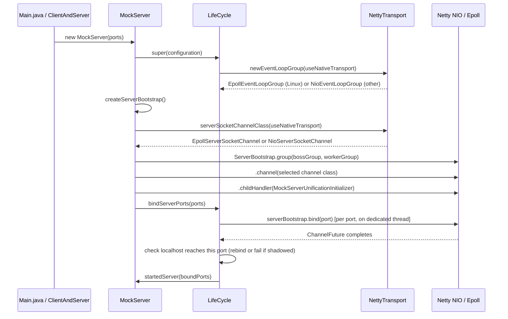

### Transport Selection

`NettyTransport` (`mockserver-core`, `org.mockserver.socket`) selects the highest-performance transport available at startup. On Linux with the native epoll library present and `useNativeTransport=true` (the default), it creates `EpollEventLoopGroup` and uses `EpollServerSocketChannel` / `EpollSocketChannel`. On all other platforms (macOS, Windows) or when the opt-out flag is set, it falls back to NIO transparently.

The transport selection is consistent across the entire data path: server bootstrap (boss + worker groups), outbound HTTP client (`NettyHttpClient`), and relay connect handler (`RelayConnectHandler`). This ensures the EventLoopGroup type always matches the channel type (epoll group with epoll channels, NIO group with NIO channels).

Epoll transport is required for transparent-proxy `SO_ORIGINAL_DST` resolution, which needs `EpollSocketChannel` children to extract the raw file descriptor.

The first event-loop group the server creates logs the transport once at INFO: `using native epoll transport`, `using NIO transport (native transport disabled by useNativeTransport=false)`, or, on Linux only, `using NIO transport (native epoll transport unavailable: <cause>)` (DEBUG on macOS/Windows, where NIO is the only option). Grep a container's start-up log for `using native epoll transport` or `using NIO transport` to see which transport it runs.

**Shaded jar natives.** The `mockserver-netty-no-dependencies` shaded jar — and the `mockserver-netty-docker` jar derived from it, which every published Docker image (`docker/local`, `-graaljs`, `-clustered`, `-aot`) is built from — relocates `io.netty` to `shaded_package.io.netty`. Relocated netty loads its JNI library by a package-mangled name (`libshaded_1package_netty_transport_native_epoll_<arch>.so`), so the shared shade configuration in `mockserver/pom.xml` relocates the epoll `.so` resource paths to that name. Before this, the natives kept netty's own name, `Epoll.isAvailable()` was `false`, and every published image silently ran NIO (the fallback logged only at DEBUG). `mockserver-netty-no-dependencies/src/packaging/assert-shaded-epoll-natives.sh` fails the `package` phase if either arch's `.so` is missing under the mangled name or still present under the unrelocated one. Only epoll is renamed: the tcnative and QUIC natives in the shaded jars keep their unrelocated names and so still do not load from the jar itself (the `-http3` image installs its QUIC native under the mangled name in a separate layer; see [http3.md](http3.md)). The shaded library jar also relocates JNA (`com.sun.jna` to `shaded_package.com.sun.jna`), whose JNI entry points are bound to the unrelocated class names, so the JNA-based original-destination resolvers (`SoOriginalDstResolver`, `EbpfOriginalDestinationResolver`) do not work from `mockserver-netty-no-dependencies` itself: transparent proxying there falls back to the conntrack resolver. The images are built from the build-internal `mockserver-netty-docker` jar instead, which is the library jar with JNA moved back to `com.sun.jna`, so both resolvers work in the images on epoll (see [docker.md](../infrastructure/docker.md#image-server-jar-mockserver-netty-docker)).

**Intentionally left on NIO:** `Http3Server` (QUIC/datagram, separate experimental transport with its own `NioEventLoopGroup`), `McpToolRegistry`'s internal client, and `EchoServer` (test infrastructure).

| Property | Default | Env var | System property |
|----------|---------|---------|-----------------|
| `useNativeTransport` | `true` | `MOCKSERVER_USE_NATIVE_TRANSPORT` | `-Dmockserver.useNativeTransport` |

#### CI Test Coverage

On Linux CI the **full existing integration-test suite** exercises the epoll transport automatically because:

1. `useNativeTransport` defaults to `true`
2. The `netty-transport-native-epoll` JARs (linux-x86_64, linux-aarch_64) are declared as `runtime`-scoped dependencies in `mockserver-netty/pom.xml`, which Maven includes on the test classpath
3. On Linux the native `.so` loads successfully, so `Epoll.isAvailable()` returns `true`

To force NIO on Linux for comparison testing, set `useNativeTransport=false` via system property (`-Dmockserver.useNativeTransport=false`) or environment variable (`MOCKSERVER_USE_NATIVE_TRANSPORT=false`).

Dedicated activation tests in `EpollTransportIntegrationTest` (`mockserver-netty`) verify the channel and event-loop-group types at runtime. These tests are gated by `Assume.assumeTrue(Epoll.isAvailable())` and skip cleanly on macOS/Windows.

This coverage runs against the **unshaded** module classpath, so it cannot see a shaded-jar packaging fault; that is what `assert-shaded-epoll-natives.sh` (above) is for.

### Key Bootstrap Configuration

| Setting | Value | Purpose |
|---------|-------|---------|
| Boss group | `EpollEventLoopGroup(5)` or `NioEventLoopGroup(5)` | Accept connections |
| Worker group | `EpollEventLoopGroup(configurable)` or `NioEventLoopGroup(configurable)` | Handle I/O |
| Channel | `EpollServerSocketChannel` or `NioServerSocketChannel` | Server socket (transport-matched) |
| SO_BACKLOG | 1024 | Connection queue depth |
| AUTO_READ | true | Automatic read on new channels |
| Server channel handler | `InboundConnectionLimiter` | Counts open connections and enforces `maxInboundConnections` — see [Inbound Connection Bounds](#inbound-connection-bounds) |
| ALLOCATOR | `NettyAllocator.ALLOCATOR` (`PooledByteBufAllocator.DEFAULT`) | One pooled allocator for every channel — see [ByteBuf Allocator](#bytebuf-allocator) |
| Receive buffer allocator | `BinaryAwareRecvByteBufAllocator` wrapping the channel's own, set per accepted connection in `MockServerUnificationInitializer.handlerAdded` (not a `childOption`: it holds per-connection state) | Netty's adaptive sizing until the connection is found to be binary, 64 KiB per read after that — see [Binary Protocol Handling](#binary-protocol-handling) |
| WRITE_BUFFER_WATER_MARK | 8KB low / 32KB high, on accepted connections (`childOption`) | When a connection's outbound buffer passes 32 KB it reports itself unwritable until it drains below 8 KB. The mark bounds nothing by itself; it matters only to code that reads writability — see [Outbound Buffering and Backpressure](#outbound-buffering-and-backpressure). Before `MockServer.CONNECTION_WRITE_BUFFER_WATER_MARK` was set with `childOption` it was set with `option`, which applies to the listening socket (which never writes), so accepted connections had Netty's 32 KB / 64 KB default |

### Port Binding and Loopback Reachability

**Outcome:** after binding each port, `LifeCycle.bindPort` checks that a localhost connection to that port actually reaches the new listener. A port chosen by the operating system (port `0`) that fails the check is closed and replaced (up to 10 attempts, each retry on a port the IPv4 wildcard allocator reports free, since that allocator does avoid ports held on `127.0.0.1`); an explicit port that fails it throws a `BindException` naming the conflict and suggesting `lsof -nP -iTCP:<port> -sTCP:LISTEN`, which surfaces like any other "port already in use" error (including the `400` from `PUT /mockserver/bind`, whose body carries the conflict detail and the `lsof` hint).

**Why:** MockServer binds the wildcard address, which the JDK opens as a dual-stack IPv6 socket (`[::]`) with `SO_REUSEADDR`. On macOS that bind succeeds even when another process holds the same port on `127.0.0.1` specifically, and the IPv6 ephemeral allocator does not avoid such ports either. The kernel then delivers `127.0.0.1:<port>` (and so `localhost`) connections to the more specific listener, so MockServer reports a successful start but receives none of its localhost traffic. With 2,000 `127.0.0.1` listeners held on ports spread across the ephemeral range, 61 of 500 wildcard `bind(0)` calls landed on a held port on macOS; Linux refuses the bind, so no port there is ever shadowed this way.

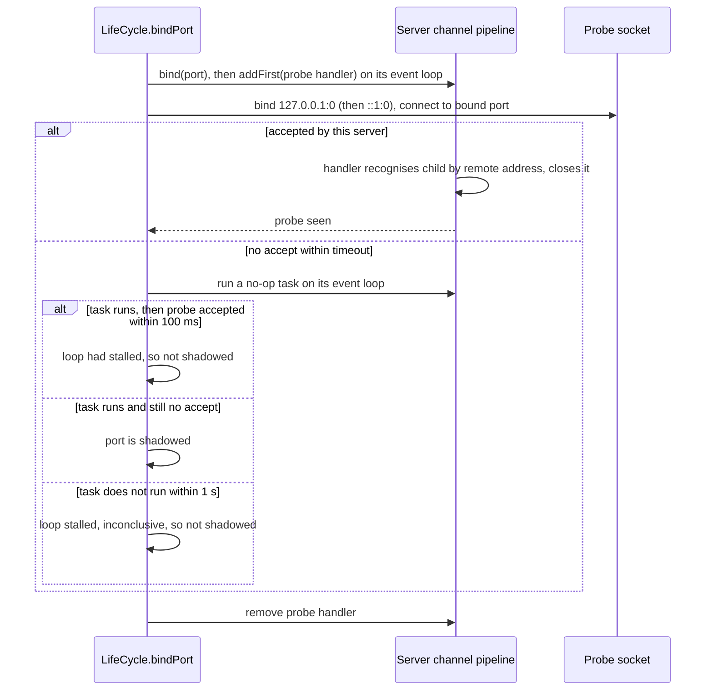

| Aspect | Behaviour |
|--------|-----------|
| Addresses probed | Wildcard IPv6 bind: `127.0.0.1` and `::1`. Wildcard IPv4 bind: `127.0.0.1`. Loopback `localBoundIP`: that address. Any other `localBoundIP`: none. |
| Recognising the probe | The probe socket binds its source address before connecting, and a handler added **first** on the server channel's pipeline (ahead of `ServerBootstrapAcceptor`) matches the accepted child by that exact remote address. The probe socket bypasses any JVM-wide `ProxySelector` or `socksProxyHost` (`Proxy.NO_PROXY`), since a relayed probe would arrive from the proxy's address and look shadowed |
| Effect on real traffic | None: the probe child is closed before registration, so it never reaches `MockServerUnificationInitializer`, the event log or metrics; the handler is removed as soon as the check ends. One exception: a probe that this channel accepts only after the check ends (a stalled accept loop) is no longer intercepted, so it reaches the normal pipeline as a connection that opens and is immediately reset. If the event loop is too busy to install the handler within 1 s, the check is skipped (reported as not shadowed) and the queued install is cancelled, or removed if it already ran |
| Verdict | Shadowed only if the probe **connects**, is not accepted by this channel in time (5 s for an explicit port, where a false positive would fail startup; for an OS-chosen port 250 ms doubling per attempt up to 5 s, where it only costs a rebind), and the channel's event loop is then shown to be running: a no-op task submitted to it completes within 1 s and the probe is still not accepted 100 ms later. If the task does not run in time the loop is stalled, so nothing could have been accepted and the check is inconclusive, reported as not shadowed. A failed connect (family unavailable, nothing listening) is not a conflict |
| Retry port choice | macOS allocates ephemeral ports sequentially, so a plain `bind(0)` retry tends to land on the next held port. Retries instead use a port from the IPv4 wildcard allocator, which is still probed after binding |
| Cost | Two loopback connects per bound port when not shadowed. Measured on macOS over 20 fresh JVMs each, against the same build without the check: the first start's median rose by 3–4 ms in each of two runs (within the run-to-run spread), and each later start in the same JVM by about 1 ms |

**Rejected alternatives** (measured on macOS): `SO_REUSEADDR=false` makes the explicit-port bind throw but still lets the ephemeral allocator pick held ports, and it breaks restarting on the same port while server-side connections are in `TIME_WAIT` (on macOS and Linux). An IPv4-only wildcard socket avoids the ephemeral collisions but still shadows an explicit port. Binding `127.0.0.1` avoids both but makes MockServer unreachable from other hosts and containers, so it stays opt-in via `localBoundIP`.

`PortFactory.findFreePort()` / `findFreePorts()` (`mockserver-core`) avoids the same trap for ports chosen before binding. It takes candidates from the IPv4 wildcard allocator and skips any candidate already in use on `[::1]`. That check runs only if `[::1]:0` can be bound at the start of the batch, and only "address in use" counts as taken: the JDK also reports "Cannot assign requested address" as a `BindException`, which would otherwise make every port look taken on a host with IPv6 loopback disabled. At most 32 candidates are skipped per batch; after that the `[::1]` check is dropped for the rest of the batch, and a skipped port is never returned. With 2,000 listeners held on ports spread across the ephemeral range, the old dual-stack `bind(0)` returned a held port 61 times in 500 on macOS when they were held on `127.0.0.1` and 80 times in 500 when held on `[::1]`; the new allocator returned none in 500 either way. On Linux (JDK 17 in Docker) neither the old nor the new allocator returned a held port in 500. Its opt-in `testPortRange` band still uses explicit dual-stack binds, which do not detect a `127.0.0.1` holder.

**Test listeners.** The same allocator quirk applies to a listener a test opens for itself (an upstream, a proxy target, a socket that holds a port): bound to port 0 on a dual-stack socket it can be given a port another process listens on at `127.0.0.1`, and the test's connections to `127.0.0.1:port` then reach that process. Test code therefore binds `127.0.0.1` and connects to `127.0.0.1` (`new ServerSocket(0, 50, InetAddress.getByName("127.0.0.1"))`, `.bind(new InetSocketAddress("127.0.0.1", 0))`), uses an IPv4 channel, or takes a port for MockServer to bind from `PortFactory.findFreePort()`. `EphemeralListenerBindGuardTest` (`mockserver-core`, `org.mockserver.testing`) scans every module's test sources, and the main sources of `mockserver-testing`, `mockserver-integration-testing` and `mockserver-benchmark`, and fails on a bind of port 0 on every address unless the bind is on an IPv4 socket or the file is in the guard's allow-list with a reason and that exact count. The spellings it sees are `.bind(0)`, `.bind(null)`, a bootstrap's `.localAddress(0)`, Netty's `bind("0.0.0.0", 0)`, `new ServerSocket(0)` and `createServerSocket(0)` (also with a backlog and a `null` or wildcard address), `new InetSocketAddress(0)` (also with a wildcard host or a `null` or wildcard `InetAddress`), `new DatagramSocket(0)`, `new DatagramSocket()`, Jetty's `new Server(0)` and WireMock's `dynamicPort()`, with the port written as `0`, `0x0` or a name holding 0 (a local assigned 0 in the same method, or a `final` field of 0). A bind is IPv4 when its statement names an IPv4 family or channel factory before the bind, or the nearest assignment of the variable it is called on, in the same method or as a field, does. It is a textual check, and its Javadoc lists what it does not follow (a constant of another class, a field that is not final, an address held in a variable, other libraries' servers), and `.bind(null)` on a socket made IPv4 another way is flagged and needs an allow-list entry.

### ByteBuf Allocator

All request/response traffic uses one allocator, `NettyAllocator.ALLOCATOR` (`org.mockserver.socket`, which is `PooledByteBufAllocator.DEFAULT`), so the buffers that carry it come from one set of pooled arenas. Two small exceptions keep Netty's default: HTTP/3 connection-local control and QPACK encoder/decoder streams (Netty opens them itself, and the codec's `streamOption` does not reach them), and the `ByteBufAllocator.DEFAULT` use inside OpenSSL context creation. Netty 4.2's `ByteBufAllocator.DEFAULT` is the adaptive allocator, and any channel whose allocator is not set explicitly gets it — a bootstrap `option`/`childOption` does not reach channels a codec creates itself.

| Channel | How the allocator is set |
|---------|--------------------------|
| Listening socket and accepted connections (`MockServer`) | `option(ALLOCATOR)` / `childOption(ALLOCATOR)` |
| HTTP/2 stream child channels, server side | `NettyAllocator.pin(ch)` in `Http2MultiplexChildInitializer.initChannel` |
| Forward/proxy client connections (`NettyHttpClient`, HTTP and binary) | `option(ALLOCATOR)` |
| HTTP/2 stream child channels, forward side | `NettyAllocator.pin(ch)` in `Http2ForwardStreamChildInitializer.initChannel` (outbound and inbound streams) |
| CONNECT/SOCKS relay loopback (`RelayConnectHandler`) | `option(ALLOCATOR)` |
| WebSocket proxy upstream (`WebSocketProxyRelayHandler`), callback WebSocket client (`WebSocketClient`), Java client breakpoint WebSocket (`BreakpointWebSocketClient`) | `option(ALLOCATOR)` |
| DNS UDP server | `option(ALLOCATOR)` |
| HTTP/3: UDP socket, QUIC connection and QUIC request streams (`Http3Server`; connection-local control/QPACK streams keep Netty's default); CONNECT-UDP relay socket (`Http3ConnectUdpHandler`) | `option(ALLOCATOR)` on the bootstrap; `option`/`streamOption(ALLOCATOR)` on the QUIC codec builder |
| `EchoServer` (test upstream) | `childOption(ALLOCATOR)` |

HTTP/2 stream channels are the case that is easy to miss: Netty builds each `Http2StreamChannel` with a fresh `DefaultChannelConfig` and does not copy the parent connection's allocator, so they must be pinned in the child initializer before the stream reads or writes. `Http2StreamChannelAllocatorTest`, `Http2ForwardStreamChannelAllocatorTest` and `RelayConnectAllocatorTest` fail if a pin is removed.

### Channel Attributes

| Attribute | Type | Purpose |
|-----------|------|---------|
| `REMOTE_SOCKET` | `InetSocketAddress` | Remote proxy target (port-forwarding mode) |
| `PROXYING` | `Boolean` | Whether channel is in proxy mode |
| `TLS_ENABLED_UPSTREAM` | `Boolean` | TLS active on client side |
| `TLS_ENABLED_DOWNSTREAM` | `Boolean` | TLS needed for upstream connections |
| `HTTP_ENABLED` | `Boolean` | HTTP pipeline configured |
| `HTTP2_ENABLED` | `Boolean` | HTTP/2 pipeline configured |
| `TRANSPARENT_ORIGINAL_DST_RESOLVED` | `Boolean` | Whether original-dst was resolved (conntrack/PROXY protocol) |
| `PROXY_PROTOCOL_SOURCE` | `InetSocketAddress` | Client address a PROXY protocol header carried; `SocketAddresses.clientAddress` returns it in place of the channel's peer, so it is the recorded `remoteAddress` of the connection's requests (and of HTTP/2 streams, via `ConnectionScopeHandler`) and the binary listener's client address |
| `NETTY_SSL_CONTEXT_FACTORY` | `NettySslContextFactory` | SSL context for this channel |

## Channel Initializer

`MockServerUnificationInitializer` is a `@Sharable` `ChannelHandlerAdapter` that replaces itself with a `PortUnificationHandler` on `handlerAdded()`. This thin adapter ensures each new channel gets its own `PortUnificationHandler` instance (since the decoder maintains per-channel state).

When `transparentProxyEnabled` is true, the initializer adds two handlers:

1. **`ProxyProtocolOriginalDestinationHandler`** (`"proxy-protocol"`) — added **in front of** the port unification handler, so port unification classifies what follows the header (HTTP/1.1, h2c, TLS, CONNECT, SOCKS or binary) rather than the header itself, which no known protocol begins with. It inspects the first inbound bytes for a PROXY protocol header, dispatching on the first byte: `0x0D` → v2 (binary), `'P'` → v1 (text). If a recognised header is found, sets `REMOTE_SOCKET` + `PROXYING` + `TRANSPARENT_ORIGINAL_DST_RESOLVED` from the destination (v2: for the PROXY command on INET/INET6; LOCAL/UNIX defer to downstream resolution) and `PROXY_PROTOCOL_SOURCE` from the source, consumes the header bytes, and removes itself. Bytes that stop matching a signature (for example a three-byte SOCKS5 greeting) are passed on at once, unchanged, and the handler removes itself. Bytes that are only the start of a signature (a lone `P`, or `CR LF`) are held with port unification's bounded wait (`UNDECIDED_PROTOCOL_WAIT_MILLIS`, 1 second after the last byte, not counted while reads are paused), then passed on unchanged; once the whole signature has arrived the rest of the header is waited for without that bound.
2. **`TransparentProxyHandler`** (`"transparent-proxy"`) — added after the port unification handler; fires at `channelActive` and runs the pluggable `CompositeOriginalDestinationResolver` chain (default: TPROXY → eBPF → SO_ORIGINAL_DST → conntrack → dns-intent). Skips resolution if `TRANSPARENT_ORIGINAL_DST_RESOLVED` is already set (e.g., by the PROXY protocol handler).

### Original Destination Resolver Chain

`CompositeOriginalDestinationResolver.defaultChain(Configuration)` tries strategies in order (first non-null wins):

| Order | Strategy | Class | Notes |
|-------|----------|-------|-------|
| 1 | TPROXY (IP_TRANSPARENT) | `TproxyOriginalDestinationResolver` | Returns `channel.localAddress()` when `transparentProxyTproxy=true`; null otherwise |
| 2 | eBPF socket metadata | `EbpfOriginalDestinationResolver` | O(1) BPF hash-map lookup; requires Linux + `CAP_BPF` + external cgroup BPF program; enabled via `transparentProxyEbpf=true` |
| 3 | SO_ORIGINAL_DST getsockopt | `SoOriginalDstResolver` | O(1) JNA `getsockopt`; requires Linux + Netty epoll transport |
| 4 | Linux conntrack table | `ConntrackOriginalDestinationResolver` | O(n) conntrack table scan; fallback when SO_ORIGINAL_DST is unavailable |
| 5 | DNS-intent (recover hostname MockServer's DNS answered) | `DnsIntentOriginalDestinationResolver` | Consults `DnsIntentRegistry`; last resort when all others return null |

The DNS-intent resolver consults `DnsIntentRegistry` (`mockserver-core`, `org.mockserver.mock.dns`), which records the `answeredIP → hostname` mappings MockServer's own DNS server hands out (A/AAAA answers). When a connection arrives at such an IP and all earlier strategies return null, the resolver returns an *unresolved* `InetSocketAddress` carrying the recovered hostname, so downstream forwarding/matching works by name (loop-prevention guards against a DNS-to-self loop). The registry is cleared by `HttpState.reset()`.

Note: PROXY protocol is handled separately in the pipeline (it reads bytes, not channel metadata).

## Port Unification Handler

`PortUnificationHandler` extends Netty's `ReplayingDecoder<Void>` and is **the heart of protocol detection**. It inspects the first bytes of every connection and routes to the appropriate protocol pipeline.

### Protocol Detection Order

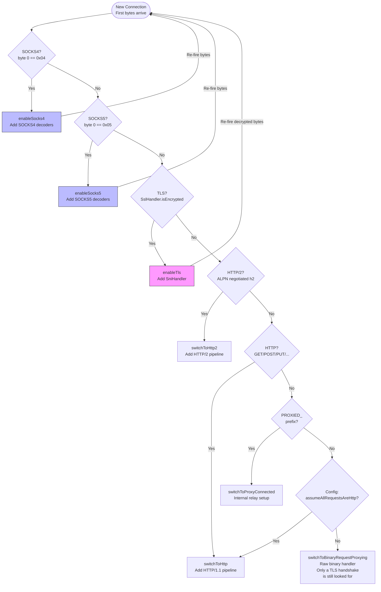

**Recursive detection**: When TLS or SOCKS is detected, the handler adds protocol-specific decoders, re-fires the bytes through the pipeline, and runs detection again on the decoded data. This enables arbitrary nesting (e.g., SOCKS5 → TLS → HTTP/2).

### How Many Bytes Detection Needs

Detection decides as soon as the bytes received settle the question, and holds them only while they could still become a known protocol. A connection decided to be binary stays binary: the only thing still looked for on it is a TLS handshake beginning (see [In-band TLS upgrade](#in-band-tls-upgrade-on-a-binary-connection)).

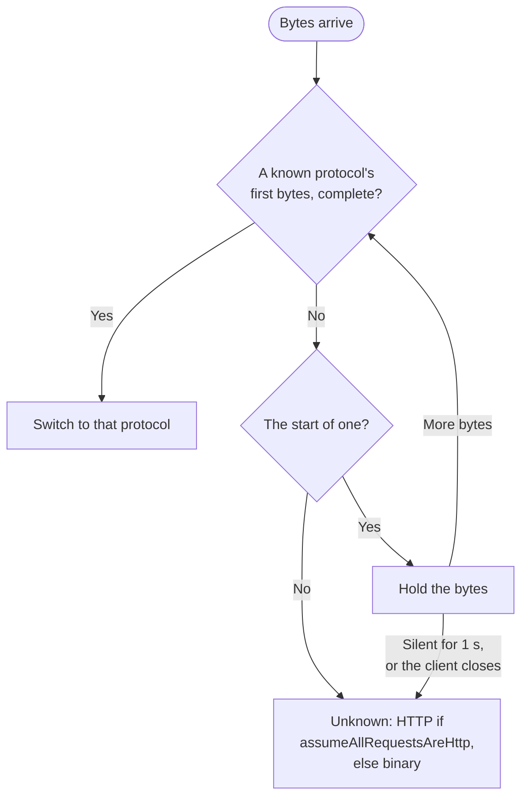

| Protocol | Decided once | Held while |
|----------|--------------|------------|
| SOCKS4 | The whole request has arrived (`SocksDetector.isSocks4`) | Byte 0 is `0x04` and byte 1 has not arrived, or byte 1 is a CONNECT or BIND and the request is incomplete |
| SOCKS5 | The whole greeting has arrived (`SocksDetector.isSocks5`) | Byte 0 is `0x05` and the greeting is incomplete |
| TLS | 5 bytes, a record header (`SslHandler.isEncrypted`) | Byte 0 is a record content type (20 to 24) and fewer than 5 bytes have arrived |
| h2c prior knowledge | The 24-byte preface | The bytes are the start of the preface |
| HTTP/1.1 | A method and the space after it (`GET `, `CONNECT `, ...; 4 to 8 bytes) | The bytes are the start of a method |
| Tunnel first message | `PROXIED_` (8 bytes) | The bytes are the start of `PROXIED_` |

So a first byte of `0x01` is binary at once, and `GE` is held: `T ` may follow. `startsWithAny` is the one place the text protocols' rule lives.

**The wait is bounded** (`UNDECIDED_PROTOCOL_WAIT_MILLIS`, 1 second, restarted by every further byte). Held bytes that are followed by silence are treated as unknown: binary, or HTTP under `assumeAllRequestsAreHttp`. The same happens at once when the client closes, since nothing more can arrive (`decodeLast`). The wait is not counted while the channel's reads are paused, because the rest may be sitting unread. Without the bound a binary client whose short first message happened to start like a known protocol would never have it forwarded.

**The trade-off**: a client that sends fewer bytes than its protocol's opening needs and then pauses for more than a second is taken for binary. For HTTP that means a strict prefix of the method (`OPTION`, never `GET /`); for TLS, fewer than 5 bytes of the first record. Real clients write these in one piece. Such a client then sees what any binary client sees: its bytes forwarded upstream when MockServer is proxying, otherwise the "unknown message format" reply and a close.

`SslHandler.isEncrypted` answers "not enough data" as `true`, so it is only asked once 5 bytes have arrived. Asked earlier it took any first read shorter than 5 bytes for TLS, including the first byte of a slowly sent HTTP request.

**Once binary, always binary**: the full detection above never runs again on a binary connection. In 8.0.0 it ran on every read: a message shorter than 8 bytes was held for more, and one shorter than 5 bytes, or that began like any TLS record, was handed to a new `SniHandler`, after which nothing more was forwarded. After a TLS or SOCKS stage, or a tunnel's first message, the handler stays in its ordinary mode, because what follows still has to be detected.

### In-band TLS Upgrade on a Binary Connection

A protocol can open in the clear and turn TLS on part way through the same connection: a PostgreSQL client sends an 8-byte `SSLRequest`, is answered `S`, and starts a TLS handshake. MockServer supports this for binary connections. When a ClientHello begins on a binary connection that is not yet TLS, it answers as a TLS server, with the same certificates, protocols and client-certificate requirement as a connection that starts with TLS, and treats everything it decrypts from then on as binary.

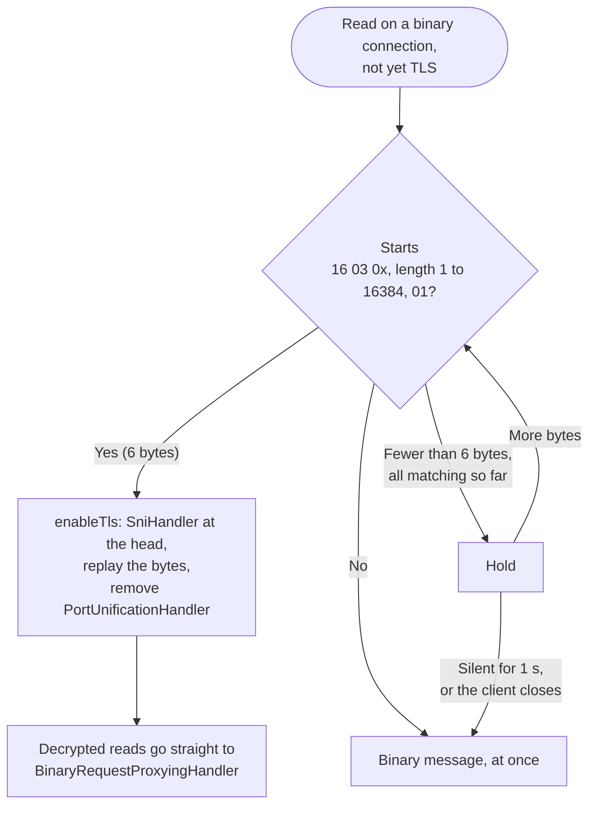

- **Where**: `switchToBinaryRequestProxying` leaves `PortUnificationHandler` in the pipeline with `binaryInTheClear` set, unless the pipeline already has an `SslHandler` (a connection that started with TLS), in which case it is removed as before. In that mode `decode` does one thing: `startsTlsClientHello`.
- **The rule** is six bytes: content type 22 (handshake), version major 3 and minor 0 to 4, a record length of 1 to 16384, and handshake type 1 (ClientHello). It is deliberately narrower than first-bytes detection, which takes any record type for TLS: here a wrong guess breaks a working binary connection.
- **After the upgrade** the handler removes itself, so decrypted reads are never looked at again: a short one is delivered at once, one that looks like HTTP or like another ClientHello is a binary message, and a second `SniHandler` cannot be stacked.
- **A ClientHello split inside its first six bytes** is still recognised. Bytes that are only the start of the six are held with the same bounded wait as first bytes (1 second after the last byte, at once on close, not counted while reads are paused), then delivered as a binary message.
- **What that costs**: a clear-text binary message of 1 to 5 bytes that is the start of the six (most plausibly a lone `0x16`) is delivered up to a second late, every time one is sent. It is still a message of its own: when the bytes that follow show it was not a handshake, the held bytes are delivered first (with a `channelReadComplete`, so that the gatherer does not join them to what follows), and `decode` returns so that what followed is examined in its turn as the start of a read: delivered as the next message, held if it could itself become a handshake (`16` then `16 03`), or taken for the handshake it is (a lone `16`, then a whole ClientHello in the next read). Bytes held over several reads go together, as only where they end is remembered. Four bytes are not held when the first length byte is already above `0x40`, which no record length can have. The alternative, not holding, would fail the handshake of a client whose ClientHello arrives split that early; TLS stacks write it whole, so that is rarer still, but its cost is a broken connection rather than a delay.
- **What is still misread**: a clear-text binary message of six bytes or more that begins exactly like a ClientHello is taken for one, and the connection then fails its handshake. A ClientHello that arrives in the same read as bytes before it is not recognised, because only the start of a read (or of what follows a held message) is examined; a client waits for the go-ahead before sending it, so it arrives alone. Held bytes and the bytes after them are first looked at together, so three held bytes `16 03 01` followed by a ClientHello read as one handshake record of a wrong length, and that handshake fails.
- **Backpressure**: the forward queue's read pause (below) is a `ChannelReadPause` hold on the channel, not on a handler position, so it balances across the upgrade. A ClientHello sent while the client is held back is read, and the upgrade made, when reading resumes.
- **`assumeAllRequestsAreHttp`**: nothing is binary under that setting, so there is no binary connection to upgrade.
- **Proxying, by default** (`forwardBinaryRequestsUseSingleConnection`): what is sent before the upgrade goes on the connection's one upstream connection in the clear, and when the client starts its handshake MockServer starts its own with the upstream **on that same connection**, so a real PostgreSQL server with `sslmode=require` clients can be proxied (see [The in-band TLS upgrade of the upstream connection](#the-in-band-tls-upgrade-of-the-upstream-connection)).
- **Proxying with `forwardBinaryRequestsUseSingleConnection=false`** is as it was in 8.0.0: MockServer terminates the client's TLS itself, and each decrypted message goes upstream on a connection of its own that MockServer opens with TLS straight away, while what was sent in the clear went upstream in the clear. A server that expects the plaintext request to upgrade on every connection is not served by that mode.

### Connection Delay

A configurable connection delay can be applied before protocol detection begins. When `connectionDelayMillis` is set to a non-zero value, `PortUnificationHandler.channelActive()` suppresses auto-read on the new channel and schedules the first read to resume after the configured duration, so the first inbound bytes (and protocol detection) are deferred without blocking the event loop. This simulates slow connection establishment for testing timeout handling in clients.

Configuration: `ConfigurationProperties.connectionDelayMillis(long millis)`, system property `mockserver.connectionDelayMillis`, environment variable `MOCKSERVER_CONNECTION_DELAY_MILLIS`. Default: 0 (no delay).

**Non-blocking:** The delay defers the first read via the event loop's scheduler instead of sleeping, so it does not stall other channels sharing the same worker thread. The delay is applied once per channel at `channelActive`.

### Inbound Connection Bounds

**Outcome:** two bounds stop idle or excess client connections from growing kernel socket memory (~3.9 KiB measured per connection) and per-channel state without limit. `inboundConnectionIdleTimeoutMillis` (default `300000`, `0` disables) closes a connection that has read and written nothing for the timeout **and** has nothing in progress; `maxInboundConnections` (default `0` = no limit) resets any connection accepted beyond the limit before it is registered. Both are read from the `Configuration` instance per connection, so a runtime change applies to the next connection.

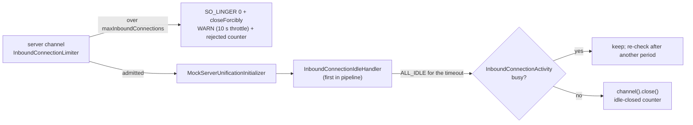

| Component | Where | Role |
|-----------|-------|------|
| `InboundConnectionLimiter` | `ServerBootstrap.handler(...)` on the listening socket, ahead of `ServerBootstrapAcceptor` (and behind the loopback-shadow probe) | Per-server `AtomicInteger` of open connections, decremented on each child's `closeFuture`; refuses the N+1th with a reset, so a refused connection never gets a worker event loop or a pipeline. Also feeds the JVM-wide `mock_server_inbound_connections_open` gauge |
| `InboundConnectionIdleHandler` | `addFirst` in `MockServerUnificationInitializer.handlerAdded`, only when the timeout is `> 0` | An `IdleStateHandler(0, 0, timeout)` whose `channelIdle` consults the activity instead of firing the event, so no other handler reacting to `IdleStateEvent` can see it. Closes through `channel().close()` so an HTTP/2 codec sends GOAWAY and TLS sends close_notify. A TLS handshake that completes restarts its period (see *TLS handshakes and the idle timeout* below). Kept on the client leg of a CONNECT/SOCKS tunnel (see *Tunnels and the idle timeout* below) |
| `InboundConnectionActivity` | channel attribute, created by the idle handler | Busy when: an HTTP/1.1 exchange is in progress, an HTTP/2 stream is active (`Http2ConnectionHandler.connection().numActiveStreams()`), auto-read is off (connection delay, relay back-pressure), the server certificate is being generated off the event loop (`SniHandler.SSL_CONTEXT_PENDING`), a TLS handshake is incomplete (bounded by the handshake's own timeout), or the connection is marked long-lived |
| `HttpExchangeTracker` | `@Sharable` singleton after `HttpServerCodec` (and the chunk-line limiter) in `switchToHttp`, and after the tunnel's own codec on the client leg of an HTTP/1.1 CONNECT/SOCKS tunnel (`RelayConnectHandler.configurePipelines`), only on tracked channels | An exchange starts at a decoded `HttpRequest` and ends when the `LastHttpContent` of its response **has been written** (promise completion), so delayed, breakpoint-paused and streaming responses count, and so does a large body `PacedLargeWriteHandler` is still slicing to a slow reader (its promise completes only when the last slice is written). Pipeline order: `inbound-idle`, `PacedLargeWriteHandler`, `HttpChunkLineLimiter$BeforeCodec`, `HttpLineEndSplitGuard$BeforeCodec`, `HttpServerCodec`, `HttpLineEndSplitGuard$AfterCodec`, `HttpChunkLineLimiter$AfterCodec`, `HttpExchangeTracker` — the tracker must stay after the codec. `1xx` responses do not end an exchange; `101` also marks the connection long-lived |

**Long-lived (exempt) connections** — marked with `InboundConnectionActivity.markLongLived(channel)`: a `101 Switching Protocols` (WebSocket: dashboard, callback, mocked and proxied), MockServer's own loopback leg of a CONNECT/SOCKS tunnel (`PortUnificationHandler.switchToProxyConnected`), and raw binary proxying (`switchToBinaryRequestProxying`). Their silences are legitimate and their traffic is not HTTP exchanges the tracker could see. Marking also removes the idle handler and the exchange tracker from the pipeline (on the event loop), so a WebSocket or tunnel stops paying their per-write cost, and `isTracked` stops a later `switchToHttp` on the loopback leg from re-installing the tracker. An exchange whose response never passes the tracker as HTTP objects — raw bytes (an `HttpError` `responseBytes`, written from `HttpServerCodec`'s context), an `HttpError` that writes nothing and keeps the connection open, or a mocked final `1xx` other than `101` — is ended by `HttpExchangeEndedEvent` (`mockserver-core`, `org.mockserver.responsewriter`). `HttpErrorActionHandler` (from a listener on the raw write, so it runs on the event loop as the write completes and any drop is chained after it) and `NettyResponseWriter` fire it from the codec's context, so it travels inbound through exactly the tracker and `HttpTransportTimer`, which each end their oldest exchange; without it the connection would count as busy for the rest of its life and never be closed as idle. The event has two instances, which those handlers treat alike: `RAW_RESPONSE_WRITTEN` for raw bytes, and `INSTANCE` for an exchange with no response or a final `1xx`. Only the relay tells them apart (see *Tunnels and the idle timeout*). Raw bytes are also announced before they are written, by a `RawResponseBytesEvent` carrying their length, which only the relay's loopback acts on (see [Raw-bytes responses through a tunnel](#raw-bytes-responses-through-a-tunnel)).

**TLS handshakes and the idle timeout.** A client has a whole idle period after its TLS handshake completes to send its first request. On a direct TLS connection `SslHandler#0` (and `SniHandler` before it) sits ahead of the idle handler, so the handshake's records never pass the idle handler and its timer does not see them. Two things stand in for them: a handshake in progress is busy, and the idle handler restarts its period on the `SslHandler`'s successful `SslHandshakeCompletionEvent`. Without the restart the period ran on from the ClientHello's first bytes, so a connection whose handshake had outlasted it was closed at the first check after the handshake, however recently it had completed. A failed handshake restarts nothing; the `SslHandler` closes the connection.

Every stage before the first request is bounded, so a connection cannot be held open by a handshake that never finishes:

| Stage of a direct TLS connection | Bounded by |
|---|---|
| Accepted, nothing sent | the idle timeout, from the accept |
| ClientHello incomplete (`SniHandler` buffers it) | the idle timeout, from the read that identified the connection as TLS, or `SniHandler`'s own timeout if that is shorter: `socketConnectionTimeoutInMillis` (default `20000`), or Netty's 10 s if that is not positive, from the same point. ClientHello bytes after that read restart neither |
| Server certificate being generated (`SniHandler.SSL_CONTEXT_PENDING`) | busy for the idle timeout, as the work is MockServer's own; `SniHandler`'s timeout still runs until the certificate is ready |
| Handshake in progress (`SslHandler` installed) | the handshake timeout: `socketConnectionTimeoutInMillis` again, from the `SslHandler`'s installation, or Netty's 10 s if that is not positive. It closes the connection, which is not counted as idle-closed |
| Handshake complete, nothing sent | the idle timeout, from the completion |

With the idle timeout disabled, `SniHandler`'s timeout and the handshake timeout still apply, so a handshake that never finishes holds a connection for at most twice `socketConnectionTimeoutInMillis`. Before, `SniHandler` used Netty's fixed 10 s whatever the setting, so lowering it did not shorten the ClientHello stage, and a certificate generation slower than 10 s closed the connection whatever it was set to. `SniHandlerTest` checks the timeout at 1.5 s and 25 s, and Netty's 10 s for no configuration or a value that is not positive; `TlsHandshakeTimeoutIntegrationTest` checks over a socket that half a ClientHello is closed at the configured bound. On a tunnel's client leg the tunnelled TLS is terminated behind the idle handler, so its handshake records pass the idle handler and restart the timer themselves; the completion event is fired after the idle handler there and is not needed.

**Tunnels and the idle timeout.** A CONNECT/SOCKS tunnel is closed as idle like any other connection, both legs together. The timer and the busy check are the client leg's: its `InboundConnectionIdleHandler` stays in place when the tunnel is set up, near the head of the pipeline, so every byte the client sends or is sent (TLS records and HTTP/2 control frames included) restarts it. `RelayConnectHandler` terminates every tunnel, so the client leg has an HTTP codec of its own, and the busy check reads it as on any connection: an HTTP/1.1 tunnel gets an `HttpExchangeTracker` after its `HttpServerCodec`, and an HTTP/2 tunnel's `HttpToHttp2ConnectionHandler` is asked for its active streams.

| Tunnel state | Idle-closed? |
|---|---|
| Established, the client has sent nothing yet | yes |
| Between requests on a kept-alive tunnel | yes |
| A request is being uploaded: the relay holds it until its body is complete, so nothing reaches the loopback | no: the exchange began when the client leg decoded the request head |
| A response is delayed, paused at a breakpoint, or streamed with gaps | no: the exchange ends when the last of the response is written to the client |
| An HTTP/2 stream is open | no |
| A `101 Switching Protocols` has passed through | no: the client leg becomes long-lived |
| Bytes arrive that complete no request (a request head sent slowly) | no: each read restarts the timer |
| HTTP/1.1: MockServer abandoned the request (an `error()` that writes nothing and keeps the connection open), or answered it with a final `1xx` other than `101` | yes: the loopback tells the client leg the exchange has ended |
| HTTP/1.1: MockServer answered with raw bytes (an `error()` with `responseBytes`), whether or not they are a whole response | yes: the exchange ends when the relay has written the last of those bytes to the client |

The client leg is watched, not the loopback, because only it sees an upload in progress. Closing it closes the loopback (see [Relay close](#relay-close)); the loopback leg MockServer accepts stays long-lived, so it is never closed on its own and only counts once in `mock_server_inbound_connections_idle_closed_total`. The relay carries no opaque tunnel: what cannot be read as TLS, h2c or HTTP/1.1 fails to decode and is closed. Raw binary proxying is a connection of its own, not a tunnel, and stays exempt.

**An exchange MockServer ends without a response.** `HttpExchangeEndedEvent` is fired on the loopback leg MockServer accepts, which is not the leg the timer watches, and nothing the client leg could count ever crosses the loopback: no bytes for an abandoned request, and for a final `1xx` a response the client leg's own codec takes for an interim one. So `PortUnificationHandler.switchToHttp` adds `LoopbackRelaySignalHandler` after the codec of a relay's loopback (`RelayLoopbackAddresses.isRelayLoopback`). On `HttpExchangeEndedEvent.INSTANCE` it looks up the tunnel's proxy client channel, which `RelayLoopbackAddresses` holds against the loopback's address, and announces the exchange to the relay as a raw-bytes response of no bytes, at its place among the bytes written (see [Raw-bytes responses through a tunnel](#raw-bytes-responses-through-a-tunnel)). The relay ends the client leg's exchange there, where its `HttpExchangeTracker` ends its oldest exchange as it would on a direct connection. (With no splitter to announce to, it fires the same event from the client leg's `HttpServerCodec` on that channel's event loop instead.) The tunnel is then idle-closed on the same terms as a direct connection in that state; before, it counted as busy for the rest of its life (`InboundConnectionIdleTimeoutIntegrationTest`, `LoopbackRelaySignalHandlerTest`).

`RAW_RESPONSE_WRITTEN` is not passed on: the relay hands raw bytes to the client itself and ends the client leg's exchange as the last of them is written (see [Raw-bytes responses through a tunnel](#raw-bytes-responses-through-a-tunnel)), so passing it on as well would end a second, pipelined exchange early. No case of an exchange MockServer ends now differs between a direct connection and a tunnel.

Over HTTP/2 a mocked final `1xx` ends its stream with a reset on both, so both are then closed as idle (see [A mocked final `1xx`](#a-mocked-final-1xx)). An HTTP/2 stream MockServer abandons stays open on both, by design: the stream is what the client is still waiting on.

**Tunnels and the cap.** A CONNECT/SOCKS tunnel, which always goes to MockServer itself, holds two slots: the client's connection and the internal loopback connection `RelayConnectHandler` opens. If the loopback is refused by the cap, the loopback channel closes before `PROXIED_RESPONSE_` arrives; `RelayConnectHandler`'s `channelInactive` then answers the client with the failure response (`502` for CONNECT) and closes, where it previously waited forever.

**Start-up warm-up.** `startupWarmup`'s `HttpURLConnection` request to the server leaves a JDK keep-alive connection open for about 5 seconds, which counts against the cap; tests with a very small cap set `startupWarmup(false)`.

**Not covered:** HTTP/3 (QUIC has its own `http3MaxIdleTimeout` and is not counted) and outbound forward/proxy connections (the forward pool has its own idle reaper). A child whose registration fails is still decremented: Netty's register path calls `closeForcibly()` and then completes the close future, which runs the limiter's listener.

### Response Write-Stall Timeout

**Outcome:** `responseWriteStallTimeoutMillis` (default `60000`, `0` disables, negative clamps to `0`) ends a response whose client has taken none of what is waiting for it for the timeout, so a client that stops reading cannot hold a queued response, or a streamed response's upstream connection, indefinitely. HTTP/1.1 (and any TCP connection: tunnels, WebSockets) is closed; an HTTP/2 or HTTP/3 stream is reset alone. The streaming writers' close listener then closes the upstream. A client that keeps taking some of the response at least once per timeout period is not affected, and a connection with nothing waiting to be written runs no timer. For an HTTP/2 stream, taking the response means data being written for it: flow-control frames that let none leave do not count (see *What counts as HTTP/2 stream progress* below).

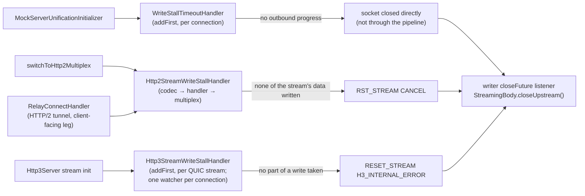

| Component | Where | Progress signal |
|-----------|-------|-----------------|
| `WriteStallTimeoutHandler` | `addFirst("write-stall")` in `MockServerUnificationInitializer.handlerAdded`, when the timeout is `> 0`; kept for the connection's life (not removed by `markLongLived`) | The socket taking more of `ChannelOutboundBuffer`: a different head message, `currentProgress()` moved, or fewer pending bytes. On epoll `tcpInfo().lastDataSent` within the check interval also counts, because the kernel wakes a writer only once a share of the send buffer is free |
| `Http2StreamWriteStallHandler` | After `Http2FrameCodec`, before `Http2MultiplexHandler`, in `PortUnificationHandler.switchToHttp2Multiplex`, and after the CONNECT/SOCKS relay's client-facing `HttpToHttp2ConnectionHandler` (`RelayConnectHandler`); the relay's failed write of the reset stream's queued response ends only that stream (see [Relay write failure](#relay-write-failure)). On both it wraps the connection's remote flow controller when it is added, so it needs only to come after the connection handler | For each active stream the remote flow controller holds data for: the flow controller wrote some of its data, counted as it is written (see *What counts as HTTP/2 stream progress* below); for a stream whose own window is still open, also data written for any other stream, because the weighted-fair distributor gives a stream nothing while a stream it depends on has data, the connection's socket not being writable while a `WriteStallTimeoutHandler` is in the connection's pipeline, because the flow controller then writes nothing and a stalled socket is that handler's to time (it tolerates the gaps in which a slow reader's kernel frees its send buffer, which the stream watcher cannot see), and the reset, in the same check, of the stalled stream holding the most of a closed connection window (see *A stalled stream holding the connection window* below). A client can starve one stream while reading the connection, so a socket-level check alone would miss it |
| `Http3StreamWriteStallHandler` | `addFirst` in each QUIC request stream, from `Http3Server`, so every writer's output passes through it (`Http3ResponseWriter`, the gRPC writers, MCP, CONNECT-UDP); the streams of a connection are timed by one `Http3ConnectionWriteStallWatcher`, held as an attribute of the `QuicChannel`, with the timeout read by the first of its streams to be watched (the value logged when a stream is reset) | QUIC taking a whole write. QUIC completes a write only once it has taken all of it and reports nothing of a part, so the handler passes each buffer on in parts of at most 32 KiB (see *HTTP/3: progress inside a large write* below). A stream that has been sent too little to hold the connection's credit also waits for the streams that could (see *An unread HTTP/3 stream holding the connection credit* below) |
| Writer close listener | `NettyResponseWriter` (streamed HTTP/1.1 and HTTP/2) and `Http3ResponseWriter` | On the client channel's (or HTTP/2 / HTTP/3 stream channel's) `closeFuture`, an incomplete `StreamingBody` closes its upstream; removed on complete or error so a keep-alive connection does not collect one per response |

**Counted.** Every cut increments `mock_server_response_write_stalls_total{protocol, scope}` (see [metrics.md](metrics.md#response-write-stall-metric)) as well as logging a `WARN`. `WriteStallTimeoutHandler` reads the protocol from the pipeline when it trips: a tunnel's proxy-client pipeline also holds the codec of the protocol it relays, so `UpstreamProxyRelayHandler` is checked first. A reset HTTP/2 stream stays active until its `RST_STREAM` gets past the socket, so the stream watcher skips streams already reset rather than resetting, logging and counting them again at every check.

**What counts as HTTP/2 stream progress.** Only data written for the stream, counted where it leaves the flow controller. When the handler is added it replaces the connection's remote flow controller with `WrittenBytesFlowController`, which hands every call to the original and wraps each queued frame: the size a frame loses in a write is the DATA payload and padding written for its stream. The handler keeps that total per stream and for the connection. Nothing a client sends reaches the count, so a client that takes none of a stream's data cannot keep the stream by sending frames: not by a `WINDOW_UPDATE` (for the stream, with the connection window closed, or for the connection, behind an unwritable socket), and not by changing `SETTINGS_INITIAL_WINDOW_SIZE`, including a rise that would overflow an earlier stream's window, which Netty applies to the streams before that one only. The stream is reset one timeout after the last data written for it, or after it was first seen with data waiting. Earlier the watcher read progress off the send window (any change of it, or any `WINDOW_UPDATE`), which each of those frames moves for free. The same wrapper also reports each window increment a `WINDOW_UPDATE` applies: the connection's decoder hands every one to the remote flow controller (`incrementWindowSize`), behind `Http2FrameCodec` and behind the relay's `HttpToHttp2ConnectionHandler` alike, so both paths are covered without a frame listener. An increment is never progress: it only feeds the choice of which timed-out stream is reset first (*Which stream is reset first* below).

| Counts as progress | For |
|--------------------|-----|
| Data written for the stream, however little | The stream |
| Data written for any stream on the connection, including one that has since closed | Streams whose own window is open |
| The socket not writable while a `WriteStallTimeoutHandler` is in the pipeline | Streams whose own window is open |
| The reset of the stream holding the most of a closed connection window, once (next paragraph) | Streams whose own window is open |

While the connection window is closed, an open-windowed stream that has timed out is also not reset as long as some watched stream that has been sent data has not yet timed out: it may be waiting for window that stream holds (the paragraph after next). That is a wait, not progress: its period is not restarted.

Not covered:

- **No minimum rate.** A client that takes one byte of a stream every period keeps it, as a client reading one byte per period keeps an HTTP/1.1 connection. And since an open-windowed stream counts as progressing while data is written for any stream, one byte per period on a connection keeps every open-windowed stream on it, and a `WINDOW_UPDATE` opens a stream's window for free. Telling a deliberate trickle from a slow reader needs a rate floor, which would cut slow readers that are served today — accepted as the contract; no rate floor: see [decisions/http2-write-stall-reset-pick-limits.md](decisions/http2-write-stall-reset-pick-limits.md).
- **The stream whose window a `SETTINGS` rise overflows.** RFC 9113 §6.9.2 asks for a connection error; Netty raises a stream error for that one stream and leaves the initial window raised for the streams before it only. On a tunnel's client-facing leg the connection handler resets that stream (`FLOW_CONTROL_ERROR`); behind `Http2FrameCodec` it stays open. The watcher does nothing about it as such: if it has a response waiting and takes none of it, it is reset like any other stalled stream. The conformance gap is inherited from Netty and accepted — see [decisions/http2-write-stall-reset-pick-limits.md](decisions/http2-write-stall-reset-pick-limits.md).

**A stalled stream holding the connection window.** A client that returns connection window only as it consumes a stream's data (Netty's codec does, in batches of half a window; its default connection window is 65,535 bytes, the same as a stream's) lets a stream it stops consuming hold much of the connection window, and the bytes it has consumed on other streams but not yet returned can hold the rest. Nothing on the connection then moves, so every stream with data waiting is timed from the same last movement and trips in the same check, whether or not the stalled stream's own window has closed. So while the connection window is closed, the watcher resets only the timed-out streams holding the most of it, and gives the other open-windowed streams a fresh timeout period. What a stream holds is taken as the data written for it less the window its client has since returned for it (*Which stream is reset first* below). A closed-window stream is always reset, and its reset gives the others a fresh period only while the connection window is closed: with it open they are not waiting for window, so open-windowed streams stalled with it (behind an unwritable socket no connection watcher is timing) are reset in the same check, as before. Netty's `DefaultHttp2LocalFlowController` returns a closed stream's unconsumed bytes to the connection window, and Chromium returns a discarded buffer to its session window, so for such clients the siblings continue.

It stays fail-closed. A stream with no data its client has yet to return window for counts as holding nothing, and resetting it extends nothing: otherwise a client granting a zero initial window could keep a stalled stream alive by opening one such stream every timeout period. A stream is given a fresh period for a reset once, and not again until it is refreshed for another reason (its own data moving, another stream's data moving, or a watched socket stall), so if the client returns nothing, every remaining stream is reset one period later. The grant is tracked per stream, not per connection, so a stream opened after an earlier stall on the same connection is spared in its turn. Every stream reset has taken none of its data for the whole timeout, as before. The cost is time: a client that stalls several streams and returns window as each is reset has them reset one group per period instead of all at the first, because each release is movement. The worst case is one period per stalled stream. At most 100 can be stalled at once (`PortUnificationHandler.HTTP2_MAX_CONCURRENT_STREAMS`), but a client that opens a replacement stalled stream after each reset continues the sequence, one per period, each replacement having to take a window of new data first.

**A stream waiting for a holder that has not yet timed out.** A stream's period runs from the last data written for it, so a stream whose own window was closed when the connection window closed, and whose client then returned its stream window, reaches its timeout before the stalled streams that took the connection window after it. It would be the only stream timed out at that check, and so be reset before the streams it is waiting on. So while the connection window is closed, an open-windowed stream that has timed out is not reset while any other watched stream that has been sent data has not yet timed out. When the last of those times out, the pick above is made among all of them: the stalled stream holding the most is reset and the waiting stream gets its fresh period. The wait ends with those streams' own timeouts and restarts nothing. A client cannot extend it for free: only a stream that has been sent data counts, data is counted where it is written, and a stream opened and sent nothing counts for nothing. Keeping a stream waiting therefore needs a stream that was sent data within the last period, which is progress for every open-windowed stream anyway, or one that was sent data earlier and only now has more waiting (a response written in stages). Such a stream is waited for through its own period and, at most, the one fresh period a reset can give it, so the wait is bounded by the number of such streams on the connection, as the worst case above is.

**Which stream is reset first.** Among the streams that have timed out behind a closed connection window, the watcher resets those with the most data their client has not returned window for. It passes over a stream that has less unreturned than its client has returned for it in one `WINDOW_UPDATE` before, but only when another stream, with no such history, holds by itself more than half of what the connection has out. The server cannot see which stream its client is reading. This is the evidence it has, and it changes only the order in which streams that have already timed out are reset: never whether one is reset, and never when a stream's period ends.

| Kept | Updated | Meaning |
|------|---------|---------|
| Unreturned, per stream | Plus every byte of data written for the stream; minus each `WINDOW_UPDATE` increment for it, up to what was unreturned when it arrived | The most of the stream its client can still be holding. An increment beyond it is a grant, and returns nothing |
| Smallest return, per stream | The least an increment has returned for the stream at once | A client that returns a stream's window at a threshold never returns less than the threshold, so a stream it is consuming has less than this unreturned |
| Unreturned, for the connection | The same count against the connection's `WINDOW_UPDATE`s | What the connection has out; a connection window enlarged before any data was sent is counted in full |

A stream is *explained* when its unreturned data is less than its smallest return: it holds no more than its client has left on it before while consuming it. A stream no window has been returned for is never explained. When the stream with the most unreturned among those not explained holds more than half of what the connection has out, the explained streams are passed over and that stream is reset, with any that tie with it. Otherwise, and when no stream is explained, the pick is made among all the streams.

Why one stream alone, and why half. A client that returns window once half of it is consumed (Netty's ratio) leaves a stream it is consuming up to half a stream window unreturned before its first return, all of it data the client has consumed and has already returned at connection level. Such a stream looks exactly like a stalled one that has been sent little. Several of them together can show more than half the connection window unreturned while holding none of it, so the unexplained streams are not added up. One of them alone cannot at the default windows: with stream and connection windows both 65,535 bytes it has at most 32,767 unreturned, which is not more than half. So at the default windows, with such a client, the rule passes a stream over only for a stream that really is stalled. That is argued from the client's return rule, and checked with a Netty client in the scenarios listed under *What remains*.

A stream passed over is treated as any stream not picked: it gets the one fresh period if it has not had it already, and is reset in the same check if it has, so it is reset no later than one period after the stream picked instead, which is the bound a stream not picked had before. A stream whose own window is closed is reset whether or not it is explained. In any check in which the previous rule reset a stream, this one resets at least one.

With one stalled stream and a connection window at least the size of the stream window, the stalled stream holds the most whatever has been returned: a client that returns window once half of it is consumed leaves at most half a stream window unreturned on a stream it consumes, and the stalled stream holds more than half the connection window. At the 65,535-byte defaults that is 32,768 bytes against at most 32,767, so the two never tie, and the stalled stream is the one reset whether it is explained or not. Netty's `Http2FrameCodec` enlarges its connection window when the stream window is raised through the codec builder's initial settings, but not when a later `SETTINGS` frame raises it.

What this changes in the four cases where the most-unreturned stream need not be the stalled one (the five residual cases below are accepted — see [decisions/http2-write-stall-reset-pick-limits.md](decisions/http2-write-stall-reset-pick-limits.md)):

| Case | Outcome | Shown by |
|------|---------|----------|
| Stream window above the connection window (`SETTINGS_INITIAL_WINDOW_SIZE` raised, connection window left at 65,535) | Improved. The stalled stream alone is reset, and the consumed stream completes, when the consumed stream is explained and the stalled stream is not and holds more than half of what the connection has out (a lone stalled stream does, with a client that returns connection window by the half). Unchanged (the consumed stream first, or both on a tie) while no window has been returned for the consumed stream, which a client returning at half a window does only after half a stream window of it is consumed. Worse in one arrangement, (b) below | Unit tests on both paths (100,000-byte window); a real Netty client at a 1 MiB window; the unchanged outcome pinned at 80,000 (tie) and 200,000 (consumed stream first) |
| More than one stalled stream | Given up where none of them holds more than half of what the connection has out: a consumed stream with more unreturned than each of them is reset first, as before. Stalled streams sharing the window have under half of it unreturned each and nothing returned, which is also what young consumed streams look like, and adding them up is what must not be done (above). Where one of them does hold more than half, improved as the first case: it is reset, and the next takes the window that releases and is reset in its turn | The limit pinned by a unit test (default windows, three stalled streams); the improved arrangement by another (100,000-byte window, two stalled streams) |
| Window granted beyond the initial window | Improved. A grant that arrives before the data returns nothing, so the stalled stream holds what it was sent whatever its send window says, and is the one reset. A grant sent while the stream has data unreturned is taken as a return of it, up to that data: the server cannot tell it from one | Unit tests on both paths for the first; the clamp alone in a third; the second is read from the code, not tested |
| A client that returns a stream's window late | Improved, as the first case, at equal stream and connection windows: the consumed stream is passed over once it has had window returned. Worse in (b), which such a client can reach at equal windows | Unit tests on both paths (return at seven tenths of a window) |

What remains:

- **(a) Nothing returned yet for the consumed stream.** Until a client returns stream window for a stream, it sends the same frames whether it is consuming that stream or not: connection-level `WINDOW_UPDATE`s that name no stream. Two streams with nothing returned for either are told apart only by how much each was sent, as before.
- **(b) A stalled stream that looks consumed.** A stream that stalls after its client has returned window for it, holding less than the least of those returns, is explained. A stream the client is consuming that has had none returned and has more than half of what the connection has out unreturned (with a client that returns a stream's window at half or sooner, possible only with a stream window above the connection window; a client that returns later, at three quarters say, can have 32,768 to 49,151 unreturned on a stream it is consuming and so reach it at equal windows, which is argued from the rule and was not reproduced: 257 late-return scenarios gave none) is then reset first, and the stalled stream a period later. The previous rule reset the stalled stream first there when it had the most unreturned. Reproduced with a Netty client at 200,000- and 300,000-byte stream windows, and pinned by a unit test at 200,000: a stream stalled after 140,000 bytes were consumed holds 66,272 with a smallest return of 114,687, against a consumed stream with 32,768 unreturned and nothing returned.
- **(c) A grant sent while data is unreturned** (third row above).
- **(d) Several stalled streams none of which holds more than half** (second row above). With two stalled streams, the one passed over can also be the one whose reset would have freed the window: an explained stalled stream with most of its data unread beside an unexplained one whose unreturned data is mostly consumed. The unexplained one is then reset, the client returns nothing, and the rest are reset a period later, where the previous rule reset the first and the client returned window. The mirror arrangement is put right. Argued, not reproduced: neither came up in 900 scripted default-window scenarios.
- **(e) The half.** It is Netty's return ratio. A client that lets more than half the connection window go unreturned on streams it is consuming leaves a stalled stream under half, and the pick is then made among all the streams, as before.

Checked with a Netty client in memory, the same scenarios run on the previous rule and on this one (a randomised mix of one or two stalled streams, read not at all, up to a cut-off or in bursts, and one to three consumed streams, opened at different points): at the default windows no scenario changed for the worse, among them a stalled stream whose client had read a whole window of it at once beside consumed streams with nothing returned yet, which a rule that adds the unexplained streams up gets wrong and a unit test now pins. At 100,000- and 300,000-byte stream windows more scenarios came right than went wrong, and those that went wrong were all (b). The scenario scripts are not in the repository; their counts are recorded in [decisions/http2-write-stall-reset-pick-limits.md](decisions/http2-write-stall-reset-pick-limits.md). Nothing ran on Linux, and no client but Netty's codec was tried.

It cannot be used to keep a stream. A `WINDOW_UPDATE` is not progress, so no stream's period is extended by one; a stream is passed over only in a check in which another stream is reset, and gets at most one fresh period for that, exactly as a stream not picked did before; and every stream on the connection belongs to the one client, so the most a client gains by sending window it has not earned is the choice of which of its own stalled streams is reset first.

**HTTP/3: progress inside a large write.** Netty's QUIC stream channel exposes no count of the bytes it has written: a write's promise completes when quiche has taken all of it, `bytesBeforeUnwritable()` is a snapshot of the smaller of the stream's and the connection's credit, a partly taken write raises no writability event, and `QuicConnectionStats` counts packets for the whole connection. The bytes taken show only in the reader index of a buffer inside the channel's private queue, which is a copy when the buffer written was not direct. So the stream is timed by writes completing, and `Http3StreamWriteStallHandler` makes that fine enough: any `ByteBuf` over 32 KiB is passed to QUIC as retained slices of at most 32 KiB, each with its own promise, and the writer's promise completes when the last does (or fails with the first failure). It sits below the HTTP/3 frame codec, so the bytes on the wire and the frames in them are unchanged, and it covers every writer, including one added later. `QuicheQuicStreamChannel.write()` retries its queue inside every write, so an earlier queued write can complete while a later one is being passed on, and a listener of that completion may write at once. The handler therefore passes on one write at a time: a write made (or a flush asked for) while another is being passed on is held, with its promise, until that one has been passed on whole, then passed on in the order made, so it cannot land between two parts and break the frame they belong to. None of the current writers writes from such a listener; `Http3StreamWriteStallHandlerTest` pins it with a stand-in for the QUIC stream. A held write is released and failed only if the handler is removed, or a write throws, while it is held. A reader must take 32 KiB per timeout period (about 550 bytes a second at the 60 s default) to keep its stream.

**An unread HTTP/3 stream holding the connection credit.** A QUIC connection has its own flow-control credit (`MAX_DATA`), which every stream draws on, and Netty offers returned credit to the waiting streams one after another, each taking all it can. A stream the client does not read can therefore end up holding all of it, and a stream the client would read has nothing to send: timed alone, it was reset with the unread stream, or before it when it had started waiting earlier. The watcher cannot see what a stream holds (Netty exposes neither the stream's nor the connection's credit), only a limit on it: the bytes QUIC has taken from the stream. So `Http3ConnectionWriteStallWatcher` splits the streams with writes waiting in two. A stream sent at least half a window (the smaller of the client's `initial_max_data` and `initial_max_stream_data_bidi_local`, halved because a client such as quiche returns credit only once it has read half a window) could be what holds the credit, and is reset on its own clock: for the same data movement, at the moment it was when each stream was timed alone. A stream sent less has stream credit left for its next write and cannot alone have stalled the connection. So, while the waiting streams sent less have together been sent under half a window:

- when a stalled stream that could hold the credit is reset, every stream sent less gets a fresh timeout period, in which the credit the reset returns can reach it, and
- when it stalls while a stream that could hold the credit is still within its own period, it waits one period for that stream's outcome, once until its own data moves or such a stream is reset.

Once the waiting streams sent less have together been sent half a window they could hold the credit between them, with no stream that could hold it alone. No stream then waits for another: every stream is reset on its own clock, and a wait or fresh period already granted ends at the next check. If no stream with writes waiting could hold the credit alone, a stalled stream is likewise reset on its own clock: the credit is then held by responses already written whole, which the watcher cannot reset. The allowance is off when the client's transport parameters are unknown or half a window is under 32 KiB, so a client granting a tiny window gains nothing.

It stays fail-closed, but the limit on a stream sent less is counted per stream that could hold the credit, not as a fixed number of periods. A stream that could hold the credit is reset one period after its clock last started (a write of its being taken whole, or a write beginning to wait on it when none was), as when timed alone. A stream sent less is never reset while its own data is moving, and is reset no later than two periods (plus the check intervals) after the later of its own clock starting and the last reset, while it waited, of a stream that could hold the credit. With no data moving on the connection that is:

| Streams that could hold the credit, with a write waiting | A stream sent less, waiting since 0, is reset after |
|---|---|
| none | 1 period |
| one that keeps moving (it is waited for once) | 2 periods |
| one waiting since 0 too, never moving | 2 periods (1 after that stream's reset) |
| one that was idle and begins a write just before the first period ends | just under 3 periods (2 after that write began) |
| ten idle ones, each beginning a write just before the stream would be reset | 20 periods at ten checks a period (1, and 1.9 for each) |

`Http3ConnectionWriteStallWatcherTest` pins each row. Timed alone the stream was reset after one period in every row, so this is longer than before, without limit in the number of such streams: besides those already on the connection, a client can open another, be sent half a window on it and let it stall, for each period or two. What that holds is the waiting stream's unsent response and, for a streamed response, its upstream. It is not a new way to hold a stream, nor a cheaper one by much: a client that takes one 32 KiB part per period already keeps any stream indefinitely, and each link here costs it half a window (32 KiB or more) for at most two periods. Keeping some other stream trickling buys one period only.

**What changes against timing each stream alone, and what does not.**

- The same, for the same data movement: when a stream that could hold the credit is reset. The allowance never changes its clock, but it can change where returned credit goes, and so which data moves (third point). The same too, for every stream, when the allowance is off, when the waiting streams sent less could hold the credit between them (from the check that finds it so), and on a connection where no stream that could hold it alone has a write waiting or was reset within the last period.
- Later, never earlier: a stream sent less, otherwise (a stream that could hold the credit has a write waiting or has just been reset, and the waiting streams sent less have together been sent under half a window).
- Not always the same streams, in two ways. First, the streams kept longer may hold some credit, under half a window between them, and their reset would have returned it a period or more sooner. With a client that returns credit once half a window is read, that delay matters only when the client has left the rest of half a window unread elsewhere: on responses already written whole, or on a stream it reads slowly. A stream that has been sent half a window, is read by the client and began waiting after them is then reset on its own clock, where timed alone the earlier resets freed its credit in time. Two unread streams sent 20,000 bytes each against a 50,000-byte threshold, and a read stream sent 60,000 that begins waiting 200 to 900 ms later, is such a case: the read stream is still reset. With a client that returns credit later than half a window the threshold itself is too low, and one unread stream sent less can hold the credit alone. Second, a stream kept longer can take the credit a reset returns ahead of a stream the client is reading; a read stream already sent half a window is then reset on its own clock where it was delivered before. An unread stream sent 60,000 bytes and an unread stream sent nothing both stall at 0, and a read stream sent 60,000 begins waiting at 400 ms: timed alone both unread streams are reset at one period and the read stream gets the credit; here the stream sent nothing is kept, and if it is offered the returned credit first it takes it and the read stream is reset at 1,400 ms. `Http3ConnectionWriteStallWatcherTest` pins that outcome as a known limitation. The order in which returned credit is offered to the waiting streams is quiche's and was not verified.
- Not covered by the allowance at all, so reset as when timed alone (for the same data movement): a stream the client is reading that has itself been sent half a window (it cannot be told from an unread one: quiche returns no credit, for the stream or the connection, until half a window has been read), and read streams that have together been sent half a window while each has been sent less (two sent 70 KiB each behind an unread stream, with a 128 KiB threshold).

Returning credit when a stream is reset is the client's job: Netty's quiche client does so even for a stream it is not reading; with a client that does not, the waiting stream is reset one period later.

Exercised only with Netty's quiche client, on macOS. Chrome, ngtcp2 and quic-go are untested, and the half-window threshold is quiche's: quic-go returns credit once a quarter of a window is read. Nothing was run on Linux.

**Timers.** Each handler arms a timer (interval `min(1 s, timeout / 2)`, at least 10 ms) only when there is something waiting: a flush that leaves bytes in the outbound buffer, an HTTP/2 connection with active streams, an HTTP/3 connection with a stream whose writes QUIC has not taken. The check costs one outbound-buffer snapshot per connection, or one pass over active streams (for HTTP/3, the streams with writes waiting), per interval; counting an HTTP/2 stream's written bytes costs one wrapper object per frame queued in the flow controller, and each inbound `WINDOW_UPDATE` costs at most one stream-property lookup and a few additions, with no allocation. An HTTP/2 stream that is sent data carries one object of three counters in place of one, and its record in the watcher one more counter and a flag: about 24 bytes more per stream by object layout, not measured.

**The connection is closed directly.** `WriteStallTimeoutHandler` closes the socket with `channel.unsafe().close(...)` rather than `channel.close()`. Asked to close through the pipeline, an `SslHandler` queues a `close_notify` (and an HTTP/2 codec a `GOAWAY`, then waits for its streams) behind the bytes the client is not taking, and leaves the connection open, refusing further writes, until that flushes or its own timeout passes. On a CONNECT tunnel, whose TLS the relay holds, a client that read on in that interval left `DownstreamProxyRelayHandler` writing the rest of the response into the closed engine, one logged error per chunk. Closing the socket fails everything queued and fires `channelInactive`, which is what closes the relay's loopback and, through the writer's close listener, the upstream.

**Why the timeout must sit well above a few seconds.** A slow reader's progress reaches the writer in bursts. On macOS NIO a reader taking a few KB at a time can show no progress for 4–20 s, because the kernel holds megabytes between the two ends and wakes a writer only once a share of them is free (an extra write attempt each check showed nothing more, so there is none); on Linux epoll `lastDataSent` removes that gap. The 60 s default leaves room for both.

**Relay loopback exemption.** MockServer's own CONNECT/SOCKS loopback leg is read by `DownstreamProxyRelayHandler` only as fast as the relay's proxy client takes what it is sent (reads pause above 256 KiB unwritten), so its silences are MockServer's own backpressure. `RelayConnectHandler` registers the loopback's local address in `RelayLoopbackAddresses` before it writes the `PROXIED_` preamble; `switchToProxyConnected` removes the connection handler when the accepted connection's remote address is one of them (a client merely sending the preamble is not exempted), and `switchToHttp2Multiplex` then skips the stream handler. The proxy client's own connection is watched, and tearing it down closes the loopback. A stalled HTTP/2 stream inside a tunnel whose client keeps reading the connection is cut on the client-facing leg: `RelayConnectHandler` adds an `Http2StreamWriteStallHandler` after that leg's `HttpToHttp2ConnectionHandler` (when the timeout is `> 0`), which resets the client's stream with `CANCEL`, and the relay then cancels the loopback stream if it is still open (see [Relay failure signalling](#relay-failure-signalling)). For a response the relay holds whole, the loopback's stream watcher could not see such a stall even without the exemption: the relay's loopback adapter returns each stream's flow-control window as it reads, so the loopback stream completes while the response waits in the client-facing flow controller. For a streamed response the exemption is what keeps the two legs from both acting: the relay returns the loopback stream's window only as the client takes the response, so a client that takes none stalls the loopback stream too, and the client-facing watcher alone decides when it is cut. On macOS NIO the exemption is reasoned, not demonstrated: there the loopback leg shows progress at about the same granularity as the proxy-client leg (a 40 KiB/s tunnel reader against a 9 s timeout left both legs at most ~6 s quiet, with the exemption removed), so no reader rate was found that trips the loopback without tripping the client leg first, and no test goes red without it on macOS. On Linux epoll it is expected to be load-bearing: the proxy-client leg shows progress through `tcpInfo` `lastDataSent`, while a loopback the relay has paused sends nothing until about 128 KiB of the backlog drains.

**Not covered:** outbound forward/proxy connections (MockServer as the client) and a client that keeps an HTTP/1.1 request upload stalled (nothing is being written to it).

### TCP Chaos Handler

When TCP-layer chaos is active (at least one host registered in `TcpChaosRegistry`), a `TcpChaosHandler` is inserted at the front of the pipeline before HTTP codecs. This handler operates on raw `ByteBuf` data and can inject transport-layer faults that mirror Toxiproxy's named toxics:

| Fault Type | Field | Behaviour |
|-----------|-------|-----------|
| latency | `latencyMs` | Delays all inbound data by the configured milliseconds, in arrival order |
| down | `down` | Silently drops all inbound data (service appears down) |
| bandwidth | `bandwidthBytesPerSec` | Throttles inbound data to the configured bytes/sec as a serial link (each read waits for the ones before it); combines with `latencyMs` |
| slow_close | `slowClose` | Delays the TCP FIN by 2 seconds on close |
| timeout | `timeout` | Never sends FIN; connection hangs on close |
| reset_peer | `resetPeer` | Sends TCP RST and closes immediately |
| slicer | `slicerChunkSize` | Fragments inbound data into chunks of the configured size |
| limit_data | `limitDataBytes` | Closes the connection after the configured bytes received |

The handler is **not sharable** (each channel gets its own instance) because it maintains per-connection state (`bytesConsumed` for `limitData`, and the latency/bandwidth queue).

Latency and bandwidth hold inbound reads in one FIFO queue per connection, released by a single event-loop timer, so bytes are never reordered (a later undelayed read, for example after the profile is removed, waits behind queued ones). While more than 64 KiB is queued the connection's reads are paused through `ChannelReadPause`, resuming at 32 KiB, so a fast sender is held back by TCP flow control, as behind a real slow link, and the queue holds at most 64 KiB plus one socket read. Queued buffers are released when the connection closes. See [request-processing.md](request-processing.md#overload-bounds-on-delayed-and-templated-actions) for how read pauses from different handlers combine.

Profiles are managed via the REST API:

- `PUT /mockserver/tcpChaos` -- register, remove, or clear TCP chaos profiles
- `GET /mockserver/tcpChaos` -- list all active TCP chaos profiles
- `PATCH /mockserver/tcpChaos` -- merge-patch an existing profile

Profiles support optional TTL-based auto-expiry (dead-man's switch), identical to the `ServiceChaosRegistry` pattern.

### Protocol-Specific Pipelines

#### HTTP/1.1 Pipeline


| Handler | Class | Purpose |
|---------|-------|---------|
| TcpChaosHandler | `o.m.netty.unification` | (Conditional) Injects TCP-layer faults (latency, down, bandwidth, slicer, etc.) on raw bytes before HTTP decoding. Only added when `TcpChaosRegistry` has active entries |
| PacedLargeWriteHandler | `o.m.netty.unification` | Writes an encoded buffer larger than 64 KB (in practice a response body) in 32 KB slices, only while the connection is writable, so a slow reader does not hold a direct-memory copy of the whole body. See [Outbound Buffering and Backpressure](#outbound-buffering-and-backpressure) |
| HttpChunkLineLimiter (before codec) | `o.m.codec` | Counts the bytes handed to the codec while a chunked request body is being read, and rejects the request when more than 8 KiB is waiting with nothing decoded. See [Chunk-size line limit](#chunk-size-line-limit) |
| HttpLineEndSplitGuard (before codec) | `o.m.codec` | Holds back a CR that ends a socket read while the codec is reading a head or a chunked body, so the line limits are the same however a message is split. See [Line ends split across reads](#line-ends-split-across-reads) |
| HttpServerCodec | Netty built-in, built by `HttpServerCodecs` | HTTP/1.1 request decoding / response encoding, with no bound on requests awaiting their response, between the two handlers of an `HttpServerCodecResponsePairing` (see [Pairing responses with requests](#pairing-responses-with-requests)) |
| HttpLineEndSplitGuard (after codec) | `o.m.codec` | The other half of the guard: tracks from what the codec decodes, and what is written, whether a CR may be held |
| HttpChunkLineLimiter (after codec) | `o.m.codec` | The other half of the limiter: resets the count on every decoded HTTP object, and tracks whether the connection is in a chunked body and whether a `400` can be written. Also refuses any request the codec could not decode, before anything after it sees it. See [Undecodable requests](#undecodable-requests) |
| PreserveHeadersNettyRemoves | `o.m.codec` | Preserves `Content-Encoding`/`Transfer-Encoding` headers that the downstream `HttpContentDecompressor`/`HttpObjectAggregator` strip (reset per request so they cannot leak across a pooled connection — issue #2322). Also captures the original (still compressed) request body bytes before decompression, so the decompressed body and the original on-the-wire bytes are both available (issue #2326). Both are published per request as one immutable `PreservedRequest` channel attribute, read once by `NettyHttpToMockServerHttpRequestDecoder` |
| MockServerHttpContentDecompressor | `o.m.codec` | Netty's `HttpContentDecompressor` (`gzip`, `x-gzip`, `deflate`, `x-deflate`, `snappy`, and `zstd` / `br` when their native libraries load), except that `snappy` accepts the raw block format Prometheus remote-write sends as well as the framing format (`SnappyBlockOrFrameDecoder`). The same class decompresses HTTP/2 streams and HTTP/3 request bodies. The original compressed bytes are still preserved by `PreserveHeadersNettyRemoves` above and exposed via `HttpRequest#getBodyAsOriginalRawBytes()`; a forward of an unchanged body sends them (see [request-processing.md](request-processing.md#bodies-with-a-content-encoding)) |
| HttpContentLengthRemover | `o.m.netty.unification` | Strips empty Content-Length headers |
| EarlyMatchingHandler | `o.m.netty.unification` | On the first `HttpRequest` (headers only), checks for an expectation with `respondBeforeBody=true` whose matcher has no body component. If found, dispatches the response (and any close) and discards remaining `HttpContent`, so the response can be sent before the body is read. Reproduces scenarios like okhttp/okhttp#1001 (issue #1831). Skipped for `CONNECT` and HTTP/2. The response says `Connection: close` unless its `connectionOptions` set the header, and `EarlyNettyResponseWriter` then closes with a lingering close (`LingeringClose`, `mockserver-core` `o.m.socket`, shared with the 413 path below and with `RelayLegClose`'s 5 s wait): a TLS `close_notify`, the socket's output shut down, inbound bytes discarded at the head of the pipeline, and the socket closed when the client closes or after 5 s. Closing at once with body bytes unread would make the kernel send a reset, which can discard the response before the client reads it |
| HttpObjectAggregator | A `CoalescingHttpObjectAggregator` (`mockserver-core`), created by `o.m.codec.HttpObjectAggregators` | Aggregates HTTP chunks into `FullHttpRequest`. Built with a component limit of `max(1,024, maxContentLength / 1 KiB)`, so a body of ordinary chunks is not consolidated into a second copy and a body of tiny chunks cannot pin unbounded heap; past the limit it merges only the chunks added since its last merge, so a body of one-byte chunks is copied about once (see [memory-management.md → Direct-memory limit](memory-management.md#direct-memory-limit)). A request over `maxRequestBodySize` is answered 413; where Netty would then close the socket (the request is not keep-alive and is not waiting for `100 Continue`, its body had started arriving, or reading is paused) it ends the connection with `LingeringClose` instead, so a client still sending the body is not reset before it reads the 413. A keep-alive request keeps its connection (Netty discards the body), and an HTTP/2 stream is left to Netty |
| CallbackWebSocketServerHandler | `o.m.netty.websocketregistry` | Intercepts `/_mockserver_callback_websocket` |
| DashboardWebSocketHandler | `o.m.dashboard` | Intercepts `/_mockserver_ui_websocket` |
| McpStreamableHttpHandler | `o.m.netty.mcp` | Intercepts `/mockserver/mcp` for MCP (Model Context Protocol) Streamable HTTP transport. Only added when `ConfigurationProperties.mcpEnabled()` is true. POST requests are offloaded to a dedicated executor (`McpSessionManager.getExecutor()`) to avoid blocking the Netty event loop during blocking tool calls (e.g., `Future.get()`) |
| MockServerHttpServerCodec | `o.m.codec` | Converts Netty HTTP ↔ MockServer model |
| HttpRequestHandler | `o.m.netty` | Main request processing |

##### Chunk-size line limit

**A chunk-size line (the hex size and any chunk extensions) or trailer section of a chunked HTTP/1.1 request is rejected once more than 8 KiB of it is waiting to be decoded.** The limit is fixed (`HttpChunkLineLimiter.MAX_CHUNK_LINE_BYTES`, 8,192 bytes) and applies wherever MockServer builds an HTTP/1.1 server codec: `PortUnificationHandler.switchToHttp` and the client-facing side of the CONNECT/SOCKS relay (`RelayConnectHandler`).

**Why it is needed.** Netty's `HttpObjectDecoder` parses the request line and every chunk-size line with one parser, bounded by `maxInitialLineLength`, and bounds the trailer section with `maxHeaderSize`. Those default to 64 KiB and 256 KiB (see [Request line and header limits](#request-line-and-header-limits)), sized for long URLs and large headers, so on their own they would let a chunked body carry 64 KiB of framing per chunk; lowering `maxInitialLineLength` to bound chunk-size lines would also shorten the longest request URL MockServer accepts.

**Why two handlers.** `HttpServerCodec` is final, its decoder is private, and neither says which line is being parsed, so the limit cannot be set on the decoder or added by subclassing it. Inside a chunked body the decoder passes chunk data on as it arrives, so the only bytes it keeps without decoding anything are an unfinished chunk-size line or trailer section. The handler before the codec adds each read's bytes to a count; the handler after the codec zeroes the count for every decoded object. A count over the limit (plus the two bytes of the CRLF that ends the previous chunk) after a read means the codec is holding that much of one line.

| Case | Result |
|------|--------|
| Chunk-size line, or `0` line plus trailers, of 8,192 bytes or fewer | Always accepted, however it is split across reads |
| Longer, and still unfinished when the bytes waiting pass the limit | Rejected. The codec holds at most the limit plus the socket reads either side |
| Longer, but ended (with chunk data after it) within the socket read it started in or the next | Can be accepted: it was never buffered beyond those reads. The limit bounds what is buffered; it is not a protocol check on line length |
| Request line, headers, chunk data, `Content-Length` bodies | Not affected (`maxInitialLineLength`, `maxHeaderSize`, `maxRequestBodySize` apply) |

**Rejection.** If the rejected request is the only one awaiting a response on the connection and no response to it has started, the limiter writes `400 Bad Request` with `Connection: close` from the context after the codec, keeps reading and dropping what the client sends for one second so the client can read the response (closing with unread bytes resets the connection, which can discard it), then closes. Otherwise (an early response under way, or an earlier pipelined request unanswered) it closes at once. It logs one `WARN` entry. The limit matches Tomcat's defaults for chunk extensions and trailers; a signed upload (`aws-chunked`) uses about 100 bytes per chunk-size line.

**Client codecs.** The forward client (`HttpClientInitializer`) builds `HttpClientCodec` with Netty's 4,096-byte line limit, which bounds an upstream response's status line and each of its chunk-size lines, and with `maxHeaderSize` for its headers and trailers (see [Upstream response headers](#upstream-response-headers)). The WebSocket proxy relay (`WebSocketProxyRelayHandler`) builds its codec the same way for an upstream's handshake response. The callback WebSocket client and the Java client's breakpoint WebSocket, which talk to MockServer itself, build theirs with Netty's defaults: 4,096 bytes a line and 8,192 bytes of headers. The relay's loopback codec (`LoopbackHttpClientCodec`, which decodes as Netty's `HttpClientCodec` does) reads only MockServer's own responses, so it is built with no line or header limit: `maxInitialLineLength` and `maxHeaderSize` limit what clients send, and a mocked response with headers over them must reach the client through a tunnel intact. A response that loopback codec still fails to decode is answered with `502` by `LoopbackHttp1ResponseErrorHandler` rather than relayed. The codec is never given the bytes of an `error()` with `responseBytes`, which need not be HTTP at all (see [Raw-bytes responses through a tunnel](#raw-bytes-responses-through-a-tunnel)).

##### Request line and header limits

**The request line is limited to `maxInitialLineLength` (default 65,536 bytes) and the header section, all header lines together, to `maxHeaderSize` (default 262,144 bytes).** The decoder buffers each until it ends, so before these defaults (both were `Integer.MAX_VALUE`) a client that never ended its request line, or kept sending header lines, was held in memory without limit. Both are read from the `Configuration` when a connection's codec is built, so a runtime change applies to new connections; zero or less is read as 1, as for the body-size limits. A request over either limit is refused (next section) with `414` or `431`.

| Server | Request line | Header section |
|--------|--------------|----------------|
| Netty `HttpServerCodec` defaults | 4 KiB | 8 KiB |
| Tomcat, Jetty | 8 KiB (line and headers together) | |
| nginx (`large_client_header_buffers 4 8k`) | 8 KiB | 8 KiB per line, 32 KiB in all |
| Apache httpd | 8,190 bytes | 8,190 bytes per line, 100 lines |
| AWS Application Load Balancer | 16 KiB | 64 KiB |
| Go `net/http` | 1 MiB (line and headers together) | |
| **MockServer** | **64 KiB** | **256 KiB** |

The defaults are well above what common servers and load balancers accept (four times an ALB's), and fit a Kerberos `Negotiate` token at Windows' 48,000-byte `MaxTokenSize` (about 64 KB encoded); only a server like Go's, with a 1 MiB allowance, accepts more. Each bounds memory per connection to well under the 10 MiB `maxRequestBodySize` a request can already hold, so neither is the larger exposure. `maxChunkSize` needs no bound: the decoder passes body bytes on as they arrive and only splits them at that size.

##### Line ends split across reads

**A request line, status line, header section or trailer section of exactly its limit is accepted however its bytes are split across socket reads.** Netty's `HttpObjectDecoder` (4.2.18, `HeaderParser.parse`) counts a CR whose LF has not arrived yet against what the line may still hold, so on its own it refuses a section of exactly the limit when a read ends between the last line's CR and LF (or between the CR and LF of the blank line that ends a section already at the limit), and accepts the same bytes read in one piece. `HttpLineEndSplitGuard` keeps the limits exact without changing them or forking the decoder: its handler before the codec holds back a CR that ends a read and hands it on at the start of the next read, so the decoder always sees a CR with its LF.

| Codec | Built in | Guard removed |
|-------|----------|---------------|
| `HttpServerCodec` (requests) | `PortUnificationHandler.switchToHttp`, `RelayConnectHandler` (tunnel client leg) | with the codec, by `HttpConnectHandler` and `SocksConnectHandler` |
| `HttpClientCodec` (forwarded responses) | `HttpClientInitializer.configureHttp1Pipeline` | stays; passes bytes on once the connection stops carrying HTTP/1.1 |
| `HttpClientCodec` (upstream proxy's `CONNECT` answer) | `HttpConnectProxyHandler.addCodec` | with the codec, once the tunnel is open |
| `HttpClientCodec` (WebSocket relay handshake) | `WebSocketProxyRelayHandler` | stays; passes bytes on after the `101` |

A held byte must never be one the codec needs to complete a message, or a peer waiting for an answer would wait for ever. So the guard holds a CR only while the codec is between messages (reading a request or status line and headers) or inside a chunked body: in both a message ends with an LF, so more bytes must follow. The handler after the codec tracks that state from what the codec decodes: a head with `Transfer-Encoding: chunked` starts a chunked body, any other head starts a body in which nothing is held, and a last content ends it. It stops holding for good once the connection may stop carrying HTTP/1.1: a `CONNECT` request decoded, a `101` decoded or written, a `2xx` answering a `CONNECT` it saw written (the codec then passes raw bytes on), or a decoding failure (the codec then discards the connection's input). It also holds nothing unless the codec is the next handler (Netty's WebSocket handshaker inserts its decoder there), and hands a held CR on when the connection closes and when it is removed. A CR in a chunked body that ends a read reaches the codec with the next read instead of at once; a read of nothing but a CR, held whole with auto-read off, asks for the next read as the codec would have.

**HTTP/2 and HTTP/3 take the same header limit from `maxHeaderSize`.** They have no request line (the method, scheme, authority and path are header fields), so the one limit covers the URL too and `maxInitialLineLength` plays no part. The size is the one each protocol defines (RFC 9113 section 6.5.2, RFC 9114 section 4.2.2): every field's name and value plus 32 bytes a field, after HPACK or QPACK decoding. So a request with a long URL or very many small headers reaches the limit sooner over HTTP/2 or HTTP/3 than over HTTP/1.1; one large header counts about the same on all three. MockServer advertises the limit to the client and Netty enforces it:

| Protocol | Limit set in | Advertised as | A request over the limit |
|----------|--------------|---------------|--------------------------|
| HTTP/1.1, direct or in a tunnel | `HttpServerCodec` (`switchToHttp`, `RelayConnectHandler`) | not advertised | `431`, connection closed |
| HTTP/2 direct (`h2`, `h2c`) | `Http2RequestHeaderLimit.serverSettings` (`switchToHttp2Multiplex`) | `SETTINGS_MAX_HEADER_LIST_SIZE` | `431` and `RST_STREAM(PROTOCOL_ERROR)` on its stream; the connection carries on |
| HTTP/2 in a CONNECT or SOCKS tunnel | `Http2RequestHeaderLimit.tunnelServerHandler` (`RelayConnectHandler`) | `SETTINGS_MAX_HEADER_LIST_SIZE` | as on a direct connection |
| HTTP/3 | `SETTINGS_MAX_FIELD_SECTION_SIZE` (`Http3Server`) | `SETTINGS_MAX_FIELD_SECTION_SIZE` | connection closed with `H3_EXCESSIVE_LOAD`; Netty's HTTP/3 codec answers no `431` (accepted difference — see [decisions/http3-header-limit-closes-connection.md](decisions/http3-header-limit-closes-connection.md)) |

Over HTTP/2 a header block (the HPACK-encoded bytes, across its `HEADERS` and `CONTINUATION` frames) of more than the limit plus a quarter is a connection error: `GOAWAY(PROTOCOL_ERROR)` and the connection closed, as Netty stops reading the block and the HPACK state is lost. Over HTTP/3 a `HEADERS` frame longer than the limit is refused from its length, before it is read. None of these reach a handler, so `Http2RequestHeaderLimit` builds the HTTP/2 codecs with `onError` overridden (and otherwise as Netty's own server builders do, including the zero graceful-shutdown timeout `Http2FrameCodecBuilder.forServer()` sets, which `Http2RequestHeaderLimitTest` checks), and `Http3MockServerHandler.exceptionCaught` recognises Netty's `H3_EXCESSIVE_LOAD`: each refusal logs one `WARN` entry and the request is never dispatched. On a direct HTTP/2 connection Netty also passes a connection error down the pipeline, where `Http2ConnectionExceptionHandler` leaves this one to that entry (see [Exceptions on the connection](#exceptions-on-the-connection)).

**A request's trailers are limited as its headers are**, and the request is never dispatched. What the client is sent differs, because Netty's codecs differ:

| Protocol | Trailers over the limit |
|----------|-------------------------|
| HTTP/2 direct (`h2`, `h2c`) | `RST_STREAM(PROTOCOL_ERROR)` on the stream and no `431`; the connection and its other streams carry on |
| HTTP/2 in a CONNECT or SOCKS tunnel | `431` if no response has started on the stream, then `RST_STREAM(PROTOCOL_ERROR)`; the tunnel carries on |
| HTTP/3 | connection closed with `H3_EXCESSIVE_LOAD`, as for a header section |

The tunnel's `Http2ConnectionHandler` answers the stream itself. A direct connection's `Http2FrameCodec` instead hands a stream error on a stream that already has a channel to that channel's pipeline, then closes the channel with the error's code. `LenientInboundHttp2StreamFrameCodec.exceptionCaught` stops the error there, because `Http2RequestHeaderLimit` logged it as it was raised, and marks the stream; the aggregator's `PrematureChannelClosureException` for the body it held follows, and `CallbackWebSocketServerHandler` recognises it on a marked stream (`Http2RequestHeaderLimit.isRefusedRequestCutShort`). A handler that treated either as unexpected would log it again and close the stream itself, which resets it with `CANCEL` where Netty would send `PROTOCOL_ERROR`. Every other error of a stream is stopped at the same place, for the same reason (see [HTTP/2 streams cut short](#http2-streams-cut-short)). The WARN names the trailers (`resetting HTTP/2 stream ... because the request's trailers are larger than maxHeaderSize`); `Http2RequestHeaderLimit` tells them from a request's headers by whether the connection already knows the stream.

A client can also send a header block over the limit on a stream whose request it has ended, which no well-behaved client does; Netty limits it before it checks the stream's state, so it is handled as trailers are, and a response still being written or streamed on that stream stops. This is the one case a handler's own close left without any reset: with the request ended and the whole response already written to the stream's channel, closing that channel sends none, and the response went on being delivered. In a tunnel over HTTP/2 the relay hands a response on only when it has all of it (a known defect, see [Outbound Buffering and Backpressure](#outbound-buffering-and-backpressure)), so a response MockServer is still streaming has not started for the client, which is answered `431`; the relay resets the loopback stream. Over HTTP/3 a request whose trailer section was refused is not dispatched when its stream's input then closes (`Http3MockServerHandler.sectionRefused`): the end of the stream is delivered after the error that closed the connection. `Http2TrailerListLimitIntegrationTest` and `Http3TrailerSectionLimitIntegrationTest` cover each case, and check that no buffer leaked; the first also shows that an upload the client itself resets is not a warning (see [HTTP/2 streams cut short](#http2-streams-cut-short)).

**What a client can make MockServer hold.** Netty counts each decoded field against the limit and stops keeping fields once it is passed, so a block that is small on the wire and far larger decoded (one large field referred to many times from the HPACK dynamic table, or QPACK static-table references) is refused without being held: over HTTP/2 for less memory than the limit itself (`Http2RequestHeaderLimitTest`); over HTTP/3 the codec's `Http3HeadersSink` drops fields the same way, which `Http3HeaderSectionAllocationIntegrationTest` measures on a real QUIC connection: the heap MockServer's threads allocate to refuse a section of QPACK static-table references stays within twice the limit, and a field past the limit costs less than the smallest object. That test turns buffer leak tracking off for its own class, because tracking records a stack trace for every byte read; `Http3HeaderListLimitIntegrationTest` refuses the same kind of section with tracking on. Per connection the worst case is:

| | HTTP/2 | HTTP/3 |
|---|--------|--------|
| Encoded header block being received | one at a time, up to `maxHeaderSize` plus a quarter (320 KiB at the default) | up to `maxHeaderSize` per request stream |
| Decoded headers | up to `maxHeaderSize` per open stream; 100 streams (`HTTP2_MAX_CONCURRENT_STREAMS`), so 25 MiB at the default | up to `maxHeaderSize` per open stream; `http3InitialMaxStreamsBidirectional` streams (100) |
| Compression table | 4,096 bytes: `SETTINGS_HEADER_TABLE_SIZE` is left at its default | none: `http3QpackMaxTableCapacity` defaults to 0 |

These are sizes as the protocols count them, not heap: the 32 bytes a field is the protocols' own allowance, and a list of many tiny fields costs a few times its counted size once each field is an object. Each stream can also hold a body of `maxRequestBodySize` (10 MiB), so headers are not the larger exposure. A single HTTP/2 frame is buffered whole before it is examined, whatever its type, up to the `SETTINGS_MAX_FRAME_SIZE` MockServer advertises (`maxRequestBodySize`, between 16 KiB and 16 MiB).

**The tunnel's loopback leg sets no header list limit, in either direction.** A tunnelled HTTP/2 request is limited on the client's leg, then relayed to MockServer over the loopback with fields the relay adds (`content-length`, `host`), and with a `cookie` header split into one field a cookie as Netty re-encodes it for HTTP/2 (`HttpConversionUtil`), each counted with its own 32 bytes, so the loopback's counted list can be several times the client leg's. `switchToHttp2Multiplex` recognises its own loopback (`RelayLoopbackAddresses`) and uses `Http2RequestHeaderLimit.relayLoopbackSettings` there: applying `maxHeaderSize` a second time refused a request within about 200 bytes of the limit, which the client leg had accepted, and reset its stream with `REFUSED_STREAM`. The loopback's HTTP/2 client (`RelayConnectHandler.configureHttp2LoopbackPipeline`) uses the same settings to read MockServer's own responses, as the HTTP/1.1 loopback's `HttpClientCodec` does (see [Chunk-size line limit](#chunk-size-line-limit), Client codecs): with Netty's default it read a header list up to 8,192 bytes, so a mocked response with larger headers had its stream reset, and one whose header block passed 10,240 bytes closed the loopback. An HTTP/1.1 tunnel still applies the limit on both legs; the relayed request is a few dozen bytes larger, so it is refused that much sooner, with `431` either way.

**A mocked response is not limited by `maxHeaderSize`.** A server ignores the header list limit its client advertises (Netty's `DefaultHttp2ConnectionEncoder`), so MockServer sends response headers of any size over HTTP/2, direct or through a tunnel. A response MockServer reads from an upstream is limited, by the same property: next section.

##### Upstream response headers

**The forward client reads an upstream's response headers, and its trailers, up to `maxHeaderSize` (default 262,144 bytes). A response over the limit fails that forward: the client is answered `502` with the reason as the body, and one `WARN` entry is logged.** Before, the limit was Netty's 8,192 bytes whatever the property was set to (see the end of this section for what that did). The limit is read from the `Configuration` when an upstream connection's codec is built (`HttpClientInitializer.maxHeaderSize()`), so a runtime change applies to connections opened after it; a pooled connection keeps the limit it was built with. A binary forward's initializer is built with the forward client's `Configuration` too (with no HTTP protocol), so the forwarding server's `maxHeaderSize` limits a proxy's answer to `CONNECT` there, not the JVM-wide setting (`BinaryForwardConnectHeaderLimitIntegrationTest`), and its TLS handshake is bounded by `socketConnectionTimeoutInMillis` as an HTTP forward's is (`NettyHttpClientTlsHandshakeTimeoutTest`). The binary forward that is refused is logged once too: `NettyHttpClient` logs no binary failure, except a `forwardProxyBlockPrivateNetworks` refusal, which the client logs and the handler does not ([Binary Mock Processing](request-processing.md#binary-mock-processing)), and `BinaryRequestProxyingHandler` logs the client connection it closes at `INFO` without a stack trace, as an HTTP forward's `502` is logged.

| Leg | Limit set in | Counted as | Over the limit, Netty | Then MockServer |
|-----|--------------|------------|-----------------------|-----------------|
| HTTP/1.1 upstream | `HttpClientCodec` (`configureHttp1Pipeline`) | header lines without their line ends; trailers are counted on top of the same response's headers | hands on the head, or the last content, with a `TooLongHttpHeaderException` and discards the connection's input | `ForwardHeaderLimit.Http1Response` drops it, fails the forward and closes the connection |
| HTTP/2 upstream, header list over the limit | `SETTINGS_MAX_HEADER_LIST_SIZE` (`forwardClientSettings`), announced to the upstream | each field's name and value plus 32 bytes, after HPACK decoding; trailers separately | a stream error, reported to the stream's pipeline | `ForwardHeaderLimit.Http2Stream` fails the forward; the stream is reset (`CANCEL`) and its connection closed with `GOAWAY(NO_ERROR)` |
| HTTP/2 upstream, header block more than a quarter over | the same setting | the HPACK-encoded bytes of the block | a connection error: `GOAWAY(PROTOCOL_ERROR)` and the connection closed | `ForwardHeaderLimit.Http2Connection` fails the forward before Netty closes |
| Upstream proxy's response to `CONNECT` | `HttpConnectProxyHandler`'s `HttpClientCodec` | as HTTP/1.1 | as HTTP/1.1 | the proxy connection fails with the refusal as its cause |
| Upstream's response to a relayed WebSocket handshake | `HttpClientCodec` (`WebSocketProxyRelayHandler.relay`) | as HTTP/1.1 | as HTTP/1.1 | `UpstreamHandshakeHandler` answers the client `502` and closes the upstream connection (see [WebSocket Proxy Passthrough](#websocket-proxy-passthrough)) |

An upstream HTTP/2 connection carries one forward at a time (`HttpForwardConnectionPool.acquire` hands a connection to one request, and it is released when that request's response is complete), so closing it for one oversized response ends no other exchange. Netty tells a header list over the limit from a header block too large to finish reading, as it does for requests; for the forward client the difference is only which `GOAWAY` the upstream is sent, because a stream that fails is not released to the pool and `Http2ForwardStreamChildInitializer` then closes its connection.

**The failure.** Each handler raises a `HeaderLimitExceededException` whose message is the reason (`upstream response headers are larger than maxHeaderSize (262144 bytes)`, or `trailers`, `an upstream response header block is more than a quarter larger than ...`, `the upstream proxy's CONNECT response headers ...`) and logs `failing forward to: ... because: ...` once at `WARN`. `HttpClientHandler` and `HttpActionHandler` recognise it, also inside the `ProxyConnectException` an upstream proxy's handler wraps a refused `CONNECT` answer in (`ForwardHeaderLimit.isAlreadyLogged`, `HeaderLimitExceededException.in`), and do not log it again as an unexpected exception, nor the aggregator's `PrematureChannelClosureException` for the part of a response it held when trailers were refused. `HttpActionHandler.returnedHeaderLimitFailure` answers `502` with the message as the body on the matched forward, unmatched proxy and proxy-pass routes. The request is sent once: the failure is not one the pooled-connection retry treats as a stale connection, and `ForwardRetryPolicy` (`forwardProxyRetryCount`) does not count it as transient, since the upstream would answer with the same headers again. For the same reason it does not count against the upstream's circuit breaker. A response already being streamed to the client when its trailers are refused ends incomplete, as for any upstream failure mid-stream.

**Status line.** The status line, and each chunk-size line, keep Netty's 4,096-byte limit: `maxInitialLineLength` is documented as the limit of a request line, and no status line approaches 4,096 bytes. A response over it cannot be decoded (next paragraph).

**A response that cannot be decoded.** Any other HTTP/1.1 response the codec fails to decode (a status line that is not HTTP or is over 4,096 bytes, an invalid header, a chunk-size line that is not a number or is over 4,096 bytes, or a connection closed part-way through the headers) fails the forward the same way: `ForwardHeaderLimit.Http1Response` drops what the codec handed on, raises an `UndecodableResponseException` with the codec's exception as its cause, and closes the connection, so nothing of the response is relayed and the connection is never pooled. The codec discards everything after a failure, so a pooled connection would have left the next forward on it waiting for the read timeout. The connection's entry, `response on connection to: ... could not be decoded: ...`, is `DEBUG` when a request is waiting, which `HttpActionHandler` logs at `ERROR` and answers `502` (see [request-processing.md](request-processing.md#how-a-failed-forward-is-answered)), and `WARN` otherwise. Like a header-limit refusal it is not sent again, not retried by `forwardProxyRetryCount`, and does not count against the circuit breaker. Once a response is being streamed, `StreamedResponseDecoderResultGuard` is in the pipeline and ends the stream incomplete instead. `ForwardUndecodableResponseIntegrationTest` covers each case end to end. Before, the head was relayed with the headers read so far, or a status line that was not HTTP as status `999`, and with an in-range status the connection went back to the pool.

**A request larger than an HTTP/2 upstream's own limit is sent, and the upstream answers.** The `SETTINGS_MAX_HEADER_LIST_SIZE` an upstream announces is advisory (RFC 9113 section 6.5.2), and the forward client does not apply it to the requests it encodes (`encoderIgnoreMaxHeaderListSize(true)` in `configureHttp2Pipeline`). A request MockServer accepted is forwarded whatever the upstream announced, and the upstream's answer is relayed, as for an HTTP/1.1 upstream, whose limit MockServer cannot know: a Netty upstream answers `431` on the stream. Left to Netty's default the encoder refused such a request, but only once the upstream's `SETTINGS` frame had been read, so the first request on a connection was sent and later ones on the same pooled connection failed with `502`. An upstream that treats the request as a connection error and closes (Netty does for a header block more than a quarter over its limit) leaves the forward without a response: `502`, and, because a closed pooled connection is what a stale one looks like, an idempotent request that was on a pooled connection is sent once more on a new connection first. `ForwardHeaderLimitIntegrationTest` pins both.

**What an upstream can make MockServer hold.** Per upstream connection: one response's decoded headers and one set of trailers, each up to `maxHeaderSize` (over HTTP/1.1 the two together), and over HTTP/2 an encoded header block being received, up to `maxHeaderSize` plus a quarter, and a 4,096-byte HPACK table. A legacy HTTP/2 server may open one stream of its own (`maxConcurrentStreams(1)`), which doubles the decoded headers. Netty stops keeping fields once the limit is passed, so a block that is small on the wire and far larger decoded is refused for less memory than the limit (`ForwardHeaderLimitTest`). The same response can hold a body of `maxResponseBodySize`, so headers are not the larger exposure, and `maxHeaderSize=2147483647` allocates nothing up front: both codecs only compare against it.

**Before.** With the 8,192-byte limit an HTTP/1.1 response with larger headers was relayed as `200` with the headers read up to that point, the rest and the body missing, and its connection went back to the pool with the decoder discarding everything, so the next forward on it timed out. Over HTTP/2 the forward failed with `502` and nothing in MockServer's log said why: a header block over 10,240 bytes closed the connection and the exception reached the end of the pipeline (on master, where pooled HTTP/2 connections and the stale-connection retry are newer than 8.0.0, an idempotent request on a pooled connection was also sent a second time). Through an upstream proxy whose `CONNECT` response had larger headers, the forward waited out the proxy connect timeout.

##### Exceptions on a connection to an upstream

**Every pipeline the forward client builds ends with a MockServer handler, so an exception on a connection to an upstream is logged once in MockServer's log.** Without one it reaches the end of Netty's pipeline, which logs it at `WARN` with a stack trace through Netty's own logger, and while TLS is being set up Netty's `ApplicationProtocolNegotiationHandler` logs it through its own logger as well.

| Stage | Pipeline ends with | Was logged by Netty |
|-------|--------------------|---------------------|
| Until ALPN has chosen the protocol (every `https` forward) | `HttpOrHttp2Initializer`, which overrides `exceptionCaught` | `TLS handshake failed:` for a failed handshake; `Failed to select the application-level protocol:` and then the end of the pipeline for anything else, such as a proxy that refuses the `CONNECT` or an upstream that resets |
| HTTP/2 connection | `Http2ForwardConnectionExceptionHandler`, after `ForwardHeaderLimit.Http2Connection` | the end of the pipeline: an upstream's reset, with or without a forward in flight, and every HTTP/2 connection error |
| HTTP/1.1, binary, and each HTTP/2 stream | `HttpClientHandler` | nothing |

| What reached it | `HttpOrHttp2Initializer` | `Http2ForwardConnectionExceptionHandler` |
|-----------------|--------------------------|------------------------------------------|
| A refusal or undecodable response `ForwardHeaderLimit` logged (`isAlreadyLogged`) | nothing | nothing |
| Netty's direct memory limit | `ERROR`, the message the other handlers use | the same; the connection is closed |
| An HTTP/2 connection error | does not arise | fails a request in flight with it and logs `DEBUG`; with none, `WARN`; the upstream's address, the error code and the message; no stack trace |
| An SSL or decoder fault (`isSslOrDecoderFault`, or any `SSLException` in the chain) | `TLS could not be set up on connection to: ...` with the cause attached through `boundedFault`: `DEBUG` when it failed the waiting request with the `SSLException`, otherwise `WARN` | the exception's class and its bounded message, no stack trace; `DEBUG` when it failed a request in flight with the `SSLException`, otherwise `WARN`; the connection is closed |
| A `ConnectException` (a proxy that refuses the tunnel) | `DEBUG`, the upstream's address and the message | as a reset, if it could arise |
| A connection the upstream closed or reset | `DEBUG`, the same entry | `DEBUG`, the upstream's address and the message |
| Anything else | `ERROR` and the cause | `closing HTTP/2 connection to: ... for unexpected exception` at `ERROR` with the cause; fails a request in flight, takes the connection out of the pool and closes it with `GOAWAY(INTERNAL_ERROR)` |

`HttpOrHttp2Initializer` closes the connection in every case, as Netty's handler did, and passes nothing on. It also fails the waiting request from the handshake's failed `SslHandshakeCompletionEvent`, which Netty fires before the exception and is all it reports for a handshake timeout or for a connection that closed during the handshake. Netty reports the latter as a `ClosedChannelException` with a suppressed `SSLHandshakeException`, which names neither the upstream nor the close; `ExceptionHandling.upstreamHandshakeFailure` turns it into an `SSLHandshakeException` saying `upstream closed the connection during the TLS handshake` (a server that refuses a TLS version or cipher by closing, rather than with an alert, looks the same). A `ClosedChannelException` without that suppressed exception (no handshake in progress) is left to the teardown, a connection failure. On a binary forward's connection, which has no `HttpOrHttp2Initializer`, `HttpClientHandler` (its last handler) fails the waiting request from the same event in the same way.

**Why the levels differ from the request's own entry.** A forward in flight is failed by the handlers ahead of these (`HttpClientConnectionErrorHandler`, and on a stream `HttpClientHandler`), and `HttpActionHandler` logs that failure with its cause. A reset with a forward in flight and a refused tunnel reach the forward as the cause itself, so the connection's entry is `DEBUG` and has no stack trace. A pooled connection its upstream resets while it is idle has no forward to fail, and the `DEBUG` entry is then all that is logged: an upstream dropping an idle connection is routine, and the next forward opens a new one. A failed TLS handshake, a TLS fault and an HTTP/2 connection error are raised after `HttpClientConnectionErrorHandler`, so these two handlers fail the request in flight with them, wrapped in a `SocketConnectionException` (see [request-processing.md](request-processing.md#how-a-failed-connect-is-reported)). `HttpActionHandler` then logs the forward at `ERROR` with the cause and answers `502` with the reason, and the connection's entry is `DEBUG`. With no request waiting the connection's `WARN` entry is the only place the reason is named, which is why the handshake's entry keeps the cause and its chain (an untrusted certificate is several causes deep).

**What the HTTP/2 handler closes.** Nothing for a connection error, which Netty's codec fires before it writes the `GOAWAY` and closes; nothing for a reset. It closes for an SSL or decoder fault, because Netty's JDK TLS handler leaves such a connection open and reports every later read, and an idle pooled connection has no stream to close it.

For an exception it does not recognise it closes as `Http2ConnectionExceptionHandler` does on a connection to MockServer, with two differences for a client. It fails a request still waiting with a `SocketConnectionException` naming the upstream and the cause (`HTTP/2 connection to host:port failed: unexpected exception: IllegalStateException: ...`); one the channel itself raises has already failed it with the cause itself, in `HttpClientConnectionErrorHandler` at the head of the pipeline. It takes the connection out of the forward connection pool at once (`HttpForwardConnectionPool.retire`), so neither another forward nor the stream completing on it can pool it while it closes. The close is the inbound one: on a later task of the event loop, `GOAWAY(INTERNAL_ERROR)` through the codec unless the codec has sent one, then the close. It does not wait for a stream still open, whose request it has failed: Netty's codec closes the connection as soon as a `GOAWAY` with an error code is written. The entry is `ERROR` whether or not a request was waiting: that request is reported as a failed connection (`TRACE` on an expectation's forward, no entry on an unmatched proxied request), or sent again on a new connection when the connection was reused and the method is idempotent, so the connection's entry is the one record of the cause. `Http2ForwardConnectionUnexpectedExceptionTest` checks this over a TLS socket.

`ForwardConnectionErrorLoggingIntegrationTest` checks over sockets that nothing reaches Netty's loggers (including `ChannelInitializer`'s) and what the client's `502` says: an HTTP/2 upstream that resets with a forward in flight and while idle in the pool, one that sends a frame on stream 0 (the `GOAWAY` still goes out), one that sends bytes that are not TLS, an upstream that answers the handshake with other bytes, in plain HTTP or with a reset, an untrusted certificate, a certificate for another host, a handshake that times out, a forward-proxy key that is not valid PEM, and a proxy that answers `CONNECT` with `407`. `Http2ForwardConnectionExceptionHandlerTest` and `HttpOrHttp2InitializerTest` check each row.

##### Undecodable requests

**An HTTP/1.1 request the codec cannot decode is answered and the connection closed; it is never dispatched.** On any decoding error (a request line or header section over its limit, an invalid header such as a non-numeric `Content-Length`, an invalid chunk size or chunk extension) Netty's decoder passes the request on with a failed decoder result (a synthetic `GET /bad-request` if the request line itself failed, otherwise the request as far as it was read, or a failed last content when the body broke) and discards the rest of the connection's input. `HttpChunkLineLimiter`'s handler after the codec drops that object and rejects the request the same way it rejects a long chunk-size line:

| Failure | Status |
|---------|--------|
| Request line over `maxInitialLineLength` (`TooLongHttpLineException` on the request) | `414 Request-URI Too Long` |
| Header section over `maxHeaderSize` (`TooLongHttpHeaderException` on the request) | `431 Request Header Fields Too Large` |
| Anything else, including a chunk-size line or trailer section over those limits in the body | `400 Bad Request` |

The status is sent with `Connection: close` when it is the only response owed and none has started; otherwise the connection is closed at once. It logs one `WARN` entry, or a `DEBUG` entry when the client had already closed the connection part-way through a request head (the decoder reports that as a failed request too). When the request's head had already been passed on, the aggregator reports the part it was holding as a `PrematureChannelClosureException` when the connection closes; the handlers that would log that (`CallbackWebSocketServerHandler`, `DashboardWebSocketHandler`, and `UpstreamProxyRelayHandler` on the relay) skip it on a connection the limiter rejected (`HttpChunkLineLimiter.isRejectedRequestCutShort`). The check has to sit directly after the codec: the content decompressor replaces a failed last content with a successful one, after which the aggregator would emit a complete-looking request, and `EarlyMatchingHandler` would match a failed request head. Before this, `FullHttpRequestToMockServerHttpRequest` logged the failure at `ERROR` and the request was matched and answered from whatever had been decoded (headers cut short at the limit, a body cut short by an invalid chunk, or `/bad-request`), including on the CONNECT relay, which forwarded it to MockServer. `NettyHttpToMockServerHttpRequestDecoder` still refuses a failed request (closing the connection without dispatching it) should one reach it through a pipeline without the limiter.

##### HTTP/1.1 uploads cut short

**An HTTP/1.1 request whose connection closes before its body has all arrived is logged once at `INFO`, with the request's method, path, query string and headers and no stack trace: `HTTP/1.1 request from: ... ended with its connection before it was complete: ...`.** It is the same on a direct connection and on the client leg of a CONNECT tunnel, and the same whether the client closed the connection or reset it. HTTP/1.1 has no way to give up on an upload short of closing the connection, so every client that does is logged this way. Before, a direct connection logged it at `ERROR` with the stack trace as `web socket server caught exception`, and a tunnel at `ERROR` as `exception caught by upstream relay handler`.

The aggregator reports the part of a request it held as a `PrematureChannelClosureException` when the connection closes. `CallbackWebSocketServerHandler` on a direct connection, and `UpstreamProxyRelayHandler` on a tunnel's client leg, the first handler after it, ask `Http1RequestCutShort.isRequestCutShort` about it, after `HttpChunkLineLimiter.isRejectedRequestCutShort` (a connection the limits rejected was logged as that) and, on a direct connection, the HTTP/2 checks. It answers yes for that exception on a connection that is no longer active and is not an HTTP/2 stream, and logs the entry. The request comes from `CoalescingHttpObjectAggregator.requestBeingAggregated`, the head of the request whose body the aggregator is waiting for, which it holds from the head's arrival until the request is complete, refused as too large, or the channel has closed (cleared after Netty's report, so it still answers while the exception is handled); it is mapped for the log as `NettyMessageForLog` maps any Netty request, so `redactSecretsInLog` masks its credentials. The entry is logged without a request if no aggregator holds one.

A reset is reported by the transport first, as its own exception, which these handlers do not log (it is not `connectionClosedException`); they close the connection, and the aggregator's report follows, so a reset is logged as a close is. A tunnel relays a request only once it is complete, so MockServer's end of the tunnel's loopback logs nothing for it.

**What bounds the entries.** One for each connection, since the connection is gone; a client can cause as many as it opens connections that start an upload, and each costs it a request head. `Http1UploadCutShortLoggingIntegrationTest` covers a body of known length and a chunked one, closed and reset, directly and through a CONNECT tunnel, and that a connection closed once its request is complete logs nothing; `Http1RequestCutShortTest` that only the aggregator's report on a closed connection counts; `CoalescingHttpObjectAggregatorTest` covers when the aggregator holds the head.

#### HTTP/2 Pipeline

Since issue #2669, `Http2FrameCodec` + `Http2MultiplexHandler` is the **only** HTTP/2 server pipeline, for both `h2` (TLS/ALPN-negotiated) and cleartext `h2c`. Every HTTP/2 stream gets its own child channel. There is no feature flag governing this — `PortUnificationHandler.switchToHttp2()` and `switchToH2c()` unconditionally call `switchToHttp2Multiplex(...)`.

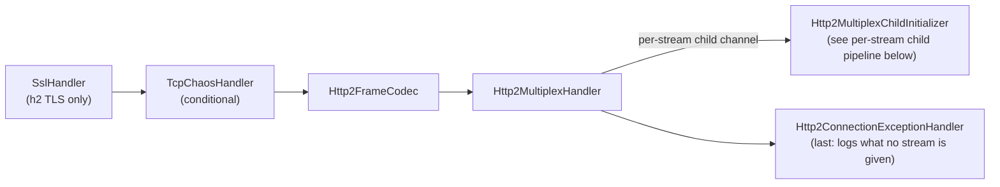

The stream-id mis-routing problems that affected the old shared-connection pipeline (issues #2419, #2667) are structurally impossible here: each stream is its own `Http2StreamChannel` child, so outbound writes never cross to another stream. The per-stream child pipeline is described in the [HTTP/2 Per-Stream Child Pipeline](#http2-per-stream-child-pipeline) section below.

##### When the server's `SETTINGS` is sent

**Outcome:** the server's `SETTINGS` frame is written as the HTTP/2 handler is added, but flushed only at the end of
the read that added it, once the bytes read with it have been decoded. A client that sends its request as its first
bytes and then resets the connection (closes with `SO_LINGER` 0, or with data unread) has its request received; a
client that sends its preface and then waits for the server's `SETTINGS` gets them from that same read.

Netty's `Http2ConnectionHandler` writes `SETTINGS` from `handlerAdded`, and by default (`flushPreface(true)`) flushes
them there. MockServer adds the handler in the middle of a read (`PortUnificationHandler.switchToH2c`/`switchToHttp2`,
from `decode`), so that flush reached the socket before the client's bytes had been decoded. On a reset connection it
failed, Netty closed the channel (`autoClose`), and `PrefaceDecoder.decode` dropped the bytes already read because the
channel was no longer active: the request was lost on every attempt, directly and through a tunnel. The server builders
now pass `flushPreface(false)`; `Http2ConnectionHandler.channelReadComplete` flushes after the read, as it does every
read.

| Where the server handler is added | Flush |
|---|---|
| `Http2RequestHeaderLimit.frameCodecBuilder`, from `PortUnificationHandler.decode`: `h2c` by prior knowledge, `h2` once the first decrypted bytes arrive (direct connections and MockServer's side of a tunnel's loopback) | at the end of the read |
| The tunnel's client-facing handler, added by `RelayTlsDetectionHandler.decode` for a cleartext tunnel | at the end of the read |
| The tunnel's client-facing handler, added as the client's TLS handshake completes (`h2` through `CONNECT` or SOCKS) | as it is added: no read of the client's may follow before a client that waits for the server's `SETTINGS` |
| The relay's loopback client handler (`RelayConnectHandler.configureHttp2LoopbackPipeline`) | as it is added (`flushPreface(true)`): a client sends first |

MockServer has no HTTP/1.1 `Upgrade: h2c` path. A handler between the socket and the HTTP/2 handler must pass
`channelReadComplete` on (see [the invariant](#invariant-a-handler-overriding-channelreadcomplete-must-propagate-it)),
or a client waiting for the server's `SETTINGS` would wait for ever.

A flush that fails between two reads, or before a read in the same event-loop pass, is covered by the next section.

##### A write that fails on a connection the client has reset

**Outcome:** on an accepted connection a write that fails ends the connection's output, not the connection. Whatever
the client sent before it reset the connection, and which has reached the socket unread, is still decoded, recorded
and matched (its response is attempted, and fails); the connection closes when its input ends, and after
`LingeringClose.LINGER_MILLIS` (5 s) at the latest.

Netty closes a channel whose write fails with an `IOException` (`autoClose`, in `AbstractUnsafe.handleWriteError`), and
the close drops what is still in the socket. When a write and a read are both waiting the write goes first: NIO's
`processSelectedKey` handles `OP_WRITE` (a flush of what is pending) before `OP_READ`, epoll's `processReady` runs
`epollOutReady` before `epollInReady` (an `EPOLLERR` event sets both), and a write handed to the event loop from
another thread runs with its tasks, before its next I/O. So a request that arrived with the reset while a response was
still being written (a client that gave up on a large response), or while the event loop was busy, was lost, and so
was an `h2` request sent with the client's last TLS handshake message through a tunnel, which writes when the handshake
completes; a request read in more than one pass whose first pass ended with a flush could be lost the same way.

| Part | What it does |
|---|---|
| `ReadAfterFailedWrite.install` (`mockserver-core` `o.m.socket`), from `MockServerUnificationInitializer` | Turns `autoClose` off on every accepted connection, so a failed write shuts the socket's output down and fires `ChannelOutputShutdownEvent`. Its handler then closes the socket after `LINGER_MILLIS` unless it has closed, or at once if the channel's reads are paused, as nothing would be read |
| The server HTTP/2 handlers (`Http2RequestHeaderLimit.frameCodecBuilder`, the tunnel's client-facing handler) | Skip `onConnectionError` for a write that failed as the output ended (no `Http2Exception`, output ended, channel active): Netty would send a `GOAWAY`, after which it ignores the streams the client opens later, and close. A close asked of them while the output has ended (the `CLOSE_ON_FAILURE` on their `SETTINGS`) waits for the input to end |
| `DownstreamProxyRelayHandler.endRelay` | When a write to the proxy client fails because its output ended, or its connection has closed, leaves the loopback open (read, and its responses dropped) so that what the client sent goes on to MockServer; `UpstreamProxyRelayHandler` ends it when the client's leg closes |
| `ReadAfterFailedWrite.endOutput` | Used by `LingeringClose` and `RelayLegClose`, which end an output on purpose and close the socket themselves; the handler leaves those alone |

On a reset connection the read after the failed write returns the bytes still unread and then the error, or the end of
the input, and Netty closes the channel. On NIO a write that had been waiting for the socket leaves `OP_WRITE` set when
it fails, so the selector reports the socket writable until the channel closes; on a reset connection that is the next
read, and the 5 s limit bounds any other case. Reads paused only after the output-shutdown event (a TCP chaos latency
queue, a parked WebSocket frame) are not closed at once, so on NIO the selector can spin on `OP_WRITE` for up to 5 s.

What this does not cover:

- **Linux epoll.** Not run locally. `RequestAfterFailedWriteIntegrationTest` holds MockServer's event loops while the
  client's request and reset arrive, so the failed write runs first on either transport; it must be green on CI's Linux
  agents for the epoll reasoning above to hold. Linux keeps data received before a reset readable, and returns it
  before the error.
- **A request read in more than one pass.** Covered by the same change, by reasoning: on loopback a read pass takes
  everything the socket holds, so the tests make the write fail before a read rather than between two passes.
- **A client that closes TLS with `close_notify`.** A JDK `SSLSocket` sends it before it closes; the tests reset the
  TCP socket under the TLS client instead.

##### Exceptions on the connection

`Http2ConnectionExceptionHandler` is the last handler of this pipeline, on `h2` and `h2c` alike, and logs each exception that reaches it once in MockServer's log. Without it they reach the end of Netty's pipeline, which logs every one at `WARN` with a stack trace through Netty's own logger (`An exceptionCaught() event was fired, and it reached at the tail of the pipeline`), whatever the cause.

Two things arrive there. `Http2FrameCodec` fires an inbound connection error down the pipeline before it sends the `GOAWAY` and closes, and passes on anything a handler ahead of it or the transport raised, such as the `Connection reset` of a client that drops the connection. `Http2MultiplexHandler` hands a stream's error to that stream's child pipeline and passes on everything else.

| What reached it | Logged |
|-----------------|--------|
| Netty's direct memory limit, anywhere in the cause chain | `ERROR`, the message the other handlers use for it; the connection is closed |
| A request refused for its header size (`Http2RequestHeaderLimit.isRefusal`) | nothing: `Http2RequestHeaderLimit` logged it at `WARN` where Netty raised it |
| Any other HTTP/2 connection error | `WARN`, the client's address, the error code and the cause |
| An SSL or decoder fault (`isSslOrDecoderFault`) | `WARN`, the exception's class and its message as `boundedFaultMessage` gives it (see [SSL and Decoder Fault Logging](#ssl-and-decoder-fault-logging)), no stack trace; the connection is closed |
| A connection its client closed or reset (not `connectionClosedException`) | `DEBUG`, the client's address and the exception's message; no stack trace |
| Anything else | `ERROR` and the cause; the connection is closed with `GOAWAY(INTERNAL_ERROR)` |

**What it closes.** Nothing for an HTTP/2 connection error: that is fired here *before* Netty's codec writes the `GOAWAY` and closes, so closing the channel from the handler would lose the `GOAWAY`. Nothing for a reset connection, which the transport closes. It closes the connection itself for an SSL or decoder fault, for the direct memory limit and for anything else, whatever the log level, as the HTTP/1.1 handlers do for any exception. (From reading Netty, not from a test: when the direct memory limit arrives inside a connection error of the codec, the handler's close passes back through the codec, which sends `GOAWAY(NO_ERROR)` and then closes, in place of the `GOAWAY` for the error.) For an SSL or decoder fault it has to close: Netty's JDK TLS handler (the one in use wherever Netty's OpenSSL native library is not loaded, as with the shaded jar, which ships none) neither closes a connection whose handshake is done when bytes arrive that are not a TLS record, nor stops reading it, so every later read raises the fault again. Its message is a hex dump of all the bytes read (`not an SSL/TLS record: …`), which is why the entry carries a cut message and no stack trace. For an exception in the last row it closes on a later task of the connection's event loop, through the codec: it writes `GOAWAY(INTERNAL_ERROR)` with no debug data, after any frame already written, and Netty's close flushes and then closes (with the codec's zero graceful-shutdown timeout, a stream still open is cut off, as on any close). The close waits for that task because the codec fires an exception it caught while decoding, which is no HTTP/2 error, down the pipeline before it sends its own `GOAWAY(INTERNAL_ERROR)`, with the exception's message as debug data, and closes; by the task that `GOAWAY` has been written, and the handler writes none once the codec has sent one: Netty's names the last stream `2147483647`, the handler's the last one created, so Netty would send both. Before, such an exception left the connection open, as reaching the end of Netty's pipeline did, and one that recurred was logged each time.

It must stay last: ahead of `Http2MultiplexHandler` it would take the stream errors that handler routes, and the streams would never be reset. `Http2ConnectionExceptionHandlerTest` checks the order, each row of the table and, with Netty's JDK TLS handler, that the first bytes that are not TLS close the connection; `Http2ConnectionErrorLoggingIntegrationTest` checks over a socket, on `h2` and `h2c`, that nothing reaches Netty's logger, that the `GOAWAY` is still sent, that a stream error still resets only its stream, and, for an exception fired into MockServer's side of the connection, the one `ERROR` entry, the `GOAWAY(INTERNAL_ERROR)` and the close, with the response already written received whole, and, for one the codec's `onError` is handed on the connection's event loop, that the `GOAWAY` the client gets is the codec's (its debug data is the exception's message). `Http2ConnectionExceptionHandlerTest` checks that a frame written before the exception is sent ahead of the `GOAWAY`; an `EmbeddedChannel` cannot test the deferral, because it runs pending tasks after every write, so the handler's task would run between the codec's two writes of its `GOAWAY`.

**Cost.** One handler object and its pipeline context for each direct HTTP/2 connection, about 80 bytes going by the two classes' fields (counted, not measured), allocated when the connection switches to HTTP/2. Nothing per request or per frame: it overrides only `exceptionCaught`, so Netty's pipeline skips it for every other event. It holds no state and could be shared between connections, but that would save only the handler object and need a holder that outlives the connection.

**Log volume.** One entry for each exception. Every row of the table ends the connection (the codec after a connection error, the transport after a failed read, the handler itself for an SSL or decoder fault, the direct memory limit or anything else), so each gives a client at most one entry for each connection it opens. The entry for a closed or reset connection is at `DEBUG`, below the default level, with no stack trace; the one for an SSL or decoder fault is cut to 256 characters of the exception's message; a connection error is logged at `WARN` with its stack trace (the longest message Netty was found to give one is about 1 KB, for an HTTP/1.x request where the preface belongs). An exception in the last row is logged at `ERROR` with its stack trace; no way for a client to raise one is known. One thing is outside that bound: `Http2MultiplexHandler` also fires an SSL fault into every stream open at the time, whose own handlers log it as they log any exception (with the stack trace, so with Netty's whole message): those entries are the child pipeline's, one or more for each open stream.

The client leg of a CONNECT or SOCKS tunnel has no such handler: its `HttpToHttp2ConnectionHandler` fires no connection error down the pipeline, and the relay handlers after it handle what the transport raises. So the `onError` that handler overrides for the header limit logs an inbound connection error itself, through the same `Http2ConnectionExceptionHandler.log`, before Netty sends the `GOAWAY`: one `WARN`, as on a direct connection, whose own codec's `onError` does not log it (the handler at the end of its pipeline does). Before, a tunnel logged nothing for it. `log` only logs and says how the direct connection's handler would close; the closing, the `GOAWAY(INTERNAL_ERROR)` included, is done in that handler's `exceptionCaught`, so a tunnel, whose handler closes for itself after the error, does not close twice. A stream error is not a connection error and is logged as in [HTTP/2 streams cut short](#http2-streams-cut-short). MockServer's end of the tunnel's loopback leg is a direct connection and has the handler. The relay's end, the client `HttpToHttp2ConnectionHandler` that `Http2RequestHeaderLimit.relayLoopbackHandler` builds, has the same `onError` (`logConnectionErrorThen`, shared with the client leg): a frame from MockServer's end that Netty refuses is one `WARN`, and an exception thrown by one of the relay's frame listeners, which Netty answers with `GOAWAY(INTERNAL_ERROR)`, is one `ERROR` with its stack trace. Before, the relay's end logged neither; `LoopbackHttp2ConnectionCloseHandler` still answers the client's streams. `RelayLoopbackConnectionErrorLoggingTest` checks both, and that a stream error or an error raised writing is not logged there.

##### HTTP/2 streams cut short

**A stream that ends before its request is complete is logged once, with no stack trace: `INFO` when the client cancelled it or its connection closed, `WARN` when the stream is reset for an error of its own, and that reset carries the error's code.** It is the same on a direct connection and on the client leg of a CONNECT or SOCKS tunnel. Before, a direct connection logged a cancelled upload at `ERROR` with a stack trace as `web socket server caught exception`, logged an error of a stream twice at `ERROR` and reset the stream with `CANCEL`; a tunnel logged nothing for a cancelled upload.

| What happened | Logged | The stream |
|---|---|---|
| The client sent `RST_STREAM` before its request was complete | `INFO` `HTTP/2 stream ... was cancelled by its client with ... before its request was complete` | closed by the client |
| The connection closed with a request incomplete | `INFO` `HTTP/2 stream ... ended with its connection before its request was complete`, one for each such stream | closed with the connection |
| The client sent `RST_STREAM` once its request was complete | nothing | closed by the client |
| An error of a stream that is open (tested with a `WINDOW_UPDATE` of 0, while a request is being uploaded and while its response is awaited) | `WARN` `resetting HTTP/2 stream ... for stream error ... because ...` | reset with the error's code |
| An error of a stream that has gone (a frame already on its way when the stream was reset) | nothing: Netty answers it with a reset | none |
| Netty closes the connection because it had to send too many resets | `WARN` `closing HTTP/2 connection ... for connection error ENHANCE_YOUR_CALM because ...` | all closed, after a `GOAWAY` |
| Request trailers over `maxHeaderSize` | `WARN`, by `Http2RequestHeaderLimit` (see [Request line and header limits](#request-line-and-header-limits)) | reset with `PROTOCOL_ERROR` |

`Http2StreamFaults` holds every entry. The errors are logged where Netty raises them, in the `onError` both codecs already override for the header limit (`Http2RequestHeaderLimit.logRefusalThen`), so one piece of code serves both kinds of connection. The two `INFO` entries are found differently, because a request is held in a different place:

| | Direct connection | Tunnel's client leg |
|---|---|---|
| Holds an incomplete request | the stream's aggregator, which reports it as a `PrematureChannelClosureException` when the stream's channel closes | the relay's `InboundHttp2ToHttpAdapter`, which hands a request on only when it is complete |
| Client's `RST_STREAM` | `LenientInboundHttp2StreamFrameCodec` notes the reset Netty reports to the stream; `CallbackWebSocketServerHandler`, the first handler after the aggregator, asks `Http2StreamFaults.isRequestCutShort` about the exception | the frame listener is wrapped (`tunnelFrameListener`) and logs a reset of a stream whose client side is still open |
| Connection closed | the same exception, on a stream whose connection is no longer active | the handler's `channelInactive` logs each stream whose client side is still open, before Netty closes them |
| Stream's own error | `LenientInboundHttp2StreamFrameCodec` stops the exception and marks the stream; Netty then closes the stream's channel with the error's code, and the aggregator's report is recognised by the mark | Netty resets the stream with the error's code |

A `PrematureChannelClosureException` on a stream that none of these explains is still logged by `CallbackWebSocketServerHandler` as before: something else closed the stream, and that is worth seeing. A WebSocket fault is logged as before too.

**Why the reset must carry the error's code.** Closing a stream's channel from a handler resets it with `CANCEL` whatever went wrong, which tells the client nothing, and which Netty's limit on resets does not count (next paragraph).

**What bounds the entries one connection can cause.** Each entry costs the client a stream, as a request does, and a request logs more. Beyond that, Netty closes an HTTP/2 server connection, with `GOAWAY(ENHANCE_YOUR_CALM)`, that:

| Limit (Netty's default for a server, set by neither builder) | Bounds |
|---|---|
| whose client sends more than 200 `RST_STREAM` frames in 30 seconds (`decoderEnforceMaxRstFramesPerWindow`) | the `INFO` entries for cancelled requests |
| whose client makes the server send more than 200 `RST_STREAM` frames in 30 seconds, not counting `CANCEL` and `NO_ERROR` (`encoderEnforceMaxRstFramesPerWindow`) | the `WARN` entries for stream errors. With the stream reset as `CANCEL`, as before, nothing bounded them: a client could repeat a stream error on stream after stream for as long as it liked |
| (not a close) `SETTINGS_MAX_CONCURRENT_STREAMS`, 100 | the `INFO` entries when a connection closes: one for each stream then open |

Both limits are Netty's builder defaults for a server; MockServer sets neither, so a Netty upgrade that changed them would change the bound (the tests pin 200). A limit trips inside a read, and the frames of that read are still processed before the connection closes, so up to about one read's worth of stream `WARN` entries can follow the closing `WARN` (a review run sent 300 in three writes of 100 and all 300 were logged); the closing entry itself is logged once.

The first is an inbound connection error, which `Http2ConnectionExceptionHandler` logs on a direct connection and the client leg's handler logs on a tunnel (see [Exceptions on the connection](#exceptions-on-the-connection)); the second is raised while writing, reaches no handler, and is logged by `Http2StreamFaults`. `Http2ConnectionErrorLoggingIntegrationTest` covers every row over a socket on `h2`, `h2c`, a CONNECT tunnel and a SOCKS5 tunnel, and both limits; `Http2StreamFaultsTest` covers what is left to other handlers.

An HTTP/1.1 upload cut short is logged the same way, at `INFO`: see [HTTP/1.1 uploads cut short](#http11-uploads-cut-short).

##### A mocked final `1xx`

**An expectation whose response has a `1xx` status other than `101` is sent over HTTP/2 as an interim response, and its stream is then reset with `NO_ERROR`, on a direct connection and through a tunnel alike.** Before, a direct connection sent the `1xx` and left the stream open for the life of the connection, so the client waited for a response that never came and the connection was never idle; a tunnel sent the `1xx` with `END_STREAM`.

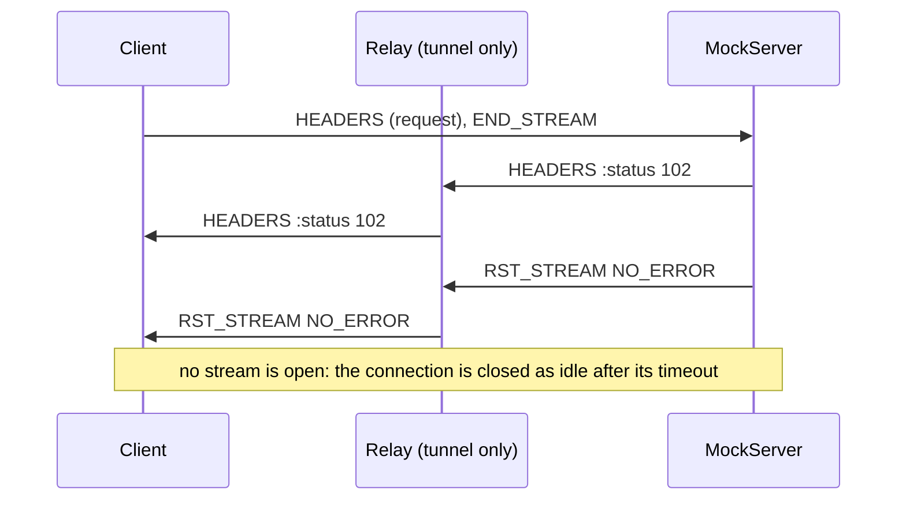

**Why a reset.** RFC 9113 section 8.1 allows an interim response to be followed only by another response, so a stream cannot end after one without being malformed, whether the `END_STREAM` is on the `1xx` itself or on an empty DATA frame after it. Only a reset ends the stream without breaking the framing. What clients made of each, sent by a bare cleartext HTTP/2 server on macOS (by hand, not in a test):

| After `HEADERS :status 102` | curl 8.7.1 (nghttp2 1.68.1) | Node 26 `http2` | Go 1.26 `net/http` |
|---|---|---|---|
| `END_STREAM` on the `1xx` (a tunnel, before) | waits until its own timeout | stream error `PROTOCOL_ERROR`, the `102` not delivered | `PROTOCOL_ERROR`: `1xx informational response with END_STREAM flag` |
| an empty DATA frame with `END_STREAM` | waits until its own timeout | stream error `PROTOCOL_ERROR` | `PROTOCOL_ERROR` |
| `RST_STREAM NO_ERROR` | fails at once: `closed cleanly, but before getting all response header fields` | the `102`, then the stream closes with no error | fails at once: `NO_ERROR; received from peer` |
| `RST_STREAM CANCEL` | fails at once: `not closed cleanly: CANCEL` | the `102`, then the stream closes with no error | fails at once: `CANCEL; received from peer` |
| nothing (a direct connection, before) | waits until its own timeout | waits | waits |

`Http2FinalInformationalResponseIntegrationTest` checks the frames with Netty's client on `h2`, `h2c` and both kinds of tunnel, and that the JDK's `HttpClient` (17) fails the request at once with `Received RST_STREAM` and has its next request answered.

**Why `NO_ERROR`.** Nothing went wrong: the expectation asked for a response that is not one. `REFUSED_STREAM` invites a retry, `PROTOCOL_ERROR` and `INTERNAL_ERROR` blame one side, and Netty counts all three towards the resets it allows a connection (see [HTTP/2 streams cut short](#http2-streams-cut-short)), so a client that asked for a few hundred such responses would have its connection closed. It counts neither `NO_ERROR` nor `CANCEL`.

**How.** `NettyResponseWriter.writeWhole` writes a `DefaultHttp2ResetFrame` to the stream's channel after the response, in the same flush, and hands the reset's write on as the response's. The order matters for a response with `closeSocket`, whose stream's channel is closed when that write completes: closing a stream that has not been reset sends `CANCEL` (a delayed response with `closeSocket` did, written the other way round). A final `1xx` with a `chunkSize` (with or without a `chunkDelay`) is written whole over HTTP/2, without the chunk size (`withoutChunking`): Netty's codec takes a `1xx` only as one `FullHttpResponse`, so in pieces it sent nothing at all, neither the `1xx` nor a reset (also before this change). Over HTTP/1.1 `HttpExchangeEndedEvent` is fired, as before. Netty's `Http2StreamFrameToHttpObjectCodec` already wrote a `1xx` without `END_STREAM`. On a tunnel the loopback's `LoopbackHttp2ResponseStreamer` hands a `1xx` on as it is read, as a `StreamedHttp2ResponsePart` whose headers do not end the stream, where before `InboundHttp2ToHttpAdapter` handed it on whole and the client leg's `HttpToHttp2ConnectionHandler` ended the stream with it; `LoopbackHttp2StreamErrorHandler` then relays MockServer's reset with its code, as it does any other.

**The user is told once per expectation.** Most clients report such a request as failed, which an expectation written for HTTP/1.1 does not lead a user to expect, so the first time an expectation answers a request over HTTP/2 with a final `1xx`, `HttpActionHandler` logs one `WARN`, with no stack trace, naming the expectation, saying the stream was reset and how to answer HTTP/2 clients (a status of 200 or above, or a request matcher with a protocol of `HTTP_1_1`). Later requests to it log nothing more: a user mocking a `102` on purpose to test a client would find a `WARN` per request noise. The mark is the expectation's action, held by identity in a weak set (`FinalInformationalResponseWarning`), so an expectation that is replaced or added again is warned about again and a removed one leaves nothing behind; each response of a response sequence is its own action. The protocol is the request's own (`Protocol.HTTP_2`, from the stream's codec, also on the loopback leg of a tunnel), which is decided only when a request arrives, not when the expectation is created.

**An interim response that a final one follows is not affected.** The `100` MockServer answers `Expect: 100-continue` with comes from the stream's aggregator (from the relay, in a tunnel), not from an expectation, and its stream goes on to the final response. MockServer has no way to mock a `103` that a final response follows.

| Protocol | A mocked final `1xx` | Then |
|---|---|---|
| HTTP/1.1, direct or in a tunnel | the `1xx` status line and headers; the connection stays open | the exchange is counted as ended (`HttpExchangeEndedEvent`), so the connection is closed as idle |
| HTTP/2, direct or in a tunnel | `HEADERS` without `END_STREAM`, then `RST_STREAM NO_ERROR` | the connection is closed as idle |
| HTTP/3 | `HEADERS` alone (no body, no trailers), then `RESET_STREAM H3_NO_ERROR`; `101` included, as HTTP/3 has no upgrade | QUIC's own `http3MaxIdleTimeout`; an open stream does not hold a QUIC connection open |

**Over HTTP/3** `Http3ResponseWriter.writeInformationalResponse` writes a `1xx` (any, `101` included: RFC 9114 has no upgrade) as its header section alone and then resets the stream with `H3_NO_ERROR`, for a direct request, a response to `HEAD`, a delayed one and one with a streamed body (discarded, its upstream closed). Before, it wrote the `1xx` and ended the stream with a `FIN`, which RFC 9114 section 4.1 does not allow either, and a `1xx` with a body or trailers closed the whole QUIC connection: Netty's encoder takes a DATA frame or trailers after an interim response as `H3_FRAME_UNEXPECTED`, a connection error (in `mockserver-8.0.0`). The reset is made in a task after the header section's write: a QUIC reset drops what the stream has not yet sent, and a write made while the connection is being read is sent only when that read completes, so a reset in the write's own listener reached Netty's HTTP/3 client with no `1xx` before it. Deferred, the `1xx` reached it before the reset in every local run, but that is not guaranteed: QUIC does not retransmit a reset stream's data. `HttpActionHandler` warns once per expectation, as for HTTP/2, naming `H3_NO_ERROR` (`Http3FinalInformationalResponseIntegrationTest`, with Netty's HTTP/3 client on macOS).

#### gRPC Pipeline (over HTTP/2)

When gRPC is enabled and the `GrpcProtoDescriptorStore` has loaded services, `GrpcToHttpResponseHandler` and `GrpcToHttpRequestHandler` are appended to every per-stream child pipeline (after `MockServerHttpServerCodec`). They operate on MockServer model objects (`HttpRequest`/`HttpResponse`), not raw Netty HTTP objects. Their position within the full child pipeline is shown in the [HTTP/2 Per-Stream Child Pipeline](#http2-per-stream-child-pipeline) section; specifically:

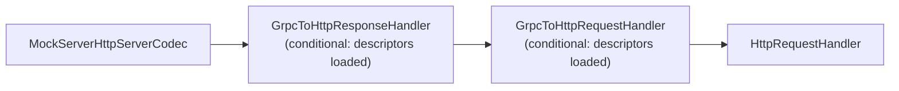

| Handler | Class | Purpose |
|---------|-------|---------|
| GrpcToHttpResponseHandler | `o.m.netty.grpc` | Outbound encoder — intercepts responses with `x-grpc-service` header, encodes JSON body back to gRPC-framed protobuf, appends `grpc-status` trailers; also converts gRPC-Web responses (trailers-in-body) when `x-grpc-web-content-type` header is present |
| GrpcToHttpRequestHandler | `o.m.netty.grpc` | Inbound handler — intercepts `application/grpc` requests, decodes protobuf body to JSON using descriptors, rewrites as `POST /<service>/<method>` with `x-grpc-*` headers; also translates `application/grpc-web*` requests to standard gRPC before processing |

h2c (HTTP/2 cleartext) is detected by `isH2cPreface()` in `PortUnificationHandler`, which checks for the HTTP/2 connection preface (`PRI * HTTP/2.0\r\n\r\nSM\r\n\r\n`). Both `switchToH2c()` and `switchToHttp2()` conditionally include gRPC handlers in the child pipeline when descriptors are loaded. The `switchToHttp()` method also adds gRPC handlers to the HTTP/1.1 pipeline to support gRPC-Web over HTTP/1.1.

#### HTTP/2 Per-Stream Child Pipeline

Every HTTP/2 stream — ordinary HTTP GET/POST/SSE, the dashboard, MCP, proxying, and gRPC — runs through a per-stream child channel initialized by `Http2MultiplexChildInitializer` (`org.mockserver.netty.unification`). The child pipeline (handler order):

```mermaid
graph LR
    CS["ConnectionScopeHandler
(copies parent attrs, then removes self)"] --> ROUTER
    ROUTER["GrpcBidiRouterHandler
(only if grpcBidiStreamingEnabled AND descriptors loaded)"] -->|"bidi gRPC stream"| BIDI[GrpcBidiStreamHandler]
    ROUTER -->|"all other streams"| SF
    CS --> SF["LenientInboundHttp2StreamFrameCodec
(lenient inbound, strict outbound)"]
    SF --> SAC["StreamAddressedContentHandler
(outbound: preserve terminal endStream)"]
    SAC --> DEC["MockServerHttpContentDecompressor
(inbound: decompress content-encoding body)"]
    DEC --> AGG["CoalescingHttpObjectAggregator
(per-stream limit, tiny frames into blocks)"]
    AGG --> CB[CallbackWebSocketServerHandler]
    CB --> DASH[DashboardWebSocketHandler]
    DASH --> MCP["McpStreamableHttpHandler
(conditional)"]
    MCP --> CODEC[MockServerHttpServerCodec]
    CODEC --> TC[TraceContextHandler]
    TC --> ALTSVC["AltSvcHeaderHandler
(conditional)"]
    ALTSVC --> GRPC_RESP["GrpcToHttpResponseHandler
(conditional)"]
    GRPC_RESP --> GRPC_REQ["GrpcToHttpRequestHandler
(conditional)"]
    GRPC_REQ --> HANDLER[HttpRequestHandler]
```

`LenientInboundHttp2StreamFrameCodec` + `HttpContentDecompressor` + `HttpObjectAggregator` re-aggregate inbound stream frames into `FullHttpRequest` objects, so the downstream handler chain sees the same objects regardless of whether the stream carries ordinary HTTP, SSE, MCP, or gRPC. The aggregator (`HttpObjectAggregators.streamHttpObjectAggregator`, a `CoalescingHttpObjectAggregator`) gets a tenth of the HTTP/1.1 component limit, at least 1,024, because one connection carries up to 100 streams, and copies runs of DATA frames under 1 KiB into 16 KiB blocks so a body of tiny frames is copied about once instead of being consolidated whole at every limit (see [memory-management.md → Direct-memory limit](memory-management.md#direct-memory-limit)). The decompressor and the codec's lenient-inbound/strict-outbound header handling (see the notes below) ensure behavioural parity with the HTTP/1.1 path.

**Connection-scoped attributes (`ConnectionScopeHandler`).** An `Http2StreamChannel` child does **not** inherit its parent connection channel's attribute map (`AbstractHttp2StreamChannel` delegates `localAddress()`/`remoteAddress()` to the parent, but not attributes). Every downstream handler reads connection-scoped state from `ctx.channel()` — which on a child is the stream channel — so `ConnectionScopeHandler` is installed as the **first** handler of every child pipeline (before `GrpcBidiRouterHandler`, omitted from the diagram) and copies the connection-scoped attributes from the parent once, then removes itself. It references each owning class's `public` `AttributeKey` constant directly (single source of truth), so the list stays in lockstep with the readers. The copied attributes are exactly (`ConnectionScopeHandler.CONNECTION_SCOPED_ATTRIBUTES`): `LOCAL_HOST_HEADERS`, `PROXYING`, `REMOTE_SOCKET`, `HTTP2_ENABLED`, `TLS_ENABLED_UPSTREAM`, `TLS_ENABLED_DOWNSTREAM`, `NETTY_SSL_CONTEXT_FACTORY`, `NEGOTIATED_APPLICATION_PROTOCOL`, `UPSTREAM_SSL_HANDLER`, `UPSTREAM_SSL_ENGINE`, `UPSTREAM_CLIENT_CERTIFICATES` and `SNI_HOSTNAME` — i.e. every attribute set on the connection channel during port unification / TLS handshake / proxy detection that a child-pipeline handler reads. (`HTTP_ENABLED` and `TRANSPARENT_ORIGINAL_DST_RESOLVED` are read only by connection-level handlers and are excluded; `TRACE_CONTEXT`, `WS_REGISTRY_KEY` and the CORS attributes self-initialise on the child.) Without this, `SniHandler.getALPNProtocol` (protocol detection / stream-id capture / `withProtocol(HTTP_2)` matching), `PortUnificationHandler.isHttp2Enabled` (the WebSocket-over-HTTP/2 `501` gate), `SniHandler.retrieveClientCertificates` (mTLS control-plane auth), and `HttpRequestHandler.isProxyingRequest` / `HttpActionHandler.getRemoteAddress` (proxied-forward routing — the proxying flag *and* the remote target) all misbehave on multiplexed streams (GitHub issue #2669). This mirrors the forward-client side, where `Http2ForwardStreamChildInitializer` copies `EXPECT_STREAMING_RESPONSE` onto its stream children for the same reason.

**Transport timers (metrics only).** When `metricsEnabled` is on, `Http2MultiplexChildInitializer` adds an `Http2StreamTransportTimer` right after `ConnectionScopeHandler`, ahead of the frame-to-HTTP codec, so it sees the stream's raw HEADERS/DATA frames and the `endStream` flag; `PortUnificationHandler.switchToHttp` adds an `HttpTransportTimer` after `HttpServerCodec` and the chunk-line limiter's after-codec handler (after `HttpExchangeTracker` when both are present). Both feed `mock_server_request_transport_duration_seconds` and are pass-throughs for the messages themselves; with metrics off neither is installed. See [metrics.md](metrics.md#transport-inclusive-request-latency-histogram).

**SSE / HTTP streaming (`StreamAddressedContentHandler`).** On any HTTP/2 path `getStreamId()` is non-null, so `HttpSseResponseActionHandler` and other streaming writers wrap each per-event chunk and the terminal frame in a `StreamAddressedHttpContent`. Without a consumer of that wrapper the `Http2StreamFrameToHttpObjectCodec` would see only the bare `HttpContent` branch, which emits `DefaultHttp2DataFrame(content, endStream=false)` — hard-coding the flag and **silently discarding the terminal frame's `endStream=true`**. The stream would never close and the client would hang until it timed out, with nothing logged. `StreamAddressedContentHandler` (a stateless `@Sharable` outbound handler, `INSTANCE`, installed immediately after the codec so outbound writes reach it *before* the codec) translates the wrapper into the `HttpObject` subtype the codec maps correctly: a terminal frame becomes a `DefaultLastHttpContent` (which `encodeLastContent` emits with `endStream=true`, even for an empty buffer, via its `needFiller` branch) and a non-terminal chunk becomes a plain `DefaultHttpContent`. The buffer transfers to the new carrier with no retain/release. On the child channel the stream id is implicit (the channel *is* the stream), so only the `endStream` flag needs preserving (GitHub issue #2669). `HttpObjectAggregator` is inbound-only, so inserting the handler before it does not affect inbound aggregation.

**Request-body decompression (`MockServerHttpContentDecompressor`).** Every HTTP/2 stream passes through this child pipeline, including ordinary HTTP requests with a compressed body (`content-encoding: gzip`/`deflate`/`br`/…). Without a decompressor the request body would reach the matchers still compressed (with `content-encoding` intact) and a `withBody(...)` expectation would silently fail to match — MockServer would answer `404`. A `MockServerHttpContentDecompressor` (Netty's `HttpContentDecompressor` with raw-block Snappy support) is installed between the codec and the aggregator, mirroring the HTTP/1.1 path (`switchToHttp` adds it before its aggregator). It sits *after* `StreamAddressedContentHandler` so that outbound-only handler stays immediately adjacent to the codec on writes (the decompressor is inbound-only — a pass-through on the outbound path), and *before* the aggregator so the body is decompressed before aggregation. It is inert for gRPC, whose message compression is carried by `grpc-encoding` (handled in `GrpcFrameCodec`), not `content-encoding` (GitHub issue #2669).

**Per-connection codec mappers (`MockServerHttpServerCodec`).** Every stream gets its own `MockServerHttpServerCodec` (it is not `@Sharable`, and its decoder carries per-channel read state), but the request and response mappers inside it — `FullHttpRequestToMockServerHttpRequest` and `MockServerHttpResponseToFullHttpResponse` — are built once per HTTP/2 connection and reused by all of that connection's streams. They are held in an attribute on the **parent** connection channel, created on the first stream, and never shared between connections. They therefore live as long as the connection — 300–400 bytes plus the header memo (see [memory-management.md](memory-management.md#header-sharing-across-a-connections-requests)) retained per connection that has opened a stream — so a small rise in `Http2ConnectionMemoryBenchmark`'s notify-only `bytes_per_connection` from this change is expected, not a regression. Sharing is safe because the mappers' only mutable state is touched only from the connection's event loop, which every stream child of that connection runs on: the request mapper's memoised local/remote address strings, keyed on the connection's (stable) address instances; its `JDKCertificateToMockServerX509Certificate`'s `lastExtractedChain`, the fields extracted from the connection's client certificate chain, reused while the same `Certificate[]` is handed over; and its memo of the previous request's header wrappers, which lets an equal header name or value reuse one immutable `NottableString` across the connection's requests. Only `Http2StreamChannel` children share; any other channel handed to `installReAggregatingChain` gets fresh mappers.

**Split header validation (`LenientInboundHttp2StreamFrameCodec`).** Netty's `Http2StreamFrameToHttpObjectCodec` carries a single `validateHeaders` flag that governs conversion in **both** directions, but this pipeline needs the two directions to differ, so the codec is a small subclass, `LenientInboundHttp2StreamFrameCodec`.

*Inbound (lenient).* The subclass calls `super(true, false)` — the *first* base argument is `isServer`, the *second* is `validateHeaders`. Passing only `(true)` would leave `validateHeaders` at its default `true`, so the HTTP/1-object conversion (`HttpConversionUtil.toHttpRequest`) would reject request header values that are legal in an HTTP/2 field but illegal under the stricter HTTP/1 value rules (a leading space, an embedded `DEL`/`0x7F`, other control characters), resetting the stream with `RST_STREAM(PROTOCOL_ERROR)` before the request ever reached the matchers. Setting the flag to `false` lets a mock server record and match the malformed traffic users deliberately send to test their clients.

*Outbound (strict).* That same `false` flag would also relax the codec's *outbound* response-header conversion (`HttpConversionUtil.toHttp2Headers`), silently disabling response- and trailer-header **name** validation. The subclass overrides `encode` to re-assert it: before delegating to `super.encode`, it runs the exact conversion the base class would run with validation on — `toHttp2Headers(msg, true)` for a response head and `toHttp2Headers(trailingHeaders, true)` for non-empty trailers (e.g. gRPC `grpc-status`/`grpc-message`) — and discards the result, letting it throw the same `Http2Exception` the strict path throws. This costs one extra header conversion per response head, which is deliberate and keeps the rule faithful to Netty rather than re-implementing the RFC token check by hand. Only header **names** are validated, never values: the base class builds outbound headers with the 2-arg `DefaultHttp2Headers(validate, arraySizeHint)` constructor, which installs a name validator when `validate` is true and no value validator either way. (The separate 3-arg `DefaultHttp2Headers(validate, validateValues, arraySizeHint)` constructor *can* install a value validator, but the codec does not use it.) Per-chunk `HttpContent` carries no headers and is not validated (GitHub issue #2669).

*A response to `HEAD`.* The base codec knows nothing of the request's method, so it would send a response's body after its header block even when the request was `HEAD`, which RFC 9110 section 9.3.2 does not allow. When the stream's request HEADERS frame carries `:method: HEAD`, the subclass marks the stream (a channel attribute) and writes the final response as its header block alone, with no content and no trailers, so the HEADERS frame ends the stream. The header block keeps the response's `content-length`, the length a `GET` would be sent, as Netty's `HttpServerCodec` does on HTTP/1.1. A `1xx` interim response is written as usual first. Anything written after the final header block (the rest of a streamed body, trailers) is released and its write succeeds without sending. Mocked and forwarded responses, on a direct connection and through a CONNECT or SOCKS tunnel (whose loopback leg runs this pipeline), all pass this codec.

**Server-streaming:** `GrpcStreamResponseActionHandler` writes raw Netty HTTP objects (`DefaultHttpResponse`, per-message `DefaultHttpContent`, `DefaultLastHttpContent` with grpc-status/grpc-message trailers) directly to the `ChannelHandlerContext`. On the multiplex path, `Http2StreamFrameToHttpObjectCodec` is bidirectional and converts these outbound objects to HTTP/2 stream frames: initial HEADERS (with `Transfer-Encoding: chunked` automatically stripped by `HttpConversionUtil`), per-message DATA frames (byte-for-byte identical gRPC framing), and a trailing HEADERS frame with `grpc-status`/`grpc-message` and `endStream=true`. The `MockServerHttpServerCodec` encoder and `GrpcToHttpResponseHandler` do not intercept raw Netty objects (they only match `org.mockserver.model.HttpResponse`), so the objects pass through cleanly. No production code changes were needed -- the codec handles everything correctly.

| Property | Default | Env var | System property |
|----------|---------|---------|-----------------|
| `grpcBidiStreamingEnabled` | `false` | `MOCKSERVER_GRPC_BIDI_STREAMING_ENABLED` | `mockserver.grpcBidiStreamingEnabled` |

`grpcBidiStreamingEnabled` controls **bidi routing only** — when `false`, the per-stream child pipeline still runs for all HTTP/2 traffic but `GrpcBidiRouterHandler` is not installed and every stream takes the re-aggregating chain directly. The multiplex pipeline itself is unconditional since issue #2669.

**Client-streaming (collect-then-respond):** For client-streaming RPCs, a client sends HEADERS followed by N DATA frames (each containing a gRPC length-prefixed message) then END_STREAM. `LenientInboundHttp2StreamFrameCodec` + `HttpObjectAggregator` re-aggregate all DATA frame bytes into a single `FullHttpRequest` body (byte-for-byte concatenation). `GrpcToHttpRequestHandler.convertGrpcRequest()` then decodes the concatenated body via `GrpcFrameCodec.decode()` into N messages, producing a JSON array body with the `x-grpc-client-streaming: true` header. Single-message requests (unary) decode as a single JSON object with no client-streaming header, preserving the distinction. No production code changes were needed — the existing re-aggregation + decode pipeline handles this correctly.

**Bidi request end (trailers).** A gRPC client ends a bidi request with END_STREAM on a DATA frame, but a request may end with trailers instead. `GrpcBidiStreamHandler` (and `GrpcBidiReflectionHandler`, for server reflection) takes only the first HEADERS frame as the request's headers; a later one is the request's trailers, and it ends the request as END_STREAM on DATA does: the response ends with its configured `grpc-status`, and the connection's other streams are untouched. HTTP/3 does the same: `Http3MockServerHandler` ignores a trailer section, and the stream's input closing ends the request. Trailers over `maxHeaderSize` are different. Over HTTP/2, Netty hands the error to the bidi stream's own pipeline, where `GrpcBidiStreamHandler.exceptionCaught` writes a `grpc-status` INTERNAL trailer before Netty resets the stream. Over HTTP/3, the connection is closed with `H3_EXCESSIVE_LOAD`, as for any stream.

Phase 3 will add true interleaved/reactive bidirectional streaming by removing the inbound re-aggregation and handling individual DATA frames with per-inbound-message reactive responses.

#### TLS Pipeline

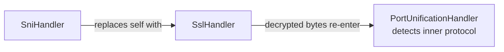

`SniHandler` (in `mockserver-core`) extends Netty's `AbstractSniHandler`. It extracts the hostname from the TLS ClientHello SNI extension, dynamically generates a certificate with that hostname as a Subject Alternative Name, and negotiates ALPN (HTTP/1.1 or HTTP/2). When the cached server context is still valid the lookup completes on the event loop; only a context that must be (re)built is provisioned on the `mockserver-ssl-context-*` pool (see [tls-and-security.md](tls-and-security.md#dynamic-certificate-generation)).

#### SOCKS4 Pipeline


#### SOCKS5 Pipeline


SOCKS5 is multi-phase: initial handshake → optional password auth → CONNECT command.

## Outbound Buffering and Backpressure

**A slow reader holds at most about 64 KB of its response in MockServer's outbound buffer, on HTTP/1.1
and HTTP/2. Through a CONNECT or SOCKS tunnel that holds for a streamed response only: any other is held whole.** Netty's write-buffer water mark does not limit memory on its own: a write always lands in
the channel's outbound buffer, and the mark only changes what `isWritable()` reports. So the bound comes
from the code that waits for writability, and each protocol has its own:

| Path | What waits for writability | Per-connection outbound data for a slow reader |
|------|----------------------------|-----------------------------------------------|
| HTTP/1.1 response | `PacedLargeWriteHandler` (a `ChunkedWriteHandler`) sends an encoded buffer over 64 KB in 32 KB slices while the connection is writable | About one slice plus the 32 KB high-water mark |
| HTTP/2 response | Netty's `DefaultHttp2RemoteFlowController` writes at most `max(bytesBeforeUnwritable(), 32 KB)` of DATA per pass, and nothing while the connection is unwritable | About 64 KB by Netty's design (not measured here); the rest of the body waits in the flow controller as slices of the original buffer |
| WebSocket proxy passthrough | `FrameRelayHandler` turns the peer's `autoRead` off while the channel it writes to is unwritable | What one read of the peer brought in |
| Streaming forward (`StreamingResponseRelayHandler`) | Reads the upstream again only once the decoded bytes not yet written have drained to min(64 KiB, `maxResponseBodySize` / 4); past `maxResponseBodySize` the stream is aborted | The watermark plus one upstream read, decoded |
| CONNECT / SOCKS tunnel | The relay aggregates each response from the loopback server before writing it to the client, except a streamed one and raw bytes, which it relays piece by piece. In an HTTP/1.1 tunnel the loopback's reads are stopped above min(256 KiB, `maxRequestBodySize` / 2) unwritten (streamed and raw bytes together) until the backlog halves, and a streamed response is aborted when its unwritten streamed bytes alone, not counting raw bytes, pass `maxRequestBodySize`; raw bytes are never aborted. In an HTTP/2 tunnel each DATA frame is handed on as it is read and its bytes are returned to the loopback stream's flow-control window only once written to the client, so MockServer may send one window (65,535 bytes) more than the client has taken (see [HTTP/2 loopback: streamed responses](#http2-loopback-streamed-responses)) | The whole response, up to `maxRequestBodySize`; a streamed one or raw bytes, about 256 KiB plus one read in an HTTP/1.1 tunnel; a streamed one, one flow-control window per stream in an HTTP/2 tunnel |

**Why the body, and why direct memory.** An HTTP/1.1 response body is a heap buffer (usually the
expectation's own bytes). The NIO and epoll transports copy a heap buffer into a direct buffer when it is
written, so before `PacedLargeWriteHandler` every client still reading a large response held a direct
copy of the whole body: 40 clients reading an 8 MB body slowly held 340 MB of direct memory in a 1 GB
container, and the same load killed a 512 MB container. The handler bounds the copy to one slice.

**Why it sits below the codec.** `PacedLargeWriteHandler` is between the socket-side handlers (TLS, TCP
chaos) and `HttpServerCodec`, so it sees encoded bytes. The bytes on the wire are unchanged (a `HEAD`
response or a `Transfer-Encoding: chunked` one is framed by the codec before pacing), and anything written
after a paced body queues behind it in order — including the raw bytes `HttpErrorActionHandler` writes
from the codec's context. It paces only while `HttpServerCodec` is in the pipeline: a WebSocket upgrade
removes the codec, and from then on frames go straight to the outbound buffer, where the WebSocket
relay's backpressure can see them. When a connection becomes a CONNECT or SOCKS tunnel, `HttpConnectHandler` / `SocksConnectHandler` remove it along with the HTTP codecs. (`ChunkedWriteHandler` does not count what it queues as pending
outbound bytes, so a frame queued behind a paced write would be invisible to that backpressure.)

**Bodies up to 64 KB are not paced.** They pass through with one `instanceof` and a size check. A body
between the high-water mark and 64 KB still lands in the outbound buffer whole, as before.

## Streaming Relay

When `streamingResponsesEnabled` is `true` (default), the `HttpObjectAggregator` in the **forward-path client pipeline** (inside `NettyHttpClient`) and in the relay pipelines inside `RelayConnectHandler` is replaced by `StreamingAwareHttpObjectAggregator`.

`StreamingAwareHttpObjectAggregator` is a subclass of `HttpObjectAggregator`, by way of `CoalescingHttpObjectAggregator` (`mockserver-core` `org.mockserver.codec`): past its component limit it merges only the pieces added since its last merge, and on upstream-opened HTTP/2 streams it also copies runs of tiny frames into blocks. It inspects the first response head and switches to streaming when **either** signal is present:

- **Response says so** — `Content-Type: text/event-stream`.
- **The client asked for a stream** — `NettyHttpClient` sets an `EXPECT_STREAMING_RESPONSE` channel attribute when the forwarded *request* declares streaming intent (an `Accept: text/event-stream` header, or a JSON body with `"stream": true`). This covers streaming backends that omit the content type — notably the OpenAI **Codex** backend used by the opencode CLI (`chatgpt.com/backend-api/codex/responses`), whose SSE response carries **no content type at all**. Without it MockServer would aggregate the whole (10–30s) response before sending any headers, and the client would time out waiting for response headers.

Then:

- **Non-streaming** (neither signal): delegates to `super` — behaviour is byte-for-byte identical to before. Ordinary chunked responses without an SSE content type or a streaming request are always aggregated normally. `DISABLE_RESPONSE_STREAMING` (set for a **body-affecting** `FORWARD_REPLACE` response modification — see below) wins over both signals.
- **Streaming**: removes itself from the pipeline and installs `StreamingResponseRelayHandler` in its place, positioned before `MockServerHttpClientCodec`. It also removes the per-request `ReadTimeoutHandler` (sized from `maxSocketTimeout`, ~20s, armed on non-pooled channels) so the longer stream-appropriate idle bound (`streamIdleTimeoutSeconds`, default 60s) governs — a streaming LLM response can legitimately pause longer than 20s between chunks. The relay handler then processes unaggregated `HttpObject` events.

The request-intent (`EXPECT_STREAMING_RESPONSE`) signal is threaded onto **all three** upstream paths, so a content-type-less streaming backend (e.g. the OpenAI **Codex** endpoint) is relayed incrementally regardless of which one it takes:

| Path | Where intent is set | Aggregator |
|------|---------------------|------------|
| HTTP/1.1 forward action | `NettyHttpClient` (bootstrap / pooled-channel attribute) | `StreamingAwareHttpObjectAggregator` on the h1 client pipeline |
| HTTP/2 forward action | `NettyHttpClient` sets it on the parent channel; `Http2ForwardStreamChildInitializer` copies it to the per-stream child (child channels do not inherit parent attributes) | `StreamingAwareHttpObjectAggregator` on the h2 stream child pipeline |
| Transparent CONNECT relay | `UpstreamProxyRelayHandler` sets it per-request on the loopback channel from `requestExpectsStreamingResponse(request)` | `StreamingAwareHttpObjectAggregator` in `relayOnly` mode on the loopback pipeline (`RelayConnectHandler.configureHttp1LoopbackPipeline`) |

> **`FORWARD_REPLACE` and streaming.** `DISABLE_RESPONSE_STREAMING` is set only when the response modification actually needs the fully-buffered body — a body/schema response override, a JSON body patch/merge-patch modifier, or a response template. A **header-only** modification (status / headers / cookies, no body change) is applied to the streamed response **head** while the body chunks are relayed untouched, so it does **not** disable streaming. This means a header-only rewrite (adding a CORS or trace header) on an SSE / LLM upstream keeps streaming intact. See `HttpOverrideForwardedRequestActionHandler.isHeaderOnlyResponseModification`.

### StreamingResponseRelayHandler

`StreamingResponseRelayHandler` (`mockserver-core` `org.mockserver.httpclient`) is a `ChannelInboundHandler` that consumes the raw `HttpObject` stream from the upstream server:

| Event | Action |
|-------|--------|
| `HttpResponse` (head) | Builds a head-only `org.mockserver.model.HttpResponse` with a `StreamingBody` sink, without the upstream's `content-length`. A `content-encoding` still on the head names a coding the decompressor before it did not decode (it removes the header of one it decodes), so it is kept and the chunks are passed on as the upstream sent them. Before, it was dropped too, so a client was sent a body still in, say, `br` with nothing saying so (in `mockserver-8.0.0`). Completes `RESPONSE_FUTURE` immediately. |
| `HttpContent` | Forwards the chunk to the downstream (client) channel. Appends to `StreamingBody` capture buffer (bounded to `maxStreamingCaptureBytes`). If the chunk takes the bytes not yet written to the client past the aggregator's `maxContentLength` (`maxResponseBodySize`), `StreamingBody` refuses it and fails the stream, and the handler logs a `WARN` and closes the upstream; the rest of that read is released as it is decoded. |
| `LastHttpContent` | Closes the sink. Signals `HttpActionHandler` to write the `FORWARDED_REQUEST` log entry using the captured bytes. |
| `channelInactive` (mid-stream) | Calls `onError` on the sink with `StreamAbortedException`, so the client's response ends incomplete. Emits a `FORWARDED_REQUEST` log entry flagged as truncated/aborted. A body the upstream delimits by closing its connection reaches here already complete (the codec emits its `LastHttpContent` first). |
| Failed decoder result (invalid framing) | `StreamedResponseDecoderResultGuard`, installed before the decompressor in streaming mode, fails the stream with `StreamAbortedException` and drops the rest of the message, since a decompressor would turn the failed last content into a clean end. |

An `IdleStateHandler(0, 0, streamIdleTimeoutSeconds)` is added to the streaming channel so stalled streams are detected without the fixed global socket timeout cutting live streams. Its `StreamIdleTimeoutHandler` ignores the idle event while upstream reads are withheld because more than the watermark waits for the client (`StreamingBody.isAwaitingClient()`), and otherwise fires `StreamingBody.IdleTimeoutException` and closes the channel, so the client's response ends incomplete.

### StreamingBody

`StreamingBody` (`mockserver-core` `org.mockserver.model`) is a chunk sink used to bridge the Netty handler with `HttpResponse`. It holds:

- A `subscribe(onChunk, onComplete, onError)` API consumed by the server-side `NettyResponseWriter` to write chunks to the downstream client.
- A bounded byte capture buffer (`capturedBytes()`) with a `truncated` flag.
- An optional bound on chunk bytes added but not yet written: a writer reports each chunk written (or discarded) with `chunkWritten(bytes)`, which requests the next upstream read once the backlog is at or below min(64 KiB, bound / 4); a chunk that passes the bound fails the stream with `UnwrittenBytesLimitExceededException`, and the writer then closes or resets the client stream instead of writing the terminating chunk.

The server-side `NettyResponseWriter` checks `response.getStreamingBody() != null` and, when true, writes a `DefaultHttpResponse` head followed by `DefaultHttpContent` frames per chunk and `LastHttpContent.EMPTY_LAST_CONTENT` at stream end — mirroring the existing `HttpSseResponseActionHandler` pattern.

## Response Trailers (Trailing Headers)

A `HttpResponse` can carry **general HTTP trailers** (trailing headers) via
`withTrailers(...)` / `withTrailer(name, values...)`, serialised in JSON as a `trailers`
object that mirrors `headers`. When present they are emitted as protocol-appropriate
trailing headers; when absent (null/empty — the default) the response is byte-for-byte
identical to before.

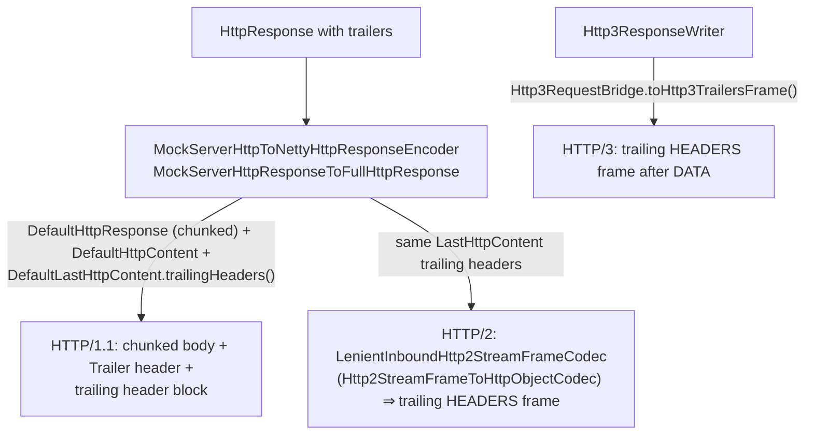

| Protocol | Where | How trailers are emitted |
|----------|-------|--------------------------|
| HTTP/1.1 | `MockServerHttpResponseToFullHttpResponse.mapResponseWithTrailers()` (`mockserver-core`) | Emits a `DefaultHttpResponse` head with **chunked** transfer-encoding and an automatic `Trailer` header listing the field names (RFC 9110 §6.5.1), the body as `DefaultHttpContent`, and a `DefaultLastHttpContent` whose `trailingHeaders()` carry the trailers. A body-less status (204/304/HEAD) yields an empty `LastHttpContent` that still carries the trailers. Trailers **force chunked encoding**: RFC 7230 §3.3.1 makes a fixed `Content-Length` and chunked transfer-encoding mutually exclusive, and Netty's `HttpObjectEncoder` only writes the trailing-header block while in its chunked state — so any explicit `Content-Length` (and `contentLengthHeaderOverride`) is **dropped** from a trailer-carrying HTTP/1.1 response. Streaming-body responses (`NettyResponseWriter.writeStreamingResponse`) are already chunked and emit the same trailing-header block on a `DefaultLastHttpContent` at stream completion. |
| HTTP/2 | `Http2StreamFrameToHttpObjectCodec` (via `LenientInboundHttp2StreamFrameCodec` in the per-stream child pipeline) | Strips transfer-encoding and converts the same `LastHttpContent.trailingHeaders()` into a trailing HEADERS frame with `endStream=true`. No MockServer-specific wiring is needed beyond the HTTP/1.1 mapping. |
| HTTP/3 | `Http3ResponseWriter` + `Http3RequestBridge.toHttp3TrailersFrame()` (`mockserver-netty`) | After the DATA frame(s), a trailing `Http3HeadersFrame` is written before the QUIC stream output is shut down — for both static and streaming responses. Field names are lower-cased per HTTP/2/3 conventions. |
| Servlet (WAR) | `MockServerHttpResponseToHttpServletResponseEncoder.setTrailers()` (`mockserver-core`) | Sets `HttpServletResponse.setTrailerFields(...)`; the container handles framing. The Servlet API models one string value per name, so multi-valued trailers are joined with `", "` (HTTP list semantics) and duplicate names collapse to the last write — a WAR-path-only limitation. |

### Precedence vs gRPC trailers

gRPC responses carry their own status trailers (`grpc-status` / `grpc-message`), built by the
gRPC layer independently of the general-trailer field:

- On the **gRPC HTTP/2 path** (`GrpcToHttpResponseHandler`) the gRPC status is set as a
  response header on a cloned `HttpResponse`; the gRPC writers (`Http3GrpcResponseWriter`,
  `GrpcStreamResponseActionHandler`) build the trailing HEADERS frame directly from
  `grpc-status`/`grpc-message`.
- The gRPC writers do **not** read the general `trailers` field, so on a gRPC response general
  trailers are simply **not emitted** — there is no name collision to resolve, because the
  general-trailer block is never produced on the gRPC path.

ByteBuf safety: the trailer path keeps the body buffer's refcount at exactly one across all
branches — it is handed to a `DefaultHttpContent` only when non-empty and released in a
`finally` otherwise (and on any exception between allocation and transfer), and a body-less
response attaches an empty `Unpooled.EMPTY_BUFFER` `LastHttpContent`. The existing chunk-delay
and HTTP/3 writer paths retain/release as before.

## HTTP/2 Extension Header Stripping

**Invariant: no message MockServer decodes from HTTP/2, request or response, carries Netty's `x-http2-*` extension headers into the MockServer model, and no request MockServer forwards carries them.**

Netty's `InboundHttp2ToHttpAdapter` injects synthetic `x-http2-*` headers — `x-http2-stream-id`, `x-http2-scheme`, `x-http2-path`, `x-http2-stream-dependency-id`, `x-http2-stream-weight`, `x-http2-stream-promise-id` — when it converts an HTTP/2 frame sequence into a `FullHttpResponse`. These are internal Netty plumbing, not real response headers. If they escape into the response model and are later serialised back onto an outbound HTTP/2 connection, the upstream stream id (`x-http2-stream-id`) is written on a foreign stream. The HTTP/2 peer sees a HEADERS frame carrying a stream id that does not match any open stream on the write-back channel and responds with a connection-level PROTOCOL_ERROR / GOAWAY, hanging both legs of the proxy.

### Where the strip happens

| Site | Class / method | What is stripped |
|------|----------------|-----------------|
| Upstream response decode | `FullHttpResponseToMockServerHttpResponse.setHeaders()` (`mockserver-core`) | Every `ExtensionHeaderNames` value (`Http2ExtensionHeaders.isExtensionHeader`) is excluded during header iteration, and again when folding in HTTP trailers (`trailingHeaders()`), so neither the header block nor the trailer block can carry these names into the model. |
| Inbound request decode | `FullHttpRequestToMockServerHttpRequest.setHeadersFromNettyRequest()` (`mockserver-core`) | Every `ExtensionHeaderNames` value, when the request arrived over HTTP/2. The stream id is kept in `HttpRequest.streamId` instead. |
| Write-back to client | `MockServerHttpResponseToFullHttpResponse` (`mockserver-core`) | Belt-and-braces: `response.headers().remove(STREAM_ID.text())` is called unconditionally before the outbound stream id is set from the protocol-guarded `HttpResponse.getStreamId()` field. This prevents a foreign upstream stream id from leaking onto the write path even if an upstream stripping step is bypassed. |

`Http2ExtensionHeaders` holds `HttpConversionUtil.ExtensionHeaderNames.values()` and compares a name case-insensitively only after a cheap `x-http2-` prefix check; an `x-http2-` name Netty does not define (such as `x-http2-foo`) is an ordinary header.

### Inbound request path

On the **inbound request** side, Netty's conversion of an HTTP/2 request (`Http2StreamFrameToHttpObjectCodec`, or the tunnels' `InboundHttp2ToHttpAdapter`) adds `x-http2-scheme` and `x-http2-stream-id`, and drops any `x-http2-*` header the client sent. When the request arrived over HTTP/2, `FullHttpRequestToMockServerHttpRequest` leaves every `ExtensionHeaderNames` header out of the model, so a recorded, logged or matched request lists only the client's headers, and reads the stream id into the trusted `HttpRequest.streamId` field (used to reset a stream and to address a response's stream). Over HTTP/1.1 an `x-http2-*` header is the client's own: it is recorded as sent and never read as a stream id.

On the **forwarded request** side, `MockServerHttpRequestToFullHttpRequest` adds no `x-http2-*` header. The forward client's HTTP/2 stream codec sets `:scheme` from its connection and opens its own stream, and when ALPN settles on HTTP/1.1 for a request whose protocol is HTTP/2 (an upstream without h2, or `forwardProxyHttp2Upgrade`) any such header would have reached the upstream as a header field. `Http2RequestExtensionHeadersIntegrationTest` checks the recorded request, the log, header matching and the upstream's request on direct, CONNECT and SOCKS5 routes, TLS and h2c, mocked and forwarded over HTTP/1.1, HTTP/2 and ALPN-negotiated HTTP/1.1.

### CONNECT/SOCKS tunnel legs

An HTTP/2 tunnel reads each message with an `InboundHttp2ToHttpAdapter`, which sets `x-http2-stream-weight` on every message (and the dependency id when the frame names one), and writes it on the other leg with an `HttpToHttp2ConnectionHandler`. That handler reads the stream's priority from those headers, but `HttpConversionUtil.toHttp2Headers` drops only the stream id, scheme, path and protocol, so the weight was sent as a header field: an aggregated response reached the client with `x-http2-stream-weight: 16`, and each relayed request reached MockServer with it (where MockServer's own codec dropped it). Both legs' handlers (`Http2RequestHeaderLimit.tunnelServerHandler` and `relayLoopbackHandler`) now wrap their encoder in `ExtensionHeaderStrippingHttp2ConnectionEncoder`, which removes every `ExtensionHeaderNames` value from a header block as it is written; the priority is still sent in the frame's priority fields. A response streamed as it is read (`StreamedHttp2ResponsePart`) carries MockServer's own header block and never had them. `Http2TunnelResponseHeadersIntegrationTest` compares a tunnelled response's header block with a direct connection's on the four tunnel routes.

## Connection-Lifecycle Response-Path Faults

These faults fire at response/dispatch time (not connect time) and are distinct from
the connect-time `TcpChaosHandler` faults. They are implemented in `NettyResponseWriter`
and `Http2GoAwayEmitter`, and gated by `HttpRequestHandler`'s L6 cordon check.

### Hot-path guarantee

`NettyResponseWriter.resolveLifecycleProfile(HttpRequest)` resolves the host-scoped
`TcpChaosProfile` keyed on the request `Host` header. It returns `null` immediately when:

1. `ConfigurationProperties.connectionLifecycleChaosEnabled()` is `false`, OR
2. `TcpChaosRegistry.getInstance().activeCount() == 0` (a single volatile read)

When either condition holds the normal write-and-close path is taken byte-for-byte
unchanged. There is no allocation and no additional branching on the hot path in the
common (no-lifecycle-chaos) case.

### L1 — Mid-response RST (`resetMidResponse`)

`NettyResponseWriter.writeHeadThenReset()` writes the response head via `ctx.writeAndFlush(response)`,
then on the write-complete future calls `forceReset()`, which sets `SO_LINGER 0` and calls `close()` —
the same proven RST mechanism as `TcpChaosHandler` (zero linger makes the close emit a TCP RST rather
than a FIN). The client sees "connection reset" while reading the body — the "server crashed mid-reply"
fault.

**HTTP/2 multiplex parent walk.** On the multiplex pipeline (`Http2FrameCodec` + `Http2MultiplexHandler`)
the response head is written on a per-stream `Http2StreamChannel` child channel, where setting
`SO_LINGER` does nothing at all (`DefaultChannelConfig.setOption` returns `false` for an unknown option
rather than throwing, so there is not even an exception to notice) and `close()` only emits
`RST_STREAM` for that one stream. Because
`resetMidResponse` exists to simulate a genuine socket abort, `forceReset()` walks up from an
`Http2StreamChannel` to its **parent connection channel** (the same parent-walk pattern
`Http2GoAwayEmitter` uses) and forces the RST there, aborting the whole TCP connection and every
concurrent stream on it. The guard is on the `Http2StreamChannel` **type**, not on
`channel.parent() != null`: on an HTTP/1.1 accepted socket `parent()` is the server *listening* socket,
so a `parent()`-based guard would close the listening socket and shut the whole server down on the first
fault. HTTP/1.1 and connection-level HTTP/2 channels are reset directly. If `SO_LINGER 0` cannot be
applied to the resolved target the fault logs a `WARN` (the RST would otherwise silently degrade to a
clean FIN) and still closes. Per-expectation `closeSocket`/`closeChannel` (and the L2 `slowCloseDelay`)
flow through `addCloseSocketListener()` instead and stay **per-stream** — a close, not an abort — so one
expectation never tears down concurrent siblings.

When `connectionLifecycleAutoHaltCountsRst` is true (default), the RST records
`Metrics.incrementHttpChaosInjected("drop")` so a RST storm trips the auto-halt circuit-breaker.

**Streaming carve-out (v1):** these L1/L2/L3 faults are applied only in the non-streaming
`writeAndCloseSocket()` path. The streaming response path (`writeStreamingResponse`, SSE / chunked
streaming) ignores lifecycle faults in v1 and completes normally even when a host profile is registered.

**Host-scoping is not control-plane-exempt:** like `TcpChaosHandler`, these faults are keyed on the
request `Host` header and are *not* control-plane-exempt — a profile registered against the MockServer
host itself can RST a control-plane response on that host. Register lifecycle profiles against the
mocked-upstream host. (The L6 preemption cordon below *is* control-plane-exempt.)

### L2 — Host-scoped slow close (`slowCloseDelay`)

`NettyResponseWriter.addCloseSocketListener()` applies the close delay in priority order:

1. `ConnectionOptions.closeSocketDelay` (per-expectation)
2. `TcpChaosProfile.slowCloseDelay` (host-scoped, L2 — only reached when no per-expectation delay is set)
3. Immediate close (default)

This means a single `PUT /mockserver/tcpChaos` registration can make every response to a given
host linger on close without touching individual expectations.

### L3 — HTTP/2 GOAWAY on the response path (`http2GoAway`)

`Http2GoAwayEmitter.emit(ctx, lastStreamId, errorCode)` emits a connection-level GOAWAY frame
so the client stops opening new streams. It is called in `NettyResponseWriter.writeAndCloseSocket()`
before the response head is written, so the client receives the GOAWAY and can avoid opening
further streams while the current stream still completes normally.

**Implementation:** `Http2GoAwayEmitter` resolves the `Http2ConnectionHandler` via
`ctx.pipeline().context(Http2ConnectionHandler.class)` — the same lookup pattern as
`HttpErrorActionHandler.resetHttp2Stream`. A negative `lastStreamId` argument is converted to
`Integer.MAX_VALUE` and clamped down by the connection handler to the actual last-processed stream.

**HTTP/2 pipeline.** GOAWAY is a *connection-level* frame, so the emitter always writes it on the connection channel's pipeline. Because all HTTP/2 server requests run on per-stream `Http2StreamChannel` child channels (via `Http2MultiplexHandler`), the request handlers operate on a child channel whose pipeline has no connection handler — the `Http2FrameCodec` (which `extends Http2ConnectionHandler`) lives on the **parent** connection channel. The emitter walks up to `ctx.channel().parent().pipeline()` and writes the GOAWAY there. (Before issue #2669, the emitter looked only at the local pipeline and found nothing on a multiplex child channel, so the `http2GoAway` chaos and the preemption-drain GOAWAY were silently dropped.)

**HTTP/1.1 degradation:** when no `Http2ConnectionHandler` is found on the pipeline **or on the
parent connection channel** (HTTP/1.1 connection — `parent()` is null on a non-child channel),
`Http2GoAwayEmitter.emit()` returns `false` and callers degrade to `Connection: close` + 503.
GOAWAY is benign (graceful drain signal) and is NOT counted toward the auto-halt window.

### L6 — Preemption cordon check in `HttpRequestHandler`

`HttpRequestHandler.channelRead0()` checks the preemption cordon early in request processing,
before any expectation matching:

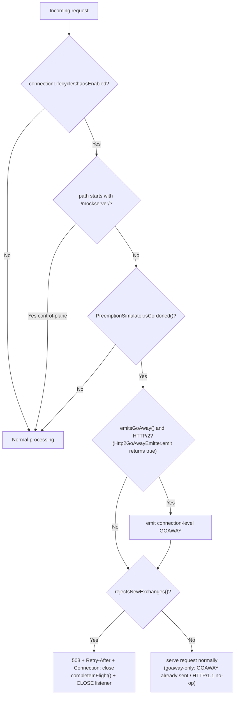

The control plane (`/mockserver/...`) is always exempt so the operator can observe state and issue
`DELETE /mockserver/preemption` to uncordon. The GOAWAY is emitted lazily on a cordoned HTTP/2
connection's next request — `Http2GoAwayEmitter.emit()` is the HTTP/2 detection (it returns `false`,
a no-op, on HTTP/1.1). The in-flight token is completed on every branch so the drain counter cannot
leak, and `GET /mockserver/preemption` reports the live in-flight count from `LifeCycle.getRequestsInFlight()`.
The `isCordoned()` probe is a single volatile read when no simulation is active, so this branch adds
nothing measurable to the hot path in the common case. GOAWAY is HTTP/2-only; HTTP/1.1 has no GOAWAY
and falls back to the 503 path (or is served normally in goaway-only mode).

## Stream-Level Error Injection (HttpError streamError)

An `HttpError` action can reset the individual request stream instead of returning a response, for
resilience testing of clients that must handle mid-stream resets. It is configured with
`HttpError.withStreamError(long errorCode)` (or the `StreamErrorCode` enum / `withStreamErrorCodeName`
convenience), serialised as a `streamError` integer. When `streamError` is null (the default) the
existing `dropConnection` / `responseBytes` behaviour is unchanged.

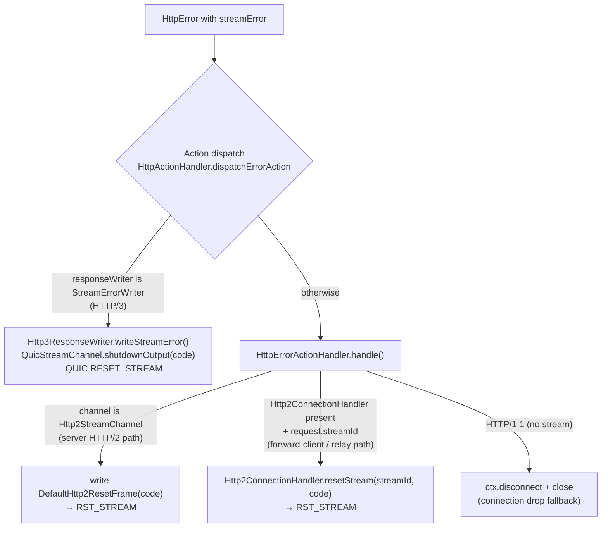

| Transport | Where | How the stream is reset |
|-----------|-------|--------------------------|
| HTTP/2 | `HttpErrorActionHandler.resetHttp2Stream()` (`mockserver-core`) | All HTTP/2 server requests arrive on a per-stream `Http2StreamChannel` child channel. `resetHttp2Stream()` writes a `DefaultHttp2ResetFrame(errorCode)` on that child channel; the parent `Http2FrameCodec` emits the `RST_STREAM`. The stream id is implicit in the child channel identity. |
| HTTP/3 | `Http3ResponseWriter.writeStreamError()` (`mockserver-netty`), reached via the `StreamErrorWriter` seam | Calls `QuicStreamChannel.shutdownOutput(errorCode)`, sending a QUIC `RESET_STREAM` for just this stream. The QUIC types live only in the netty module, so dispatch delegates through the transport-neutral `StreamErrorWriter` seam in core (mirroring the `GrpcStreamResponseWriter` pattern). |
| HTTP/1.1 | `HttpErrorActionHandler.handle()` | **No stream concept** — falls back to dropping the whole connection (`ctx.disconnect()` + `ctx.close()`), the same as the existing `dropConnection` behaviour. Documented caveat: a `streamError` on HTTP/1.1 closes the connection rather than resetting a single stream. |

`HttpActionHandler.dispatchErrorAction()` is the single funnel for the `ERROR` action (both the
early-match and main paths). It first checks whether the active `ResponseWriter` implements
`StreamErrorWriter` (the HTTP/3 case) and delegates; otherwise it hands the `HttpError` plus the
`HttpRequest` (for the stream id) to `HttpErrorActionHandler`. ByteBuf safety: the HTTP/2 reset uses
`resetStream(...)`/a single `DefaultHttp2ResetFrame` (no body buffer), and the HTTP/3 reset allocates
no buffer, so there is nothing to leak. Resetting one stream leaves the rest of the multiplexed
connection intact.

## Relay Connect Pattern

When HTTP CONNECT or SOCKS tunneling is established, MockServer uses a **self-loopback relay** rather than connecting directly to the target. It does so on every connection, also one whose original destination is known (`REMOTE_SOCKET` set by `proxyRemoteHost`, the transparent-proxy resolver chain or a PROXY protocol header): `RelayConnectHandler` connects to MockServer's own port, never to `REMOTE_SOCKET`, because only MockServer answers the `PROXIED_` preamble. The loopback's `REMOTE_SOCKET` is then the CONNECT/SOCKS target, so requests in the tunnel that match no expectation are forwarded there, not to the client connection's original destination. Requests that are not in a tunnel still go to the original destination.

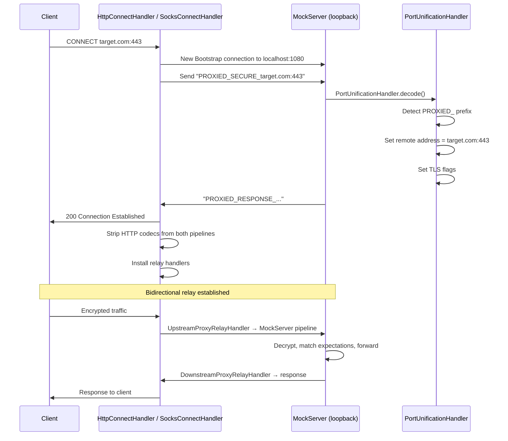

This pattern allows MockServer to:
- Intercept and log tunneled HTTPS traffic
- Match expectations against tunneled requests
- Generate dynamic TLS certificates for the target hostname

### IPv6 Support

The relay connect protocol and CONNECT handler support IPv6 addresses in bracket notation (e.g., `[::1]:443`, `[2001:db8::1]:8443`). Host:port parsing uses `HttpRequest.splitHostPort()` which correctly handles both IPv4 and IPv6 formats.

The local address detection (`calculateLocalAddresses()`) explicitly includes `127.0.0.1` and `localhost`, plus the bound interface address (via `InetAddress.getHostAddress()`), which may include IPv6 addresses depending on the network configuration. This ensures requests sent to MockServer's bound address are correctly identified as control-plane requests rather than proxy targets.

### Relay Handler Hierarchy

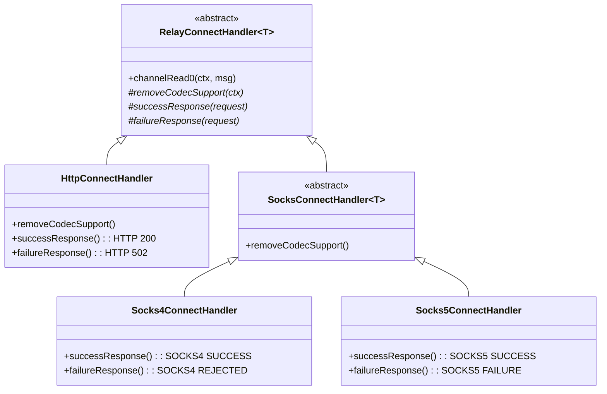

### Relay Data Flow

Once the relay is established, two handler pairs shuttle data:

```mermaid
graph LR
    subgraph "Client-facing pipeline"
        UPR["UpstreamProxyRelayHandler
reads requests from client"]
    end

    subgraph "MockServer-facing pipeline"
        DPR["DownstreamProxyRelayHandler
reads responses from MockServer"]
    end

    UPR -->|writes requests to| MS["MockServer
Internal Channel"]
    MS -->|responses flow to| DPR
    DPR -->|writes responses to| CLIENT[Client Channel]
```

### Raw-bytes responses through a tunnel

**Outcome:** a client behind an HTTP/1.1 CONNECT or SOCKS tunnel is sent an `error()` action's `responseBytes`
exactly as a client on a direct connection is: the same bytes, whether they are a whole HTTP response, part of one
or not HTTP at all, then the close if the action drops the connection, or the idle close if it does not. The relay's
loopback codec is never given those bytes. An HTTP/2 client is sent no bytes on either route (see
[HTTP/2](#raw-bytes-and-http2)).

```mermaid
sequenceDiagram
    participant C as Client
    participant P as Client leg
    participant L as Loopback (relay end)
    participant A as Loopback (MockServer end)
    A->>A: RawResponseBytesEvent(length)
    A-->>L: announce(offset, length), in memory
    A->>L: the raw bytes, on the socket
    L->>L: LoopbackRawResponseSplitter takes them out, before the codec
    L->>P: RawResponseBytes, through DownstreamProxyRelayHandler
    P->>C: the bytes, written beneath HttpServerCodec
    P->>P: RAW_RESPONSE_WRITTEN ends the exchange
```

| `responseBytes` | Direct connection | Through an HTTP/1.1 tunnel |
|---|---|---|
| A whole response | the bytes | the bytes (before, the relay decoded and re-encoded it) |
| Part of a response, or not HTTP | the bytes | the bytes (before, nothing, or a `502`) |
| Empty (the REST API cannot carry an empty array, so only an expectation created in the server's JVM has one) | nothing | nothing |
| Then, with `dropConnection` | the connection is closed after the bytes | both legs are closed after the bytes |
| Then, with the connection kept | closed as idle | closed as idle (before, part of a response, or no bytes, left the tunnel open for good) |

**Why offsets.** Both kinds of response reach the relay's end of the loopback as bytes, and it cannot tell them apart
by reading them: raw bytes may be a valid response, half of one, or two. So MockServer's end says where they are.
`HttpErrorActionHandler` fires a `RawResponseBytesEvent` from `HttpServerCodec`'s context immediately before it
writes the bytes from that context, in the same event loop task. On a relay's loopback
`LoopbackRelaySignalHandler` hears it and calls `LoopbackRawResponseSplitter.announce` with the count
`LoopbackWrittenBytes` holds, the bytes written so far from the codec's position, and the length. The splitter, on
the relay's end before `LoopbackHttpClientCodec`, counts what it reads at the same position, hands the announced range
on as `RawResponseBytes` and everything else to the codec. An exchange MockServer ends with no response, or with a
final `1xx`, is announced the same way as a response of no bytes.

Rejected: relaying whatever the loopback codec is holding when `RAW_RESPONSE_WRITTEN` arrives. That event and the
bytes travel by different routes and arrive in either order, a whole raw response would still be re-encoded, and
bytes that are not HTTP would already have failed the codec.

**What makes the offsets agree.**

- The announcement is made before the bytes are written, and is a plain queue the splitter reads on every read, so
  it is always there before the bytes can be: no task has to run first on the relay's event loop.
- `LoopbackWrittenBytes` sits immediately beneath the codec and its `HttpServerCodecResponsePairing` handler before
  it (`HttpServerCodecResponsePairing.beneathCodec`), so it sees encoded and raw bytes in the order they are written,
  and only the empty buffers written in place of the pairing's stand-in responses. The handlers nearer the socket (`PacedLargeWriteHandler`,
  TLS) write what they are given, in order, and nothing of their own. A handler added there that wrote bytes of its
  own would move every later offset.
- Both ends count plaintext: each sits above its leg's TLS handler, and starts counting when the HTTP codecs are
  installed, after the `PROXIED_` preamble.

**Relaying.** `RawResponseBytes` is not an `HttpObject`, so the loopback's decompressor, aggregator and
`LoopbackHttp1ResponseErrorHandler` pass it by. `DownstreamProxyRelayHandler` writes its content from the context of
the client leg's `HttpServerCodec`, as MockServer wrote it from its own, and fires
`HttpExchangeEndedEvent.RAW_RESPONSE_WRITTEN` from that context as the part that ends the response is written. That
is the client leg's only count of the exchange, so a pipelined exchange behind it is not ended early. A response of
no bytes has no bytes to mark its place: the splitter is prompted by a task on its event loop, and ends the exchange
once everything written before it has been read (`LoopbackRawResponseRelayTest`; over real sockets on every route,
`RelayRawBytesErrorIntegrationTest`).

**Bound.** The splitter holds nothing between reads. Raw bytes not yet written to the client count with streamed
content toward the pause of the loopback's reads (above min(256 KiB, `maxRequestBodySize` / 2), until half as many),
so a slow client holds about that much plus one read. They are never cut short at `maxRequestBodySize`, as a
streamed response is: a direct client is sent all of them. `DownstreamProxyRelayHandler` counts them apart from
streamed content, and only the streamed count is held to `maxRequestBodySize`, so a raw backlog does not abort a
streamed response pipelined behind it (`DownstreamProxyRelayHandlerStreamBoundTest`, `LoopbackRawResponseRelayTest`).
A relay that has ended releases them unwritten.

**The codecs' request-method queues.** Netty 4.2.18 bounds `HttpServerCodec`'s queue of requests awaiting a response
at 128 (`maxPipelineDepth`) and closes the connection on the next request. Through a tunnel the client leg's codec
decodes every request a client pipelines in one go from one read, so both server codecs are built by
`HttpServerCodecs.httpServerCodec` with the queue unbounded, as on MockServer 8.0.0 (Netty 4.2.17); an entry costs a
few bits. How each codec is kept pairing responses with the right requests is in
[Pairing responses with requests](#pairing-responses-with-requests) (`RelayRawBytesErrorIntegrationTest`).

#### Pairing responses with requests

**Outcome:** every response is encoded, and through a tunnel decoded and encoded again, for the method of the request
it answers, even after an exchange whose response no codec saw: raw bytes, no response, or a final `1xx`. Before,
after a `HEAD` answered that way, the response to the next `GET` was sent without its body, and after a `GET` the
response to the next `HEAD` was sent a body; through a tunnel the relay's codec could then wait for a body that never
came.

| Codec | Records a method | Takes the oldest off | Told of an exchange it did not see by |
|---|---|---|---|
| MockServer's `HttpServerCodec` | decoding a request | encoding a final response | `HttpServerCodecResponsePairing`, on `ResponseWrittenBeneathCodecEvent` or `HttpExchangeEndedEvent.INSTANCE` |
| The relay's `LoopbackHttpClientCodec` | encoding a request | decoding a final response | `LoopbackRawResponseSplitter`, at the end of each announced range |
| The client leg's `HttpServerCodec` | decoding a request | encoding a final response | `HttpServerCodecResponsePairing`, on the `ResponseWrittenBeneathCodecEvent` `DownstreamProxyRelayHandler` fires |

`HttpServerCodec` is final and its queue private (`HEAD` and `CONNECT` are what it encodes differently; with Netty's
RFC 9112 checks turned off it also closes the connection after the response to a request with both
`Transfer-Encoding` and `Content-Length`). So `HttpServerCodecResponsePairing` puts a handler either side of it. `HttpErrorActionHandler` fires
`ResponseWrittenBeneathCodecEvent` from the codec's context immediately after it issues the raw write; on that event,
or on `HttpExchangeEndedEvent.INSTANCE`, the handler after the codec has it encode an empty `204` of its own, which
takes the entry off, and the handler before the codec writes an empty buffer in place of the encoded bytes, with the
same promise. Nothing reaches the client, and a close the codec chains on that write follows the raw bytes, as it
would follow an encoded response. The event is fired as the write is issued, not as it completes, so a response
encoded while a slow client is still taking the raw bytes is paired with its own request.

The relay's codec is MockServer's own because Netty's `HttpClientCodec` keeps its queue private too, and the relay's
end of the loopback has no other users of it. MockServer's end announces every exchange its codec did not encode a
response for, so the relay's end learns of each at its place among the bytes, after every response written before it
has been decoded: an announcement out of band could arrive before a pipelined response still in transit and take that
response's entry. Rejected: having each codec decode or encode a stand-in for the relay too (bytes injected into the
decoder, and a handler after it dropping what it decodes), which would depend on the decoder being between messages.

#### Raw bytes and HTTP/2

Raw bytes cannot be written to an HTTP/2 stream, and `HttpErrorActionHandler` writes none where there is no
`HttpServerCodec`. On a direct HTTP/2 connection the request's stream is left open with no response; with
`dropConnection` it is reset with `CANCEL`, because the drop closes the stream's own channel, and the connection and
its other streams carry on. An HTTP/2 tunnel's loopback is HTTP/2 as well, so MockServer does the same there and the
relay passes it on: the client's stream is left open, or reset with the same code
(`RelayRawBytesErrorHttp2IntegrationTest`: direct, and through CONNECT, SOCKS4 and SOCKS5, each over TLS and in
cleartext).

### Relay write failure

When a write to the proxy client fails because the connection has failed, `DownstreamProxyRelayHandler` ends the relay at the
first failure: it logs that failure once (`exception while returning writing`, or nothing once the proxy client's connection has closed or its client has closed its TLS session, `SslClosedEngineException`), and releases whatever the
loopback still delivers, response by response and, for a response relayed as it is streamed, part by part. While the
client's leg is open it also stops reading the loopback with a `ChannelReadPause` hold it never releases, and closes
both legs.
Every write already queued behind the failed one fails the same way and is not logged. Exceeding the streamed-bytes
bound (`maxRequestBodySize` of unwritten streamed content, raw bytes not counted) ends the relay the same way.

The loopback's socket is closed directly and the client's leg through its pipeline (see [Relay close](#relay-close)).
The loopback of a client that has gone, or whose output the failed write has ended, is not closed there: the relay
still ends, and everything the loopback delivers from then on is released unwritten, but the loopback is read until
`UpstreamProxyRelayHandler` ends it as the client's leg closes (see [Relay close](#relay-close)).

A failure of one HTTP/2 stream does not end the relay. When the response carries the client's stream id
(`x-http2-stream-id`, read before the write, or the stream id of a part of a streamed response), the failure is an
HTTP/2 stream error, and the proxy client's connection is still active, only that stream is gone: its client reset it, or `Http2StreamWriteStallHandler` reset it with its
response still queued in the flow controller (`Stream closed before write could take place`). The relay logs it at
`DEBUG` and carries on reading the loopback for the other streams. Ending the relay there would answer a single
stream cut, or a client cancelling one download, with a `GOAWAY` and the loss of the whole tunnel.

Closing only the proxy client's channel, as before, was not enough (plan item #92). A channel that stays open while
refusing writes, such as a TLS engine whose `close_notify` waits behind bytes its client has not taken, never fires
the `channelInactive` that closes the loopback, so the relay kept reading and wrote every chunk into it: one cut
tunnel logged 2,500–6,300 `ERROR` entries and kept its event loop busy for up to ~41 s.

### Relay close

**Outcome:** when a tunnel ends, its loopback connection closes at once, or as soon as MockServer has read a request
the client had already sent. Asked to close through its pipeline, an
`HttpToHttp2ConnectionHandler` sends a `GOAWAY` and keeps the connection open while it has active streams, for up to
Netty's graceful-shutdown timeout (30 s). On the loopback those streams have nowhere to go once the client's leg has
finished, so `RelayLegClose` closes the loopback's socket with `channel.unsafe().close(...)`, as
`WriteStallTimeoutHandler` does. The client's leg keeps its pipeline close and its `GOAWAY`.

`RelayLegClose` has two forms. `now` closes the socket. `afterFlush`, used when the client has gone and a request
may still be on its way to MockServer, flushes the outbound buffer, shuts down the socket's output (a FIN), and closes
the socket when MockServer's side closes, which it does on reading the end of the stream, or 5 s
(`LingeringClose.LINGER_MILLIS`) after `afterFlush` is called if it does not, flushed or not. See [A request the client sent before it left](#a-request-the-client-sent-before-it-left).

| The relay ends because | Loopback leg | Client leg |
|---|---|---|
| A write to the client failed, or too much streamed content was waiting (`DownstreamProxyRelayHandler.endRelay`), with the client's leg still open | socket closed at once | `close()` through the pipeline |
| A write to the client failed with the client's connection already closed, or its output ended by the failure | left open and read, what it delivers dropped; ended as in the two rows below when the client's leg closes | already closed, or read to the end of its input |
| The client's connection closed with no request still being written to the loopback (`UpstreamProxyRelayHandler.channelInactive`, or a listener on its close for a tunnel that has no relay handlers yet) | `afterFlush`: flushed, output shut down, socket closed when MockServer's side closes | already closed |
| The client's connection closed with a request still being written to the loopback (`UpstreamProxyRelayHandler.channelInactive`) | HTTP/2: `closeOnFlush` through the pipeline; HTTP/1.1: left as it is. `afterFlush` when the last such write completes or fails | already closed |
| The loopback closed (`DownstreamProxyRelayHandler.channelInactive`) | already closed | open streams ended as in [Relay loopback connection loss](#relay-loopback-connection-loss-http2), then `closeOnFlush` |
| The loopback closed before the tunnel's protocol was known (`RelayConnectHandler`) | already closed | `closeOnFlush` |

Why the client's leg is not closed at its socket too: it does not wait. A write to it that fails for the whole
connection is a connection error to its `Http2ConnectionHandler`, which closes the connection with its other streams
still open (`RelayHttp2LegCloseTest`). Where the client is still taking writes, the loopback's close resets every stream that has no whole
response (`LoopbackHttp2ConnectionCloseHandler`), and the graceful close then waits only for whole responses still
being written out, which is what a healthy client is owed. An HTTP/1.1 leg has no streams to wait for. (A TLS
handler can still hold either kind of client leg open until its `close_notify` is flushed or its flush timeout
passes, as described under [Response Write-Stall Timeout](#response-write-stall-timeout).)

A client that leaves is therefore seen by MockServer as it would be on a direct connection: a request it had sent
in full is still received, but its response is not waited for. Before, an HTTP/2 loopback stayed connected until
MockServer had answered every stream, or for 30 s.

A request is received whole even when the client leaves the moment it has sent it. `UpstreamProxyRelayHandler` counts
its writes of requests to the loopback that have not completed. An HTTP/2 request body above the stream's flow-control
window (65,535 bytes by default) waits in the loopback's flow controller, not in the socket's outbound buffer, so a
socket close would fail it however the buffer was flushed first. While the count is above zero an HTTP/2 loopback is
therefore closed through its pipeline, which goes on writing as MockServer extends the window, and the listener of
the last write to complete, or fail, ends it with `afterFlush`. That wait has the graceful shutdown's 30 s bound. An
HTTP/1.1 loopback is not closed through its pipeline, which closes its socket the moment the request is flushed (see
below why that loses it): it is left to that listener, and has no bound — it waits for its socket to take the
request, accepted as unbounded, see
[decisions/http11-tunnel-loopback-wait-unbounded.md](decisions/http11-tunnel-loopback-wait-unbounded.md)). The count
covers requests only: a response the loopback is still reading has no one to go to. The listener on the client
channel's close future acts only while the tunnel has no `UpstreamProxyRelayHandler`: it runs before
`channelInactive` and would close the socket whatever the count (`RelayHttp2LegCloseTest`,
`RelayHttp2TunnelCloseIntegrationTest`).

`endRelay` never closes the loopback of a client that has gone. On a tunnel carrying several requests, a response on
another stream is often still being written to the client when it leaves (queued behind the client's flow-control
window, or in the socket's buffer), or arrives just afterwards. That write fails and ends the relay. A request the
client sent may not yet have been read by MockServer even when its write has completed: its last bytes can still be in
the loopback socket's send buffer, or, over HTTP/2, waiting in the flow controller for MockServer's `WINDOW_UPDATE`s.
A socket closed with bytes it has received still unread sends a reset, not a FIN, and the kernel then discards what is
still in its send buffer; MockServer is still sending such bytes whenever a response to an earlier request is on its
way. So `endRelay` marks the relay ended and does nothing else: the loopback stays open and is still
read, and each response it delivers is released without a write. `UpstreamProxyRelayHandler` then ends the loopback
exactly as if no write had failed: with `afterFlush` (a FIN once flushed, the socket closed when MockServer's side
closes, which it does on reading the end of its input) once no request is being written, and, over HTTP/2, gracefully
from `channelInactive` meanwhile (the 30 s bound), which also covers a loopback that closes first.

| When the write to the client fails | Loopback |
|---|---|
| The client's leg is open (refusing writes, its close perhaps held behind a TLS `close_notify`) | socket closed at once, whatever is being written: that leg's `channelInactive` may never come |
| The client's connection has closed, or its output has ended | left to `UpstreamProxyRelayHandler` |

Before (plan item 370), an HTTP/1.1 loopback with a request still being written was closed through its pipeline,
which closes its socket the moment that request is flushed, and `endRelay` closed the loopback's socket at once when no
request was still being written. Either close could come while MockServer was still sending a response pipelined ahead
of the request, which the relay had not yet read: a client that sent `GET` for a large response and a `POST` behind
it, then half-closed, sometimes had the `POST` lost, with the relay's end of the loopback failing mid-response
(`PrematureChannelClosureException`) and MockServer's end reset.

A client leg whose own `Http2ConnectionHandler` closed it on the failed write has closed by the time `endRelay` runs,
so it counts as closed. Both orders of the client's close are handled. A socket's close fails the writes in its
outbound buffer, and lets the event loop read the loopback, before the task that fires `channelInactive` runs, so
`endRelay` can run before `UpstreamProxyRelayHandler` has seen the client leave: it therefore tests the channel, and
`channelInactive` follows. Writes waiting in the HTTP/2 flow controller fail inside `channelInactive`, after that
handler has run. The rule does not depend on the protocol: on an HTTP/1.1 tunnel the request is one pipelined behind a
response (`RelayHttp2LegCloseTest`, `DownstreamProxyRelayHandlerWriteFailureTest`, `RelayHttp2TunnelCloseIntegrationTest`,
and `RelayHttp1PipelinedRequestIntegrationTest`, which holds MockServer's end of the loopback while an HTTP/1.1 client
sends a 16 MB request behind a response it never reads and half-closes).

Until the client's first bytes show which protocol the tunnel carries, neither leg has a relay handler, so each is
tied to the other's close by `RelayConnectHandler` itself. Before, a client that connected and left without sending
anything left the loopback connection open for good, and a loopback lost in that interval left the client waiting.

Nor, in that interval, does either leg have a relay handler to take its exceptions, so each has
`UnconfiguredTunnelLegExceptionHandler` last until `configurePipelines` removes it and adds the relay's handlers.
A TLS tunnel's client-leg `SslHandler` goes after it: Netty fails the handshake, whose listener installs the relay's
handlers, before it fires the exception on, so `UpstreamProxyRelayHandler` takes that one, as before. Before, nothing on a SOCKS tunnel's client leg,
or on either kind of tunnel's loopback leg, overrode `exceptionCaught`, so a peer that reset the connection then
reached the end of the pipeline, which Netty logs at `WARN` with a stack trace through its own logger. A CONNECT
tunnel's client leg still has `HttpRequestHandler`, which took its exceptions before and still does. Each is logged
once, and the leg closed, which closes the other:

| Exception | Logged |
|---|---|
| Netty's direct memory limit | `ERROR`, the message the other handlers use for it |
| An SSL or decoder fault (`isSslOrDecoderFault`) | `WARN`, the exception's class and its `boundedFaultMessage`, no stack trace |
| A peer that has gone (`clientGoneException`: a reset, a closed channel or TLS session) | `DEBUG`, the peer's address and `causeDescription`, no stack trace |
| Anything else | `ERROR` with `boundedFault(cause)` |

`RelayConnectUnconfiguredTunnelCloseTest` resets each leg over a socket and checks for the `DEBUG` entry and that
nothing reaches Netty's logger, and that a tunnel that has carried a request leaves its exceptions to the relay. The
`reached at the tail of the pipeline` warning `InboundConnectionIdleTimeoutIntegrationTest` used to leave came from a
SOCKS tunnel's client leg.

#### A request the client sent before it left

**Outcome:** a whole request that a client sends as a tunnel's first bytes, closing its connection as soon as it has
written them, is received by MockServer, as it is on a direct connection. Two things lost it for cleartext HTTP/2
(`h2c`), each because a side of the relay writes while it is still reading, to a peer that has gone:

| Where | What happened | Now |
|---|---|---|
| Client leg | `RelayTlsDetectionHandler` left the first bytes for `ByteToMessageDecoder.handlerRemoved`, which fires `channelReadComplete` after them, in the middle of the socket's read. The tunnel's HTTP/2 handler flushed its `SETTINGS` acknowledgement on that, to a client whose reset (drawn by the `SETTINGS` written when the handler was added) had arrived. A failed write closes a Netty channel, so the rest of the request was never read from the socket | the handler hands the bytes on itself, through its decode output, and nothing is flushed until the socket has been read, as on a direct connection |
| Loopback | `afterFlush` closed the loopback's socket as soon as the request was flushed. MockServer's side writes while it reads (its own `SETTINGS`, then the acknowledgement of the relay's), the closed socket answered with a reset, and the next flush closed MockServer's side with the request unread | the loopback is sent a FIN and stays open until MockServer's side has read to it and closed |

HTTP/1.1 was not affected: neither side writes before the response. On a TLS tunnel the client leg's handlers are
installed when its handshake completes, not while a request is being read. A client that resets its connection
(closes with data unread, or with `SO_LINGER` 0) also has its request received, directly and through either kind of
tunnel, because the server's `SETTINGS` is flushed only once the read is over (see
[When the server's `SETTINGS` is sent](#when-the-servers-settings-is-sent)). What remains is a request the event
loop reads in more than one pass, which may meet a failed flush between passes (`RelayConnectFirstBytesTest`,
`RelayTunnelFirstBytesIntegrationTest`).

### HTTP/2 loopback stream ids

On an HTTP/2 relay the loopback gives each request a stream id of its own and maps it back to the client's. The
client-facing `InboundHttp2ToHttpAdapter` hands a request on only when its upload is complete, so requests reach
the loopback in the order they finish, not the order their streams opened. HTTP/2 stream ids must increase, so
reusing the client's ids (`x-http2-stream-id`) made a request that finished after a later stream open a loopback
stream below the last one: a connection error that closed the whole tunnel (plan item #68).

`LoopbackHttp2StreamIdRemapper` sits after the loopback's `HttpToHttp2ConnectionHandler`, next to
`LoopbackHttp2StreamErrorHandler` (see [Relay failure signalling](#relay-failure-signalling)). The two may be
in either order: the remapper is the only one that reads a message.

| Direction | What it does |
|---|---|
| Request written to the loopback | Gives it the next loopback stream id (the last one created plus 2, or 1), records the pair, and rewrites `x-http2-stream-id`. A second message on the same client stream reuses the pair only while the loopback stream's local side is still open, which the relay's own requests never leave it: each is written whole. Otherwise it is dropped and released, with a WARN. The relay's client-facing adapter hands each request on once (see [HTTP/2 `Expect` on the relay](#http2-expect-on-the-relay)), so this is a guard: a second HEADERS frame on a half-closed loopback stream would close the whole loopback, and one after that loopback stream has closed would have MockServer answer the request twice. To tell the second case from a new stream, the client's stream carries the mark that it was paired, so the mark goes when that stream does. A priority dependency (`x-http2-stream-dependency-id`) is translated, or dropped if it names no open stream or the stream itself |
| Response read from the loopback | Rewrites `x-http2-stream-id` back to the client's id, and marks the client's stream answered when the response is a whole final (not `1xx`) one. A part of a streamed response (`StreamedHttp2ResponsePart`) carries its stream id itself and is mapped the same way; the stream is answered when the part that ends it is handed on. A response with no pair, which only a server push could produce (MockServer does not push), is dropped and released. So is a response, `1xx` included, whose client stream has ended: writing it would fail, and a failed write closes the client's connection |
| Loopback stream removed | Forgets the pair, so a long-lived tunnel holds one entry per open stream. A request whose stream was never opened (the write failed first) is forgotten at once, and its client stream marked as not relayed |

Nothing else crosses the legs with a stream id. Each leg's `Http2ConnectionHandler` does its own flow control
(`WINDOW_UPDATE`); for a streamed response the loopback's is driven by the client leg's writes (see
[HTTP/2 loopback: streamed responses](#http2-loopback-streamed-responses)). PRIORITY frames and SETTINGS are not relayed. A GOAWAY is not translated either: when the
loopback receives one, or closes, the client is sent a GOAWAY of its own, built from the client connection's ids
(see [Relay loopback connection loss](#relay-loopback-connection-loss-http2)). Server push is not relayed
either. The loopback never opens a stream of its own:
the remapper's ids are the only ones it uses.

### HTTP/2 loopback: streamed responses

**Outcome:** a client that speaks HTTP/2 through a CONNECT or SOCKS tunnel is sent a streamed response (server-sent
events, a streamed forward, a gRPC stream) as MockServer writes it: the headers when they are written, each DATA frame
as it arrives, the trailers and the end of the stream at the end. Before, the loopback's `InboundHttp2ToHttpAdapter`
held every response until it was whole, so events and LLM tokens reached such a client only when the stream ended. A
response of declared length is still held whole, as before.

```mermaid
flowchart LR
    MS["MockServer\n(loopback server side)"] -->|"HEADERS, DATA, trailers"| ST["LoopbackHttp2ResponseStreamer"]
    ST -->|"declared length,\nor a coding it decodes"| AG["LoopbackAggregatingListener\ndecompressor, InboundHttp2ToHttpAdapter\n(whole response)"]
    ST -->|"undeclared length, a 1xx,\nor ended by its headers"| PT["StreamedHttp2ResponsePart\nper frame"]
    AG --> RM["LoopbackHttp2StreamIdRemapper"]
    PT --> RM
    RM --> DR["DownstreamProxyRelayHandler"]
    DR -->|"whole response"| H2["client leg\nHttpToHttp2ConnectionHandler"]
    DR -->|"part"| WR["StreamedHttp2ResponseWriter"]
    WR -->|"encoder, on the part's stream"| H2
    H2 -.->|"written: return the bytes\nto the loopback stream's window"| ST
```

| A response on the loopback | Relayed |
|---|---|
| Final headers that do not end the stream and carry neither `content-length` nor `content-encoding` | frame by frame, as read |
| Final headers that end the stream (`204`, `304`, a response to `HEAD`, any response with no body) | as the header block MockServer wrote, as a direct connection is sent it. Before, `InboundHttp2ToHttpAdapter` set `content-length` to the length of the body it had aggregated, so a response to `HEAD` declaring `content-length: 6` reached the client with `content-length: 0` (in `mockserver-8.0.0` too) |
| Final headers with `content-length` that do not end the stream | whole, by `InboundHttp2ToHttpAdapter`, as before; trailers that end it go with it |
| Final headers with a `content-encoding` the loopback decodes that do not end the stream | decoded and whole, as before |
| Final headers with a `content-encoding` it does not decode (an unknown coding, a list of codings, `br` without the brotli library) and no `content-length` | frame by frame, as read, still encoded and with their `content-encoding`. Before, they were held whole |
| A `1xx` | as read, as the interim response it is: its headers do not end the client's stream. MockServer resets the loopback stream of a `1xx` it mocks, and the reset is relayed with its code (see [A mocked final `1xx`](#a-mocked-final-1xx)) |

**Why the length decides.** MockServer writes a response it produces as it goes without `content-length`, and one
it has whole with it, unless the expectation says otherwise (a chunk size, trailers, `suppressContentLengthHeader`);
those few are relayed frame by frame too, which costs nothing since their frames arrive together. So the rule needs
no content type and no knowledge of the request, covers every streamed response MockServer can write (the HTTP/1.1
loopback's rule, `text/event-stream` or a request that asked for a stream, would miss a gRPC stream), and leaves
every response of declared length exactly as it was, limit and all.

**Why a content coding is held whole.** The relay decodes a response that has a `content-encoding`, as it always
has. Flow control counts the bytes MockServer sent, and a few kilobytes of a compressed body can decode to megabytes
inside one read, so only the aggregator's `maxRequestBodySize` bounds what a decoded response comes to. A decoded
stream would have needed a bound of its own and a second failure mode (a response refused part way, after its
headers had gone). It is not needed for a stream MockServer forwards: its forward client decodes the upstream's
response (`BoundedZstdHttpContentDecompressor` in both forward pipelines), which removes the `content-encoding` of a
body it decodes, so what reaches the loopback has no content coding it could decode. A coding neither decodes keeps its
`content-encoding` (`StreamingResponseRelayHandler` drops only `content-length`) and is passed on undecoded, so it needs
no bound and is streamed: `BoundedZstdHttpContentDecompressor.decodes` names the codings both decoders decode, and
`BoundedZstdHttpContentDecompressorDecodesTest` checks it against what the decoder does. `LoopbackHttp2ResponseStreamer`
goes before the decompressing listener, and a streamed response never reaches it.

**A compressed response cut short logs nothing.** When the loopback stream of a response with a content coding is
reset before its body ends (MockServer reset it, or the body failed to decode), Netty's `DelegatingDecompressorFrameListener`
empties the stream's decompressor from `onStreamRemoved`. For a body that failed to decode that throws again, and it
then hands one last empty DATA frame, for a stream the connection no longer has, to `InboundHttp2ToHttpAdapter`,
which threw a `NullPointerException` for it. `DefaultHttp2Connection` logged either at `ERROR` through Netty's own
logger (in `mockserver-8.0.0` too); the client was unaffected, its stream already reset. `LoopbackAggregatingListener`
builds the decompressing listener and the adapter with a filter between them that drops DATA for a stream the
connection does not have (Netty's decoder hands on no other), and adds a handler after the decoder in each
decompressor's channel that drops what the decoder throws once that channel is closing, which happens when its
stream has been removed, or ended: a fault decoding a DATA frame still resets the stream. `LoopbackHttp2StreamedResponseRelayTest`
uses it, and resets one compressed response and corrupts another with Netty's log captured.

**Why parts, and a writer of their own.** The client leg's `HttpToHttp2ConnectionHandler` writes HTTP content to the
stream of the last headers it wrote, so the pieces of two responses could not interleave through it. A part carries
its stream id and is written by `StreamedHttp2ResponseWriter` straight through the client connection's encoder. The
parts still travel the loopback's pipeline, so the rules that govern whole responses govern them unchanged: the
remapper's stream ids and its dropping of a part whose client stream has ended, the relay's end (every later part is
released unwritten), and a failed write that is one stream's alone. Relaying frames from the frame listener to the
client's encoder directly would have needed each of those rules a second time. The writer refuses a part its stream
can no longer take (the stream gone, reset, already ended, or a second header block of the same kind) with a stream
error: handed to the encoder, each of those is an error of the whole connection, answered with a `GOAWAY`.

**Flow control and what the relay holds.** A DATA frame's bytes are returned to the loopback stream's window only
when the client leg has written them (the write's promise completes when they reach the socket, after the client's
own window has let them go). A client that takes a stream slowly therefore stops MockServer writing that stream
after one window, which in turn stops MockServer reading the upstream of a forwarded stream. The bytes held for a
stream are held against the loopback's connection window too, and at Netty's default that is the size of one
stream's window, so `RelayConnectHandler` raises it to the largest HTTP/2 allows as soon as the loopback's handler
is added: one stream the client is not taking then stops no other. Each stream still holds at most its own window,
and a tunnel has at most 100 streams (`PortUnificationHandler.HTTP2_MAX_CONCURRENT_STREAMS`).

| Held by the relay | Bound |
|---|---|
| A streamed response, per stream | one loopback flow-control window (65,535 bytes of DATA payload), enforced by the loopback's own flow control: MockServer may send no more until some of it is written. A part is a retained slice of the buffer it was read into, so a small frame keeps its whole read buffer until it is written: the memory held can be more than the payload counted |
| Any other response, per stream | `maxRequestBodySize`, as before: the held response was never unbounded, `InboundHttp2ToHttpAdapter` resets its stream past that |

**Ends.** The stream is answered when the part that ends it has been handed on, so the existing handlers end a
streamed response as they end any other: a client's `RST_STREAM` resets the loopback stream and MockServer stops
producing (a forwarded stream's upstream is closed, as on a direct connection); MockServer's reset is relayed with
its code after the parts already sent; a loopback that closes resets the stream `INTERNAL_ERROR`; a client stream
`Http2StreamWriteStallHandler` resets is cancelled on the loopback. Request trailers over `maxHeaderSize` sent while
a response is being streamed now reset the stream `PROTOCOL_ERROR`, as on a direct connection: the `431` a tunnel
answered there existed only because no response had yet reached the client (`Http2TrailerListLimitIntegrationTest`).

**What remains.** A streamed response that declares `content-length`, or that has a `content-encoding` the loopback
decodes, is still held whole. MockServer writes neither today unless a mocked stream's expectation sets the header
itself: a forwarded stream reaches the loopback with no `content-length`, and with a `content-encoding` only in a coding
neither decoder decodes. Nothing here ran on Linux.

### HTTP/2 `Expect` on the relay

The relay hands each HTTP/2 request on to the loopback once, with its whole body, and meets an `Expect` header
itself, as `HttpObjectAggregator` does on MockServer's own HTTP/2 streams and on an HTTP/1.1 tunnel. Netty's
`InboundHttp2ToHttpAdapter` hands a request carrying `Expect` on as soon as its headers arrive, with no body, then
again with the body, so MockServer answered the headers alone and the body was lost (plan item #71). The relay's
client-facing pipeline uses `ExpectContinueInboundHttp2ToHttpAdapter` instead. For a request whose headers do not
end the stream, it removes `Expect` and answers:

| `Expect` | `content-length` | The relay sends the client | The request |
|---|---|---|---|
| `100-continue` (any case) | absent, or at most `maxRequestBodySize` | `100` | handed on once its body is complete |
| `100-continue` | over `maxRequestBodySize` | `413`, then `RST_STREAM` `NO_ERROR` | not handed on |
| anything else | any | `417`, then `RST_STREAM` `NO_ERROR` | not handed on |

The reset after a `413` or `417` asks the client to stop uploading (RFC 9113 section 8.1), and keeps the tunnel up:
DATA already on its way for a stream left open would reach the adapter with no request to add it to, a connection
error. A request whose headers
end the stream is complete already and is handed on as it is, `Expect` included.

### Relay loopback connection loss (HTTP/2)

When the HTTP/2 loopback connection closes, for any reason, every stream the proxy client still has open is
answered at once, except a stream whose whole response has already been relayed, which is left to finish.
Before, `DownstreamProxyRelayHandler.channelInactive` closed the client connection with `closeOnFlush`, and the
client-facing `Http2ConnectionHandler` closed gracefully: it sent a `GOAWAY` and then waited up to Netty's 30 s
graceful-shutdown timeout for streams that could no longer be answered.

| Event on the loopback | What the proxy client gets |
|---|---|
| The connection closes (MockServer stopping, a TCP reset, a connection error) | a `GOAWAY`, then each open stream ended as below, then the connection closed once no stream is left |
| — a stream on which no request has been relayed | `REFUSED_STREAM`: MockServer never saw it, so a retry is safe |
| — a stream whose request was relayed but whose final response was not, or not all of it (a streamed response cut part way) | `INTERNAL_ERROR`: MockServer may have acted on it |
| — a stream whose whole final response was relayed but is still queued behind the client's flow-control window | nothing: the response is written out in full |
| MockServer sends a `GOAWAY` | a `GOAWAY` (`NO_ERROR`, last stream id = the client's last stream), so new requests go to a new connection; a stream already open on the loopback above the `GOAWAY`'s last stream id is reset `REFUSED_STREAM` at once by `LoopbackHttp2StreamErrorHandler` (see [Relay failure signalling](#relay-failure-signalling)) |
| One request cannot be written to the loopback because of that stream (a stream error) | that stream reset: `REFUSED_STREAM` when Netty refused to open the loopback stream (above a received `GOAWAY`'s last stream id, or past MockServer's concurrent-stream limit), otherwise `INTERNAL_ERROR`; the loopback and the other streams carry on |

A request is relayed only once the client has sent all of it, `Expect` included (see
[HTTP/2 `Expect` on the relay](#http2-expect-on-the-relay)), so a stream still uploading has not been seen.
The handler asks `LoopbackHttp2StreamIdRemapper`, which marks each client stream it pairs with a loopback stream
(unmarking it if the loopback stream never opens), and refuses only a stream not so marked. The remapper also marks
a client stream answered when it hands on a whole final response; a `1xx` does not count, as it is handed on as
soon as it arrives. An answered stream's response is with the client's encoder in full, but the encoder writes it
only as fast as the client's flow-control window allows, so an answered stream whose local side is still open is
not reset: that would cut the response short. The client connection's graceful close waits for it, bounded by
the client handler's graceful-shutdown timeout (Netty's default 30 s) for a client that stops reading.

`LoopbackHttp2ConnectionCloseHandler` (after `LoopbackHttp2StreamIdRemapper`, before
`DownstreamProxyRelayHandler`) handles every row but the last; it runs before `DownstreamProxyRelayHandler`'s
close, which then waits only for answered streams still being written. The `GOAWAY` goes first, as RFC 9113
section 6.8 intends, so a client that retries a refused stream does not retry it on this connection.
`UpstreamProxyRelayHandler`'s write listener handles the last row, resetting on the event loop's next task: a
write can fail while the client's own `RST_STREAM` for that stream is being read, and RFC 9113 forbids answering
a reset with a reset. Before, any failed write closed the loopback, and with it every stream on the tunnel.
Only a stream error is treated as one stream's failure; any other write failure still closes the loopback.
Closing the client connection with a zero graceful timeout instead would have ended the streams with no
per-stream signal, so a client could not tell a request safe to retry from one MockServer may have acted on.
The HTTP/1.1 loopback is unchanged: closing an HTTP/1.1 client connection is immediate.

### Relay Protocol Selection (HTTP/1.1 vs HTTP/2)

`RelayConnectHandler.configurePipelines()` builds both relay pipelines to match the protocol
negotiated with the proxy client (`http2EnabledDownstream`, derived from the proxy-client TLS
ALPN result):

- the **client-facing** pipeline uses an `HttpToHttp2ConnectionHandler` when the client negotiated
  HTTP/2, otherwise an `HttpServerCodec` inside an `HttpChunkLineLimiter` (see
  [Chunk-size line limit](#chunk-size-line-limit));
- the **internal loopback** pipeline mirrors that choice — a client-mode `HttpToHttp2ConnectionHandler`
  for HTTP/2, otherwise an `HttpClientCodec` — and its client TLS context advertises `h2` via ALPN
  only when the loopback codec is HTTP/2.

Keeping the loopback's TLS layer and codec in agreement makes the relay a transparent passthrough.
Before this was fixed, the loopback hard-wired an HTTP/1.1 codec while its TLS could negotiate
`h2`, so HTTP/2 requests through the CONNECT proxy were never decoded and hung (#2260).

**Reading the ALPN result requires the relay to own the proxy-client TLS.** `configurePipelines()`
runs when the loopback's `PROXIED_RESPONSE_` reply arrives — and for **both** the `CONNECT` and SOCKS
proxies that is *before* the client has sent its TLS `ClientHello` (a client sends nothing on the tunnel
until it has received the `CONNECT` `200`/SOCKS success reply), so the ALPN protocol is not yet known at
that moment. The relay therefore terminates the proxy-client TLS itself and defers `configurePipelines()`
until that handshake completes. The shared logic lives in `terminateClientTlsThenConfigure(...)`: it
removes any leftover `PortUnificationHandler`, installs a server `SslHandler`, and calls
`configurePipelines()` from the handshake-completion listener with the negotiated ALPN protocol.

Neither proxy can know the tunnelled protocol at that moment — the client sends its `ClientHello`, its
h2c prior-knowledge preface, or a plaintext HTTP/1.1 request only *after* the reply — so **neither guesses**
(not from the destination port, and not by assuming TLS). Both mark the tunnel with `deferTlsDetection(...)`
— `SocksProxyHandler.forwardConnection` for SOCKS, `HttpRequestHandler`'s `CONNECT` branch for `CONNECT`
(which previously assumed TLS and installed an `SslHandler` up front, downgrading a cleartext `h2c` tunnel
to HTTP/1.1 and breaking a plaintext HTTP/1.1 tunnel outright — #2683) — and the relay classifies the first
tunnelled bytes. When the reply has been written, the relay removes the leftover byte-driven handlers (the
`PortUnificationHandler` — which would otherwise re-detect TLS and race a second `SniHandler` — and, on the
SOCKS path, the spent SOCKS command decoder) and installs a one-shot `RelayTlsDetectionHandler` (a
`ByteToMessageDecoder` mirroring Netty's `OptionalSslHandler`). On the first ≥5 bytes it calls
`SslHandler.isEncrypted(...)`. A TLS record routes into `terminateClientTlsThenConfigure(...)` (so `h2` vs
HTTP/1.1 is read from the tunnelled ALPN). Otherwise the cleartext bytes are sniffed for the HTTP/2 cleartext connection preface
(`PRI * HTTP/2.0\r\n\r\nSM\r\n\r\n`) via `PortUnificationHandler.isPartialOrCompleteH2cPreface(...)` — the
**single source of truth** for the preface constant, shared with `PortUnificationHandler.isH2cPreface(...)`
so the two never drift. The preface is 24 bytes and can arrive in several reads, so while the buffered bytes
are still a viable prefix of it the detector waits (reading nothing) for the rest before deciding; only the
reserved `PRI * HTTP/2.0` request line can begin one. A complete preface provisions **cleartext HTTP/2 on
both relay legs** (`configurePipelines(..., http2EnabledDownstream=true)` with downstream TLS left disabled);
MockServer's own `PortUnificationHandler` re-detects the forwarded preface as `h2c` on the loopback, so both
legs agree. Any other cleartext provisions HTTP/1.1. The detector then hands its buffered bytes to the handler
it installed, as its decode output, and removes itself (not the other way round: see
[A request the client sent before it left](#a-request-the-client-sent-before-it-left)). Because the decision is byte-driven and shared by both proxies, `h2` over
TLS through a SOCKS tunnel works on **any** port (not only `443`/`8443`/`10443`), a cleartext tunnel to a
`443`-suffix port is no longer mistaken for TLS (#2685), and cleartext `h2c` prior-knowledge — as well as
plaintext HTTP/1.1 — through the **`CONNECT`** tunnel is now served correctly rather than downgraded or
dropped by the old assume-TLS path (#2683).

When the `http2Enabled` configuration property is `false`, `NettySslContextFactory` never advertises
`h2` via ALPN and `PortUnificationHandler` ignores the h2c cleartext preface; the relay detector is
gated on the same flag, so it too ignores the preface. Every connection — direct or relayed — then falls
back to HTTP/1.1.

### Relay failure signalling

When the loopback cannot relay a response, the proxy client is told at once rather than left to its own
timeout. On the HTTP/1.1 loopback a handler between its codec and `DownstreamProxyRelayHandler` does this; on the
HTTP/2 loopback one sits after its `HttpToHttp2ConnectionHandler`, and listens to the streams of both connections:

| Loopback | Failure | What the proxy client gets |
|---|---|---|
| HTTP/2 (`LoopbackHttp2StreamErrorHandler`) | MockServer resets the loopback stream | its stream reset with the same error code |
| HTTP/2 | the request never reached MockServer (its HEADERS were not sent, or a `GOAWAY` says it was not processed) | its stream reset with `REFUSED_STREAM`, which tells it a retry is safe |
| HTTP/2 | the response fails to decode, or passes `maxRequestBodySize` (`InboundHttp2ToHttpAdapter` resets it with `ENHANCE_YOUR_CALM`) | its stream reset with `INTERNAL_ERROR` |
| HTTP/1.1 (`LoopbackHttp1ResponseErrorHandler`) | a decoder fault (corrupt body, over `maxRequestBodySize`, or a response the codec marked as failed) before the response head was relayed | `502` with `Connection: close` |
| HTTP/1.1 | a decoder fault after the head (a streamed response) | the connection closed without the terminating chunk |
| HTTP/1.1 | none: an `error()` with `responseBytes` that are not a whole response, or not HTTP | those bytes, as a direct client gets them (they never reach the codec) |

The HTTP/2 handler answers the client from the loopback connection's `onStreamClosed`, and resets the client
stream `LoopbackHttp2StreamIdRemapper` pairs with the loopback stream, so the other streams on both connections
carry on. A stream counts as answered, and is not reset, once the remapper has marked the client's stream with a
whole final response, or with the part that ends a streamed one; that is the same mark
`LoopbackHttp2ConnectionCloseHandler` reads. A streamed response cut short on the loopback is therefore reset on the
client's stream after the headers and data already relayed, as a direct connection's is. A `GOAWAY` from MockServer
closes every loopback stream above its last stream id, including one opened before the `GOAWAY` arrived, and each
of those is refused at once rather than left until the loopback connection closes (RFC 9113 section 6.8). The
handler takes a peer reset from the frame listener rather than from `InboundHttp2ToHttpAdapter`, which reports one
as an exception that `DownstreamProxyRelayHandler` would turn into closing both connections (and which throws for
an error code Netty does not know). When the loopback connection itself closes, its streams are left to
[Relay loopback connection loss](#relay-loopback-connection-loss-http2).

The other direction is handled the same way: a client stream that ends without a whole response is unpaired, so
its loopback stream's close is not answered with a reset, and the loopback stream is then reset so MockServer
stops working on the request:

| The client's stream ends because | The loopback stream is reset with |
|---|---|
| the client sent `RST_STREAM` (taken from the frame listener: the client-facing adapter would have closed the whole tunnel) | the client's error code |
| the relay reset it for a stream error in the client's request after the request was relayed, such as a DATA frame after the request's end | `CANCEL` |

The second row comes from the client connection's `onStreamClosed`, since a reset the relay sends never reaches
its own frame listener. That event fires for every close, so it does nothing in four cases:

| Client stream closes | Why the loopback stream is left alone |
|---|---|
| after a whole final response was relayed | the exchange is complete; the loopback stream is closing by itself |
| because the loopback stream closed and the relay reset the client's (the rows of the table above) | RFC 9113 forbids answering a reset with a reset |
| because the client connection closed | `UpstreamProxyRelayHandler` closes the loopback, which ends every stream on it |
| because the loopback connection closed | `LoopbackHttp2ConnectionCloseHandler` answers the client's streams; nothing can be written to the loopback |

Before, a client stream the relay reset itself stayed paired, and its loopback stream stayed open, until
MockServer answered or the tunnel closed (plan item #85). A response that still arrives for a client stream
that has ended is dropped by `LoopbackHttp2StreamIdRemapper` (see
[HTTP/2 loopback stream ids](#http2-loopback-stream-ids)).

### Invariant: a handler overriding `channelReadComplete` MUST propagate it

**Any handler that overrides `channelReadComplete(ChannelHandlerContext)` MUST call
`ctx.fireChannelReadComplete()`** (in addition to whatever it does, e.g. `ctx.flush()`). Netty's
`Http2ConnectionHandler.channelReadComplete()` is where the codec flushes flow-control-pending writes
— it acts on the `WINDOW_UPDATE` frames it just read by calling
`encoder.flowController().writePendingBytes()`. A mid-pipeline handler that swallows the event starves
that flush, so any HTTP/2 response larger than the peer's initial flow-control window (65,535 bytes by
default) is delivered up to exactly one window and then **silently stalls** until the peer times out.

```mermaid
sequenceDiagram
    participant Codec as Http2ConnectionHandler
    participant Swallower as Handler overriding channelReadComplete
    participant Tail

    Note over Codec: reads client WINDOW_UPDATE (credits window)
    Codec-->>Swallower: fireChannelReadComplete()
    alt swallows the event (ctx.flush only)
        Note over Swallower: event stops here
        Note over Codec: writePendingBytes never runs -> queued DATA stalls at one window
    else propagates (ctx.fireChannelReadComplete)
        Swallower-->>Tail: fireChannelReadComplete()
        Note over Codec: channelReadComplete -> writePendingBytes flushes the queued DATA
    end
```

This bites specifically on the **CONNECT-tunnel** client-facing pipeline (#2683), because that pipeline
retains MockServer's mock-serving handlers (`CallbackWebSocketServerHandler`,
`DashboardWebSocketHandler`, `McpStreamableHttpHandler`, `PreserveHeadersNettyRemoves`,
`HttpContentLengthRemover`, `TraceContextHandler`) *ahead of* the `HttpToHttp2ConnectionHandler`.
Several of those handlers overrode `channelReadComplete` as `ctx.flush()` only, so the event never
reached the h2 codec. Direct HTTP/2 (`h2c` and TLS+ALPN) does not retain those handlers ahead of the
codec, and HTTP/1.1 has no flow control, which is why only large h2-through-`CONNECT` responses hung.
The default `ChannelInboundHandlerAdapter.channelReadComplete` already propagates — this invariant only
matters when a handler overrides it.

### Testing convention: an HTTP/2 test MUST use a response body larger than the flow-control window

**Every HTTP/2 test MUST assert on a response (or forwarded) body that exceeds the 65,535-byte HTTP/2
initial flow-control window — use at least 262,144 bytes (256 KB).** A body at or under one window is
delivered in the peer's first window and never exercises the `WINDOW_UPDATE`-driven
`writePendingBytes()` flush described above, so the test cannot observe the whole `channelReadComplete`
family of defects (#2641, #2667, #2669, #2683). This is not a style preference — it is the single
structural reason those four defects all shipped green: **every** HTTP/2 test used a sub-window body,
including the one literally named `shouldForwardHttp2RequestWithLargeBodyViaConnectProxy` at 50,000
bytes (15 KB short of the window). The failure mode is a silent hang, not a wrong answer, so a
sub-window body makes the test *incapable of failing* while looking thorough.

Corollaries, all of which are load-bearing and must not be quietly relaxed:

| Rule | Why |
|------|-----|
| Body **> 65,535 bytes** (≥ 256 KB) | Crosses the per-stream window, the connection window, and many DATA frames — the only size that exercises the flush. Shrinking it restores the blind spot. |
| Assert the full body arrives **within a bounded timeout** | The bug is a hang. The time bound (`@Test(timeout=…)` plus a per-request timeout) is the real assertion; a length/content check alone would hang forever, not fail. |
| Assert the exchange actually used **HTTP/2** (not a silent HTTP/1.1 downgrade) | HTTP/1.1 has no flow control; a downgrade would pass for the wrong reason. |
| A third-party client must be pinned to the **RFC-default window** | Some independent clients (e.g. `java.net.http.HttpClient`) default to a far larger receive window and pre-enlarge the connection window, so a large body fits in one window and the flush never runs. Pin it (for the JDK client, `-Djdk.httpclient.windowsize=65535` set before the client is built). |

**Get the body from the shared helper, not a magic number.** `org.mockserver.test.Http2FlowControlBodies`
(in `mockserver-testing`, so every module with HTTP/2 tests can reach it) offers named sizes —
`SMALL` (~1 KB), `OVER_WINDOW` (256 KB) and `LARGE` (~1 MB) — and stamps the body throughout with a
caller-supplied marker so a mis-routed or truncated body fails an *equality* assertion, not just a
length check. Use `Http2FlowControlBodies.body(OVER_WINDOW, "some-marker")` for any real HTTP/2 body
assertion: the author crosses the window without having to know this history, and the class's static
initialiser fails the build if `OVER_WINDOW` is ever shrunk to at or below the 65,535-byte window, so
the blind spot cannot be silently reintroduced by editing one number.

The independent-client conformance lock for this family is
`mockserver-netty/.../integration/mock/Http2ThirdPartyClientConformanceIntegrationTest` (JDK
`java.net.http.HttpClient`, a stack MockServer does not itself use), alongside the server-client
regression tests in `HTTP2MockingIntegrationTest`, `H2cMockingMatrixIntegrationTest` and
`NettyHttpsProxyHttp2IntegrationTest`. The mocked and forwarded responses served **through the HTTPS
`CONNECT` proxy** are the cases that reproduce #2683 from a third-party client; direct h2 (`h2c` and
TLS+ALPN) is the isolation control that stays green either way.

This HTTP/2 testing convention is the worked example that generalises to every performance change in
the codebase. The hazard-class table and full evidence standard are in
[docs/code/optimisation-safety.md](optimisation-safety.md) — including how reference-counting changes
must be evidenced, which is the hazard class the ByteBuf leak detection above exists to serve.

> **`@Sharable` on `HttpClientInitializer` and `HttpClientHandler` is misleading.** Both classes are annotated `@Sharable` but hold per-connection state. The annotation is harmless only because `NettyHttpClient.connectFresh` news a **fresh initializer instance per `connect` call** — there is never actually a shared instance. Any refactoring that tries to "fix" this by reusing a single `HttpClientInitializer` instance across connections will silently corrupt per-connection state.

## WebSocket Proxy Passthrough

MockServer can **proxy** a WebSocket connection through to a real upstream server, in addition to **mocking** one
(the `WEBSOCKET_RESPONSE` action — see [ai-protocol-mocking.md](ai-protocol-mocking.md#websocket-mocking)). When a
WebSocket upgrade request arrives in proxy mode and **no** WebSocket mock expectation matches — or it matches a plain
`FORWARD` expectation — MockServer opens the upstream WebSocket connection, relays the `101 Switching Protocols`
handshake, then relays frames bidirectionally until either side closes.

```mermaid
sequenceDiagram
    participant C as WebSocket Client (SUT)
    participant MS as MockServer (proxy)
    participant U as Upstream WS Server

    C->>MS: GET /path Upgrade: websocket
    Note over MS: no WS mock matches → passthrough
    MS->>U: client-side WS handshake (ws/wss)
    U-->>MS: 101 Switching Protocols
    MS-->>C: 101 Switching Protocols (server-side handshake)
    Note over C,U: bidirectional frame relay
    C->>MS: text / binary / ping frame
    MS->>U: same frame (recorded CLIENT_TO_UPSTREAM)
    U->>MS: text / binary / pong frame
    MS->>C: same frame (recorded UPSTREAM_TO_CLIENT)
    C->>MS: close
    MS->>U: close
    Note over MS: on close, flush FORWARDED_REQUEST transcript
```

**Placement.** The interception lives in `HttpActionHandler` (`mockserver-core`), where the mock-vs-forward decision
is already made: `WebSocketProxyRelayHandler.isWebSocketUpgrade(request)` is checked in the unmatched-proxy branch of
`processAction` (before `handleUnmatchedProxyForward`) and, for a matched plain `HttpForward` action, at the top of
`dispatchPrimaryActionInternal`. The relay itself is `WebSocketProxyRelayHandler` (`mockserver-core`), which:

1. Resolves the upstream host/port (the `REMOTE_SOCKET` port-forward target, the configured `proxyRemoteHost`, or the
   request `Host` header for a reverse proxy) and the scheme (`wss` when `request.isSecure()`, else `ws`).
2. Opens the upstream connection on the **same event loop** as the inbound client channel
   (`NettyTransport.socketChannelClassFor(...)`), so both relay halves run single-threaded with no cross-thread races.
   TLS uses `NettySslContextFactory.createClientSslContext(...)`.
3. Drives the **client-side** handshake to the upstream (`WebSocketClientHandshaker`), forwarding the client's custom
   headers (e.g. `Authorization`, `Cookie`) and requested subprotocol.
4. On upstream `101`, completes the **server-side** handshake back to the original client (reusing the same
   `WebSocketServerHandshakerFactory` approach as the WS mock handler), strips the HTTP server handlers, and installs a
   `FrameRelayHandler` on each channel. The client's `101` carries the upstream's response headers (`Set-Cookie`,
   custom headers, ...) less those `buildDownstreamResponseHeaders` drops: the hop-by-hop ones (`Connection`,
   `Upgrade`, `Keep-Alive`, `Transfer-Encoding`, `TE`, `Trailer`, `Proxy-*`, and any header the upstream's
   `Connection` names), `Content-Length`, and every `Sec-WebSocket-*` field. The server-side handshake sets
   `Upgrade`, `Connection`, `Sec-WebSocket-Accept` (from the client's key, not MockServer's) and the negotiated
   `Sec-WebSocket-Protocol` itself. `Sec-WebSocket-Extensions` is dropped because no extension is in force end to
   end: the client's offer is not forwarded upstream and each leg's frames are decoded and encoded again. The headers
   are a subset of a response read under `maxHeaderSize`, so they are bounded by it too.

**Backpressure.** Each `FrameRelayHandler` mirrors its channel's writability onto the *peer's* `autoRead` in
`channelWritabilityChanged` (the standard Netty proxy pattern): when the channel it writes to saturates, reads on the
source channel are paused and resumed when it drains, so a slow peer cannot grow the other side's
`ChannelOutboundBuffer` without bound.

**TLS to the upstream.** The upstream leg uses `NettySslContextFactory.createClientSslContext(true, …)` — the
**forward-proxy** client context — so `forwardProxyTLSX509CertificatesTrustManagerType` (default `ANY`) governs which
upstream certificates are trusted, exactly like the matched-forward path. (Using the non-forward context would trust
only MockServer's own CA and fail `wss` to any real upstream.)

**SSRF guard.** Before connecting, `relay()` calls `InetAddressValidator.validateForwardTarget(configuration,
InetSocketAddress)` — the same check every forward makes — so with `forwardProxyBlockPrivateNetworks=true` a WS upgrade
to a loopback / link-local / RFC1918 / carrier-grade NAT / cloud-metadata (`169.254.169.254`) target is rejected with a `502` instead of
being relayed, and an allowed one is connected to at the address checked, not looked up again. With the feature
disabled (the default) the upstream is connected to by name, as before.

**Recording (flush-on-close only).** Each relayed frame is captured into a bounded, per-connection `FrameTranscript`
(direction, opcode, payload — text as a UTF-8 string, other opcodes as base64, per-frame payload capped at 32KB). The
transcript is flushed to the event log **once, when the connection closes** — a long-lived relay does not appear in
`retrieveRecordedRequests` until it closes. It is written as a single `FORWARDED_REQUEST`: request = the upgrade `GET`,
response = `101` with the upstream's headers the client was sent (except any named `x-mockserver-websocket-*`, so an upstream cannot add a value to the relay's own), an `x-mockserver-websocket-frames` count header, an `x-mockserver-websocket-transcript-truncated`
flag, and the transcript as the JSON body — so `retrieveRecordedRequests` / `retrieveRecordedRequestsAndResponses` and
the dashboard show the WebSocket traffic. Two independent caps bound memory: the frame-count cap
`webSocketProxyMaxRecordedFrames` (default `1000`, `0` disables frame recording — the handshake is still recorded and is
*not* flagged truncated) and an absolute 8MB cap on the accumulated transcript JSON. Because base64 inflates payload by
~1.33× and Java `String`/`StringBuilder` store UTF-16 (~2 bytes/char), the frame-count cap alone could otherwise pin
~85MB for a connection of 1000 maximally-sized (32KB) frames; the 8MB JSON cap is the real bound. Beyond either cap
frames are relayed but not recorded and the transcript is flagged truncated.

**Idle reaping (opt-in).** With `webSocketProxyIdleTimeoutSeconds > 0`, an `IdleStateHandler` on each relay channel
closes the relay (flushing the transcript) once neither side has sent a frame for that period. Default `0` (off) —
legitimately idle long-lived WebSocket connections are left to TCP keep-alive and peer-close propagation.

**When one side leaves.** When either connection closes (a close, a reset, an error), `FrameRelayHandler` ends the other
once everything already written to it has been flushed: a close frame follows the last relayed frame (`1001`, going
away, when the side that left sent none), its output is ended (after a TLS `close_notify`), and what it still sends is
read and dropped until it closes. Its socket is closed at most `LingeringClose.LINGER_MILLIS` (5 s) after the end
begins, whether or not the flush has finished, so a side that has stopped reading cannot hold the connection, and
what is queued for it, open. The relay's read pause on it is
released first, so it is read to its end. A close frame from either side is relayed the same way and both connections
are then ended so. Once a leg is being ended nothing more is relayed (Netty's decoder already discards what a side
sends after its own close frame), so what the remaining side sends, now read again, is not queued for a side that has
stopped reading. Before, the remaining connection was closed at once:
frames still queued for it were dropped and, when the relay had stopped reading it because the side that left was not
reading, the close sent a reset, and the kernel discarded relayed frames it had not yet sent. Idle reaping still closes
both connections at once. `WebSocketRelayEndOfConnectionIntegrationTest` pins each direction, with and without a close
frame, against a remaining side that reads slowly, that the remaining side is read on after the other leaves, and that
a client that never reads is closed within the limit.

**Handshake response limit.** The upstream leg's `HttpClientCodec` reads the handshake response's headers up to `maxHeaderSize` (read from the `Configuration` for each relay), as the forward client does for any other response; its status line keeps Netty's 4,096 bytes. Over the limit the codec hands on what it had read with a `TooLongHttpHeaderException` and discards the rest, so `UpstreamHandshakeHandler` checks the decoder result before it treats the response as a handshake: the client is answered `502` with `upstream WebSocket handshake response headers are larger than maxHeaderSize (N bytes)` as the body, one `WARN` (`WebSocket proxy passthrough failed: ...`) is logged and the upstream connection is closed. Before, the limit was Netty's 8,192 bytes whatever the property was set to, and what a larger response did depended on where its large header was: before the handshake's own headers, `502` with `Invalid handshake response upgrade: null`; after them and one more header (Netty adds a header once it has read the line after it), the cut-short response passed verification, the client was sent `101`, and any of the response's header bytes that arrived after that were decoded as WebSocket frames and relayed to the client. `WebSocketProxyHandshakeHeaderLimitIntegrationTest` pins the limit, each order, the status line's own limit and that the limit is read again for the next relay.

**Any other response the codec cannot decode fails the relay the same way.** Netty hands on a response it stopped decoding with whatever it had read, and that can be every header a handshake needs: a header line ended by a bare line feed, a connection closed part-way through the headers, or a status line over 4,096 bytes. `UpstreamHandshakeHandler` therefore refuses any response whose decoder result is a failure: `502` with `upstream WebSocket handshake response could not be read: ` and the decoder's reason (the exception's class name when it has no message), one `WARN`, upstream closed. Before, the first two were answered `101`, and for the bare line feed the bytes that followed were read as WebSocket frames.

**A failed upstream handshake is reported once.** `UpstreamHandshakeHandler` answers the client and logs for the first failure only (`failed`): closing the upstream connection for it would otherwise be reported again as `upstream WebSocket connection closed before handshake completed`, and a second response on the same connection is ignored.

**Handshake response timeout.** The relay waits for the upstream's handshake response as a forward waits for its response: at most `maxSocketTimeout`, and never longer than `maxFutureTimeout` (a `maxSocketTimeout` of `0`, or one longer than `maxFutureTimeout`, leaves `maxFutureTimeout` as the bound). Both are read from the `Configuration` for each relay. `UpstreamHandshakeHandler` schedules the timer on the event loop when the upstream connection becomes active, so it also covers a TLS handshake with the upstream, and cancels it in `handlerRemoved` (the handshake completed, or the connection closed). When it fires the client is answered `502` with `upstream WebSocket handshake response was not received within maxSocketTimeout (N ms)` (or `maxFutureTimeout`) as the body, one `WARN` is logged and the upstream connection is closed. A client that closes its connection while the relay waits has its upstream connection closed at once, with nothing logged. Before, nothing after the connect timeout bounded the wait: an upstream that accepted the connection and never answered, or stopped part-way through its response head, left the client's upgrade unanswered and both connections open until one side closed, and `inboundConnectionIdleTimeoutMillis` did not end it because the upgrade counts as an exchange in progress. `WebSocketProxyHandshakeTimeoutIntegrationTest` pins both bounds, a response within the timeout relaying past it, and the client giving up.

**The TLS handshake with a `wss` upstream** is bounded by `socketConnectionTimeoutInMillis` (the `SslHandler`'s handshake timeout), as every other outbound handshake is, rather than Netty's fixed 10 s. A failed TLS handshake (a timeout, an untrusted certificate, an upstream that closes during it) reaches `UpstreamHandshakeHandler` as a failed `SslHandshakeCompletionEvent` and answers the client `502` with `TLS with the upstream failed: ` and the bounded cause (through `ExceptionHandling.upstreamHandshakeFailure`, so a close reads `upstream closed the connection during the TLS handshake`), where it read `upstream WebSocket connection closed before handshake completed`. `WebSocketProxyHandshakeTimeoutIntegrationTest` pins the bound.

**Matched-`HttpForward` semantics.** A WS upgrade matched by a plain `HttpForward` expectation is relayed to the
forward target, but only the **connect** is driven by that expectation: `Times`/`TimeToLive` selection and `verify`
work as usual, but the response-shaping features that assume a single buffered HTTP response — `delay`, `rateLimit`,
`chaos`, request/response/stream **breakpoints**, and **drift** analysis — do **not** apply to a passthrough WebSocket
(there is no single response to delay, rate-limit, mutate, or compare). Use the `WEBSOCKET_RESPONSE` mock action for
frame-level control.

**Boundary (v1).** HTTP/1.1 upgrade relay only, plain and TLS upstream. HTTP/2 extended-CONNECT (RFC 8441) WebSocket is
**not** relayed — such an upgrade falls through to the normal HTTP forward path. Only the plain `HttpForward` action
(static host/port/scheme) routes a matched WS upgrade to passthrough; the template/callback/replace forward variants
fall through to their normal handlers.

## DNS UDP Server

When `dnsEnabled=true`, `MockServer.bindDnsPort()` creates a separate Netty `Bootstrap` for UDP DNS, on the
datagram channel of the transport in use (`EpollDatagramChannel` on Linux by default, `NioDatagramChannel`
elsewhere). A DNS server that cannot be started refuses start-up (see
[Start-up refusal](#dns-start-up-refusal) below).

```mermaid
graph LR
    UDP["DatagramChannel\n(UDP, epoll or NIO)"] --> DEC["DatagramDnsQueryDecoder"]
    DEC --> ENC["DatagramDnsResponseEncoder"]
    ENC --> HANDLER["DnsRequestHandler"]
```

| Handler | Class | Purpose |
|---------|-------|---------|
| DatagramDnsQueryDecoder | Netty built-in (`netty-codec-dns`) | Decodes UDP datagrams into `DatagramDnsQuery` |
| DatagramDnsResponseEncoder | Netty built-in (`netty-codec-dns`) | Encodes `DatagramDnsResponse` to UDP datagrams |
| DnsRequestHandler | `o.m.netty.dns` | Matches DNS queries against expectations via `HttpState`, returns `DnsResponse` records |

The DNS channel uses the same `workerGroup` as the TCP server. It is managed separately from TCP `serverChannelFutures` — closed explicitly in `MockServer.stopAsync()`.

### DNS start-up refusal

With `dnsEnabled=true`, a DNS server that cannot be started on `dnsPort` refuses start-up, as a TCP port
that cannot be bound and an HTTP/3 server that cannot start do (see
[http3.md](http3.md#lifecycle-integration)). `MockServer.startDnsServer` runs after the TCP ports are
bound and before HTTP/3 is started. On any failure it calls `stop()`, which closes the TCP listeners and
the boss and worker event loops and waits for them, and throws `DnsStartupException`
(`org.mockserver.netty.dns`) from the constructor, so the caller gets no reference and nothing is left for
it to stop. `stop()` does not wait on an interrupted thread, so the interrupt flag is cleared for the stop
and set again after it (the same private method serves every refusal path; see
[http3.md](http3.md#lifecycle-integration)).

| Failure | Message (one line, the cause kept as `getCause()`) | CLI output |
|---|---|---|
| The channel for an explicit `dnsPort` could not be created, registered or bound (usually the bind: the port is held, or the process may not bind it) | `DNS mocking is enabled (dnsEnabled=true, dnsPort=N) but UDP port N could not be opened or bound, so MockServer cannot start: free the port if another application holds it, choose a different dnsPort (0 picks a free port, and a port below 1024 can need extra privileges), or set dnsEnabled=false to run without DNS mocking (underlying error: ...)` | The message alone, exit status 1 |
| Anything else (a `dnsPort` that is not a port, a failed bind of port 0, an `Error`) | `DNS mocking is enabled (dnsEnabled=true, dnsPort=N) but its server could not start on UDP port N, so MockServer cannot start: fix the underlying error or set dnsEnabled=false to run without DNS mocking (underlying error: <root cause simple name>: <first message line>)` | `exception while starting:` with the stack trace, exit status 1 |

Which row applies is decided by where the start failed (the future of `Bootstrap.bind` for an explicit
port), not by the type of the cause, because the two transports report a failed bind differently: NIO
with a `java.net.BindException` (`Address already in use`, or `Permission denied` for `EACCES`), epoll
with Netty's own `Errors.NativeIoException`, an `IOException` whose message is
`bind(..) failed with error(-98): Address already in use`. That future also fails when the channel
cannot be created or registered (no file descriptor left, an event loop that is shutting down), and the
two are not told apart: the message says `opened or bound` and keeps the root cause, and the advice to
free the port does not apply to those.
`DnsStartupException.isPortUnavailable()` is true for the first row; `Main.logStartupFailure` reads it.
The exception extends `RuntimeException` and nothing narrower, whatever its cause: `Main.RunCommand`
treats an `IllegalArgumentException` as a usage error and exits 0, which an out-of-range `dnsPort` would
otherwise reach. `MockServer` does not log the failure itself; the exception is the report. Embedded
callers get it from `new MockServer(...)`, `ClientAndServer.startClientAndServer(...)`, `MockServerRule`,
`MockServerExtension` and the Spring `MockServerPropertyCustomizer`, none of which catch it.

**A port another socket holds on IPv4.** On macOS a dual-stack bind succeeds on a port another socket
holds on `0.0.0.0`, which then receives the queries sent to `127.0.0.1`; Linux refuses the bind. Before
binding an explicit `dnsPort`, `MockServer` runs the HTTP/3 listener's probe
(`org.mockserver.lifecycle.Ipv4UdpPortProbe`, see [http3.md](http3.md#test-udp-sockets-macos-port-shadowing)):
an IPv4 bind of `0.0.0.0:port` and, if that fails, a dual-stack bind of a plain `DatagramChannel`. When the
first fails and the second succeeds the port is refused through the first row of the table, with a
`BindException` naming the other socket and `lsof -nP -iUDP:<port>` as the underlying error. Where the
dual-stack bind fails as well (Linux, an IPv4-only stack) the server's own bind runs and reports the
conflict as before, so on Linux the probe costs one IPv4 socket opened and closed for a free port. A
socket that takes the port on `0.0.0.0` after the probe and before the bind is caught, on macOS, by the same check the
HTTP/3 listener makes after its bind (a datagram to `127.0.0.1:port` that the DNS channel must receive): the channel
is closed and the port refused with the same `BindException`, or, for a chosen port, replaced.
`DnsPortTakenAfterProbeTest` takes the port on `0.0.0.0` just after the probe, for both.

A `dnsPort` of 0 lets `MockServer` choose: it takes a port from the IPv4 allocator (an IPv4 socket bound to
`0.0.0.0:0`, then closed), probes it as above and binds it as an explicit port. A candidate the probe
refuses, or whose bind fails (another socket took it in between, or holds it on IPv6), is replaced, up to
10 candidates; then the start fails through the second row. Where IPv4 is unavailable the candidate is 0
and the operating system chooses. `MockServer.getDnsPort()` returns the bound port, or -1 when DNS is off,
and so do `ClientAndServer.getDnsPort()` (and through it the `ClientAndServer` the JUnit 5 extension injects)
and `MockServerRule.getDnsPort()` (null before the rule has started a server). The Spring listener sets
`mockServerDnsPort` (`${mockServerDnsPort}`, `@MockServerDnsPort`), and `PUT /mockserver/status` answers it
as `dnsPort`, left out while DNS is off. `DnsPortChoiceTest` offers a held port as the first candidate.

**`localBoundIP`.** When it is set the DNS listener binds that address, as the TCP listeners do
(`Ipv4UdpPortProbe.listenerAddress`), and so does the HTTP/3 listener. The probe above runs only for a
wildcard bind: a bind of one address fails against a socket on `0.0.0.0:port` (macOS and Linux alike), and a
socket bound to one address is sent every datagram for it, so nothing can shadow it. A port of 0 is still
taken from the IPv4 allocator and bound on that address. `DnsLocalBoundIpTest` and `Http3LocalBoundIpTest`
send to another address of the host and get no answer.

This replaced a path that logged `exception binding DNS port - DNS mocking disabled` at WARN and kept
serving TCP with `getDnsPort()` returning -1. `DnsStartFailureTest` covers a port held by another
socket, a port held on the IPv4 wildcard, the port of another MockServer, a port above 65535, an interrupted start, `ClientAndServer`, a
chosen port (which must answer a query) and DNS switched off. It runs each refused start in a thread
group of its own and checks, as soon as the constructor has thrown, that the stop is complete and the TCP
port refuses connections, then that no thread of the group is left alive. `MainTest` covers the exit
status and the CLI output, and `DnsStartupRefusalIntegrationTest` runs the real jar against a held port
on the platform's default transport. `Permission denied` is covered only as a message: macOS lets any
process bind a low port on every address, and so does a container whose
`net.ipv4.ip_unprivileged_port_start` is 0.

## Binary Protocol Handling

When no known protocol is detected, `BinaryRequestProxyingHandler` handles the raw bytes. In proxy mode (a remote address is set on the channel) they are forwarded via `NettyHttpClient.sendRequest(BinaryMessage, ...)`:

- **Waiting mode**: Blocks until upstream response arrives, writes it back
- **Non-waiting mode**: Fire-and-forget with optional `BinaryProxyListener` callback. `BinaryProxyListener` (`o.m.model.BinaryProxyListener`) is a functional interface with `onProxy(BinaryMessage binaryRequest, CompletableFuture<BinaryMessage> binaryResponse, SocketAddress serverAddress, SocketAddress clientAddress)` invoked when binary data is proxied

Otherwise they are matched via `HttpState.firstMatchingExpectation(BinaryRequestDefinition)`. A match with a `BinaryResponse` writes its bytes to the channel, after its `delay` and after any earlier reply still delayed ([Delayed binary replies](request-processing.md#delayed-binary-replies)); a `BinaryResponse` with no data, or an empty array, is a message with no reply: nothing is written, not even an empty buffer, and the connection stays open (null and empty mean the same, because an empty array is not serialised: `binaryResponse(new byte[0])` sent by the Java client arrives with null data, raw JSON with `"binaryData": ""` is stored as an empty array, and either is retrieved without `binaryData`). No match writes the "unknown message format" text and closes.

What one read loop brings is one binary message, however short and up to 256 KiB (the one exception is bytes held as the possible start of a TLS handshake, see [In-band TLS upgrade](#in-band-tls-upgrade-on-a-binary-connection)), and each message is forwarded on an upstream connection of its own. Matching, forwarding, the `binaryProxyListener` and the event log all happen in `BinaryRequestProxyingHandler`, behind the gathering described next, so they see the same message.

### One Read Loop Is One Message

**Outcome:** Unless `binaryMessageFraming` names a protocol (see [Named-protocol framing](#named-protocol-framing)), MockServer has no knowledge of any binary protocol's framing. The nearest thing to a message boundary it has is the read loop, which ends when the socket has nothing more to give. On a binary connection, everything one read loop delivers is one message, up to 256 KiB. Two things make that so: the connection is read 64 KiB at a time (a small buffer no longer cuts a message), and the reads of one loop are joined (`BinaryMessageGatherer`). A message whose bytes arrive across two read loops is still two messages, and two messages that one loop reads are still one; only the protocol's framing could tell those apart.

```mermaid
flowchart TD
    ACCEPT(["Connection accepted"]) --> INSTALL["MockServerUnificationInitializer wraps the
channel's receive allocator in
BinaryAwareRecvByteBufAllocator"]
    INSTALL --> WHAT{"PortUnificationHandler:
binary?"}
    WHAT -->|"No: HTTP, TLS, SOCKS, HTTP/2"| SAME["Reads sized by Netty as before.
No gatherer in the pipeline"]
    WHAT -->|"Yes"| BIN["64 KiB per read from now on.
BinaryMessageGatherer added in front of
BinaryRequestProxyingHandler"]
    BIN --> LOOP["Read loop: each read, or what
TLS decrypts from it, is held"]
    LOOP --> FULL{"256 KiB held?"}
    FULL -->|"Yes"| OUT["One message"]
    FULL -->|"No, loop ends"| OUT
    OUT --> HANDLE["BinaryRequestProxyingHandler:
match or forward, listener, event log"]
```

**What a message is, case by case.** `BinaryMessageBoundaryTest` drives the real pipeline read by read (it decides which bytes are waiting when a read loop starts, and runs Netty's own loop with the connection's buffer sizes), in the clear, over TLS from the start and over TLS turned on part way. Its observations before gathering are kept with the unit's hand-over files; these are the messages binary handling saw:

| Case | Receive buffer only | With gathering |
|------|---------------------|----------------|
| One message in one read | 1 | 1 |
| First message of 3,000 bytes, read before the connection is known to be binary | Clear: 2 (2,048 + 952). TLS from the start, OpenSSL engine: 2. TLS turned on part way: 1 | 1 |
| Two messages waiting together | Clear: 1. TLS, OpenSSL engine: 1 (both records decrypted into one read). TLS, JDK engine: 2 (one per record) | 1 |
| Two messages, the client waiting in between | 2 | 2 |
| One message of 100,000 bytes, all waiting | Clear: 2. TLS, OpenSSL engine: 4. TLS, JDK engine: 7 (one per record) | 1 |
| One message of 800 bytes, second half 50 ms later | Clear: 2. TLS, OpenSSL engine: 2 (419 + 381, both in the second loop). TLS, JDK engine: 1 | Clear: 2. TLS: 1 |
| 1,572,864 bytes waiting: the read loop ends at Netty's limit of 16 reads | Clear: 24 of 64 KiB. TLS: 27 (OpenSSL) or 97 (JDK) | Clear: 6 of 256 KiB. TLS: 7, none over 256 KiB |

Two cases in which messages that were separate become one are not in the table. **Two TLS records read in one loop with the JDK TLS engine** (no native library, as in the `mockserver-netty-no-dependencies` jar) were two messages and are now one, as they already were with the OpenSSL engine and in the clear. And in the clear, **a message that exactly fills the buffer it is read with** (a first message of 2,048 bytes, a later one of 65,536) and is followed without a wait was a message of its own, because what followed began the next read of the loop; the two are now one, like any two messages sent without a wait. After gathering the two engines give the same messages in every case.

**How the reads are gathered.**

- **The loop is Netty's.** `BinaryAwareRecvByteBufAllocator`'s handle sees the loop begin (`reset`) and end (`readComplete`), and `isReading(channel)` says which side of that the channel is on. The gatherer holds a `ByteBuf` that arrives inside a loop and passes on what it holds at `channelReadComplete`. One that arrives outside a loop (held bytes given up by `PortUnificationHandler`'s timer, a read `SslHandler` deferred) is a message as it is, so nothing waits for a loop end that is not coming.
- **No copy to join.** The first piece is passed on as it is; from the second, pieces become components of a `CompositeByteBuf`. The handler copies the message out once, as it always has.
- **Bounded.** A message holds at most `MAX_GATHERED_BYTES`, 256 KiB. At that size it is passed on at once, and what the loop brings next starts another message: nothing is dropped, and nothing grows past the bound. The bound is the forward queue's `MAX_WAITING_BYTES`, so one message never exceeds what that queue may hold, and a client that is ahead of the upstream is still stopped inside the loop (see [backpressure](#forwarding-without-waiting-for-a-response)).
- **Netty's limit of 16 reads per loop** is therefore never what ends a message: 16 reads of 64 KiB are 1 MiB, four messages' worth. A message that spans read loops is left split. A hold after the loop to rejoin it was rejected: after a loop that ended on a short read (the usual end) there is no way to tell a message's tail in flight from a client waiting for its reply, so the hold would delay every exchange of a request/response protocol; and after a loop that ended at the read limit the bound has been reached anyway.
- **Bytes held as a possible handshake** are passed on by `PortUnificationHandler` inside the loop that settles them, followed by a `channelReadComplete` of its own, so they stay a message apart from what settled them.
- **A message read just before a ClientHello in the same loop** (possible only when the message exactly filled its read buffer) is ended the same way before the TLS handler is installed: it was sent in the clear, so it is answered in the clear, or forwarded upstream in the clear, before the handshake is answered. Left to the end of the loop its reply would be written after the ServerHello, through TLS.
- **If handling that message closed the connection** (no expectation matched it, so MockServer wrote "unknown message format" and closed), `PortUnificationHandler` looks at nothing else in the read: it neither installs TLS for a ClientHello that follows nor passes on what follows held bytes, and drops the rest of the read, which nothing would answer. On an `EmbeddedChannel` the close completes inside the call, removing the handler and releasing its buffer, so going on would throw `IllegalReferenceCountException`.
- **Nothing is lost or leaked** when the connection closes (what is held is passed on first, as a client that sends and closes expects) or the handler is removed (passed on to whatever is next; the pipeline's end releases it).
- **Per connection.** The gatherer is not sharable and holds only its own connection's bytes.
- **No property turns it off.** What it changes is described above; the boundaries it removes were never a protocol's (they depended on buffer sizes, on the TLS engine and on timing).

**Why an allocator of its own, installed up front.** Netty asks the channel's `RecvByteBufAllocator` for its handle once, on the first read, and keeps it (`AbstractChannel.AbstractUnsafe.recvBufAllocHandle`), so replacing the allocator when a connection is found to be binary changes nothing. The epoll and kqueue channels also wrap that handle in their own (`EpollRecvByteAllocatorHandle`, a `DelegatingHandle` whose delegate is not reachable), so the handle cannot be told through `channel.unsafe()` either. `BinaryAwareRecvByteBufAllocator` is therefore one object per channel that holds the state itself: `install` wraps whatever allocator the channel has (keeping its `maxMessagesPerRead`), in `handlerAdded`, before the first read; `readWholeMessages` sets the flag from `switchToBinaryRequestProxying`. Its handle delegates every call to the original handle and overrides only `guess()` and `allocate()` once the flag is set. It is an `ExtendedHandle`, which the native transports require.

**What it costs.** Until a connection is binary, nothing: the same buffers, read for read (`BinaryAwareRecvByteBufAllocatorTest` compares the two over the same read sequences, and `PortUnificationHandlerDetectionTest` / `ReadBufferSizeByProtocolTest` do so per protocol), and no gatherer. On a binary connection:

| | Before | Now |
|---|---|---|
| Buffer per read | 64 to 65,536 bytes, following the traffic | 65,536 bytes, pooled direct (`NettyAllocator.ALLOCATOR`) |
| Held during a read loop | One read at a time | The loop's reads so far, at most 256 KiB, until the loop ends or the bound is reached; nothing is held between loops |
| Lifetime, in the clear | Until the read has been handled | Until the message has been handled. Bytes held as the possible start of a handshake keep their read buffer for up to the 1 second wait |
| Lifetime, over TLS, OpenSSL engine (the default wherever netty-tcnative's native library loads) | Until decrypted, also when a record is incomplete: the engine takes the partial record into its own buffer | The same: nothing of the read buffer is kept |
| Lifetime, over TLS, JDK engine | Until decrypted; kept as `SslHandler`'s cumulation while a record is incomplete | The same, so a connection stalled part way through a record keeps one 64 KiB buffer (2,048 bytes in the same probe before) for as long as it stalls |
| Allocation | From the event loop's thread cache up to 32 KiB | 64 KiB is above `io.netty.allocator.maxCachedBufferCapacity` (32 KiB), so each read takes its buffer from the arena and returns it there |

So the transient cost is at most 256 KiB of read buffers per binary connection that is being read at that moment (at most one per worker thread at a time), plus the copy the handler makes of the message. The retained cost is 64 KiB per clear connection holding a possible handshake start, for at most the one-second wait, and, only with the JDK TLS engine, per binary TLS connection that is part way through a record (probed with `RetainedProbe`, a scratch probe: by reading `ByteToMessageDecoder`'s cumulation on a live connection, under each engine). 64 KiB is Netty's own adaptive maximum, so no read is larger than one the connection could already have had. Both sizes are constants, not properties.

**What real connections do.** Measured on one machine (JDK client, OpenSSL engine in MockServer, macOS loopback, load average 20 to 60, 30 connections per cell; scratch probes kept with the unit's hand-over files, not committed), counting connections on which the message was matched as one:

| Case | Before | 64 KiB reads | 64 KiB reads and gathering |
|------|-----------------|--------------|----------------------------|
| After 60 five-byte exchanges, 100 to 16,000 bytes, in the clear / TLS turned on part way / TLS from the start | 0 of 150 each | 150 of 150 each | 150 of 150 each |
| 1,200, 3,000 and 16,000 bytes straight after the handshake of TLS turned on part way (1.2 and 1.3) | 0 of 180 | 180 of 180 | 180 of 180 |
| First message of a connection in the clear, 2,049 or 3,000 bytes | 0 of 60 | 0 of 60 | 60 of 60 |
| First message of a connection that starts with TLS, 1,200 to 16,000 bytes (1.2 and 1.3) | 8 of 180 | 16 of 180 | 180 of 180 |
| A TLS record written in two parts 50 ms apart (100 to 3,000 bytes, 1.2 and 1.3) | 0 of 180 | 0 of 180 | 180 of 180 |
| In the clear, 65,537 and 100,000 bytes after one small exchange | 0 of 60 | 0 of 120 | 112 of 120 |
| In the clear, 65,536 bytes after one small exchange | 0 of 30 | 49 of 60 | 55 of 60 |
| In the clear, 65,536 and 65,537 bytes after 60 small exchanges | 0 of 60 | 7 of 120 | 18 of 120 |
| In the clear, 200,000 bytes | 0 of 30 | 0 of 60 | 0 of 60 |
| Over TLS, several records: 16,384 / 16,385 / 20,000 / 40,000 bytes after one small exchange (the JDK's TLS 1.3 client puts under 16,384 in a record) | 0 of 30 each | 55 / 52 / 17 / 0 of 60 | 53 / 49 / 14 / 0 of 60 |
| In the clear, a message written in two parts 50 ms apart (100 to 3,000 bytes) | 0 of 90 | 0 of 90 | 0 of 90 |

**What still splits or joins.**

- **A message that arrives over time.** A read loop ends when the socket is empty, so a message whose later segments, or later TLS records, have not arrived yet is split there. On loopback that is a message of more than one loopback packet read by a server that is already awake (the last four timing-dependent rows above: gathering neither helps nor hurts them); across a network it can be any message larger than one segment (about 1,400 bytes). Not measured off loopback, or on Linux. A message over 256 KiB is always split.
- **One TLS record is never split.** TLS gives nothing up until a record is whole. With the OpenSSL engine in its non-JDK-compatible mode (`sslContext.newHandler(alloc)` in `SniHandler`) a record whose tail arrived in a later socket read used to be delivered in two pieces, because the plaintext buffer is sized from the current read; both pieces come out in the same read loop, so gathering makes them one message.
- **Messages sent without waiting** for a reply (a message that has no reply followed at once by the next, or a pipelined batch) are one message when one read loop reads them, wherever the read buffers happened to end. An expectation for them must hold the bytes of all of them.

The fix for both is the protocol's own framing, which `binaryMessageFraming` supplies for PostgreSQL, MySQL, Redis and length-prefixed protocols (below); for any other protocol the read loop remains the boundary.

### Named-Protocol Framing

**Outcome:** with `binaryMessageFraming` set to `POSTGRESQL`, `MYSQL`, `REDIS` or `LENGTH_PREFIX` (default `RAW`), a binary connection's client-to-MockServer bytes are cut where that protocol says each message ends, by a `BinaryMessageFramer` subclass in place of `BinaryMessageGatherer`. A message that arrives over several reads or read loops is one message, messages read together are separate messages, and a message may exceed 256 KiB. One message is held at most `maxRequestBodySize` bytes; a declared length over that, or bytes the framing does not allow, closes the connection.

```mermaid
flowchart TD
    BIN["PortUnificationHandler:
binary"] --> WHICH{"binaryMessageFraming"}
    WHICH -->|"RAW (default)"| GATHER["BinaryMessageGatherer:
one read loop is one message"]
    WHICH -->|"POSTGRESQL, MYSQL,
REDIS, LENGTH_PREFIX"| FRAME["BinaryMessageFramer subclass:
messageBytes() from the header"]
    FRAME --> CHECK{"Declared length
allowed and at most
maxRequestBodySize?"}
    CHECK -->|"No"| CLOSE["WARN, drop the rest,
close the connection"]
    CHECK -->|"Yes, whole"| HANDLE["BinaryRequestProxyingHandler:
one message each"]
    CHECK -->|"Yes, part"| WAIT["Hold until the rest arrives"]
    GATHER --> HANDLE
```

| Choice | Decision | Why |
|--------|----------|-----|
| Where framing is set | One configuration property (plus four `binaryMessageLengthPrefix*`/`binaryMessageLengthIncludesPrefix` properties for `LENGTH_PREFIX`), read per connection in `switchToBinaryRequestProxying` via `BinaryMessageFramer.forConfiguration` | Message boundaries are an input to matching, so they cannot come from the expectation being matched; a property needs no change to the expectation schema, the OpenAPI spec, the seven clients or the UI, and serves the relay and the per-message forwarder too |
| Per port | Not offered | All ports share one `Configuration`; a MockServer that mocks a database is a dedicated instance in practice |
| Bound | `maxRequestBodySize` (10 MiB default), the existing inbound-body limit | A framed message is the binary counterpart of an aggregated HTTP body; no new property |
| Oversize | Refused on the header alone, before the body is buffered | A client cannot make MockServer wait for, or hold, more than the bound |
| Direction | Client to MockServer only | Matching and forwarding need the client's messages; the upstream's bytes are relayed as they arrive, and on a relay followed by `PostgresqlReplies` only to tell where each reply ends ([Dropped and Replaced Upstream Replies](#dropped-and-replaced-upstream-replies)) |
| MySQL message | A whole payload, all its packets (a full 0xFFFFFF packet continues in the next, ended by a shorter one, possibly empty) | One command is one thing to match; a lone 16 MiB packet is not a command. With the default bound a multi-packet payload is refused on its first header anyway |
| Redis depth | At most 64 nested aggregates (`RedisMessageFramer.MAX_DEPTH`) | Bounds the parser's state per connection; real replies nest a few levels |
| Invalid configuration | An unknown framing, a prefix size other than 1/2/4/8, a byte order other than `BIG_ENDIAN`/`LITTLE_ENDIAN` or a negative offset, set as a property, is logged once and read as the default; through `PUT /mockserver/configuration` or the `Configuration` setters it is refused | The getters are read per connection and per configuration request, so a log per read would flood |

**The base class.** `BinaryMessageFramer` is a `ByteToMessageDecoder`. Its `decode` loop asks the subclass `messageBytes(ctx, in)` for the length of the message at the reader index (or `NOT_YET_KNOWN`), refuses a length over the bound, waits for a partial message, and passes each whole message on as a retained slice of the cumulation (no copy beyond the cumulation's own), calling `messageTaken` first. While the length is not yet known it refuses once more than the bound is held. A subclass refuses invalid bytes itself through `refuse`, which logs one WARN, skips everything held and closes the connection; after a refusal everything else the connection sends is skipped. The cumulation is released when the connection closes or the handler is removed; a partial message at close is dropped, not passed on. One instance per connection, not sharable.

**PostgreSQL.** Until the startup message a message is untyped: `int32 length` (itself included, at least 8) then `int32 code`. `SSLRequest` (80877103), `GSSENCRequest` (80877104) and `CancelRequest` (80877102) keep the next message untyped; any other code is a startup message, and from then on a message is `byte type` then `int32 length` (itself included, at least 4). The state survives a TLS upgrade, because the `SniHandler` is added at the head of the pipeline and the framer sees what it decrypts: after `SSLRequest` and the handshake, the encrypted startup message is still read as untyped. PostgreSQL 17's direct TLS (`sslnegotiation=direct`) starts with a ClientHello and is detected as TLS before the connection is binary, so the framer starts on the decrypted startup message.

**MySQL.** A packet is a 3-byte little-endian payload length, a sequence id, then the payload. A payload of 0xFFFFFF continues in the next packet, whose sequence id must be the previous one plus one (mod 256); the message ends with the first shorter packet. `messageBytes` walks the packet headers from the reader index each time (one header per 16 MiB, so cheap) and refuses a continuation that cannot fit before its next header arrives. A MySQL server speaks first (its greeting). It is relayed when `forwardBinaryServerFirstWaitMillis` is above 0, the connection has a forward target and `forwardBinaryRequestsUseSingleConnection` is true (see [A Server That Speaks First](#a-server-that-speaks-first)): the binary handlers, this framer included, are added before the client speaks, the greeting is relayed as an unprompted upstream read, and the client's packets are framed from its first. Mocking MySQL with no upstream is not possible: MockServer has no greeting to send.

**Redis.** One top-level RESP value, or, when the first byte names no RESP type, one inline command up to and including `\n`. The parser is incremental: `parsed` (bytes of the message already parsed, from the reader index), a stack of how many values each open aggregate still expects (or `STREAMED` for `*?`-style aggregates ending at `.`), whether a streamed string (`$?` with `;len` chunks ending at `;0`) is open, and where a line feed was last looked for in vain. Bulk strings, bulk errors and verbatim strings are skipped by length once whole; maps and attributes count two values per entry; an attribute's map is followed by the value it describes, in its place. A bulk length or an aggregate count (at least 3 bytes per value) that cannot fit the bound is refused on its header. Lengths and counts are at most 18 digits; `-1` is a null only for `$` and `*`. A value with no type byte inside an aggregate, a line not ended by CRLF, a bulk string not followed by CRLF, a `.` outside a streamed aggregate, or nesting past 64 is refused.

**Length prefix.** `binaryMessageLengthPrefixOffset` bytes (part of the message), an unsigned length of `binaryMessageLengthPrefixBytes` (1, 2, 4 or 8) in `binaryMessageLengthPrefixByteOrder`, then the body. With `binaryMessageLengthIncludesPrefix` the length counts the whole message, so one shorter than the offset and the field is refused; otherwise it counts the body only. An 8-byte length over `Long.MAX_VALUE` is refused as over the bound.

**In-band TLS only where the protocol allows it.** In the clear, `PortUnificationHandler` stays in front of binary handling to spot a TLS ClientHello at the start of a read. With a framer present it looks only when `tlsMayStartHere()`: the framer holds nothing (`atMessageBoundary()`), so a read that begins in the middle of a message with bytes like `16 03 01 .. .. 01` is part of that message, and the protocol allows a handshake there. PostgreSQL, Redis and length-prefix framing allow one at any boundary (no PostgreSQL message looks like a ClientHello: an untyped one starts with `00`, a typed one with an ASCII letter). MySQL allows one only straight after an `SSLRequest` (a 32-byte payload, sequence id 1, with `CLIENT_SSL`), because a packet of 0x010316 bytes can start with the same six bytes as a ClientHello. A MySQL client sends its ClientHello without waiting for a reply to the `SSLRequest`, so the two can arrive in one read, the connection's first: `bytesBeforeTlsMayStart` tells `PortUnificationHandler` (in `switchToBinaryRequestProxying` and in the clear binary branch of `decode`) to pass the `SSLRequest` on alone and look at what follows as the start of a read.

**Interaction with backpressure.** The forward queue's 256 KiB bound counts messages that wait to be forwarded; with framing one message can be larger than that bound, so the queue may hold one framed message of up to `maxRequestBodySize` past it. `ByteToMessageDecoder` requests one more read when a read loop delivered no whole message and auto-read is off; while the forward queue holds reads (`ChannelReadPause`), the pause's read gate drops that request, so a part message waits for reads to resume. Either way what is held is bounded by `maxRequestBodySize`.

**Tests.** `PostgresqlMessageFramerTest`, `MysqlMessageFramerTest`, `RedisMessageFramerTest` and `LengthPrefixMessageFramerTest` (state machines, limits, refusal, release; `FramerUnderTest` is their harness), the framing cases at the end of `BinaryMessageBoundaryTest` (read by read on the real pipeline, in the clear and over TLS from the start and turned on part way, including a MySQL `SSLRequest` read together with its ClientHello and a MySQL packet that starts like a ClientHello), `MysqlServerFirstFramingIntegrationTest` (a MySQL-shaped upstream that greets first, relayed with `forwardBinaryServerFirstWaitMillis`, a packet written in two parts matched by an expectation), and `PostgresqlMessageFramingIntegrationTest` and `BinaryMessageFramingIntegrationTest` (real sockets: a message written in two parts with a pause, messages written together, an oversize declaration, a MySQL TLS upgrade, and the raw default unchanged).

### Forwarding Without Waiting for a Response

- **Forwards**: a connection's messages wait in a per-connection queue (`ForwardQueue`, a channel attribute used only on that connection's event loop). The next message's upstream connection is opened only once the previous message has been connected and written, which `NettyHttpClient.sendRequest(BinaryMessage, ...)` reports through its `onRequestSent` callback. So a message can wait for the previous one's connect, up to `socketConnectionTimeoutInMillis`. Without this the connections are opened from different forward-client event loops and the upstream can accept them in either order. The queue is bounded by backpressure, below.
- **Listener calls**: the listener is user code and may block on the response future, so it runs on the `Scheduler` local-callback pool (`scheduleLocalCallback`), never on the worker event loop, which would otherwise forward nothing more on that thread until the listener returned. One connection's messages are reported one at a time, in arrival order; a listener that throws closes the client connection, as it did when it ran on the event loop.

What this does and does not give:

| Behaviour | Detail |
|-----------|--------|
| Order within one client connection | Kept: forwards start in arrival order, each after the previous was written |
| Order across client connections | None: each connection has its own queue |
| A forward fails (connect, write, or cannot be started) | The client connection is closed, as before; messages still queued behind it are not attempted, their responses fail, and one WARN reports how many |
| The client closes after sending | Every message it sent is still forwarded |
| Queue size | Bounded by not reading the client: at most 64 messages or 256 KiB waiting, plus the message that takes it past either (at most 256 KiB) and whatever else the read that completed that message held (under 64 KiB) |

**Backpressure, not loss.** The queue only has to absorb what a client sends while one message is connected and written. A client that stays ahead of the upstream is slowed down instead of being held in heap:

```mermaid
flowchart LR
    READ["Client message read"] --> ADD["Queue it, start it
if nothing is in flight"]
    ADD --> OVER{"More than 64 messages
or 256 KiB waiting?"}
    OVER -->|Yes| PAUSE["ChannelReadPause.pause
client is not read"]
    SENT["Previous message written,
or a forward failed"] --> NEXT["Start the next,
or fail all that wait"]
    NEXT --> LOW{"At most 32 messages
and 128 KiB waiting?"}
    LOW -->|Yes| RESUME["ChannelReadPause.resume"]
```

- **The limits** (`MAX_WAITING_MESSAGES`, `MAX_WAITING_BYTES`) count messages not yet started; the one in flight is not counted. Both are needed: bytes alone would let a client queue a great many tiny messages, each with its own bookkeeping, and messages alone would allow 64 reads of any size. Reading resumes at half of each, so a client held at the limit is not paused and resumed once per message.
- **Why not pause whenever a forward is in flight**: that is the tightest bound, but while a connection is not read the client's writes run together in the socket buffers and are read back as fewer, larger messages. With a limit of zero that would happen to any two messages sent close together; with these limits it happens only to a client that would otherwise be held in memory.
- **What the client sees**: its writes stop being accepted once the socket buffers fill, like any slow TCP peer. Nothing is dropped and order is kept.
- **Overshoot**: auto-read is turned off from inside a read, when a gathered message takes the queue past a limit, so the read loop stops after the buffer in hand. `BinaryMessageGatherer` passes a message on as soon as it reaches 256 KiB instead of at the end of the loop for exactly this reason: a loop can bring 1 MiB, and the pause has to be able to stop it part way. What the buffer in hand held beyond that message is passed on when the loop ends, as one more message.
- **Every path resumes**: the next message starting, a failed forward (which fails everything waiting, so the queue is empty), and the handler being removed (which also happens when the channel closes). A closed client's queued messages are still forwarded. Resuming never depends on reading the client, so the pause cannot deadlock with TLS. `SslHandler` asks for a read of its own only after one that delivered nothing, and a pause always begins inside a read that delivered a message; where the `ChannelReadPause` gate sits ahead of it (a connection that started with TLS) such a request would wait for the resume anyway.
- **Not bounded here**: a message already written holds its upstream connection until the upstream answers or closes, as in 8.0.0; and listener calls for one connection are chained, so a listener slower than the client builds a backlog of its own.

Waiting mode is unchanged: forwards are not queued and the listener is called from the scheduler once the response has arrived.

### One Upstream Connection for a Binary Connection

With `forwardBinaryRequestsUseSingleConnection`, **on by default since 9.0.0**, a binary connection that has an upstream target gets **one upstream connection for its life**, and bytes are relayed both ways as they arrive, in the clear. It is what a stateful protocol needs: a session's messages on one connection, and whatever the server sends, asked for or not. Everything above this heading (the forward queue, waiting and non-waiting modes, `forwardBinaryRequestsWithoutWaitingForResponse`, which is deprecated) describes forwarding one message per upstream connection, which now happens only when the setting is `false` or for a connection the relay hands back (below). The upstream connection is made directly or, when the target goes through `forwardSocksProxy` or `forwardHttpsProxy`, tunnelled through that proxy ([below](#through-an-upstream-proxy)). A client that turns TLS on part way through has its upstream connection upgraded to TLS too ([below](#the-in-band-tls-upgrade-of-the-upstream-connection)), and a client that is TLS from its first byte gets an upstream connection that is TLS from its first byte ([below](#a-client-that-is-tls-from-its-first-byte)).

```mermaid
flowchart TD
    MSG(["Binary message read,
target set"]) --> ON{"forwardBinaryRequests
UseSingleConnection?"}
    ON -->|"false"| PER["One upstream connection
for this message (as 8.0.0)"]
    ON -->|"true (default)"| WHY{"Only upstream proxy
is forwardHttpProxy?"}
    WHY -->|"Yes"| DEBUG["DEBUG once for the connection"] --> PER
    WHY -->|"No"| RELAY["BinaryRelay: written to the
connection's one upstream connection,
direct or through a SOCKS or CONNECT tunnel"]
    RELAY --> BACK["Every upstream read
written back to the client"]
```

| Part | Where | What it does |
|------|-------|--------------|
| The branch | `BinaryRequestProxyingHandler.sendMessage`, first statement | Setting on and `BinaryRelay.forward(...)` returns true: done. Otherwise the per-message code below it runs unchanged. The setting is read once per connection, at its first message (`usesSingleConnection`, a channel attribute), so a connection keeps one mode for its life. `channelWritabilityChanged` and `channelInactive` pass the client's writability and close to the relay |
| `BinaryRelay` | `netty/proxy/relay`, one per client connection, in a channel attribute | The upstream channel, the messages held until it is connected, the holds on each connection's reads, the listener calls outstanding, the close wiring, and whether the connection is forwarded per message instead |
| `BinaryRelay.decideOnce` | One small method | Asks `NettyHttpClient.binaryRelayUnavailableBecause(target, clientStartedWithTls)` once, at the connection's first message, whether the connection can be relayed; the reason, if any, is logged once at DEBUG |
| `BinaryRelayUpstreamHandler` | The upstream channel's only handler | Hands each read to the relay, flushes the client at the end of a read cycle, reports writability, closes on an exception |
| `NettyHttpClient.connectBinaryRelay` | `mockserver-core` | The connect: the binary forward's socket options, on the event loop it is given, directly or through a tunnel ([below](#through-an-upstream-proxy)). Throws rather than connect around `forwardHttpProxy` or to a blocked target |
| `NettyHttpClient.lookUpBinaryRelayTarget` | `mockserver-core` | For a target whose name is not yet resolved: the lookup and the `forwardProxyBlockPrivateNetworks` check, run by `BinaryRelay.connect` on the `Scheduler` local-callback pool, never on the event loop; `connectBinaryRelay` is then given the address found and looks nothing up |
| `BinaryRequestProxyingHandler.userEventTriggered`, `BinaryRelay.clientStartedTls` | The handler and the relay | A `SniCompletionEvent` without a cause (the client's certificate lookup succeeded) upgrades the upstream connection |
| `NettyHttpClient.newBinaryRelaySslHandler` | `mockserver-core` | The upstream `SslHandler`: the forward client's TLS context for the upstream's name (below), `socketConnectionTimeoutInMillis` as its handshake timeout, no ALPN |

Both connections are on the **client connection's event loop** (as in `RelayConnectHandler`), so the relay's state has one thread and no locks. Only the listener runs elsewhere, on the `Scheduler` local-callback pool.

**The target** is the channel attribute `REMOTE_SOCKET`, as for per-message forwarding, taken when the first message arrives: port forwarding, a PROXY protocol header, or the transparent proxy's original destination. A CONNECT or SOCKS tunnel never reaches this handler with binary bytes (its client leg is given HTTP codecs), in either mode.

**Connections handed back to per-message forwarding.** One kind of connection is forwarded exactly as with the setting `false`, decided at the connection's first message, with one DEBUG entry per connection saying why:

| Connection | Why | What happens |
|------------|-----|--------------|
| One whose only upstream proxy is `forwardHttpProxy` (`NettyHttpClient.binaryRelayUnavailableBecause`) | MockServer does not ask a plain HTTP proxy to tunnel, and a direct connection would go around the operator's egress path | Each message through `NettyHttpClient.sendRequest`, as in 8.0.0: clear binary goes to the proxy's address as if it were the target, and a TLS connection goes direct, since `forwardHttpsProxy` is not set |

#### Through an Upstream Proxy

**Outcome:** a relayed connection whose target goes through an upstream proxy keeps its one upstream connection through that proxy, as a tunnel: SOCKS5 for `forwardSocksProxy`, `CONNECT` for `forwardHttpsProxy`. Only a target whose one upstream proxy is `forwardHttpProxy` is handed back (above).

```mermaid
flowchart TD
    FIRST(["Connection's first message"]) --> LIST{"Target on
noProxyHosts?"}
    LIST -->|"Yes, or no proxy set"| DIRECT["Direct connection
to the address checked"]
    LIST -->|"No"| PICK{"Proxy for the relay"}
    PICK -->|"forwardSocksProxy or
forwardHttpsProxy"| TUNNEL["Tunnel handler first,
connect completes when
the tunnel is open"]
    PICK -->|"Only forwardHttpProxy"| BACK["Handed back to
per-message forwarding"]
```

| Concern | Rule |
|---------|------|
| Which proxy | As any forward chooses (`HttpClientInitializer.tunnelProxy`): `forwardHttpsProxy` for a client that is TLS from its first byte when it is set, otherwise `forwardSocksProxy`; and else `forwardHttpsProxy`, whose `CONNECT` carries any bytes, so a clear connection is tunnelled through it too. Configuration refuses `forwardSocksProxy` together with either HTTP proxy, so in practice it is whichever tunnelling proxy is set. Per message, a clear connection with only `forwardHttpsProxy` set went direct |
| `noProxyHosts` | Asked per target (`upstreamProxiesFor`), as for HTTP forwards: a listed target is relayed directly |
| `forwardProxyBlockPrivateNetworks` | Checked before any tunnel is opened (`InetAddressValidator.validateForwardTarget`); a blocked target opens nothing, not even a connection to the proxy. The tunnel is then opened by name for the proxy to resolve, as an HTTP forward's is |
| What the proxy is sent | The target's host string, unresolved unless it is an IP literal (`unresolvedUnlessIpLiteral`) |
| Pipeline | The tunnel's handler (`Socks5ProxyHandler`, or `HttpConnectProxyHandler` for `CONNECT`) is first, named `NettyHttpClient.BINARY_RELAY_TUNNEL`, then the relay's `SslHandler` when there is one, then `BinaryRelayUpstreamHandler`. The channel is registered, the tunnel's handler added, and only then connected, because the handler must take the connect to send it to the proxy |
| When the connect completes | When the tunnel is open (the handler's `connectFuture`), so the relay writes nothing and holds the client until then. A TLS-from-the-start handshake begins at the TCP connect; the tunnel's handler keeps its first record until the tunnel is open |
| Time limit | `socketConnectionTimeoutInMillis` for the TCP connect, and for the tunnel's handshake with the proxy (`ProxyHandler.setConnectTimeoutMillis`) |
| Failure | The relay's one connect-failure WARN, naming the target and the proxy's answer (INFO for a `CONNECT` answer over `maxHeaderSize`, which is logged as a warning where it is refused, as per-message forwarding does); the upstream handler logs nothing more for a failure before the connect has succeeded. A proxy that cannot be reached is `UpstreamProxyUnreachableException`, with the forward client's WARN once per proxy |
| Pinned | The route is decided once, at the connection's first message; a later change to `noProxyHosts` affects new connections only. A connect made after such a change that finds only `forwardHttpProxy` refuses (WARN, client closed) rather than go around it |

#### A Client That Is TLS From Its First Byte

A client whose leg is TLS from its first byte (`isSslEnabledUpstream` when the relay is made) is relayed like any other, on one upstream connection that is **TLS from its first byte too**. In `BinaryRelay.connect` the upstream `SslHandler` is made before the connect is started (one that cannot be made opens no connection: WARN, the client is closed) and added first in the upstream pipeline as soon as the channel exists, so the handshake is the first thing sent and starts when the connection becomes active. The client is not read from its first message until both the connect and the handshake have succeeded (`UPSTREAM_CONNECTING`, `UPSTREAM_HANDSHAKING`); the message waits in the `SslHandler`. The certificate checks, client certificate, handshake time limit, close, stall and backpressure rules are those of the [in-band upgrade](#the-in-band-tls-upgrade-of-the-upstream-connection) and the relay below. A connect that fails is reported once, as a connect failure: the handshake failure that the closed channel's `SslHandler` then reports is not logged. Binary expectations are matched on such a connection as on any relayed one (`forwardBinaryRequestsMatchExpectations`).

In 8.0.0, and still with the setting `false`, each decrypted message went on an upstream connection of its own opened with TLS, so a session protocol over TLS could not be proxied.

**The upstream's name** (SNI, and the host name checked when `forwardProxyTLSHostnameVerificationEnabled` is on), for both TLS paths: the target's `getHostString()` (no reverse lookup), unless that is an IP address and the client sent MockServer an SNI name (`SniHandler.SNI_HOSTNAME`), when it is the client's name. A target known only by address (PROXY protocol, transparent proxy, `proxyRemoteHost` given as an address) is then named as the client named it, which is the upstream's own name when MockServer learned the target from the connection. A target given by name keeps its name, because the client's name there is MockServer's (`localhost`, a Kubernetes service name), not the upstream's. The same name selects a per-host client certificate (`forwardProxyClientCertificatesByHost`). 8.0.0's per-message forwarding used the target's `getHostName()`.

#### The In-band TLS Upgrade of the Upstream Connection

A client that turns TLS on part way through (PostgreSQL's `SSLRequest`, answered `S` by the upstream and relayed) is not handed back: MockServer answers the client's handshake as for any TLS connection, and starts its own handshake with the upstream on the connection the relay already has.

```mermaid
sequenceDiagram
  participant C as Client
  participant M as MockServer
  participant U as Upstream
  C->>M: SSLRequest (clear)
  M->>U: SSLRequest (clear, the one upstream connection)
  U->>M: S
  M->>C: S
  C->>M: ClientHello
  Note over M: SniHandler chooses the certificate, SniCompletionEvent
  M->>U: ClientHello on the same connection
  M->>C: ServerHello (MockServer's certificate)
  C->>M: first message over TLS, client held until the upstream handshake succeeds
  M->>U: the message over TLS
  U->>M: replies and unprompted messages over TLS
  M->>C: the same, over TLS
```

| Step | Rule |
|------|------|
| Trigger | `SniCompletionEvent` with no cause, which Netty's `AbstractSniHandler` fires once MockServer's server certificate is chosen: after the message sent in the clear and before anything decrypted (`BinaryInBandTlsUpgradeEventTest`). Backstop: a client message arriving while the client leg is TLS and the upstream leg is not starts the same upgrade |
| The upstream `SslHandler` | Added first in the upstream pipeline, or straight after the tunnel's handler when there is one, so `BinaryRelayUpstreamHandler` only sees decrypted bytes. Certificate checks as for any forwarded TLS (the default trust type, `ANY`, accepts any certificate; `JVM` or `CUSTOM` verify it): `forwardProxyTLSX509CertificatesTrustManagerType`, `forwardProxyTLSCustomTrustX509Certificates`, `forwardProxyTLSHostnameVerificationEnabled`; MockServer presents `forwardProxyPrivateKey` / `forwardProxyCertificateChain` (or the per-host pair) to an upstream that asks for a client certificate. SNI and host name: [the upstream's name](#a-client-that-is-tls-from-its-first-byte) |
| Upgrade before the connect completes | What was waiting for the connect from before the upgrade is written in the clear, then the handler is added, then what came after it |
| Holding the client | A fourth `ClientHold`, `UPSTREAM_HANDSHAKING`: from the first decrypted message until the upstream handshake succeeds. That message is written into the `SslHandler`, which keeps it until the handshake is done, so at most one read is held |
| Handshake fails or times out (`socketConnectionTimeoutInMillis`) | One WARN from the relay naming target and client, with the cause bounded by `ExceptionHandling.boundedFault` (a `NotSslRecordException` carries a hex dump of what the upstream sent); an upstream that closes the connection during the handshake is named as `upstream closed the connection during the TLS handshake` (`ExceptionHandling.upstreamHandshakeFailure`); both connections closed. The upstream handler does not log the same fault again. A client that closed first is not a fault: no WARN. An upstream that closed first is, although its close has closed the client before the handshake reports it (`upstreamClosedFirst`) |
| Client closes during the handshake | The hold is given up; what the client sent is kept by the `SslHandler`, delivered once the handshake completes, and the upstream connection is then ended as for any client close. A handshake that then fails is not logged as a fault |
| An upstream that answered `N` | A client that then starts TLS anyway gets MockServer's handshake with the upstream failing or timing out, and both closed; nothing it sent over TLS reaches the upstream |
| End of the session | When the client closes after MockServer's handshake with the upstream has succeeded, the session is ended with a TLS `close_notify` (`SslHandler.closeOutbound`), after what the client sent, and the leg's output is then ended at the socket (`RelayLegClose.afterWritten`). The leg is half-closed as a clear one is: what the upstream still sends is read, not answered with a reset, until the upstream closes or 5 s after the client's close, flushed or not. `closeOutbound` does not close the channel (in Netty 4.2 only a close through the pipeline does: once the `close_notify` is flushed, or after `closeNotifyFlushTimeout`, 3 s, if it is not), so the 5 s limit alone ends a leg whose `close_notify` is never taken. `BinaryRelayTlsEndOfConnectionIntegrationTest` (TLS 1.2 and 1.3) and `BinaryRelayTlsUpgradeTest` cover both. A client that closes while that handshake is still running has its leg ended as a clear relay's is, without a `close_notify` |

**SCRAM channel binding** (PostgreSQL's `SCRAM-SHA-256-PLUS`, `tls-server-end-point`) binds authentication to a hash of the certificate the client sees. Through MockServer the client sees MockServer's certificate, so channel binding fails unless the client turns it off (pgjdbc `channelBinding=disable`, libpq `channel_binding=disable`) or MockServer presents the server's own certificate: `privateKeyPath` and `x509CertificatePath` set to the server's key and certificate, and `certificateAuthorityCertificate` to the authority that signed it (MockServer refuses a fixed certificate its configured authority did not sign). The tested case is `PostgresThroughMockServerIntegrationTest`. A client certificate the client presents to MockServer cannot be passed on, so PostgreSQL `cert` authentication sees MockServer's identity. PostgreSQL 17's direct TLS (`sslnegotiation=direct`, ALPN `postgresql`) is not supported: no ALPN is offered upstream.

| Observer | What it sees on a relayed connection |
|----------|--------------|
| Event log, client to upstream | `RECEIVED_REQUEST` per read, as before |
| Event log, upstream to client | One `FORWARDED_REQUEST` entry per upstream read, with the correlation id of the latest client message. "for forwarded binary request" is left out for a read that follows no message, or follows one already answered |
| `binaryProxyListener.onProxy` | Once per client message, at once, off the event loop, one at a time and in arrival order. The response future completes with the first upstream read after that message was written; with `null` when the next client message arrives first or the upstream connection closes; exceptionally when the message could not be connected or written |
| Upstream bytes that answer no message | Relayed and logged, and reported to `binaryProxyListener.onUpstreamMessage` (a default method that does nothing): bytes the upstream sent unprompted, and each read after the first that followed a message. In the same chain as `onProxy`, so in order with it. Not scheduled at all for a listener that keeps the default (checked once, by reflection, when the relay is made) |
| Binary expectations | Not consulted by default. With `forwardBinaryRequestsMatchExpectations`, matched first, and a match is answered and not relayed, or (with the binary response's `upstream` and `binaryMessageFraming=POSTGRESQL`) relayed with its reply dropped or replaced: see [below](#binary-expectations-on-a-relayed-connection) |
| `forwardBinaryRequestsWithoutWaitingForResponse` | No effect. `LifeCycle.startedServer` logs one INFO entry at start-up when it is on while this setting is on |
| A `NettyHttpClient` subclass overriding `sendRequest(BinaryMessage, ...)` | Not called: the relay connects through `connectBinaryRelay` |

| Concern | Rule |
|---------|------|
| Before the connect completes | The client is not read; what one read delivered is held and written, in order, once connected |
| Client faster than upstream | One `ChannelReadPause` hold on the client while the upstream channel is not writable |
| Upstream faster than client | One hold on the upstream while the client channel is not writable |
| Listener slower than client | Calls not yet returned are counted; above 64 the client is not read, until 32 remain |
| Listener slower than upstream | `onUpstreamMessage` calls are counted apart: above 64 the upstream is not read, until 32 remain, except while a forwarded message is still waiting for its response. That hold is given up when the client's next message is forwarded and taken again at the next unprompted read, so a listener call waiting on a response future is never kept from the read that completes it |
| Message size | What `BinaryMessageGatherer` joins from one read loop, at most 256 KiB, is one write to the upstream and one listener call; the 64 KiB read floor (`BinaryAwareRecvByteBufAllocator`) applies as for per-message forwarding |
| Copies of upstream bytes | Each upstream read is written to the client as the buffer it was read into (retained), and its log entry is formatted from that buffer. It is copied to a `byte[]` only for a listener that takes it: the response future of the message it answers, or `onUpstreamMessage`. A client message is still copied once, when it is read: binary expectations, the listener and the log entry of its answer read it after its buffer has been released, and the relay writes that copy upstream |
| Memory for one connection | One gathered message (at most 256 KiB) from the client and one read from the upstream in flight, each channel's write buffer, and the messages of at most 64 listener calls plus one read. No message queue: `ForwardQueue` is not created |
| During the upstream TLS handshake | One hold on the client from its first decrypted message until the handshake succeeds ([above](#the-in-band-tls-upgrade-of-the-upstream-connection)) |
| Holds stay balanced | Each reason is one flag in the relay, given up when the reason ends, when either connection closes and when the connection is handed back to per-message forwarding, so `ChannelReadPause`'s count composes with other holders |
| Client closes | Driven by the handler's `channelInactive`, not the close future, which completes before `PortUnificationHandler.decodeLast` and `BinaryMessageGatherer.channelInactive` hand over bytes they still hold. What is queued for the upstream is flushed, then `RelayLegClose.afterFlush`: end of output, and the upstream's socket closed when the upstream closes or 5 seconds after the client's close, whichever comes first. The 5 seconds run from the close, not from the end of the flush: an upstream that has stopped reading never lets the flush complete, and would otherwise hold its connection, and what is queued for it, until `responseWriteStallTimeoutMillis` closed it, or for good while too little was queued to make the connection unwritable (no stall timer runs then). `BinaryRelayTest` and `BinaryRelayEndOfConnectionIntegrationTest` cover an upstream that never reads and one that reads slowly. A client that closes before the connect completes still has its messages delivered |
| Upstream closes | `closeOnFlush` on the client: what the upstream sent is delivered first. Not an error, and no WARN |
| Upstream fault | Both closed. An SSL or decoder fault: WARN with the cause. A reset by the upstream: WARN with its message (8.0.0 logged one too). Anything else: ERROR with the stack trace, as `connectionClosedException` classifies it (the scheme of `Http2ConnectionExceptionHandler`) |
| Listener order | The relay and the per-message forwarder chain listener calls through one channel attribute (`BinaryRequestProxyingHandler.PREVIOUS_LISTENER_CALL`). A connection no longer changes mode part way through, so the two never share a connection |
| No upstream connection opened (`connectBinaryRelay` returned none) | WARN, the client is closed |
| Half-close | Not kept on either leg: a FIN is a close. Upstream bytes still in flight after the client's FIN are not relayed |
| Connect failure or timeout (`socketConnectionTimeoutInMillis`) | WARN naming the target and the cause, without a stack trace for a failure of the connection itself; the relay closes the client and gives up its holds itself, since a connect that failed before its channel was registered (no socket could be opened) has a close future that never completes; the message held fails its response future. Such a failure completes on Netty's global executor, so the relay moves to the client's event loop first. A TLS handler made for a connect that has already failed is released rather than added to that channel's pipeline |
| Stalled upstream | A timer runs while the upstream is not writable. If it took none of the bytes waiting for it for `responseWriteStallTimeoutMillis`, WARN and both are closed. Without it a stalled upstream would hold a client that is never timed out (it is marked long-lived) |
| Stalled client | The existing `WriteStallTimeoutHandler` closes the client connection, which closes the upstream |
| Idle | No read timeout on the upstream leg: a database session may sit idle. TCP keep-alive as for other forwards (`forwardSocketKeepAlive`) |
| `forwardProxyBlockPrivateNetworks` | `InetAddressValidator.validateForwardTarget(Configuration, InetSocketAddress)` runs before the connect and returns the address to connect to, so the address checked is the one connected to; through a tunnel the name is checked and then sent to the proxy. A blocked target: WARN, the client is closed. Per-message binary forwarding makes the same check (`NettyHttpClient.sendRequest(BinaryMessage, ...)`, on the calling thread); in 8.0.0 it did not |
| A target given by a name not yet resolved | Looked up off the event loop (`NettyHttpClient.lookUpBinaryRelayTarget` on the `Scheduler` local-callback pool), checked there when `forwardProxyBlockPrivateNetworks` is on, and connected to by the address found; a tunnelled target without the check is left for the proxy to resolve. The client is held (`UPSTREAM_CONNECTING`) and what it sends meanwhile kept, as during a connect. A name with no address, a lookup that outlasts `socketConnectionTimeoutInMillis` (its late answer is ignored) or one the pool refuses (server stopping) is a connect failure (WARN, client closed); a blocked one is refused (WARN, client closed); each fails the response future of each message kept. Targets are normally resolved already: port forwarding resolves `proxyRemoteHost` at start, and the others are addresses |
| The setting changed while a connection is open | It is read once per connection, at its first message: an open connection keeps its mode, and connections opened after the change get the new one |
| Server stop | The upstream channels are on the worker group and close with it |

**What a relayed connection does differently from 8.0.0** (the reason the default is a BREAKING change): the upstream sees one connection per client connection, held for the client connection's life; there is no time limit on an answer (per message, `maxFutureTimeoutInMillis` closed the client), and no idle bound either, by choice: a database session may sit idle, and TCP keep-alive finds a dead upstream; the event log has one `FORWARDED_REQUEST` per upstream read rather than per message; every upstream byte is relayed, not just the first read of each per-message connection; the upstream closing closes the client (per message, the client stayed open after an answered message and its next message opened a new upstream connection); the listener is called at once rather than once the response has arrived, and its response can be `null`; an upstream that closes without answering is not an error (waiting mode raised one and closed the client with a WARN); the upstream connection is opened on the client connection's worker event loop, not the forward client's; `forwardProxyBlockPrivateNetworks` applies.

**Not supported**: relaying through a plain HTTP proxy (`forwardHttpProxy` alone: per-message forwarding); protocols in which the server speaks first, unless `forwardBinaryServerFirstWaitMillis` is set ([below](#a-server-that-speaks-first)).

#### A Server That Speaks First

**Outcome:** with `forwardBinaryServerFirstWaitMillis` above 0 (default 0, off), a connection whose client sends nothing for that long and that has a target is taken as binary and its upstream connection opened, so the greeting of a MySQL, SMTP or FTP server reaches the client. Off by default because a client that sends HTTP only after the wait (a pool opening connections ahead of use) would be relayed, not mocked.

```mermaid
flowchart TD
    ACCEPT(["Connection accepted"]) --> TIMER["PortUnificationHandler.channelActive
starts the wait"]
    TIMER --> BYTES{"Client bytes
before it ends?"}
    BYTES -->|"Yes"| DETECT["Protocol detection as usual"]
    BYTES -->|"No"| CHECK{"Target set, relay on,
not only forwardHttpProxy,
not assumeAllRequestsAreHttp?"}
    CHECK -->|"No"| WAIT["Keeps waiting for the client"]
    CHECK -->|"Yes"| OPEN["Binary handlers added,
BinaryRelay.openBeforeClientSpeaks
connects upstream"]
```

| Concern | Rule |
|---------|------|
| The wait | Started in `PortUnificationHandler.channelActive`, cancelled by the first client bytes (`callDecode`) or the handler's removal. While reads are paused (`connectionDelay`) it starts again, since bytes may be waiting unread |
| The target | `REMOTE_SOCKET` when the wait ends: port forwarding, the transparent proxy, or a PROXY protocol header the client's side sent before falling silent |
| What opens | The binary handlers, as for a client's first binary bytes (`addBinaryRequestProxying`, the handler then staying to look for a TLS handshake), then `BinaryRequestProxyingHandler.connectBeforeClientSpeaks`, which pins the mode as a first message would and calls `BinaryRelay.openBeforeClientSpeaks`. The relay connects as for a first message; upstream reads before any client message are logged and reported as unprompted bytes |
| After it | The client's messages, an in-band TLS upgrade and every rule above are as on any relayed connection |

#### Binary Expectations on a Relayed Connection

With `forwardBinaryRequestsMatchExpectations` (default `false`) a message on a relayed connection whose bytes match a binary expectation is **answered by MockServer and not relayed**; every other message is relayed as above. Only a connection the relay carries is matched (`BinaryRelay.relaysOnOneConnection`, which creates the relay without connecting, so a connection whose messages are all answered opens no upstream connection); a connection forwarded one message per upstream connection is not, with one WARN per connection. Matching and the reply are in `BinaryRequestProxyingHandler` ([request-processing.md](request-processing.md#binary-expectations-on-a-proxied-connection)); once a reply with data has been written, after its `delay` if it has one, the handler calls `BinaryRelay.answeredLocally`.

| Concern | Rule |
|---------|------|
| Order | Upstream bytes reach the client in the upstream's order, and local replies in the order of the messages they answer, a reply with a `delay` holding back the local replies after it ([Delayed binary replies](request-processing.md#delayed-binary-replies)). Nothing orders the two against each other: upstream bytes are not held behind a delayed reply |
| Overtaking | A local reply written while `latest` (a forwarded message with no upstream read since) is set logs a WARN naming that message, once per forwarded message, so a message that never gets an answer does not make every later reply warn. A reply landing between two reads of one upstream reply is not detected |
| The relay's exchange | Untouched by an answered message: the previous forwarded message's response future still completes with the next upstream read |
| `binaryProxyListener` | Not called for an answered message: it reports what went upstream |
| Client faster than its replies | After a local reply that leaves the client not writable, one more hold, `CLIENT_NOT_WRITABLE`, released by `clientWritabilityChanged` and by every close, like the other holds |
| A message boundary that differs from the expectation's bytes | No match, so the bytes are relayed intact. Prefix or partial matching would swallow pipelined messages, so none is offered |
| The upstream's state | It never sees an answered message, so the canned reply must be true for the session's real state (PostgreSQL's `ReadyForQuery` status byte, prepared statements, portals) |
| The in-band TLS upgrade | An expectation matches the same bytes before and after the client turns TLS on. A message read while MockServer's handshake with the upstream runs is matched first: a match is answered at once, and only a forwarded message holds the client (`UPSTREAM_HANDSHAKING`) until that handshake succeeds |
| An answered `SSLRequest` | The upstream never agreed to TLS, so MockServer's handshake with it, the first bytes of the upstream connection, fails or times out (`socketConnectionTimeoutInMillis`): both connections close with a WARN and nothing decrypted is sent. Do not answer the negotiation; the consumer docs say so |

#### Dropped and Replaced Upstream Replies

A binary response's `upstream` (`BinaryResponse.Upstream`) says what happens upstream to a matched message: `ANSWER_ONLY` (absent means this) as above; `ANSWER_AND_FORWARD` answers it the same way and also forwards it, dropping the upstream's reply; `FORWARD_AND_REPLACE` forwards it and writes the expectation's bytes in place of the upstream's reply once that reply has ended. `BinaryRequestProxyingHandler` passes the relay an `UpstreamReply` (`RELAY`, `drop()`, `replaceWith(bytes, delayMillis)`) with each forwarded message.

```mermaid
flowchart LR
    C["client message"] --> M{"matched?
upstream"}
    M -->|"ANSWER_ONLY"| L["BinaryLocalReplies"]
    M -->|"ANSWER_AND_FORWARD"| L
    M -->|"ANSWER_AND_FORWARD"| F["BinaryRelay.forward
UpstreamReply.drop()"]
    M -->|"FORWARD_AND_REPLACE"| R["BinaryRelay.forward
UpstreamReply.replaceWith"]
    M -->|"no match"| P["BinaryRelay.forward
UpstreamReply.RELAY"]
    U["upstream reads"] --> T["PostgresqlReplies
pieces per reply"]
    T --> O["ToClient
relay, drop, replace"]
```

Only a relay made on a connection whose client side has `PostgresqlMessageFramer` (`binaryMessageFraming=POSTGRESQL`, read from the pipeline when the relay is made, so once per connection) tracks replies (`BinaryRelay.tracksReplies`); on any other the handler answers as `ANSWER_ONLY` with one WARN per connection.

| Concern | Rule |
|---------|------|
| Tracking | `PostgresqlReplies` keeps one entry per pending reply, in the order messages are written upstream, and follows the backend's typed messages (type byte, int32 length) without holding them: each read is handed to `ToClient` in pieces, each the longest run belonging to one reply or to none |
| Where a reply ends | One byte after `SSLRequest` and `GSSENCRequest`; `ReadyForQuery` after `Query`, `FunctionCall` and `Sync`; for the startup message and `p` (password, SASL, GSS), `ReadyForQuery`, `ErrorResponse`, or an `AuthenticationRequest` whose code asks the client (2, 3, 5, 7, 8, 9, 10, 11; not OK 0 or SASL final 12). The first 4 body bytes of an `R` are read for its code, across reads |
| Extended query | `Parse`, `Bind`, `Describe`, `Execute`, `Close` and `Flush` join one open entry, closed by the next `Sync` (or a `Query` or `FunctionCall` sent before any `Sync`), so the batch has one reply. Its handling is the strongest of its messages': dropped if any is, replacements joined in message order. A batch message dropped or replaced after relayed replies were counted with the batch splits it into an entry of its own. One that joins once the batch's reply has begun drops or replaces only what is still to come. A client that sends `Flush` and waits for that output before its `Sync` (a `Parse` and `Describe` it needs answered first) waits forever under `FORWARD_AND_REPLACE`, as nothing is written before the batch's `ReadyForQuery`; `ANSWER_AND_FORWARD` answers at once, so it does not |
| No reply | `CancelRequest`, `CopyData`, `CopyDone`, `CopyFail`, `Terminate` and unknown types make no entry, so what a COPY brings stays with its `Query`. A replacement for one is an entry that ends once the replies before it have, never inside an unprompted backend message |
| Relayed replies | Back-to-back relayed `ReadyForQuery` replies are one entry with a count, so a client that relays only keeps O(1) entries; output is byte-identical to an untracked relay, one write per read when nothing in it is dropped |
| Unprompted messages | A backend message that starts while no reply is pending (a notice, a `ParameterStatus`) belongs to none and is relayed; one that arrives inside a dropped reply is dropped with it |
| Malformed backend message | A length under 4 stops tracking for the connection: one WARN, pending entries dropped (no replacement written), everything relayed as it arrives from then on, and later expectations answer as `ANSWER_ONLY` |
| Delayed replacement | Due at its message's arrival plus its sampled `delay`. Written at its reply's end once due; while it waits, everything after it from the upstream is held in `ToClient` and the upstream is not read (one `ChannelReadPause` hold), so the client gets the upstream's bytes and the replacements in the upstream's order. A timer on the client's event loop; the upstream closing writes what is held at once, before the client is closed; the client closing discards it |
| Buffer ownership | Upstream reads arrive as the `ByteBuf` the upstream handler releases after `fromUpstream`. A dropped piece is never retained. A relayed piece is retained once (the read itself when it is relayed whole, else a `retainedSlice`) and that reference goes to the client's write, or into `ToClient.held` while a replacement waits ahead of it; `discardEverythingHeld` releases each held piece once when the client closes, and a piece relayed after the client closed is released at once |
| Tracking given up while a replacement waits | What follows, in the same read or later ones, still goes through `ToClient`, so it stays behind the replacement |
| Bound | More than `MAX_PENDING_REPLACED_REPLIES` (1024) pending dropped or replaced replies hold the client (`REPLIES_PENDING`) until no more than 512 remain |
| Ordering against local replies | `ANSWER_AND_FORWARD` writes its answer through `BinaryLocalReplies` as `ANSWER_ONLY` does, then forwards; the ordering WARN in `answeredLocally` skips the message forwarded for that same answer (same correlation id) |
| Event log | A dropped piece: INFO "dropping binary response ... as a binary expectation answers or replaces it", with the reply's correlation id. A replacement: `FORWARDED_REQUEST` "returning binary mock response ... in place of the response from". Relayed pieces log as before |
| `binaryProxyListener` | A forwarded message is reported as any relayed one; its response future completes with the first upstream read after it was written, whatever is done with that read |

## SOCKS Protocol Detection

`SocksDetector` provides static detection methods:

**SOCKS4 detection** (`isSocks4`):
- Byte 0 = `0x04` (version)
- Byte 1 = valid command (CONNECT or BIND)
- Validates null-terminated username (max 256 chars)
- Optionally validates SOCKS4a hostname

**SOCKS5 detection** (`isSocks5`):
- Byte 0 = `0x05` (version)
- Byte 1 = auth method count
- Each auth method is NO_AUTH, PASSWORD, or GSSAPI

**SOCKS5 handshake lifecycle**:

```mermaid
stateDiagram-v2
    [*] --> InitialRequest: Client sends version + auth methods
    InitialRequest --> PasswordAuth: Server selects PASSWORD
    InitialRequest --> CommandRequest: Server selects NO_AUTH
    PasswordAuth --> CommandRequest: Credentials valid
    PasswordAuth --> [*]: Credentials invalid (close)
    CommandRequest --> RelayEstablished: CONNECT command
    CommandRequest --> [*]: Unsupported command (close)
    RelayEstablished --> [*]: Connection closed
```

## SSL and Decoder Fault Logging

Netty's `exceptionCaught` fires for both benign connection closes and genuine faults. MockServer distinguishes these two categories using `ExceptionHandling.isSslOrDecoderFault(Throwable)`:

| Exception type | Classification | Logged at |
|---------------|----------------|-----------|
| `SSLException` (as `cause`) | SSL/decoder fault | **WARN** |
| `DecoderException` | SSL/decoder fault | **WARN** |
| `NotSslRecordException` | SSL/decoder fault | **WARN** |
| Connection reset / broken pipe (regex + stack match) | Benign close | silent |
| Other unexpected exceptions | Unexpected | **ERROR** |

The `isSslOrDecoderFault` predicate is wired into the `exceptionCaught` handler of every handler that could receive these exceptions:

- `PortUnificationHandler` (protocol detection)
- `HttpRequestHandler` (main request dispatcher)
- `BinaryRequestProxyingHandler` (raw binary proxy)
- `SocksProxyHandler` (SOCKS4/5)
- `UpstreamProxyRelayHandler` / `DownstreamProxyRelayHandler` / `RelayConnectHandler` (relay handlers)
- `CallbackWebSocketServerHandler` (WebSocket callback channel)
- `McpStreamableHttpHandler` (MCP streaming)
- `DashboardWebSocketHandler` (dashboard WebSocket)
- `Http2ConnectionExceptionHandler` (the end of a direct HTTP/2 connection's pipeline; it logs a benign close at `DEBUG` rather than staying silent, see [Exceptions on the connection](#exceptions-on-the-connection))
- `Http2ForwardConnectionExceptionHandler` and `HttpOrHttp2Initializer` (the ends of the forward client's HTTP/2 and pre-ALPN pipelines, see [Exceptions on a connection to an upstream](#exceptions-on-a-connection-to-an-upstream))
- `Http3ExceptionHandler` (the end of an HTTP/3 connection's pipeline, see [http3.md](http3.md#exceptions-on-a-connection))

**Ask about the fault before the close.** `connectionClosedException` is `false` for every `DecoderException` and for every throwable caused by an `SSLException`, exactly as it is for a reset, so a handler that logs what is left over as a peer's close must test `isSslOrDecoderFault` before it gets there, or a decoder fault is logged as a client's reset. The four that log a close (`Http2ConnectionExceptionHandler`, `Http2ForwardConnectionExceptionHandler`, `HttpOrHttp2Initializer`, `Http3ExceptionHandler`) do, and each has a unit test that fires a bare `DecoderException` at it.

This means genuine SSL negotiation failures (e.g., client sends plain HTTP to a TLS port, or a non-TLS client probes a TLS port) surface at WARN and are visible in logs, while normal connection teardowns remain silent. `ExceptionHandling.isSslOrDecoderFault` mirrors the predicate already in `connectionClosedException` but as a positive match so callers can route specifically to WARN rather than silently drop.

### What an entry carries of the fault

**A fault's entry does not carry the bytes a peer sent, and the message of each exception in it is cut to 256 characters.** Netty's JDK TLS handler, the one in use without the OpenSSL native, reports bytes that are not a TLS record as `NotSslRecordException: not an SSL/TLS record: <hex>`: a hex dump of every byte read, two characters a byte, with no limit, repeated in the message of the `DecoderException` that wraps it. Attached to an entry it is in the log, the event log and the dashboard once for each of those messages, and it is the peer's own bytes in a form `redactSecretsInLog` cannot match a credential against.

`ExceptionHandling` has the two helpers:

| Helper | Gives |
|--------|-------|
| `boundedFaultMessage(Throwable)` | the message cut to `MAX_FAULT_MESSAGE_LENGTH` (256), with the dump replaced by its size: `not an SSL/TLS record: 2000 bytes` |
| `boundedFault(Throwable)` | the throwable itself when every message of it, its causes and its suppressed throwables is already that; otherwise a `RedactedThrowable` copy with those messages and the original stack traces. A copy's own message is the class name of what was thrown and then the bounded message, so it can be some 40 characters over 256 |
| `boundedFaultMessage`, `boundedFaultDescription`, `boundedFaultDescriptionWithRootCause` and `boundedFault`, each with a `UnaryOperator<String> scrub` | the same, with `scrub` applied to each message before it is cut; `boundedFault` also copies when `scrub` changes a message that needed no cut |

Both give back what they are given when it is already bounded: only a run of hex digits after `not an SSL/TLS record: ` is taken for a dump, and a copy is recognised as one.

**Scrub, then cut.** `redactSecretsInLog` scrubs a throwable when its entry is rendered, by matching the exact values of the credentials in the requests the entry attaches, so it sees a message that has already been cut, and a credential that straddles character 256 would keep its first part. The handlers' entries attach no request, so there is nothing to match. A failed forward's entry does (`HttpActionHandler.handleExceptionDuringForwardingRequest` and `handleUnmatchedForwardFailure`): it takes `LogEntry.credentialScrub(configuration)`, which masks the entry's credential values when `redactSecretsInLog` is on and is the identity otherwise, and passes it to the scrub overloads for both the reason in its text and the throwable it attaches. The copy keeps nothing of the original, so the setting in force when the forward failed is the one applied.

A handler that attaches the fault passes it through `boundedFault`, so the stack trace is kept: a decoder wraps whatever a handler's own `decode` throws, and that stack trace is how such a bug is found. A handler that logs the message alone uses `boundedFaultMessage`.

| Where | What uses the helpers |
|-------|-----------------------|
| Serving handlers | `HttpRequestHandler`, `CallbackWebSocketServerHandler`, `DashboardWebSocketHandler`, `McpStreamableHttpHandler`, `SocksProxyHandler`, `Http2ConnectionExceptionHandler`, `HttpOrHttp2Initializer`, `Http3ExceptionHandler` |
| Protocol detection | `PortUnificationHandler`: the SSL or decoder fault entry and both failed-handshake entries |
| Tunnels and binary proxying | `RelayConnectHandler` (its fault entry and the failed TLS handshake with the proxy client: Netty fails the handshake, and every write waiting on it, with the exception that holds the dump), `UpstreamProxyRelayHandler` and `DownstreamProxyRelayHandler` (fault entries and write failures), `BinaryRequestProxyingHandler` (its fault entry and both failed binary forward entries), `BinaryRelay`, `BinaryRelayUpstreamHandler`, `UnconfiguredTunnelLegExceptionHandler` |
| Forward client and failed forwards | `Http2ForwardConnectionExceptionHandler`, `HttpClientInitializer`, `ForwardHeaderLimit`, and `HttpActionHandler` with the scrub above; `NettyHttpClient` logs no entry for a failed binary request, except a `forwardProxyBlockPrivateNetworks` refusal, which the client logs and the handler does not |
| Callback WebSocket client | `WebSocketClientHandler`, whose TLS handler is always the JDK's |

`SslFaultLogEntryBoundTest` fires a 60,000-byte dump at each handler with an `isSslOrDecoderFault` branch that attaches the fault, and a long failed-handshake message at `PortUnificationHandler`, and checks the entry; `BinaryRequestProxyingHandlerFailedForwardBoundTest` and `HttpActionHandlerForwardFailureTest` (with a fault from Netty's JDK TLS handler) check the failed-forward entries; `RelayLegFaultLogEntryBoundTest` (with a handshake Netty's TLS handler failed on a real ClientHello followed by other bytes), `NettyHttpClientBinaryFaultLogEntryBoundTest` (no entry from the client) and `WebSocketClientHandlerFaultLogEntryBoundTest` check the rest.

Other entries that attach an exception were read and left: a peer's close or reset (`connectionClosedException` is false for every SSL or decoder fault), HTTP/2 connection and stream errors (Netty's preface dump is at most 24 bytes), and failures of MockServer's own code, of the DNS and HTTP/3 codecs, or of a connect.

A binary forward's failure entry still carries the request it was sending as hex (`SensitiveLogValue`, so `redactSecretsInLog` masks it), cut to its first `maxLoggedBodyBytes` bytes as every binary entry is: that is the message the entry is about, so an operator at WARN, who does not see the INFO record of its receipt, still sees it. A failure of the upstream connection is named without a stack trace ([Binary Mock Processing](request-processing.md#binary-mock-processing)).

## ByteBuf Leak Detection in Tests

**The test JVMs of `mockserver-netty` and `mockserver-core` run Netty's leak detector at `paranoid` and fail the build if any `ByteBuf` is allocated and never released, in a local Maven run and in CI alike.** The build also fails if tests ran but no fork installed the detector, so a gate that checked nothing cannot pass. The whole serving/proxy hot path is reference-counted `ByteBuf`s; an unreleased buffer is a slow production memory leak and a double-release is corruption under load — neither is visible to a functional assertion or a throughput benchmark. Netty's default level (`simple`) samples ~1% of allocations, which is useless as a gate.

```mermaid
flowchart LR
    A["surefire / failsafe fork\n-Dio.netty.leakDetection.level=paranoid\n-Dio.netty.leakDetection.targetRecords=0\n-Dio.netty.customResourceLeakDetector=...FailOnLeakResourceLeakDetector"] --> B["FailOnLeakResourceLeakDetector\ncounts each leak, still logs it,\nwrites one file per leak to\ntarget/netty-leaks/leak-<pid>.txt"]
    B --> M["each fork that loads the detector\nwrites an empty installed-<pid>.marker"]
    B --> C["antrun check-netty-leaks (verify phase)\nfails on any non-empty leak file,\nor if tests ran and no marker exists"]
    M --> C
    C -->|"-Dmockserver.failOnNettyLeak=false"| D["downgrade to a warning\n(detection/logging/recording stay on)"]
```

| Piece | Location | Role |
|-------|----------|------|
| `paranoid` + custom detector | a module opts in by setting `mockserver.leakArgLine` to the parent pom's `${mockserver.nettyLeakDetectorArgLine}` (`mockserver-core` and `mockserver-netty` do); which the parent pom appends to every surefire and failsafe `argLine` after the jacoco `@{argLine}` token and before `${mockserver.testArgLine}` | Track every allocation, recording where it was made but not each later access (`targetRecords=0`); route leaks to the recorder |
| `FailOnLeakResourceLeakDetector` | `mockserver-testing/.../test/FailOnLeakResourceLeakDetector.java` | Counts + records each leak, still logs via `super`, writes one file per leak under `${mockserver.leakReportDir}` plus an empty `installed-<pid>.marker` when it is loaded, and registers a JVM shutdown hook that GCs + polls so late leaks surface before the fork exits |
| `check-netty-leaks` / `clean-netty-leaks` | parent `mockserver/pom.xml` (maven-antrun-plugin), active only where `mockserver.leakArgLine` is set | Empties the report dir and records the start time in `tests-started.properties` before tests (`process-test-classes`); at `verify` fails the build if any leak file is non-empty (unless `-Dmockserver.failOnNettyLeak=false`), and fails if a surefire or failsafe report was written after that time but no `installed-*.marker` exists |
| `print-netty-leaks` | parent `mockserver/pom.xml` (maven-antrun-plugin) | Prints the leak records at `post-integration-test`, and nothing when there are none. A failed integration test fails the build at `failsafe:verify`, which runs before `check-netty-leaks`, so without this step the records would not reach the build log |

**Why a file, not a thrown exception.** Throwing from a JUnit `RunListener` does *not* fail surefire — the exception is caught and reported as a listener warning (verified: an 88-leak run still went green that way). Netty also logs a leak at ERROR on an arbitrary thread long after the causing test, so scanning stdout is unreliable. A file that outlives the fork, checked by Maven, is the robust gate.

**Allocation sites, not access records.** `paranoid` makes Netty track every buffer whatever `io.netty.leakDetection.targetRecords` is. That property only sets how many later accesses a tracked buffer records, each one a stack trace; at `0` Netty also wraps buffers in its cheaper leak-aware wrapper that records no accesses. The build sets it to `0`, because recording accesses was most of the detector's cost, so a leak report has a `Created at:` stack trace and no `#1:`, `#2:` access records. Whether a leak is caught, and so whether the build fails, is unchanged. To see the accesses of a leaked buffer, re-run the module with `"-Dmockserver.testArgLine=-Dio.netty.leakDetection.targetRecords=4"` (Netty's default), which comes later on the fork's command line and wins. `FailOnLeakResourceLeakDetectorTest` (`mockserver-testing`) starts a JVM with the build's `mockserver.nettyLeakDetectorArgLine`, leaks one buffer, and fails unless the file `check-netty-leaks` fails on is written with the buffer's allocation site; a second case releases the buffer and expects no file.

**What it cannot catch.** Netty reports a leak only once the leaked object has been GC-collected *and* a later `track()` polls the reference queue. A buffer leaked so late that it is never collected before the JVM exits, or reported on a background thread after the shutdown-hook flush, will not reach the file — only Netty's ERROR `LEAK:` log remains for that tail case.

**Why the flags have their own property.** `mockserver.testArgLine` is the hook for the command line: CI passes its ring-buffer caps through it and a developer passes a [test port band](../operations/build-system.md#local-development-keep-tests-off-the-os-ephemeral-port-range). A `-D` on the command line replaces a pom value outright, so while the detector flags lived in that same property (from `a1158a104` until they moved to `mockserver.leakArgLine`), every build that passed `-Dmockserver.testArgLine=...` ran without the detector and `check-netty-leaks` passed having checked nothing. That included CI, whose build command has passed it since before the detector was added: only a plain local `./mvnw verify` was gated. No module may set `mockserver.testArgLine` for that reason. It still has the last word on the fork's command line, so `-Dmockserver.testArgLine=-Dio.netty.leakDetection.level=disabled` lowers the level for an on-demand measurement run of one class.

**A build whose detector never ran fails.** `check-netty-leaks` fails when a surefire or failsafe report in the module was written after the start time `clean-netty-leaks` recorded (so a test fork ran in this build) and no fork wrote an `installed-*.marker`. The marker is written when Netty loads the detector, at a fork's first buffer allocation, so a run narrowed with `-Dtest` to classes that never allocate a Netty buffer fails too: pass `-Dmockserver.leakArgLine=` to turn the detector and the gate off for such a run. The check is per module, not per fork: one fork with the detector satisfies it. In `mockserver-netty` two test checks also fail a fork that lacks it: `NettyLeakDetectorInstalledTest` in the unit-test fork and `NettyBufferLeaks` (below) in the integration-test fork both fail unless the detector Netty loaded is `FailOnLeakResourceLeakDetector` and the level is `paranoid`. They read what Netty is using, not the system property. Not covered: the one-class `dashboard-charset-fork-test` fork, where nothing asserts on the detector. Both checks also fail in an IDE run that does not pass the flags, by design, because a silent skip there is what let CI run unchecked; the failure message gives the VM options to add (`-Dio.netty.leakDetection.level=paranoid -Dio.netty.customResourceLeakDetector=org.mockserver.test.FailOnLeakResourceLeakDetector`).

**A class can check itself.** `NettyBufferLeaks.assertNoneSince` (test sources) collects, allocates and compares the detector's count, so a class that calls it from `@AfterClass` fails on a leak from its own scenarios without depending on when the collector next runs. It reports every leak recorded in the fork since the class started, which can include one an earlier class caused. `Http2TrailerListLimitIntegrationTest` and `Http3TrailerSectionLimitIntegrationTest` use it.

**One class turns tracking off.** `Http3HeaderSectionAllocationIntegrationTest` measures heap allocation on a real QUIC connection, where tracking's stack trace for every byte read would be all it measured. It sets the level to `DISABLED` in `@BeforeClass` and restores it in `@AfterClass`; failsafe runs one class at a time in one fork, so no other class runs untracked. Buffers that class allocates are not checked, and `Http3HeaderListLimitIntegrationTest` runs the same refusal with tracking on.

**Cost.** One comparison on a developer Mac, a full `clean verify` of `mockserver-core` and `mockserver-netty` with and without the detector: `paranoid` took `mockserver-netty`'s unit phase from 325 s to 501 s and its integration phase from 1,248 s to 1,322 s, about four minutes of test time (Maven's time for the module went from 33:17 to 35:52). On a CI agent (m5.2xlarge, one trial build against the build before it) the unit phase's summed class time went from about 400 s to about 800 s and the integration fork from 1,172 s to 1,299 s, about eight minutes in all; the integration fork's limit is `forkedProcessTimeoutInSeconds`, 1,800 s. Those figures are from before `targetRecords=0`, when tracking recorded a stack trace for every access to every buffer, so the cost sat in the few classes that push thousands of small frames or chunks: `Http2StreamPeakHeldTest` (19.5 s → 137.5 s) and `Http1TinyChunksIntegrationTest` (3 s → 37 s) were 150 s of it. The figures are indicative only: `mockserver-core`'s tests, which ran without the detector both times, differed by 20% between the two runs. With `targetRecords=0` a buffer costs one stack trace, when it is allocated. Back to back on a shared, loaded developer Mac with CI's argument line, `targetRecords=0` took `mockserver-netty`'s unit phase from 611 s to 464 s (`Http2StreamPeakHeldTest` 134 s → 22 s), and together with the corpus cap below it took `mockserver-core`'s parallel unit phase from 505–532 s to 188–225 s; that phase is bounded by its longest class, `CoalescingHttpObjectAggregatorTest` (455–463 s → 123–131 s). Alone, that class took 391 s at full `paranoid`, 141 s with `targetRecords=0` and 81 s with the cap as well (62 s without the detector). `mockserver-core`'s sequential phase did not change measurably (about 120 s → 108–119 s).

**Many-piece cases are capped under `paranoid`.** `CoalescingHttpObjectAggregatorTest` (its two corpus tests) and `CoalescingHttpObjectAggregatorSlicedInputTest` skip their cases of more than 4,096 body pieces when the level is `paranoid`, because a stack trace per piece made them run for many minutes. The skipped cases still run whenever the detector is off. `CoalescingHttpObjectAggregatorTest` asserts its exact number of cases, and of cases that pass the component limit, at both levels, so the cap cannot widen unnoticed; the sliced test asserts a minimum.

**Time limits in the buffer-heavy tests are hang guards.** `Http2StreamPeakHeldTest`, `Http2StreamComponentLimitTest`'s one-byte-frame test, `Http1TinyChunksIntegrationTest` and the read timeout of `RawHttp1Connection` have limits several times what the test takes under the detector on a CI agent, which is slower than a developer Mac. What those tests prove is in their assertions on bytes allocated, components and bytes held, not in how long they take, so a new test of this kind should get a limit sized from its time with the detector on, not without it.

**Leak records when the unit phase fails.** A unit-test failure stops the module at the `test` phase, before `print-netty-leaks` and `check-netty-leaks`, and CI uploads neither `target/netty-leaks/` nor the output of a passing class, so a leak recorded in that phase is not shown by that build. It is shown by the first build whose unit phase passes.

**Which modules are gated.** `mockserver-netty` and `mockserver-core` set `mockserver.leakArgLine`. The other modules that start a server or import Netty in tests (`mockserver-client-java`, the JUnit and Spring modules, the WARs, `mockserver-state-infinispan`, `mockserver-blob-s3`, and the separate `mockserver-maven-plugin` reactor and `examples/java`) run without the detector. A test that builds an `EmbeddedChannel` should end with `finishAndReleaseAll()`: a frame a handler writes stays in the channel's outbound queue and is reported as a leak once collected. The detector's cost in `mockserver-core` has not been measured on a quiet machine.

## Class Reference

| Class | File | Role |
|-------|------|------|
| `Main` | `mockserver-netty/.../cli/Main.java` | CLI entry point, argument parsing |
| `LifeCycle` | `mockserver-netty/.../lifecycle/LifeCycle.java` | Abstract server lifecycle (event loops, port binding, shutdown) |
| `LoopbackShadowProbe` | `mockserver-netty/.../lifecycle/LoopbackShadowProbe.java` | Post-bind check that localhost connections reach the new listener — see [Port Binding and Loopback Reachability](#port-binding-and-loopback-reachability) |
| `MockServer` | `mockserver-netty/.../netty/MockServer.java` | Concrete server, configures `ServerBootstrap` |
| `NettyAllocator` | `mockserver-core/.../socket/NettyAllocator.java` | The single pooled `ByteBufAllocator` every channel uses; `pin(channel)` for channels no bootstrap option reaches |
| `MockServerUnificationInitializer` | `mockserver-netty/.../netty/MockServerUnificationInitializer.java` | Replaces self with `PortUnificationHandler` |
| `PortUnificationHandler` | `mockserver-netty/.../netty/unification/PortUnificationHandler.java` | Protocol detection and pipeline assembly |
| `Http2ConnectionExceptionHandler` | `mockserver-netty/.../netty/unification/Http2ConnectionExceptionHandler.java` | Last handler of a direct HTTP/2 connection's pipeline; logs the exceptions that reach it, each once and at a level that fits its cause |
| `Http2StreamFaults` | `mockserver-netty/.../netty/unification/Http2StreamFaults.java` | Logs an HTTP/2 stream that ends before its request does, once: a client's cancel or a closed connection at `INFO`, a stream's own error at `WARN`; direct connections and tunnels |
| `Http2ForwardConnectionExceptionHandler` | `mockserver-core/.../httpclient/Http2ForwardConnectionExceptionHandler.java` | Last handler of the pipeline of an HTTP/2 connection to an upstream; logs the exceptions that reach it, each once |
| `HttpOrHttp2Initializer` | `mockserver-core/.../httpclient/HttpOrHttp2Initializer.java` | Builds the forward client's HTTP/1.1 or HTTP/2 pipeline once ALPN has chosen; until then the last handler, which logs what stops TLS being set up and closes the connection |
| `Http3ExceptionHandler` | `mockserver-netty/.../netty/http3/Http3ExceptionHandler.java` | Last handler of an HTTP/3 connection's pipeline and of each control or QPACK stream a client opens; logs the exceptions that reach it, each once (see [http3.md](http3.md#exceptions-on-a-connection)) |
| `Http2MultiplexChildInitializer` | `mockserver-netty/.../netty/unification/Http2MultiplexChildInitializer.java` | Per-stream child initializer for the HTTP/2 multiplex pipeline; installs `ConnectionScopeHandler`, `Http2StreamTransportTimer` when metrics are enabled, optionally `GrpcBidiRouterHandler`, and the re-aggregating chain for every HTTP/2 stream |
| `HttpRequestHandler` | `mockserver-netty/.../netty/HttpRequestHandler.java` | Main request dispatcher |
| `NettyResponseWriter` | `mockserver-netty/.../netty/responsewriter/NettyResponseWriter.java` | Writes responses to Netty channels |
| `HttpErrorActionHandler` | `mockserver-core/.../mock/action/http/HttpErrorActionHandler.java` | Applies an `HttpError` action: raw response bytes, HTTP/2 stream reset (RST_STREAM), and/or connection drop (also the HTTP/1.1 stream-error fallback) |
| `StreamErrorWriter` | `mockserver-core/.../responsewriter/StreamErrorWriter.java` | Transport-neutral seam for resetting the request stream; implemented by `Http3ResponseWriter` for the QUIC RESET_STREAM |
| `HttpConnectHandler` | `mockserver-netty/.../netty/proxy/connect/HttpConnectHandler.java` | HTTP CONNECT tunnel handler |
| `RelayConnectHandler` | `mockserver-netty/.../netty/proxy/relay/RelayConnectHandler.java` | Abstract relay establishment |
| `UpstreamProxyRelayHandler` | `mockserver-netty/.../netty/proxy/relay/UpstreamProxyRelayHandler.java` | Client → MockServer relay |
| `DownstreamProxyRelayHandler` | `mockserver-netty/.../netty/proxy/relay/DownstreamProxyRelayHandler.java` | MockServer → client relay |
| `LoopbackRelaySignalHandler` | `mockserver-netty/.../netty/proxy/relay/LoopbackRelaySignalHandler.java` | On MockServer's end of an HTTP/1.1 loopback: tells the relay where each raw-bytes response starts and how long it is, and where an exchange ended without a response |
| `LoopbackHttpClientCodec` | `mockserver-netty/.../netty/proxy/relay/LoopbackHttpClientCodec.java` | The relay's codec on its end of an HTTP/1.1 loopback: as Netty's `HttpClientCodec`, and can be told of a request answered with nothing it decodes |
| `HttpServerCodecResponsePairing` | `mockserver-netty/.../netty/unification/HttpServerCodecResponsePairing.java` | Either side of an `HttpServerCodec`: takes the codec's entry for an exchange whose response did not pass its encoder |
| `LoopbackWrittenBytes` | `mockserver-netty/.../netty/proxy/relay/LoopbackWrittenBytes.java` | Counts the bytes MockServer's end of an HTTP/1.1 loopback writes from its codec's position |
| `LoopbackRawResponseSplitter` | `mockserver-netty/.../netty/proxy/relay/LoopbackRawResponseSplitter.java` | On the relay's end, before its codec: takes announced raw bytes out of what the codec reads |
| `RawResponseBytes` | `mockserver-netty/.../netty/proxy/relay/RawResponseBytes.java` | Raw bytes on their way from the loopback to the proxy client, written beneath its codec |
| `HttpServerCodecs` | `mockserver-netty/.../netty/unification/HttpServerCodecs.java` | Builds the `HttpServerCodec` of a client's HTTP/1.1 connection, direct or tunnelled, with no pipeline-depth bound |
| `RawResponseBytesEvent` | `mockserver-core/.../responsewriter/RawResponseBytesEvent.java` | User event announcing raw bytes, and their length, before `HttpErrorActionHandler` writes them |
| `LoopbackHttp2ConnectionCloseHandler` | `mockserver-netty/.../netty/proxy/relay/LoopbackHttp2ConnectionCloseHandler.java` | Answers the client's HTTP/2 streams when the loopback connection closes or receives a GOAWAY |
| `LoopbackHttp2ResponseStreamer` | `mockserver-netty/.../netty/proxy/relay/LoopbackHttp2ResponseStreamer.java` | Relays a response of undeclared length, or one its headers end, through the HTTP/2 loopback frame by frame, returning its bytes to the loopback's flow control as the client takes them |
| `StreamedHttp2ResponsePart` | `mockserver-netty/.../netty/proxy/relay/StreamedHttp2ResponsePart.java` | One frame of a streamed response on its way from the loopback to the proxy client, with its stream id |
| `StreamedHttp2ResponseWriter` | `mockserver-netty/.../netty/proxy/relay/StreamedHttp2ResponseWriter.java` | Writes each part to the proxy client's HTTP/2 connection on the stream it names |
| `LoopbackAggregatingListener` | `mockserver-netty/.../netty/proxy/relay/LoopbackAggregatingListener.java` | The HTTP/2 loopback's decompressing and aggregating listeners, quiet for a stream that has been removed |
| `UnconfiguredTunnelLegExceptionHandler` | `mockserver-netty/.../netty/proxy/relay/UnconfiguredTunnelLegExceptionHandler.java` | Last on each tunnel leg until the relay's handlers are installed: logs the leg's exceptions once and closes it |
| `ExpectContinueInboundHttp2ToHttpAdapter` | `mockserver-netty/.../netty/proxy/relay/ExpectContinueInboundHttp2ToHttpAdapter.java` | Hands each relayed HTTP/2 request on once, whole, answering `Expect` itself (`100`, `413` or `417`) |
| `BinaryRequestProxyingHandler` | `mockserver-netty/.../netty/proxy/BinaryRequestProxyingHandler.java` | Raw binary proxying |
| `SocksDetector` | `mockserver-netty/.../netty/proxy/socks/SocksDetector.java` | SOCKS4/5 protocol detection |
| `SocksProxyHandler` | `mockserver-netty/.../netty/proxy/socks/SocksProxyHandler.java` | Abstract SOCKS handler base |
| `Socks4ProxyHandler` | `mockserver-netty/.../netty/proxy/socks/Socks4ProxyHandler.java` | SOCKS4 CONNECT handling |
| `Socks5ProxyHandler` | `mockserver-netty/.../netty/proxy/socks/Socks5ProxyHandler.java` | SOCKS5 multi-phase handshake |
| `SocksConnectHandler` | `mockserver-netty/.../netty/proxy/socks/SocksConnectHandler.java` | Abstract SOCKS relay base |
| `SniHandler` | `mockserver-core/.../socket/tls/SniHandler.java` | TLS SNI extraction, dynamic cert generation |
| `HttpContentLengthRemover` | `mockserver-netty/.../netty/unification/HttpContentLengthRemover.java` | Strips empty Content-Length |
| `MockServerHttpServerCodec` | `mockserver-core/.../codec/MockServerHttpServerCodec.java` | Netty HTTP ↔ MockServer model codec |
| `GrpcToHttpRequestHandler` | `mockserver-netty/.../netty/grpc/GrpcToHttpRequestHandler.java` | gRPC request decode (protobuf→JSON); gRPC-Web translation |
| `GrpcToHttpResponseHandler` | `mockserver-netty/.../netty/grpc/GrpcToHttpResponseHandler.java` | gRPC response encode (JSON→protobuf); gRPC-Web re-framing |
| `GrpcWebTranslator` | `mockserver-core/.../grpc/GrpcWebTranslator.java` | gRPC-Web framing utilities (trailer frame, base64, content-type detection) |
| `DnsRequestHandler` | `mockserver-netty/.../netty/dns/DnsRequestHandler.java` | DNS query matching and response |
| `CoalescingHttpObjectAggregator` | `mockserver-core/.../codec/CoalescingHttpObjectAggregator.java` | Every server and forward-client aggregator: past the component limit, merges only new components (items 46, 53); on HTTP/2 streams (stream limit) it also copies runs of DATA frames under 1 KiB into 16 KiB blocks (item 46) |
| `StreamingAwareHttpObjectAggregator` | `mockserver-core/.../codec/StreamingAwareHttpObjectAggregator.java` | Replaces `HttpObjectAggregator` in forward-path client pipelines; detects streaming responses and switches to `StreamingResponseRelayHandler` |
| `StreamingResponseRelayHandler` | `mockserver-core/.../httpclient/StreamingResponseRelayHandler.java` | Consumes unaggregated `HttpObject` events; relays chunks immediately; captures bounded body; signals `HttpActionHandler` on completion |
| `StreamingBody` | `mockserver-core/.../model/StreamingBody.java` | Chunk sink bridging relay handler to server-side response writer; holds bounded capture buffer |
| `WebSocketProxyRelayHandler` | `mockserver-core/.../mock/action/http/WebSocketProxyRelayHandler.java` | WebSocket proxy passthrough: opens the upstream WS connection (plain/TLS), relays the `101` handshake and frames bidirectionally, and records the upgrade + a bounded frame transcript as a `FORWARDED_REQUEST` |
| `AltSvcHeaderHandler` | `mockserver-netty/.../netty/unification/AltSvcHeaderHandler.java` | Outbound handler that adds `Alt-Svc` header to TCP responses when HTTP/3 is enabled; does not clobber user-set values |
