# Netty Pipeline & Protocol Handling

## Server Bootstrap

The server is started from `Main.java` (CLI) or `ClientAndServer` (embedded). Both create a `MockServer` instance which extends `LifeCycle`.

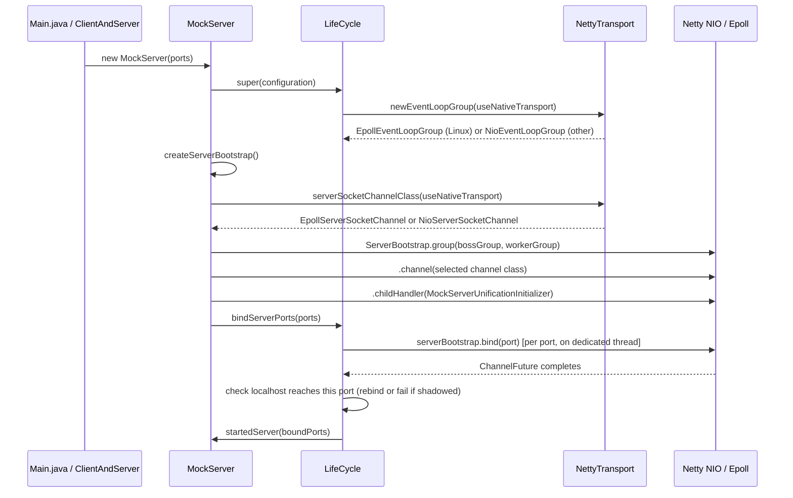

### Transport Selection

`NettyTransport` (`mockserver-core`, `org.mockserver.socket`) selects the highest-performance transport available at startup. On Linux with the native epoll library present and `useNativeTransport=true` (the default), it creates `EpollEventLoopGroup` and uses `EpollServerSocketChannel` / `EpollSocketChannel`. On all other platforms (macOS, Windows) or when the opt-out flag is set, it falls back to NIO transparently.

The transport selection is consistent across the entire data path: server bootstrap (boss + worker groups), outbound HTTP client (`NettyHttpClient`), and relay connect handler (`RelayConnectHandler`). This ensures the EventLoopGroup type always matches the channel type (epoll group with epoll channels, NIO group with NIO channels).

Epoll transport is required for transparent-proxy `SO_ORIGINAL_DST` resolution, which needs `EpollSocketChannel` children to extract the raw file descriptor.

The first event-loop group the server creates logs the transport once at INFO: `using native epoll transport`, `using NIO transport (native transport disabled by useNativeTransport=false)`, or, on Linux only, `using NIO transport (native epoll transport unavailable: <cause>)` (DEBUG on macOS/Windows, where NIO is the only option). Grep a container's start-up log for `using native epoll transport` or `using NIO transport` to see which transport it runs.

**Shaded jar natives.** The `mockserver-netty-no-dependencies` shaded jar — and the `mockserver-netty-docker` jar derived from it, which every published Docker image (`docker/local`, `-graaljs`, `-clustered`, `-aot`) is built from — relocates `io.netty` to `shaded_package.io.netty`. Relocated netty loads its JNI library by a package-mangled name (`libshaded_1package_netty_transport_native_epoll_<arch>.so`), so the shared shade configuration in `mockserver/pom.xml` relocates the epoll `.so` resource paths to that name. Before this, the natives kept netty's own name, `Epoll.isAvailable()` was `false`, and every published image silently ran NIO (the fallback logged only at DEBUG). `mockserver-netty-no-dependencies/src/packaging/assert-shaded-epoll-natives.sh` fails the `package` phase if either arch's `.so` is missing under the mangled name or still present under the unrelocated one. Only epoll is renamed: the tcnative and QUIC natives in the shaded jars keep their unrelocated names and so still do not load from the jar itself (the `-http3` image installs its QUIC native under the mangled name in a separate layer; see [http3.md](http3.md)). The shaded library jar also relocates JNA (`com.sun.jna` to `shaded_package.com.sun.jna`), whose JNI entry points are bound to the unrelocated class names, so the JNA-based original-destination resolvers (`SoOriginalDstResolver`, `EbpfOriginalDestinationResolver`) do not work from `mockserver-netty-no-dependencies` itself: transparent proxying there falls back to the conntrack resolver. The images are built from the build-internal `mockserver-netty-docker` jar instead, which is the library jar with JNA moved back to `com.sun.jna`, so both resolvers work in the images on epoll (see [docker.md](../infrastructure/docker.md#image-server-jar-mockserver-netty-docker)).

**Intentionally left on NIO:** `Http3Server` (QUIC/datagram, separate experimental transport with its own `NioEventLoopGroup`), `McpToolRegistry`'s internal client, and `EchoServer` (test infrastructure).

| Property | Default | Env var | System property |
|----------|---------|---------|-----------------|
| `useNativeTransport` | `true` | `MOCKSERVER_USE_NATIVE_TRANSPORT` | `-Dmockserver.useNativeTransport` |

#### CI Test Coverage

On Linux CI the **full existing integration-test suite** exercises the epoll transport automatically because:

1. `useNativeTransport` defaults to `true`
2. The `netty-transport-native-epoll` JARs (linux-x86_64, linux-aarch_64) are declared as `runtime`-scoped dependencies in `mockserver-netty/pom.xml`, which Maven includes on the test classpath
3. On Linux the native `.so` loads successfully, so `Epoll.isAvailable()` returns `true`

To force NIO on Linux for comparison testing, set `useNativeTransport=false` via system property (`-Dmockserver.useNativeTransport=false`) or environment variable (`MOCKSERVER_USE_NATIVE_TRANSPORT=false`).

Dedicated activation tests in `EpollTransportIntegrationTest` (`mockserver-netty`) verify the channel and event-loop-group types at runtime. These tests are gated by `Assume.assumeTrue(Epoll.isAvailable())` and skip cleanly on macOS/Windows.

This coverage runs against the **unshaded** module classpath, so it cannot see a shaded-jar packaging fault; that is what `assert-shaded-epoll-natives.sh` (above) is for.

### Key Bootstrap Configuration

| Setting | Value | Purpose |
|---------|-------|---------|
| Boss group | `EpollEventLoopGroup(5)` or `NioEventLoopGroup(5)` | Accept connections |
| Worker group | `EpollEventLoopGroup(configurable)` or `NioEventLoopGroup(configurable)` | Handle I/O |
| Channel | `EpollServerSocketChannel` or `NioServerSocketChannel` | Server socket (transport-matched) |
| SO_BACKLOG | 1024 | Connection queue depth |
| AUTO_READ | true | Automatic read on new channels |
| Server channel handler | `InboundConnectionLimiter` | Counts open connections and enforces `maxInboundConnections` — see [Inbound Connection Bounds](#inbound-connection-bounds) |
| ALLOCATOR | `NettyAllocator.ALLOCATOR` (`PooledByteBufAllocator.DEFAULT`) | One pooled allocator for every channel — see [ByteBuf Allocator](#bytebuf-allocator) |
| WRITE_BUFFER_WATER_MARK | 8KB low / 32KB high, on accepted connections (`childOption`) | When a connection's outbound buffer passes 32 KB it reports itself unwritable until it drains below 8 KB. The mark bounds nothing by itself; it matters only to code that reads writability — see [Outbound Buffering and Backpressure](#outbound-buffering-and-backpressure). Before `MockServer.CONNECTION_WRITE_BUFFER_WATER_MARK` was set with `childOption` it was set with `option`, which applies to the listening socket (which never writes), so accepted connections had Netty's 32 KB / 64 KB default |

### Port Binding and Loopback Reachability

**Outcome:** after binding each port, `LifeCycle.bindPort` checks that a localhost connection to that port actually reaches the new listener. A port chosen by the operating system (port `0`) that fails the check is closed and replaced (up to 10 attempts, each retry on a port the IPv4 wildcard allocator reports free, since that allocator does avoid ports held on `127.0.0.1`); an explicit port that fails it throws a `BindException` naming the conflict and suggesting `lsof -nP -iTCP:<port> -sTCP:LISTEN`, which surfaces like any other "port already in use" error (including the `400` from `PUT /mockserver/bind`, whose body carries the conflict detail and the `lsof` hint).

**Why:** MockServer binds the wildcard address, which the JDK opens as a dual-stack IPv6 socket (`[::]`) with `SO_REUSEADDR`. On macOS that bind succeeds even when another process holds the same port on `127.0.0.1` specifically, and the IPv6 ephemeral allocator does not avoid such ports either. The kernel then delivers `127.0.0.1:<port>` (and so `localhost`) connections to the more specific listener, so MockServer reports a successful start but receives none of its localhost traffic. With 2,000 `127.0.0.1` listeners held on ports spread across the ephemeral range, 61 of 500 wildcard `bind(0)` calls landed on a held port on macOS; Linux refuses the bind, so no port there is ever shadowed this way.

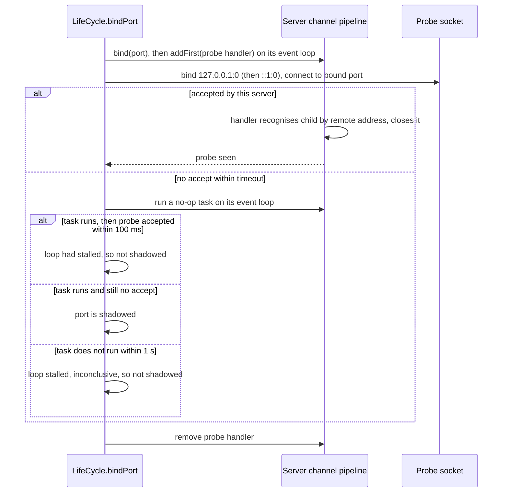

| Aspect | Behaviour |
|--------|-----------|
| Addresses probed | Wildcard IPv6 bind: `127.0.0.1` and `::1`. Wildcard IPv4 bind: `127.0.0.1`. Loopback `localBoundIP`: that address. Any other `localBoundIP`: none. |
| Recognising the probe | The probe socket binds its source address before connecting, and a handler added **first** on the server channel's pipeline (ahead of `ServerBootstrapAcceptor`) matches the accepted child by that exact remote address. The probe socket bypasses any JVM-wide `ProxySelector` or `socksProxyHost` (`Proxy.NO_PROXY`), since a relayed probe would arrive from the proxy's address and look shadowed |
| Effect on real traffic | None: the probe child is closed before registration, so it never reaches `MockServerUnificationInitializer`, the event log or metrics; the handler is removed as soon as the check ends. One exception: a probe that this channel accepts only after the check ends (a stalled accept loop) is no longer intercepted, so it reaches the normal pipeline as a connection that opens and is immediately reset. If the event loop is too busy to install the handler within 1 s, the check is skipped (reported as not shadowed) and the queued install is cancelled, or removed if it already ran |
| Verdict | Shadowed only if the probe **connects**, is not accepted by this channel in time (5 s for an explicit port, where a false positive would fail startup; for an OS-chosen port 250 ms doubling per attempt up to 5 s, where it only costs a rebind), and the channel's event loop is then shown to be running: a no-op task submitted to it completes within 1 s and the probe is still not accepted 100 ms later. If the task does not run in time the loop is stalled, so nothing could have been accepted and the check is inconclusive, reported as not shadowed. A failed connect (family unavailable, nothing listening) is not a conflict |
| Retry port choice | macOS allocates ephemeral ports sequentially, so a plain `bind(0)` retry tends to land on the next held port. Retries instead use a port from the IPv4 wildcard allocator, which is still probed after binding |
| Cost | Two loopback connects per bound port when not shadowed. Measured on macOS over 20 fresh JVMs each, against the same build without the check: the first start's median rose by 3–4 ms in each of two runs (within the run-to-run spread), and each later start in the same JVM by about 1 ms |

**Rejected alternatives** (measured on macOS): `SO_REUSEADDR=false` makes the explicit-port bind throw but still lets the ephemeral allocator pick held ports, and it breaks restarting on the same port while server-side connections are in `TIME_WAIT` (on macOS and Linux). An IPv4-only wildcard socket avoids the ephemeral collisions but still shadows an explicit port. Binding `127.0.0.1` avoids both but makes MockServer unreachable from other hosts and containers, so it stays opt-in via `localBoundIP`.

`PortFactory.findFreePort()` / `findFreePorts()` (`mockserver-core`) avoids the same trap for ports chosen before binding. It takes candidates from the IPv4 wildcard allocator and skips any candidate already in use on `[::1]`. That check runs only if `[::1]:0` can be bound at the start of the batch, and only "address in use" counts as taken: the JDK also reports "Cannot assign requested address" as a `BindException`, which would otherwise make every port look taken on a host with IPv6 loopback disabled. At most 32 candidates are skipped per batch; after that the `[::1]` check is dropped for the rest of the batch, and a skipped port is never returned. With 2,000 listeners held on ports spread across the ephemeral range, the old dual-stack `bind(0)` returned a held port 61 times in 500 on macOS when they were held on `127.0.0.1` and 80 times in 500 when held on `[::1]`; the new allocator returned none in 500 either way. On Linux (JDK 17 in Docker) neither the old nor the new allocator returned a held port in 500. Its opt-in `testPortRange` band still uses explicit dual-stack binds, which do not detect a `127.0.0.1` holder.

### ByteBuf Allocator

All request/response traffic uses one allocator, `NettyAllocator.ALLOCATOR` (`org.mockserver.socket`, which is `PooledByteBufAllocator.DEFAULT`), so the buffers that carry it come from one set of pooled arenas. Two small exceptions keep Netty's default: HTTP/3 connection-local control and QPACK encoder/decoder streams (Netty opens them itself, and the codec's `streamOption` does not reach them), and the `ByteBufAllocator.DEFAULT` use inside OpenSSL context creation. Netty 4.2's `ByteBufAllocator.DEFAULT` is the adaptive allocator, and any channel whose allocator is not set explicitly gets it — a bootstrap `option`/`childOption` does not reach channels a codec creates itself.

| Channel | How the allocator is set |
|---------|--------------------------|
| Listening socket and accepted connections (`MockServer`) | `option(ALLOCATOR)` / `childOption(ALLOCATOR)` |
| HTTP/2 stream child channels, server side | `NettyAllocator.pin(ch)` in `Http2MultiplexChildInitializer.initChannel` |
| Forward/proxy client connections (`NettyHttpClient`, HTTP and binary) | `option(ALLOCATOR)` |
| HTTP/2 stream child channels, forward side | `NettyAllocator.pin(ch)` in `Http2ForwardStreamChildInitializer.initChannel` (outbound and inbound streams) |
| CONNECT/SOCKS relay loopback (`RelayConnectHandler`) | `option(ALLOCATOR)` |
| WebSocket proxy upstream (`WebSocketProxyRelayHandler`), callback WebSocket client (`WebSocketClient`), Java client breakpoint WebSocket (`BreakpointWebSocketClient`) | `option(ALLOCATOR)` |
| DNS UDP server | `option(ALLOCATOR)` |
| HTTP/3: UDP socket, QUIC connection and QUIC request streams (`Http3Server`; connection-local control/QPACK streams keep Netty's default); CONNECT-UDP relay socket (`Http3ConnectUdpHandler`) | `option(ALLOCATOR)` on the bootstrap; `option`/`streamOption(ALLOCATOR)` on the QUIC codec builder |
| `EchoServer` (test upstream) | `childOption(ALLOCATOR)` |

HTTP/2 stream channels are the case that is easy to miss: Netty builds each `Http2StreamChannel` with a fresh `DefaultChannelConfig` and does not copy the parent connection's allocator, so they must be pinned in the child initializer before the stream reads or writes. `Http2StreamChannelAllocatorTest`, `Http2ForwardStreamChannelAllocatorTest` and `RelayConnectAllocatorTest` fail if a pin is removed.

### Channel Attributes

| Attribute | Type | Purpose |
|-----------|------|---------|
| `REMOTE_SOCKET` | `InetSocketAddress` | Remote proxy target (port-forwarding mode) |
| `PROXYING` | `Boolean` | Whether channel is in proxy mode |
| `TLS_ENABLED_UPSTREAM` | `Boolean` | TLS active on client side |
| `TLS_ENABLED_DOWNSTREAM` | `Boolean` | TLS needed for upstream connections |
| `HTTP_ENABLED` | `Boolean` | HTTP pipeline configured |
| `HTTP2_ENABLED` | `Boolean` | HTTP/2 pipeline configured |
| `TRANSPARENT_ORIGINAL_DST_RESOLVED` | `Boolean` | Whether original-dst was resolved (conntrack/PROXY protocol) |
| `NETTY_SSL_CONTEXT_FACTORY` | `NettySslContextFactory` | SSL context for this channel |

## Channel Initializer

`MockServerUnificationInitializer` is a `@Sharable` `ChannelHandlerAdapter` that replaces itself with a `PortUnificationHandler` on `handlerAdded()`. This thin adapter ensures each new channel gets its own `PortUnificationHandler` instance (since the decoder maintains per-channel state).

When `transparentProxyEnabled` is true, the initializer adds two handlers before the port unification handler:

1. **`ProxyProtocolOriginalDestinationHandler`** (`"proxy-protocol"`) — inspects the first inbound bytes for a PROXY protocol header, dispatching on the first byte: `0x0D` → v2 (binary), `'P'` → v1 (text). If a recognised header is found, sets `REMOTE_SOCKET` + `PROXYING` + `TRANSPARENT_ORIGINAL_DST_RESOLVED` (v2: for the PROXY command on INET/INET6; LOCAL/UNIX defer to downstream resolution), consumes the header bytes, and removes itself. If not found, removes itself and passes bytes through unchanged.
2. **`TransparentProxyHandler`** (`"transparent-proxy"`) — fires at `channelActive` and runs the pluggable `CompositeOriginalDestinationResolver` chain (default: TPROXY → eBPF → SO_ORIGINAL_DST → conntrack → dns-intent). Skips resolution if `TRANSPARENT_ORIGINAL_DST_RESOLVED` is already set (e.g., by the PROXY protocol handler).

### Original Destination Resolver Chain

`CompositeOriginalDestinationResolver.defaultChain(Configuration)` tries strategies in order (first non-null wins):

| Order | Strategy | Class | Notes |
|-------|----------|-------|-------|
| 1 | TPROXY (IP_TRANSPARENT) | `TproxyOriginalDestinationResolver` | Returns `channel.localAddress()` when `transparentProxyTproxy=true`; null otherwise |
| 2 | eBPF socket metadata | `EbpfOriginalDestinationResolver` | O(1) BPF hash-map lookup; requires Linux + `CAP_BPF` + external cgroup BPF program; enabled via `transparentProxyEbpf=true` |
| 3 | SO_ORIGINAL_DST getsockopt | `SoOriginalDstResolver` | O(1) JNA `getsockopt`; requires Linux + Netty epoll transport |
| 4 | Linux conntrack table | `ConntrackOriginalDestinationResolver` | O(n) conntrack table scan; fallback when SO_ORIGINAL_DST is unavailable |
| 5 | DNS-intent (recover hostname MockServer's DNS answered) | `DnsIntentOriginalDestinationResolver` | Consults `DnsIntentRegistry`; last resort when all others return null |

The DNS-intent resolver consults `DnsIntentRegistry` (`mockserver-core`, `org.mockserver.mock.dns`), which records the `answeredIP → hostname` mappings MockServer's own DNS server hands out (A/AAAA answers). When a connection arrives at such an IP and all earlier strategies return null, the resolver returns an *unresolved* `InetSocketAddress` carrying the recovered hostname, so downstream forwarding/matching works by name (loop-prevention guards against a DNS-to-self loop). The registry is cleared by `HttpState.reset()`.

Note: PROXY protocol is handled separately in the pipeline (it reads bytes, not channel metadata).

## Port Unification Handler

`PortUnificationHandler` extends Netty's `ReplayingDecoder<Void>` and is **the heart of protocol detection**. It inspects the first bytes of every connection and routes to the appropriate protocol pipeline.

### Protocol Detection Order

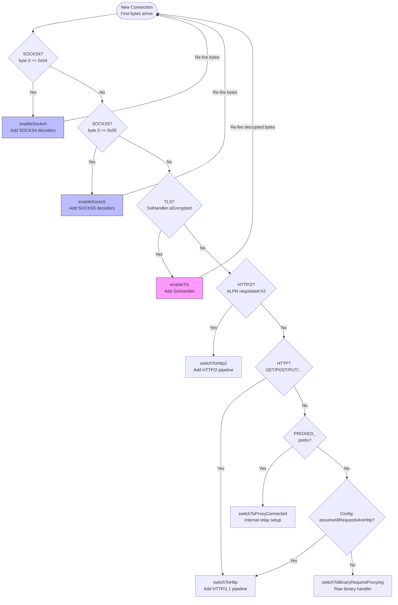

**Recursive detection**: When TLS or SOCKS is detected, the handler adds protocol-specific decoders, re-fires the bytes through the pipeline, and runs detection again on the decoded data. This enables arbitrary nesting (e.g., SOCKS5 → TLS → HTTP/2).

### Connection Delay

A configurable connection delay can be applied before protocol detection begins. When `connectionDelayMillis` is set to a non-zero value, `PortUnificationHandler.channelActive()` suppresses auto-read on the new channel and schedules the first read to resume after the configured duration, so the first inbound bytes (and protocol detection) are deferred without blocking the event loop. This simulates slow connection establishment for testing timeout handling in clients.

Configuration: `ConfigurationProperties.connectionDelayMillis(long millis)`, system property `mockserver.connectionDelayMillis`, environment variable `MOCKSERVER_CONNECTION_DELAY_MILLIS`. Default: 0 (no delay).

**Non-blocking:** The delay defers the first read via the event loop's scheduler instead of sleeping, so it does not stall other channels sharing the same worker thread. The delay is applied once per channel at `channelActive`.

### Inbound Connection Bounds

**Outcome:** two bounds stop idle or excess client connections from growing kernel socket memory (~3.9 KiB measured per connection) and per-channel state without limit. `inboundConnectionIdleTimeoutMillis` (default `300000`, `0` disables) closes a connection that has read and written nothing for the timeout **and** has nothing in progress; `maxInboundConnections` (default `0` = no limit) resets any connection accepted beyond the limit before it is registered. Both are read from the `Configuration` instance per connection, so a runtime change applies to the next connection.

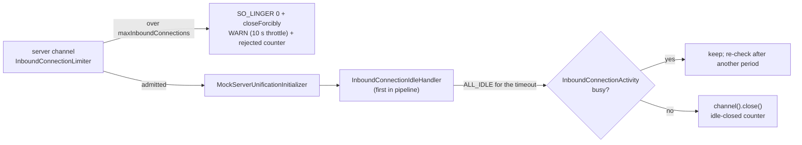

| Component | Where | Role |
|-----------|-------|------|
| `InboundConnectionLimiter` | `ServerBootstrap.handler(...)` on the listening socket, ahead of `ServerBootstrapAcceptor` (and behind the loopback-shadow probe) | Per-server `AtomicInteger` of open connections, decremented on each child's `closeFuture`; refuses the N+1th with a reset, so a refused connection never gets a worker event loop or a pipeline. Also feeds the JVM-wide `mock_server_inbound_connections_open` gauge |
| `InboundConnectionIdleHandler` | `addFirst` in `MockServerUnificationInitializer.handlerAdded`, only when the timeout is `> 0` | An `IdleStateHandler(0, 0, timeout)` whose `channelIdle` consults the activity instead of firing the event, so no other handler reacting to `IdleStateEvent` can see it. Closes through `channel().close()` so an HTTP/2 codec sends GOAWAY and TLS sends close_notify. Kept on the client leg of a CONNECT/SOCKS tunnel (see *Tunnels and the idle timeout* below) |
| `InboundConnectionActivity` | channel attribute, created by the idle handler | Busy when: an HTTP/1.1 exchange is in progress, an HTTP/2 stream is active (`Http2ConnectionHandler.connection().numActiveStreams()`), auto-read is off (connection delay, relay back-pressure), the server certificate is being generated off the event loop (`SniHandler.SSL_CONTEXT_PENDING`), a TLS handshake is incomplete (bounded by the handshake's own timeout), or the connection is marked long-lived |
| `HttpExchangeTracker` | `@Sharable` singleton after `HttpServerCodec` (and the chunk-line limiter) in `switchToHttp`, and after the tunnel's own codec on the client leg of an HTTP/1.1 CONNECT/SOCKS tunnel (`RelayConnectHandler.configurePipelines`), only on tracked channels | An exchange starts at a decoded `HttpRequest` and ends when the `LastHttpContent` of its response **has been written** (promise completion), so delayed, breakpoint-paused and streaming responses count, and so does a large body `PacedLargeWriteHandler` is still slicing to a slow reader (its promise completes only when the last slice is written). Pipeline order: `inbound-idle`, `PacedLargeWriteHandler`, `HttpChunkLineLimiter$BeforeCodec`, `HttpServerCodec`, `HttpChunkLineLimiter$AfterCodec`, `HttpExchangeTracker` — the tracker must stay after the codec. `1xx` responses do not end an exchange; `101` also marks the connection long-lived |

**Long-lived (exempt) connections** — marked with `InboundConnectionActivity.markLongLived(channel)`: a `101 Switching Protocols` (WebSocket: dashboard, callback, mocked and proxied), MockServer's own loopback leg of a CONNECT/SOCKS tunnel (`PortUnificationHandler.switchToProxyConnected`), and raw binary proxying (`switchToBinaryRequestProxying`). Their silences are legitimate and their traffic is not HTTP exchanges the tracker could see. Marking also removes the idle handler and the exchange tracker from the pipeline (on the event loop), so a WebSocket or tunnel stops paying their per-write cost, and `isTracked` stops a later `switchToHttp` on the loopback leg from re-installing the tracker. An exchange whose response never passes the tracker as HTTP objects — raw bytes (an `HttpError` `responseBytes`, written from `HttpServerCodec`'s context), an `HttpError` that writes nothing and keeps the connection open, or a mocked final `1xx` other than `101` — is ended by `HttpExchangeEndedEvent` (`mockserver-core`, `org.mockserver.responsewriter`). `HttpErrorActionHandler` (from a listener on the raw write, so it runs on the event loop as the write completes and any drop is chained after it) and `NettyResponseWriter` fire it from the codec's context, so it travels inbound through exactly the tracker and `HttpTransportTimer`, which each end their oldest exchange; without it the connection would count as busy for the rest of its life and never be closed as idle.

**Tunnels and the idle timeout.** A CONNECT/SOCKS tunnel is closed as idle like any other connection, both legs together. The timer and the busy check are the client leg's: its `InboundConnectionIdleHandler` stays in place when the tunnel is set up, near the head of the pipeline, so every byte the client sends or is sent (TLS records and HTTP/2 control frames included) restarts it. `RelayConnectHandler` terminates every tunnel, so the client leg has an HTTP codec of its own, and the busy check reads it as on any connection: an HTTP/1.1 tunnel gets an `HttpExchangeTracker` after its `HttpServerCodec`, and an HTTP/2 tunnel's `HttpToHttp2ConnectionHandler` is asked for its active streams.

| Tunnel state | Idle-closed? |
|---|---|
| Established, the client has sent nothing yet | yes |
| Between requests on a kept-alive tunnel | yes |
| A request is being uploaded: the relay holds it until its body is complete, so nothing reaches the loopback | no: the exchange began when the client leg decoded the request head |
| A response is delayed, paused at a breakpoint, or streamed with gaps | no: the exchange ends when the last of the response is written to the client |
| An HTTP/2 stream is open | no |
| A `101 Switching Protocols` has passed through | no: the client leg becomes long-lived |
| Bytes arrive that complete no request (a request head sent slowly) | no: each read restarts the timer |

The client leg is watched, not the loopback, because only it sees an upload in progress. Closing it closes the loopback (see [Relay close](#relay-close)); the loopback leg MockServer accepts stays long-lived, so it is never closed on its own and only counts once in `mock_server_inbound_connections_idle_closed_total`. The relay carries no opaque tunnel: what cannot be read as TLS, h2c or HTTP/1.1 fails to decode and is closed. Raw binary proxying is a connection of its own, not a tunnel, and stays exempt.

One case differs from a direct connection: a tunnelled exchange MockServer answers with an `error()` that sends nothing and keeps the connection open keeps its tunnel open, as before. On a direct connection `HttpExchangeEndedEvent` ends that exchange, but the event is fired on the loopback leg and does not reach the client leg, which still counts the exchange as in progress.

**Tunnels and the cap.** A CONNECT/SOCKS tunnel whose target is MockServer itself holds two slots: the client's connection and the internal loopback connection `RelayConnectHandler` opens. If the loopback is refused by the cap, the loopback channel closes before `PROXIED_RESPONSE_` arrives; `RelayConnectHandler`'s `channelInactive` then answers the client with the failure response (`502` for CONNECT) and closes, where it previously waited forever.

**Start-up warm-up.** `startupWarmup`'s `HttpURLConnection` request to the server leaves a JDK keep-alive connection open for about 5 seconds, which counts against the cap; tests with a very small cap set `startupWarmup(false)`.

**Not covered:** HTTP/3 (QUIC has its own `http3MaxIdleTimeout` and is not counted) and outbound forward/proxy connections (the forward pool has its own idle reaper). A child whose registration fails is still decremented: Netty's register path calls `closeForcibly()` and then completes the close future, which runs the limiter's listener.

### Response Write-Stall Timeout

**Outcome:** `responseWriteStallTimeoutMillis` (default `60000`, `0` disables, negative clamps to `0`) ends a response whose client has taken none of what is waiting for it for the timeout, so a client that stops reading cannot hold a queued response, or a streamed response's upstream connection, indefinitely. HTTP/1.1 (and any TCP connection: tunnels, WebSockets) is closed; an HTTP/2 or HTTP/3 stream is reset alone. The streaming writers' close listener then closes the upstream. A client that keeps taking some of the response at least once per timeout period is not affected, and a connection with nothing waiting to be written runs no timer. For an HTTP/2 stream, taking the response means data being written for it: flow-control frames that let none leave do not count (see *What counts as HTTP/2 stream progress* below).

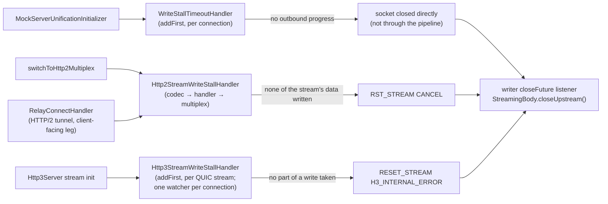

| Component | Where | Progress signal |
|-----------|-------|-----------------|
| `WriteStallTimeoutHandler` | `addFirst("write-stall")` in `MockServerUnificationInitializer.handlerAdded`, when the timeout is `> 0`; kept for the connection's life (not removed by `markLongLived`) | The socket taking more of `ChannelOutboundBuffer`: a different head message, `currentProgress()` moved, or fewer pending bytes. On epoll `tcpInfo().lastDataSent` within the check interval also counts, because the kernel wakes a writer only once a share of the send buffer is free |
| `Http2StreamWriteStallHandler` | After `Http2FrameCodec`, before `Http2MultiplexHandler`, in `PortUnificationHandler.switchToHttp2Multiplex`, and after the CONNECT/SOCKS relay's client-facing `HttpToHttp2ConnectionHandler` (`RelayConnectHandler`); the relay's failed write of the reset stream's queued response ends only that stream (see [Relay write failure](#relay-write-failure)). On both it wraps the connection's remote flow controller when it is added, so it needs only to come after the connection handler | For each active stream the remote flow controller holds data for: the flow controller wrote some of its data, counted as it is written (see *What counts as HTTP/2 stream progress* below); for a stream whose own window is still open, also data written for any other stream, because the weighted-fair distributor gives a stream nothing while a stream it depends on has data, the connection's socket not being writable while a `WriteStallTimeoutHandler` is in the connection's pipeline, because the flow controller then writes nothing and a stalled socket is that handler's to time (it tolerates the gaps in which a slow reader's kernel frees its send buffer, which the stream watcher cannot see), and the reset, in the same check, of the stalled stream holding the most of a closed connection window (see *A stalled stream holding the connection window* below). A client can starve one stream while reading the connection, so a socket-level check alone would miss it |
| `Http3StreamWriteStallHandler` | `addFirst` in each QUIC request stream, from `Http3Server`, so every writer's output passes through it (`Http3ResponseWriter`, the gRPC writers, MCP, CONNECT-UDP); the streams of a connection are timed by one `Http3ConnectionWriteStallWatcher`, held as an attribute of the `QuicChannel`, with the timeout read by the first of its streams to be watched (the value logged when a stream is reset) | QUIC taking a whole write. QUIC completes a write only once it has taken all of it and reports nothing of a part, so the handler passes each buffer on in parts of at most 32 KiB (see *HTTP/3: progress inside a large write* below). A stream that has been sent too little to hold the connection's credit also waits for the streams that could (see *An unread HTTP/3 stream holding the connection credit* below) |
| Writer close listener | `NettyResponseWriter` (streamed HTTP/1.1 and HTTP/2) and `Http3ResponseWriter` | On the client channel's (or HTTP/2 / HTTP/3 stream channel's) `closeFuture`, an incomplete `StreamingBody` closes its upstream; removed on complete or error so a keep-alive connection does not collect one per response |

**Counted.** Every cut increments `mock_server_response_write_stalls_total{protocol, scope}` (see [metrics.md](metrics.md#response-write-stall-metric)) as well as logging a `WARN`. `WriteStallTimeoutHandler` reads the protocol from the pipeline when it trips: a tunnel's proxy-client pipeline also holds the codec of the protocol it relays, so `UpstreamProxyRelayHandler` is checked first. A reset HTTP/2 stream stays active until its `RST_STREAM` gets past the socket, so the stream watcher skips streams already reset rather than resetting, logging and counting them again at every check.

**What counts as HTTP/2 stream progress.** Only data written for the stream, counted where it leaves the flow controller. When the handler is added it replaces the connection's remote flow controller with `WrittenBytesFlowController`, which hands every call to the original and wraps each queued frame: the size a frame loses in a write is the DATA payload and padding written for its stream. The handler keeps that total per stream and for the connection. Nothing a client sends reaches the count, so a client that takes none of a stream's data cannot keep the stream by sending frames: not by a `WINDOW_UPDATE` (for the stream, with the connection window closed, or for the connection, behind an unwritable socket), and not by changing `SETTINGS_INITIAL_WINDOW_SIZE`, including a rise that would overflow an earlier stream's window, which Netty applies to the streams before that one only. The stream is reset one timeout after the last data written for it, or after it was first seen with data waiting. Earlier the watcher read progress off the send window (any change of it, or any `WINDOW_UPDATE`), which each of those frames moves for free. The same wrapper also reports each window increment a `WINDOW_UPDATE` applies: the connection's decoder hands every one to the remote flow controller (`incrementWindowSize`), behind `Http2FrameCodec` and behind the relay's `HttpToHttp2ConnectionHandler` alike, so both paths are covered without a frame listener. An increment is never progress: it only feeds the choice of which timed-out stream is reset first (*Which stream is reset first* below).

| Counts as progress | For |
|--------------------|-----|
| Data written for the stream, however little | The stream |
| Data written for any stream on the connection, including one that has since closed | Streams whose own window is open |
| The socket not writable while a `WriteStallTimeoutHandler` is in the pipeline | Streams whose own window is open |
| The reset of the stream holding the most of a closed connection window, once (next paragraph) | Streams whose own window is open |

While the connection window is closed, an open-windowed stream that has timed out is also not reset as long as some watched stream that has been sent data has not yet timed out: it may be waiting for window that stream holds (the paragraph after next). That is a wait, not progress: its period is not restarted.

Not covered:

- **No minimum rate.** A client that takes one byte of a stream every period keeps it, as a client reading one byte per period keeps an HTTP/1.1 connection. And since an open-windowed stream counts as progressing while data is written for any stream, one byte per period on a connection keeps every open-windowed stream on it, and a `WINDOW_UPDATE` opens a stream's window for free. Telling a deliberate trickle from a slow reader needs a rate floor, which would cut slow readers that are served today (performance-programme #114).
- **The stream whose window a `SETTINGS` rise overflows.** RFC 9113 §6.9.2 asks for a connection error; Netty raises a stream error for that one stream and leaves the initial window raised for the streams before it only. On a tunnel's client-facing leg the connection handler resets that stream (`FLOW_CONTROL_ERROR`); behind `Http2FrameCodec` it stays open. The watcher does nothing about it as such: if it has a response waiting and takes none of it, it is reset like any other stalled stream. The conformance gap itself is open as performance-programme #127.

**A stalled stream holding the connection window.** A client that returns connection window only as it consumes a stream's data (Netty's codec does, in batches of half a window; its default connection window is 65,535 bytes, the same as a stream's) lets a stream it stops consuming hold much of the connection window, and the bytes it has consumed on other streams but not yet returned can hold the rest. Nothing on the connection then moves, so every stream with data waiting is timed from the same last movement and trips in the same check, whether or not the stalled stream's own window has closed. So while the connection window is closed, the watcher resets only the timed-out streams holding the most of it, and gives the other open-windowed streams a fresh timeout period. What a stream holds is taken as the data written for it less the window its client has since returned for it (*Which stream is reset first* below). A closed-window stream is always reset, and its reset gives the others a fresh period only while the connection window is closed: with it open they are not waiting for window, so open-windowed streams stalled with it (behind an unwritable socket no connection watcher is timing) are reset in the same check, as before. Netty's `DefaultHttp2LocalFlowController` returns a closed stream's unconsumed bytes to the connection window, and Chromium returns a discarded buffer to its session window, so for such clients the siblings continue.

It stays fail-closed. A stream with no data its client has yet to return window for counts as holding nothing, and resetting it extends nothing: otherwise a client granting a zero initial window could keep a stalled stream alive by opening one such stream every timeout period. A stream is given a fresh period for a reset once, and not again until it is refreshed for another reason (its own data moving, another stream's data moving, or a watched socket stall), so if the client returns nothing, every remaining stream is reset one period later. The grant is tracked per stream, not per connection, so a stream opened after an earlier stall on the same connection is spared in its turn. Every stream reset has taken none of its data for the whole timeout, as before. The cost is time: a client that stalls several streams and returns window as each is reset has them reset one group per period instead of all at the first, because each release is movement. The worst case is one period per stalled stream. At most 100 can be stalled at once (`PortUnificationHandler.HTTP2_MAX_CONCURRENT_STREAMS`), but a client that opens a replacement stalled stream after each reset continues the sequence, one per period, each replacement having to take a window of new data first.

**A stream waiting for a holder that has not yet timed out.** A stream's period runs from the last data written for it, so a stream whose own window was closed when the connection window closed, and whose client then returned its stream window, reaches its timeout before the stalled streams that took the connection window after it. It would be the only stream timed out at that check, and so be reset before the streams it is waiting on. So while the connection window is closed, an open-windowed stream that has timed out is not reset while any other watched stream that has been sent data has not yet timed out. When the last of those times out, the pick above is made among all of them: the stalled stream holding the most is reset and the waiting stream gets its fresh period. The wait ends with those streams' own timeouts and restarts nothing. A client cannot extend it for free: only a stream that has been sent data counts, data is counted where it is written, and a stream opened and sent nothing counts for nothing. Keeping a stream waiting therefore needs a stream that was sent data within the last period, which is progress for every open-windowed stream anyway, or one that was sent data earlier and only now has more waiting (a response written in stages). Such a stream is waited for through its own period and, at most, the one fresh period a reset can give it, so the wait is bounded by the number of such streams on the connection, as the worst case above is.

**Which stream is reset first.** Among the streams that have timed out behind a closed connection window, the watcher resets those with the most data their client has not returned window for. It passes over a stream that has less unreturned than its client has returned for it in one `WINDOW_UPDATE` before, but only when another stream, with no such history, holds by itself more than half of what the connection has out. The server cannot see which stream its client is reading. This is the evidence it has, and it changes only the order in which streams that have already timed out are reset: never whether one is reset, and never when a stream's period ends.

| Kept | Updated | Meaning |
|------|---------|---------|
| Unreturned, per stream | Plus every byte of data written for the stream; minus each `WINDOW_UPDATE` increment for it, up to what was unreturned when it arrived | The most of the stream its client can still be holding. An increment beyond it is a grant, and returns nothing |
| Smallest return, per stream | The least an increment has returned for the stream at once | A client that returns a stream's window at a threshold never returns less than the threshold, so a stream it is consuming has less than this unreturned |
| Unreturned, for the connection | The same count against the connection's `WINDOW_UPDATE`s | What the connection has out; a connection window enlarged before any data was sent is counted in full |

A stream is *explained* when its unreturned data is less than its smallest return: it holds no more than its client has left on it before while consuming it. A stream no window has been returned for is never explained. When the stream with the most unreturned among those not explained holds more than half of what the connection has out, the explained streams are passed over and that stream is reset, with any that tie with it. Otherwise, and when no stream is explained, the pick is made among all the streams.

Why one stream alone, and why half. A client that returns window once half of it is consumed (Netty's ratio) leaves a stream it is consuming up to half a stream window unreturned before its first return, all of it data the client has consumed and has already returned at connection level. Such a stream looks exactly like a stalled one that has been sent little. Several of them together can show more than half the connection window unreturned while holding none of it, so the unexplained streams are not added up. One of them alone cannot at the default windows: with stream and connection windows both 65,535 bytes it has at most 32,767 unreturned, which is not more than half. So at the default windows, with such a client, the rule passes a stream over only for a stream that really is stalled. That is argued from the client's return rule, and checked with a Netty client in the scenarios listed under *What remains*.

A stream passed over is treated as any stream not picked: it gets the one fresh period if it has not had it already, and is reset in the same check if it has, so it is reset no later than one period after the stream picked instead, which is the bound a stream not picked had before. A stream whose own window is closed is reset whether or not it is explained. In any check in which the previous rule reset a stream, this one resets at least one.

With one stalled stream and a connection window at least the size of the stream window, the stalled stream holds the most whatever has been returned: a client that returns window once half of it is consumed leaves at most half a stream window unreturned on a stream it consumes, and the stalled stream holds more than half the connection window. At the 65,535-byte defaults that is 32,768 bytes against at most 32,767, so the two never tie, and the stalled stream is the one reset whether it is explained or not. Netty's `Http2FrameCodec` enlarges its connection window when the stream window is raised through the codec builder's initial settings, but not when a later `SETTINGS` frame raises it.

What this changes in the four cases where the most-unreturned stream need not be the stalled one (performance-programme #107):

| Case | Outcome | Shown by |
|------|---------|----------|
| Stream window above the connection window (`SETTINGS_INITIAL_WINDOW_SIZE` raised, connection window left at 65,535) | Improved. The stalled stream alone is reset, and the consumed stream completes, when the consumed stream is explained and the stalled stream is not and holds more than half of what the connection has out (a lone stalled stream does, with a client that returns connection window by the half). Unchanged (the consumed stream first, or both on a tie) while no window has been returned for the consumed stream, which a client returning at half a window does only after half a stream window of it is consumed. Worse in one arrangement, (b) below | Unit tests on both paths (100,000-byte window); a real Netty client at a 1 MiB window; the unchanged outcome pinned at 80,000 (tie) and 200,000 (consumed stream first) |
| More than one stalled stream | Given up where none of them holds more than half of what the connection has out: a consumed stream with more unreturned than each of them is reset first, as before. Stalled streams sharing the window have under half of it unreturned each and nothing returned, which is also what young consumed streams look like, and adding them up is what must not be done (above). Where one of them does hold more than half, improved as the first case: it is reset, and the next takes the window that releases and is reset in its turn | The limit pinned by a unit test (default windows, three stalled streams); the improved arrangement by another (100,000-byte window, two stalled streams) |
| Window granted beyond the initial window | Improved. A grant that arrives before the data returns nothing, so the stalled stream holds what it was sent whatever its send window says, and is the one reset. A grant sent while the stream has data unreturned is taken as a return of it, up to that data: the server cannot tell it from one | Unit tests on both paths for the first; the clamp alone in a third; the second is read from the code, not tested |
| A client that returns a stream's window late | Improved, as the first case, at equal stream and connection windows: the consumed stream is passed over once it has had window returned. Worse in (b), which such a client can reach at equal windows | Unit tests on both paths (return at seven tenths of a window) |

What remains:

- **(a) Nothing returned yet for the consumed stream.** Until a client returns stream window for a stream, it sends the same frames whether it is consuming that stream or not: connection-level `WINDOW_UPDATE`s that name no stream. Two streams with nothing returned for either are told apart only by how much each was sent, as before.
- **(b) A stalled stream that looks consumed.** A stream that stalls after its client has returned window for it, holding less than the least of those returns, is explained. A stream the client is consuming that has had none returned and has more than half of what the connection has out unreturned (with a client that returns a stream's window at half or sooner, possible only with a stream window above the connection window; a client that returns later, at three quarters say, can have 32,768 to 49,151 unreturned on a stream it is consuming and so reach it at equal windows, which is argued from the rule and was not reproduced: 257 late-return scenarios gave none) is then reset first, and the stalled stream a period later. The previous rule reset the stalled stream first there when it had the most unreturned. Reproduced with a Netty client at 200,000- and 300,000-byte stream windows, and pinned by a unit test at 200,000: a stream stalled after 140,000 bytes were consumed holds 66,272 with a smallest return of 114,687, against a consumed stream with 32,768 unreturned and nothing returned.
- **(c) A grant sent while data is unreturned** (third row above).
- **(d) Several stalled streams none of which holds more than half** (second row above). With two stalled streams, the one passed over can also be the one whose reset would have freed the window: an explained stalled stream with most of its data unread beside an unexplained one whose unreturned data is mostly consumed. The unexplained one is then reset, the client returns nothing, and the rest are reset a period later, where the previous rule reset the first and the client returned window. The mirror arrangement is put right. Argued, not reproduced: neither came up in 900 scripted default-window scenarios.
- **(e) The half.** It is Netty's return ratio. A client that lets more than half the connection window go unreturned on streams it is consuming leaves a stalled stream under half, and the pick is then made among all the streams, as before.

Checked with a Netty client in memory, the same scenarios run on the previous rule and on this one (a randomised mix of one or two stalled streams, read not at all, up to a cut-off or in bursts, and one to three consumed streams, opened at different points): at the default windows no scenario changed for the worse, among them a stalled stream whose client had read a whole window of it at once beside consumed streams with nothing returned yet, which a rule that adds the unexplained streams up gets wrong and a unit test now pins. At 100,000- and 300,000-byte stream windows more scenarios came right than went wrong, and those that went wrong were all (b). The scenarios and counts are not in the repository (performance-programme #107 records them). Nothing ran on Linux, and no client but Netty's codec was tried.

It cannot be used to keep a stream. A `WINDOW_UPDATE` is not progress, so no stream's period is extended by one; a stream is passed over only in a check in which another stream is reset, and gets at most one fresh period for that, exactly as a stream not picked did before; and every stream on the connection belongs to the one client, so the most a client gains by sending window it has not earned is the choice of which of its own stalled streams is reset first.

**HTTP/3: progress inside a large write.** Netty's QUIC stream channel exposes no count of the bytes it has written: a write's promise completes when quiche has taken all of it, `bytesBeforeUnwritable()` is a snapshot of the smaller of the stream's and the connection's credit, a partly taken write raises no writability event, and `QuicConnectionStats` counts packets for the whole connection. The bytes taken show only in the reader index of a buffer inside the channel's private queue, which is a copy when the buffer written was not direct. So the stream is timed by writes completing, and `Http3StreamWriteStallHandler` makes that fine enough: any `ByteBuf` over 32 KiB is passed to QUIC as retained slices of at most 32 KiB, each with its own promise, and the writer's promise completes when the last does (or fails with the first failure). It sits below the HTTP/3 frame codec, so the bytes on the wire and the frames in them are unchanged, and it covers every writer, including one added later. `QuicheQuicStreamChannel.write()` retries its queue inside every write, so an earlier queued write can complete while a later one is being passed on, and a listener of that completion may write at once. The handler therefore passes on one write at a time: a write made (or a flush asked for) while another is being passed on is held, with its promise, until that one has been passed on whole, then passed on in the order made, so it cannot land between two parts and break the frame they belong to. None of the current writers writes from such a listener; `Http3StreamWriteStallHandlerTest` pins it with a stand-in for the QUIC stream. A held write is released and failed only if the handler is removed, or a write throws, while it is held. A reader must take 32 KiB per timeout period (about 550 bytes a second at the 60 s default) to keep its stream.

**An unread HTTP/3 stream holding the connection credit.** A QUIC connection has its own flow-control credit (`MAX_DATA`), which every stream draws on, and Netty offers returned credit to the waiting streams one after another, each taking all it can. A stream the client does not read can therefore end up holding all of it, and a stream the client would read has nothing to send: timed alone, it was reset with the unread stream, or before it when it had started waiting earlier. The watcher cannot see what a stream holds (Netty exposes neither the stream's nor the connection's credit), only a limit on it: the bytes QUIC has taken from the stream. So `Http3ConnectionWriteStallWatcher` splits the streams with writes waiting in two. A stream sent at least half a window (the smaller of the client's `initial_max_data` and `initial_max_stream_data_bidi_local`, halved because a client such as quiche returns credit only once it has read half a window) could be what holds the credit, and is reset on its own clock: for the same data movement, at the moment it was when each stream was timed alone. A stream sent less has stream credit left for its next write and cannot alone have stalled the connection. So, while the waiting streams sent less have together been sent under half a window:

- when a stalled stream that could hold the credit is reset, every stream sent less gets a fresh timeout period, in which the credit the reset returns can reach it, and
- when it stalls while a stream that could hold the credit is still within its own period, it waits one period for that stream's outcome, once until its own data moves or such a stream is reset.

Once the waiting streams sent less have together been sent half a window they could hold the credit between them, with no stream that could hold it alone. No stream then waits for another: every stream is reset on its own clock, and a wait or fresh period already granted ends at the next check. If no stream with writes waiting could hold the credit alone, a stalled stream is likewise reset on its own clock: the credit is then held by responses already written whole, which the watcher cannot reset. The allowance is off when the client's transport parameters are unknown or half a window is under 32 KiB, so a client granting a tiny window gains nothing.

It stays fail-closed, but the limit on a stream sent less is counted per stream that could hold the credit, not as a fixed number of periods. A stream that could hold the credit is reset one period after its clock last started (a write of its being taken whole, or a write beginning to wait on it when none was), as when timed alone. A stream sent less is never reset while its own data is moving, and is reset no later than two periods (plus the check intervals) after the later of its own clock starting and the last reset, while it waited, of a stream that could hold the credit. With no data moving on the connection that is:

| Streams that could hold the credit, with a write waiting | A stream sent less, waiting since 0, is reset after |
|---|---|
| none | 1 period |
| one that keeps moving (it is waited for once) | 2 periods |
| one waiting since 0 too, never moving | 2 periods (1 after that stream's reset) |
| one that was idle and begins a write just before the first period ends | just under 3 periods (2 after that write began) |
| ten idle ones, each beginning a write just before the stream would be reset | 20 periods at ten checks a period (1, and 1.9 for each) |

`Http3ConnectionWriteStallWatcherTest` pins each row. Timed alone the stream was reset after one period in every row, so this is longer than before, without limit in the number of such streams: besides those already on the connection, a client can open another, be sent half a window on it and let it stall, for each period or two. What that holds is the waiting stream's unsent response and, for a streamed response, its upstream. It is not a new way to hold a stream, nor a cheaper one by much: a client that takes one 32 KiB part per period already keeps any stream indefinitely, and each link here costs it half a window (32 KiB or more) for at most two periods. Keeping some other stream trickling buys one period only.

**What changes against timing each stream alone, and what does not.**

- The same, for the same data movement: when a stream that could hold the credit is reset. The allowance never changes its clock, but it can change where returned credit goes, and so which data moves (third point). The same too, for every stream, when the allowance is off, when the waiting streams sent less could hold the credit between them (from the check that finds it so), and on a connection where no stream that could hold it alone has a write waiting or was reset within the last period.
- Later, never earlier: a stream sent less, otherwise (a stream that could hold the credit has a write waiting or has just been reset, and the waiting streams sent less have together been sent under half a window).
- Not always the same streams, in two ways. First, the streams kept longer may hold some credit, under half a window between them, and their reset would have returned it a period or more sooner. With a client that returns credit once half a window is read, that delay matters only when the client has left the rest of half a window unread elsewhere: on responses already written whole, or on a stream it reads slowly. A stream that has been sent half a window, is read by the client and began waiting after them is then reset on its own clock, where timed alone the earlier resets freed its credit in time. Two unread streams sent 20,000 bytes each against a 50,000-byte threshold, and a read stream sent 60,000 that begins waiting 200 to 900 ms later, is such a case: the read stream is still reset. With a client that returns credit later than half a window the threshold itself is too low, and one unread stream sent less can hold the credit alone. Second, a stream kept longer can take the credit a reset returns ahead of a stream the client is reading; a read stream already sent half a window is then reset on its own clock where it was delivered before. An unread stream sent 60,000 bytes and an unread stream sent nothing both stall at 0, and a read stream sent 60,000 begins waiting at 400 ms: timed alone both unread streams are reset at one period and the read stream gets the credit; here the stream sent nothing is kept, and if it is offered the returned credit first it takes it and the read stream is reset at 1,400 ms. `Http3ConnectionWriteStallWatcherTest` pins that outcome as a known limitation. The order in which returned credit is offered to the waiting streams is quiche's and was not verified.
- Not covered by the allowance at all, so reset as when timed alone (for the same data movement): a stream the client is reading that has itself been sent half a window (it cannot be told from an unread one: quiche returns no credit, for the stream or the connection, until half a window has been read), and read streams that have together been sent half a window while each has been sent less (two sent 70 KiB each behind an unread stream, with a 128 KiB threshold).

Returning credit when a stream is reset is the client's job: Netty's quiche client does so even for a stream it is not reading; with a client that does not, the waiting stream is reset one period later.

Exercised only with Netty's quiche client, on macOS. Chrome, ngtcp2 and quic-go are untested, and the half-window threshold is quiche's: quic-go returns credit once a quarter of a window is read. Nothing was run on Linux.

**Timers.** Each handler arms a timer (interval `min(1 s, timeout / 2)`, at least 10 ms) only when there is something waiting: a flush that leaves bytes in the outbound buffer, an HTTP/2 connection with active streams, an HTTP/3 connection with a stream whose writes QUIC has not taken. The check costs one outbound-buffer snapshot per connection, or one pass over active streams (for HTTP/3, the streams with writes waiting), per interval; counting an HTTP/2 stream's written bytes costs one wrapper object per frame queued in the flow controller, and each inbound `WINDOW_UPDATE` costs at most one stream-property lookup and a few additions, with no allocation. An HTTP/2 stream that is sent data carries one object of three counters in place of one, and its record in the watcher one more counter and a flag: about 24 bytes more per stream by object layout, not measured.

**The connection is closed directly.** `WriteStallTimeoutHandler` closes the socket with `channel.unsafe().close(...)` rather than `channel.close()`. Asked to close through the pipeline, an `SslHandler` queues a `close_notify` (and an HTTP/2 codec a `GOAWAY`, then waits for its streams) behind the bytes the client is not taking, and leaves the connection open, refusing further writes, until that flushes or its own timeout passes. On a CONNECT tunnel, whose TLS the relay holds, a client that read on in that interval left `DownstreamProxyRelayHandler` writing the rest of the response into the closed engine, one logged error per chunk. Closing the socket fails everything queued and fires `channelInactive`, which is what closes the relay's loopback and, through the writer's close listener, the upstream.

**Why the timeout must sit well above a few seconds.** A slow reader's progress reaches the writer in bursts. On macOS NIO a reader taking a few KB at a time can show no progress for 4–20 s, because the kernel holds megabytes between the two ends and wakes a writer only once a share of them is free (an extra write attempt each check showed nothing more, so there is none); on Linux epoll `lastDataSent` removes that gap. The 60 s default leaves room for both.

**Relay loopback exemption.** MockServer's own CONNECT/SOCKS loopback leg is read by `DownstreamProxyRelayHandler` only as fast as the relay's proxy client takes what it is sent (reads pause above 256 KiB unwritten), so its silences are MockServer's own backpressure. `RelayConnectHandler` registers the loopback's local address in `RelayLoopbackAddresses` before it writes the `PROXIED_` preamble; `switchToProxyConnected` removes the connection handler when the accepted connection's remote address is one of them (a client merely sending the preamble is not exempted), and `switchToHttp2Multiplex` then skips the stream handler. The proxy client's own connection is watched, and tearing it down closes the loopback. A stalled HTTP/2 stream inside a tunnel whose client keeps reading the connection is cut on the client-facing leg: `RelayConnectHandler` adds an `Http2StreamWriteStallHandler` after that leg's `HttpToHttp2ConnectionHandler` (when the timeout is `> 0`), which resets the client's stream with `CANCEL`, and the relay then cancels the loopback stream if it is still open (see [Relay failure signalling](#relay-failure-signalling)). The loopback's stream watcher could not see such a stall even without the exemption: the relay's loopback adapter returns each stream's flow-control window as it reads and hands the response on whole, so the loopback stream completes while the response waits in the client-facing flow controller. On macOS NIO the exemption is reasoned, not demonstrated: there the loopback leg shows progress at about the same granularity as the proxy-client leg (a 40 KiB/s tunnel reader against a 9 s timeout left both legs at most ~6 s quiet, with the exemption removed), so no reader rate was found that trips the loopback without tripping the client leg first, and no test goes red without it on macOS. On Linux epoll it is expected to be load-bearing: the proxy-client leg shows progress through `tcpInfo` `lastDataSent`, while a loopback the relay has paused sends nothing until about 128 KiB of the backlog drains.

**Not covered:** outbound forward/proxy connections (MockServer as the client) and a client that keeps an HTTP/1.1 request upload stalled (nothing is being written to it).

### TCP Chaos Handler

When TCP-layer chaos is active (at least one host registered in `TcpChaosRegistry`), a `TcpChaosHandler` is inserted at the front of the pipeline before HTTP codecs. This handler operates on raw `ByteBuf` data and can inject transport-layer faults that mirror Toxiproxy's named toxics:

| Fault Type | Field | Behaviour |
|-----------|-------|-----------|
| latency | `latencyMs` | Delays all inbound data by the configured milliseconds, in arrival order |
| down | `down` | Silently drops all inbound data (service appears down) |
| bandwidth | `bandwidthBytesPerSec` | Throttles inbound data to the configured bytes/sec as a serial link (each read waits for the ones before it); combines with `latencyMs` |
| slow_close | `slowClose` | Delays the TCP FIN by 2 seconds on close |
| timeout | `timeout` | Never sends FIN; connection hangs on close |
| reset_peer | `resetPeer` | Sends TCP RST and closes immediately |
| slicer | `slicerChunkSize` | Fragments inbound data into chunks of the configured size |
| limit_data | `limitDataBytes` | Closes the connection after the configured bytes received |

The handler is **not sharable** (each channel gets its own instance) because it maintains per-connection state (`bytesConsumed` for `limitData`, and the latency/bandwidth queue).

Latency and bandwidth hold inbound reads in one FIFO queue per connection, released by a single event-loop timer, so bytes are never reordered (a later undelayed read, for example after the profile is removed, waits behind queued ones). While more than 64 KiB is queued the connection's reads are paused through `ChannelReadPause`, resuming at 32 KiB, so a fast sender is held back by TCP flow control, as behind a real slow link, and the queue holds at most 64 KiB plus one socket read. Queued buffers are released when the connection closes. See [request-processing.md](request-processing.md#overload-bounds-on-delayed-and-templated-actions) for how read pauses from different handlers combine.

Profiles are managed via the REST API:

- `PUT /mockserver/tcpChaos` -- register, remove, or clear TCP chaos profiles
- `GET /mockserver/tcpChaos` -- list all active TCP chaos profiles
- `PATCH /mockserver/tcpChaos` -- merge-patch an existing profile

Profiles support optional TTL-based auto-expiry (dead-man's switch), identical to the `ServiceChaosRegistry` pattern.

### Protocol-Specific Pipelines

#### HTTP/1.1 Pipeline


| Handler | Class | Purpose |
|---------|-------|---------|
| TcpChaosHandler | `o.m.netty.unification` | (Conditional) Injects TCP-layer faults (latency, down, bandwidth, slicer, etc.) on raw bytes before HTTP decoding. Only added when `TcpChaosRegistry` has active entries |
| PacedLargeWriteHandler | `o.m.netty.unification` | Writes an encoded buffer larger than 64 KB (in practice a response body) in 32 KB slices, only while the connection is writable, so a slow reader does not hold a direct-memory copy of the whole body. See [Outbound Buffering and Backpressure](#outbound-buffering-and-backpressure) |
| HttpChunkLineLimiter (before codec) | `o.m.codec` | Counts the bytes handed to the codec while a chunked request body is being read, and rejects the request when more than 8 KiB is waiting with nothing decoded. See [Chunk-size line limit](#chunk-size-line-limit) |
| HttpServerCodec | Netty built-in | HTTP/1.1 request decoding / response encoding |
| HttpChunkLineLimiter (after codec) | `o.m.codec` | The other half of the limiter: resets the count on every decoded HTTP object, and tracks whether the connection is in a chunked body and whether a `400` can be written. Also refuses any request the codec could not decode, before anything after it sees it. See [Undecodable requests](#undecodable-requests) |
| PreserveHeadersNettyRemoves | `o.m.codec` | Preserves `Content-Encoding`/`Transfer-Encoding` headers that the downstream `HttpContentDecompressor`/`HttpObjectAggregator` strip (reset per request so they cannot leak across a pooled connection — issue #2322). Also captures the original (still compressed) request body bytes before decompression, so the decompressed body and the original on-the-wire bytes are both available (issue #2326). Both are published per request as one immutable `PreservedRequest` channel attribute, read once by `NettyHttpToMockServerHttpRequestDecoder` |
| MockServerHttpContentDecompressor | `o.m.codec` | Netty's `HttpContentDecompressor` (`gzip`, `x-gzip`, `deflate`, `x-deflate`, `snappy`, and `zstd` / `br` when their native libraries load), except that `snappy` accepts the raw block format Prometheus remote-write sends as well as the framing format (`SnappyBlockOrFrameDecoder`). The same class decompresses HTTP/2 streams and HTTP/3 request bodies. The original compressed bytes are still preserved by `PreserveHeadersNettyRemoves` above and exposed via `HttpRequest#getBodyAsOriginalRawBytes()`; a forward of an unchanged body sends them (see [request-processing.md](request-processing.md#bodies-with-a-content-encoding)) |
| HttpContentLengthRemover | `o.m.netty.unification` | Strips empty Content-Length headers |
| EarlyMatchingHandler | `o.m.netty.unification` | On the first `HttpRequest` (headers only), checks for an expectation with `respondBeforeBody=true` whose matcher has no body component. If found, dispatches the response (and any close) and discards remaining `HttpContent`, so the response can be sent before the body is read. Reproduces scenarios like okhttp/okhttp#1001 (issue #1831). Skipped for `CONNECT` and HTTP/2 |
| HttpObjectAggregator | A `CoalescingHttpObjectAggregator` (`mockserver-core`), created by `o.m.codec.HttpObjectAggregators` | Aggregates HTTP chunks into `FullHttpRequest`. Built with a component limit of `max(1,024, maxContentLength / 1 KiB)`, so a body of ordinary chunks is not consolidated into a second copy and a body of tiny chunks cannot pin unbounded heap; past the limit it merges only the chunks added since its last merge, so a body of one-byte chunks is copied about once (see [memory-management.md → Direct-memory limit](memory-management.md#direct-memory-limit)) |
| CallbackWebSocketServerHandler | `o.m.netty.websocketregistry` | Intercepts `/_mockserver_callback_websocket` |
| DashboardWebSocketHandler | `o.m.dashboard` | Intercepts `/_mockserver_ui_websocket` |
| McpStreamableHttpHandler | `o.m.netty.mcp` | Intercepts `/mockserver/mcp` for MCP (Model Context Protocol) Streamable HTTP transport. Only added when `ConfigurationProperties.mcpEnabled()` is true. POST requests are offloaded to a dedicated executor (`McpSessionManager.getExecutor()`) to avoid blocking the Netty event loop during blocking tool calls (e.g., `Future.get()`) |
| MockServerHttpServerCodec | `o.m.codec` | Converts Netty HTTP ↔ MockServer model |
| HttpRequestHandler | `o.m.netty` | Main request processing |

##### Chunk-size line limit

**A chunk-size line (the hex size and any chunk extensions) or trailer section of a chunked HTTP/1.1 request is rejected once more than 8 KiB of it is waiting to be decoded.** The limit is fixed (`HttpChunkLineLimiter.MAX_CHUNK_LINE_BYTES`, 8,192 bytes) and applies wherever MockServer builds an HTTP/1.1 server codec: `PortUnificationHandler.switchToHttp` and the client-facing side of the CONNECT/SOCKS relay (`RelayConnectHandler`).

**Why it is needed.** Netty's `HttpObjectDecoder` parses the request line and every chunk-size line with one parser, bounded by `maxInitialLineLength`, and bounds the trailer section with `maxHeaderSize`. Those default to 64 KiB and 256 KiB (see [Request line and header limits](#request-line-and-header-limits)), sized for long URLs and large headers, so on their own they would let a chunked body carry 64 KiB of framing per chunk; lowering `maxInitialLineLength` to bound chunk-size lines would also shorten the longest request URL MockServer accepts.

**Why two handlers.** `HttpServerCodec` is final, its decoder is private, and neither says which line is being parsed, so the limit cannot be set on the decoder or added by subclassing it. Inside a chunked body the decoder passes chunk data on as it arrives, so the only bytes it keeps without decoding anything are an unfinished chunk-size line or trailer section. The handler before the codec adds each read's bytes to a count; the handler after the codec zeroes the count for every decoded object. A count over the limit (plus the two bytes of the CRLF that ends the previous chunk) after a read means the codec is holding that much of one line.

| Case | Result |
|------|--------|
| Chunk-size line, or `0` line plus trailers, of 8,192 bytes or fewer | Always accepted, however it is split across reads |
| Longer, and still unfinished when the bytes waiting pass the limit | Rejected. The codec holds at most the limit plus the socket reads either side |
| Longer, but ended (with chunk data after it) within the socket read it started in or the next | Can be accepted: it was never buffered beyond those reads. The limit bounds what is buffered; it is not a protocol check on line length |
| Request line, headers, chunk data, `Content-Length` bodies | Not affected (`maxInitialLineLength`, `maxHeaderSize`, `maxRequestBodySize` apply) |

**Rejection.** If the rejected request is the only one awaiting a response on the connection and no response to it has started, the limiter writes `400 Bad Request` with `Connection: close` from the context after the codec, keeps reading and dropping what the client sends for one second so the client can read the response (closing with unread bytes resets the connection, which can discard it), then closes. Otherwise (an early response under way, or an earlier pipelined request unanswered) it closes at once. It logs one `WARN` entry. The limit matches Tomcat's defaults for chunk extensions and trailers; a signed upload (`aws-chunked`) uses about 100 bytes per chunk-size line.

**Client codecs.** The forward client (`HttpClientInitializer`) and the WebSocket clients build `HttpClientCodec` with Netty's defaults, which bound every line of an upstream response, chunk-size lines included, at 4,096 bytes. The relay's loopback `HttpClientCodec` reads only MockServer's own responses, so it is built with no line or header limit: `maxInitialLineLength` and `maxHeaderSize` limit what clients send, and a mocked response with headers over them must reach the client through a tunnel intact. A response that loopback codec still fails to decode is answered with `502` by `LoopbackHttp1ResponseErrorHandler` rather than relayed.

##### Request line and header limits

**The request line is limited to `maxInitialLineLength` (default 65,536 bytes) and the header section, all header lines together, to `maxHeaderSize` (default 262,144 bytes).** The decoder buffers each until it ends, so before these defaults (both were `Integer.MAX_VALUE`) a client that never ended its request line, or kept sending header lines, was held in memory without limit. Both are read from the `Configuration` when a connection's codec is built, so a runtime change applies to new connections; zero or less is read as 1, as for the body-size limits. A request over either limit is refused (next section) with `414` or `431`.

| Server | Request line | Header section |
|--------|--------------|----------------|
| Netty `HttpServerCodec` defaults | 4 KiB | 8 KiB |
| Tomcat, Jetty | 8 KiB (line and headers together) | |
| nginx (`large_client_header_buffers 4 8k`) | 8 KiB | 8 KiB per line, 32 KiB in all |
| Apache httpd | 8,190 bytes | 8,190 bytes per line, 100 lines |
| AWS Application Load Balancer | 16 KiB | 64 KiB |
| Go `net/http` | 1 MiB (line and headers together) | |
| **MockServer** | **64 KiB** | **256 KiB** |

The defaults are well above what common servers and load balancers accept (four times an ALB's), and fit a Kerberos `Negotiate` token at Windows' 48,000-byte `MaxTokenSize` (about 64 KB encoded); only a server like Go's, with a 1 MiB allowance, accepts more. Each bounds memory per connection to well under the 10 MiB `maxRequestBodySize` a request can already hold, so neither is the larger exposure. `maxChunkSize` needs no bound: the decoder passes body bytes on as they arrive and only splits them at that size.

**HTTP/2 and HTTP/3 take the same header limit from `maxHeaderSize`.** They have no request line (the method, scheme, authority and path are header fields), so the one limit covers the URL too and `maxInitialLineLength` plays no part. The size is the one each protocol defines (RFC 9113 section 6.5.2, RFC 9114 section 4.2.2): every field's name and value plus 32 bytes a field, after HPACK or QPACK decoding. So a request with a long URL or very many small headers reaches the limit sooner over HTTP/2 or HTTP/3 than over HTTP/1.1; one large header counts about the same on all three. MockServer advertises the limit to the client and Netty enforces it:

| Protocol | Limit set in | Advertised as | A request over the limit |
|----------|--------------|---------------|--------------------------|
| HTTP/1.1, direct or in a tunnel | `HttpServerCodec` (`switchToHttp`, `RelayConnectHandler`) | not advertised | `431`, connection closed |
| HTTP/2 direct (`h2`, `h2c`) | `Http2RequestHeaderLimit.serverSettings` (`switchToHttp2Multiplex`) | `SETTINGS_MAX_HEADER_LIST_SIZE` | `431` and `RST_STREAM(PROTOCOL_ERROR)` on its stream; the connection carries on |
| HTTP/2 in a CONNECT or SOCKS tunnel | `Http2RequestHeaderLimit.tunnelServerHandler` (`RelayConnectHandler`) | `SETTINGS_MAX_HEADER_LIST_SIZE` | as on a direct connection |
| HTTP/3 | `SETTINGS_MAX_FIELD_SECTION_SIZE` (`Http3Server`) | `SETTINGS_MAX_FIELD_SECTION_SIZE` | connection closed with `H3_EXCESSIVE_LOAD`; Netty's HTTP/3 codec answers no `431` |

Over HTTP/2 a header block (the HPACK-encoded bytes, across its `HEADERS` and `CONTINUATION` frames) of more than the limit plus a quarter is a connection error: `GOAWAY(PROTOCOL_ERROR)` and the connection closed, as Netty stops reading the block and the HPACK state is lost. Over HTTP/3 a `HEADERS` frame longer than the limit is refused from its length, before it is read. None of these reach a handler, so `Http2RequestHeaderLimit` builds the HTTP/2 codecs with `onError` overridden (and otherwise as Netty's own server builders do, including the zero graceful-shutdown timeout `Http2FrameCodecBuilder.forServer()` sets, which `Http2RequestHeaderLimitTest` checks), and `Http3MockServerHandler.exceptionCaught` recognises Netty's `H3_EXCESSIVE_LOAD`: each refusal logs one `WARN` entry and the request is never dispatched. On a direct HTTP/2 connection Netty also passes a connection error down the pipeline, where its own logger reports it with a stack trace, as it does every inbound HTTP/2 connection error.

**What a client can make MockServer hold.** Netty counts each decoded field against the limit and stops keeping fields once it is passed, so a block that is small on the wire and far larger decoded (one large field referred to many times from the HPACK dynamic table, or QPACK static-table references) is refused without being held: over HTTP/2 for less memory than the limit itself (`Http2RequestHeaderLimitTest`); over HTTP/3 the codec's `Http3HeadersSink` drops fields the same way, which is read from its source and not measured. Per connection the worst case is:

| | HTTP/2 | HTTP/3 |
|---|--------|--------|
| Encoded header block being received | one at a time, up to `maxHeaderSize` plus a quarter (320 KiB at the default) | up to `maxHeaderSize` per request stream |
| Decoded headers | up to `maxHeaderSize` per open stream; 100 streams (`HTTP2_MAX_CONCURRENT_STREAMS`), so 25 MiB at the default | up to `maxHeaderSize` per open stream; `http3InitialMaxStreamsBidirectional` streams (100) |
| Compression table | 4,096 bytes: `SETTINGS_HEADER_TABLE_SIZE` is left at its default | none: `http3QpackMaxTableCapacity` defaults to 0 |

These are sizes as the protocols count them, not heap: the 32 bytes a field is the protocols' own allowance, and a list of many tiny fields costs a few times its counted size once each field is an object. Each stream can also hold a body of `maxRequestBodySize` (10 MiB), so headers are not the larger exposure. A single HTTP/2 frame is buffered whole before it is examined, whatever its type, up to the `SETTINGS_MAX_FRAME_SIZE` MockServer advertises (`maxRequestBodySize`, between 16 KiB and 16 MiB).

**The tunnel's loopback leg sets no header list limit, in either direction.** A tunnelled HTTP/2 request is limited on the client's leg, then relayed to MockServer over the loopback with fields the relay adds (`content-length`, `host`), and with a `cookie` header split into one field a cookie as Netty re-encodes it for HTTP/2 (`HttpConversionUtil`), each counted with its own 32 bytes, so the loopback's counted list can be several times the client leg's. `switchToHttp2Multiplex` recognises its own loopback (`RelayLoopbackAddresses`) and uses `Http2RequestHeaderLimit.relayLoopbackSettings` there: applying `maxHeaderSize` a second time refused a request within about 200 bytes of the limit, which the client leg had accepted, and reset its stream with `REFUSED_STREAM`. The loopback's HTTP/2 client (`RelayConnectHandler.configureHttp2LoopbackPipeline`) uses the same settings to read MockServer's own responses, as the HTTP/1.1 loopback's `HttpClientCodec` does (see [Chunk-size line limit](#chunk-size-line-limit), Client codecs): with Netty's default it read a header list up to 8,192 bytes, so a mocked response with larger headers had its stream reset, and one whose header block passed 10,240 bytes closed the loopback. An HTTP/1.1 tunnel still applies the limit on both legs; the relayed request is a few dozen bytes larger, so it is refused that much sooner, with `431` either way.

**Responses are not limited by `maxHeaderSize`.** A server ignores the header list limit its client advertises (Netty's `DefaultHttp2ConnectionEncoder`), so MockServer sends response headers of any size over HTTP/2, direct or through a tunnel. The forward client keeps Netty's default header list limit of 8,192 bytes for an upstream's HTTP/2 response (`HttpClientInitializer.forwardClientSettings`), the same 8,192 bytes its HTTP/1.1 codec allows a response's headers. As an HTTP/2 client it also applies the limit its upstream advertises to the requests it sends, so a request with a header list over the upstream's `SETTINGS_MAX_HEADER_LIST_SIZE` is refused by its own encoder rather than sent.

##### Undecodable requests

**An HTTP/1.1 request the codec cannot decode is answered and the connection closed; it is never dispatched.** On any decoding error (a request line or header section over its limit, an invalid header such as a non-numeric `Content-Length`, an invalid chunk size or chunk extension) Netty's decoder passes the request on with a failed decoder result (a synthetic `GET /bad-request` if the request line itself failed, otherwise the request as far as it was read, or a failed last content when the body broke) and discards the rest of the connection's input. `HttpChunkLineLimiter`'s handler after the codec drops that object and rejects the request the same way it rejects a long chunk-size line:

| Failure | Status |
|---------|--------|
| Request line over `maxInitialLineLength` (`TooLongHttpLineException` on the request) | `414 Request-URI Too Long` |
| Header section over `maxHeaderSize` (`TooLongHttpHeaderException` on the request) | `431 Request Header Fields Too Large` |
| Anything else, including a chunk-size line or trailer section over those limits in the body | `400 Bad Request` |

The status is sent with `Connection: close` when it is the only response owed and none has started; otherwise the connection is closed at once. It logs one `WARN` entry, or a `DEBUG` entry when the client had already closed the connection part-way through a request head (the decoder reports that as a failed request too). When the request's head had already been passed on, the aggregator reports the part it was holding as a `PrematureChannelClosureException` when the connection closes; the handlers that would log that (`CallbackWebSocketServerHandler`, `DashboardWebSocketHandler`, and `UpstreamProxyRelayHandler` on the relay) skip it on a connection the limiter rejected (`HttpChunkLineLimiter.isRejectedRequestCutShort`). The check has to sit directly after the codec: the content decompressor replaces a failed last content with a successful one, after which the aggregator would emit a complete-looking request, and `EarlyMatchingHandler` would match a failed request head. Before this, `FullHttpRequestToMockServerHttpRequest` logged the failure at `ERROR` and the request was matched and answered from whatever had been decoded (headers cut short at the limit, a body cut short by an invalid chunk, or `/bad-request`), including on the CONNECT relay, which forwarded it to MockServer. `NettyHttpToMockServerHttpRequestDecoder` still refuses a failed request (closing the connection without dispatching it) should one reach it through a pipeline without the limiter.

#### HTTP/2 Pipeline

Since issue #2669, `Http2FrameCodec` + `Http2MultiplexHandler` is the **only** HTTP/2 server pipeline, for both `h2` (TLS/ALPN-negotiated) and cleartext `h2c`. Every HTTP/2 stream gets its own child channel. There is no feature flag governing this — `PortUnificationHandler.switchToHttp2()` and `switchToH2c()` unconditionally call `switchToHttp2Multiplex(...)`.

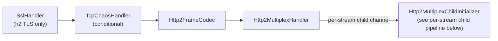

The stream-id mis-routing problems that affected the old shared-connection pipeline (issues #2419, #2667) are structurally impossible here: each stream is its own `Http2StreamChannel` child, so outbound writes never cross to another stream. The per-stream child pipeline is described in the [HTTP/2 Per-Stream Child Pipeline](#http2-per-stream-child-pipeline) section below.

#### gRPC Pipeline (over HTTP/2)

When gRPC is enabled and the `GrpcProtoDescriptorStore` has loaded services, `GrpcToHttpResponseHandler` and `GrpcToHttpRequestHandler` are appended to every per-stream child pipeline (after `MockServerHttpServerCodec`). They operate on MockServer model objects (`HttpRequest`/`HttpResponse`), not raw Netty HTTP objects. Their position within the full child pipeline is shown in the [HTTP/2 Per-Stream Child Pipeline](#http2-per-stream-child-pipeline) section; specifically:

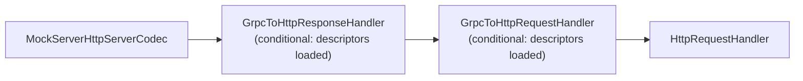

| Handler | Class | Purpose |
|---------|-------|---------|
| GrpcToHttpResponseHandler | `o.m.netty.grpc` | Outbound encoder — intercepts responses with `x-grpc-service` header, encodes JSON body back to gRPC-framed protobuf, appends `grpc-status` trailers; also converts gRPC-Web responses (trailers-in-body) when `x-grpc-web-content-type` header is present |
| GrpcToHttpRequestHandler | `o.m.netty.grpc` | Inbound handler — intercepts `application/grpc` requests, decodes protobuf body to JSON using descriptors, rewrites as `POST /<service>/<method>` with `x-grpc-*` headers; also translates `application/grpc-web*` requests to standard gRPC before processing |

h2c (HTTP/2 cleartext) is detected by `isH2cPreface()` in `PortUnificationHandler`, which checks for the HTTP/2 connection preface (`PRI * HTTP/2.0\r\n\r\nSM\r\n\r\n`). Both `switchToH2c()` and `switchToHttp2()` conditionally include gRPC handlers in the child pipeline when descriptors are loaded. The `switchToHttp()` method also adds gRPC handlers to the HTTP/1.1 pipeline to support gRPC-Web over HTTP/1.1.

#### HTTP/2 Per-Stream Child Pipeline

Every HTTP/2 stream — ordinary HTTP GET/POST/SSE, the dashboard, MCP, proxying, and gRPC — runs through a per-stream child channel initialized by `Http2MultiplexChildInitializer` (`org.mockserver.netty.unification`). The child pipeline (handler order):

```mermaid
graph LR
    CS["ConnectionScopeHandler
(copies parent attrs, then removes self)"] --> ROUTER
    ROUTER["GrpcBidiRouterHandler
(only if grpcBidiStreamingEnabled AND descriptors loaded)"] -->|"bidi gRPC stream"| BIDI[GrpcBidiStreamHandler]
    ROUTER -->|"all other streams"| SF
    CS --> SF["LenientInboundHttp2StreamFrameCodec
(lenient inbound, strict outbound)"]
    SF --> SAC["StreamAddressedContentHandler
(outbound: preserve terminal endStream)"]
    SAC --> DEC["MockServerHttpContentDecompressor
(inbound: decompress content-encoding body)"]
    DEC --> AGG["CoalescingHttpObjectAggregator
(per-stream limit, tiny frames into blocks)"]
    AGG --> CB[CallbackWebSocketServerHandler]
    CB --> DASH[DashboardWebSocketHandler]
    DASH --> MCP["McpStreamableHttpHandler
(conditional)"]
    MCP --> CODEC[MockServerHttpServerCodec]
    CODEC --> TC[TraceContextHandler]
    TC --> ALTSVC["AltSvcHeaderHandler
(conditional)"]
    ALTSVC --> GRPC_RESP["GrpcToHttpResponseHandler
(conditional)"]
    GRPC_RESP --> GRPC_REQ["GrpcToHttpRequestHandler
(conditional)"]
    GRPC_REQ --> HANDLER[HttpRequestHandler]
```

`LenientInboundHttp2StreamFrameCodec` + `HttpContentDecompressor` + `HttpObjectAggregator` re-aggregate inbound stream frames into `FullHttpRequest` objects, so the downstream handler chain sees the same objects regardless of whether the stream carries ordinary HTTP, SSE, MCP, or gRPC. The aggregator (`HttpObjectAggregators.streamHttpObjectAggregator`, a `CoalescingHttpObjectAggregator`) gets a tenth of the HTTP/1.1 component limit, at least 1,024, because one connection carries up to 100 streams, and copies runs of DATA frames under 1 KiB into 16 KiB blocks so a body of tiny frames is copied about once instead of being consolidated whole at every limit (see [memory-management.md → Direct-memory limit](memory-management.md#direct-memory-limit)). The decompressor and the codec's lenient-inbound/strict-outbound header handling (see the notes below) ensure behavioural parity with the HTTP/1.1 path.

**Connection-scoped attributes (`ConnectionScopeHandler`).** An `Http2StreamChannel` child does **not** inherit its parent connection channel's attribute map (`AbstractHttp2StreamChannel` delegates `localAddress()`/`remoteAddress()` to the parent, but not attributes). Every downstream handler reads connection-scoped state from `ctx.channel()` — which on a child is the stream channel — so `ConnectionScopeHandler` is installed as the **first** handler of every child pipeline (before `GrpcBidiRouterHandler`, omitted from the diagram) and copies the connection-scoped attributes from the parent once, then removes itself. It references each owning class's `public` `AttributeKey` constant directly (single source of truth), so the list stays in lockstep with the readers. The copied attributes are exactly (`ConnectionScopeHandler.CONNECTION_SCOPED_ATTRIBUTES`): `LOCAL_HOST_HEADERS`, `PROXYING`, `REMOTE_SOCKET`, `HTTP2_ENABLED`, `TLS_ENABLED_UPSTREAM`, `TLS_ENABLED_DOWNSTREAM`, `NETTY_SSL_CONTEXT_FACTORY`, `NEGOTIATED_APPLICATION_PROTOCOL`, `UPSTREAM_SSL_HANDLER`, `UPSTREAM_SSL_ENGINE`, `UPSTREAM_CLIENT_CERTIFICATES` and `SNI_HOSTNAME` — i.e. every attribute set on the connection channel during port unification / TLS handshake / proxy detection that a child-pipeline handler reads. (`HTTP_ENABLED` and `TRANSPARENT_ORIGINAL_DST_RESOLVED` are read only by connection-level handlers and are excluded; `TRACE_CONTEXT`, `WS_REGISTRY_KEY` and the CORS attributes self-initialise on the child.) Without this, `SniHandler.getALPNProtocol` (protocol detection / stream-id capture / `withProtocol(HTTP_2)` matching), `PortUnificationHandler.isHttp2Enabled` (the WebSocket-over-HTTP/2 `501` gate), `SniHandler.retrieveClientCertificates` (mTLS control-plane auth), and `HttpRequestHandler.isProxyingRequest` / `HttpActionHandler.getRemoteAddress` (proxied-forward routing — the proxying flag *and* the remote target) all misbehave on multiplexed streams (GitHub issue #2669). This mirrors the forward-client side, where `Http2ForwardStreamChildInitializer` copies `EXPECT_STREAMING_RESPONSE` onto its stream children for the same reason.

**Transport timers (metrics only).** When `metricsEnabled` is on, `Http2MultiplexChildInitializer` adds an `Http2StreamTransportTimer` right after `ConnectionScopeHandler`, ahead of the frame-to-HTTP codec, so it sees the stream's raw HEADERS/DATA frames and the `endStream` flag; `PortUnificationHandler.switchToHttp` adds an `HttpTransportTimer` after `HttpServerCodec` and the chunk-line limiter's after-codec handler (after `HttpExchangeTracker` when both are present). Both feed `mock_server_request_transport_duration_seconds` and are pass-throughs for the messages themselves; with metrics off neither is installed. See [metrics.md](metrics.md#transport-inclusive-request-latency-histogram).

**SSE / HTTP streaming (`StreamAddressedContentHandler`).** On any HTTP/2 path `getStreamId()` is non-null, so `HttpSseResponseActionHandler` and other streaming writers wrap each per-event chunk and the terminal frame in a `StreamAddressedHttpContent`. Without a consumer of that wrapper the `Http2StreamFrameToHttpObjectCodec` would see only the bare `HttpContent` branch, which emits `DefaultHttp2DataFrame(content, endStream=false)` — hard-coding the flag and **silently discarding the terminal frame's `endStream=true`**. The stream would never close and the client would hang until it timed out, with nothing logged. `StreamAddressedContentHandler` (a stateless `@Sharable` outbound handler, `INSTANCE`, installed immediately after the codec so outbound writes reach it *before* the codec) translates the wrapper into the `HttpObject` subtype the codec maps correctly: a terminal frame becomes a `DefaultLastHttpContent` (which `encodeLastContent` emits with `endStream=true`, even for an empty buffer, via its `needFiller` branch) and a non-terminal chunk becomes a plain `DefaultHttpContent`. The buffer transfers to the new carrier with no retain/release. On the child channel the stream id is implicit (the channel *is* the stream), so only the `endStream` flag needs preserving (GitHub issue #2669). `HttpObjectAggregator` is inbound-only, so inserting the handler before it does not affect inbound aggregation.

**Request-body decompression (`MockServerHttpContentDecompressor`).** Every HTTP/2 stream passes through this child pipeline, including ordinary HTTP requests with a compressed body (`content-encoding: gzip`/`deflate`/`br`/…). Without a decompressor the request body would reach the matchers still compressed (with `content-encoding` intact) and a `withBody(...)` expectation would silently fail to match — MockServer would answer `404`. A `MockServerHttpContentDecompressor` (Netty's `HttpContentDecompressor` with raw-block Snappy support) is installed between the codec and the aggregator, mirroring the HTTP/1.1 path (`switchToHttp` adds it before its aggregator). It sits *after* `StreamAddressedContentHandler` so that outbound-only handler stays immediately adjacent to the codec on writes (the decompressor is inbound-only — a pass-through on the outbound path), and *before* the aggregator so the body is decompressed before aggregation. It is inert for gRPC, whose message compression is carried by `grpc-encoding` (handled in `GrpcFrameCodec`), not `content-encoding` (GitHub issue #2669).

**Per-connection codec mappers (`MockServerHttpServerCodec`).** Every stream gets its own `MockServerHttpServerCodec` (it is not `@Sharable`, and its decoder carries per-channel read state), but the request and response mappers inside it — `FullHttpRequestToMockServerHttpRequest` and `MockServerHttpResponseToFullHttpResponse` — are built once per HTTP/2 connection and reused by all of that connection's streams. They are held in an attribute on the **parent** connection channel, created on the first stream, and never shared between connections. They therefore live as long as the connection — 300–400 bytes plus the header memo (see [memory-management.md](memory-management.md#header-sharing-across-a-connections-requests)) retained per connection that has opened a stream — so a small rise in `Http2ConnectionMemoryBenchmark`'s notify-only `bytes_per_connection` from this change is expected, not a regression. Sharing is safe because the mappers' only mutable state is touched only from the connection's event loop, which every stream child of that connection runs on: the request mapper's memoised local/remote address strings, keyed on the connection's (stable) address instances; its `JDKCertificateToMockServerX509Certificate`'s `lastExtractedChain`, the fields extracted from the connection's client certificate chain, reused while the same `Certificate[]` is handed over; and its memo of the previous request's header wrappers, which lets an equal header name or value reuse one immutable `NottableString` across the connection's requests. Only `Http2StreamChannel` children share; any other channel handed to `installReAggregatingChain` gets fresh mappers.

**Split header validation (`LenientInboundHttp2StreamFrameCodec`).** Netty's `Http2StreamFrameToHttpObjectCodec` carries a single `validateHeaders` flag that governs conversion in **both** directions, but this pipeline needs the two directions to differ, so the codec is a small subclass, `LenientInboundHttp2StreamFrameCodec`.

*Inbound (lenient).* The subclass calls `super(true, false)` — the *first* base argument is `isServer`, the *second* is `validateHeaders`. Passing only `(true)` would leave `validateHeaders` at its default `true`, so the HTTP/1-object conversion (`HttpConversionUtil.toHttpRequest`) would reject request header values that are legal in an HTTP/2 field but illegal under the stricter HTTP/1 value rules (a leading space, an embedded `DEL`/`0x7F`, other control characters), resetting the stream with `RST_STREAM(PROTOCOL_ERROR)` before the request ever reached the matchers. Setting the flag to `false` lets a mock server record and match the malformed traffic users deliberately send to test their clients.

*Outbound (strict).* That same `false` flag would also relax the codec's *outbound* response-header conversion (`HttpConversionUtil.toHttp2Headers`), silently disabling response- and trailer-header **name** validation. The subclass overrides `encode` to re-assert it: before delegating to `super.encode`, it runs the exact conversion the base class would run with validation on — `toHttp2Headers(msg, true)` for a response head and `toHttp2Headers(trailingHeaders, true)` for non-empty trailers (e.g. gRPC `grpc-status`/`grpc-message`) — and discards the result, letting it throw the same `Http2Exception` the strict path throws. This costs one extra header conversion per response head, which is deliberate and keeps the rule faithful to Netty rather than re-implementing the RFC token check by hand. Only header **names** are validated, never values: the base class builds outbound headers with the 2-arg `DefaultHttp2Headers(validate, arraySizeHint)` constructor, which installs a name validator when `validate` is true and no value validator either way. (The separate 3-arg `DefaultHttp2Headers(validate, validateValues, arraySizeHint)` constructor *can* install a value validator, but the codec does not use it.) Per-chunk `HttpContent` carries no headers and is not validated (GitHub issue #2669).

**Server-streaming:** `GrpcStreamResponseActionHandler` writes raw Netty HTTP objects (`DefaultHttpResponse`, per-message `DefaultHttpContent`, `DefaultLastHttpContent` with grpc-status/grpc-message trailers) directly to the `ChannelHandlerContext`. On the multiplex path, `Http2StreamFrameToHttpObjectCodec` is bidirectional and converts these outbound objects to HTTP/2 stream frames: initial HEADERS (with `Transfer-Encoding: chunked` automatically stripped by `HttpConversionUtil`), per-message DATA frames (byte-for-byte identical gRPC framing), and a trailing HEADERS frame with `grpc-status`/`grpc-message` and `endStream=true`. The `MockServerHttpServerCodec` encoder and `GrpcToHttpResponseHandler` do not intercept raw Netty objects (they only match `org.mockserver.model.HttpResponse`), so the objects pass through cleanly. No production code changes were needed -- the codec handles everything correctly.

| Property | Default | Env var | System property |
|----------|---------|---------|-----------------|
| `grpcBidiStreamingEnabled` | `false` | `MOCKSERVER_GRPC_BIDI_STREAMING_ENABLED` | `mockserver.grpcBidiStreamingEnabled` |

`grpcBidiStreamingEnabled` controls **bidi routing only** — when `false`, the per-stream child pipeline still runs for all HTTP/2 traffic but `GrpcBidiRouterHandler` is not installed and every stream takes the re-aggregating chain directly. The multiplex pipeline itself is unconditional since issue #2669.

**Client-streaming (collect-then-respond):** For client-streaming RPCs, a client sends HEADERS followed by N DATA frames (each containing a gRPC length-prefixed message) then END_STREAM. `LenientInboundHttp2StreamFrameCodec` + `HttpObjectAggregator` re-aggregate all DATA frame bytes into a single `FullHttpRequest` body (byte-for-byte concatenation). `GrpcToHttpRequestHandler.convertGrpcRequest()` then decodes the concatenated body via `GrpcFrameCodec.decode()` into N messages, producing a JSON array body with the `x-grpc-client-streaming: true` header. Single-message requests (unary) decode as a single JSON object with no client-streaming header, preserving the distinction. No production code changes were needed — the existing re-aggregation + decode pipeline handles this correctly.

Phase 3 will add true interleaved/reactive bidirectional streaming by removing the inbound re-aggregation and handling individual DATA frames with per-inbound-message reactive responses.

#### TLS Pipeline

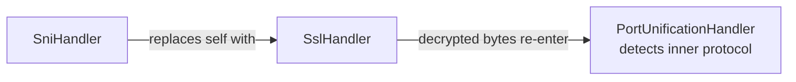

`SniHandler` (in `mockserver-core`) extends Netty's `AbstractSniHandler`. It extracts the hostname from the TLS ClientHello SNI extension, dynamically generates a certificate with that hostname as a Subject Alternative Name, and negotiates ALPN (HTTP/1.1 or HTTP/2). When the cached server context is still valid the lookup completes on the event loop; only a context that must be (re)built is provisioned on the `mockserver-ssl-context-*` pool (see [tls-and-security.md](tls-and-security.md#dynamic-certificate-generation)).

#### SOCKS4 Pipeline


#### SOCKS5 Pipeline


SOCKS5 is multi-phase: initial handshake → optional password auth → CONNECT command.

## Outbound Buffering and Backpressure

**A slow reader holds at most about 64 KB of its response in MockServer's outbound buffer, on HTTP/1.1
and HTTP/2, but not through a CONNECT or SOCKS tunnel.** Netty's write-buffer water mark does not limit memory on its own: a write always lands in
the channel's outbound buffer, and the mark only changes what `isWritable()` reports. So the bound comes
from the code that waits for writability, and each protocol has its own:

| Path | What waits for writability | Per-connection outbound data for a slow reader |
|------|----------------------------|-----------------------------------------------|
| HTTP/1.1 response | `PacedLargeWriteHandler` (a `ChunkedWriteHandler`) sends an encoded buffer over 64 KB in 32 KB slices while the connection is writable | About one slice plus the 32 KB high-water mark |
| HTTP/2 response | Netty's `DefaultHttp2RemoteFlowController` writes at most `max(bytesBeforeUnwritable(), 32 KB)` of DATA per pass, and nothing while the connection is unwritable | About 64 KB by Netty's design (not measured here); the rest of the body waits in the flow controller as slices of the original buffer |
| WebSocket proxy passthrough | `FrameRelayHandler` turns the peer's `autoRead` off while the channel it writes to is unwritable | What one read of the peer brought in |
| Streaming forward (`StreamingResponseRelayHandler`) | Reads the upstream again only once the decoded bytes not yet written have drained to min(64 KiB, `maxResponseBodySize` / 4); past `maxResponseBodySize` the stream is aborted | The watermark plus one upstream read, decoded |
| CONNECT / SOCKS tunnel | The relay aggregates each response from the loopback server before writing it to the client; a streamed one is relayed piece by piece, its loopback reads stopped above min(256 KiB, `maxRequestBodySize` / 2) unwritten until the backlog halves, and the stream aborted above `maxRequestBodySize` | The whole response; a streamed one, about 256 KiB plus one read |

**Why the body, and why direct memory.** An HTTP/1.1 response body is a heap buffer (usually the
expectation's own bytes). The NIO and epoll transports copy a heap buffer into a direct buffer when it is
written, so before `PacedLargeWriteHandler` every client still reading a large response held a direct
copy of the whole body: 40 clients reading an 8 MB body slowly held 340 MB of direct memory in a 1 GB
container, and the same load killed a 512 MB container. The handler bounds the copy to one slice.

**Why it sits below the codec.** `PacedLargeWriteHandler` is between the socket-side handlers (TLS, TCP
chaos) and `HttpServerCodec`, so it sees encoded bytes. The bytes on the wire are unchanged (a `HEAD`
response or a `Transfer-Encoding: chunked` one is framed by the codec before pacing), and anything written
after a paced body queues behind it in order — including the raw bytes `HttpErrorActionHandler` writes
from the codec's context. It paces only while `HttpServerCodec` is in the pipeline: a WebSocket upgrade
removes the codec, and from then on frames go straight to the outbound buffer, where the WebSocket
relay's backpressure can see them. When a connection becomes a CONNECT or SOCKS tunnel, `HttpConnectHandler` / `SocksConnectHandler` remove it along with the HTTP codecs. (`ChunkedWriteHandler` does not count what it queues as pending
outbound bytes, so a frame queued behind a paced write would be invisible to that backpressure.)

**Bodies up to 64 KB are not paced.** They pass through with one `instanceof` and a size check. A body
between the high-water mark and 64 KB still lands in the outbound buffer whole, as before.

## Streaming Relay

When `streamingResponsesEnabled` is `true` (default), the `HttpObjectAggregator` in the **forward-path client pipeline** (inside `NettyHttpClient`) and in the relay pipelines inside `RelayConnectHandler` is replaced by `StreamingAwareHttpObjectAggregator`.

`StreamingAwareHttpObjectAggregator` is a subclass of `HttpObjectAggregator`, by way of `CoalescingHttpObjectAggregator` (`mockserver-core` `org.mockserver.codec`): past its component limit it merges only the pieces added since its last merge, and on upstream-opened HTTP/2 streams it also copies runs of tiny frames into blocks. It inspects the first response head and switches to streaming when **either** signal is present:

- **Response says so** — `Content-Type: text/event-stream`.
- **The client asked for a stream** — `NettyHttpClient` sets an `EXPECT_STREAMING_RESPONSE` channel attribute when the forwarded *request* declares streaming intent (an `Accept: text/event-stream` header, or a JSON body with `"stream": true`). This covers streaming backends that omit the content type — notably the OpenAI **Codex** backend used by the opencode CLI (`chatgpt.com/backend-api/codex/responses`), whose SSE response carries **no content type at all**. Without it MockServer would aggregate the whole (10–30s) response before sending any headers, and the client would time out waiting for response headers.

Then:

- **Non-streaming** (neither signal): delegates to `super` — behaviour is byte-for-byte identical to before. Ordinary chunked responses without an SSE content type or a streaming request are always aggregated normally. `DISABLE_RESPONSE_STREAMING` (set for a **body-affecting** `FORWARD_REPLACE` response modification — see below) wins over both signals.
- **Streaming**: removes itself from the pipeline and installs `StreamingResponseRelayHandler` in its place, positioned before `MockServerHttpClientCodec`. It also removes the per-request `ReadTimeoutHandler` (sized from `maxSocketTimeout`, ~20s, armed on non-pooled channels) so the longer stream-appropriate idle bound (`streamIdleTimeoutSeconds`, default 60s) governs — a streaming LLM response can legitimately pause longer than 20s between chunks. The relay handler then processes unaggregated `HttpObject` events.

The request-intent (`EXPECT_STREAMING_RESPONSE`) signal is threaded onto **all three** upstream paths, so a content-type-less streaming backend (e.g. the OpenAI **Codex** endpoint) is relayed incrementally regardless of which one it takes:

| Path | Where intent is set | Aggregator |
|------|---------------------|------------|
| HTTP/1.1 forward action | `NettyHttpClient` (bootstrap / pooled-channel attribute) | `StreamingAwareHttpObjectAggregator` on the h1 client pipeline |
| HTTP/2 forward action | `NettyHttpClient` sets it on the parent channel; `Http2ForwardStreamChildInitializer` copies it to the per-stream child (child channels do not inherit parent attributes) | `StreamingAwareHttpObjectAggregator` on the h2 stream child pipeline |
| Transparent CONNECT relay | `UpstreamProxyRelayHandler` sets it per-request on the loopback channel from `requestExpectsStreamingResponse(request)` | `StreamingAwareHttpObjectAggregator` in `relayOnly` mode on the loopback pipeline (`RelayConnectHandler.configureHttp1LoopbackPipeline`) |

> **`FORWARD_REPLACE` and streaming.** `DISABLE_RESPONSE_STREAMING` is set only when the response modification actually needs the fully-buffered body — a body/schema response override, a JSON body patch/merge-patch modifier, or a response template. A **header-only** modification (status / headers / cookies, no body change) is applied to the streamed response **head** while the body chunks are relayed untouched, so it does **not** disable streaming. This means a header-only rewrite (adding a CORS or trace header) on an SSE / LLM upstream keeps streaming intact. See `HttpOverrideForwardedRequestActionHandler.isHeaderOnlyResponseModification`.

### StreamingResponseRelayHandler

`StreamingResponseRelayHandler` (`mockserver-core` `org.mockserver.httpclient`) is a `ChannelInboundHandler` that consumes the raw `HttpObject` stream from the upstream server:

| Event | Action |
|-------|--------|
| `HttpResponse` (head) | Builds a head-only `org.mockserver.model.HttpResponse` with a `StreamingBody` sink. Completes `RESPONSE_FUTURE` immediately. |
| `HttpContent` | Forwards the chunk to the downstream (client) channel. Appends to `StreamingBody` capture buffer (bounded to `maxStreamingCaptureBytes`). If the chunk takes the bytes not yet written to the client past the aggregator's `maxContentLength` (`maxResponseBodySize`), `StreamingBody` refuses it and fails the stream, and the handler logs a `WARN` and closes the upstream; the rest of that read is released as it is decoded. |
| `LastHttpContent` | Closes the sink. Signals `HttpActionHandler` to write the `FORWARDED_REQUEST` log entry using the captured bytes. |
| `channelInactive` (mid-stream) | Calls `onError` on the sink with `StreamAbortedException`, so the client's response ends incomplete. Emits a `FORWARDED_REQUEST` log entry flagged as truncated/aborted. A body the upstream delimits by closing its connection reaches here already complete (the codec emits its `LastHttpContent` first). |
| Failed decoder result (invalid framing) | `StreamedResponseDecoderResultGuard`, installed before the decompressor in streaming mode, fails the stream with `StreamAbortedException` and drops the rest of the message, since a decompressor would turn the failed last content into a clean end. |

An `IdleStateHandler(0, 0, streamIdleTimeoutSeconds)` is added to the streaming channel so stalled streams are detected without the fixed global socket timeout cutting live streams. Its `StreamIdleTimeoutHandler` ignores the idle event while upstream reads are withheld because more than the watermark waits for the client (`StreamingBody.isAwaitingClient()`), and otherwise fires `StreamingBody.IdleTimeoutException` and closes the channel, so the client's response ends incomplete.

### StreamingBody

`StreamingBody` (`mockserver-core` `org.mockserver.model`) is a chunk sink used to bridge the Netty handler with `HttpResponse`. It holds:

- A `subscribe(onChunk, onComplete, onError)` API consumed by the server-side `NettyResponseWriter` to write chunks to the downstream client.
- A bounded byte capture buffer (`capturedBytes()`) with a `truncated` flag.
- An optional bound on chunk bytes added but not yet written: a writer reports each chunk written (or discarded) with `chunkWritten(bytes)`, which requests the next upstream read once the backlog is at or below min(64 KiB, bound / 4); a chunk that passes the bound fails the stream with `UnwrittenBytesLimitExceededException`, and the writer then closes or resets the client stream instead of writing the terminating chunk.

The server-side `NettyResponseWriter` checks `response.getStreamingBody() != null` and, when true, writes a `DefaultHttpResponse` head followed by `DefaultHttpContent` frames per chunk and `LastHttpContent.EMPTY_LAST_CONTENT` at stream end — mirroring the existing `HttpSseResponseActionHandler` pattern.

## Response Trailers (Trailing Headers)

A `HttpResponse` can carry **general HTTP trailers** (trailing headers) via
`withTrailers(...)` / `withTrailer(name, values...)`, serialised in JSON as a `trailers`
object that mirrors `headers`. When present they are emitted as protocol-appropriate
trailing headers; when absent (null/empty — the default) the response is byte-for-byte
identical to before.

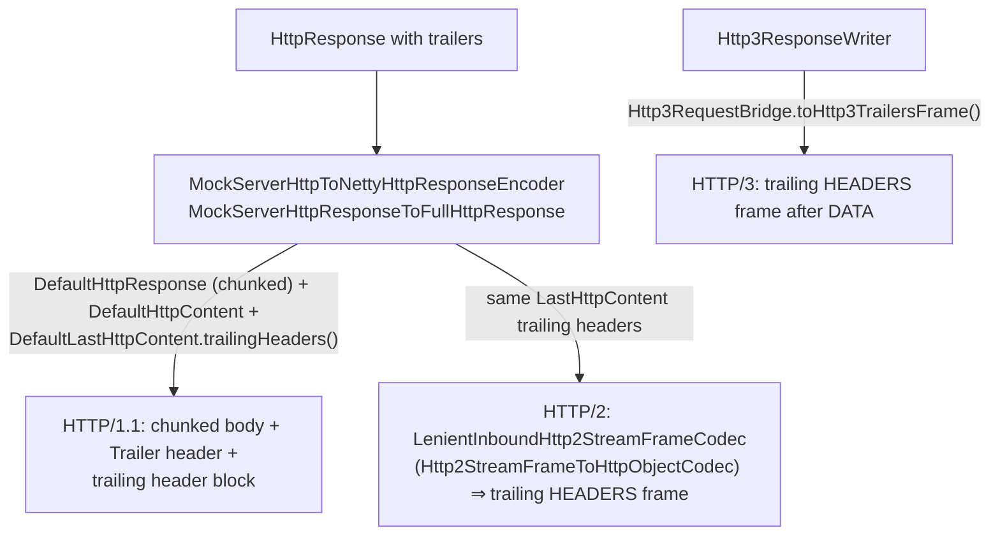

| Protocol | Where | How trailers are emitted |
|----------|-------|--------------------------|
| HTTP/1.1 | `MockServerHttpResponseToFullHttpResponse.mapResponseWithTrailers()` (`mockserver-core`) | Emits a `DefaultHttpResponse` head with **chunked** transfer-encoding and an automatic `Trailer` header listing the field names (RFC 9110 §6.5.1), the body as `DefaultHttpContent`, and a `DefaultLastHttpContent` whose `trailingHeaders()` carry the trailers. A body-less status (204/304/HEAD) yields an empty `LastHttpContent` that still carries the trailers. Trailers **force chunked encoding**: RFC 7230 §3.3.1 makes a fixed `Content-Length` and chunked transfer-encoding mutually exclusive, and Netty's `HttpObjectEncoder` only writes the trailing-header block while in its chunked state — so any explicit `Content-Length` (and `contentLengthHeaderOverride`) is **dropped** from a trailer-carrying HTTP/1.1 response. Streaming-body responses (`NettyResponseWriter.writeStreamingResponse`) are already chunked and emit the same trailing-header block on a `DefaultLastHttpContent` at stream completion. |
| HTTP/2 | `Http2StreamFrameToHttpObjectCodec` (via `LenientInboundHttp2StreamFrameCodec` in the per-stream child pipeline) | Strips transfer-encoding and converts the same `LastHttpContent.trailingHeaders()` into a trailing HEADERS frame with `endStream=true`. No MockServer-specific wiring is needed beyond the HTTP/1.1 mapping. |
| HTTP/3 | `Http3ResponseWriter` + `Http3RequestBridge.toHttp3TrailersFrame()` (`mockserver-netty`) | After the DATA frame(s), a trailing `Http3HeadersFrame` is written before the QUIC stream output is shut down — for both static and streaming responses. Field names are lower-cased per HTTP/2/3 conventions. |
| Servlet (WAR) | `MockServerHttpResponseToHttpServletResponseEncoder.setTrailers()` (`mockserver-core`) | Sets `HttpServletResponse.setTrailerFields(...)`; the container handles framing. The Servlet API models one string value per name, so multi-valued trailers are joined with `", "` (HTTP list semantics) and duplicate names collapse to the last write — a WAR-path-only limitation. |

### Precedence vs gRPC trailers

gRPC responses carry their own status trailers (`grpc-status` / `grpc-message`), built by the
gRPC layer independently of the general-trailer field:

- On the **gRPC HTTP/2 path** (`GrpcToHttpResponseHandler`) the gRPC status is set as a
  response header on a cloned `HttpResponse`; the gRPC writers (`Http3GrpcResponseWriter`,
  `GrpcStreamResponseActionHandler`) build the trailing HEADERS frame directly from
  `grpc-status`/`grpc-message`.
- The gRPC writers do **not** read the general `trailers` field, so on a gRPC response general
  trailers are simply **not emitted** — there is no name collision to resolve, because the
  general-trailer block is never produced on the gRPC path.

ByteBuf safety: the trailer path keeps the body buffer's refcount at exactly one across all
branches — it is handed to a `DefaultHttpContent` only when non-empty and released in a
`finally` otherwise (and on any exception between allocation and transfer), and a body-less
response attaches an empty `Unpooled.EMPTY_BUFFER` `LastHttpContent`. The existing chunk-delay
and HTTP/3 writer paths retain/release as before.

## HTTP/2 Extension Header Stripping

**Invariant: every mapper that decodes an HTTP/2 upstream response must strip the entire `x-http2-*` extension-header family before the response enters the MockServer model.**

Netty's `InboundHttp2ToHttpAdapter` injects synthetic `x-http2-*` headers — `x-http2-stream-id`, `x-http2-scheme`, `x-http2-path`, `x-http2-stream-dependency-id`, `x-http2-stream-weight`, `x-http2-stream-promise-id` — when it converts an HTTP/2 frame sequence into a `FullHttpResponse`. These are internal Netty plumbing, not real response headers. If they escape into the response model and are later serialised back onto an outbound HTTP/2 connection, the upstream stream id (`x-http2-stream-id`) is written on a foreign stream. The HTTP/2 peer sees a HEADERS frame carrying a stream id that does not match any open stream on the write-back channel and responds with a connection-level PROTOCOL_ERROR / GOAWAY, hanging both legs of the proxy.

### Where the strip happens

| Site | Class / method | What is stripped |
|------|----------------|-----------------|
| Upstream response decode | `FullHttpResponseToMockServerHttpResponse.setHeaders()` (`mockserver-core`) | All six `ExtensionHeaderNames` values in the static `HTTP2_EXTENSION_HEADER_NAMES` set are excluded during header iteration. The same set is re-checked when folding in HTTP trailers (`trailingHeaders()`), so neither the header block nor the trailer block can carry these names into the model. |
| Write-back to client | `MockServerHttpResponseToFullHttpResponse` (`mockserver-core`) | Belt-and-braces: `response.headers().remove(STREAM_ID.text())` is called unconditionally before the outbound stream id is set from the protocol-guarded `HttpResponse.getStreamId()` field. This prevents a foreign upstream stream id from leaking onto the write path even if an upstream stripping step is bypassed. |

`HTTP2_EXTENSION_HEADER_NAMES` is built once from `HttpConversionUtil.ExtensionHeaderNames.*` at class load time and stored as a `Set<String>` of lower-cased names for O(1) lookup.

### Inbound request path

On the **inbound request** side, `FullHttpRequestToMockServerHttpRequest` does not strip `x-http2-stream-id` during header iteration — instead it reads the value with `headers().getInt(STREAM_ID.text())` and places it in the trusted `HttpRequest.streamId` field only when `request.getProtocol() == HTTP_2` (preventing an HTTP/1.1 client from forging it). Forwarded requests never carry `x-http2-*` into upstream headers because `MockServerHttpRequestToFullHttpRequest` re-derives the outbound stream id from `request.getStreamId()` directly, not from the header map.

## Connection-Lifecycle Response-Path Faults

These faults fire at response/dispatch time (not connect time) and are distinct from
the connect-time `TcpChaosHandler` faults. They are implemented in `NettyResponseWriter`
and `Http2GoAwayEmitter`, and gated by `HttpRequestHandler`'s L6 cordon check.

### Hot-path guarantee

`NettyResponseWriter.resolveLifecycleProfile(HttpRequest)` resolves the host-scoped
`TcpChaosProfile` keyed on the request `Host` header. It returns `null` immediately when:

1. `ConfigurationProperties.connectionLifecycleChaosEnabled()` is `false`, OR
2. `TcpChaosRegistry.getInstance().activeCount() == 0` (a single volatile read)

When either condition holds the normal write-and-close path is taken byte-for-byte
unchanged. There is no allocation and no additional branching on the hot path in the
common (no-lifecycle-chaos) case.

### L1 — Mid-response RST (`resetMidResponse`)

`NettyResponseWriter.writeHeadThenReset()` writes the response head via `ctx.writeAndFlush(response)`,
then on the write-complete future calls `forceReset()`, which sets `SO_LINGER 0` and calls `close()` —
the same proven RST mechanism as `TcpChaosHandler` (zero linger makes the close emit a TCP RST rather
than a FIN). The client sees "connection reset" while reading the body — the "server crashed mid-reply"
fault.

**HTTP/2 multiplex parent walk.** On the multiplex pipeline (`Http2FrameCodec` + `Http2MultiplexHandler`)
the response head is written on a per-stream `Http2StreamChannel` child channel, where setting
`SO_LINGER` does nothing at all (`DefaultChannelConfig.setOption` returns `false` for an unknown option
rather than throwing, so there is not even an exception to notice) and `close()` only emits
`RST_STREAM` for that one stream. Because
`resetMidResponse` exists to simulate a genuine socket abort, `forceReset()` walks up from an
`Http2StreamChannel` to its **parent connection channel** (the same parent-walk pattern
`Http2GoAwayEmitter` uses) and forces the RST there, aborting the whole TCP connection and every
concurrent stream on it. The guard is on the `Http2StreamChannel` **type**, not on
`channel.parent() != null`: on an HTTP/1.1 accepted socket `parent()` is the server *listening* socket,
so a `parent()`-based guard would close the listening socket and shut the whole server down on the first
fault. HTTP/1.1 and connection-level HTTP/2 channels are reset directly. If `SO_LINGER 0` cannot be
applied to the resolved target the fault logs a `WARN` (the RST would otherwise silently degrade to a
clean FIN) and still closes. Per-expectation `closeSocket`/`closeChannel` (and the L2 `slowCloseDelay`)
flow through `addCloseSocketListener()` instead and stay **per-stream** — a close, not an abort — so one
expectation never tears down concurrent siblings.

When `connectionLifecycleAutoHaltCountsRst` is true (default), the RST records
`Metrics.incrementHttpChaosInjected("drop")` so a RST storm trips the auto-halt circuit-breaker.

**Streaming carve-out (v1):** these L1/L2/L3 faults are applied only in the non-streaming
`writeAndCloseSocket()` path. The streaming response path (`writeStreamingResponse`, SSE / chunked
streaming) ignores lifecycle faults in v1 and completes normally even when a host profile is registered.

**Host-scoping is not control-plane-exempt:** like `TcpChaosHandler`, these faults are keyed on the
request `Host` header and are *not* control-plane-exempt — a profile registered against the MockServer
host itself can RST a control-plane response on that host. Register lifecycle profiles against the
mocked-upstream host. (The L6 preemption cordon below *is* control-plane-exempt.)

### L2 — Host-scoped slow close (`slowCloseDelay`)

`NettyResponseWriter.addCloseSocketListener()` applies the close delay in priority order:

1. `ConnectionOptions.closeSocketDelay` (per-expectation)
2. `TcpChaosProfile.slowCloseDelay` (host-scoped, L2 — only reached when no per-expectation delay is set)
3. Immediate close (default)

This means a single `PUT /mockserver/tcpChaos` registration can make every response to a given
host linger on close without touching individual expectations.

### L3 — HTTP/2 GOAWAY on the response path (`http2GoAway`)

`Http2GoAwayEmitter.emit(ctx, lastStreamId, errorCode)` emits a connection-level GOAWAY frame
so the client stops opening new streams. It is called in `NettyResponseWriter.writeAndCloseSocket()`
before the response head is written, so the client receives the GOAWAY and can avoid opening
further streams while the current stream still completes normally.

**Implementation:** `Http2GoAwayEmitter` resolves the `Http2ConnectionHandler` via
`ctx.pipeline().context(Http2ConnectionHandler.class)` — the same lookup pattern as
`HttpErrorActionHandler.resetHttp2Stream`. A negative `lastStreamId` argument is converted to
`Integer.MAX_VALUE` and clamped down by the connection handler to the actual last-processed stream.

**HTTP/2 pipeline.** GOAWAY is a *connection-level* frame, so the emitter always writes it on the connection channel's pipeline. Because all HTTP/2 server requests run on per-stream `Http2StreamChannel` child channels (via `Http2MultiplexHandler`), the request handlers operate on a child channel whose pipeline has no connection handler — the `Http2FrameCodec` (which `extends Http2ConnectionHandler`) lives on the **parent** connection channel. The emitter walks up to `ctx.channel().parent().pipeline()` and writes the GOAWAY there. (Before issue #2669, the emitter looked only at the local pipeline and found nothing on a multiplex child channel, so the `http2GoAway` chaos and the preemption-drain GOAWAY were silently dropped.)

**HTTP/1.1 degradation:** when no `Http2ConnectionHandler` is found on the pipeline **or on the
parent connection channel** (HTTP/1.1 connection — `parent()` is null on a non-child channel),
`Http2GoAwayEmitter.emit()` returns `false` and callers degrade to `Connection: close` + 503.
GOAWAY is benign (graceful drain signal) and is NOT counted toward the auto-halt window.

### L6 — Preemption cordon check in `HttpRequestHandler`

`HttpRequestHandler.channelRead0()` checks the preemption cordon early in request processing,
before any expectation matching:

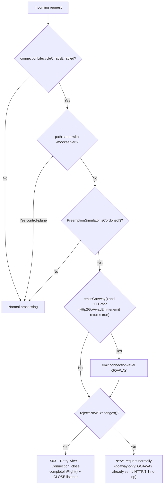

The control plane (`/mockserver/...`) is always exempt so the operator can observe state and issue
`DELETE /mockserver/preemption` to uncordon. The GOAWAY is emitted lazily on a cordoned HTTP/2
connection's next request — `Http2GoAwayEmitter.emit()` is the HTTP/2 detection (it returns `false`,
a no-op, on HTTP/1.1). The in-flight token is completed on every branch so the drain counter cannot
leak, and `GET /mockserver/preemption` reports the live in-flight count from `LifeCycle.getRequestsInFlight()`.
The `isCordoned()` probe is a single volatile read when no simulation is active, so this branch adds
nothing measurable to the hot path in the common case. GOAWAY is HTTP/2-only; HTTP/1.1 has no GOAWAY
and falls back to the 503 path (or is served normally in goaway-only mode).

## Stream-Level Error Injection (HttpError streamError)

An `HttpError` action can reset the individual request stream instead of returning a response, for
resilience testing of clients that must handle mid-stream resets. It is configured with
`HttpError.withStreamError(long errorCode)` (or the `StreamErrorCode` enum / `withStreamErrorCodeName`
convenience), serialised as a `streamError` integer. When `streamError` is null (the default) the
existing `dropConnection` / `responseBytes` behaviour is unchanged.

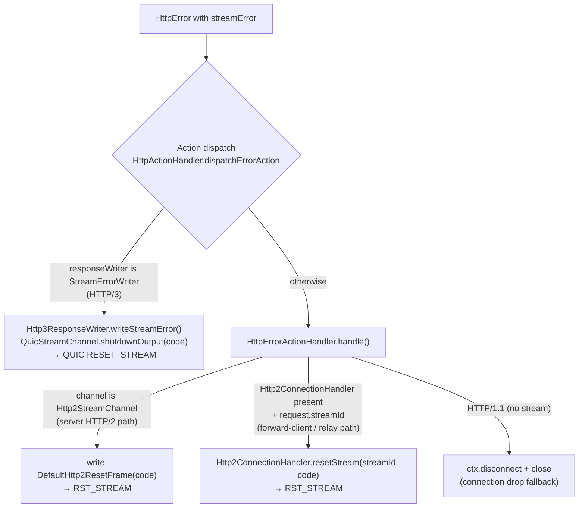

| Transport | Where | How the stream is reset |
|-----------|-------|--------------------------|
| HTTP/2 | `HttpErrorActionHandler.resetHttp2Stream()` (`mockserver-core`) | All HTTP/2 server requests arrive on a per-stream `Http2StreamChannel` child channel. `resetHttp2Stream()` writes a `DefaultHttp2ResetFrame(errorCode)` on that child channel; the parent `Http2FrameCodec` emits the `RST_STREAM`. The stream id is implicit in the child channel identity. |
| HTTP/3 | `Http3ResponseWriter.writeStreamError()` (`mockserver-netty`), reached via the `StreamErrorWriter` seam | Calls `QuicStreamChannel.shutdownOutput(errorCode)`, sending a QUIC `RESET_STREAM` for just this stream. The QUIC types live only in the netty module, so dispatch delegates through the transport-neutral `StreamErrorWriter` seam in core (mirroring the `GrpcStreamResponseWriter` pattern). |
| HTTP/1.1 | `HttpErrorActionHandler.handle()` | **No stream concept** — falls back to dropping the whole connection (`ctx.disconnect()` + `ctx.close()`), the same as the existing `dropConnection` behaviour. Documented caveat: a `streamError` on HTTP/1.1 closes the connection rather than resetting a single stream. |

`HttpActionHandler.dispatchErrorAction()` is the single funnel for the `ERROR` action (both the
early-match and main paths). It first checks whether the active `ResponseWriter` implements
`StreamErrorWriter` (the HTTP/3 case) and delegates; otherwise it hands the `HttpError` plus the
`HttpRequest` (for the stream id) to `HttpErrorActionHandler`. ByteBuf safety: the HTTP/2 reset uses
`resetStream(...)`/a single `DefaultHttp2ResetFrame` (no body buffer), and the HTTP/3 reset allocates
no buffer, so there is nothing to leak. Resetting one stream leaves the rest of the multiplexed
connection intact.

## Relay Connect Pattern

When HTTP CONNECT or SOCKS tunneling is established, MockServer uses a **self-loopback relay** rather than connecting directly to the target:

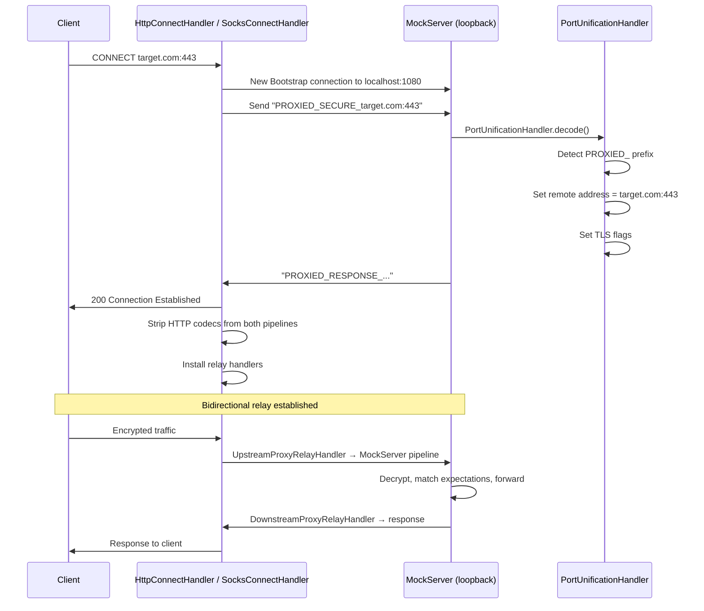

This pattern allows MockServer to:
- Intercept and log tunneled HTTPS traffic
- Match expectations against tunneled requests
- Generate dynamic TLS certificates for the target hostname

### IPv6 Support

The relay connect protocol and CONNECT handler support IPv6 addresses in bracket notation (e.g., `[::1]:443`, `[2001:db8::1]:8443`). Host:port parsing uses `HttpRequest.splitHostPort()` which correctly handles both IPv4 and IPv6 formats.

The local address detection (`calculateLocalAddresses()`) explicitly includes `127.0.0.1` and `localhost`, plus the bound interface address (via `InetAddress.getHostAddress()`), which may include IPv6 addresses depending on the network configuration. This ensures requests sent to MockServer's bound address are correctly identified as control-plane requests rather than proxy targets.

### Relay Handler Hierarchy

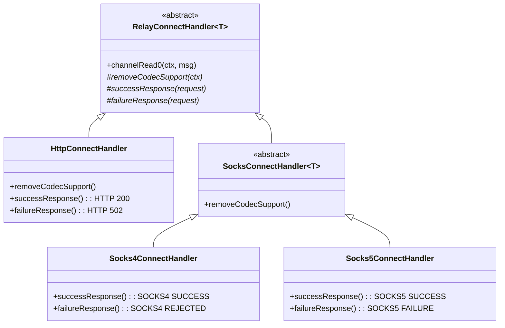

### Relay Data Flow

Once the relay is established, two handler pairs shuttle data:

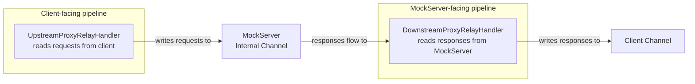

### Relay write failure

When a write to the proxy client fails because the connection has failed, `DownstreamProxyRelayHandler` ends the relay at the
first failure: it logs that failure once (`exception while returning writing`, or nothing once the proxy client's connection has closed), stops reading the loopback
with a `ChannelReadPause` hold it never releases, closes both legs, and releases whatever the loopback still delivers.
Every write already queued behind the failed one fails the same way and is not logged. Exceeding the streamed-bytes
bound (`maxRequestBodySize` of unwritten streamed content) ends the relay the same way.

The loopback's socket is closed directly and the client's leg through its pipeline (see [Relay close](#relay-close)).
One case keeps the loopback open: a client that has gone with a request still being written to the loopback. The relay
still ends, and everything the loopback delivers from then on is released unwritten, but the loopback is read until
that request has been written (see [Relay close](#relay-close)).

A failure of one HTTP/2 stream does not end the relay. When the response carries the client's stream id
(`x-http2-stream-id`, read before the write), the failure is an HTTP/2 stream error, and the proxy client's connection
is still active, only that stream is gone: its client reset it, or `Http2StreamWriteStallHandler` reset it with its
response still queued in the flow controller (`Stream closed before write could take place`). The relay logs it at
`DEBUG` and carries on reading the loopback for the other streams. Ending the relay there would answer a single
stream cut, or a client cancelling one download, with a `GOAWAY` and the loss of the whole tunnel.

Closing only the proxy client's channel, as before, was not enough (plan item #92). A channel that stays open while
refusing writes, such as a TLS engine whose `close_notify` waits behind bytes its client has not taken, never fires
the `channelInactive` that closes the loopback, so the relay kept reading and wrote every chunk into it: one cut
tunnel logged 2,500–6,300 `ERROR` entries and kept its event loop busy for up to ~41 s.

### Relay close

**Outcome:** when a tunnel ends, its loopback connection closes at once, or as soon as a request the client had
already sent has been written to it. Asked to close through its pipeline, an
`HttpToHttp2ConnectionHandler` sends a `GOAWAY` and keeps the connection open while it has active streams, for up to
Netty's graceful-shutdown timeout (30 s). On the loopback those streams have nowhere to go once the client's leg has
finished, so `RelayLegClose` closes the loopback's socket with `channel.unsafe().close(...)`, as
`WriteStallTimeoutHandler` does. The client's leg keeps its pipeline close and its `GOAWAY`.

| The relay ends because | Loopback leg | Client leg |
|---|---|---|
| A write to the client failed, or too much streamed content was waiting (`DownstreamProxyRelayHandler.endRelay`), with the client's leg still open, or with no request still being written to the loopback | socket closed at once | `close()` through the pipeline |
| The same, with the client's connection already closed and a request still being written to the loopback | left open and read, what it delivers dropped; closed as in the row below for a request still being written | already closed |
| The client's connection closed with no request still being written to the loopback (`UpstreamProxyRelayHandler.channelInactive`, or a listener on its close for a tunnel that has no relay handlers yet) | the outbound buffer is flushed, then the socket is closed | already closed |
| The client's connection closed with a request still being written to the loopback (`UpstreamProxyRelayHandler.channelInactive`) | `closeOnFlush` through the pipeline; the socket is closed when the last such write completes or fails | already closed |
| The loopback closed (`DownstreamProxyRelayHandler.channelInactive`) | already closed | open streams ended as in [Relay loopback connection loss](#relay-loopback-connection-loss-http2), then `closeOnFlush` |
| The loopback closed before the tunnel's protocol was known (`RelayConnectHandler`) | already closed | `closeOnFlush` |

Why the client's leg is not closed at its socket too: it does not wait. A write to it that fails for the whole
connection is a connection error to its `Http2ConnectionHandler`, which closes the connection with its other streams
still open (`RelayHttp2LegCloseTest`). Where the client is still taking writes, the loopback's close resets every stream that has no whole
response (`LoopbackHttp2ConnectionCloseHandler`), and the graceful close then waits only for whole responses still
being written out, which is what a healthy client is owed. An HTTP/1.1 leg has no streams to wait for. (A TLS
handler can still hold either kind of client leg open until its `close_notify` is flushed or its flush timeout
passes, as described under [Response Write-Stall Timeout](#response-write-stall-timeout).)

A client that leaves is therefore seen by MockServer as it would be on a direct connection: a request it had sent
in full is still received, but its response is not waited for. Before, an HTTP/2 loopback stayed connected until
MockServer had answered every stream, or for 30 s.

A request is received whole even when the client leaves the moment it has sent it. `UpstreamProxyRelayHandler` counts
its writes of requests to the loopback that have not completed. An HTTP/2 request body above the stream's flow-control
window (65,535 bytes by default) waits in the loopback's flow controller, not in the socket's outbound buffer, so a
socket close would fail it however the buffer was flushed first. While the count is above zero the loopback is
therefore closed through its pipeline, which goes on writing as MockServer extends the window, and the listener of
the last write to complete, or fail, closes the socket. That wait has the graceful shutdown's 30 s bound (an HTTP/1.1
loopback has none: it waits for its socket to take the request). The count
covers requests only: a response the loopback is still reading has no one to go to. The listener on the client
channel's close future acts only while the tunnel has no `UpstreamProxyRelayHandler`: it runs before
`channelInactive` and would close the socket whatever the count (`RelayHttp2LegCloseTest`,
`RelayHttp2TunnelCloseIntegrationTest`).

`endRelay` consults the count too (`UpstreamProxyRelayHandler.isWritingRequestTo`). On a tunnel carrying several
requests, a response on another stream is often still being written to the client when it leaves (queued behind the
client's flow-control window, or in the socket's buffer), or arrives just afterwards. That write fails and ends the
relay. When the client's connection has closed and a request is still being written, `endRelay` marks the relay ended
and does nothing else: the loopback stays open and is still read, because the request's DATA waits for MockServer's
`WINDOW_UPDATE`s, and each response it delivers is released without a write. `UpstreamProxyRelayHandler` then closes
the loopback exactly as if no write had failed: gracefully from `channelInactive` (the 30 s bound), and at its socket
from the listener of the last request write to complete or fail, which also covers a loopback that closes first.

| When the write to the client fails | Loopback |
|---|---|
| The client's leg is open (refusing writes, its close perhaps held behind a TLS `close_notify`) | socket closed at once, whatever is being written: that leg's `channelInactive` may never come |
| The client's connection has closed, no request being written | socket closed at once |
| The client's connection has closed, a request being written | left to `UpstreamProxyRelayHandler` |

A client leg whose own `Http2ConnectionHandler` closed it on the failed write has closed by the time `endRelay` runs,
so it counts as closed. Both orders of the client's close are handled. A socket's close fails the writes in its
outbound buffer, and lets the event loop read the loopback, before the task that fires `channelInactive` runs, so
`endRelay` can run before `UpstreamProxyRelayHandler` has seen the client leave: it therefore tests the channel, and
`channelInactive` follows and finds the count. Writes waiting in the HTTP/2 flow controller fail inside
`channelInactive`, after that handler has run. The handler is found through an attribute on the loopback channel,
since a closed channel's pipeline has been emptied. The rule does not depend on the protocol: on an HTTP/1.1 tunnel
the request still being written is one pipelined behind a response, which the loopback's socket has not yet taken
(`RelayHttp2LegCloseTest`, `DownstreamProxyRelayHandlerWriteFailureTest`, `RelayHttp2TunnelCloseIntegrationTest`).

Until the client's first bytes show which protocol the tunnel carries, neither leg has a relay handler, so each is
tied to the other's close by `RelayConnectHandler` itself. Before, a client that connected and left without sending
anything left the loopback connection open for good, and a loopback lost in that interval left the client waiting.

### HTTP/2 loopback stream ids

On an HTTP/2 relay the loopback gives each request a stream id of its own and maps it back to the client's. The
client-facing `InboundHttp2ToHttpAdapter` hands a request on only when its upload is complete, so requests reach
the loopback in the order they finish, not the order their streams opened. HTTP/2 stream ids must increase, so
reusing the client's ids (`x-http2-stream-id`) made a request that finished after a later stream open a loopback
stream below the last one: a connection error that closed the whole tunnel (plan item #68).

`LoopbackHttp2StreamIdRemapper` sits after the loopback's `HttpToHttp2ConnectionHandler`, next to
`LoopbackHttp2StreamErrorHandler` (see [Relay failure signalling](#relay-failure-signalling)). The two may be
in either order: the remapper is the only one that reads a message.

| Direction | What it does |
|---|---|
| Request written to the loopback | Gives it the next loopback stream id (the last one created plus 2, or 1), records the pair, and rewrites `x-http2-stream-id`. A second message on the same client stream reuses the pair only while the loopback stream's local side is still open, which the relay's own requests never leave it: each is written whole. Otherwise it is dropped and released, with a WARN. The relay's client-facing adapter hands each request on once (see [HTTP/2 `Expect` on the relay](#http2-expect-on-the-relay)), so this is a guard: a second HEADERS frame on a half-closed loopback stream would close the whole loopback, and one after that loopback stream has closed would have MockServer answer the request twice. To tell the second case from a new stream, the client's stream carries the mark that it was paired, so the mark goes when that stream does. A priority dependency (`x-http2-stream-dependency-id`) is translated, or dropped if it names no open stream or the stream itself |
| Response read from the loopback | Rewrites `x-http2-stream-id` back to the client's id, and marks the client's stream answered when the response is a whole final (not `1xx`) one. A response with no pair, which only a server push could produce (MockServer does not push), is dropped and released. So is a response, `1xx` included, whose client stream has ended: writing it would fail, and a failed write closes the client's connection |
| Loopback stream removed | Forgets the pair, so a long-lived tunnel holds one entry per open stream. A request whose stream was never opened (the write failed first) is forgotten at once, and its client stream marked as not relayed |

Nothing else crosses the legs with a stream id. Each leg's `Http2ConnectionHandler` does its own flow control
(`WINDOW_UPDATE`), and PRIORITY frames and SETTINGS are not relayed. A GOAWAY is not translated either: when the
loopback receives one, or closes, the client is sent a GOAWAY of its own, built from the client connection's ids
(see [Relay loopback connection loss](#relay-loopback-connection-loss-http2)). Server push is not relayed
either. The loopback never opens a stream of its own:
the remapper's ids are the only ones it uses.

### HTTP/2 `Expect` on the relay

The relay hands each HTTP/2 request on to the loopback once, with its whole body, and meets an `Expect` header
itself, as `HttpObjectAggregator` does on MockServer's own HTTP/2 streams and on an HTTP/1.1 tunnel. Netty's
`InboundHttp2ToHttpAdapter` hands a request carrying `Expect` on as soon as its headers arrive, with no body, then
again with the body, so MockServer answered the headers alone and the body was lost (plan item #71). The relay's
client-facing pipeline uses `ExpectContinueInboundHttp2ToHttpAdapter` instead. For a request whose headers do not
end the stream, it removes `Expect` and answers:

| `Expect` | `content-length` | The relay sends the client | The request |
|---|---|---|---|
| `100-continue` (any case) | absent, or at most `maxRequestBodySize` | `100` | handed on once its body is complete |
| `100-continue` | over `maxRequestBodySize` | `413`, then `RST_STREAM` `NO_ERROR` | not handed on |
| anything else | any | `417`, then `RST_STREAM` `NO_ERROR` | not handed on |

The reset after a `413` or `417` asks the client to stop uploading (RFC 9113 section 8.1), and keeps the tunnel up:
DATA already on its way for a stream left open would reach the adapter with no request to add it to, a connection
error. A request whose headers
end the stream is complete already and is handed on as it is, `Expect` included.

### Relay loopback connection loss (HTTP/2)

When the HTTP/2 loopback connection closes, for any reason, every stream the proxy client still has open is
answered at once, except a stream whose whole response has already been relayed, which is left to finish.
Before, `DownstreamProxyRelayHandler.channelInactive` closed the client connection with `closeOnFlush`, and the
client-facing `Http2ConnectionHandler` closed gracefully: it sent a `GOAWAY` and then waited up to Netty's 30 s
graceful-shutdown timeout for streams that could no longer be answered.

| Event on the loopback | What the proxy client gets |
|---|---|
| The connection closes (MockServer stopping, a TCP reset, a connection error) | a `GOAWAY`, then each open stream ended as below, then the connection closed once no stream is left |
| — a stream on which no request has been relayed | `REFUSED_STREAM`: MockServer never saw it, so a retry is safe |
| — a stream whose request was relayed but whose final response was not | `INTERNAL_ERROR`: MockServer may have acted on it |
| — a stream whose whole final response was relayed but is still queued behind the client's flow-control window | nothing: the response is written out in full |
| MockServer sends a `GOAWAY` | a `GOAWAY` (`NO_ERROR`, last stream id = the client's last stream), so new requests go to a new connection; a stream already open on the loopback above the `GOAWAY`'s last stream id is reset `REFUSED_STREAM` at once by `LoopbackHttp2StreamErrorHandler` (see [Relay failure signalling](#relay-failure-signalling)) |
| One request cannot be written to the loopback because of that stream (a stream error) | that stream reset: `REFUSED_STREAM` when Netty refused to open the loopback stream (above a received `GOAWAY`'s last stream id, or past MockServer's concurrent-stream limit), otherwise `INTERNAL_ERROR`; the loopback and the other streams carry on |

A request is relayed only once the client has sent all of it, `Expect` included (see
[HTTP/2 `Expect` on the relay](#http2-expect-on-the-relay)), so a stream still uploading has not been seen.
The handler asks `LoopbackHttp2StreamIdRemapper`, which marks each client stream it pairs with a loopback stream
(unmarking it if the loopback stream never opens), and refuses only a stream not so marked. The remapper also marks
a client stream answered when it hands on a whole final response; a `1xx` does not count, as it is handed on as
soon as it arrives. An answered stream's response is with the client's encoder in full, but the encoder writes it
only as fast as the client's flow-control window allows, so an answered stream whose local side is still open is
not reset: that would cut the response short. The client connection's graceful close waits for it, bounded by
the client handler's graceful-shutdown timeout (Netty's default 30 s) for a client that stops reading.

`LoopbackHttp2ConnectionCloseHandler` (after `LoopbackHttp2StreamIdRemapper`, before
`DownstreamProxyRelayHandler`) handles every row but the last; it runs before `DownstreamProxyRelayHandler`'s
close, which then waits only for answered streams still being written. The `GOAWAY` goes first, as RFC 9113
section 6.8 intends, so a client that retries a refused stream does not retry it on this connection.
`UpstreamProxyRelayHandler`'s write listener handles the last row, resetting on the event loop's next task: a
write can fail while the client's own `RST_STREAM` for that stream is being read, and RFC 9113 forbids answering
a reset with a reset. Before, any failed write closed the loopback, and with it every stream on the tunnel.
Only a stream error is treated as one stream's failure; any other write failure still closes the loopback.
Closing the client connection with a zero graceful timeout instead would have ended the streams with no
per-stream signal, so a client could not tell a request safe to retry from one MockServer may have acted on.
The HTTP/1.1 loopback is unchanged: closing an HTTP/1.1 client connection is immediate.

### Relay Protocol Selection (HTTP/1.1 vs HTTP/2)

`RelayConnectHandler.configurePipelines()` builds both relay pipelines to match the protocol
negotiated with the proxy client (`http2EnabledDownstream`, derived from the proxy-client TLS
ALPN result):

- the **client-facing** pipeline uses an `HttpToHttp2ConnectionHandler` when the client negotiated
  HTTP/2, otherwise an `HttpServerCodec` inside an `HttpChunkLineLimiter` (see
  [Chunk-size line limit](#chunk-size-line-limit));
- the **internal loopback** pipeline mirrors that choice — a client-mode `HttpToHttp2ConnectionHandler`
  for HTTP/2, otherwise an `HttpClientCodec` — and its client TLS context advertises `h2` via ALPN
  only when the loopback codec is HTTP/2.

Keeping the loopback's TLS layer and codec in agreement makes the relay a transparent passthrough.
Before this was fixed, the loopback hard-wired an HTTP/1.1 codec while its TLS could negotiate
`h2`, so HTTP/2 requests through the CONNECT proxy were never decoded and hung (#2260).

**Reading the ALPN result requires the relay to own the proxy-client TLS.** `configurePipelines()`
runs when the loopback's `PROXIED_RESPONSE_` reply arrives — and for **both** the `CONNECT` and SOCKS
proxies that is *before* the client has sent its TLS `ClientHello` (a client sends nothing on the tunnel
until it has received the `CONNECT` `200`/SOCKS success reply), so the ALPN protocol is not yet known at
that moment. The relay therefore terminates the proxy-client TLS itself and defers `configurePipelines()`
until that handshake completes. The shared logic lives in `terminateClientTlsThenConfigure(...)`: it
removes any leftover `PortUnificationHandler`, installs a server `SslHandler`, and calls
`configurePipelines()` from the handshake-completion listener with the negotiated ALPN protocol.

Neither proxy can know the tunnelled protocol at that moment — the client sends its `ClientHello`, its
h2c prior-knowledge preface, or a plaintext HTTP/1.1 request only *after* the reply — so **neither guesses**
(not from the destination port, and not by assuming TLS). Both mark the tunnel with `deferTlsDetection(...)`
— `SocksProxyHandler.forwardConnection` for SOCKS, `HttpRequestHandler`'s `CONNECT` branch for `CONNECT`
(which previously assumed TLS and installed an `SslHandler` up front, downgrading a cleartext `h2c` tunnel
to HTTP/1.1 and breaking a plaintext HTTP/1.1 tunnel outright — #2683) — and the relay classifies the first
tunnelled bytes. When the reply has been written, the relay removes the leftover byte-driven handlers (the
`PortUnificationHandler` — which would otherwise re-detect TLS and race a second `SniHandler` — and, on the
SOCKS path, the spent SOCKS command decoder) and installs a one-shot `RelayTlsDetectionHandler` (a
`ByteToMessageDecoder` mirroring Netty's `OptionalSslHandler`). On the first ≥5 bytes it calls
`SslHandler.isEncrypted(...)`. A TLS record routes into `terminateClientTlsThenConfigure(...)` (so `h2` vs
HTTP/1.1 is read from the tunnelled ALPN). Otherwise the cleartext bytes are sniffed for the HTTP/2 cleartext connection preface
(`PRI * HTTP/2.0\r\n\r\nSM\r\n\r\n`) via `PortUnificationHandler.isPartialOrCompleteH2cPreface(...)` — the
**single source of truth** for the preface constant, shared with `PortUnificationHandler.isH2cPreface(...)`
so the two never drift. The preface is 24 bytes and can arrive in several reads, so while the buffered bytes
are still a viable prefix of it the detector waits (reading nothing) for the rest before deciding; only the
reserved `PRI * HTTP/2.0` request line can begin one. A complete preface provisions **cleartext HTTP/2 on
both relay legs** (`configurePipelines(..., http2EnabledDownstream=true)` with downstream TLS left disabled);
MockServer's own `PortUnificationHandler` re-detects the forwarded preface as `h2c` on the loopback, so both
legs agree. Any other cleartext provisions HTTP/1.1. The detector then removes itself, handing its buffered
bytes to the handler it installed. Because the decision is byte-driven and shared by both proxies, `h2` over
TLS through a SOCKS tunnel works on **any** port (not only `443`/`8443`/`10443`), a cleartext tunnel to a
`443`-suffix port is no longer mistaken for TLS (#2685), and cleartext `h2c` prior-knowledge — as well as
plaintext HTTP/1.1 — through the **`CONNECT`** tunnel is now served correctly rather than downgraded or
dropped by the old assume-TLS path (#2683).

When the `http2Enabled` configuration property is `false`, `NettySslContextFactory` never advertises
`h2` via ALPN and `PortUnificationHandler` ignores the h2c cleartext preface; the relay detector is
gated on the same flag, so it too ignores the preface. Every connection — direct or relayed — then falls
back to HTTP/1.1.

### Relay failure signalling

When the loopback cannot relay a response, the proxy client is told at once rather than left to its own
timeout. On the HTTP/1.1 loopback a handler between its codec and `DownstreamProxyRelayHandler` does this; on the
HTTP/2 loopback one sits after its `HttpToHttp2ConnectionHandler`, and listens to the streams of both connections:

| Loopback | Failure | What the proxy client gets |
|---|---|---|
| HTTP/2 (`LoopbackHttp2StreamErrorHandler`) | MockServer resets the loopback stream | its stream reset with the same error code |
| HTTP/2 | the request never reached MockServer (its HEADERS were not sent, or a `GOAWAY` says it was not processed) | its stream reset with `REFUSED_STREAM`, which tells it a retry is safe |
| HTTP/2 | the response fails to decode, or passes `maxRequestBodySize` (`InboundHttp2ToHttpAdapter` resets it with `ENHANCE_YOUR_CALM`) | its stream reset with `INTERNAL_ERROR` |
| HTTP/1.1 (`LoopbackHttp1ResponseErrorHandler`) | a decoder fault (corrupt body, over `maxRequestBodySize`, or a response the codec marked as failed) before the response head was relayed | `502` with `Connection: close` |
| HTTP/1.1 | a decoder fault after the head (a streamed response) | the connection closed without the terminating chunk |

The HTTP/2 handler answers the client from the loopback connection's `onStreamClosed`, and resets the client
stream `LoopbackHttp2StreamIdRemapper` pairs with the loopback stream, so the other streams on both connections
carry on. A stream counts as answered, and is not reset, once the remapper has marked the client's stream with a
whole final response; that is the same mark `LoopbackHttp2ConnectionCloseHandler` reads. A `GOAWAY` from MockServer
closes every loopback stream above its last stream id, including one opened before the `GOAWAY` arrived, and each
of those is refused at once rather than left until the loopback connection closes (RFC 9113 section 6.8). The
handler takes a peer reset from the frame listener rather than from `InboundHttp2ToHttpAdapter`, which reports one
as an exception that `DownstreamProxyRelayHandler` would turn into closing both connections (and which throws for
an error code Netty does not know). When the loopback connection itself closes, its streams are left to
[Relay loopback connection loss](#relay-loopback-connection-loss-http2).

The other direction is handled the same way: a client stream that ends without a whole response is unpaired, so
its loopback stream's close is not answered with a reset, and the loopback stream is then reset so MockServer
stops working on the request:

| The client's stream ends because | The loopback stream is reset with |
|---|---|
| the client sent `RST_STREAM` (taken from the frame listener: the client-facing adapter would have closed the whole tunnel) | the client's error code |
| the relay reset it for a stream error in the client's request after the request was relayed, such as a DATA frame after the request's end | `CANCEL` |

The second row comes from the client connection's `onStreamClosed`, since a reset the relay sends never reaches
its own frame listener. That event fires for every close, so it does nothing in four cases:

| Client stream closes | Why the loopback stream is left alone |
|---|---|
| after a whole final response was relayed | the exchange is complete; the loopback stream is closing by itself |
| because the loopback stream closed and the relay reset the client's (the rows of the table above) | RFC 9113 forbids answering a reset with a reset |
| because the client connection closed | `UpstreamProxyRelayHandler` closes the loopback, which ends every stream on it |
| because the loopback connection closed | `LoopbackHttp2ConnectionCloseHandler` answers the client's streams; nothing can be written to the loopback |

Before, a client stream the relay reset itself stayed paired, and its loopback stream stayed open, until
MockServer answered or the tunnel closed (plan item #85). A response that still arrives for a client stream
that has ended is dropped by `LoopbackHttp2StreamIdRemapper` (see
[HTTP/2 loopback stream ids](#http2-loopback-stream-ids)).

### Invariant: a handler overriding `channelReadComplete` MUST propagate it

**Any handler that overrides `channelReadComplete(ChannelHandlerContext)` MUST call
`ctx.fireChannelReadComplete()`** (in addition to whatever it does, e.g. `ctx.flush()`). Netty's
`Http2ConnectionHandler.channelReadComplete()` is where the codec flushes flow-control-pending writes
— it acts on the `WINDOW_UPDATE` frames it just read by calling
`encoder.flowController().writePendingBytes()`. A mid-pipeline handler that swallows the event starves
that flush, so any HTTP/2 response larger than the peer's initial flow-control window (65,535 bytes by
default) is delivered up to exactly one window and then **silently stalls** until the peer times out.

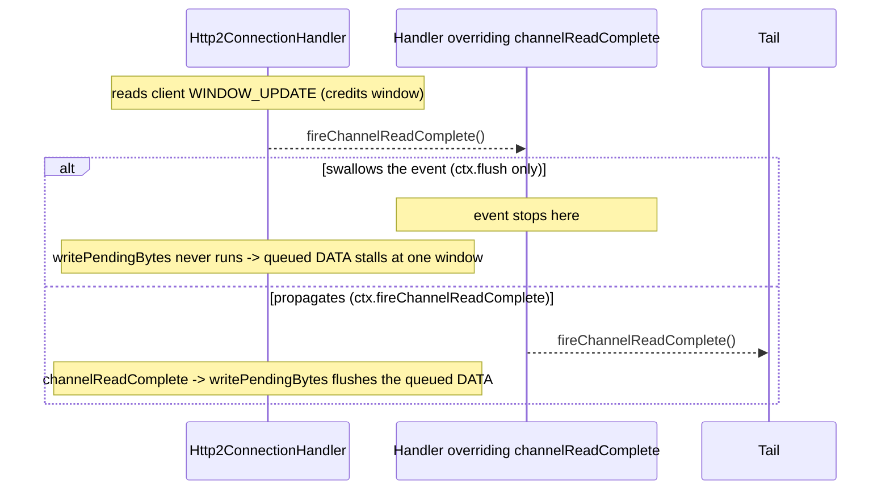

This bites specifically on the **CONNECT-tunnel** client-facing pipeline (#2683), because that pipeline
retains MockServer's mock-serving handlers (`CallbackWebSocketServerHandler`,
`DashboardWebSocketHandler`, `McpStreamableHttpHandler`, `PreserveHeadersNettyRemoves`,
`HttpContentLengthRemover`, `TraceContextHandler`) *ahead of* the `HttpToHttp2ConnectionHandler`.
Several of those handlers overrode `channelReadComplete` as `ctx.flush()` only, so the event never
reached the h2 codec. Direct HTTP/2 (`h2c` and TLS+ALPN) does not retain those handlers ahead of the
codec, and HTTP/1.1 has no flow control, which is why only large h2-through-`CONNECT` responses hung.
The default `ChannelInboundHandlerAdapter.channelReadComplete` already propagates — this invariant only
matters when a handler overrides it.

### Testing convention: an HTTP/2 test MUST use a response body larger than the flow-control window

**Every HTTP/2 test MUST assert on a response (or forwarded) body that exceeds the 65,535-byte HTTP/2
initial flow-control window — use at least 262,144 bytes (256 KB).** A body at or under one window is
delivered in the peer's first window and never exercises the `WINDOW_UPDATE`-driven
`writePendingBytes()` flush described above, so the test cannot observe the whole `channelReadComplete`
family of defects (#2641, #2667, #2669, #2683). This is not a style preference — it is the single
structural reason those four defects all shipped green: **every** HTTP/2 test used a sub-window body,
including the one literally named `shouldForwardHttp2RequestWithLargeBodyViaConnectProxy` at 50,000
bytes (15 KB short of the window). The failure mode is a silent hang, not a wrong answer, so a
sub-window body makes the test *incapable of failing* while looking thorough.

Corollaries, all of which are load-bearing and must not be quietly relaxed:

| Rule | Why |
|------|-----|
| Body **> 65,535 bytes** (≥ 256 KB) | Crosses the per-stream window, the connection window, and many DATA frames — the only size that exercises the flush. Shrinking it restores the blind spot. |
| Assert the full body arrives **within a bounded timeout** | The bug is a hang. The time bound (`@Test(timeout=…)` plus a per-request timeout) is the real assertion; a length/content check alone would hang forever, not fail. |
| Assert the exchange actually used **HTTP/2** (not a silent HTTP/1.1 downgrade) | HTTP/1.1 has no flow control; a downgrade would pass for the wrong reason. |
| A third-party client must be pinned to the **RFC-default window** | Some independent clients (e.g. `java.net.http.HttpClient`) default to a far larger receive window and pre-enlarge the connection window, so a large body fits in one window and the flush never runs. Pin it (for the JDK client, `-Djdk.httpclient.windowsize=65535` set before the client is built). |

**Get the body from the shared helper, not a magic number.** `org.mockserver.test.Http2FlowControlBodies`
(in `mockserver-testing`, so every module with HTTP/2 tests can reach it) offers named sizes —
`SMALL` (~1 KB), `OVER_WINDOW` (256 KB) and `LARGE` (~1 MB) — and stamps the body throughout with a
caller-supplied marker so a mis-routed or truncated body fails an *equality* assertion, not just a
length check. Use `Http2FlowControlBodies.body(OVER_WINDOW, "some-marker")` for any real HTTP/2 body
assertion: the author crosses the window without having to know this history, and the class's static
initialiser fails the build if `OVER_WINDOW` is ever shrunk to at or below the 65,535-byte window, so
the blind spot cannot be silently reintroduced by editing one number.

The independent-client conformance lock for this family is
`mockserver-netty/.../integration/mock/Http2ThirdPartyClientConformanceIntegrationTest` (JDK
`java.net.http.HttpClient`, a stack MockServer does not itself use), alongside the server-client
regression tests in `HTTP2MockingIntegrationTest`, `H2cMockingMatrixIntegrationTest` and
`NettyHttpsProxyHttp2IntegrationTest`. The mocked and forwarded responses served **through the HTTPS
`CONNECT` proxy** are the cases that reproduce #2683 from a third-party client; direct h2 (`h2c` and
TLS+ALPN) is the isolation control that stays green either way.

This HTTP/2 testing convention is the worked example that generalises to every performance change in
the codebase. The hazard-class table and full evidence standard are in
[docs/code/optimisation-safety.md](optimisation-safety.md) — including how reference-counting changes
must be evidenced, which is the hazard class the ByteBuf leak detection above exists to serve.

> **`@Sharable` on `HttpClientInitializer` and `HttpClientHandler` is misleading.** Both classes are annotated `@Sharable` but hold per-connection state. The annotation is harmless only because `NettyHttpClient.connectFresh` news a **fresh initializer instance per `connect` call** — there is never actually a shared instance. Any refactoring that tries to "fix" this by reusing a single `HttpClientInitializer` instance across connections will silently corrupt per-connection state.

## WebSocket Proxy Passthrough

MockServer can **proxy** a WebSocket connection through to a real upstream server, in addition to **mocking** one
(the `WEBSOCKET_RESPONSE` action — see [ai-protocol-mocking.md](ai-protocol-mocking.md#websocket-mocking)). When a
WebSocket upgrade request arrives in proxy mode and **no** WebSocket mock expectation matches — or it matches a plain
`FORWARD` expectation — MockServer opens the upstream WebSocket connection, relays the `101 Switching Protocols`
handshake, then relays frames bidirectionally until either side closes.

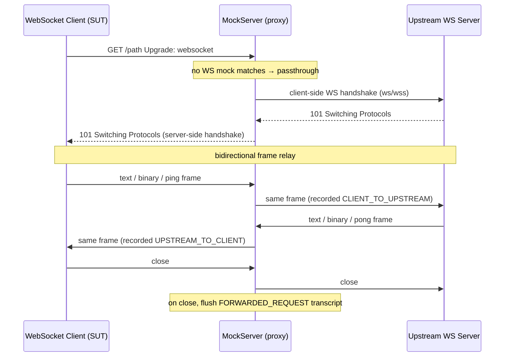

**Placement.** The interception lives in `HttpActionHandler` (`mockserver-core`), where the mock-vs-forward decision
is already made: `WebSocketProxyRelayHandler.isWebSocketUpgrade(request)` is checked in the unmatched-proxy branch of
`processAction` (before `handleUnmatchedProxyForward`) and, for a matched plain `HttpForward` action, at the top of
`dispatchPrimaryActionInternal`. The relay itself is `WebSocketProxyRelayHandler` (`mockserver-core`), which:

1. Resolves the upstream host/port (the `REMOTE_SOCKET` port-forward target, the configured `proxyRemoteHost`, or the
   request `Host` header for a reverse proxy) and the scheme (`wss` when `request.isSecure()`, else `ws`).
2. Opens the upstream connection on the **same event loop** as the inbound client channel
   (`NettyTransport.socketChannelClassFor(...)`), so both relay halves run single-threaded with no cross-thread races.
   TLS uses `NettySslContextFactory.createClientSslContext(...)`.
3. Drives the **client-side** handshake to the upstream (`WebSocketClientHandshaker`), forwarding the client's custom
   headers (e.g. `Authorization`, `Cookie`) and requested subprotocol.
4. On upstream `101`, completes the **server-side** handshake back to the original client (reusing the same
   `WebSocketServerHandshakerFactory` approach as the WS mock handler), strips the HTTP server handlers, and installs a
   `FrameRelayHandler` on each channel.

**Backpressure.** Each `FrameRelayHandler` mirrors its channel's writability onto the *peer's* `autoRead` in
`channelWritabilityChanged` (the standard Netty proxy pattern): when the channel it writes to saturates, reads on the
source channel are paused and resumed when it drains, so a slow peer cannot grow the other side's
`ChannelOutboundBuffer` without bound.

**TLS to the upstream.** The upstream leg uses `NettySslContextFactory.createClientSslContext(true, …)` — the
**forward-proxy** client context — so `forwardProxyTLSX509CertificatesTrustManagerType` (default `ANY`) governs which
upstream certificates are trusted, exactly like the matched-forward path. (Using the non-forward context would trust
only MockServer's own CA and fail `wss` to any real upstream.)

**SSRF guard.** Before connecting, `relay()` calls `InetAddressValidator.validateForwardTarget(configuration, host)` —
the same guard every matched-forward handler enforces — so with `forwardProxyBlockPrivateNetworks=true` a WS upgrade to
a loopback / link-local / RFC1918 / cloud-metadata (`169.254.169.254`) target is rejected with a `502` instead of being
relayed. No-op when the feature is disabled (the default).

**Recording (flush-on-close only).** Each relayed frame is captured into a bounded, per-connection `FrameTranscript`
(direction, opcode, payload — text as a UTF-8 string, other opcodes as base64, per-frame payload capped at 32KB). The
transcript is flushed to the event log **once, when the connection closes** — a long-lived relay does not appear in
`retrieveRecordedRequests` until it closes. It is written as a single `FORWARDED_REQUEST`: request = the upgrade `GET`,
response = `101` with an `x-mockserver-websocket-frames` count header, an `x-mockserver-websocket-transcript-truncated`
flag, and the transcript as the JSON body — so `retrieveRecordedRequests` / `retrieveRecordedRequestsAndResponses` and
the dashboard show the WebSocket traffic. Two independent caps bound memory: the frame-count cap
`webSocketProxyMaxRecordedFrames` (default `1000`, `0` disables frame recording — the handshake is still recorded and is
*not* flagged truncated) and an absolute 8MB cap on the accumulated transcript JSON. Because base64 inflates payload by
~1.33× and Java `String`/`StringBuilder` store UTF-16 (~2 bytes/char), the frame-count cap alone could otherwise pin
~85MB for a connection of 1000 maximally-sized (32KB) frames; the 8MB JSON cap is the real bound. Beyond either cap
frames are relayed but not recorded and the transcript is flagged truncated.

**Idle reaping (opt-in).** With `webSocketProxyIdleTimeoutSeconds > 0`, an `IdleStateHandler` on each relay channel
closes the relay (flushing the transcript) once neither side has sent a frame for that period. Default `0` (off) —
legitimately idle long-lived WebSocket connections are left to TCP keep-alive and peer-close propagation.

**Matched-`HttpForward` semantics.** A WS upgrade matched by a plain `HttpForward` expectation is relayed to the
forward target, but only the **connect** is driven by that expectation: `Times`/`TimeToLive` selection and `verify`
work as usual, but the response-shaping features that assume a single buffered HTTP response — `delay`, `rateLimit`,
`chaos`, request/response/stream **breakpoints**, and **drift** analysis — do **not** apply to a passthrough WebSocket
(there is no single response to delay, rate-limit, mutate, or compare). Use the `WEBSOCKET_RESPONSE` mock action for
frame-level control.

**Boundary (v1).** HTTP/1.1 upgrade relay only, plain and TLS upstream. HTTP/2 extended-CONNECT (RFC 8441) WebSocket is
**not** relayed — such an upgrade falls through to the normal HTTP forward path. Only the plain `HttpForward` action
(static host/port/scheme) routes a matched WS upgrade to passthrough; the template/callback/replace forward variants
fall through to their normal handlers.

## DNS UDP Server

When `dnsEnabled=true`, `MockServer.bindDnsPort()` creates a separate Netty `Bootstrap` with `NioDatagramChannel` for UDP DNS:

```mermaid
graph LR
    UDP["NioDatagramChannel\n(UDP)"] --> DEC["DatagramDnsQueryDecoder"]
    DEC --> ENC["DatagramDnsResponseEncoder"]
    ENC --> HANDLER["DnsRequestHandler"]
```

| Handler | Class | Purpose |
|---------|-------|---------|
| DatagramDnsQueryDecoder | Netty built-in (`netty-codec-dns`) | Decodes UDP datagrams into `DatagramDnsQuery` |
| DatagramDnsResponseEncoder | Netty built-in (`netty-codec-dns`) | Encodes `DatagramDnsResponse` to UDP datagrams |
| DnsRequestHandler | `o.m.netty.dns` | Matches DNS queries against expectations via `HttpState`, returns `DnsResponse` records |

The DNS channel uses the same `workerGroup` as the TCP server. It is managed separately from TCP `serverChannelFutures` — closed explicitly in `MockServer.stopAsync()`.

## Binary Protocol Handling

When no known protocol is detected, `BinaryRequestProxyingHandler` handles the raw bytes. The handler first checks for matching expectations via `HttpState.firstMatchingExpectation(BinaryRequestDefinition)`. If a match with a `BinaryResponse` action is found, the response bytes are written directly to the channel. Otherwise, in proxy mode (when a remote address is configured on the channel), raw bytes are forwarded via `NettyHttpClient.sendRequest(BinaryMessage, ...)`:

- **Waiting mode**: Blocks until upstream response arrives, writes it back
- **Non-waiting mode**: Fire-and-forget with optional `BinaryProxyListener` callback. `BinaryProxyListener` (`o.m.model.BinaryProxyListener`) is a functional interface with `onProxy(BinaryMessage binaryRequest, CompletableFuture<BinaryMessage> binaryResponse, SocketAddress serverAddress, SocketAddress clientAddress)` invoked when binary data is proxied

Each socket read is one binary message, and each message is forwarded on an upstream connection of its own. In non-waiting mode a client can send its next message before the previous one has been forwarded, so `BinaryRequestProxyingHandler` serialises two things per client connection:

- **Forwards**: a connection's messages wait in a per-connection queue (`ForwardQueue`, a channel attribute used only on that connection's event loop). The next message's upstream connection is opened only once the previous message has been connected and written, which `NettyHttpClient.sendRequest(BinaryMessage, ...)` reports through its `onRequestSent` callback. So a message can wait for the previous one's connect, up to `socketConnectionTimeoutInMillis`. Without this the connections are opened from different forward-client event loops and the upstream can accept them in either order.
- **Listener calls**: the listener is user code and may block on the response future, so it runs on the `Scheduler` local-callback pool (`scheduleLocalCallback`), never on the worker event loop, which would otherwise forward nothing more on that thread until the listener returned. One connection's messages are reported one at a time, in arrival order; a listener that throws closes the client connection, as it did when it ran on the event loop.

What this does and does not give:

| Behaviour | Detail |
|-----------|--------|
| Order within one client connection | Kept: forwards start in arrival order, each after the previous was written |
| Order across client connections | None: each connection has its own queue |
| A forward fails (connect, write, or cannot be started) | The client connection is closed, as before; messages still queued behind it are not attempted, their responses fail, and one WARN reports how many |
| The client closes after sending | Every message it sent is still forwarded |
| Queue size | Unbounded. A client that sends faster than the upstream accepts connections is held in memory here; before, it held one upstream connection per message |

Waiting mode is unchanged: forwards are not queued and the listener is called from the scheduler once the response has arrived.

## SOCKS Protocol Detection

`SocksDetector` provides static detection methods:

**SOCKS4 detection** (`isSocks4`):
- Byte 0 = `0x04` (version)
- Byte 1 = valid command (CONNECT or BIND)
- Validates null-terminated username (max 256 chars)
- Optionally validates SOCKS4a hostname

**SOCKS5 detection** (`isSocks5`):
- Byte 0 = `0x05` (version)
- Byte 1 = auth method count
- Each auth method is NO_AUTH, PASSWORD, or GSSAPI

**SOCKS5 handshake lifecycle**:

```mermaid
stateDiagram-v2
    [*] --> InitialRequest: Client sends version + auth methods
    InitialRequest --> PasswordAuth: Server selects PASSWORD
    InitialRequest --> CommandRequest: Server selects NO_AUTH
    PasswordAuth --> CommandRequest: Credentials valid
    PasswordAuth --> [*]: Credentials invalid (close)
    CommandRequest --> RelayEstablished: CONNECT command
    CommandRequest --> [*]: Unsupported command (close)
    RelayEstablished --> [*]: Connection closed
```

## SSL and Decoder Fault Logging

Netty's `exceptionCaught` fires for both benign connection closes and genuine faults. MockServer distinguishes these two categories using `ExceptionHandling.isSslOrDecoderFault(Throwable)`:

| Exception type | Classification | Logged at |
|---------------|----------------|-----------|
| `SSLException` (as `cause`) | SSL/decoder fault | **WARN** |
| `DecoderException` | SSL/decoder fault | **WARN** |
| `NotSslRecordException` | SSL/decoder fault | **WARN** |
| Connection reset / broken pipe (regex + stack match) | Benign close | silent |
| Other unexpected exceptions | Unexpected | **ERROR** |

The `isSslOrDecoderFault` predicate is wired into the `exceptionCaught` handler of every handler that could receive these exceptions:

- `PortUnificationHandler` (protocol detection)
- `HttpRequestHandler` (main request dispatcher)
- `BinaryRequestProxyingHandler` (raw binary proxy)
- `SocksProxyHandler` (SOCKS4/5)
- `UpstreamProxyRelayHandler` / `DownstreamProxyRelayHandler` / `RelayConnectHandler` (relay handlers)
- `CallbackWebSocketServerHandler` (WebSocket callback channel)
- `McpStreamableHttpHandler` (MCP streaming)
- `DashboardWebSocketHandler` (dashboard WebSocket)

This means genuine SSL negotiation failures (e.g., client sends plain HTTP to a TLS port, or a non-TLS client probes a TLS port) surface at WARN and are visible in logs, while normal connection teardowns remain silent. `ExceptionHandling.isSslOrDecoderFault` mirrors the predicate already in `connectionClosedException` but as a positive match so callers can route specifically to WARN rather than silently drop.

## ByteBuf Leak Detection in Tests

**`mockserver-netty`'s test JVMs run Netty's leak detector at `paranoid` and fail the build if any `ByteBuf` is allocated and never released.** The whole serving/proxy hot path is reference-counted `ByteBuf`s; an unreleased buffer is a slow production memory leak and a double-release is corruption under load — neither is visible to a functional assertion or a throughput benchmark. Netty's default level (`simple`) samples ~1% of allocations, which is useless as a gate.

```mermaid
flowchart LR
    A["surefire / failsafe fork\n-Dio.netty.leakDetection.level=paranoid\n-Dio.netty.customResourceLeakDetector=...FailOnLeakResourceLeakDetector"] --> B["FailOnLeakResourceLeakDetector\ncounts each leak, still logs it,\nwrites one file per leak to\ntarget/netty-leaks/leak-<pid>.txt"]
    B --> C["antrun check-netty-leaks (verify phase)\nfails the build if that dir has any non-empty file"]
    C -->|"-Dmockserver.failOnNettyLeak=false"| D["downgrade to a warning\n(detection/logging/recording stay on)"]
```

| Piece | Location | Role |
|-------|----------|------|
| `paranoid` + custom detector | `mockserver-netty/pom.xml` → `${mockserver.testArgLine}` (appended to both surefire and failsafe argLine via the parent pom's reserved hook, so it never touches the jacoco `@{argLine}` token) | Track every allocation; route leaks to the recorder |
| `FailOnLeakResourceLeakDetector` | `mockserver-testing/.../test/FailOnLeakResourceLeakDetector.java` | Counts + records each leak, still logs via `super`, writes one file per leak under `${mockserver.leakReportDir}`, and registers a JVM shutdown hook that GCs + polls so late leaks surface before the fork exits |
| `check-netty-leaks` / `clean-netty-leaks` | `mockserver-netty/pom.xml` (maven-antrun-plugin) | Empties the report dir before tests (`process-test-classes`); fails the build at `verify` if any leak file is non-empty, unless `-Dmockserver.failOnNettyLeak=false` |

**Why a file, not a thrown exception.** Throwing from a JUnit `RunListener` does *not* fail surefire — the exception is caught and reported as a listener warning (verified: an 88-leak run still went green that way). Netty also logs a leak at ERROR on an arbitrary thread long after the causing test, so scanning stdout is unreliable. A file that outlives the fork, checked by Maven, is the robust gate.

**What it cannot catch.** Netty reports a leak only once the leaked object has been GC-collected *and* a later `track()` polls the reference queue. A buffer leaked so late that it is never collected before the JVM exits, or reported on a background thread after the shutdown-hook flush, will not reach the file — only Netty's ERROR `LEAK:` log remains for that tail case.

**Cost.** Measured on `mockserver-netty`'s unit phase: `paranoid` adds ~10% (207 s → 228 s), which is cheap enough for every run. Extending the same three-line property block to other pipeline-driving modules (`mockserver-core`, `mockserver-integration-testing`) is a follow-up, gated on triaging the pre-existing leaks the detector already surfaces (predominantly `EmbeddedChannel` tests that never call `finishAndReleaseAll()`).

## Class Reference

| Class | File | Role |
|-------|------|------|
| `Main` | `mockserver-netty/.../cli/Main.java` | CLI entry point, argument parsing |
| `LifeCycle` | `mockserver-netty/.../lifecycle/LifeCycle.java` | Abstract server lifecycle (event loops, port binding, shutdown) |
| `LoopbackShadowProbe` | `mockserver-netty/.../lifecycle/LoopbackShadowProbe.java` | Post-bind check that localhost connections reach the new listener — see [Port Binding and Loopback Reachability](#port-binding-and-loopback-reachability) |
| `MockServer` | `mockserver-netty/.../netty/MockServer.java` | Concrete server, configures `ServerBootstrap` |
| `NettyAllocator` | `mockserver-core/.../socket/NettyAllocator.java` | The single pooled `ByteBufAllocator` every channel uses; `pin(channel)` for channels no bootstrap option reaches |
| `MockServerUnificationInitializer` | `mockserver-netty/.../netty/MockServerUnificationInitializer.java` | Replaces self with `PortUnificationHandler` |
| `PortUnificationHandler` | `mockserver-netty/.../netty/unification/PortUnificationHandler.java` | Protocol detection and pipeline assembly |
| `Http2MultiplexChildInitializer` | `mockserver-netty/.../netty/unification/Http2MultiplexChildInitializer.java` | Per-stream child initializer for the HTTP/2 multiplex pipeline; installs `ConnectionScopeHandler`, `Http2StreamTransportTimer` when metrics are enabled, optionally `GrpcBidiRouterHandler`, and the re-aggregating chain for every HTTP/2 stream |
| `HttpRequestHandler` | `mockserver-netty/.../netty/HttpRequestHandler.java` | Main request dispatcher |
| `NettyResponseWriter` | `mockserver-netty/.../netty/responsewriter/NettyResponseWriter.java` | Writes responses to Netty channels |
| `HttpErrorActionHandler` | `mockserver-core/.../mock/action/http/HttpErrorActionHandler.java` | Applies an `HttpError` action: raw response bytes, HTTP/2 stream reset (RST_STREAM), and/or connection drop (also the HTTP/1.1 stream-error fallback) |
| `StreamErrorWriter` | `mockserver-core/.../responsewriter/StreamErrorWriter.java` | Transport-neutral seam for resetting the request stream; implemented by `Http3ResponseWriter` for the QUIC RESET_STREAM |
| `HttpConnectHandler` | `mockserver-netty/.../netty/proxy/connect/HttpConnectHandler.java` | HTTP CONNECT tunnel handler |
| `RelayConnectHandler` | `mockserver-netty/.../netty/proxy/relay/RelayConnectHandler.java` | Abstract relay establishment |
| `UpstreamProxyRelayHandler` | `mockserver-netty/.../netty/proxy/relay/UpstreamProxyRelayHandler.java` | Client → MockServer relay |
| `DownstreamProxyRelayHandler` | `mockserver-netty/.../netty/proxy/relay/DownstreamProxyRelayHandler.java` | MockServer → client relay |
| `LoopbackHttp2ConnectionCloseHandler` | `mockserver-netty/.../netty/proxy/relay/LoopbackHttp2ConnectionCloseHandler.java` | Answers the client's HTTP/2 streams when the loopback connection closes or receives a GOAWAY |
| `ExpectContinueInboundHttp2ToHttpAdapter` | `mockserver-netty/.../netty/proxy/relay/ExpectContinueInboundHttp2ToHttpAdapter.java` | Hands each relayed HTTP/2 request on once, whole, answering `Expect` itself (`100`, `413` or `417`) |
| `BinaryRequestProxyingHandler` | `mockserver-netty/.../netty/proxy/BinaryRequestProxyingHandler.java` | Raw binary proxying |
| `SocksDetector` | `mockserver-netty/.../netty/proxy/socks/SocksDetector.java` | SOCKS4/5 protocol detection |
| `SocksProxyHandler` | `mockserver-netty/.../netty/proxy/socks/SocksProxyHandler.java` | Abstract SOCKS handler base |
| `Socks4ProxyHandler` | `mockserver-netty/.../netty/proxy/socks/Socks4ProxyHandler.java` | SOCKS4 CONNECT handling |
| `Socks5ProxyHandler` | `mockserver-netty/.../netty/proxy/socks/Socks5ProxyHandler.java` | SOCKS5 multi-phase handshake |
| `SocksConnectHandler` | `mockserver-netty/.../netty/proxy/socks/SocksConnectHandler.java` | Abstract SOCKS relay base |
| `SniHandler` | `mockserver-core/.../socket/tls/SniHandler.java` | TLS SNI extraction, dynamic cert generation |
| `HttpContentLengthRemover` | `mockserver-netty/.../netty/unification/HttpContentLengthRemover.java` | Strips empty Content-Length |
| `MockServerHttpServerCodec` | `mockserver-core/.../codec/MockServerHttpServerCodec.java` | Netty HTTP ↔ MockServer model codec |
| `GrpcToHttpRequestHandler` | `mockserver-netty/.../netty/grpc/GrpcToHttpRequestHandler.java` | gRPC request decode (protobuf→JSON); gRPC-Web translation |
| `GrpcToHttpResponseHandler` | `mockserver-netty/.../netty/grpc/GrpcToHttpResponseHandler.java` | gRPC response encode (JSON→protobuf); gRPC-Web re-framing |
| `GrpcWebTranslator` | `mockserver-core/.../grpc/GrpcWebTranslator.java` | gRPC-Web framing utilities (trailer frame, base64, content-type detection) |
| `DnsRequestHandler` | `mockserver-netty/.../netty/dns/DnsRequestHandler.java` | DNS query matching and response |
| `CoalescingHttpObjectAggregator` | `mockserver-core/.../codec/CoalescingHttpObjectAggregator.java` | Every server and forward-client aggregator: past the component limit, merges only new components (items 46, 53); on HTTP/2 streams (stream limit) it also copies runs of DATA frames under 1 KiB into 16 KiB blocks (item 46) |
| `StreamingAwareHttpObjectAggregator` | `mockserver-core/.../codec/StreamingAwareHttpObjectAggregator.java` | Replaces `HttpObjectAggregator` in forward-path client pipelines; detects streaming responses and switches to `StreamingResponseRelayHandler` |
| `StreamingResponseRelayHandler` | `mockserver-core/.../httpclient/StreamingResponseRelayHandler.java` | Consumes unaggregated `HttpObject` events; relays chunks immediately; captures bounded body; signals `HttpActionHandler` on completion |
| `StreamingBody` | `mockserver-core/.../model/StreamingBody.java` | Chunk sink bridging relay handler to server-side response writer; holds bounded capture buffer |
| `WebSocketProxyRelayHandler` | `mockserver-core/.../mock/action/http/WebSocketProxyRelayHandler.java` | WebSocket proxy passthrough: opens the upstream WS connection (plain/TLS), relays the `101` handshake and frames bidirectionally, and records the upgrade + a bounded frame transcript as a `FORWARDED_REQUEST` |
| `AltSvcHeaderHandler` | `mockserver-netty/.../netty/unification/AltSvcHeaderHandler.java` | Outbound handler that adds `Alt-Svc` header to TCP responses when HTTP/3 is enabled; does not clobber user-set values |
