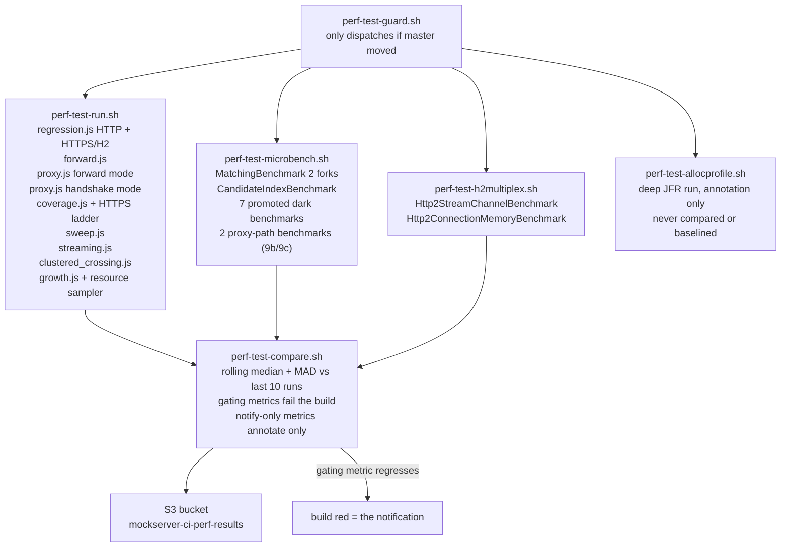
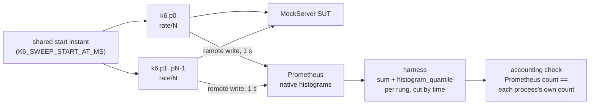
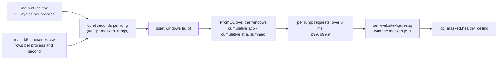
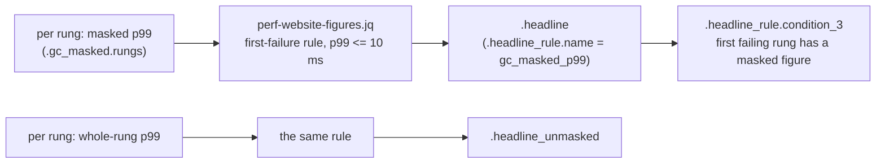
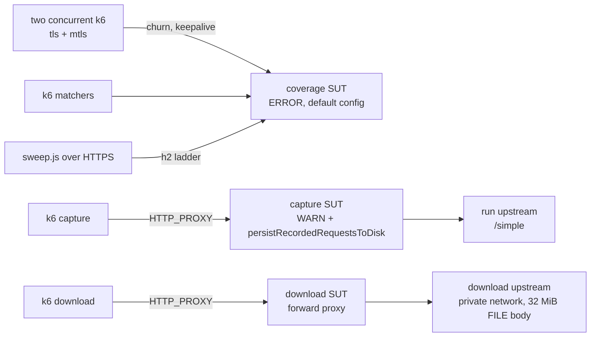
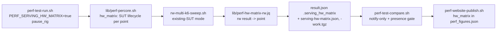
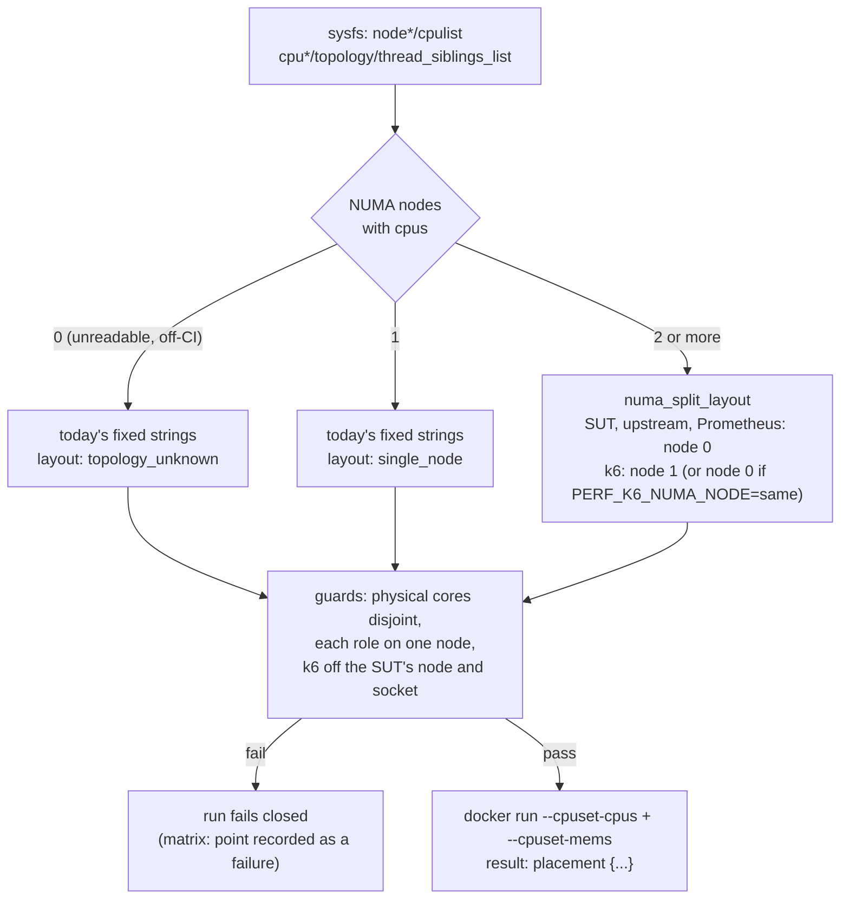

# Performance Measurement

The performance harness is **not** a uniform set of guards. Scripts exist for more scenarios than
CI executes, and of the executed scripts only a subset gate the build. Reading a number without
knowing which category it came from — linted only, executed once by hand, or gated daily — is how
regressions hide and stale claims get published.

## Summary

| Script / benchmark | What it measures | CI status | Fails build? |
|---|---|---|---|
| `regression.js` (HTTP + HTTPS/H2) | Per-behaviour latency percentiles and delivery ratio at 200 rps | Daily (perf queue) | No — notify-only |
| `growth.js` | Latency slope as the event log fills | Daily (perf queue) | No — notify-only |
| `sweep.js` | Throughput-vs-latency knee curve | Daily (perf queue) | No — notify-only |
| `rw-multi-k6-sweep.sh` (`sweep.js` from N processes, merged in Prometheus) | The same knee curve without the single-k6 ceiling (item 31) | **Opt-in**: `PERF_SERVING_RW_MULTIK6=true` inside `perf-run` on `perf`, or its own arm-only step on `perf-xl` with `PERF_XL=true` ([where each arm runs](#which-queue-runs-which-arm)) | No — never published; exits 2 on its own accounting/skew/window/cross-check gates; the perf-xl step fails when the arm is not `valid` |
| `forward.js` | Forward connection-pool regression guard | Daily (perf queue) | `forward.error_rate` only |
| `proxy.js` | Proxy and TLS handshake latency | Daily (perf queue) | No — notify-only |
| `proxy.js` forward + slow upstream | Unmatched-proxy in-flight concurrency cap (unit 21) | **Opt-in** (`PERF_WORKLOAD=forward`) | `workload_forward_served_via_upstream` validity check |
| `streaming.js` | LLM/SSE streaming concurrency vs match latency | Daily (perf queue) | No — notify-only |
| `clustered_crossing.js` | Cross-node request latency in a cluster | Daily (perf queue) | **Notify-only.** `perf-test-compare.sh` reads `clustered_state.*` as notify-only metrics. This measured NOTHING until the clustered image was published to the perf queue: the run gates the A/B on `docker image inspect`, nothing pulled or built that image, so every run took the absent-image skip and emitted no `clustered_state` block to read. The snapshot push now builds `mockserver-snapshot-clustered` in the same job, from the same jar and commit as the SUT image, and the run refuses to measure if the two image revisions disagree (`clustered_skip_reason=revision_mismatch`) — a ratio computed across two commits would be arithmetically fine and describe code the measured binary never contained |
| `MatchingBenchmark` JMH | Matcher hot-path time/op and allocation/op | Daily (perf queue) | Yes — `time_per_op` + `alloc_bytes_per_op` |
| `perf-alloc-gate.sh` (JMH `gc.alloc.rate.norm`) | Allocation/op for matching, inbound decode and response write at pinned params, plus a matching-scan arm | Per merge (every Java pipeline build) | Yes, all eight rows |
| `CandidateIndexBenchmark` JMH | Index vs scan scaling | Daily (perf queue) | No |
| Promoted dark benchmarks (7 classes, see below) | Various hot paths | Daily (perf queue) | No — notify-only |
| Proxy-path benchmarks (`RelayByteCopyBenchmark`, `SocksHandshakeBenchmark`) | CONNECT/relay byte cost; SOCKS handshake cost | Daily (perf queue) | No — notify-only |
| `Http2StreamChannelBenchmark` JMH | HTTP/2 streams-per-connection throughput and latency | Daily (perf queue) | No — by explicit design |
| `Http2ConnectionMemoryBenchmark` JMH | Retained heap per established connection (`bytes_per_connection`, shapes 1x1 / 10x10 / 100x10) | Daily (perf queue) | No — notify-only. `perf-test-compare.sh` reads `.h2_connection_memory` and annotates each shape's `bytes_per_connection` against the `h2_connection_memory.*.bytes_per_connection` budget every run; non-gating, so a move is surfaced but cannot fail the build until >=10 clean runs let a MAD-derived floor be set |
| `load.js` | p95 / p99 gate, ramping 50 -> 500 rps | Opt-in (manual / scheduled) | Yes — k6 thresholds |
| `coverage.js` + an HTTPS `sweep.js` ladder | Paths nothing else drives: HTTPS connection churn, client-certificate (mTLS) traffic, HTTP/2 at load, JSONPath / XPath / JSON-schema matchers over 100 candidates, disk capture under proxy load, large proxied downloads | Daily (perf queue), inside `perf-test-run.sh` | No — notify-only, `provisional` budgets |
| `stress.js` | Ramp past the knee | Lint only | Never executes in CI |
| `soak.js` | Sustained load over hours | Weekly (Sunday 08:00 UTC schedule, perf queue) and on demand in any build whose message contains `[perf-soak]` | Yes, for that build — k6 thresholds and a result-presence check; never compared or baselined |
| `scripts/perf/bench_startup.py` | Launch-to-ready variant matrix | Never runs in CI | Never |
| `inject` (`run-inject.sh`) | Load-injection ceiling | Opt-in | Never in daily pipeline |
| Hardware matrix (`lib/perf-percore.sh` driving `rw-multi-k6-sweep.sh` per point, `PERF_SERVING_HW_MATRIX=true`) | Healthy ceiling per cores × container memory, for the public sizing table | Opt-in, manual build only; on `perf-xl` instead of `perf` when `PERF_XL=true` | No — notify-only; only a wholesale producer failure reds (presence gate in compare, or in the perf-xl step itself) |
| `perf-test-allocprofile.sh` (deep JFR) | Allocation per request, peak direct memory, top allocation sites over the load window, retained-heap histogram, and the CPU / lock / GC profile of the ceiling rungs alone | Daily (perf queue), separate step | No — `soft_fail`, never baselined; an under-sized recording is reported INVALID |

## The Daily Pipeline



`perf-test-guard.sh` skips the entire chain when `master` has not moved since the last run, so
the daily job is a no-op on unchanged code.

The `perf` queue runs up to three agents, one per machine, so the four measurement steps run in
parallel, each on its own c5.12xlarge, and pass results to `perf-test-compare.sh` only as
Buildkite artifacts. Different steps, and builds that run at the same time, therefore measure on
different VMs. That does not disturb the rolling baseline, which already spans a fresh machine per
daily run, but it does matter for a close A/B: VM-to-VM variance is a few percent, so measure both
arms within one job on one machine (a within-run A/B, like the clustered-state arm) or repeat each
arm, rather than comparing two separate builds.

`perf-test-run.sh` clients reach every container by its short `--network-alias` (for example
`mockserver-upstream`), never by its container name. A name carries the build ID and the agent's
PID, so it exceeds the 63-character DNS label limit once the PID has 7 digits, and Docker's
embedded DNS cannot resolve it. `require_dns_hostname` refuses such a hostname before any container
starts, and `.buildkite/scripts/test/perf-upstream-alias-test.sh` fails lint if a `${RUN_ID}` container-name
variable is used as a hostname.

The lint step runs in the same build as the measurement, so it sees the build's environment. Every
`.buildkite/scripts/test/perf-*-test.sh` therefore starts with `perf_test_scrub_env`
(`.buildkite/scripts/test/lib/perf-test-env.sh`). It unsets the `PERF_*`, `K6_*`, `PUBLISH_*` and
`MOCKSERVER_*` knobs and the other variables the perf scripts read, keeping only the test's own
seams and `BUILDKITE`. Without it, an A/B build's `PERF_RW_K6_VU_CEILING=2048` or
`PERF_RW_K6_GOGC=off` changed the defaults the fixtures assert, and builds 605 and 606 failed lint.
`perf-test-env-test.sh` checks that every test does this, and runs the topology, tail, k6-runtime
and perf-xl dispatch tests with `BUILDKITE=true` under each of those builds' environments.

### Which queue runs which arm

Every arm runs on the `perf` queue (c5.12xlarge) by default. `PERF_XL=true` moves two opt-in arms
to the `perf-xl` queue (one c6i.32xlarge, two NUMA nodes), each as its own arm-only step
(`perf-test-run.sh` with `PERF_RUN_ARM`). `perf-test-run.sh` then drops both arms from `perf-run`.

| Arm | `PERF_XL` unset | `PERF_XL=true` |
|---|---|---|
| regression, sweep, growth, forward, proxy, coverage, streaming, clustered, INFO arm | `perf-run` on `perf` | `perf-run` on `perf` (unchanged) |
| micro-benchmarks, HTTP/2 multiplex, allocation profile | own steps on `perf` | own steps on `perf` (unchanged) |
| multi-k6 arm (item 31) | inside `perf-run` when `PERF_SERVING_RW_MULTIK6=true` | step `perfxl-rw-multik6` on `perf-xl`, always |
| hardware matrix (item 27) | inside `perf-run` when `PERF_SERVING_HW_MATRIX=true` | step `perfxl-hw-matrix` on `perf-xl`, when `PERF_SERVING_HW_MATRIX=true` |

A perf-xl result is uploaded under a `perfxl-` prefix and is never compared, persisted or
published, so it cannot enter the c5.12xlarge baseline or the website. As a second barrier,
`perf-test-compare.sh` keeps one S3 history per agent queue (`runs/` for `perf`, `runs-<queue>/`
for any other), so even a result that did reach it could not enter or crowd the perf window. The step fails on its own
when the arm measured nothing trustworthy. The wiring and the isolation argument are in
[ci-cd.md](../infrastructure/ci-cd.md#the-perf-xl-steps-opt-in). In arm-only mode the multi-k6
arm runs on a SUT that no regression or sweep load has warmed, so it gets a 60 s warm-up of its
own (`PERF_RW_WARMUP_DURATION`, which stays overridable). Inside `perf-run` that warm-up is 0 s.

`perf-test-compare.sh` reads `behaviours.*`, `growth.*`, and `microbench.*` from the per-run
artifacts and gates only the metrics explicitly marked `gating: true` in the compare script.
Everything else is reported in the Buildkite annotation but does not change the exit code.

**Currently gating:**
- `MatchingBenchmark` — `time_per_op` and `alloc_bytes_per_op` per matcher type / expectation count, on the shipped-default `detailedMatchFailures=true` arm (keys `<matcherType>_100_detailed`)
- `forward.error_rate` (discriminating pass/fail, not a tuned threshold)

**Notify-only until ≥ 10 clean run history exists to derive a budget from:**
- All `regression.js` latency percentiles
- `sweep.js` `rig_valid_peak_achieved_rps` (extended from 16k to 64k in the current code)
- `growth.js` ratios and `live_set_bytes`
- All promoted dark benchmark metrics
- The proxy-path benchmark metrics (`RelayByteCopyBenchmark`, `SocksHandshakeBenchmark` — items 9b/9c), which share the `microbench_extra.*` budgets
- Every `path_coverage.*` metric (see [Path coverage](#coveragejs--path-coverage-notify-only)), whose budgets are also marked `provisional`

## What Each Harness Actually Measures

### `regression.js` — latency at a fixed offered rate

Four primary `constant-arrival-rate` scenarios (`match`, `forward`, `template`, `large`) run at
200 rps each over HTTP, then the same run repeats over HTTPS negotiating HTTP/2 via ALPN. Results are
keyed `<op>_<proto>`, e.g. `match_http`, `forward_https_h2`. Alongside the primary four, secondary
arms run at deliberately reduced rates — `template_mustache`, `large_1mb`, `large_10mb` and
`large_file`. The authoritative list is the arm string in `perf-test-run.sh` and the
`REGRESSION.*Rate` entries in `lib/config.js`; read those rather than this sentence.

Per behaviour it records:
- `p50_ms`, `p95_ms`, `p99_ms` — latency percentiles over the measured window (settle-excluded)
- `throughput_rps` — completed / duration; **not** pinned to the offered rate
- `delivery_ratio` — `throughput_rps / offered_rps`; the at-a-glance health indicator
- `offered_rps`, `dropped_iterations` — make a `throughput_rps` shortfall interpretable

**`throughput_rps` is not a throughput ceiling.** It is a delivery ratio against a fixed offered
rate of 200 rps. A `delivery_ratio` below 1.0 means the client could not deliver all iterations —
the server got slower, or the VU pool ran out, or both. Use `sweep.js` to find the actual ceiling.

The script runs with `preAllocatedVUs == maxVUs` so no VU allocation happens mid-run (the original
design had a mid-run ramp that caused a connection storm and 1–3 second p99 tails even when the
server was fast). A per-scenario settle window at the start of the measured window is excluded and
reported as `settle_excluded` so it is auditable.

### `sweep.js` — throughput-vs-latency knee

Offers the match path at an ascending ladder of fixed rates and records per rung: `achieved_rps`,
`p50_ms` through `p999_ms`, and `error_rate`. The ladder now extends to 64,000 rps; the earlier
16,000 ceiling sat below saturation so the knee could not be observed.

**Rung-onset exclusion.** Each rung's latency percentiles (`p50_ms`–`p999_ms` and `phase_ms`)
exclude its first `K6_SWEEP_SETTLE` seconds (default 3 s). CI sets it from `PERF_SWEEP_SETTLE_S`
for the main and INFO ladders and from `PERF_PERCORE_SETTLE_S` / `PERF_MULTI_SETTLE_S` for the
per-core and multi-process rigs — in each case the value that already trims the start of the
rung's CPU-attribution window; their unmeasured warm-up drives pass `0s`. The onset is a rig transient,
not server latency: in build 464, 5,337 of the 24,000 rps rung's 5,343 stalls fell in its first 2.5 s
(the first of six time buckets of the 15 s rung), and a steady 24,000 rps run (build 473) measured p99 0.343 ms
against 10.6 ms on that ladder rung. Only the percentiles change: `achieved_rps`, `error_rate`,
`dropped_iterations`, `sample_count` and the VU/stall diagnostics still cover the whole rung, so
rig validity, occupancy, `rig_valid_peak_achieved_rps` and `saturation_rps` are derived exactly as
before. Each result records `latency_window.settle_s`; per rung, `settle_excluded` counts the
excluded requests, `measured_sample_count` the requests behind the percentiles, `full_rung_ms`
the whole-rung percentiles, and `stalls_post_settle` the stalls left after the window opens (set
against `stalls`, a large remaining share at a sub-knee rung suggests the settle is too short).
Both are `null`, never 0, where they are not measured: with VU diagnostics off, in the lean
summary (which does not materialise them) and, for `stalls_post_settle`, in wall-clock mode
(which never tags a request with its window).
Each rung stays one scenario, so its VUs and their connections carry across the settle boundary;
each VU switches a VU-level `win` tag (`<rate>_settle` → `<rate>_steady`) the first time it
starts an iteration past the boundary, and the percentiles are read from the
`{win:<rate>_steady}` submetrics. Every request therefore lands in exactly one window, and the
harness checks it: a main sweep where any rung's `measured_sample_count + settle_excluded`
differs from `sample_count`, or (with a settle window and no drops) either window is empty, fails
the `sweep_latency_window_accounts_every_request` validity
check (the run is invalid and compare fails the build), and the per-core and multi-process rigs
record that core or process count as a failure skip (`lib/perf-sweep-window.sh`).

The healthy operating ceiling is the highest rung where `achieved_rps` is within 5% of
`offered_rps` **and** latency is within a stated multiple of the flat-ladder baseline, below the
first rung where they are not (next section). The peak
`achieved_rps` (top of the overload curve) is a different, higher number; do not publish one
without the other. The multi-k6 arm alone also bounds p99 (below).

#### The healthy ceiling rule

**Outcome.** The healthy ceiling is the highest healthy rung **below the first measured rung that
is not healthy**, or the first excluded rung that returned errors without a client limit. A healthy rung above a failed one never counts: past the knee a tail can fail the
bound at one rung and pass it at the next, so the higher rung is not a rate the server sustains.
`lib/perf-website-figures.jq` is the one implementation, and every ceiling comes from it: the
published headline, the per-core, hardware-matrix and multi-process ceilings, and the multi-k6
arm's p99-bounded ceiling (so also item 44's streak). The chart renderer
(`render_perf_charts.py`) and `multi-process-sweep.sh`'s fallback copy apply the same rule.

| Rung | Effect on the climb |
|------|---------------------|
| Rig-valid and healthy | Counts; the climb continues |
| Rig-valid, not healthy: under 0.95x offered, any error, p50 over 3x the flat-region p50, or (bounded arm) p99 over the bound or missing | Stops it; the ceiling is the healthy rung below. None below means no ceiling (`headline` null) |
| Excluded by `derive_saturation` with any error and `client_limited` not true: errors over `SWEEP_ERR_EPS`, or any error on a rung excluded for drops with an idle VU pool | Stops it. `derive_saturation` excludes such a rung because fast errors inflate `achieved_rps`, not because the rig failed: `client_limited` false means the client had headroom, and it labels the errors the server's |
| Excluded as client-limited, or for drops with an idle VU pool and no errors | Neither counts nor stops it: it measured the rig, not the server |
| Any rung of an input with no `saturation.ladder` (per-core single-k6 points) | Treated as measured, so an unhealthy one stops the climb. The multi-process aggregate passes its client-sound rungs with a ladder of all rungs (`client_sound` as rig validity, a client at its pin as client-limited), so an aggregate rung with errors stops it too |

The lower bound is unchanged: `no_measured_overload` and `lower_bound` read only the rungs above
the ceiling. A rig-valid rung that stopped the climb is above the ceiling, so such a run is a
measured overload and never a lower bound. An excluded error rung that stopped it is not a lower
bound either (it is not client-limited), but as it is not rig-valid no overload peak is published
for it. A lower bound still needs every rung above the ceiling to be rig-invalid, the next one
client-limited. `throughput_ladder[].degraded` marks every rung
above the ceiling, including a healthy one past the stop. `saturation_rps` (the highest clean rung,
which only places the allocation-profile window) and `rig_valid_peak_achieved_rps` (the top of the
overload curve) are not ceilings and keep their max-over-rungs definitions.

The rule closed a defect: build 605 (`perf-xl`, the `PERF_RW_K6_GOGC=off` A/B) reported a 152k
p99-bounded ceiling although its 136k rung failed the bound (p99 35.6 ms); the rule gives 128k.
Re-deriving every ceiling in the S3 run history (122 `perf` runs, 184 ceilings), the committed
website figures (build 464's headline, build 544's hardware matrix) and build 540's matrix gives no
change, so no published or baselined figure came from a skipped failure and compare needs no
baseline reset. 13 rungs in three per-core runs were excluded for errors without a client limit;
each sits above an already-failed rung, so none moves a ceiling. The only other change found was an
allocation-profile run that is never published
(502: 50k to 44k; its 48k rung delivered 0.939x offered).
Tests: `.buildkite/scripts/test/perf-healthy-ceiling-test.sh`.

#### The multi-k6 arm's p99 bound

**Outcome.** The multi-k6 (remote-write) arm counts a rung as healthy only if p99 is also at or
under **10 ms** (`rw-multi-k6-sweep.sh` passes `p99_max_ms` to `lib/perf-website-figures.jq`; a
rung with no p99 is not healthy; `PERF_RW_P99_MAX_MS` overrides it). Since item 44's rule change
the arm's `.headline` reads that bound on the **GC-masked p99**, the p99 over the seconds with no
k6 process in or just after a GC cycle; the whole-rung headline stays beside it as
`.headline_unmasked` (see [The headline rule](#the-headline-rule-item-44)). The hardware matrix
keeps the whole-rung p99 for its recorded p99-bounded ceiling. Every other caller, including
the published single-process headline and the per-core, hardware-matrix and multi-process
ceilings, stays p50-only: for every input the old filter accepted, its output is byte-identical
(checked on builds 533, 527, 511, 505, 464 and 517). The one intended difference is a latent fix:
`round2`/`round3` are now null-safe, so a rung with a null percentile publishes null instead of
aborting the transform. Before, that made `multi-process-sweep.sh`'s aggregate ceiling silently
null whenever a rung's tail percentiles were suppressed for too few samples, and made
`perf-website-publish.sh` fail with "TRANSFORM FAILED" on a run with a null p95 or p99. Build 533's multi-k6
ceiling reads **44k** under the bound (p99 4.8 ms), with 48k (18.4 ms) and 56k (40 ms) a measured
overload above it, where p50-only gave a 56k lower bound.

**Why only this arm.** p50 stays ~0.09 ms far past the knee while p99 climbs to 30 ms or more, so
a p50-only ceiling sits on rungs whose tail has already left the flat region. But on the
single-process ladder that tail is k6's, not MockServer's: in build 533, 0.9–21% of requests
took k6 over 5 ms from 32k to 64k while MockServer's handler histogram had none over 5 ms, and
the four-process ladder on the same SUT held p99 at 0.41 ms at 36k where the single process read
18.8 ms. Bounding the single-process p99 would make the published figure the load generator's
tail. The published headline moves to the multi-k6 arm, with this bound, only once that arm has
proven stable ([performance programme](../plans/performance-programme.md) item 44).

p99 per rung on the published single-process ladder (6-core SUT, 3 s settle, builds 495–533),
the evidence behind the 10 ms figure:

| Offered rps | Runs | p99 min–max | Runs with p99 ≤ 10 ms |
|---|---|---|---|
| 500–24,000 | 13 | 0.19–0.71 ms | 13 |
| 32,000 | 13 | 2.1–15.5 ms | 9 |
| 36,000 | 10 | 11.7–26.5 ms | 0 |
| 40,000–64,000 | 13 | 23.2–38.7 ms | 0 |

Build 533's four-process ladder: 0.33–0.59 ms to 36k, 3.3 ms at 40k, 4.8 ms at 44k, then 18.4 ms
at 48k and 40 ms at 56k.

**Why 10 ms.** The flat region never exceeded 0.71 ms and every rung from 36k up read at least
11.7 ms, so 10 ms separates them with room on both sides; on build 533's multi-k6 ladder it falls
between 4.8 ms (44k) and 18.4 ms (48k). A bound under 2 ms would also have separated the
single-process data, but 2-core runs 448–450 read p99 4–9 ms at their lowest rung (rung onset
included), so it could not carry over to the smaller hardware-matrix sizes. The 48k tail is
outside MockServer's handler timer (none over 5 ms at any multi-k6 rung up to 96k), so it is the
client or the transport; the arm's per-rung tail localisation (below), whose transport column times
MockServer's I/O path, is what separates the two.

**Rig validity and the `vus_active_p95` criterion.** A rung is rig-valid when the k6 client had
CPU headroom, low errors, and the VU pool was not exhausted. The original check keyed off
`vus_active_max`, which is right-censored: it cannot exceed the pool size, so a single stall
pileup that temporarily drains the pool makes the rung read as client-limited even when the pool
sat at 1% utilisation for 95% of the measurement. Switching to `vus_active_p95 < pool`
(`bac8a96b7`) fixed the low rungs but was still wrong at the knee: it is true even at 95%
occupancy, so it discarded the saturating rung it existed to find. The current discriminator
(`derive_saturation` in `.buildkite/scripts/steps/lib/perf-derive-saturation.sh`) is the occupancy **ratio**
`vus_active_p95 / pool`: at or above 0.80 the pool is the binding constraint (VUs blocked on server
responses → server-limited → keep, and label the knee); below 0.80, drops over the 1% tolerance are a
client-side scheduling stall → exclude. 0.80 sits in the widest gap of the observed ladder (a pinned
rung reads ~0.86–0.95; a client-limited idle pool ~0.01–0.02). When `vus_active_p95`/`pool_per_rung`
are absent (older artifacts) the rule stays strict zero-drop.

k6 CPU headroom is judged on the **mean** over the rung's steady window, with the sampler's first
(startup) `docker stats` reading dropped; the max is still recorded as `k6_cpu_pct_max`. A per-rung
MAX made one cold-read spike look like sustained client saturation, and a high percentile of a
window holding ~4 samples is effectively the max.

Every CPU sampler stamps a `docker stats --no-stream` reading when the call **returns**: the
reading covers about the second before it returns, and on the rig a call takes 1–3 s. A rung's
steady window is half-open, `[start + settle, start + step)`, and the server's CPU from
`diag-samples.csv` is placed by its `scrape_ts` column (taken as `docker stats` returns), not by
`ts` (taken before the call). Through build 535 the samplers stamped a reading when the call
started, so each one landed 1–3 s early and the last in a window could read the idle gap after the
rung. That understated busy rungs: re-derived with the corrected stamps, build 535's multi-k6 arm
read its busiest k6 process 7–21% higher from 24k to 48k, which made 48k client-limited.

**Client-limited rungs (`client_limited`).** A rung is excluded as client-limited when either:

| Test | Condition | Why |
|---|---|---|
| k6 CPU | mean k6 CPU above 85% of k6's capacity (`client_cpu_ceiling_pct`) | With no hyperthread siblings in k6's pin this is 85% of the pin, as before. When the pin holds both siblings of a core, a sibling is counted as a quarter of a core, so the ceiling on a fully paired pin is ~62% of the logical pin |
| Short with server headroom | the rung dropped more than the 1% tolerance, **and** the SUT's mean CPU over the same window was below 85% of its pin, **and** either k6 was at least half its CPU ceiling, or a lower rung already met this test (`client_limited_from_rps`) and k6 is still at a quarter of its ceiling | In runs 502–504 k6 was the bottleneck at 44–82% of its pin on the rungs this flags, below the 85% test (the one 87% rung is flagged by the k6 CPU test), while the SUT used 250–410% of its 600%. A short rung with an idle VU pool is already excluded by the drop rule, so the k6-busy clause matters for pinned-pool rungs: it keeps one that is server-limited with an idle client rig-valid. The carry-up covers k6 CPU falling past its own knee as VUs block; its quarter-ceiling floor stops it blaming an idle client. The exclusion reason says "short with server CPU headroom; client or non-CPU limit (unattributed)", because the test cannot tell the two apart |

Each rung records `server_cpu_pct` (from `diag-samples.csv`), `server_cpu_samples` and
`client_limited`. Both the k6 and the server CPU windows start at k6's own rung start
(`points[].start_epoch_ms`) when the sweep records it, otherwise at the ladder's host-side T0, so
the two tests judge the same seconds. `.saturation.server_headroom_test`
says whether the second test ran: `active` (every rung had at least two server CPU samples, the
minimum it judges on; the diag sampler gives 2–4 per 12 s window), `partial` (some rungs had fewer,
so the test was off for them) or `off`. Only the main ERROR ladder has a server CPU
log. The INFO-arm and HTTPS/h2 path-coverage ladders run against SUTs the sampler does not watch, so
they, and any run with an unpinned SUT, read `off` and only the k6 CPU test applies.
`lib/perf-percore.sh`'s per-core mode keeps its own 85%-of-pin rule; its hardware-matrix mode
takes rig validity and lower-bound reasons from `derive_saturation` (see
[Hardware matrix](#hardware-matrix--throughput-by-cores-and-memory-item-27)).

**Published figures from a client-limited run.** `perf-website-figures.jq` publishes rig-valid
rungs only. When no rung above the healthy ceiling is rig-valid (or there is none), no overload
was measured: `headline.no_measured_overload` is true, the `peak_*` fields are null, and the page
and chart omit the overload sentences and peak. When, in addition, the next rung up was
client-limited, `headline.lower_bound` is set (with `lower_bound_reason`): the rig, or a limit
other than server CPU, stopped the ladder, so the page and chart show the ceiling as "at least" /
"≥". A rig-valid but unhealthy rung above the ceiling is a measured overload, so that run is
neither. `perf-website-publish.sh` holds (fails the soft-fail step, emits no patch, keeps the
committed figures) when a lower bound would *lower* the committed `headline.healthy_ceiling_rps`,
or when the committed file exists but that field is absent or not a number; it refuses a
committed file that is not valid JSON ("COMMITTED FIGURES UNREADABLE"). With no committed file,
or a lower bound that matches or raises it, it publishes normally. Because the server-headroom
test cannot tell a client limit from a non-CPU server limit, **the hold also withholds a real
server regression of that kind.** Read a "HELD" annotation alongside the compare step's
`rig_valid_peak_achieved_rps` trend and `saturation.client_limited_from_rps`: a client-limited
region that starts at a lower rung than before points at the server. Until #31's multi-process
k6 measures past the client knee, expect the hold on every daily publish run.

Known limits of the server-headroom test:

- **A server limited by something other than CPU** (a lock, one saturated thread, transient
  stalls) also reads below 85% and is labelled client-limited. At high rates k6 is always busy,
  so the k6-busy clause cannot separate the two there. The effect is conservative: excluding a
  rung can only lower `rig_valid_peak_achieved_rps`, so a server regression still shows as a
  drop, only with the wrong reason text. The 2-core-server runs 448–450 show why the clause
  matters: their short knee rungs had the SUT at 51–83% of its pin and k6 at 18–32% of its
  ceiling. Without the clause they would be labelled client-limited.
- **The SUT's idle CPU is partly caused by the client not sending.** That is the case the test is
  meant to catch, not a false positive.
- **`rig_valid_peak_achieved_rps` is now roughly ladder-quantised.** On this rig the client limits
  every rung from ~44–52k up, so the peak is the highest rung below that with drops under 1%:
  39.7–47.7k in the six-core runs 451–511, against 55.9–59.9k under the previous rule. It still moves with
  harness cost (the client-limited region starts lower), but every such move now comes with
  `client_limited` rungs saying so. Only more client capacity separates the two.

**VU-pool growth check.** `vus_diagnostics.vus_pool_grew` compares k6's initialised VU count
(`vus_max`) with `vus_initialized_baseline`, the count k6 plans before the test starts: the largest
sum of rung pools whose reservations (start to start + step + the 30 s default `gracefulStop`)
overlap. k6 reuses VUs across rungs that do not overlap, so the baseline is not the sum of all pools
(6,144 on the default ladder, not 16,800); each of the 30 stored runs from 441 to 504 initialised exactly its
planned count. With `preAllocatedVUs == maxVUs` it must read `false`.

**Ladder granularity.** A 2,000-rps gap between rungs cannot reliably locate a knee. In build
420 (2026-09-24) the 38,000-rps rung dipped just below the ratio floor (0.949 vs 0.950); without
finer rungs at 39,000 and 41,000, the reported healthy ceiling would have been ~36,000 rather than
41,000. When placing rungs near a suspected knee, use gaps of 1,000 rps or smaller.

**Where the tail is (notify-only, every daily run).** k6 counts a request over 5 ms as a stall;
the server records two histograms, both scraped into `diag-samples.csv`:
`mock_server_request_duration_seconds` (the handler) and `mock_server_request_transport_duration_seconds`
(decoded request head to the response's last byte written to the socket). Per rung,
the run sets them side by side as `sweep_tail.rungs[]` in `perf-result.json`
(`client_over_5ms_frac` is `stalls_post_settle / measured_sample_count`, or null when the stall
count is null; `server_over_5ms_frac` is
the `req_dur_le_5ms` delta between the first and last `diag-samples.csv` rows inside the rung's
post-settle window, with `server_window_s` and `server_requests` saying how much of the rung that
covers; `server_transport_over_5ms_frac` and `server_transport_requests` are the same from
`req_transport_le_5ms` and `req_transport_count`, null on an image without the transport histogram),
and the compare annotation prints them as a table. The multi-k6 arm carries the same fields in
`.serving_rw_multik6.tail_localisation`. Rung windows come from each point's
`start_epoch_ms` (the k6 scenario's own start), not from the host clock before `docker run`, which
precedes it by k6 start-up and `setup()`. A rung with fewer than two scrapes in its window reads
`n/a` on the server side. Nothing is budgeted or compared.

The handler column covers only MockServer's request handler: the histogram starts when
`HttpRequestHandler.channelRead0` builds its response writer, after the socket read, HTTP decode and
aggregation, and stops at the response hand-off, before the flush. The transport column adds the
aggregation, the event-loop hand-off of a response written from another thread, the encode, the write
and a reader too slow to take it (see [metrics.md](metrics.md#transport-inclusive-request-latency-histogram)).
So a client tail with a transport tail but no handler tail is MockServer's I/O path; a client tail with
neither is outside MockServer once it has read the request — the rig, the network, the kernel, **or** a
worker event loop too busy to read the socket yet, which no server-side timer sees. To tell them apart,
read k6 CPU against its pin (the sweep's exclusion reasons) and per-worker event-loop CPU (the deep run's ceiling
per-thread table). Build 502 is the worked case: from 44,000 rps up k6 saw 19–27% of requests over
5 ms and the handler at most 0.004% (rung starts reconstructed, since that run predates
`start_epoch_ms`), and its ceiling JFR showed no thread above ~45% of a core with the server at 275% of
its 600% CPU. The two together, not the table alone, put that tail outside MockServer. The decode-to-flush
timer that narrows the gap now exists (`mock_server_request_transport_duration_seconds`; 502 predates it);
the time before the event loop reads the socket is still unmeasured.

**Ladder anchor rule.** Always include at least one rung *below* the expected knee. A ladder that
starts above the cleanly-served region reports `saturation_rps=0` — every rung is already in
overload, so none qualifies as the healthy ceiling — which looks like a defect and is not. The
default ladder (500, 1,000, 2,000, 4,000, 8,000, 16,000, 24,000, 32,000, 36,000, 40,000, 44,000,
48,000, 64,000 rps) begins well below the knee for exactly this reason. A manual `K6_SWEEP_RATES`
ladder must also start below the client knee (~44k on this rig): if every rung is client-limited, no
rung is rig-valid and the run fails `sweep_client_had_headroom` (the 44–64k ladder of run 447 would
now fail this way).

### `rw-multi-k6-sweep.sh` — the knee curve from N merged k6 processes (opt-in, item 31)

**Outcome.** At the published ceiling one k6 process spends ~4x the server's CPU per request, so
the top of the ladder measures the load generator. `mockserver-performance-test/scripts/rw-multi-k6-sweep.sh`
offers each rung from N **independent** k6 processes (1/N of the rate each, no k6-side
coordination), all starting the ladder at one wall-clock instant and pushing native histograms to
a pinned Prometheus by remote write. Latency is a **true merged percentile**
(`histogram_quantile` over the summed histograms), throughput is the summed request count, and the
healthy ceiling comes from `lib/perf-website-figures.jq` with the p99 ≤ 10 ms bound on, read on
each rung's GC-masked p99 ([The multi-k6 arm's p99 bound](#the-multi-k6-arms-p99-bound),
[The headline rule](#the-headline-rule-item-44)). It is opt-in and never
published; switching the published method over is a separate, approved step once the arm is
stable (performance-programme item 44).



| Gate (fail-closed: `valid: false`, exit 2) | What it proves |
|---|---|
| `rw_accounting` | Per rung and per process, `k6_http_reqs_total` and the histogram count in Prometheus equal the process's own end-of-run `http_reqs` count (tolerance `PERF_RW_ACCOUNT_TOL`, default 0). A lost flush or a process that died without a summary cannot pass |
| `rw_processes_exited_cleanly` | Every process exited 0 and wrote its summary |
| `rw_start_skew_within_bound` | Each rung's `exec.scenario.startTime` agrees across processes within `PERF_RW_MAX_SKEW_MS` (100) |
| `rw_settle_cut_within_bound` | Each process's settle cut lands between its settle boundary and 2 push intervals after it (wall-clock mode) |
| `rw_settle_cut_measured` | In wall-clock mode every process has a measured cut and cut excess; a missing one (no sample after the boundary, a failed query, a dead process) fails rather than passes |
| `rw_rungs_measured` | Every ladder rung was merged with a number for its count, achieved rps and p50 |
| `rw_assembly_steps_ok` | The cross-check phase and every post-measurement step (merge, sweep assembly, rig validity, headline, per-process detail, cross-check comparison) completed. A failing step is replaced by a default and named here, so the result is still written |
| `rw_prometheus_queries_ok` | Every Prometheus query succeeded. A failed query is recorded and read as an empty result, so the run completes and reports this reason instead of aborting |
| `rw_settle_cut_excess_bounded` | The requests each process completed between its settle boundary and its cut are no more than its offered rate over 2 push intervals (+`PERF_RW_WINDOW_TOL`, 5%). There is no sample at the boundary, so the count between the cut and the sample before it is pro-rated to the part after the boundary (`cut_excess_requests`). The raw count (`cut_count_since_prev_sample`) is reported but not gated: a process that skipped a push before the boundary makes it cover several seconds, as it did for one process at 64k in build 535 (19,442 against a bound of 16,800, with the cut 312 ms late; pro-rated, ~2,500). The estimate assumes requests completed at a uniform rate between the two samples; lateness itself is bounded independently by `rw_settle_cut_within_bound`, and a late cut fails here too, since the pro-rated count grows with it. A counter that went backwards (a reset) leaves the excess null, which fails `rw_settle_cut_measured`. `.windows[].pre_boundary_sample_age_ms` shows how stale that earlier sample was |
| `rw_window_accounts_every_request` | Every merged rung's settle + measured counts equal its request count (`lib/perf-sweep-window.sh`); true by construction in wall-clock mode, so the two gates above carry the window |
| `rw_cpu_sampled_every_rung` | At least one k6 CPU sample fell in every rung's steady window; `derive_saturation` would otherwise read the rung as 0% CPU, i.e. headroom |
| `rw_cross_check_same_requests` | One k6 in the published summary mode, **also** remote-writing, measures rungs up to `PERF_RW_XCHECK_MAX_RPS` (24,000), and `lib/perf-rw-cross-check.jq` compares it per rung. Request counts match. `by_tag`, the Prometheus merge of exactly its steady requests, matches its summary in count and within p50 10%, p95 10%, p99 15% (0.005 ms floor): this catches a wrong Prometheus query or histogram path for one process; the N-process merge is covered by per-process accounting (`rw_accounting`). `by_time`, the time cut under test, starts at its cut rather than the settle boundary, so it holds d fewer requests (up to 2 push intervals at the offered rate, or a few more when a settle request completes after the cut, bounded by the VU pool). Each `by_time` quantile must agree within those tolerances, or lie within the published quantiles at levels [q(1-f), q+(1-q)f], f = d/n, which bound the quantile of any window missing d of n requests, widened by the same tolerances. The harness queries `by_tag` at those levels (`xcheck-band.json`); in a live run a missing or incomplete band file means no band, so the tight check decides. Only an offline re-derivation of a run without that file falls back to the published p50/p90/p95/p99/p999, a wider but still valid band. The band is not narrow: at f ≈ 8% (a cut one push late at 12 s steady windows) the p99 check only holds `by_time` between about the published p91 and p99.1. Build 540's 6-core point needed this: its cut landed 992 ms late, and the dropped first second moved p99 from 0.359 to 0.252 ms while `by_tag` agreed to 0.3%. `.cross_check.same_requests.failed` names each failing rung and why |
| `rw_no_failed_pushes` | No k6 remote-write send failure |
| `rw_client_tail_consistent` | Every rung whose merged p99 is over 5.5 ms has a client share over 5 ms above 0.5% (1% by definition, less a margin for the two interpolations inside one native-histogram bucket). It stops the tail localisation reporting "client 0" at a rung with a tail, as it did when the share came from k6 stall counters that the lean summary never materialises |
| `rw_no_slow_flushes` | No flush took longer than the push interval (k6 warns that samples may then be dropped); `.remote_write.slow_flushes` reports the count and the longest. This also catches Prometheus stalls of 1–2 s, too short for the cut gates. On a contended host it trips first; raise `PERF_RW_PUSH_INTERVAL_S` rather than loosen the gate |
| `rw_no_interrupted_iterations` | No measured k6 process (main or cross-check) interrupted an iteration at a scenario's `gracefulStop`, read from k6's last progress line. An interrupted request reached the SUT but is in no k6 metric, so the accounting gate cannot see it. A process with no readable count fails too. See "k6 heap and GC" |

**Fail fast before measuring.** Four checks stop the harness (`valid: false` with
`rw_harness_completed` naming the reason, exit 1) before it spends rig time on a result that
cannot be valid:

| Check | When | What it catches |
|---|---|---|
| Underivable `GOMEMLIMIT` | Before any container starts, when `PERF_RW_K6_GOMEMLIMIT` is unset | Neither the k6 processes' NUMA node memory nor `docker info`'s `MemTotal` is readable, so the default k6 memory limit cannot be derived. The run stops rather than run k6 without a limit, and names `PERF_RW_K6_GOMEMLIMIT` as the way to set one (see "k6 heap and GC") |
| DNS label guard | Before any container starts | A host in `RW_URL` or the target URL with a DNS label over 63 characters. k6's Go resolver refuses such a name, so every push fails with `no such host`. The check reads the assembled URLs, not the alias constants |
| Remote-write pre-flight | Once Prometheus is ready, before the SUT, warm-up or any rung | One k6 inside the run's network pushes through the same `experimental-prometheus-rw` output and URL the ladder uses. Any push failure in its log, or its `k6_iterations_total{proc="preflight"}` not reaching Prometheus within 10 s, stops the run in seconds (`preflight.log` is kept) |
| Cross-check push failures | After the cross-check phase, before the main phase | A push path that broke after the pre-flight. Stopping here saves the main phase and its merge, several minutes on the rig |

Containers reach Prometheus and a launched SUT through short aliases (`rw-prom-<cksum>`,
`rw-sut-<cksum>`, where the checksum is taken over the run ID). They never use the container
names: `mockserver-rw-prom-<36-character build ID>-<pid>-rw` is 64 characters once the PID has 5
digits. The alias is unique per run because `PERF_RW_NETWORK` may be a shared network.

`cross_check.cross_run` separately compares the N-process rungs with that single-process run at
the same aggregate rate (achieved ratio within 0.02; p50/p95/p99 within 20/35/60%) — two separate
runs, so it carries run-to-run noise and is reported as `cross_check.cross_run.agrees` rather than
gating validity. `cross_check.equivalent` is the gated same-request result only
(`rw_cross_check_same_requests`); through build 535 it also required `cross_run.agrees`, so logs
printed `cross_check_equivalent=false` on runs whose gate had passed. Rungs above `PERF_RW_XCHECK_MAX_RPS` are listed with `status: "no counterpart"`,
and a rung with a missing figure as `"incomplete"`; neither is divided or compared.

**Once inputs are validated and an output file is given, a result is always written.** A soft step that fails (the cross-check phase, or any
post-measurement step: `xcheck_phase`, `merge_main`, `sweep_json`, `saturation`, `headline`,
`headline_rule`, `per_process`, `cross_check`, the only values `PERF_RW_TEST_FAIL_STEP` accepts) is recorded by
`rw_assembly_steps_ok` and replaced by a default. If the harness still aborts, its exit trap writes
`valid: false` with an `rw_harness_completed` check naming the command running when it exited (for
a pipeline, its last stage; read from `$BASH_COMMAND` before the trap runs anything, so it works
inside functions too), plus the main phase's merged rungs. A deliberate stop names its own reason,
and SIGTERM / SIGINT (a cancelled build) are recorded as such, exiting 143 / 130 after cleanup.
Unknown `PERF_RW_TEST_FAIL_STEP`, `PERF_RW_TEST_NULL_RUNG` or `PERF_RW_TEST_CUT_FAULT` values, a
`PERF_RW_TEST_ZERO_TAIL` other than empty or `true`, a `PERF_RW_K6_GCTRACE` other than `true` or
`false`, a `PERF_RW_K6_GOGC` other than a whole number or `off` (Go would silently use 100), a
`PERF_RW_K6_GOMEMLIMIT` outside Go's syntax (`off`, or bytes with an optional `B`/`KiB`/`MiB`/`GiB`/`TiB`
suffix), a `PERF_RW_K6_GRACEFUL_STOP` that is not whole `ms` or `s` of at least 1 s, a
`PERF_RW_K6_VU_CEILING` that is not a whole number above 0, a
`PERF_RW_TEST_RESOLVE_ONLY` other than empty or `true`, a `PERF_RW_GC_MASK_MIN_QUIET_S` that is not
a whole number from 1, and a `PERF_RW_P99_MAX_MS` that
is not a positive decimal are rejected at startup with exit 2. A default `GOMEMLIMIT` that cannot be
derived (Docker reports no memory size) stops the run before any container starts, with an invalid
result naming it. The first 50 Prometheus query warnings (for example an
empty result from mixing float and histogram samples) are kept under `.prometheus.query_warnings`,
and `.method.test_hooks` records any test hook that was set. In `perf-test-run.sh` every run, valid or
not, also uploads `serving-rw-multik6-work.tgz` (`PERF_RW_DEBUG_DIR`): the
harness's JSON, CSV and text files, the full k6 logs, the Prometheus server log and a series
inventory (`prom-series-inventory.json`).

**Why these choices.**

- **Native histograms, not trend gauges.** `K6_PROMETHEUS_RW_TREND_STATS` gauges (as the local
  stack uses) are per-process percentiles and cannot be merged. k6's native histograms use a 1.1
  bucket factor, so a quantile is resolved to within ~5%; on the same requests the local
  cross-check agreed to within 3.5% at p50–p99.
- **Windows as time ranges.** Every request carries its rung's `rate` tag, so each rung is its own
  series and its final cumulative value is exact. Each process's settle cut is the first pushed
  sample at or after `rung start + settle`, and the steady histogram is the rung's final histogram
  minus the one at the cut. The cut never lands inside the settle window, and
  `rw_settle_cut_within_bound` rejects one more than 2 push intervals late (it normally lands
  up to about one push interval late; a stalled Prometheus pushes it later and fails the run).
  The cut is taken from each process's dominant series, so a sparse error series cannot set it. This lets `sweep.js` drop its `win` tag
  (`K6_SWEEP_WINDOW_MODE=wallclock`); `PERF_RW_WINDOW_MODE=vu_tag` keeps it and splits by label.
- **Start synchronisation.** The harness picks `start = now + PERF_RW_START_LEAD_S`; `setup()`
  sleeps until then, so every process's scenario offsets count from the same instant. Process 0
  seeds (and at the end resets) the SUT before the start; the others do not touch it. Observed skew
  locally was 0–9 ms; each process's `setup_end_minus_start_at_ms` (and the maximum under
  `.method`) shows whether `PERF_RW_START_LEAD_S` left enough time for VU initialisation.
- **Flush safety.** k6 flushes once more when it stops, but a flush that fails, or a process that
  dies, loses the tail; the `quiet_tail` scenario (`PERF_RW_QUIET_S`, at least 2x the push interval,
  default 5 s) keeps every process alive past its last rung, and the accounting gate catches
  whatever is still lost. Stale markers stay off so a rung's final value remains queryable, and
  Prometheus runs with a 2 h lookback so every rung is read at one instant.
- **Rig validity reuses the published rule.** `derive_saturation` lives in
  `lib/perf-derive-saturation.sh` (moved verbatim out of `perf-test-run.sh`) and is fed the busiest
  process's CPU scaled to one pin, the summed drops and the busiest process's `vus_active_p95`
  against its own pool; its CPU windows start at the earliest measured rung-0 start. The busiest
  process is the one with the highest **mean** over the rung's steady window. The harness used to
  take the highest process at each `docker stats` sample and average that, which sits above every
  process's own mean when readings are noisy, and more so as N grows: at 64k in build 533 it read
  499% against per-process means of 360–395%. So this arm's `saturation.ladder[].k6_cpu_pct_max`
  equals its mean and carries no information; the real per-sample maxima are in
  `.per_process[].per_rung[].cpu_pct_max`. `.per_process[].per_rung` records each process's
  CPU mean and max, `cpu_frac_of_logical_pin` (the mean over every logical CPU in its pin),
  `cpu_frac_of_ceiling` (the pin-scaled mean over the hyperthread-adjusted ceiling the k6 CPU test
  uses, `.per_process[].cpu_ceiling_pct`) and its drop fraction.
  **Hyperthreads:** a process on 2 physical cores with both hyperthreads has a 400% pin it
  cannot reach, so the harness passes `K6_PHYS_CORES` and the k6 CPU test uses the
  hyperthread-aware ceiling (62.5% of that pin, 250%; see [Client-limited rungs](#sweepjs--throughput-vs-latency-knee)).
  The SUT's CPU from the same `docker stats` sampler, against a pin of `PERF_RW_SERVER_CPUS`,
  turns on the server-headroom test (`server_headroom_test: "active"`). A short rung with the
  server under 85% of its pin is then client-limited, so the result tells a client limit from a
  server one. The test is off only for an external target without an explicit
  `PERF_RW_SERVER_CPUS`, because its pin is unknown.
- **Placement.** SUT, Prometheus, the run's upstream (`PERF_RW_UPSTREAM_CPUS`, which
  `perf-test-run.sh` passes) and every k6 process are proven physically disjoint by
  `lib/perf-cpu-topology.sh`. On the 48-vCPU rig the defaults are SUT on physical cores 0–5,
  Prometheus on core 23 (vCPUs 23,47), and **four** k6 processes on four physical cores each, both
  hyperthreads (`7-10,31-34`, `11-14,35-38`, `15-18,39-42`, `19-22,43-46`), which keeps the SUT's
  siblings idle. Override with
  `PERF_RW_SERVER_CPUS`, `PERF_RW_PROM_CPUS`, `PERF_RW_K6_CPUSETS` (`;`-separated) and
  `PERF_RW_PROCS`; `PERF_RW_*` overrides do not affect baseline eligibility, since this arm never
  is. On a host with two or more NUMA nodes the defaults come from the node map instead, with k6
  on the other socket from the SUT; see [Placement](#placement).
- **Four processes, not eight.** The c5.12xlarge has 24 physical cores: 6 SUT, 1 upstream,
  1 Prometheus and 16 k6, so the k6 processes already hold every core left, and splitting them
  further adds no CPU. Build 535 tried eight processes on two cores each, on the same 16 cores, and
  was worse than build 533's four: k6 CPU per request rose from ~289 to ~316 µs, the client limit
  fell from 64k to 56k, and p99 at 44k rose from 4.8 to 16.4 ms. So the default is four again. Above
  25,600 rps per process (the 112k and 128k rungs) each pool caps at 2,048 VUs, which on this host
  only matters on rungs the client already limits (see "Ladder" for the two-socket host). At ~290 µs of k6 CPU per request, the 16 cores'
  hyperthread-adjusted ceiling (125% of a core each, 2,000% in all) carries about 69k req/s, so the
  client still limits the ladder above ~70k. Measuring 100k or more needs cheaper requests on the
  client (~200 µs or less), a larger single-socket host, or the load generator on its own host.
- **Running the harness inside a container.** `PERF_RW_PUBLISHED_HOST` (for example
  `host.docker.internal`) replaces the host of the ports the harness itself publishes (its
  Prometheus and, when it launches one, the SUT). It does not touch `PERF_RW_TARGET_CURL_URL`.

**k6 CPU per request** (cgroup `usage_usec` over the load window, one k6 on 4 vCPUs at 8,000 rps,
three interleaved rounds on a laptop shared with other load, so ±8 µs noise):

| `sweep.js` mode | µs/request |
|---|---|
| Published (VU-tag window, full summary, no remote write) | 143 |
| Published + remote write | 152 |
| Remote write, wall-clock window, lean summary, VU diagnostics on (harness default) | 144 |
| Remote write, wall-clock window, lean summary, VU diagnostics off | 127 |
| Same, 5 s push interval instead of 1 s | 123 |
| No remote write, lean summary, diagnostics off: wall-clock / VU-tag window | 122 / 130 |

Remote write costs ~5–9 µs/request, and a 1 s push interval costs no more than 5 s within the noise. The
per-iteration `vusActive` sample and stall accounting cost ~17 µs; they stay on by default because
`derive_saturation`'s occupancy rule needs `vus_active_p95` (with them off, any drop makes a rung
rig-invalid). The saving that lifts the ceiling is from dividing the rate across processes;
per-process cost stays about where the published mode is.

**Ladder.** The harness has its own default ladder: the published rungs up to 48,000, then
56,000, 64,000, 72,000, 80,000, 96,000, 112,000 and 128,000 rps (19 rungs, about two minutes longer
than the published 13). Split over several processes the client knee moves up. In build 533 the
SUT used at most 36% of its 600% pin up to 64k and 486% at 85k achieved (the 96k rung), which puts
its CPU ceiling around 90k or higher, so the ladder runs past it. Each process's VU
pool is `0.08 × its own rate`, so the pools add up to what one process would get at the
aggregate rate, and more above 25,600 rps per process, where one process's pool caps at 2,048, and
below ~1,200 rps per process, where the 96-VU floor applies (Little's law holds per process too).
With four processes the 128k top is 32,000 rps per process, whose pool caps at 2,048 VUs. k6
initialises the largest sum of pools whose reservations overlap, about 6,000 VUs per process
(1,920 + 2,048 + 2,048) on k6's 30 s `gracefulStop`; the arm's default `gracefulStop` (the gap) cuts
that to the largest pool (see "k6 heap and GC" below). On a host with two or more sockets, each at least one NUMA node (the c6i.32xlarge `perf-xl` queue),
the default ladder adds 104k, 120k, 136k, 144k, 152k and 160k (25 rungs, 8k apart from 96k to 160k):
there k6 has a socket to itself and was at 62% of its CPU ceiling at 128k (build 595), so the 16k
steps above 96k left the p99-bounded ceiling unresolved between 112k and 128k, and the 128k top rung
was also the peak. On that host the arm also raises sweep.js's per-process VU ceiling to the top
rung's own pool, `ceil(top per-process rate × 0.08)`: 3,200 VUs at 160k with N=4. In 595 the 2,048
cap bound at 128k (`vus_active_max` 2,048, 825 dropped iterations) with k6 well under its CPU
ceiling. On one socket the cap is unchanged, because k6 runs out of CPU first: in build 553 the c5
was client-limited from 80k, 20k per process, where the pool is 1,600. The extra VUs fit the
memory limit: a VU's JavaScript runtime is ~0.3 MB, so 3,201 VUs add ~0.35 GB of init heap to the
0.61 GB at 2,049 (595's live heap ended at 1.1 GB, its heap at 5.2 GB, against a `GOMEMLIMIT` of
31,725 MiB per process). `PERF_RW_RATES` replaces the ladder on any host, and the ceiling then
follows its top rung; `PERF_RW_K6_VU_CEILING` sets the ceiling explicitly (`2048` restores
sweep.js's). The hardware matrix (`lib/perf-percore.sh`) pins it at 2,048 on every host, so a
matrix point measures the same client on the c5 and on `perf-xl` (its 6-core point on `perf-xl`
would otherwise derive 3,072), and compare keys the matrix on the ceiling only when it is not 2,048. `.method.ladder` records the profile (`default` or `multi_socket`) and whether the
rates came from the environment, and `.config.k6_runtime.vu_ceiling` the ceiling, its source
(`env`, `derived` or `sweep.js default`) and, when derived, its basis. A local run needs a short `PERF_RW_RATES`: the default ladder OOM-kills k6 containers in an
8 GiB Docker Desktop VM. `Insufficient VUs` warnings on sub-knee rungs are the transient-stall signature
the single-process ladder shows too (build 527: pool hit at 4k–24k with p95 active VUs 3–7). The
occupancy rule reads them as stalls, so they are not a sizing fault.

**k6 heap and GC.** The arm runs every measured k6 process with a `gracefulStop` equal to the gap
(at least 1 s), `GOGC=1600`, and a `GOMEMLIMIT` of half the memory k6 can use divided by N: the NUMA
node it is bound to, else the Docker host. On the c5.12xlarge (one node, N=4) that is 5 s, 1600 and
about 12 GiB; the rig A/B below measured the earlier `GOGC=400`, which the hardware matrix keeps. Each stays
overridable, and `PERF_RW_K6_GRACEFUL_STOP=30s PERF_RW_K6_GOGC=100 PERF_RW_K6_GOMEMLIMIT=off` restores
k6's and Go's own defaults. The single-process published sweep is unchanged: `sweep.js` keeps k6's
30 s `gracefulStop` unless `K6_SWEEP_GRACEFUL_STOP` is passed, and only this harness passes it or the
Go knobs. Most of k6's live heap is the JavaScript runtimes of VUs initialised before the first
rung; in build 537 (k6's defaults) Go's GC cost each k6 process ~55–60% of one CPU (3.25–3.6 s of
CPU per cycle, about two cycles per rung) on a live heap of 1.8–3.0 GB.

| | Build 552 (k6 defaults) | Build 553 (`5s`, `GOGC=400`, `GOMEMLIMIT=12GiB`) |
|---|---|---|
| `vus_initialized` per process | 6,016 | 2,049 |
| k6 GC at 40–64k, per process | 55–60% of one CPU | ~10% |
| `k6_cpu_us_per_request_mean` | 311 µs | 240 µs (−10 to −23% at matched rungs 32–72k) |
| `client_limited_from_rps` / rig-valid peak | 64k / 55.9k | 80k / 71.5k |
| Interrupted iterations | 0 | 0 |

Both runs were `valid`. They ran on different VMs and images, and SUT CPU per request was 15–30%
lower in 553 at 40–56k, which one run each cannot attribute, so treat the SUT-side figures as
unconfirmed; the k6-side ones are what the default rests on.

- **Where the heap goes.** A local heap profile (`k6 run --profiling-enabled`, then
  `/debug/pprof/heap`) put ~1.75 GB of the init heap in `sobek` (JavaScript runtime) objects: one
  runtime per initialised VU, about 290 KB each. Each rung reserves its pool for its step plus
  `gracefulStop` (k6's default is 30 s). With a 15 s step and a 5 s gap, three adjacent top pools
  overlapped: 6,016 VUs per process for a 2,048 pool. What grows during the run is mostly k6's
  end-of-test Trend storage (`metrics.(*TrendSink).Add`, ~72 bytes per request over the nine Trend
  metrics). The per-process summary needs it for the accounting gate, so it stays. The response
  body is 20 bytes, and in the local profile the remote-write output held nothing that grew.
- **Default: `gracefulStop` at or below the gap.** Each rung's `gracefulStop` defaults to the gap
  in whole seconds, rounded down so it never exceeds the gap, and at least 1 s (`sweep.js`'s floor).
  `PERF_RW_K6_GRACEFUL_STOP` (passed as `K6_SWEEP_GRACEFUL_STOP`; whole `s` or `ms`, at least 1 s)
  overrides it, and `30s` restores k6's default. At or below the gap, reservations meet without
  overlapping, so k6 initialises 2,049 VUs per process (the top pool plus the quiet tail), and the
  init heap falls from 1.75 GB to 0.61 GB. `.per_process[].vus_initialized` records the count either way.
- **What it can lose, and the check that shows it.** Each rung keeps the same arrival rate and the
  same fixed pool, but an iteration still running when its rung's `gracefulStop` expires is
  interrupted, and **an interrupted request is in no count**. It reached the SUT, but k6 emits no
  `http_reqs`, `http_req_failed` or `dropped_iterations` sample for it, so Prometheus and the
  per-process summary agree and the accounting gate passes. A shorter `gracefulStop` makes that
  happen to any request still in flight that long after its rung ends. The 30 s default has the
  same exposure for requests of 30–60 s. k6 reports interruptions only on its progress line
  (`… N complete and M interrupted iterations`), so the harness runs k6 without `--quiet` and reads
  each measured process's last progress line (`lib/perf-k6-interrupted.sh`, tested against real k6
  1.7.1 logs by `.buildkite/scripts/test/perf-k6-interrupted-test.sh`). It records
  `.per_process[].interrupted_iterations` and `.k6_interrupted` (every process, the cross-check's
  too, with the elapsed time of the first interruption). The `rw_no_interrupted_iterations` check
  fails on any interruption, and on a process whose count cannot be read. Locally, against a SUT
  delaying every response 2 s, a 1 s `gracefulStop` failed only this check (136 and 137
  interrupted, every other gate green), and the same run on k6's 30 s default passed it. Build 537's worst
  p99.9 was 204 ms (128k), so a 5 s `gracefulStop` should not interrupt anything there, and build
  553 interrupted none. The check stays fail-closed on the default, so a run that does interrupt an
  iteration is `valid: false`, never a quieter count.
- **GC knobs.** Every measured k6 process (xcheck and main phases) gets `GOGC` and `GOMEMLIMIT`.
  `PERF_RW_K6_GOGC` defaults to 1600 (`100` is Go's default). Raising `GOGC` only pays once the live
  heap is small: on the 6,016-VU heap, `GOGC=400` left GC CPU per request unchanged and pushed the
  heap goal to 6.2 GB, which is why it ships together with the shorter `gracefulStop`.
- **Why 1600, not 400 (item 44).** At 400, k6's GC cycles on `perf-xl` left too few quiet seconds for
  the GC-masked figure (below): 1–6 of the 11 measured seconds of each rung from 96k up in builds
  617–619, and 2, 5 and 1 rungs per run with under 3, so no figure. `GOGC=off` (621, 622) and
  `GOGC=1600` (623, 624) both left 7–11 at every rung and gave the same masked ceilings, 144k and
  136k. Unlike `off`, 1600 still collects on heap growth, and the derived `GOMEMLIMIT` still bounds the
  heap. The change starts a new item 44 series. The hardware matrix (`lib/perf-percore.sh`) keeps 400 unless the build sets
  `PERF_RW_K6_GOGC`: the evidence is the arm's on `perf-xl`, and its compare signature stays put.
- **`GOMEMLIMIT` default: half the k6 node's memory over the processes on it.** Unset,
  `PERF_RW_K6_GOMEMLIMIT` is derived by `k6_gomemlimit_resolve` (`lib/perf-k6-runtime.sh`). Each k6
  container runs with `--cpuset-mems` for the node its cpuset is on, so it can only allocate that
  node's memory. Where every k6 cpuset is on one node with a readable sysfs `node<N>/meminfo`, the limit
  is that node's `MemTotal` × 50% ÷ the processes on it, the smallest over the nodes used, and never
  above the host-wide figure below. On `perf-xl` (c6i.32xlarge, ~124 GiB per node, all four k6 on
  node 1) that is about 15.5 GiB per process. The host-wide formula gave 31,725 MiB, so the four
  processes together could fill the whole node: in build 605 (`GOGC=off`) their heaps reached about
  113 GiB of it. With no NUMA information (Docker Desktop, a kernel without NUMA, an unreadable
  meminfo, or a cpuset across nodes) it falls back to `docker info`'s `MemTotal` × 50% ÷ N, in whole MiB:
  12,288 MiB for a full 96 GiB at N=4, ~1.3 GiB per process in an 8 GiB Docker Desktop VM at N=3. 12,288 MiB is the
  formula's figure; the rig's `MemTotal` is slightly below 96 GiB, so its limit is a little lower, and
  `.gomemlimit_basis` records the real `MemTotal`. `GOGC=1600` sets each
  heap goal at 17× the live heap, so without a limit four processes on a 3 GB live heap could aim at
  204 GB together. The limit caps the k6 processes at half the host between them, and the other half
  covers the SUT (2 GB by default, in `perf-test-run.sh` and at the hardware matrix's largest point),
  Prometheus, the upstream, Docker, the OS and the page cache. It reads Docker's memory, not the
  machine's, because under Docker Desktop the containers run in a smaller VM. `GOMEMLIMIT` is soft: a
  live heap above it makes Go collect continuously (k6 CPU per request rises, which the run
  records) rather than fail, so the harness warns when the derived value is under 1 GiB. `off`
  removes the limit, and an explicit value is used as given without asking Docker.
- **What is recorded.** `.config.k6_runtime` holds the applied `gogc`, `gomemlimit` and
  `graceful_stop`, where each came from (`.source`: `default`, `derived` or `env`), and for a derived
  limit `.gomemlimit_basis`: `memory_basis` (`numa_node` or `docker_host`), `bound_by` and per node
  `numa_nodes[]` (`node`, `mem_total_bytes`, `procs`, `per_proc_mib`), or `numa_fallback_reason`; and
  Docker's `MemTotal`, N and the 50% either way. Compare's baseline key reads only the source
  (`derived`), so the change of basis does not reset a baseline. Each hardware-matrix point copies it
  to `.measurement.k6_runtime`. `perf-test-run.sh` passes none of the three, so the trial arm runs on the
  defaults. `lib/perf-percore.sh` passes only `PERF_RW_K6_GOGC`, as 400 when the build sets none, so every
  hardware-matrix point keeps its earlier signature. A value set in the build environment reaches the harness
  unchanged either way. `.buildkite/scripts/test/perf-k6-runtime-test.sh` checks
  the formula, the defaults, the overrides, the fail-closed paths and that wiring
  (`PERF_RW_TEST_RESOLVE_ONLY=true` prints the resolved `.config.k6_runtime` and starts nothing).
- **Side effects of the shorter `gracefulStop`.** These fall outside the measured window. The SUT
  holds at most about a third as many idle keep-alive connections. A rung may also draw more VUs
  that already hold a connection, so fewer connections open at rung onset. That falls inside the
  settle window, and connection setup is outside `http_req_duration`.

Local, directional only (Docker Desktop, one k6 on 8 vCPUs at ~12k rps over six 15 s rungs, cgroup
CPU over the load window, GC CPU from `gctrace`; repeats agreed within ~5 µs):

| Variant | VUs initialised | Max live heap | k6 µs/request | GC µs/request (share of k6 CPU) |
|---|---|---|---|---|
| `gracefulStop` 30 s, `GOGC` 100 (k6's defaults) | 2,884 | 1.1 GB | 172 | 26.5 (15%) |
| `gracefulStop` 30 s, `GOGC` 400 | 2,884 | 1.2 GB (goal 6.2 GB) | 157 | 25.9 (17%), 44k dropped iterations |
| `gracefulStop` 5 s, `GOGC` 100 | 963 | 0.44 GB | 156 | 19.3 (12%) |
| 5 s, `GOGC` 200 | 963 | 0.46 GB | 160 | 11.5 (7%) |
| 5 s, `GOGC` 400 | 963 | 0.44 GB (goal 2.1 GB) | 144 | 5.3 (4%) |
| 5 s, `GOGC=off`, `GOMEMLIMIT=2GiB` | 963 | 0.43 GB (goal 1.8 GB) | 143 | 5.4 (4%) |

Through the harness itself (N=2, per-process rungs 4k–12k, every run `valid`), k6's defaults measured
162 µs/request on 2,561 VUs per process (`.k6_gc` up to 26% of one CPU per rung). A 5 s
`gracefulStop` measured 140 µs on 962 VUs, adding `GOGC=400` measured 143 µs (GC at most 8%), and
`GOGC=off` with `GOMEMLIMIT=2GiB` measured 131 µs.

**SUT receive queues.** Over the main ladder the harness samples, about once a second, the Recv-Q
of every TCP socket in the SUT container's network namespace (`lib/perf-sut-recvq.sh`, on by
default, `PERF_RW_SUT_RECVQ=false` turns it off). Bytes in an established socket's Recv-Q have
reached the SUT's kernel but not yet been read by its event loop. A non-zero Recv-Q therefore shows
requests waiting for the event loop to read them. An empty one does not separate a kernel or bridge
delay before the socket from delay after the read or on the client. Read it as a Little's-law estimate: the
mean count of sockets holding unread bytes divided by the arrival rate is roughly the mean wait to
be read (`est_wait_to_read_ms` per rung, using the offered rate). At one sample a second it is a
sampled mean: a queue that fills and drains between samples is missed, so it bounds a sustained
delay, not a single stall.
It reads `ss -tanH` in the namespace through `nsenter` where that works (root), else the
container's `/proc/<pid>/net/tcp` and `tcp6` from the host, which need no privilege. It is
report-only and fails soft: with no SUT container (an external target), or neither source readable
(Docker Desktop, whose containers run in a VM), it starts nothing and the status says why. It runs
on Prometheus's cpus where `taskset` exists, and stops at the end of the ladder, after a bound on
samples, or at 16 MiB. Parsing a 13,000-socket table took about 50 ms locally, so at one sample a
second it uses about 5% of one of those cpus.

| File (work bundle) | Holds |
|---|---|
| `main-sut-recvq.csv` | One row per sample: `ts`, `source` (`ss` or `proc`), `estab` (established sockets), `recvq_nonzero`, `recvq_sum_bytes`, `recvq_max_bytes`, `listen_recvq` (connections waiting in the accept queue), `read_ms` (how long the read took; empty without a sub-second clock) |
| `main-sut-recvq-rungs.json` | Per rung, over its steady window: `samples`, `recvq_nonzero_mean`, `est_wait_to_read_ms`, `recvq_sum_bytes_mean` and `_max`, `recvq_max_bytes_max`, `nonzero_sample_frac`, `listen_recvq_max` |
| `main-sut-recvq-status.json` | The source, or why none was readable; the interval, bounds, pinning and how the sampler stopped |

MockServer exposes no event-loop lag or task-queue latency metric (`mock_server_scheduler_queued_tasks`
counts the action scheduler's queue, not Netty's event loops), so the harness cannot read one. The
receive queue is the outside view of the same delay; a direct one needs a product change, such as a
gauge of each event loop's pending tasks or the delay of a task scheduled on every loop at a fixed
interval. Tests: `.buildkite/scripts/test/perf-sut-recvq-test.sh`.

**Running it.** `PERF_SERVING_RW_MULTIK6=true` on a perf build runs it against the main SUT right
after the published sweep and stores the result under `.serving_rw_multik6`
and the `serving-rw-multik6.json` artifact; that run is not baseline-eligible. With `PERF_XL=true` it runs instead as its own step on the `perf-xl` queue,
and `perf-run` stays baseline-eligible ([which queue runs which arm](#which-queue-runs-which-arm)). It uses the
harness's own ladder unless `PERF_RW_RATES` is set, or `K6_SWEEP_RATES` is set explicitly (the
allocation-profile run's short ladder), in which case it follows that. It took ~10 min at N=4
over 17 rungs (build 533) and ~11 min at N=8 over 19 (build 535); `perf-test-guard.sh` raises the
run step's timeout by 20 min when the flag is set. Each k6 process runs with `GODEBUG=gctrace=1`
(`PERF_RW_K6_GCTRACE=false` turns it off), so its log in the work files holds one line per Go GC
cycle, and `.k6_gc` (report-only) sums each process's GC CPU per rung steady window in `docker
stats`' unit (% of one CPU). Set against `.per_process[].per_rung[].cpu_pct_max`, it tells whether
a k6 burst to ~400% of its pin is Go's garbage collector or something else, such as the
remote-write flush. Every run uploads `serving-rw-multik6-work.tgz`
(see above), valid or not. After the arm, `perf-test-run.sh` runs the same tail localisation as
the published ladder over its rungs, from `.rung_windows` (the earliest process start, and the
client share over 5 ms as `1 - histogram_fraction(0, 0.005, …)` over the same merged steady
histogram the percentiles come from) against `diag-samples.csv`, and stores it as
`.serving_rw_multik6.tail_localisation`. A `cross_check.cross_run` disagreement stays
report-only, but the harness logs a `WARNING` naming each rung, the metrics outside tolerance and
the single- and multi-process figures. For a trial also
set `PERF_INFO_ARM=false` and `PERF_COVERAGE=false`, the two default-on phases the run step's
timeout comment names as removable. Locally:

```bash
PERF_RW_PROCS=4 PERF_RW_RATES=1500,3000,6000,9000 PERF_RW_STEP=12s PERF_RW_GAP=4s \
  mockserver-performance-test/scripts/rw-multi-k6-sweep.sh .tmp/rw.json
# degrade tests — each must end "valid": false and exit 2 (except where marked)
PERF_RW_DEGRADE=kill:1 PERF_RW_XCHECK=false ... rw-multi-k6-sweep.sh .tmp/rw-kill.json      # process dies before its last push
PERF_RW_DEGRADE=pause_prometheus PERF_RW_XCHECK=false ... rw-multi-k6-sweep.sh .tmp/rw-pause.json   # final pushes fail
PERF_RW_DEGRADE=stall_prometheus PERF_RW_XCHECK=false ... rw-multi-k6-sweep.sh .tmp/rw-stall.json  # 4 push intervals stalled across a settle boundary
# cut-gate self-tests: a failed cut query, and a null cut on a live process
PERF_RW_TEST_CUT_FAULT=main-p1:query PERF_RW_XCHECK=false ... rw-multi-k6-sweep.sh .tmp/rw-cutq.json
PERF_RW_TEST_CUT_FAULT=main-p1:empty PERF_RW_XCHECK=false ... rw-multi-k6-sweep.sh .tmp/rw-cute.json
# a genuinely late cut (the 4th sample at or after the boundary) must fail the excess gate
PERF_RW_TEST_CUT_FAULT=main-p1:late PERF_RW_XCHECK=false ... rw-multi-k6-sweep.sh .tmp/rw-cutl.json
# must stay VALID: the last pre-boundary sample 3 pushes before the cut (skipped pushes);
# p1's cut_count_since_prev_sample exceeds the bound, its cut_excess_requests does not
PERF_RW_TEST_CUT_FAULT=main-p1:stale PERF_RW_XCHECK=false ... rw-multi-k6-sweep.sh .tmp/rw-cuts.json
# main ladder above the cross-check cap: must stay valid, top rungs "no counterpart"
PERF_RW_PROCS=2 PERF_RW_RATES=1500,3000,6000 PERF_RW_XCHECK_MAX_RPS=3000 ... rw-multi-k6-sweep.sh .tmp/rw-cap.json
# the result is written, invalid, when a merged rung is blank or a step fails
PERF_RW_TEST_NULL_RUNG=1500 ... rw-multi-k6-sweep.sh .tmp/rw-null.json
# the client share is zeroed at every rung: must fail rw_client_tail_consistent where p99 > 5.5 ms
PERF_RW_TEST_ZERO_TAIL=true PERF_RW_XCHECK=false ... rw-multi-k6-sweep.sh .tmp/rw-zero.json
PERF_RW_TEST_FAIL_STEP=cross_check ... rw-multi-k6-sweep.sh .tmp/rw-failstep.json   # or any step named above
# a hard abort inside a function still leaves an invalid result naming the failed command (exit 125)
PERF_RW_K6_IMAGE=grafana/k6:does-not-exist PERF_RW_XCHECK=false ... rw-multi-k6-sweep.sh .tmp/rw-abort.json
```

The fail-fast checks have no hook; they are degrade-tested on a temporary copy of the script.
Set `PROM_ALIAS="$PROM_NAME"` with a 36-character `BUILDKITE_BUILD_ID` and a 5-digit PID, and the
guard must stop the run at once. Also disable the `assert_dns_host "remote-write URL"` line, and
the pre-flight must stop it within seconds on `no such host`. Point only the cross-check phase's
`K6_PROMETHEUS_RW_SERVER_URL` at an unknown host, and the run must stop before `phase=main`.

#### Tail attribution files (item 44)

**Outcome.** On `perf-xl` the arm's p99 tail at 112–128k sits outside MockServer's timers, so it
belongs to the client, the kernel path or an event loop that has not yet read the socket. Every run
now writes report-only files into its work bundle that separate those suspects. Each file fails
soft, with empty cells and a reason in `.tail_instrumentation`, and none of them gates validity: if
`tail-instrument.json` itself is empty or unreadable, `.tail_instrumentation` is an `error` or `null`, never a failed run.
The Prometheus series are read through files, so a long ladder's matrices never hit an argument-size limit.
`mockserver-performance-test/scripts/rw-tail-attribution.py` reads a bundle and prints each tail
spike: the process it hit, whether it overlaps that process's own Go GC mark phase, and the softirq,
softnet and TCP counters of the SUT's cpus at that second.

| File | One row per | Source |
|---|---|---|
| `main-k6-timeseries.csv` | process and second: rung, `reqs`, `over_5ms`, `iterations`, `dropped_iterations`, `vus` (in flight), `gc_cycles_started`, `gc_mark_ms`, `over_bound` (requests over the healthy ceiling's p99 bound, the last column; absent from bundles written before it) | Prometheus range queries (1 s step) over the ladder, run once it ends, on the same remote-write series the merge reads |
| `main-k6-gc.csv` | Go GC cycle per process: start, the two stop-the-world phases and the concurrent mark (ms), its CPU split, heap sizes and goal | each process's `GODEBUG=gctrace=1` lines (`PERF_RW_K6_GCTRACE`, on by default), placed by its container's start time |
| `host-kernel-cpu.csv` | sample and cpu of the SUT and of each k6 process (every other cpu summed as `other`): `usr`/`sys`/`soft`/`irq`/`idle` %, NET_RX and NET_TX softirqs, softnet processed, dropped and `time_squeeze` | the host's `/proc/stat`, `/proc/softirqs` and `/proc/net/softnet_stat` |
| `host-kernel-tcp.csv` | sample and network namespace (`host`, `sut`, `k6_<i>`): `RetransSegs`, `ListenOverflows`, `ListenDrops`, `TCPBacklogDrop`, `TCPTimeouts` and other TCP drop counters | `/proc/<pid>/net/snmp` and `netstat` of each container's process. Each container has its own namespace, so the host's `/proc/net` never counts the SUT's or k6's sockets |
| `host-kernel-status.json`, `tail-instrument.json` | — | what each file holds, every unreadable source with its reason, and how the sampler stopped; copied into the result as `.tail_instrumentation` |

Every row covers `[ts, ts + 1)` in whole epoch seconds. A counter is the difference of k6's
cumulative value at `ts` and `ts + 1`, so it follows when k6's 1 s pushes landed: a 0 followed by a
doubled second is aliasing, not a stall. `over_5ms` and `over_bound` are interpolated inside the
native-histogram bucket that holds 5 ms or the bound (`.tail_instrumentation.k6_timeseries.over_bound_ms`). `vus` is k6's in-flight gauge read once a second, so a burst shorter than a second can
fall between readings.

**The host sampler** (`lib/perf-tail-instrument.sh`) starts once the main phase's k6 containers are
up, before the shared start instant, and stops when they exit. It samples every
`PERF_RW_HOST_SAMPLER_INTERVAL_S` (1), just after each second boundary when bash has
`EPOCHREALTIME`, and is pinned to Prometheus's cpus where `taskset` exists. It is bounded by the
ladder's length plus the quiet window plus 60 s of samples and by `PERF_RW_HOST_SAMPLER_MAX_BYTES` (32 MiB) of CSV, and
records `truncated` when it hits either, and its own CPU at stop (`sampler_cpu_s`,
`sampler_cpu_pct_of_one_cpu`). It is stopped on every exit path: by `run_phase`, by the
exit trap before it copies the work files (guarded by `declare -F`, as `stop_info_els_sampler` is
in `perf-test-run.sh`), and by the PID registry. If the harness itself is killed, the sampler exits
within a second of losing its parent. Where no source is readable (Docker Desktop on a Mac) it starts
nothing and records each source as unavailable with the reason; the series and GC files are still
written. `PERF_RW_TAIL_INSTRUMENT=false` turns all of it off. At startup the harness rejects, with
exit 2, a `PERF_RW_TAIL_INSTRUMENT` other than `true` or `false`, an interval under 0.1 s, a byte cap
under 1,000, and `PERF_RW_K6_GOGC=off` with `PERF_RW_K6_GOMEMLIMIT=off` (Go would never collect).

**The A/B knobs.** Both suspects with a knob have one already. Each arm is a trial: the result's
`.method.ab` records the knobs set (`PERF_K6_NUMA_NODE=same`, `PERF_RW_K6_GOGC`,
`PERF_RW_K6_GOMEMLIMIT`, `PERF_RW_K6_CORES_PER_PROC`, `PERF_RW_K6_VU_CEILING`, and the headline's
`PERF_RW_P99_MAX_MS` and `PERF_RW_GC_MASK_MIN_QUIET_S`),
`.method.ab.trial` is `true`, and the log says it is not a counting run, so it never counts
towards item 44's five. Hardware-matrix points set `PERF_RW_K6_VU_CEILING=2048` and
`PERF_RW_K6_GOGC`, so they read as trials too; they are never item 44 runs. An arm-only `perf-xl` step is never
baseline-eligible in any case.

| Suspect | Trial arm | Control arm |
|---|---|---|
| Cross-socket kernel path: the kernel and bridge path, cross-socket wakeups | `PERF_K6_NUMA_NODE=same`: k6 on the SUT's node, 4 × 6 cores on the c6i | `PERF_RW_K6_CORES_PER_PROC=6`: k6 on the other node at the same 24 cores |
| k6 GC: Go GC mark phases in a k6 process near its CPU ceiling | `PERF_RW_K6_GOGC=off`: the derived `GOMEMLIMIT`, NUMA-sized to about 15.5 GiB per process on the c6i (see the `GOMEMLIMIT` default above), becomes the only GC trigger; the bundle's `main-k6-gc.csv` records how many cycles each process ran. That limit is half of build 605's 31,725 MiB, so a `GOGC=off` run now is a new arm: to repeat 605, also set `PERF_RW_K6_GOMEMLIMIT=31725MiB`. `PERF_RW_K6_GOGC=400` is the earlier default | the default, `GOGC` 1600 (400 until item 44's trials) |

Run each arm as a manual perf build with `PERF_XL=true` and the knob in the build environment (an
API-triggered build needs `[perf-run]` in its message). Builds can land on different VMs, so repeat
each arm at least twice and alternate them. Then run the helper on each `perfxl-` work bundle. If
the GC arm shows the per-process spikes at the same rate with no mark phase nearby, the k6 GC
suspect loses weight. If the same-socket arm loses the all-process episodes and keeps the per-process ones, the
cross-socket path carries them. The helper's summary sets the SUT's softirq share and softnet
counters in spike seconds against the other seconds of the same rungs.

```bash
python3 mockserver-performance-test/scripts/rw-tail-attribution.py perfxl-rw-multik6-serving-rw-multik6-work.tgz --min-rate 96000
```

A spike is a second in which a process's in-flight VUs reach max(50, 5 × that rung's median) or
its over-5 ms count reaches max(20, 5% of its requests); each rung's first second is skipped.
`OWN-GC` means within 0.3 s of that process's own mark phase. The summary compares the share of
spikes aligned with their own GC against the share of all samples that are (a binomial tail), and
counts spikes that coincide with another process's. A bundle without `main-k6-timeseries.csv`
falls back to k6's progress lines, which carry in-flight VUs only. On build 597's bundle at 64k and
above that reproduces the manual analysis: 14 spikes, 6 inside their own GC against a 0.119 base
rate, P = 0.0036. `.buildkite/scripts/test/perf-tail-instrument-test.sh` covers the CSV shapes, the
fail-soft paths, the sampler's lifecycle (stopped, bounded, gone after a failure, SIGTERM or SIGKILL
of the harness) and the helper on synthetic bundles.

#### The GC-masked figure (item 44)

**Outcome.** On `perf-xl` the tail at the first rung that fails the p99 bound is k6's own Go GC, so
the arm's ceiling reports when the four k6 processes collected, not what MockServer served. Every
run's result now carries `.gc_masked`: per rung, the request count, the share over 5 ms and the p99
(and p99.9) of the requests pushed in seconds with no k6 process in or just after a GC cycle, the
count of quiet and GC seconds, and the healthy ceiling the same first-failure rule gives on that
p99. Under the arm's default headline rule (`gc_masked_p99`, below) that ceiling **is** the arm's
`.headline`, and `.gc_masked.report_only` is `false`. It changes no validity check, compare metric
or published figure, and no step script reads it. Under `unmasked_p99` (the hardware matrix) it is
report-only, as it was for every run before the rule change.



| Field | Meaning |
|---|---|
| `.gc_masked.available`, `.reason` | `false` with a reason when the figure cannot be stated at all: `PERF_RW_TAIL_INSTRUMENT=false`, `PERF_RW_K6_GCTRACE=false`, a k6 process with no GC cycle in `main-k6-gc.csv` (no gctrace line or no container start time), or no per-second series |
| `.rungs[].seconds` | `measured`, `quiet`, `gc` and `incomplete` seconds of the rung |
| `.rungs[].quiet_windows` | the quiet seconds as `[a, b)` epoch-second windows, the ones the query read |
| `.rungs[].requests`, `.over_5ms_frac`, `.over_bound_frac`, `.p99_ms`, `.p999_ms` | from Prometheus, over the quiet windows; all null, with `.reason`, when the rung has fewer than `min_quiet_s` quiet seconds or the query returned nothing |
| `.rungs[].rows` | the same seconds summed from the CSV rows (`requests`, `over_5ms_frac`, `over_bound_frac`): what a bundle can re-derive offline |
| `.rungs[].unmasked_p99_ms` | the rung's own p99, for comparison |
| `.healthy_ceiling` | `rps`, its `p99_ms`, `p99_max_ms` (the bound used), `unmasked_rps` (the run's own ceiling) and `no_masked_figure_at` (the rungs with no masked figure, which fail the bound). On an invalid run it is null and the computed one is `healthy_ceiling_if_valid`, as with `.headline` |
| `.method`, `.error` | the two paragraphs below, in the result itself |

**Which seconds.** A row of `main-k6-timeseries.csv` at second `ts` holds the pushes that landed in
`(ts, ts + 1]`, so requests that completed in `(ts - push, ts + 1]`. A second is a **GC second** when
any k6 process has a cycle overlapping that span, a cycle running from its gctrace start to the end
of mark termination (sweep termination, concurrent mark, mark termination). With the 1 s push
interval that is the second a cycle touches and the one after. The mask is across processes: one
process collecting masks the second for all of them. A second without a complete row from every
process is `incomplete` and never quiet. Seconds run from settle plus one push interval into the
rung, so no row holds a settle-window request; with the default 15 s step, 3 s settle and 1 s push
that is 11 seconds a rung. A rung with fewer than `PERF_RW_GC_MASK_MIN_QUIET_S` (3) quiet seconds
states no figure, says how many it had, and fails the bound in the ceiling.

**How the p99 is read.** The per-second rows hold counts, not a distribution, so the p99 comes from
the native histograms in Prometheus while it is still up: for the rung's histogram selector `H`,
the sum over quiet windows `[a, b)` of `sum(H @ b) - sum(H @ a)`, then `histogram_quantile`,
`histogram_count` and `histogram_fraction` on that one histogram. These are the same cumulative
values at the same instants the CSV rows difference, so `.requests` should match `.rows.requests`;
a gap between them means the histogram and the request counter were pushed apart. The
queries use their own `curl`, not the harness's `promq`, so a failed one is a null with a reason and
never reaches `rw_prometheus_queries_ok`.

**The ceiling.** `lib/perf-website-figures.jq` runs again on the same run with each rung's p99
replaced by its masked p99. A rung with no masked figure gets a null p99, which the bounded rule
fails, and is listed in `no_masked_figure_at`, so a missing figure can only lower the ceiling. It
never falls back to the unmasked p99: that comes from other seconds, and can sit below the masked
one. p50, achieved rate, errors and rig validity stay those of the whole rung.

**What it is not.**

- Not a GC-free measurement. MockServer still served the bursts that follow each k6 pause; only the
  requests pushed around a cycle are left out. A run with no cycle inside a rung's window is the
  direct reading.
- Not the whole rung. The quiet seconds are a sample, as few as three of eleven, and where k6
  collects more often there are fewer of them. `seconds` says how many.
- Not independent of the GC regime. A quiet second just after a masked one can still carry a tail
  that seconds further from a cycle do not, and a run that collects rarely leaves a residue in its
  GC-free seconds, so the masked ceiling moves with how many seconds are masked.
- Not exact at the edges. A request is counted in the push that carried it, up to one push interval
  after it completed, and a push that lands late moves its requests to a later second. A quantile
  is interpolated inside a native-histogram bucket 10% wide, so it resolves to about 5%, and the
  share over 5 ms and the p99 can disagree inside one bucket.
- Not a measurement of every request. `.gc_masked.rungs[].seconds` gives each rung's measured, quiet, GC and incomplete seconds.

**Offline.** A bundle re-derives the seconds and the row sums, not the p99:

```bash
. .buildkite/scripts/steps/lib/perf-tail-instrument.sh
k6_gc_masked_rungs main-k6-timeseries.csv main-k6-gc.csv 4 3 1 | jq -c '.rungs[]'   # processes, settle s, push s
```

With the `over_bound` column, quiet rows with `over_bound / requests` at or under 1% have a p99
within the bound. A bundle without it gives a lower bound only: a rung whose quiet seconds hold
under 1% of requests over 5 ms has a masked p99 under 5 ms. On that reading builds 611 (default
runtime) and 612 (`PERF_RW_K6_GOGC=off`) give 136k and 128k against unmasked ceilings of 104k and
112k. `.buildkite/scripts/test/perf-tail-instrument-test.sh` covers the seconds on rows trimmed
from 611's bundle, the query text, the ceiling, and every unavailable and too-few-seconds path.

#### The headline rule (item 44)

**Outcome.** The arm's p99 ≤ 10 ms bound reads the GC-masked p99. `.headline` is the
`.gc_masked` ceiling; `.headline_rule` names the rule that produced it (`gc_masked_p99`); the
whole-rung headline stays as `.headline_unmasked`. A run whose result has no `.headline_rule` ran
the old whole-rung rule, so item 44's 5-run series restarts at 0 of 5 with this change.



| `PERF_RW_HEADLINE_RULE` | `.headline` reads | Used by |
|---|---|---|
| `gc_masked_p99` (default) | each rung's masked p99; a rung without one fails the bound | the multi-k6 arm |
| `unmasked_p99` | each rung's whole-rung p99 | the hardware matrix (`lib/perf-percore.sh`), whose k6 runs at `GOGC` 400 |

**Why masked.** On `perf-xl` the first rung that fails the whole-rung bound is set by k6's own Go
GC: in 611 about 94–98% of over-5 ms requests from 96k to 136k fall in a second around a k6 mark
phase, and in 623, 624 and 626–628 MockServer's transport share is at most 0.00003 at every rung to 160k. Under the old rule
condition (3) could not pass on this rig, and the ceiling moved with when the four k6 processes
collected. The masked p99 leaves those seconds out and keeps the bound. Builds 623, 624 and 626–628 (all
`GOGC=1600`; 623 and 624 trials, 626–628 default runs) read:

| Build | Masked ceiling | Its masked p99 | Whole-rung ceiling | First masked failure above it |
|---|---|---|---|---|
| 623 | 144k | 9.672 ms | 136k | 152k, 10.646 ms |
| 624 | 136k | 6.265 ms | 96k | 144k, 12.156 ms |
| 626 | 136k | 5.455 ms | 96k | 144k, 13.029 ms |
| 627 | 144k | 9.704 ms | 128k | 152k, 12.207 ms |
| 628 | 144k | 9.554 ms | 96k | 152k, 15.106 ms |

Every rung had a masked figure (6–11 quiet seconds from 96k up), so no ceiling was set by a
missing one. The masked ceilings sit on two adjacent rungs; the whole-rung ones range from 96k to 136k.

**Rejected:** the alternative was to keep the whole-rung bound and rewrite (3) to accept a tail
attributed to the client, with MockServer's transport p99 plus receive-queue wait inside the bound.
That needs a receive-queue sampler at 10 Hz or better, which the `/proc` read cannot give.

**Criterion (3) under this rule: GC-masked observation** (`.headline_rule.condition_3`, a report, not
a validity check). It is a data-sufficiency check, not an attribution one: `ok` only when the first rung
above the ceiling whose masked p99 is over the bound or missing **has** a masked figure, so the first
rung above the ceiling that fails the bound was observed in seconds with no k6 GC. It is `false`
when that rung has no masked figure, when no rung above the ceiling fails (the tail was not observed),
or when there is no masked ceiling. `first_failure` names the rung, its masked and whole-rung p99
and its quiet seconds. The transport-share test of the old (3) is kept as evidence: the client and
transport shares at that rung are in `.tail_localisation.rungs[]`, and they still show a tail outside
MockServer's timers, whose origin from 144k up is unresolved.

**Fail-closed.** A rung without a masked figure fails the bound, so a missing figure can only lower
the ceiling. When the figure is unavailable (`PERF_RW_K6_GCTRACE=false`, `PERF_RW_TAIL_INSTRUMENT=false`,
a process without GC cycles, no per-second series, an assembly failure) or no rung holds the bound
on its masked p99, `.headline` is null with `.headline_rule.reason`, and the run fails criterion (1).
It never falls back to the whole-rung headline. The rule is a soft step (`headline_rule`): if it
fails, `.headline` is null and `rw_assembly_steps_ok` fails the run.

**Limits.** Everything in [What it is not](#the-gc-masked-figure-item-44) applies to the headline
now. The quiet seconds are a sample (as few as 3 of 11), the masked ceiling still moves with how
many seconds are masked, and three of the five runs above put the ceiling at 144k with a masked p99
of 9.55–9.70 ms, inside the bound by under 0.5 ms. The rule removes the client's GC, not the
unresolved tail from 144k up, where the SUT's receive queue builds and one sample a second cannot
attribute it.

**Series.** Item 44 counts a `perf-xl` run only when `.serving_rw_multik6.headline_rule.name` is
`gc_masked_p99`, `.headline_rule.p99_max_ms` is 10 and `.gc_masked.min_quiet_s` is 3, besides the
existing conditions (shipped event-log budget, default ladder, derived VU ceiling, `GOGC` 1600 by
default, `method.ab.trial` false). Setting `PERF_RW_P99_MAX_MS` or `PERF_RW_GC_MASK_MIN_QUIET_S`
makes a run a trial (`.method.ab.p99_max_ms`, `.method.ab.gc_mask_min_quiet_s`). 626–628 do not count: their results
were produced under the whole-rung rule and state none, even though their `.gc_masked` blocks would
read 136k, 144k and 144k with (3) holding at each.

### `forward.js` — forward connection-pool guard

Guards `mockserver.forwardConnectionPoolEnabled`. The guard runs against a dedicated upstream
MockServer instance, not a loopback. With pooling enabled the `forward.error_rate` stays near
zero at 1,500 rps. With pooling off, ephemeral port exhaustion produces `BindException`s and the
rate spikes. This is the one k6 script whose error-rate threshold actually gates the daily build.

### Opt-in workload — unmatched-proxy concurrency (unit 21)

**Status: drafted, awaiting approval — not yet enabled on any scheduled run.** Gated on
`PERF_WORKLOAD`, which is empty by default, so the standard daily/regression run is byte-for-byte
unchanged and stays baseline-comparable. Setting `PERF_WORKLOAD=forward` labels the result
`config_profile=workload-forward`, which flips `baseline_eligible=false` (same lever as a tuned run),
so the run is recorded but never persisted to the default-configuration baseline.

Why it exists: the default `forward.js` arm drives a **matched** `/forward` expectation, which uses
the already-async forward path unit 21 did not change; and `proxy.js`'s unmatched-proxy arm hits a
**fast** upstream at ~200 rps, so in-flight concurrency (~0.04) stays far below the old ~poolSize cap.
Neither can show unit 21.

**`PERF_WORKLOAD=forward`** (needs `PERF_UPSTREAM_DELAY_MS>0`, e.g. `50`): **resets the SUT** (a prior
handshake phase seeds a persistent `/simple` mock on it, which would otherwise match the proxied
request and defeat the whole point), re-seeds the run's upstream `/simple` with a server-side delay,
then re-drives `proxy.js` forward mode (absolute-URI = `handleUnmatchedProxyForward`, the path unit 21
changed) at elevated concurrency (`PERF_WORKLOAD_FORWARD_RATE`, `PERF_WORKLOAD_FORWARD_VUS`). With
`offered_rate × upstream_latency` above the blocking action-handler pool, the cap binds and shows as
`forward_absolute_proxy` `delivery_ratio < 1` and a p99 blow-up. Read the effect by A/B-ing a
**pre-21** vs **post-21** image (`MOCKSERVER_IMAGE`) at the same delay/rate: post-21 sustains far more
in-flight before the delivery ratio drops. Result (with the setup HTTP codes and the p50 floor) lands
under `.workload.forward`.

**Fail-closed (design goal 4).** The validity check `workload_forward_served_via_upstream` reds the
build unless the SUT actually **forwarded** to the slow upstream, proven by three things together:
(1) the SUT reset, upstream reset and upstream seed all returned their expected HTTP codes
(200/200/201 — checked explicitly, since `curl` without `-f` treats 4xx/5xx as success); (2) the
`forward_absolute` arm relayed responses (`sample_count>0`; `proxy.js` `setup()` also aborts if the
relay does not work); and (3) its **p50 ≥ `PERF_UPSTREAM_DELAY_MS × 0.8`** — a `/simple` mock on the
SUT or a fast/shadowed upstream answers in ~0 ms and cannot clear this floor, so it goes red. Any
failure → the check is false → `validity.valid=false`.

Trigger a run on the perf queue:

```bash
# unit 21 — proxy concurrency with a 50 ms upstream
bk build create -p mockserver-performance-test -b master -m "[perf-run] unit21 proxy concurrency" \
  -e PERF_WORKLOAD=forward -e PERF_UPSTREAM_DELAY_MS=50
```

### `coverage.js` — path coverage (notify-only)

Six request paths that no other daily arm drove now run in the daily `perf-test-run.sh` (not in
`PERF_NETWORK_MODE=host` runs, and not in the allocation-profile step), each against a fresh,
dedicated SUT, and land under `.path_coverage` in `perf-result.json`. Every
metric is notify-only with a `provisional` budget. The phase is estimated at about 7 to 8 minutes on
the perf box (the `perf-run` step timeout went from 60 to 70 minutes to make room);
`PERF_COVERAGE=false` turns it off and `PERF_COVERAGE_ARMS` runs a subset.



| `PERF_COVERAGE_ARMS` group | Arms (`.path_coverage.arms.*`) | What runs | Budgeted metrics |
|---|---|---|---|
| `churn` | `tls_churn`, `mtls_churn` | `noConnectionReuse`: a fresh TCP + TLS handshake per request, 200/s per arm, without and with a client certificate | `p50_ms`, `p99_ms`, `handshake_p50_ms`, `handshake_p99_ms`, `handshakes_per_s`, `delivery_ratio`, `error_rate`; on `mtls_churn` also `p50_ratio`, `p99_ratio`, `handshake_p50_ratio` against `tls_churn` |
| `keepalive` | `tls_keepalive`, `mtls_keepalive` | Reused connections (HTTP/2 via ALPN), 200/s per arm, on a server at its default `ClientAuth.OPTIONAL` | `p50_ms`, `p99_ms`, `delivery_ratio`, `error_rate`; on `mtls_keepalive` also `p50_ratio`, `p99_ratio` |
| `matchers` | `jsonpath_100`, `xpath_100`, `jsonschema_100` | 100 expectations per matcher type on one literal `POST` path (one candidate-index bucket); the request matches only the last one registered, so every request evaluates all 100; 100/s per arm over HTTP | `p50_ms`, `p99_ms`, `delivery_ratio`, `error_rate` |
| `h2` | `h2_2000`, `h2_8000`, `h2_16000`, plus `.h2_ladder` | `sweep.js` over HTTPS after a one-request k6 probe proves k6 negotiates `HTTP/2.0` with the SUT over ALPN; 15 s rungs, 5 s settle, judged by the daily ladder's own `derive_saturation` rig-validity rules | per rig-valid rung `p50_ms`, `p99_ms`, `delivery_ratio`; `error_rate`; `h2_ladder.rig_valid_peak_achieved_rps` |
| `capture` | `capture_proxy` | A SUT at `WARN` persisting every recorded request to a host-mounted NDJSON file, under absolute-URI proxy load at 1,000/s to the run's upstream | `p50_ms`, `p99_ms`, `delivery_ratio`, `error_rate`, `dropped_ratio`, `persisted_ratio`, `ring_occupancy_peak_ratio` |
| `download` | `download_32mib` | A SUT as a forward proxy relaying a 32 MiB `FILE` body from an upstream on a private network k6 is not on, 2/s with 8 VUs | `p50_ms`, `p99_ms`, `delivery_ratio`, `error_rate`, `received_mib_per_s`, `rss_peak_mib`, `netty_direct_peak_mib`, `direct_pool_peak_mib` |

Arms also carry descriptive fields that are recorded but not compared: `capture_proxy` has the
raw `dropped_log_events`, `evicted_log_entries`, `requests_received`, `persisted_records`,
`persisted_bytes`, `ring_capacity`, `ring_occupancy_peak` and `drain_s` (seconds the ring took to
empty before the file was counted); `download_32mib` has `rss_baseline_mib`, `rss_after_mib`,
`heap_peak_mib`, `netty_direct_baseline_mib`, `upstream_requests` and `proxied_ratio` (downloads
the private upstream served over requests k6 sent; a problem below 0.9); each `h2_*` rung has `rig_valid` and
`exclude_reason`. Memory and transfer figures are binary MiB (1,048,576 bytes), hence the `_mib`
names. A metric the image does not export (an older release has no
`netty_direct_memory_used_bytes` or event-log ring gauges) is null and is not compared.

**Why these paths.** The item 14 handshake arms measure TLS handshake time at 50/s, and their
mTLS SUT *requires* a certificate. Nothing measured request latency under connection churn, or
client certificates against the default server, where MockServer maps the peer certificate chain
into every request. HTTP/2 was only ever driven at 200 rps. No arm matched on JSONPath, XPath or
JSON schema, ran with disk capture on, or relayed a body larger than 10 MB through the proxy.

**Why each tls/mtls pair is two concurrent k6 containers.** k6 presents a configured client
certificate to every server that asks for one, and MockServer asks on every handshake, so a
no-certificate arm cannot share a k6 process with a certificate arm. Running the pair as two
containers at once against the same SUT keeps the ratio a like-for-like, within-run A/B.

**Fail-loud probes.** Each invocation's `setup()` proves the arm measures what it is named for,
and aborts otherwise: the TLS arms must show a non-zero handshake time and a k6-side
`HTTP/2.0` protocol; `/cov/mtls` requires a
client-certificate subject, so the no-certificate invocation must be refused it and the
certificate invocation served it; each matcher must return the LAST candidate's body and must
refuse a body that matches none; the download must deliver the whole body at the expected length,
from an upstream only the SUT can reach. k6 still writes a summary after `setup()` aborts, so a
result is merged only when its k6 invocation exited 0, and `coverage.js` omits any arm that
measured no request. A missing metrics scrape on the capture or download SUT is reported as a
problem rather than left as a silent null, and so is a capture run whose SUT received fewer
requests than k6 sent (k6 can reach the run's upstream directly, so this proves the load went
through the proxy), a coverage SUT that stopped running during an arm, and an h2 ladder with no
rig-valid rung. An aborted invocation leaves its arm out of `.arms`, names it under `.path_coverage.problems`, and
posts a `perf-path-coverage-*` warning annotation. Nothing in the phase calls `add_check`, so no
coverage outcome can make the run invalid or red the build.

**Measured-window rules.** The fixed-rate arms use `regression.js`'s shape: a warmup,
staggered starts, `preAllocatedVUs == maxVUs`, a settle window excluded from the percentiles, and
percentiles and `delivery_ratio` suppressed below 30 samples. `coverage.js` measures the settle
boundary from the end of `setup()`, because k6's test clock includes setup and seeding 300
expectations would otherwise shift the boundary by over a second. The h2 ladder publishes latency
and delivery only for rungs `derive_saturation` calls rig-valid. The capture arm counts the
NDJSON file only after the event-log ring drains (at most 60 s).

**Dedicated SUTs.** Each group starts from an empty expectation store and event log rather than
whatever the main SUT holds after `growth.js`, and the capture and download SUTs are fresh so
their dropped-event counters and memory baselines belong to that arm alone. The coverage SUTs
use the main SUT's cpuset and memory limit; the main SUT idles meanwhile.

**Duration and rotation.** Each group costs roughly one to one and a half minutes (churn and
keepalive pairs about 65 s each, matchers about 75 s, the h2 ladder about 65 s, capture and download
about 80 s each including SUT start-up). To rotate groups across days, set `PERF_COVERAGE_ARMS`
(comma-separated subset of `churn,keepalive,matchers,h2,capture,download`) in the scheduled
build's environment; compare is head-driven, so an absent group emits no metrics and trips no
missing-budget check. Rotation halves how fast each arm accrues baseline history, so the default
runs every group. Rates, durations and sizes are tunable with `K6_COV_*` and
`PERF_COVERAGE_H2_RATES` / `PERF_COVERAGE_H2_STEP` / `PERF_COVERAGE_H2_SETTLE_S` /
`PERF_COVERAGE_DOWNLOAD_BYTES` / `PERF_COVERAGE_SAMPLE_INTERVAL`. The `PERF_COVERAGE_*` values are
checked at start-up (`PERF_COVERAGE_H2_STEP` as whole seconds, e.g. `15s`, longer than the
settle), so a typo fails the run before any measurement rather than part-way through.

### Release comparison — measuring a past release on today's rig

`PERF_RELEASE_COMPARISON=<version>` runs the same `perf-test-run.sh` against a published release
image (by default `mockserver/mockserver:mockserver-<version>-graaljs`), so current numbers can be
set against that release on the same hardware. The run is labelled
`config_profile=release-<version>`, which makes it `baseline_eligible: false`: compare records it
green without persisting or comparing it, and it is never published.

```bash
bk build create -p mockserver-performance-test -b master -m "[perf-run] release comparison 8.0.0" \
  -e PERF_RELEASE_COMPARISON=8.0.0
```

Only the checks that cannot apply to a release image change:

| Check | Normal run | Release comparison |
|---|---|---|
| Version | recorded | Must equal the running JVM's `mock_server_build_info` version, or the run fails |
| JDK and GC | `jvm_runtime_info` metric, fail closed if absent | When the image predates that metric, read from the running SUT with `jcmd VM.system_properties` and `jcmd VM.flags`; `config.sources` says `observed-jcmd`, and GC is recorded as the `-XX:+Use*GC` flag rather than MXBean names |
| Revision label | Absent label fails once the grace date passes | Absent label passes: the image is identified by its verified version |
| Image freshness | Older than 7 days reds compare | Not evaluated: `config.image_stale` is null |
| Clustered A/B | On | Off by default, because the clustered image is the current snapshot |
| Guard bookkeeping | Records `perf_regression_ran_commit` | Does not, so the next daily run is not skipped |
| Event-log budget | Main SUT at the shipped default, confirmed from `mock_server_event_log_max_retained_bytes`; `growth.js` raised to 256 MiB at runtime | Main SUT started at 256 MiB (`PERF_MAX_EVENT_LOG_BYTES` overrides), confirmed from the container env when the release predates the gauge; `growth.js` runs at it with no runtime change, because a release may predate the runtime-configuration fix |

The run's other MockServer containers are started from the same image, so the upstreams (the
run's upstream and the coverage download upstream) run the release too; only the clustered A/B
uses its own image, and it is off by default here. Everything else is unchanged, including
the path-coverage arms: an arm whose probe needs a feature
the release lacks fails that probe and is listed under `.path_coverage.problems`, and a metric the
release does not export is null. Compare a release run's `perf-result.json` artifact with a
default run on the same instance type. The two images carry their own shipped defaults (8.0.0 runs
JDK 17 at `MaxRAMPercentage=75` with the JVM's ergonomic collector, which is G1 in the 2 GB SUT
and Serial below about 1.75 GB; the current snapshot runs JDK 25 with ZGC at 60), so the
comparison is shipped default against shipped default, and `config` records both. The event-log
budget is the exception: a release runs its main SUT at 256 MiB (see the table above), while a daily
run uses the shipped heap/20. For a like-for-like comparison, set `PERF_MAX_EVENT_LOG_BYTES=268435456`
on the daily run as well. The
micro-benchmark and HTTP/2 multiplex steps build the harness commit from source, so they do not
measure the release; the allocation-profile step reruns `perf-test-run.sh` with the same
environment, so it profiles the release (and, like every deep run, is never baselined).

### `load.js` — absolute p95/p99 gate

Runs `load.js` as a **ramping** arrival rate — `K6_START_RATE` (50) up to `K6_PEAK_RATE` (500) over
`K6_RAMP_UP` (30 s), held for `K6_HOLD` (60 s), then ramped down — with k6 thresholds p95 < 25 ms,
p99 < 100 ms, error rate < 1%. The rates are the defaults in `lib/config.js`; read them there rather
than trusting this sentence, which is the kind of figure that goes stale.
This gate runs only on manual or scheduled builds, not on every commit. It runs on the noisy
Spot `default` queue so its noise floor is worse than its sensitivity. A 50× throughput
regression against the sweep knee passes this gate silently.

### `MatchingBenchmark` JMH — allocation backstop

Measures the matcher hot path (`firstMatchingExpectation_noMatch`) with `gc.alloc.rate.norm`
(bytes/op) and `time_per_op`. Runs with 2 JMH forks to sample inter-fork JIT variance (a single
fork underestimates real run-to-run dispersion and makes any derived budget too tight).

`alloc_bytes_per_op` is noise-free and is the stronger of the two signals. `time_per_op` is
wall-clock; the gate is self-calibrating (rolling `median + 3 × 1.4826 × MAD` with a 5% floor)
rather than a fixed number.

It runs the **shipped default**, `detailedMatchFailures=true`, so the gate tracks what users run.
Rows are keyed `<matcherType>_<expectationCount>_detailed` (for example `EXACT_100_detailed`); a
`detailedMatchFailures=false` row would carry no suffix. The opt-out `false` arm is not measured
daily; the per-merge `perf-alloc-gate.sh` gives both arms an absolute allocation floor.

**Switching the arm resets this baseline, and needs no S3 or budget change.** The budgets are the
wildcards `microbench.*.time_per_op` / `microbench.*.alloc_bytes_per_op` with `floor: null`, so every
threshold comes from the rolling S3 history for that exact metric name. Two things isolate the new arm
from the old history, and either one alone is enough:

| Mechanism | Effect on the first runs after a switch |
|---|---|
| New metric keys (`_detailed`) | No prior run has a value under that name, so the metric reports `:new: new` |
| `config.jmh.args` fingerprint changes | Compare drops every baseline run with a different fingerprint, so the whole `microbench.*` / `microbench_extra.*` family reports `:new: new` and the annotation shows "microbench baseline reset" until the whole baseline window has turned over |

Gating resumes once 5 (`PERF_MIN_BASELINE`) runs share the new fingerprint. The retired keys
(`EXACT_100`, `REGEX_100`, `JSON_BODY_100`) simply stop being compared: compare only looks at metrics
the head run emits, so a key that is present in history but absent from the head trips no
missing-metric check (that check covers a head metric with no budget, not the reverse). One side
effect: because the fingerprint covers the whole `.config.jmh` object, the notify-only
`microbench_extra.*` metrics also restart their 5-run warm-up.

**This backstop was once silently dark for several days** (fixed in `bb3c41246`) because a reactor dependency drift
stopped the benchmark classpath resolving. `perf-test-microbench.sh` now emits a failure
annotation so a broken backstop is visible as a red build, not a silent absent artifact.

### `perf-alloc-gate.sh` — per-merge allocation floors

Runs on every Java pipeline build (PRs and master) and compares each row's `gc.alloc.rate.norm`
(bytes/op) with an absolute floor under `premerge_alloc.*` in
`mockserver-performance-test/perf-budgets.json`. Two JMH invocations produce eight rows, which
are evaluated together:

| Rows | Params | Budget key (`premerge_alloc.<key>.alloc_bytes_per_op`) | Fails the build? |
|---|---|---|---|
| `MatchingBenchmark`, both `detailedMatchFailures` arms | `EXACT`, 100 expectations, INFO | `MatchingBenchmark`, `MatchingBenchmark_detailed` | Yes |
| `InboundDecodeBenchmark` | `bodySize=16384` | `InboundDecodeBenchmark` | Yes |
| `ResponseWriteBenchmark` | `responseSize=16384`, `declareBodyCharset=false` | `ResponseWriteBenchmark` | Yes |
| `MatchingBenchmark` scan arm, four rows | `HEADERS_MISS`, 100 expectations, {INFO, WARN} × `detailedMatchFailures` {false, true} | `MatchingBenchmark_HEADERS_MISS_<INFO\|WARN>`, plus `_detailed` for the `true` arm | Yes |

**Why the scan arm exists.** With `EXACT`, the request's path narrows through the candidate
index to an empty bucket, so the pinned matching rows never run the per-candidate matching scan.
At INFO only the closest-match diagnostic rescans the list; at WARN nothing does. `HEADERS_MISS`
registers 100 expectations with the same method and path, so all 100 share one bucket and the
scan visits every one, missing on each header matcher. That is where per-candidate savings show:
`ce24dc676` (per-candidate detail recorded only when INFO can read it) cut `HEADERS_MISS` at WARN
with detail on from about 1.45 MB/op to 0.46 MB/op, a change the pinned rows could not see. The
two WARN rows now take the same code path, so a regression that brings back per-candidate detail
at WARN shows as `WARN_detailed` rising about 1 MB/op above `WARN`.

**The scan rows are multimodal on amd64.** `gc.alloc.rate.norm` is stable within a fork but
not always across forks: each fork lands on one of a few discrete readings, a JIT
escape-analysis outcome. In the gate's own image each WARN fork reads about 295,019 or
439,019 B/op (1,440 B per candidate); arm64 reads the lower mode every time. INFO has a rare
lower mode near 2.97 MB/op. INFO with detail on has a rare lower mode (13,722,451 in PR build
2622) and a rare upper mode about 52 KB/op above its usual 13.83 MB/op. A floor must clear the
highest mode, not just the median.

**Gating and notify-only.** A row fails the build only when its budget has `gating: true`; all
eight rows have it. A row without it would be notify-only: a breach prints `:warning:` and
posts a separate warning annotation (`perf-alloc-gate-notify`) while the build stays green. Every
row still needs a numeric floor: a row with no budget entry, or with no `gc.alloc.rate.norm`
reading, fails closed whether it gates or not. The step also fails if the row count is not the
expected 8, or if two rows route to the same budget key.

**How the scan-arm floors were set.** Each run uploads its merged JMH result,
`jmh-alloc-gate.json`, as a build artifact. One rule sets every scan-arm floor: the highest
reading from a master build in the window × 1.025, rounded up to the next 1,000 B. The window
is the 23 `mockserver-java` master builds 2620–2646, every run since `c43714c57` (an unmatched
request no longer re-checks the expectations its index scan already checked), which cut INFO
from about 7.45 MB/op to 3.11 MB/op. Earlier runs describe code that no longer exists. The four
dependabot PR builds in that range (2622–2625) were used only as a check, and all clear their
floors.

| Row | Median | Highest master reading (build) | Floor |
|---|---:|---:|---:|
| `HEADERS_MISS_INFO` | 3,110,548 | 3,115,417 (2638) | 3,194,000 |
| `HEADERS_MISS_INFO_detailed` | 13,831,494 | 13,883,053 (2621) | 14,231,000 |
| `HEADERS_MISS_WARN` | 439,019 | 439,019 (2640) | 450,000 |
| `HEADERS_MISS_WARN_detailed` | 439,019 | 439,019 (2639) | 450,000 |

Median + 3 × 1.4826 × MAD is not used because the rows are multimodal: the MAD describes the
common mode only. It gives the WARN rows under 1 KB/op of headroom, and puts the
`INFO_detailed` floor (13,837,000) below that row's rare upper mode. 2.5% above the highest
reading clears every mode seen and still catches the regression this arm targets, about
1 MB/op at WARN.

**If a scan-arm row breaches its floor**, re-run once. A breach that recurs, even
intermittently, is either a new higher mode (for example after a JDK or image change) or a
small real regression, possibly one that landed a few commits earlier, so check the row across
recent builds before calling it noise. Re-derive a floor only by applying the same rule to fresh
artifacts from code representative of master, never with an ad-hoc value. The four pinned rows
still carry provisional floors set from local measurement.

### `Http2StreamChannelBenchmark` JMH — notify-only by design

Measures streams per connection at N = 1, 10, 100 over one h2c connection. Has no threshold
because run-to-run variance on this benchmark is not yet characterised. The absence of a gate
is intentional and correct, not an oversight.

### `EventLogPublishWaitStrategyBenchmark` JMH — on demand, not run by CI

Measures the cost of handing an entry to the event-log consumer when the consumer is mostly idle:
five producers each spin `thinkNanos` between publishes (default 25 µs; the recorded comparison used
`-p thinkNanos=20000,40000`) into a ring shaped like
`MockServerEventLog`'s, for `BlockingWaitStrategy`, `LiteBlockingWaitStrategy`,
`PhasedBackoffWaitStrategy.withLock` and `CoalescingWakeWaitStrategy`. The JMH score is think time
plus publish and barely moves; the figures that matter are printed per iteration: `publish_ns`
(producer time in `tryPublishEvent`), `consumer_cpu_ns` (consumer thread CPU per entry, including
its park and unpark) and `batches_per_entry` (how often the consumer came back from a wait). A
benchmark with no think time measures the saturated regime, where the consumer never sleeps and
the wait strategy barely matters.

### `TransportTimerBenchmark` JMH — on demand, not run by CI

`./run.sh -prof gc TransportTimerBenchmark` reads one request and writes and flushes one response
through an `EmbeddedChannel`, with `HttpTransportTimer` in the pipeline (`timed=true`) or a
pass-through handler in its place (`timed=false`). The difference is the per-exchange cost of the
transport-inclusive latency histogram with metrics on: about 53 ns and 24 B/op when it was added
(134 vs 187 ns/op, 136 vs 160 B/op, 2 forks on a developer Mac). With metrics off the timer is not
installed, so there is nothing to measure.

### The seven promoted dark benchmarks

These classes existed but were run by no CI step before the performance programme:

| Class | What it measures |
|---|---|
| `InboundDecodeBenchmark` | Inbound decode allocation by body size |
| `LocalCallbackDispatchBenchmark` | Local object callback dispatch latency |
| `ForwardPathBenchmark` | **Load generator render path** — see note below |
| `OpenApiValidationBenchmark` | OpenAPI validation cache benefit |
| `MetricsIncrementBenchmark` | Metrics contention |
| `ResponseWriteBenchmark` | Response write allocation by size |
| `Http3RequestBridgeBenchmark` | HTTP/3 vs HTTP/2 bridge A/B |

They are promoted into `perf-test-microbench.sh`'s second JMH invocation and land in
`microbench_extra.*`. All are notify-only (no gating flag) until each has enough history to
derive a budget.

### The proxy-path benchmarks (items 9b, 9c)

Proxying was the largest request-path area the programme's mandate named that had no
measurement (`ForwardPathBenchmark`, despite the name, measures the load generator — see the
note below). Two JMH classes close it, run in a **third, param-pinned** JMH invocation in
`perf-test-microbench.sh` (on the same classpath — no extra module build) and **merged into the
same `microbench_extra.*` result object**, so they inherit the existing notify-only
`microbench_extra.*.{time_per_op,alloc_bytes_per_op}` budgets with no new budget key:

| Class | What it measures | Item |
|---|---|---|
| `RelayByteCopyBenchmark` | The CONNECT/relay **response leg** — HTTP decode → the real relay aggregator → re-encode — as bytes/s and allocation per relayed message. The relay handlers copy nothing; the per-message cost lives in the flanking codecs and is per-fragment, not per-byte. | 9c |
| `SocksHandshakeBenchmark` | The per-connection **SOCKS4/5 handshake** codec cost (the only uncovered SOCKS cost: k6 has no SOCKS transport, and the SOCKS steady-state relay is already `RelayByteCopyBenchmark`'s territory). Ships with two controls — `detect` (allocation-free front-door floor) and `channelPlumbingOnly` (per-op `EmbeddedChannel` construction share). | 9b |

Both benchmarks declare large default `@Param` cartesians (relay 2×3×4 = 24, socks 3×3 = 9) for
on-demand characterisation via their own `run-*`/`run.sh`. The daily invocation **pins** each to
one representative cell — relay at a 256 KiB body in 1460-byte fragments, socks at
`SOCKS5_PASSWORD` (the heaviest handshake) — so the daily step emits exactly **5 rows** and stays
inside the microbench step's 70 min budget rather than doubling it. That fixed count is asserted
by the step's `EXTRA_EXPECTED` fail-closed row guard (now 37 = 32 dark + 5 proxy); a rename, a
crashed fork, **or a `-p` pin that stopped applying** (which would re-expand to the full
cartesian) all red the build.

**`ForwardPathBenchmark` does not measure proxying.** It measures the work
`LoadScenarioOrchestrator.RunningScenario.render()` performs before handing a request to the
Netty HTTP client: `request.clone()` plus Velocity template rendering. This is the load
generator's own hot path, not the server's forward-and-proxy path. The javadoc makes this
explicit: "the per-iteration work ... performs before each request is handed to the Netty HTTP
client". A regression in this benchmark means the load generator is slower, not MockServer.

### `scripts/perf/bench_startup.py` — never runs in CI

The startup measurement scripts in `scripts/perf/` are for local hand measurement only. No CI
step runs them. Published startup figures (e.g. "566 ms standard Docker image") are hand-measured
point-in-time values, not continuously monitored numbers. See `docs/code/startup-performance.md`
for the full variant table and methodology.

The one continuous startup measurement that does run in CI is the **AppCDS archive validity
check** (`bb3c41246`): a boolean pass/fail on every master build that confirms the archive maps
correctly. A corrupted archive (experiment confirmed 2026-09-16: `bad magic number`) still lets
the container serve requests — the 34% startup win is silently given back. The CI check catches
this; `scripts/perf/bench_startup.py` does not.

### `inject` — "how much load can MockServer generate"

The load-injection harness (`mockserver-performance-test/stack/inject/`, driven by
`perf-test-inject.sh`) measures MockServer as an **HTTP load generator**, not as a mock server.
It drives N MockServer instances against an Envoy `direct_response` sink and measures the
injection ceiling per instance and aggregate scaling.

The inject harness answers: "how many requests per second can MockServer inject when used as
a load-injection tool?" It says nothing about how fast MockServer serves mocked responses. The
Envoy sink absorbs far more than the injectors can produce by design; the bottleneck is always
the injector. This step is opt-in and does not run as part of the daily pipeline.

### Hardware matrix — throughput by cores and memory (item 27)

**Outcome.** One manual build measures the healthy ceiling of a single MockServer container at
several sizes and publishes it as the "Throughput by hardware size" table and chart on
`performance.html`, with per-core throughput and scaling against the 1-core size. Default matrix:
1 core / 512 MB, 2 / 1 GB, 2 / 2 GB (control), 3 / 1.5 GB, 4 / 2 GB, 6 / 2 GB (memory grows from
512 MB at 1 core to 2 GB at 4 cores and above). Each point is driven by four k6 processes merged
in Prometheus (`rw-multi-k6-sweep.sh`), so a point is limited by MockServer rather than a single
k6 up to about 56–64k req/s. It is never part of the daily run.

**Trigger** (the message must contain `[perf-run]`, or the guard does not dispatch an API build):

```bash
bk build create -p mockserver-performance-test -b master -c HEAD \
  -m "[perf-run] hardware matrix (item 27)" -e PERF_SERVING_HW_MATRIX=true -y
```

The build runs the normal regression chain plus the matrix (about 10 minutes per point, 60 in
all); the guard raises the run step's timeout from 70 to 160 minutes only when
`PERF_SERVING_HW_MATRIX=true`. Avoid the 04:00 UTC daily slot and the Sunday 08:00 soak (a
daily build can hold all three `perf` agents, so a matrix build would queue behind it).
`PERF_HW_MATRIX` overrides the points, as comma-separated
`cores:memory[:control]` entries.

Adding `-e PERF_XL=true` runs the matrix as its own step on the `perf-xl` queue instead (130-minute
timeout), and the run step keeps its 70-minute timeout. That step's result never reaches compare or
the website, so the published table keeps its last committed figures. The placement below is the
c5.12xlarge's ([which queue runs which arm](#which-queue-runs-which-arm)).



**Placement** (identical for every point and rung, so client capacity is constant). On the
c5.12xlarge (48 logical cpus, siblings at N and N+24):

| Role | cpus |
|---|---|
| SUT (C cores) | physical cores 0..C-1, one thread each; their siblings stay idle |
| four k6 processes | `7-10,31-34`, `11-14,35-38`, `15-18,39-42`, `19-22,43-46` (both hyperthreads) |
| Prometheus | `23,47` |
| main SUT and upstream | paused by `perf-test-run.sh`'s `pause_rig` for the whole matrix |
| cores C to 6 | idle |

A point whose SUT cpus would reach into the client placement (C ≥ 8 here) is skipped as
`infeasible`. This layout is used only on a one-node host with exactly 48 logical cpus. A host with
two or more NUMA nodes takes the multi-k6 arm's layout from the node map, with each point's SUT on
node 0 (see [Placement](#placement)). Any other host gets
a logical-id layout above the largest point that is not hyperthread-aware: the physical-disjointness
proof still refuses a point that overlaps, but on such a host set `PERF_HW_MATRIX_K6_CPUSETS`
(`;`-separated) and `PERF_HW_MATRIX_PROM_CPUS` to a sibling-aware layout.
`PERF_HW_MATRIX_CLIENT=single` restores the old single-k6 sweep for comparison.

**What each point is.** `lib/perf-percore.sh` keeps the SUT lifecycle: the pin proof, a fresh
SUT on the GraalJS snapshot image pinned with `--cpuset-cpus`, `--memory` and `--memory-swap` both
set to the point's limit and no `-Xmx` (so `MaxRAMPercentage=45` sizes the heap and the event-log
bounds follow it, as in a user's container), log level `ERROR`, the resolved bounds from
`/mockserver/metrics`, a memory and event-log sampler, and the OOM and survival state. It then
runs `rw-multi-k6-sweep.sh` against that SUT in its existing-SUT mode (`PERF_RW_NETWORK`,
`PERF_RW_TARGET_URL`, `PERF_RW_SUT_CONTAINER`, and `PERF_RW_SERVER_CPUS` set to the SUT's cpuset,
so `server_headroom_test` is active). The rw harness warms the SUT up (4,000 req/s per core for
8 s), runs its same-requests cross-check on the point's lowest three rungs at or below
40,000 req/s (so every size has on-ladder counterparts), then the main ladder. The ladder is three
anchor rungs at 0.1, 0.2 and 0.3 × `cores × 16,000` req/s (at least 1,000), then 17 rungs spaced
geometrically from 0.5× to 1.6×, about 7.5% apart, all rounded to 100: 20 rungs, 1,600 to
25,600 req/s at 1 core and 9,600 to 153,600 at 6. The anchors exist because the healthy-ceiling
rule takes its flat-region p50 from the lowest four rungs; without them that baseline would sit at
half the expected ceiling. The top reaches 1.6× so 1–3 cores are unlikely to stop at
`ladder_top_reached`. Knobs: `PERF_HW_MATRIX_RPS_PER_CORE_REF`, `_LADDER_ANCHORS` (empty for
none), `_LADDER_LO`, `_LADDER_HI`, `_LADDER_RUNGS`, `_XCHECK_MAX_RPS`;
`PERF_HW_MATRIX_SWEEP_RATES` offers one explicit list to every point. Steps are 15 s with 5 s
gaps and a 3 s settle.

**Mapping.** `lib/perf-hw-matrix-rw.jq` turns the rw result into the point fields the rest of
the pipeline already reads. The published `healthy_ceiling_rps` is the p50 rule
(`lib/perf-website-figures.jq` without a p99 bound), as for the page headline; the p99 ≤ 10 ms
ceiling the rw harness computes is recorded as `healthy_ceiling_p99_bounded` only (programme
item 44 decides any switch). `rig_valid_peak_achieved_rps` and the per-rung rig validity come
from the rw result's `saturation` block. An rw result with `valid: false` is not a point: it is
a `failure` skip with `status: "invalid_measurement"` and the harness's reasons, which the compare
presence gate counts as a rig failure. So is a point whose SUT state cannot be read afterwards
(`docker inspect` failed) or whose assembly fails; a point is never dropped silently
(`PERF_HW_MATRIX_TEST_FAULT=sut_inspect|point_jq` exercises both). A SUT that died stays a point
with its OOM status. `measurement.cross_run_agrees` is null when no rung had a single-process
counterpart.

**Lower-bound reasons**, all from `derive_saturation` (the local 85%-of-pin rule is not used in
this mode). A point's ceiling is a lower bound when any of these holds:

| Reason | Meaning |
|---|---|
| `client_cpu_limited` | the first rung above the ceiling is client-limited with k6 over its CPU ceiling (`k6_saturated`), or client-limited when the samples to split k6 from server CPU are missing |
| `server_cpu_not_saturated` | the SUT never reached 85% of its C-core pin on any rung (`peak_limited_by: load_path_or_virtualization`), or the first rung above the ceiling is client-short while the SUT was under 85% |
| `overload_not_measured` | the first rung above the ceiling is rig-invalid for a reason other than the client (errors, drops with an idle VU pool), so no overload was measured |
| `cpu_unverified` | `saturation.server_headroom_test` is not `active` |
| `ladder_top_reached` | the ceiling is the highest rate offered to this point |
| `client_limit_at_or_below_ceiling` | the ceiling is at or above `saturation.client_limited_from_rps` |

A ceiling with none of these is a measured server limit: the SUT reached 85% of its pin on some
rung and the rung above the ceiling was measured validly.

**What each point records** (beyond the `serving_percore` per-point fields): `memory_limit`,
`control`, the SUT's `resolved` heap ceiling and event-log bounds, peak container memory as a
fraction of the limit, peak retained log entries and bytes with each bound's utilisation
(`event_log_filled` is true when EITHER bound reached 95%), `sut_state`, `status` (`measured`,
`oom_killed`, `sut_died`, `java_out_of_memory`, `no_healthy_ceiling`), `died_at_offered_rps` /
`died_before_sweep` (from the rw result's measured rung starts; "before the sweep" includes the
warm-up and cross-check phases), `sweep_rates`, `saturation`
(`client_limited_from_rps`, `server_headroom_test`, the CPU ceilings), and `measurement`
(validity, cross-check verdicts, k6 CPU per request, the cross-check rates). Every point's rw
work files go into the `serving-hw-matrix-work.tgz` artifact, with the SUT's memory and event-log
samples (`<point>/sut-samples.csv`), the point's inputs (`point-inputs.json`) and its assembled
`point.json`.

**Assembly fails loudly, and can be redone offline.** The points and skips reach the final jq as
files (`points.ndjson`, `skipped.ndjson` in the work dir), never as `--argjson`: Linux caps one
argument at 128 KiB, and six points with their knee diagnostics come to about 135 KB. Build 544
hit exactly that (`jq: Argument list too long`), left a 0-byte `serving-hw-matrix.json`, and its
result read `"serving_hw_matrix": {}`. `perf-test-run.sh` passes its four sub-harness blocks to the
result jq as files for the same reason, and `multi-process-sweep.sh` does the same with its points
and skips. A failed assembly now exits non-zero and writes
`{error: "assembly_failed", error_detail, points_lost, skips_lost}`
(`PERF_HW_MATRIX_TEST_FAULT=assembly` exercises it); `perf-test-run.sh` turns any failed percore,
hardware-matrix or multi-process producer
(non-zero exit, or an empty or unparsable file) into `{error: "producer_failed", error_detail}`, in
`result.json` and the standalone artifact, and compare's presence gate quotes it.

A live matrix also writes `matrix-inputs.json` (its `PERF_HW_MATRIX*` / `PERF_PERCORE_*` settings
and host facts), so a work dir can be re-assembled without the rig:

```bash
tar xzf serving-hw-matrix-work.tgz
PERF_PERCORE_MODE=hw_matrix PERF_HW_MATRIX_REASSEMBLE_DIR="$PWD/serving-hw-matrix-work" \
  .buildkite/scripts/steps/lib/perf-percore.sh serving-hw-matrix.json
```

This re-runs the point mapping, labelling and assembly over the recorded files with no Docker and
leaves the work dir unchanged. Only `matrix-inputs.json` sets the matrix: any `PERF_HW_MATRIX*` or
`PERF_PERCORE_*` variable in the operator's shell is unset first (and named on stderr), and a
recorded value containing `$`, a backtick or brackets is refused. The block carries
`reassembled_from` (the work dir's name, never a local path), and each point `inputs_source`.
`perf-website-figures.jq` publishes that as `hw_matrix.source.assembly: "offline"`, plus
`inputs: "reconstructed from run log"` when any point's inputs were not recorded live, and
`perf-website-publish.sh` notes it in its log and a build annotation. A point with no `point-inputs.json` keeps the original run's skip from
`skipped.ndjson`, or else becomes a `failure` skip. Runs before this change (544 among them) have
no input files; theirs can be reconstructed from the run-step log, which prints each point's
cpuset, resolved bounds, cross-check rates and memory-peak fraction (not the retained-log peaks).

**Knee diagnostics (item 51, report-only).** So a matrix run can explain its own knee, each
point's SUT also:

| What | Where | Knob |
|---|---|---|
| A GC log, `-Xlog:gc*:file=…/gc-%p.log:time,uptime,level,tags` (the JVM's default rotation, 5 × 20 MB). One file per JVM: an older image's Java `HEALTHCHECK` also reads `JAVA_TOOL_OPTIONS`, and with one shared name each probe JVM rotated the server's log away at its start | `<point>/jvm/gc-<pid>.log` in the work-files tgz (the server is normally pid 1) | `PERF_HW_MATRIX_GC_LOG` (default `true`) |
| Extra JVM options | the SUT's `JAVA_TOOL_OPTIONS` | `PERF_HW_MATRIX_SUT_JAVA_OPTS` |
| Per-sample cumulative counters: `jvm_gc_collection_seconds_sum`, `jvm_gc_collection_count`, `mock_server_dropped_log_events_total` (summed over its `reason` label), `mock_server_evicted_log_entries_total`, and the SUT cgroup's `memory.events` (`high`, `max`, `oom`, `oom_kill`) and `cpu.pressure` / `memory.pressure` totals | `<point>/jvm-samples.csv`, from the 2 s sampler's existing metrics scrape plus host-side cgroup v2 files | — |
| Per rung steady window: GC seconds per second, GC count, drops, evictions per second, `memory.events` deltas, and PSI as a fraction of wall time. Under generational ZGC `jvm_gc_collection_seconds` includes concurrent-cycle wall time, so `gc_seconds_per_s` is neither pause time nor CPU time and can exceed 1; read pauses from the GC log | `.points[].rung_jvm` and `<point>/jvm-rungs.json` (kept for an invalid point too) | — |

`JAVA_TOOL_OPTIONS` is the image's own default with the extras appended
(`lib/perf-java-opts.sh`, shared with `perf-test-run.sh`), so the image's `-XX:+UseZGC` is kept
unless the extras choose another GC; if the image's environment cannot be read the matrix stops
rather than drop that default. `.serving_hw_matrix.sut_jvm` and `.points[].jvm` record what was
applied. The cgroup files are read from the host (`/sys/fs/cgroup/system.slice/docker-<id>.scope`
or `/sys/fs/cgroup/docker/<id>`), because the distroless image has no shell; where they are
unreadable (`.points[].jvm.cgroup_readable: false`, e.g. Docker Desktop) those columns are blank
and the summaries `null`, never 0. GC logging adds a few lines per collection, and the counters ride a
scrape the sampler already made, so the point's overhead is negligible; there is no JFR. The helpers are in `lib/perf-hw-matrix-jvm.sh`, with fixture checks in
`.buildkite/scripts/test/perf-hw-matrix-test.sh`.

**Publishing.** `perf-website-figures.jq` turns `.serving_hw_matrix` into `hw_matrix`, and
emits null (so the committed table is kept) unless at least one point is `measured` with a
healthy ceiling; compare likewise reds a matrix whose points all lack a ceiling and none was
OOM-killed. `hw_matrix` holds:

- display rows with plain-language notes, each point's request-log caps and peak, and
  `rps_per_core_display`, `scaling_vs_1core` (rps per core ÷ that of the 1-core point, null when
  the 1-core point is a lower bound) and `peak_display` (the rig-valid peak), and memory shown as MB below 1 GB and GB (e.g. "1.5 GB")
from 1 GB;
- a per-core figure from points that are neither controls nor lower bounds, with `scaling`:
  `linear` (per-core rate within 20% across sizes), `falling` or `rising` (moves one way at
  every step), `mixed`, or `single`; with none, `per_core_unavailable` says why;
- a `memory_effect` from the control against the same-core point with less memory, compared
  in ladder rungs: `no_difference` at the same rung, `memory_helps` at 3 or more rungs up,
  otherwise `inconclusive` with a reason. Each ceiling can move a rung between runs, so a gap
  of up to two rungs is treated as noise.

The page marks lower bounds with ≥ in the ceiling, per-core, scaling and peak columns, and the
chart hatches them and draws a dashed ideal-linear line (1-core rate × cores). Daily runs carry
no matrix, so the publish step keeps the committed `hw_matrix`. A matrix run's own headline is
usually a client-limited lower bound: the publish hold covers the headline only, so when a new
matrix arrives with a held headline the patch refreshes `hw_matrix` (and `perf-hw-matrix.json`
and `perf_hw_matrix.png`) alone and carries every other committed figure forward. A matrix
re-assembled offline counts as new in the same way as one assembled on the rig. With no data
the page shows "Not yet measured". `perf-test-compare.sh` keys the matrix's p50-gated metrics
on the load client as well as the sweep settle, so multi-k6 points never share a baseline with
single-k6 ones. `.buildkite/scripts/test/perf-hw-matrix-test.sh` (run by
`perf-test-lint.sh`) checks the reasons, the display fields and the hold split on fixtures.

**Limits.** The four k6 processes top out around 56–64k req/s, so the 4- and 6-core points are
likely to be lower bounds (`client_cpu_limited` or `client_limit_at_or_below_ceiling`). Off
Linux (Docker Desktop) the cpusets are logical ids and the physical-core proof is skipped, so a
local run checks the wiring, not the placement. The per-core profile
(`PERF_SERVING_PERCORE=true`) still uses the single-k6 sweep and its own rule.

### Allocation profile step

`perf-test-allocprofile.sh` answers *what allocates, and how much per request*, and *where the CPU
goes at the ceiling*, on every dispatched run. It reruns `perf-test-run.sh` with
`PERF_JVM_DIAGNOSTICS=deep` (JFR `settings=profile` plus `jdk.JavaMonitorEnter#threshold=1ms` and
`jdk.CPUTimeSample#enabled=true`, NMT, GC file logging, a live-heap histogram during growth) on a
short ladder. That instrumentation depresses throughput, so the step is `soft_fail`, nothing depends
on it, and every artifact carries an `allocprofile-` prefix that `perf-test-compare.sh` never
downloads. The step inherits the build env, so the opt-in arms (`PERF_SERVING_HW_MATRIX`,
`PERF_SERVING_RW_MULTIK6`, `PERF_SERVING_PERCORE`, `PERF_SERVING_MULTIPROC`,
`PERF_LAPTOP_PARALLEL`, `PERF_LARGE_HEAP_PROFILE`, `PERF_WORKLOAD`, `PERF_STEADY_RATE`) are forced off there, not
defaulted: builds 540 and 544 re-ran the whole hardware matrix in this step and hit its 30-minute
timeout, and 537 re-ran the multi-k6 arm. The micro-benchmark and HTTP/2 multiplex steps read
none of them. The views are read with a digest-pinned JDK 25 `jfr` (`PERF_JFR_JDK_IMAGE`, defaulted once in
`.buildkite/scripts/steps/lib/perf-jfr-image.sh`), the SUT's own JDK; an older `jfr` lacks views such as `cpu-time-hot-methods`.

Its annotation reports, in order:

| Figure | Source | Notes |
|---|---|---|
| Allocation per request | Δ`jvm_allocated_bytes` ÷ Δ`req_dur_count` across the `diag-samples.csv` rows inside the load window (`load-window.json`) | A mixed-workload average over regression, sweep and growth, including JFR and scrape overhead. Indicative only; not comparable with JMH `gc.alloc.rate.norm`. The mix moves with the ladder, so compare it only between deep runs with the same `K6_SWEEP_RATES` (the default gained three rungs with the ceiling window) |
| Peak direct memory | `direct_buffer_used_bytes` and `netty_direct_used_bytes` columns over the same window | In the shipped runtime Netty's pooled buffers appear in the Netty column, not the NIO `direct` pool; read both |
| Live heap, last sample | `sut/live-heap-histogram.txt` (`jcmd GC.class_histogram`) | What the heap *retains*, near the end of growth.js with the event log full; see the ZGC pitfall below |
| Allocation by site / by class | `jfr view` over `sut/load.jfr` | Only when the recording passes the sanity floor |
| Live-heap histogram placement | every `GC_HeapInspection` in `sut/load.jfr` against the rung windows in `sweep-rungs.json` | Should read "none inside a sweep rung"; a warning names any rung that caught one |
| Ceiling window: per-thread CPU and the busiest thread, hot methods by thread role, `hot-methods`, `cpu-time-hot-methods`, `cpu-time-statistics`, monitor contention, GC cycles, `gc-pauses`, `gc-concurrent-phases`, `allocation-by-site`, `latencies-by-type`, `vm-operations`, `native-methods`, `exception-count` | `sut/ceiling.jfr` | Only when the window passes its own floor; the two `cpu-time-*` views only when `jdk.CPUTimeSample` events exist, `contention-by-site` only when there are monitor events, `allocation-by-site` only when there are allocation samples. `cpu-time-hot-methods` also counts time in native socket writes and reads, which `hot-methods` (Java frames only) does not. Every table is cut to a fixed number of rows |

**Histogram placement.** `jcmd GC.class_histogram` is a stop-the-world `GC_HeapInspection`, 0.4–0.5 s
at the ceiling. When it sampled every ~32 s through the whole run it landed in 10 of build 502's 22
rungs (placing its recorded inspections against the rung schedule; the placement check below counts
all 10), 9 of them after the 3 s settle window that the published percentiles exclude. Those 9 were
exactly the rungs whose p99.9 read 90–480 ms; the other 13 read at most 48 ms. The sampler now runs
only while `growth.js` is running (`open_live_histo_window`, closing 10 s before its scheduled end so
no sample meets its teardown reset). Growth fills the event log with
`GET /simple`, so the last sample still shows what a full log retains; no sample falls in a
regression or sweep phase. Growth's own latency probes in the deep run can still include a pause;
like every deep-run figure they are never baselined.

**The ceiling window.** Right after the main sweep, `dump_ceiling_jfr` takes the SUT's JFR from the
start of the knee rung (the first rung at or above `saturation_rps`; the top rung when no rung was
clean) to the end of the ladder, using `start_epoch_ms` from `sweep.js`. The window always spans at
least two rungs: when the knee is the top rung (or `saturation_rps` is 0) it starts one rung earlier.
That is why the step's default ladder is `8000,24000,40000,48000,56000,64000`: the old
`8000,24000,48000` left a one-rung, 15 s window, below the floor, whenever 48,000 rps was clean or
nothing was (builds 482, 483, 485 and 486), and even its valid windows sat below the ~50–56k knee. `jcmd JFR.dump begin= end=`
selects whole chunks, and build 502's 952 s recording had three, so that dump alone still describes
most of the run. `.buildkite/scripts/lib/JfrWindow.java` (JDK 19+ `RecordingFile.write` with a
filter) then keeps only the events that started inside the window, plus the configuration events the
views need (including `jdk.ActiveSetting`, so the cut recording says which thresholds it ran with), and writes `sut/ceiling.jfr`. `ceiling-window.json` records the rungs, the times, the
kept and dropped event counts, or the reason there is no recording. The window includes the gaps
between rungs, so a figure averaged over it (per-thread CPU) reads below the in-rung load: with
15 s rungs and 5 s gaps, n rungs give 15n / (20n − 5) of it, 80% for build 537's four. A window shorter than
`PERF_ALLOCPROFILE_MIN_CEILING_S` (default 30) or with fewer than
`PERF_ALLOCPROFILE_MIN_CEILING_EXEC_SAMPLES` (default 500) `jdk.ExecutionSample` events is reported
INVALID and not summarised.

**Per-thread CPU.** `jdk.ThreadCPULoad` is a fraction of the JVM's effective CPUs, so a whole-run
`thread-cpu-load` view reads a fully busy thread as 17% on a 6-CPU container and averages the idle
rungs in. The annotation instead reports, per thread name, the thread's summed load over the ceiling
window divided by the window's sampling periods (so a thread that lived for part of the window is
not averaged over its own samples only), times the effective CPU count
(`jdk.ContainerConfiguration.effectiveCpuCount`), as "% of one core": top
`PERF_ALLOCPROFILE_TOP_THREADS` (default 12), the total over Java threads, and a whole-JVM line from
`jdk.CPULoad` (`jvmUser + jvmSystem`), which adds the GC and other VM-internal threads. `jdk.CPULoad` is a fraction
of the host's hardware threads, not the container's, so that line multiplies by
`jdk.CPUInformation.hwThreads`; on build 502's ceiling it reads 211% against 180% for the Java
threads.

**The other ceiling views** (item 28). All of them read the ceiling window only, and each is bounded:

- *Busiest thread.* The window average cannot show a one-thread limit, because the gaps between
  rungs dilute it. A single `jdk.ThreadCPULoad` sample cannot either. Each sample covers the period
  before it, and a 15 s rung plus its 5 s gap is exactly two 10 s periods, so the sampling phase stays
  fixed for the whole window. At a bad phase every sample straddles a rung
  edge, and a thread pegged inside the rungs reads as little as ~75% of one core. The table therefore
  has two more columns:
  - "Peak period" is the thread's busiest raw sample.
  - "Peak in-rung" divides each sample by the share of its period that fell inside a rung (from
    `sweep-rungs.json`), keeping only samples at least half inside one, and takes the busiest.

  The period is the `Thread CPU Load` period in the recording's `active-settings` (10 s in
  `profile`), read from `sut/load.jfr` when an older `ceiling.jfr` has no settings events. A recorded
  period of 1 s or less is not used, and the line then says the period could not be told. Without
  settings, the period is the median gap between sampling batches. Only batches of two or more samples
  count, because a thread that exits emits one lone sample off the cadence; build 537's ceiling had
  one, from a C2 compiler thread. The window's period count then takes only batches about one period
  (less 1 s) after the last one it counted, so two threads exiting together do not add a period.

  Each application thread is judged on what its samples support:
  - **Scaled.** Its in-rung peak, assuming it idled in the gaps. Up to 105% counts as tail work at a
    rung's end and shows as 100: 5% is about 0.25 s of work after the rung at a period half inside
    it (0.4 s at three-quarters). Gap work small enough to stay under 105% is still counted as
    in-rung, so a scaled figure can overstate and a flag can be false.
  - **Bounded.** A scaled peak over 105% means the thread also worked between rungs, so the
    assumption is broken. Its in-rung load lies between (l − (1 − f)) / f, if it ran flat out in the
    gaps, and 100%, where l is the period's load and f its share inside a rung. The table shows the
    range, or `≥100` when the lower figure is a full core. A thread draining a backlog for more than
    about 0.3 s after each rung, such as the event-log consumer, lands here.
  - **Raw.** No sample was at least half inside a rung, so only its raw peak is known.

  The line flags the application thread whose rounded scaled peak, or lower bound, reaches
  `PERF_ALLOCPROFILE_HOT_THREAD_PCT` (default 90). A raw peak flags only when no application thread
  has a scaled or bounded figure; otherwise its samples sat mostly outside the rungs. With no flag,
  the line says that no application thread was near a full core only when every one was scaled.
  Otherwise it names the bounded and raw threads, with their ranges and raw peaks, and says the result
  is not proof. JVM-internal threads stay in the table but are never flagged. They are matched by
  whole name: `C1`/`C2 CompilerThreadN`, `JFR …`, `Service Thread`, `Monitor Deflation Thread`,
  `Common-Cleaner`, `Signal Dispatcher` and `Attach Listener`. Treat a flag as a prompt to read the
  table, not as a verdict. In build 537 the scaling checked out: worker event loop 7's straddling
  samples (14.3, 16.6 and 18.8% over about half-rung periods) scale to 28.1, 33.0 and 37.6%, against
  29.0, 32.9 and 37.7% for the in-rung periods just before them. Its busiest period was 41%.

  When no application thread is scaled or bounded, the line flags on the raw peak, says why, and says
  that a straddled period can read as little as ~75% of the in-rung load. That happens in three cases:
  - the bundle has no rung schedule;
  - the schedule is unusable (empty, not one JSON array, or with a non-numeric or missing
    `start_epoch_ms` or `end_epoch_ms`), in which case the table is still printed;
  - no application thread had a sample at least half inside a rung, for example with rungs shorter
    than half a period.
- *Hot methods by thread role.* One `jfr print --json --stack-depth 1` dump gives the top frame of
  every sample, grouped by role (the thread name without its trailing number, so the five
  `workerEventLoop` threads are one row). It shows the top `PERF_ALLOCPROFILE_ROLE_METHODS` (default 8)
  methods for each of the busiest `PERF_ALLOCPROFILE_TOP_ROLES` (default 4) roles. It uses
  `jdk.CPUTimeSample` when the recording has any (failed samples are left out) and `jdk.ExecutionSample`
  otherwise, and says which. The whole-JVM `hot-methods` view mixes the event-log consumer with the
  event loops; this table separates them.
- *Monitor contention.* A count of `jdk.JavaMonitorEnter` events, printed beside the threshold the
  recording ran with. The threshold is read from the recording's own `active-settings`, or from
  `sut/load.jfr` when an older `ceiling.jfr` has no settings events. A zero is meaningful only at a
  known threshold, so the line says when the threshold is unknown or the event was disabled.
  `contention-by-site` follows only when there are events.
- *GC cycles.* `jdk.GarbageCollection` grouped by collector, showing cycles, total and longest cycle
  time, total and longest pause, and the top causes. Under ZGC the cycle time is concurrent, and only
  the pause columns stopped application threads (see [GC log cycle times are not stop-the-world pause
  times](#gc-log-cycle-times-are-not-stop-the-world-pause-times)). Next come `gc-pauses` and the top
  12 rows of `gc-concurrent-phases`.
- *Allocation by site at the ceiling.* This can differ from the load-window view, which covers the
  whole run. In build 537 the load window's list included several JSON-unit matching sites, while the
  ceiling's top sites were Netty header and buffer objects and `LogEntry.clone`.

**Fail-safe.** Every view is notify-only, and none can fail the step. Each of these gives a one-line
note in the ceiling section and a `warning` style: no ceiling recording, Docker unavailable, a `jfr`
tool that cannot run (checked first with `jfr version`), a `jfr summary` that cannot read the file
(a corrupt or truncated recording), or an earlier `jfr` call that timed out. A `jfr print` that fails
leaves an empty events file, and each summary built from it says it is unavailable instead of printing
nothing. Each call runs under `timeout -k 10` with `PERF_ALLOCPROFILE_JFR_DEADLINE_S` (default 120 s),
so the `docker` client is killed even when a wedged daemon ignores SIGTERM. After one call times out,
every later call is skipped, so a wedged Docker costs one deadline (plus the 10 s grace), not one per
view, and the section says so. The whole annotation goes through
`cap_annotation`, which keeps it under `PERF_ALLOCPROFILE_ANNOTATION_MAX_BYTES` (default 1,000,000;
Buildkite rejects a body over 1 MiB). It cuts on whole lines, closes an open code fence, and notes the
cut. Build 537's annotation re-rendered with these views was about 24 KB, and the ceiling section
took about 10 s to render locally. `.buildkite/scripts/test/perf-allocprofile-annotation-test.sh` (run by
`perf-test-lint.sh`) checks the size cap, the per-role, monitor and GC summaries against a JSON
fixture (an empty events file included), the busiest-period flag on both sides of its threshold, the
in-rung scaling (the half-inside cut-off, the parsed and range-checked period from settings or from
multi-sample batches, the period count, the raw fallbacks, bounded threads with and without a flag,
the mixed case that must not give an all-clear, internal-thread names and wrong-schema schedules), and
every degrade path, with `docker` stubbed. Its multibyte size-cap case runs under a UTF-8 locale, so
it fails on GNU awk (the Linux agents') if the cap stops counting bytes. Set `PERF_ALLOCPROFILE_TEST_REAL=true` to
also feed a corrupt file to the real `jfr`. Set `PERF_ALLOCPROFILE_TEST_BUNDLE=<…perf-jvm-diagnostics.tgz>`
to render a real bundle as well, and `PERF_ALLOCPROFILE_TEST_BUNDLE_PERIODS=<n>` to check its period count
(build 537: 7).

**Recording options.** `jdk.JavaMonitorEnter#threshold=1ms` records monitor waits of 1–10 ms, which
the `profile` default of 10 ms hides; build 502 showed contention on the event-log disruptor lock
only where it exceeded 10 ms (12–25 ms).
`jdk.CPUTimeSample` is JDK 25's experimental Linux CPU-time sampler (JEP 509), off in `profile`;
JDK 17 and 21 ignore the unknown event name and start normally, so no version guard is needed.

**The recording.** At the end of the run (and on the failure path while the SUT is still alive)
`dump_load_window_jfr` runs `jcmd 1 JFR.dump begin=<load start>` from a sidecar in the SUT's PID
namespace, writing `sut/load.jfr`. JFR filters by chunk, so the dump can begin somewhat before the
first load phase. `load-window.json` names the recording only when the dump succeeded; a dump that
fails or times out leaves any partial file as `load.partial.jfr` and keeps the repository in the
bundle. If there is no dump (the SUT died first), the step assembles the repository's
*finished* chunks instead — the chunk a JVM is still writing is unreadable and would make the whole
assembly unreadable.

**Sanity floor.** A recording shorter than `PERF_ALLOCPROFILE_MIN_JFR_DURATION_S` (default 60) or with
fewer than `PERF_ALLOCPROFILE_MIN_ALLOC_SAMPLES` (default 1,000) `jdk.ObjectAllocationSample` events is
reported as **INVALID** in a warning annotation and its sites are not summarised: a near-empty
recording would otherwise publish a confident-looking ranking of whatever the JVM did in its last
second.

**The diagnostics bundle.** `perf-jvm-diagnostics.tgz` is packaged while the SUT is still running, so
GNU `tar` can exit 1 ("file changed as we read it") on the live `gc.log` or JFR repository. That exit
is accepted once the archive verifies (`gzip -t`, `tar tzf`); on a deep run with a load-window dump
the live repository is left out altogether, as are the health-check JVMs' GC logs. Any other packaging or upload failure is printed in the
step log and posted as a `perf-diag-bundle-<run>` warning annotation; it never changes the step's
exit code.

### `soak.js` — weekly and on demand, and `stress.js` — linted only

`pipeline-perf-test.yml` runs `perf-test-soak.sh` (a 2-hour soak on the `perf` queue, 170-minute
timeout) in any build whose message contains `[perf-soak]`; the marker also keeps the daily guard
and the load test out of that build. The Buildkite schedule "Weekly performance soak"
(`perf_soak_weekly` in `terraform/buildkite-pipelines/pipelines.tf`, cron `0 8 * * 0`, Sunday
08:00 UTC) creates such a build every week, clear of the 04:00 daily regression on the single-agent
`perf` queue. To run it on demand:

```bash
bk build create -p mockserver-performance-test -b master -m "manual performance soak [perf-soak]"
```

When it runs, a k6 threshold breach (data-plane p99 drift, error rate) or a missing or empty
result reds that build; the result, `perf-soak.json`, is uploaded as its own artifact and is not
fed to `perf-test-compare.sh`.

**Build 637 (2026-10-04, the first scheduled weekly soak to actually run) found no leak at the
50% image heap.** Standard image (`mockserver/mockserver:mockserver-snapshot`, revision
`38dadef60`, `-XX:MaxRAMPercentage=50.0`), `--memory=2g` container, `MOCKSERVER_LOG_LEVEL=ERROR`,
200 rps match rate, 7,200 s: 1,440,001 match samples, p95 0.487 ms, p99 3.115 ms, 0 errors, 0
transport errors, 0 dropped log events (summary and all 240 samples), 1,521,544 requests
received. Used heap by half-hour window, min/mean/max MiB: 76.0/441.6/902.0, 82.0/501.9/910.0,
76.0/437.0/960.0, 130.0/500.7/880.0 — no growth trend across the 2 hours. Threads flat at 49
after start-up. Not recorded by the run, only inferred from the container limit and
`MaxRAMPercentage`: the resolved max heap (1.0 GiB) and `maxLogEntries` (~128.5k). See
[Run Provenance](#run-provenance) below for the gaps in what the soak artifact itself records.

**No soak has run at the 45% image heap yet.** The standard image now sets
`-XX:MaxRAMPercentage=45.0`, so the same `--memory=2g` container resolves a 922 MiB (0.9 GiB) heap
and a default `maxLogEntries` of 115,456 (about 115.5k), against build 637's 1.0 GiB and ~128.5k.
The ring fills sooner and holds fewer entries, so soak figures re-baseline from the first run on a
45% image; build 637 stays a 50% reading. The clustered A/B nodes, also 2 GB containers, move the
same way.

`stress.js` passes `k6 inspect` in `perf-test-lint.sh` and is executed by no CI step. Published
documentation that calls it part of how MockServer is tested is wrong: it is tooling for optional
local use.

## Run Provenance

Every stored run JSON carries a `config` block: MockServer version and image digest, log level,
`DISABLE_SYSTEM_OUT` flag, resolved heap and GC, JVM options, k6 image digest, cpusets, and
k6 container CPU allocation. Values are resolved from the running JVM where possible — the
record describes what the run was, not what someone intended.

An earlier version had `"instance_type": ""` for every stored run because `curl -s` exits 0 on
an empty body, so the fallback never fired. A populated field that holds an empty value survives
review in a way an absent field does not. That is fixed (`19686f9f1`); runs missing a `config`
block are annotated but not backfilled.

`perf-test-compare.sh` skips baseline runs whose `config.jmh` fingerprint differs from the
current run's, so a JMH methodology change (fork count, warmup/measurement iterations, or a pinned
`-p` value such as `detailedMatchFailures`) does not fire a spurious gating regression against
history collected under different settings.

## Published Figures

The `performance.html` page on the docs site renders from a committed data file
(`jekyll-www.mock-server.com/_data/perf_figures.json`) plus committed chart data and PNGs.
`perf-test-compare.sh` writes each run to S3; the daily run's tail step
`perf-website-publish.sh` regenerates that data file from the latest valid run and, when it
has drifted, emits the refresh as a build artifact — but nothing applies it automatically (see
[Publishing a run's figures](#publishing-a-runs-figures-manual-step) below).

Before publishing any figure:
- State the version, date, core count, heap, GC, and log level. A figure without these is not a figure.
- State whether it is a default-configuration run. The daily CI run uses
  `MOCKSERVER_LOG_LEVEL=ERROR` and `MOCKSERVER_DISABLE_SYSTEM_OUT=true`; the shipped default is
  `INFO` and the consumer docs describe INFO-level per-matcher diagnostics as "the single largest
  matching-path allocation". CI figures are not default-configuration figures.
- Never publish a throughput ceiling without the latency measured at it. The peak `achieved_rps`
  from `sweep.js` is the top of an overload curve. The healthy operating ceiling is a lower
  number; publish both, labelled distinctly.

**Current certified knee (build 420, 2026-09-24, `3dbed98ae`, `c5.12xlarge`, 6 physical cores
isolated, G1 with a 1.2 GB heap, JDK 17.0.20.1+1, `MOCKSERVER_LOG_LEVEL=ERROR`, `MOCKSERVER_DISABLE_SYSTEM_OUT=true`):**
`healthy_ceiling_rps` **41,000** (achieved 39,033, p50 0.196 ms); `peak_achieved_rps` **43,671**
(at 48,000 offered, server in overload). Previous published figures for reference (build 64,
2026-06-24, pre-8.0.0, instance type not recorded): 32,000 healthy ceiling at p50 0.194 ms,
36,323 peak — both predating the 8.0.0 HTTP/2 multiplex change, and taken before the 2026-09-22
hardware change, so the load generator was sharing the server's physical cores.

### Publishing a run's figures (manual step)

The daily perf pipeline's tail step `perf-website-publish.sh` (`perf` queue, `soft_fail`,
non-gating) regenerates `perf_figures.json` and the charts from the run its own build persisted,
when that run is still the newest in S3 (below). The
perf queue holds **only** the S3 perf-results grant — no git or gh credentials — so it cannot
push or open a PR. When the committed figures have drifted (older than `PUBLISH_MAX_AGE_DAYS`,
default 30, or a headline metric moved more than `PUBLISH_MOVE_PCT`, default 10%) it commits the
refresh to a fresh local branch and attaches that commit as a `git format-patch` artifact
(`website-figures-<UTC-timestamp>.patch`, applied with `git am`) alongside the regenerated
`perf_figures.json`, `perf-sweep.json`, `perf-result.json` and chart PNGs. A build with no drift
emits nothing. A refresh whose healthy ceiling is a client-limited lower bound *below* the
committed one is held instead: the step fails with a "HELD" annotation and emits no patch (see
[Published figures from a client-limited run](#sweepjs--throughput-vs-latency-knee)).
The step only runs its checks in a build whose own compare step persisted a run to
`runs/<branch>/`. Compare records that key as the build meta-data `perf-baseline-persisted-key`.
Any other build, such as a manual `[perf-run]` build that is not baseline-eligible, exits 0 with
"unchanged — this build did not persist a baseline", rather than judging another build's newest
S3 object and soft-failing on its hold. A scheduled build with no key, or a key that cannot be
read, soft-fails instead, and compare posts a warning annotation if it cannot record the key. The
step judges only its own run: if the newest object under `runs/<branch>/` is another build's, it
exits 0 unchanged and leaves that run to its own build. `PERF_PUBLISH_PERSISTED_KEY` overrides the
meta-data, and a run without `buildkite-agent` (local) is not gated.
**Nothing applies the patch automatically** — publishing a customer-facing figure
is a deliberate human step.

To publish a run's figures:

1. **Find and download the patch** from the daily `mockserver-performance-test` build with the
   local `bk` CLI. `list` takes the build number as a positional; `download` takes it as
   `--build`, and the positional it takes is the artifact ID (list first to get it):
   ```
   bk artifacts list <N> -p mockserver-performance-test
   bk artifacts download <ARTIFACT_ID> --build <N> -p mockserver-performance-test
   ```
2. **Check the source run before applying.** The step publishes from the newest run that passes
   three fail-closed gates: it is self-describing (`schema_version >= 2` with a `config` block),
   it passed its own validity checks (`validity.valid == true`), and it yields a healthy ceiling
   from a usable sweep. Confirm the run named in the patch commit message and the build annotation
   is the one you mean, its `build_number` is expected, and it is a default-configuration baseline
   — `config_profile` is `default` and `baseline_eligible` is `true`. Only baseline-eligible,
   default-profile runs are persisted to `s3://<bucket>/runs/<branch>/` at all
   (`perf-test-compare.sh` refuses to persist a tuned or instrumented run), so this is a
   confirmation, not a search.
3. **Apply it and open the PR** (the annotation prints these commands):
   ```
   git fetch origin master
   git checkout -b perf/website-figures-<UTC-timestamp> origin/master
   git am website-figures-<UTC-timestamp>.patch
   git push -u origin perf/website-figures-<UTC-timestamp> && gh pr create --fill --base master
   ```
   The patch rewrites only `_data/perf_figures.json` and the chart data/PNGs (including
   `perf-hw-matrix.json` when a hardware matrix is published; rerun `render_perf_charts.py` if the
   patch carries no `perf_hw_matrix.png`, or the page omits the chart). Before merging,
   reconcile the hand-authored numbers it does **not** touch in `mock_server/performance.html`:
   the front-matter `description`, the JSON-LD `schema_faq` answers, and matcher-scaling figures
   (a separate JMH source, expected to differ).

## Placement

**Outcome.** The multi-k6 arm (`rw-multi-k6-sweep.sh`), the hardware matrix
(`lib/perf-percore.sh`) and `perf-test-run.sh`'s own SUT, upstream and single-process k6 choose
their cpusets from the host's sysfs topology. On a host with one NUMA node (the c5.12xlarge `perf`
queue, Docker Desktop) the cpusets are the fixed strings described above, byte for byte. On a host
with two or more nodes (the c6i.32xlarge `perf-xl` queue) they are socket-split: the SUT, upstream
and Prometheus on node 0 and every k6 process on node 1, so the load generator no longer shares the
SUT's socket, memory bandwidth or LLC. Every container the two arm scripts start, and every
container `perf-test-run.sh` starts through `start_mockserver` (the SUT and upstream among them),
is also pinned to its node's memory (`--cpuset-mems`). A fail-closed guard refuses a cpuset that
straddles nodes or puts k6 on the SUT's socket, each arm's result records where it ran, and
`PERF_K6_NUMA_NODE=same` keeps a run out of the baseline.



**Layout on the c6i.32xlarge** (64 physical cores, 128 vCPUs, two nodes):

| Role | cpus | Node |
|---|---|---|
| SUT (multi-k6 arm; matrix point of C cores) | the first 6 (C) physical cores of node 0, one thread each; siblings idle | 0 |
| upstream slot (the multi-k6 arm starts no upstream; this is where `perf-test-run.sh`'s belongs, and where the matrix's paused one sits) | the next physical core, one thread | 0 |
| Prometheus | the core after it, both threads | 0 |
| N k6 processes (default 4) | node 1's physical cores split into N equal groups, both threads each (4 × 8 cores) | 1 |

The cpu ids come from the node map, never from a numbering assumption. AWS does not document the
c6i.32xlarge's enumeration, but for the two-socket c5.24xlarge it documents node 0 as
`0-23,48-71` and node 1 as `24-47,72-95`, siblings at N and N+48. The same scheme on the c6i
gives node 0 `0-31,64-95` and node 1 `32-63,96-127`, siblings at N and N+64, so the layout
above is SUT `0-5`, upstream `6`, Prometheus `7,71` and k6 `32-39,96-103` through
`56-63,120-127`. The fixture tests also cover a different two-node numbering (adjacent
siblings), so a host that enumerates otherwise still gets a correct layout. Each run logs the raw
`node*/cpulist` files once (`--- NUMA node cpulists (raw …): node0=… node1=…`) and its resolved
layout as a `--- placement:` line, whose `requested mems` are what the arm computes. After each
container starts, `--- observed placement: <role> <container> cpuset_cpus=… cpuset_mems=…` logs
what Docker applied (`docker inspect` of `HostConfig.CpusetCpus` and `CpusetMems`): every
container `start_mockserver` starts in `perf-test-run.sh`, and the SUT (whoever started it),
Prometheus and every measured k6 process in the multi-k6 arm.

**Knobs.**

| Variable | Default | Effect |
|---|---|---|
| `PERF_K6_NUMA_NODE` | `other` | `same` puts k6 on the SUT's node (in the arms, what is left after the SUT, upstream and Prometheus: 24 cores on the c6i; for `perf-test-run.sh`'s own k6, `7-23`) for the "k6 on the same socket vs the other socket" interference A/B. It marks the result `baseline_eligible: false`, and `perf-test-run.sh` sets the run's top-level `baseline_eligible: false`. Any value but `other` or `same` stops the run before it starts a container |
| `PERF_RW_PROCS` / `PERF_HW_MATRIX_PROCS` | 4 | N, the number of k6 processes, on a two-node host |
| `PERF_RW_K6_CORES_PER_PROC` / `PERF_HW_MATRIX_K6_CORES_PER_PROC` | the k6 node's free cores ÷ N | Physical cores per k6 process. Set 6 on both arms of the interference A/B so both give k6 the same 24 cores |
| `PERF_RW_SERVER_CPUS`, `PERF_RW_PROM_CPUS`, `PERF_RW_K6_CPUSETS`, `PERF_HW_MATRIX_K6_CPUSETS`, `PERF_HW_MATRIX_PROM_CPUS` | — | Explicit cpusets, as before; the guards still apply. `layout` reads `explicit` only when the k6 cpusets (`PERF_RW_K6_CPUSETS` / `PERF_HW_MATRIX_K6_CPUSETS`) are set; an explicit SUT or Prometheus cpuset alone keeps the computed layout's name |
| `PERF_SYSFS_ROOT`, `PERF_TEST_HOST_CORES` | — | Test only: a fake sysfs tree and logical cpu count |

**Guards** (`lib/perf-cpu-topology.sh`), on top of the physical-core disjointness proof:

| Guard | Fails when |
|---|---|
| `assert_cpuset_single_node` | a cpuset spans two nodes, names a cpu in no node (offline or absent), is malformed, or is empty (unpinned) on a multi-node host |
| `assert_nodes_disjoint` | two cpusets share a node |
| `numa_placement_check` | the SUT or any k6 (cross-check included) is not on one node; on a multi-node host k6 shares the SUT's node or socket (`other`) or is not on its node (`same`) |
| socket placement unprovable | the node map is unreadable, or the host has more sockets (`physical_package_id`) than nodes (a kernel booted `numa=off`, or one without NUMA). In CI (`BUILDKITE=true`) only; off-CI it is a warning |

Nodes are not sockets. With sub-NUMA clustering one socket is several nodes, so `numa_split_layout`
puts k6 on the first node of a socket the SUT's node is not on, and fails when there is none.

A kernel built without NUMA has no node directory and is treated as one node, 0. The multi-k6
arm fails the run (exit 1, the fallback result names the guard). The hardware matrix records the
point as a `failure` in `skipped` and carries on with the next point.

**What the results record.** The multi-k6 result has a top-level `placement`; every hardware-matrix
point has `.points[].placement`, and the matrix has `baseline_eligible` and
`client_placement.{layout, k6_numa_node}`:

```json
{"numa_nodes": 2, "sut_node": 0, "k6_node": 1, "k6_nodes": [1],
 "layout": "numa_split", "k6_numa_node": "other", "baseline_eligible": true}
```

The multi-k6 `placement` also carries what was observed: `observed_mems` (the SUT's
`CpusetMems` as Docker reports it; `""` is unrestricted, `null` means it could not be inspected),
`sut_mems_as_requested`, `requested_mems`, `observed[]` (one `{role, container, cpuset_cpus,
cpuset_mems}` per container) and `node_cpulists` (the raw files, `{}` when unreadable).

`layout` is `single_node`, `numa_split`, `numa_same_node`, `explicit` (the k6 cpusets were set) or
`topology_unknown`;
`numa_nodes`, `sut_node` and `k6_node` are null when they cannot be read. The multi-k6 arm is never
baseline-eligible on its own. A same-socket hardware-matrix run reports
`.serving_hw_matrix.baseline_eligible: false`, and `perf-test-run.sh` follows that block: when it
reads `false`, the run's top-level `baseline_eligible` is `false` too.

**`perf-test-run.sh`'s own placement.** Its SUT and upstream keep `0-5` and `6` on every host
(on the c6i both are node 0). Its single-process k6 is placed like this:

| Host | k6 default | Why |
|---|---|---|
| fewer than 16 logical cpus | unpinned, as before | pinning is skipped |
| one node, or an unreadable map (c5.12xlarge, Docker Desktop, a NUMA-less kernel, `numa=off`) | `7-23`, as before | today's string. In CI an unreadable map or a `numa=off` host (more sockets than nodes) fails the run, as in the arms |
| two or more nodes, `PERF_K6_NUMA_NODE=other` | the first 17 physical cores of the first node on another socket, one thread each (c6i: `32-48`) | see below |
| two or more nodes, `PERF_K6_NUMA_NODE=same` | the first 17 physical cores of the SUT's node that neither the SUT nor the upstream touches, one thread each (c6i: `7-23`) | the A/B arm, with the same client budget |
| `PERF_K6_CPUS` set | that cpuset | explicit; the guards still apply |

Seventeen physical cores at one thread each is what k6 gets on the c5, where `7-23` holds every
core the SUT and upstream leave. It is kept on the c6i, rather than giving k6 all 32 cores or both
threads, for three reasons. A run on either queue then differs only in the host, not in the
client's budget. The `same` and `other` arms of the interference A/B get the same budget by
default, so the socket is the only variable. And with siblings idle the k6 pin (cores × 100%)
still counts physical cores, so the client-limited reading means what it means on the c5. A
two-node host that cannot fit 17 free cores on the chosen node fails the run and asks for
`PERF_K6_CPUS`. On `perf-xl` today only the arm-only steps run, which never start this k6, so the
default only keeps the placement guard coherent there and prepares for a full run on a two-node
host; each arm's own block records the k6 placement it actually used.

Beside the physical-core proof, the run calls `numa_placement_check "$PERF_K6_NUMA_NODE"` on the
SUT and k6 cpusets, and on a multi-node host `assert_cpuset_single_node` on the upstream. The
node map is primed once (`numa_map_prime`) when the lib is sourced. On a host with one node or an
unreadable map the cpuset strings, and every other `docker run` argument, are byte-identical to
before. The one addition is `--cpuset-mems=0` on a container whose cpuset the node map can place;
on an unreadable map (Docker Desktop) there is none, and the NUMA check only logs a warning.

The run's k6 containers, and the mTLS and JDK handshake SUTs (started with `cpuset_arg` rather
than `start_mockserver`), carry `--cpuset-cpus` only. Their memory follows the kernel's
local-node allocation for the cpus they are pinned to.

**Tests.** `.buildkite/scripts/test/perf-cpu-topology-test.sh` (run by `perf-test-lint.sh`)
builds fake sysfs trees for the c5.12xlarge, the c6i.32xlarge, an alternative two-node numbering,
a host whose node 0 owns the high cpus, a three-node host, a c6i booted `numa=off`, two
sub-NUMA-clustering hosts and a NUMA-less kernel. It drives the two arm scripts through
`PERF_RW_TEST_PLACEMENT_ONLY` and `PERF_PERCORE_TEST_PLACEMENT_ONLY`, which resolve and guard the
placement and then exit before starting a container, and it re-assembles a perf-xl matrix from its
`matrix-inputs.json`. It also checks that every pinned `docker run` in both scripts passes the
`--cpuset-mems` of its own cpuset, that every detached container the multi-k6 arm starts is
followed by its observed-placement record, and that the arm's ladder and VU ceiling are the c5
defaults byte for byte on one socket and the extended ones on the c6i tree, with `PERF_RW_RATES`
and `PERF_RW_K6_VU_CEILING` applied as given. For `perf-test-run.sh` it runs the script's real blocks (the
`PERF_K6_NUMA_NODE` check, the lib source and prime, the core-pinning block, `start_mockserver`,
and both eligibility blocks) against the same trees, as the script's other tests do. A run of the
whole script would pass its EXIT trap and stale-container sweep, and a test-only switch inside it
could leak into a real run.

## Rig Capacity and k6 CPU Behaviour

The perf box is a `c5.12xlarge`: 48 logical CPUs, 24 physical cores (hyperthread siblings at `N` and `N+24`). All 24 physical cores are allocated across the six-vCPU server arm (6), upstream (1), and k6 (17). A ten-vCPU arm leaves only 13 physical cores for k6, which is not enough at the server's knee — measuring a ten-core arm requires k6 on a separate machine.

**k6 CPU is non-monotonic in offered load.** k6 draws its peak CPU at the last healthy rung; past the knee VUs block on I/O rather than working, so client CPU falls as offered load rises above the knee. A high k6 CPU reading at a given rung therefore locates the knee rather than indicating a bad measurement. Use the mean over the steady window, not the max — the first (startup) sample is inflated and not representative.

**Per-request work in `sweep.js` moves the rig's ceiling.** At the top rungs k6 already runs at 44–87% of its pin (which `derive_saturation` now flags as client-limited while the SUT has CPU headroom), so every microsecond k6 spends per request lowers the rate the rig can offer before the client, not MockServer, saturates. Do not add per-request tags or `k6/execution` reads to the request path (`exec.scenario`, `exec.vu` and `exec.instance` each build a new object on every access). The one deliberate exception is the `exec.instance.vusActive` sample at the start of every `matchAt` iteration, which the stall-concurrency diagnostics need. The first version of the rung-onset exclusion (`30917ac40`) tagged every request with its window and read `exec.scenario` every iteration. A local interleaved A/B measured that at ~10% more k6 user CPU per request, and it coincided with a drop in the rig-valid peak: on the default 13-rung ladder, runs 464–486 peaked at 59.6–59.9k and runs 491–497 at 57.0–57.3k. Run 504 put the build-482 image on the current harness and measured 59,805 → 58,107 with the image held fixed; that isolates the image but not the ladder, because 502–504 ran the 22-rung fine ladder and 482 the default 13-rung one. The window now uses a VU tag; whether the peak recovers is for the default-ladder confirmation run in the performance programme (item 26). Measure a harness change's k6 CPU per request with an interleaved A/B over the load window only (cgroup `cpu.stat` at setup end and teardown start), since whole-run CPU includes VU initialisation and is noisier. Do not split a rung into separate settle and steady scenarios to avoid tagging: each scenario draws its own VUs, so the steady window would start on fresh VUs opening new connections — the onset the settle exists to exclude — and the initialised VU count nearly doubles.

## Heap Profiling Pitfalls

These non-obvious constraints apply when analysing MockServer's heap and saturation history.

### JFR cannot attribute retained heap under ZGC

`jdk.ObjectCount` (`object-statistics`) and `jdk.OldObjectSample` (`memory-leaks-by-class`) emit nothing under ZGC and populate normally under G1 — verified on JDK 25 with the same program. Use `jcmd GC.class_histogram` instead; it works under both collectors.

### `JAVA_TOOL_OPTIONS` reached the image health check on older images

Images built before the static `/mockserver-healthcheck` probe ran `java … org.mockserver.cli.HealthCheck`
inside the SUT container every 10 seconds with the container's environment, so every diagnostic flag
passed through `JAVA_TOOL_OPTIONS` applied to those short-lived JVMs too: a JFR `filename=` held a
health-check JVM's sub-second recording, and with one shared GC-log name each health-check JVM rotated
the SUT's live log aside. The deep run therefore takes its recording with `jcmd JFR.dump`, sets no
`filename`, and names the GC log per process (`gc-%p.log`; the SUT is pid 1, so its log is `gc-1.log`).
Current images run a static probe that ignores `JAVA_TOOL_OPTIONS`, so these precautions are now only
needed when measuring an older image; they are harmless otherwise.

### `PERF_SERVER_JAVA_OPTS` reaches the upstream too

`PERF_SERVER_JAVA_OPTS` becomes `JAVA_TOOL_OPTIONS` on every container started through
`start_mockserver`: the upstream, the main and INFO SUTs, and the path-coverage SUTs and download
upstream. The upstream gets it so it keeps pace with a tuned SUT. The streaming, clustered, mTLS/JDK
handshake and percore/hardware-matrix SUTs do not get it (the matrix takes
`PERF_HW_MATRIX_SUT_JAVA_OPTS`). Only the main SUT and the INFO SUT mount `/diag`, so a file target
under `/diag` stops the upstream JVM at start (build 542: `Error opening log file`).
`perf-test-run.sh` now refuses such a value before starting any container. Pick the JVM-option knob
by what it should reach:

| Want | Use |
|---|---|
| The same JVM option on every `start_mockserver` container (GC choice, heap) | `PERF_SERVER_JAVA_OPTS` |
| A GC log on every `start_mockserver` container | `PERF_SERVER_JAVA_OPTS='-Xlog:async -Xlog:gc*:stdout:time,uptime,level,tags'`; the SUT's lines land in `sut/sut-server.log` in the diagnostics bundle |
| A GC log file for the main and INFO SUTs only | `PERF_JVM_DIAGNOSTICS=gc`: tier 1 plus the deep tier's `-Xlog:gc*` file log (`sut/gc-1.log`, `info/gc-1.log`), without NMT or JFR |
| GC log, NMT and JFR | `PERF_JVM_DIAGNOSTICS=deep` |

Every one of these makes the run ineligible for the baseline: `PERF_SERVER_JAVA_OPTS` marks it
`config_profile: tuned`, and any `PERF_JVM_DIAGNOSTICS` other than `standard` sets
`baseline_eligible: false`. Any other value of `PERF_JVM_DIAGNOSTICS` stops the run at start.

A server container that exits, or is created but never starts, before it is ready now fails
`wait_ready` at once, printing its `.State` and last 50 log lines. Before, a kept container that
exited read `unhealthy`, never `missing`, and was polled for 120 s with no logs; one that never
started read `created` with no health status and was reported ready. The `missing` check never
matched either, because a failed `docker inspect` still prints an empty line. On any failed run the upstream's `.State` and log tail are also saved to `upstream/` in the
diagnostics bundle, beside `sut/` and `info/`.

### `jcmd` attach needs an exact uid match

`jcmd` inside a container requires an exact uid match with the target process. Running as root fails with `Unable to open socket file /tmp/.java_pid1`. Read the uid from the target's own `/proc/1/status` in the shared PID namespace before attaching.

### Saturation-series comparability break

Widening k6's cpuset (from cores 7–10 to 7–23, to give the client enough headroom at the server's default 6-core config) changed the rig. The hardware-mismatch guard keys on `instance_type`, which did not change, so nothing in the tooling flags it. Stored `saturation_rps` and sweep latencies from before this change are not comparable with those after it. Similarly, adding rungs to the default ladder introduces ladder-position history that has no prior comparable points. When reviewing a stored run's `saturation_rps` against an older run, confirm both used the same k6 cpuset and the same ladder rungs.

The client-limited server-headroom test is a third break, in `rig_valid_peak_achieved_rps`, `saturation_rps` and the published healthy ceiling (which counts only rig-valid rungs). A run from before it has no `client_limited` field in `.saturation.ladder`; re-deriving the six-core runs 451–511 under the new test lowers their rig-valid peak from 55.9–59.9k to 39.7–47.7k and their healthy ceiling from 40–60k to a lower bound of 40–48k, which the publish step holds rather than publish over the committed 60k. The metric is notify-only, so the first run after the change annotates a drop rather than failing.

The rung-onset exclusion is a second break, in latency only. Sweep percentiles from a run whose `.sweep` has no `latency_window` include each rung's onset, which dominated the tail at moderate load (ladder p99 10.6 ms against a steady-state 0.343 ms at 24,000 rps); never compare the two. `achieved_rps`, drops, errors, `rig_valid_peak_achieved_rps` and `saturation_rps` compare across it freely (their accounting did not change); the healthy ceiling does not, because it is gated on p50. The compare step enforces this for the metrics it budgets from sweep p50s — `serving_percore.*.healthy_ceiling_rps`, `.rps_per_core`, `.healthy_ceiling_p50_ms`, `serving_hw_matrix.*.healthy_ceiling_rps`, `.healthy_ceiling_p50_ms`, `serving_multiproc_aggregate_healthy_ceiling_rps` and `serving_multiproc_scales_with_procs` (a ratio of two healthy ceilings): each compares only against runs whose block carries the same `sweep.latency_settle_s` and stays `:new:` until `MIN_BASELINE` such runs exist, and while it does the annotation says so ("sweep latency baseline reset"). The same fingerprint resets them again if the settle is ever changed. The website publish step treats a changed `source.sweep_latency_settle_s` as drift, so the first post-change run emits a refresh patch rather than leaving onset-inflated tails on the page.

The CPU sample stamps are a fourth break. Runs through build 535 stamped each `docker stats`
reading 1–3 s early (see [`sweep.js`](#sweepjs--throughput-vs-latency-knee)), which lowered k6's
and the server's CPU means on busy rungs, so a k6-CPU test that passed then can fail now at the same
load. Every figure built on rig validity is affected: `rig_valid_peak_achieved_rps`,
`saturation_rps` and `client_limited_from_rps`; `info_rig_valid_peak_achieved_rps`; the
`serving_percore.*`, `serving_hw_matrix.*` and `serving_multiproc_*` families;
`path_coverage.h2_ladder.*`; and the published healthy ceiling, which counts only rig-valid rungs.
All of these are notify-only, so the first run after the change annotates a move rather than
failing. Build 535's published ladder, re-derived with the server placed by `scrape_ts`, read the
server up to 55% higher from 16k to 64k (all still under 85% of its pin, so no rung's verdict
changed); its k6 samples were not kept, so that half was not re-derived. `sweep-k6-cpu.csv` is now
uploaded with the JVM diagnostics, so the next such break can be replayed in full.

The k6 runtime default is a fifth break, in the multi-k6 client method. From the run that made
`gracefulStop` = the gap, `GOGC=400` and a derived `GOMEMLIMIT` the arm's default, each k6 process
costs less CPU per request (311 against 240 µs in the build 552/553 A/B), so the client limits the
ladder later and rig validity moves up. In the trial arm that moved `client_limited_from_rps` from
64k to 80k. This changes the `serving_hw_matrix.*` multi-k6 points (and `.serving_rw_multik6`, which
compare does not budget). The compare step keys the hardware matrix's p50-derived metrics
(`serving_hw_matrix.*.healthy_ceiling_rps`, `.healthy_ceiling_p50_ms`) on a k6-runtime signature as
well as the settle and the client. The signature is built from the points'
`.measurement.k6_runtime`: `gogc`, `graceful_stop`, and where `GOMEMLIMIT` came from (`off`,
`derived` or `env`). It never includes the derived MiB value, which follows the host's memory. A
point with no runtime counts as k6's and Go's defaults (100, 30 s, `off`), so a run that sets those
back explicitly compares with the runs from before the change. Those metrics stay `:new:` (the
"sweep latency baseline reset" annotation, now naming the k6 runtime) until `MIN_BASELINE` runs share
the new signature. `.buildkite/scripts/test/perf-k6-runtime-test.sh` checks the signature. The
other hardware-matrix figures built on rig validity are notify-only and annotate the move. Item 44
later moved the arm's default to `GOGC=1600`; the hardware matrix pins 400, so its signature did not move,
and a matrix run at 1600 would key a series of its own.

The INFO SUT's event-log budget is a sixth break, in every `info_*` metric. Until the image-heap
change's harness fix (closed as item 40 of the performance plan; see its history) the INFO
SUT was handed the harness's 256 MiB `maxEventLogSizeInBytes`, which exists for the ERROR SUT's
`growth.js` fill. At INFO that is over three times the shipped default (heap/12, 75.2 MiB on the
GraalJS SUT's 922 MiB heap), so the INFO arm never measured the out-of-the-box figure. When the
image heap fell to 922 MiB, the INFO `regression.js` tails rose 2–9× (541). Build 565 re-ran on the
old 1,230 MiB heap (`-Xmx1229m` reaches the INFO SUT too) and put them back down, so it points to
the heap. But 565 also ran a newer image (five more server commits), and it came in below every
earlier old-heap run, so it does not settle the question: build 579 (565's image, default heap,
256 MiB budget) decides it. 565 still used the 256 MiB INFO budget. Its INFO SUT logged 777
`Allocation Stall` events totalling 21.4 s (longest 107 ms), against 12 totalling 62 ms on the ERROR
SUT. Summing the four phase columns of the `Allocation Stalls:` lines gives 763, which corroborates it. The
256 MiB INFO budget as the way the smaller heap hurts is a hypothesis; the 579/580 A/B tests it
(closed as item 40 of the performance plan; see its history for the run data).

The INFO SUT now gets no budget, so the INFO arm measures the out-of-the-box figure. Only
`PERF_INFO_MAX_EVENT_LOG_BYTES` sets one, and setting it marks the run `tuned`;
`PERF_MAX_EVENT_LOG_BYTES` never reaches the INFO SUT. The run records the INFO SUT's budget in
`info_log_level_arm.config.event_log_budget`:

- what it was handed: `method` (`shipped-default` or `fixed-<bytes>`) and `requested_bytes`;
- what its JVM resolved, from its own gauges: `resolved_max_event_log_bytes`,
  `resolved_max_log_entries`, `heap_max_bytes`, and `expected_default_bytes` to check against;
- whether the bound was reached during the INFO load, from a 2 s sampler (the load phases reset
  the log, so a read afterwards would show it empty): `peak_retained_bytes`,
  `peak_retained_entries`, their utilisations, `evicted_log_entries`, `dropped_log_events`,
  `bound_reached` and `binding`.

Where in the ladder the ring starts dropping, and why, is in `info_log_level_arm.event_log_pressure`
(see [INFO-arm event-log pressure](#info-arm-event-log-pressure)).

The compare step keys every `info_*` metric on `method`; a run without the block reads as
`fixed-268435456`. So `info_*` stays `:new:` until `MIN_BASELINE` runs share the new method, and
re-baselines from the first run after the change. While older runs remain in the window the
annotation says so ("INFO-arm baseline reset").
`.buildkite/scripts/test/perf-info-budget-test.sh` checks which SUTs get a budget and the key.

The main SUT's event-log budget is a seventh break, in `behaviours.*`, `rig_valid_peak_achieved_rps`
and the `tls13` handshake arm (`tls_handshake.tls13.*`; the `mtls` and `jdk` arms run on their own SUTs). Until item 51 the main SUT was handed the harness's 256 MiB, so the daily run
never measured the shipped default; at 256 MiB the 2 GB SUT sat in the ZGC promotion-loop regime
(build 575). The shipped default is now heap/20 at `ERROR` (47,290,368 bytes on the 922 MiB GraalJS
heap), with the in-flight cap derived as the larger of that and heap/7 (135,115,776 bytes). The
remote-write multi-k6 arm (`.serving_rw_multik6`) runs on the same SUT, so it moves to the shipped
default too; item 44's run streak counts only runs with `config.event_log_budget.method` of
`shipped-default`. The main SUT now gets no budget unless `PERF_MAX_EVENT_LOG_BYTES` is set (a positive
integer; it marks the run `tuned`). A release comparison starts it at 256 MiB instead (see the
release-comparison table). Each SUT's budget:

| SUT | Budget | Why |
|-----|--------|-----|
| Main (ERROR) | shipped default | the figures users get |
| INFO | shipped default (`PERF_INFO_MAX_EVENT_LOG_BYTES` overrides) | the sixth break |
| `growth.js` phase (main SUT) | 256 MiB for the phase only | the count ring must fill (below) |
| Upstream, path coverage, clustered nodes | fixed 256 MiB (`PERF_MAX_EVENT_LOG_BYTES` overrides) | none measures the out-of-the-box figure; their history is keyed on it |

`growth.js` reproduces issue #2329 by filling the ~115.5k count ring. A `/simple` entry weighs about
1.34 KB, so a heap-derived byte cap binds first: a local run at the old heap/7 default filled 101,058
entries (87.5%) and evicted by bytes, and at heap/20 the log stops near 35k entries. So the harness reads the main SUT's
resolved budget, raises it to 256 MiB with `PUT /mockserver/configuration` before `growth.js`, and
restores it after, confirming each from `mock_server_event_log_max_retained_bytes`; after the restore
`mock_server_event_log_max_in_flight_bytes` must also read its pre-growth value. The
`growth_event_log_budget_scoped` validity check fails the run if any of these is not confirmed. On an
image that predates the runtime-configuration fix (one `Configuration` shared by every `MockServer`
construction path) the PUT is accepted and ignored: the gauge still reads the old value, and the
check says the image predates the fix, naming the gauge and the expected value. A failed PUT, or a
gauge that reads something else, is reported as such. Nothing is changed at runtime when
`PERF_MAX_EVENT_LOG_BYTES` is set (`growth_phase.budget_method` `startup`) or when the resolved
budget is already at least 256 MiB, as on a large heap (`startup-sufficient`); otherwise the method
is `scoped`. `growth.*` keeps
its history because the phase still runs at 256 MiB.

The run records the main SUT's budget in `config.event_log_budget` (`method`, `requested_bytes`, the
resolved budget, entry bound and in-flight cap from the SUT's gauges, `heap_max_bytes`, and the
expected values to check them against: `expected_default_bytes` and `expected_in_flight_cap_bytes`);
`config.max_event_log_size_bytes` is null when no budget was handed. A fail-closed check at config
resolution requires, at the shipped default, that no budget was handed and that the resolved byte
budget gauge reads above 0; with an override, that the container shows it and, when the image has
the gauge, that the gauge does too. `event_log_scaling` measures utilisation per sample against that
sample's own bounds, takes the resolved bounds from samples outside the growth window (a sample is
placed by its `scrape_ts`, falling back to `ts`, because the scrape can land after the PUT), adds
`dropped_log_events` (recorded, not checked; 576 dropped 33 over the whole run on a pre-#51 image whose in-flight cap
equalled the 23 MB budget; with #51's derived cap (heap/7) none are expected; the first daily run
confirms it) and `growth_phase`
(the budget `growth.js` ran at and `count_ring_filled`). The compare step keys the three families on
`config.event_log_budget.method`; a run without it reads as `fixed-268435456`, so they stay `:new:`
until `MIN_BASELINE` runs share the new method ("Main-SUT baseline reset"). `forward.error_rate`,
`growth.*` and the other families keep the full baseline.
The heap divisors the harness expects mirror `ConfigurationProperties` and must move with it:
`els_default_divisor` for the retention budget (20 at `WARN`/`ERROR`/`OFF`, 12 at
`INFO`/`DEBUG`/`TRACE`) and `els_inflight_divisor` for the in-flight floor (7 and 12). `.buildkite/scripts/test/perf-default-budget-test.sh` checks the call sites, both guards,
the scoped PUT against a stubbed SUT, the window statistics and the key.

### INFO-arm event-log pressure

`info_log_level_arm.config.event_log_budget` says whether the retained log reached its bound; `dropped_log_events` there is
one end-of-run total. `info_log_level_arm.event_log_pressure` says where in the ladder the ring
started dropping and why. It is report-only: nothing gates on it and the compare step does not
read it.

The INFO arm's 2 s event-log sampler also writes one row per scrape to `info/event-log-pressure.csv` in the diagnostics
bundle (`ts`, `dropped_ring_full`, `dropped_in_flight_bytes`, `dropped_log_events`,
`ring_occupancy`, `ring_capacity`, `in_flight_bytes`, `max_in_flight_bytes`), over both INFO
`regression.js` passes and the INFO sweep. The block is derived from it:

| Field | Meaning |
|---|---|
| `rungs[]` | per sweep rung: `offered_rps`, `samples`, `dropped_log_events`, `dropped_by_reason` (`ring_full`, `in_flight_bytes`), `peak_ring_occupancy`, `peak_in_flight_bytes` |
| `first_drop_rung_rps` | the lowest rung that dropped anything; `null` when no rung did |
| `first_drop_rung_rps_by_reason` | the same, per reason |
| `dropped_log_events`, `dropped_by_reason` | drops over the whole sampled INFO load, the regression passes included |
| `peak_ring_occupancy`, `ring_capacity`, `peak_ring_utilisation` | the fullest the ring was seen, against its size |
| `peak_in_flight_bytes`, `max_in_flight_bytes`, `peak_in_flight_utilisation` | the most in-flight bytes seen, against the cap |
| `samples`, `sample_interval_s`, `reason_split` | how many rows the block rests on, and whether the server exported the reason label |

How to read it:

- Rungs are not contiguous: `sweep.js` leaves `K6_SWEEP_GAP` (5 s) between them. A rung's
  `samples` and peaks come from its own window, `start_epoch_ms` to `start_epoch_ms + STEP_S`,
  settle included. Its drops run from the last sample at or before its start to the last sample at
  or before the next rung's start; the last rung runs to the last sample, as the sampler stops when
  the sweep returns. So the gap, where the rung's backlog drains, counts towards the rung before
  it, each drop lands in exactly one rung, and the rungs sum to the drops sampled over the ladder.
- A row is stamped with the whole second after its scrape returns, so never earlier than the read
  and up to a second later. Rows are 2 s apart plus the scrape time, so a drop in the last 3–4 s
  before a rung starts can be counted in that rung instead of the one before. A scrape that does
  not complete (a timeout, a cut-off body) writes no row.
- A rung with `samples: 0` still gets drops when a sample falls between its start and the next
  rung's start (a gap sample bounds it, often at 0). Only when no sample does are its drops `null`,
  and then whatever it dropped shows in the next rung that was bounded, so `first_drop_rung_rps`
  can read one rung late. Check `samples` on the rungs below it before quoting it.
- The occupancy and in-flight figures are gauges read every 2 s, so a peak is a floor: the ring can
  fill and drain between two samples. Drops are counters, so nothing is lost between samples; drops
  after the last sample (the sampler stops when the sweep returns) appear only in the end-of-run
  `config.event_log_budget.dropped_log_events`, which stays the authoritative total.
- `null` means not observed, never zero: a rung with no sample in it, or a reason split on a server
  that exports one unlabelled `mock_server_dropped_log_events_total` (before item 76). Such a
  server still gives totals and `first_drop_rung_rps`, with `reason_split: false`. A scrape that
  carries only one of the two reason lines is treated as cut off: its drop columns are left blank.
- The block is `null` when the INFO SUT's metrics port could not be read at all.

`.buildkite/scripts/test/perf-info-budget-test.sh` checks the sampler rows and the derivation.

### GC log cycle times are not stop-the-world pause times

`-Xlog:gc` records GC cycle duration, not stop-the-world (STW) pause duration. A 1,000 ms p95 cycle under generational ZGC is concurrent work and is consistent with a request p95 of ~74 ms — not 1,000 ms. For STW pauses use `-Xlog:gc+phases`. ZGC's actual STW pauses are typically under 1 ms regardless of heap size.

Separately: the live set under MockServer tracks the event-log budget, not the workload. Increasing the heap without increasing `maxEventLogSizeInBytes` leaves most of the extra heap unused; the budget, not the workload size, is the dominant driver of GC pressure and retained heap.

### Measurement condition is load-bearing for heap histograms

The histogram sampler runs only during growth.js, and that phase drives only `GET /simple` mocked responses over plain HTTP/1.1. Under exactly those conditions the HTTP/2 stream id, the forwarded-response status code, `Timing` fields, injected delays, and streaming chunk timestamps are all inert and `socketAddress` is null. A retention finding from the histogram therefore holds for mocked HTTP/1.1 responses and may not exist on the forward phase or over HTTP/2; state that when quoting one.
