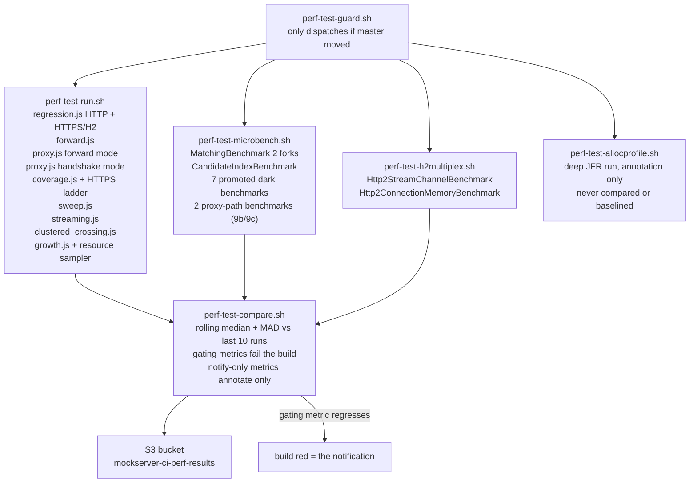
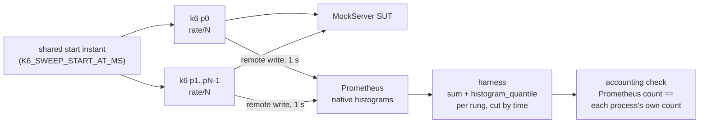
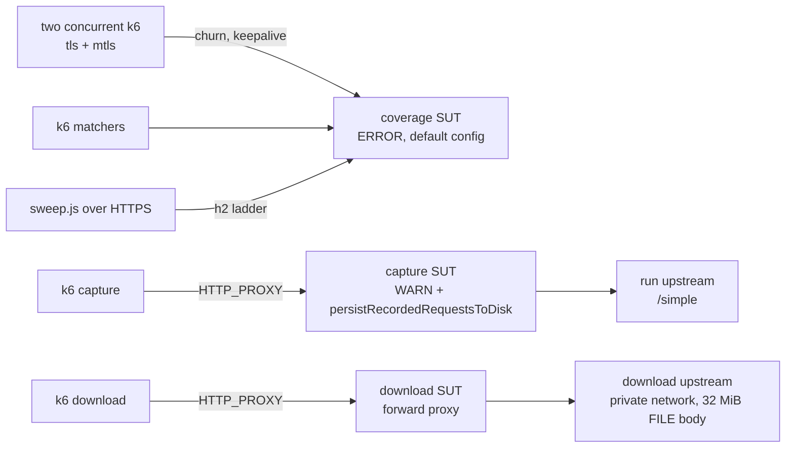
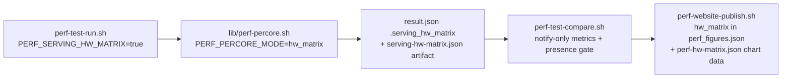

# Performance Measurement

The performance harness is **not** a uniform set of guards. Scripts exist for more scenarios than
CI executes, and of the executed scripts only a subset gate the build. Reading a number without
knowing which category it came from — linted only, executed once by hand, or gated daily — is how
regressions hide and stale claims get published.

## Summary

| Script / benchmark | What it measures | CI status | Fails build? |
|---|---|---|---|
| `regression.js` (HTTP + HTTPS/H2) | Per-behaviour latency percentiles and delivery ratio at 200 rps | Daily (perf queue) | No — notify-only |
| `growth.js` | Latency slope as the event log fills | Daily (perf queue) | No — notify-only |
| `sweep.js` | Throughput-vs-latency knee curve | Daily (perf queue) | No — notify-only |
| `rw-multi-k6-sweep.sh` (`sweep.js` from N processes, merged in Prometheus) | The same knee curve without the single-k6 ceiling (item 31) | **Opt-in** (`PERF_SERVING_RW_MULTIK6=true`) | No — never published; exits 2 on its own accounting/skew/window/cross-check gates |
| `forward.js` | Forward connection-pool regression guard | Daily (perf queue) | `forward.error_rate` only |
| `proxy.js` | Proxy and TLS handshake latency | Daily (perf queue) | No — notify-only |
| `proxy.js` forward + slow upstream | Unmatched-proxy in-flight concurrency cap (unit 21) | **Opt-in** (`PERF_WORKLOAD=forward`) | `workload_forward_served_via_upstream` validity check |
| `streaming.js` | LLM/SSE streaming concurrency vs match latency | Daily (perf queue) | No — notify-only |
| `clustered_crossing.js` | Cross-node request latency in a cluster | Daily (perf queue) | **Notify-only.** `perf-test-compare.sh` reads `clustered_state.*` as notify-only metrics. This measured NOTHING until the clustered image was published to the perf queue: the run gates the A/B on `docker image inspect`, nothing pulled or built that image, so every run took the absent-image skip and emitted no `clustered_state` block to read. The snapshot push now builds `mockserver-snapshot-clustered` in the same job, from the same jar and commit as the SUT image, and the run refuses to measure if the two image revisions disagree (`clustered_skip_reason=revision_mismatch`) — a ratio computed across two commits would be arithmetically fine and describe code the measured binary never contained |
| `MatchingBenchmark` JMH | Matcher hot-path time/op and allocation/op | Daily (perf queue) | Yes — `time_per_op` + `alloc_bytes_per_op` |
| `perf-alloc-gate.sh` (JMH `gc.alloc.rate.norm`) | Allocation/op for matching, inbound decode and response write at pinned params, plus a matching-scan arm | Per merge (every Java pipeline build) | Yes, all eight rows |
| `CandidateIndexBenchmark` JMH | Index vs scan scaling | Daily (perf queue) | No |
| Promoted dark benchmarks (7 classes, see below) | Various hot paths | Daily (perf queue) | No — notify-only |
| Proxy-path benchmarks (`RelayByteCopyBenchmark`, `SocksHandshakeBenchmark`) | CONNECT/relay byte cost; SOCKS handshake cost | Daily (perf queue) | No — notify-only |
| `Http2StreamChannelBenchmark` JMH | HTTP/2 streams-per-connection throughput and latency | Daily (perf queue) | No — by explicit design |
| `Http2ConnectionMemoryBenchmark` JMH | Retained heap per established connection (`bytes_per_connection`, shapes 1x1 / 10x10 / 100x10) | Daily (perf queue) | No — notify-only. `perf-test-compare.sh` reads `.h2_connection_memory` and annotates each shape's `bytes_per_connection` against the `h2_connection_memory.*.bytes_per_connection` budget every run; non-gating, so a move is surfaced but cannot fail the build until >=10 clean runs let a MAD-derived floor be set |
| `load.js` | p95 / p99 gate, ramping 50 -> 500 rps | Opt-in (manual / scheduled) | Yes — k6 thresholds |
| `coverage.js` + an HTTPS `sweep.js` ladder | Paths nothing else drives: HTTPS connection churn, client-certificate (mTLS) traffic, HTTP/2 at load, JSONPath / XPath / JSON-schema matchers over 100 candidates, disk capture under proxy load, large proxied downloads | Daily (perf queue), inside `perf-test-run.sh` | No — notify-only, `provisional` budgets |
| `stress.js` | Ramp past the knee | Lint only | Never executes in CI |
| `soak.js` | Sustained load over hours | Weekly (Sunday 08:00 UTC schedule, perf queue) and on demand in any build whose message contains `[perf-soak]` | Yes, for that build — k6 thresholds and a result-presence check; never compared or baselined |
| `scripts/perf/bench_startup.py` | Launch-to-ready variant matrix | Never runs in CI | Never |
| `inject` (`run-inject.sh`) | Load-injection ceiling | Opt-in | Never in daily pipeline |
| Hardware matrix (`lib/perf-percore.sh`, `PERF_SERVING_HW_MATRIX=true`) | Healthy ceiling per cores × container memory, for the public sizing table | Opt-in, manual build only | No — notify-only; only a wholesale producer failure reds (presence gate) |
| `perf-test-allocprofile.sh` (deep JFR) | Allocation per request, peak direct memory, top allocation sites over the load window, retained-heap histogram, and the CPU / lock / GC profile of the ceiling rungs alone | Daily (perf queue), separate step | No — `soft_fail`, never baselined; an under-sized recording is reported INVALID |

## The Daily Pipeline



`perf-test-guard.sh` skips the entire chain when `master` has not moved since the last run, so
the daily job is a no-op on unchanged code.

`perf-test-compare.sh` reads `behaviours.*`, `growth.*`, and `microbench.*` from the per-run
artifacts and gates only the metrics explicitly marked `gating: true` in the compare script.
Everything else is reported in the Buildkite annotation but does not change the exit code.

**Currently gating:**
- `MatchingBenchmark` — `time_per_op` and `alloc_bytes_per_op` per matcher type / expectation count, on the shipped-default `detailedMatchFailures=true` arm (keys `<matcherType>_100_detailed`)
- `forward.error_rate` (discriminating pass/fail, not a tuned threshold)

**Notify-only until ≥ 10 clean run history exists to derive a budget from:**
- All `regression.js` latency percentiles
- `sweep.js` `rig_valid_peak_achieved_rps` (extended from 16k to 64k in the current code)
- `growth.js` ratios and `live_set_bytes`
- All promoted dark benchmark metrics
- The proxy-path benchmark metrics (`RelayByteCopyBenchmark`, `SocksHandshakeBenchmark` — items 9b/9c), which share the `microbench_extra.*` budgets
- Every `path_coverage.*` metric (see [Path coverage](#coveragejs--path-coverage-notify-only)), whose budgets are also marked `provisional`

## What Each Harness Actually Measures

### `regression.js` — latency at a fixed offered rate

Four primary `constant-arrival-rate` scenarios (`match`, `forward`, `template`, `large`) run at
200 rps each over HTTP, then the same run repeats over HTTPS negotiating HTTP/2 via ALPN. Results are
keyed `<op>_<proto>`, e.g. `match_http`, `forward_https_h2`. Alongside the primary four, secondary
arms run at deliberately reduced rates — `template_mustache`, `large_1mb`, `large_10mb` and
`large_file`. The authoritative list is the arm string in `perf-test-run.sh` and the
`REGRESSION.*Rate` entries in `lib/config.js`; read those rather than this sentence.

Per behaviour it records:
- `p50_ms`, `p95_ms`, `p99_ms` — latency percentiles over the measured window (settle-excluded)
- `throughput_rps` — completed / duration; **not** pinned to the offered rate
- `delivery_ratio` — `throughput_rps / offered_rps`; the at-a-glance health indicator
- `offered_rps`, `dropped_iterations` — make a `throughput_rps` shortfall interpretable

**`throughput_rps` is not a throughput ceiling.** It is a delivery ratio against a fixed offered
rate of 200 rps. A `delivery_ratio` below 1.0 means the client could not deliver all iterations —
the server got slower, or the VU pool ran out, or both. Use `sweep.js` to find the actual ceiling.

The script runs with `preAllocatedVUs == maxVUs` so no VU allocation happens mid-run (the original
design had a mid-run ramp that caused a connection storm and 1–3 second p99 tails even when the
server was fast). A per-scenario settle window at the start of the measured window is excluded and
reported as `settle_excluded` so it is auditable.

### `sweep.js` — throughput-vs-latency knee

Offers the match path at an ascending ladder of fixed rates and records per rung: `achieved_rps`,
`p50_ms` through `p999_ms`, and `error_rate`. The ladder now extends to 64,000 rps; the earlier
16,000 ceiling sat below saturation so the knee could not be observed.

**Rung-onset exclusion.** Each rung's latency percentiles (`p50_ms`–`p999_ms` and `phase_ms`)
exclude its first `K6_SWEEP_SETTLE` seconds (default 3 s). CI sets it from `PERF_SWEEP_SETTLE_S`
for the main and INFO ladders and from `PERF_PERCORE_SETTLE_S` / `PERF_MULTI_SETTLE_S` for the
per-core and multi-process rigs — in each case the value that already trims the start of the
rung's CPU-attribution window; their unmeasured warm-up drives pass `0s`. The onset is a rig transient,
not server latency: in build 464, 5,337 of the 24,000 rps rung's 5,343 stalls fell in its first 2.5 s
(the first of six time buckets of the 15 s rung), and a steady 24,000 rps run (build 473) measured p99 0.343 ms
against 10.6 ms on that ladder rung. Only the percentiles change: `achieved_rps`, `error_rate`,
`dropped_iterations`, `sample_count` and the VU/stall diagnostics still cover the whole rung, so
rig validity, occupancy, `rig_valid_peak_achieved_rps` and `saturation_rps` are derived exactly as
before. Each result records `latency_window.settle_s`; per rung, `settle_excluded` counts the
excluded requests, `measured_sample_count` the requests behind the percentiles, `full_rung_ms`
the whole-rung percentiles, and `stalls_post_settle` the stalls left after the window opens (set
against `stalls`, a large remaining share at a sub-knee rung suggests the settle is too short).
Each rung stays one scenario, so its VUs and their connections carry across the settle boundary;
each VU switches a VU-level `win` tag (`<rate>_settle` → `<rate>_steady`) the first time it
starts an iteration past the boundary, and the percentiles are read from the
`{win:<rate>_steady}` submetrics. Every request therefore lands in exactly one window, and the
harness checks it: a main sweep where any rung's `measured_sample_count + settle_excluded`
differs from `sample_count`, or (with a settle window and no drops) either window is empty, fails
the `sweep_latency_window_accounts_every_request` validity
check (the run is invalid and compare fails the build), and the per-core and multi-process rigs
record that core or process count as a failure skip (`lib/perf-sweep-window.sh`).

The healthy operating ceiling is the highest rung where `achieved_rps` is within 5% of
`offered_rps` **and** latency is within a stated multiple of the flat-ladder baseline. The peak
`achieved_rps` (top of the overload curve) is a different, higher number; do not publish one
without the other.

**Rig validity and the `vus_active_p95` criterion.** A rung is rig-valid when the k6 client had
CPU headroom, low errors, and the VU pool was not exhausted. The original check keyed off
`vus_active_max`, which is right-censored: it cannot exceed the pool size, so a single stall
pileup that temporarily drains the pool makes the rung read as client-limited even when the pool
sat at 1% utilisation for 95% of the measurement. Switching to `vus_active_p95 < pool`
(`bac8a96b7`) fixed the low rungs but was still wrong at the knee: it is true even at 95%
occupancy, so it discarded the saturating rung it existed to find. The current discriminator
(`derive_saturation` in `.buildkite/scripts/steps/lib/perf-derive-saturation.sh`) is the occupancy **ratio**
`vus_active_p95 / pool`: at or above 0.80 the pool is the binding constraint (VUs blocked on server
responses → server-limited → keep, and label the knee); below 0.80, drops over the 1% tolerance are a
client-side scheduling stall → exclude. 0.80 sits in the widest gap of the observed ladder (a pinned
rung reads ~0.86–0.95; a client-limited idle pool ~0.01–0.02). When `vus_active_p95`/`pool_per_rung`
are absent (older artifacts) the rule stays strict zero-drop.

k6 CPU headroom is judged on the **mean** over the rung's steady window, with the sampler's first
(startup) `docker stats` reading dropped; the max is still recorded as `k6_cpu_pct_max`. A per-rung
MAX made one cold-read spike look like sustained client saturation, and a high percentile of a
window holding ~4 samples is effectively the max.

**Client-limited rungs (`client_limited`).** A rung is excluded as client-limited when either:

| Test | Condition | Why |
|---|---|---|
| k6 CPU | mean k6 CPU above 85% of k6's capacity (`client_cpu_ceiling_pct`) | With no hyperthread siblings in k6's pin this is 85% of the pin, as before. When the pin holds both siblings of a core, a sibling is counted as a quarter of a core, so the ceiling on a fully paired pin is ~62% of the logical pin |
| Short with server headroom | the rung dropped more than the 1% tolerance, **and** the SUT's mean CPU over the same window was below 85% of its pin, **and** either k6 was at least half its CPU ceiling, or a lower rung already met this test (`client_limited_from_rps`) and k6 is still at a quarter of its ceiling | In runs 502–504 k6 was the bottleneck at 44–82% of its pin on the rungs this flags, below the 85% test (the one 87% rung is flagged by the k6 CPU test), while the SUT used 250–410% of its 600%. A short rung with an idle VU pool is already excluded by the drop rule, so the k6-busy clause matters for pinned-pool rungs: it keeps one that is server-limited with an idle client rig-valid. The carry-up covers k6 CPU falling past its own knee as VUs block; its quarter-ceiling floor stops it blaming an idle client. The exclusion reason says "short with server CPU headroom; client or non-CPU limit (unattributed)", because the test cannot tell the two apart |

Each rung records `server_cpu_pct` (from `diag-samples.csv`), `server_cpu_samples` and
`client_limited`. Both the k6 and the server CPU windows start at k6's own rung start
(`points[].start_epoch_ms`) when the sweep records it, otherwise at the ladder's host-side T0, so
the two tests judge the same seconds. `.saturation.server_headroom_test`
says whether the second test ran: `active` (every rung had at least two server CPU samples, the
minimum it judges on; the diag sampler gives 2–4 per 12 s window), `partial` (some rungs had fewer,
so the test was off for them) or `off`. Only the main ERROR ladder has a server CPU
log. The INFO-arm and HTTPS/h2 path-coverage ladders run against SUTs the sampler does not watch, so
they, and any run with an unpinned SUT, read `off` and only the k6 CPU test applies.
`lib/perf-percore.sh` (per-core, hardware matrix) keeps its own 85%-of-pin rule.

**Published figures from a client-limited run.** `perf-website-figures.jq` publishes rig-valid
rungs only. When no rung above the healthy ceiling is rig-valid (or there is none), no overload
was measured: `headline.no_measured_overload` is true, the `peak_*` fields are null, and the page
and chart omit the overload sentences and peak. When, in addition, the next rung up was
client-limited, `headline.lower_bound` is set (with `lower_bound_reason`): the rig, or a limit
other than server CPU, stopped the ladder, so the page and chart show the ceiling as "at least" /
"≥". A rig-valid but unhealthy rung above the ceiling is a measured overload, so that run is
neither. `perf-website-publish.sh` holds (fails the soft-fail step, emits no patch, keeps the
committed figures) when a lower bound would *lower* the committed `headline.healthy_ceiling_rps`,
or when the committed file exists but that field is absent or not a number; it refuses a
committed file that is not valid JSON ("COMMITTED FIGURES UNREADABLE"). With no committed file,
or a lower bound that matches or raises it, it publishes normally. Because the server-headroom
test cannot tell a client limit from a non-CPU server limit, **the hold also withholds a real
server regression of that kind.** Read a "HELD" annotation alongside the compare step's
`rig_valid_peak_achieved_rps` trend and `saturation.client_limited_from_rps`: a client-limited
region that starts at a lower rung than before points at the server. Until #31's multi-process
k6 measures past the client knee, expect the hold on every daily publish run.

Known limits of the server-headroom test:

- **A server limited by something other than CPU** (a lock, one saturated thread, transient
  stalls) also reads below 85% and is labelled client-limited. At high rates k6 is always busy,
  so the k6-busy clause cannot separate the two there. The effect is conservative: excluding a
  rung can only lower `rig_valid_peak_achieved_rps`, so a server regression still shows as a
  drop, only with the wrong reason text. The 2-core-server runs 448–450 show why the clause
  matters: their short knee rungs had the SUT at 51–83% of its pin and k6 at 18–32% of its
  ceiling. Without the clause they would be labelled client-limited.
- **The SUT's idle CPU is partly caused by the client not sending.** That is the case the test is
  meant to catch, not a false positive.
- **`rig_valid_peak_achieved_rps` is now roughly ladder-quantised.** On this rig the client limits
  every rung from ~44–52k up, so the peak is the highest rung below that with drops under 1%:
  39.7–47.7k in the six-core runs 451–511, against 55.9–59.9k under the previous rule. It still moves with
  harness cost (the client-limited region starts lower), but every such move now comes with
  `client_limited` rungs saying so. Only more client capacity separates the two.

**VU-pool growth check.** `vus_diagnostics.vus_pool_grew` compares k6's initialised VU count
(`vus_max`) with `vus_initialized_baseline`, the count k6 plans before the test starts: the largest
sum of rung pools whose reservations (start to start + step + the 30 s default `gracefulStop`)
overlap. k6 reuses VUs across rungs that do not overlap, so the baseline is not the sum of all pools
(6,144 on the default ladder, not 16,800); each of the 30 stored runs from 441 to 504 initialised exactly its
planned count. With `preAllocatedVUs == maxVUs` it must read `false`.

**Ladder granularity.** A 2,000-rps gap between rungs cannot reliably locate a knee. In build
420 (2026-09-24) the 38,000-rps rung dipped just below the ratio floor (0.949 vs 0.950); without
finer rungs at 39,000 and 41,000, the reported healthy ceiling would have been ~36,000 rather than
41,000. When placing rungs near a suspected knee, use gaps of 1,000 rps or smaller.

**Where the tail is (notify-only, every daily run).** k6 counts a request over 5 ms as a stall;
the server records `mock_server_request_duration_seconds`, scraped into `diag-samples.csv`. Per rung,
the run sets the two side by side as `sweep_tail.rungs[]` in `perf-result.json`
(`client_over_5ms_frac` is `stalls_post_settle / measured_sample_count`; `server_over_5ms_frac` is
the `req_dur_le_5ms` delta between the first and last `diag-samples.csv` rows inside the rung's
post-settle window, with `server_window_s` and `server_requests` saying how much of the rung that
covers), and the compare annotation prints them as a table. Rung windows come from each point's
`start_epoch_ms` (the k6 scenario's own start), not from the host clock before `docker run`, which
precedes it by k6 start-up and `setup()`. A rung with fewer than two scrapes in its window reads
`n/a` on the server side. Nothing is budgeted or compared.

The server column covers only MockServer's request handler: the histogram starts when
`HttpRequestHandler.channelRead0` builds its response writer, after the socket read, HTTP decode and
aggregation, and stops at the response hand-off, before the flush. Event-loop queueing, decode, the
flush and any pause outside that span are not in it. So a client tail with no server tail is outside
the handler — the rig, the network, **or** MockServer's own event-loop queueing, decode or flush — and
a saturated worker event loop would look exactly the same. To tell them apart, read k6 CPU against
its pin (the sweep's exclusion reasons) and per-worker event-loop CPU (the deep run's ceiling
per-thread table). Build 502 is the worked case: from 44,000 rps up k6 saw 19–27% of requests over
5 ms and the handler at most 0.004% (rung starts reconstructed, since that run predates
`start_epoch_ms`), and its ceiling JFR showed no thread above ~45% of a core with the server at 275% of
its 600% CPU. The two together, not the table alone, put that tail outside MockServer. A server-side
accept-to-flush (or decode-to-flush) timer would close the gap; it is not built.

**Ladder anchor rule.** Always include at least one rung *below* the expected knee. A ladder that
starts above the cleanly-served region reports `saturation_rps=0` — every rung is already in
overload, so none qualifies as the healthy ceiling — which looks like a defect and is not. The
default ladder (500, 1,000, 2,000, 4,000, 8,000, 16,000, 24,000, 32,000, 36,000, 40,000, 44,000,
48,000, 64,000 rps) begins well below the knee for exactly this reason. A manual `K6_SWEEP_RATES`
ladder must also start below the client knee (~44k on this rig): if every rung is client-limited, no
rung is rig-valid and the run fails `sweep_client_had_headroom` (the 44–64k ladder of run 447 would
now fail this way).

### `rw-multi-k6-sweep.sh` — the knee curve from N merged k6 processes (opt-in, item 31)

**Outcome.** At the published ceiling one k6 process spends ~4x the server's CPU per request, so
the top of the ladder measures the load generator. `mockserver-performance-test/scripts/rw-multi-k6-sweep.sh`
offers each rung from N **independent** k6 processes (1/N of the rate each, no k6-side
coordination), all starting the ladder at one wall-clock instant and pushing native histograms to
a pinned Prometheus by remote write. Latency is a **true merged percentile**
(`histogram_quantile` over the summed histograms), throughput is the summed request count, and the
healthy ceiling comes from `lib/perf-website-figures.jq` unchanged. It is opt-in and never
published; switching the published method over is a separate, approved step after a rig
cross-check.



| Gate (fail-closed: `valid: false`, exit 2) | What it proves |
|---|---|
| `rw_accounting` | Per rung and per process, `k6_http_reqs_total` and the histogram count in Prometheus equal the process's own end-of-run `http_reqs` count (tolerance `PERF_RW_ACCOUNT_TOL`, default 0). A lost flush or a process that died without a summary cannot pass |
| `rw_processes_exited_cleanly` | Every process exited 0 and wrote its summary |
| `rw_start_skew_within_bound` | Each rung's `exec.scenario.startTime` agrees across processes within `PERF_RW_MAX_SKEW_MS` (100) |
| `rw_settle_cut_within_bound` | Each process's settle cut lands between its settle boundary and 2 push intervals after it (wall-clock mode) |
| `rw_settle_cut_measured` | In wall-clock mode every process has a measured cut and cut excess; a missing one (no sample after the boundary, a failed query, a dead process) fails rather than passes |
| `rw_rungs_measured` | Every ladder rung was merged with a number for its count, achieved rps and p50 |
| `rw_assembly_steps_ok` | The cross-check phase and every post-measurement step (merge, sweep assembly, rig validity, headline, per-process detail, cross-check comparison) completed. A failing step is replaced by a default and named here, so the result is still written |
| `rw_prometheus_queries_ok` | Every Prometheus query succeeded. A failed query is recorded and read as an empty result, so the run completes and reports this reason instead of aborting |
| `rw_settle_cut_excess_bounded` | The requests each process completed between its settle boundary and its cut (the counter at the cut minus the counter at the boundary) are no more than its offered rate over 2 push intervals (+`PERF_RW_WINDOW_TOL`, 5%). It measures what a late cut dropped from the steady window directly, so a rung whose throughput collapses under saturation does not trip it |
| `rw_window_accounts_every_request` | Every merged rung's settle + measured counts equal its request count (`lib/perf-sweep-window.sh`); true by construction in wall-clock mode, so the two gates above carry the window |
| `rw_cpu_sampled_every_rung` | At least one k6 CPU sample fell in every rung's steady window; `derive_saturation` would otherwise read the rung as 0% CPU, i.e. headroom |
| `rw_cross_check_same_requests` | One k6 in the published summary mode, **also** remote-writing, measures rungs up to `PERF_RW_XCHECK_MAX_RPS` (24,000); its summary percentiles and the Prometheus merge of the same requests agree within p50 10%, p95 10%, p99 15% (0.005 ms floor) |
| `rw_no_failed_pushes` | No k6 remote-write send failure |
| `rw_no_slow_flushes` | No flush took longer than the push interval (k6 warns that samples may then be dropped); `.remote_write.slow_flushes` reports the count and the longest. This also catches Prometheus stalls of 1–2 s, too short for the cut gates. On a contended host it trips first; raise `PERF_RW_PUSH_INTERVAL_S` rather than loosen the gate |

**Fail fast before measuring.** Three checks stop the harness (`valid: false` with
`rw_harness_completed` naming the reason, exit 1) before it spends rig time on a result that
cannot be valid:

| Check | When | What it catches |
|---|---|---|
| DNS label guard | Before any container starts | A host in `RW_URL` or the target URL with a DNS label over 63 characters. k6's Go resolver refuses such a name, so every push fails with `no such host`. The check reads the assembled URLs, not the alias constants |
| Remote-write pre-flight | Once Prometheus is ready, before the SUT, warm-up or any rung | One k6 inside the run's network pushes through the same `experimental-prometheus-rw` output and URL the ladder uses. Any push failure in its log, or its `k6_iterations_total{proc="preflight"}` not reaching Prometheus within 10 s, stops the run in seconds (`preflight.log` is kept) |
| Cross-check push failures | After the cross-check phase, before the main phase | A push path that broke after the pre-flight. Stopping here saves the main phase and its merge, several minutes on the rig |

Containers reach Prometheus and a launched SUT through short aliases (`rw-prom-<cksum>`,
`rw-sut-<cksum>`, where the checksum is taken over the run ID). They never use the container
names: `mockserver-rw-prom-<36-character build ID>-<pid>-rw` is 64 characters once the PID has 5
digits. The alias is unique per run because `PERF_RW_NETWORK` may be a shared network.

`cross_check.cross_run` separately compares the N-process rungs with that single-process run at
the same aggregate rate (achieved ratio within 0.02; p50/p95/p99 within 20/35/60%) — two separate
runs, so it carries run-to-run noise and is reported, with `cross_check.equivalent`, rather than
gating validity. Rungs above `PERF_RW_XCHECK_MAX_RPS` are listed with `status: "no counterpart"`,
and a rung with a missing figure as `"incomplete"`; neither is divided or compared.

**Once inputs are validated and an output file is given, a result is always written.** A soft step that fails (the cross-check phase, or any
post-measurement step: `xcheck_phase`, `merge_main`, `sweep_json`, `saturation`, `headline`,
`per_process`, `cross_check`, the only values `PERF_RW_TEST_FAIL_STEP` accepts) is recorded by
`rw_assembly_steps_ok` and replaced by a default. If the harness still aborts, its exit trap writes
`valid: false` with an `rw_harness_completed` check naming the command running when it exited (for
a pipeline, its last stage; read from `$BASH_COMMAND` before the trap runs anything, so it works
inside functions too), plus the main phase's merged rungs. A deliberate stop names its own reason,
and SIGTERM / SIGINT (a cancelled build) are recorded as such, exiting 143 / 130 after cleanup.
Unknown `PERF_RW_TEST_FAIL_STEP` or `PERF_RW_TEST_NULL_RUNG` values are rejected at startup with
exit 2. The first 50 Prometheus query warnings (for example an
empty result from mixing float and histogram samples) are kept under `.prometheus.query_warnings`,
and `.method.test_hooks` records any test hook that was set. In `perf-test-run.sh` a non-zero exit
or an invalid result also uploads `serving-rw-multik6-work.tgz` (`PERF_RW_DEBUG_DIR`): the
harness's JSON, CSV and text files, the full k6 logs, the Prometheus server log and a series
inventory (`prom-series-inventory.json`).

**Why these choices.**

- **Native histograms, not trend gauges.** `K6_PROMETHEUS_RW_TREND_STATS` gauges (as the local
  stack uses) are per-process percentiles and cannot be merged. k6's native histograms use a 1.1
  bucket factor, so a quantile is resolved to within ~5%; on the same requests the local
  cross-check agreed to within 3.5% at p50–p99.
- **Windows as time ranges.** Every request carries its rung's `rate` tag, so each rung is its own
  series and its final cumulative value is exact. Each process's settle cut is the first pushed
  sample at or after `rung start + settle`, and the steady histogram is the rung's final histogram
  minus the one at the cut. The cut never lands inside the settle window, and
  `rw_settle_cut_within_bound` rejects one more than 2 push intervals late (it normally lands
  up to about one push interval late; a stalled Prometheus pushes it later and fails the run).
  The cut is taken from each process's dominant series, so a sparse error series cannot set it. This lets `sweep.js` drop its `win` tag
  (`K6_SWEEP_WINDOW_MODE=wallclock`); `PERF_RW_WINDOW_MODE=vu_tag` keeps it and splits by label.
- **Start synchronisation.** The harness picks `start = now + PERF_RW_START_LEAD_S`; `setup()`
  sleeps until then, so every process's scenario offsets count from the same instant. Process 0
  seeds (and at the end resets) the SUT before the start; the others do not touch it. Observed skew
  locally was 0–9 ms; each process's `setup_end_minus_start_at_ms` (and the maximum under
  `.method`) shows whether `PERF_RW_START_LEAD_S` left enough time for VU initialisation.
- **Flush safety.** k6 flushes once more when it stops, but a flush that fails, or a process that
  dies, loses the tail; the `quiet_tail` scenario (`PERF_RW_QUIET_S`, at least 2x the push interval,
  default 5 s) keeps every process alive past its last rung, and the accounting gate catches
  whatever is still lost. Stale markers stay off so a rung's final value remains queryable, and
  Prometheus runs with a 2 h lookback so every rung is read at one instant.
- **Rig validity reuses the published rule.** `derive_saturation` lives in
  `lib/perf-derive-saturation.sh` (moved verbatim out of `perf-test-run.sh`) and is fed the busiest
  process's CPU scaled to one pin, the summed drops and the busiest process's `vus_active_p95`
  against its own pool; its CPU windows start at the earliest measured rung-0 start.
  `.per_process[].per_rung` records each process's CPU mean, fraction of pin and drop fraction.
  **Hyperthreads:** a process on 4 physical cores with both hyperthreads has an 800% pin it
  cannot reach, so the harness passes `K6_PHYS_CORES` and the k6 CPU test uses the
  hyperthread-aware ceiling (62.5% of that pin; see [Client-limited rungs](#sweepjs--throughput-vs-latency-knee)).
  The SUT's CPU from the same `docker stats` sampler, against a pin of `PERF_RW_SERVER_CPUS`,
  turns on the server-headroom test (`server_headroom_test: "active"`). A short rung with the
  server under 85% of its pin is then client-limited, so the result tells a client limit from a
  server one. The test is off only for an external target without an explicit
  `PERF_RW_SERVER_CPUS`, because its pin is unknown.
- **Placement.** SUT, Prometheus and every k6 process are proven physically disjoint by
  `lib/perf-cpu-topology.sh`. On the 48-vCPU rig the defaults are SUT on physical cores 0–5,
  Prometheus on core 23 (vCPUs 23,47), and four k6 processes on four physical cores each, both
  hyperthreads (`7-10,31-34` … `19-22,43-46`), which keeps the SUT's siblings idle. Override with
  `PERF_RW_SERVER_CPUS`, `PERF_RW_PROM_CPUS`, `PERF_RW_K6_CPUSETS` (`;`-separated) and
  `PERF_RW_PROCS`.
- **Running the harness inside a container.** `PERF_RW_PUBLISHED_HOST` (for example
  `host.docker.internal`) replaces the host of the ports the harness itself publishes (its
  Prometheus and, when it launches one, the SUT). It does not touch `PERF_RW_TARGET_CURL_URL`.

**k6 CPU per request** (cgroup `usage_usec` over the load window, one k6 on 4 vCPUs at 8,000 rps,
three interleaved rounds on a laptop shared with other load, so ±8 µs noise):

| `sweep.js` mode | µs/request |
|---|---|
| Published (VU-tag window, full summary, no remote write) | 143 |
| Published + remote write | 152 |
| Remote write, wall-clock window, lean summary, VU diagnostics on (harness default) | 144 |
| Remote write, wall-clock window, lean summary, VU diagnostics off | 127 |
| Same, 5 s push interval instead of 1 s | 123 |
| No remote write, lean summary, diagnostics off: wall-clock / VU-tag window | 122 / 130 |

Remote write costs ~5–9 µs/request, and a 1 s push interval costs no more than 5 s within the noise. The
per-iteration `vusActive` sample and stall accounting cost ~17 µs; they stay on by default because
`derive_saturation`'s occupancy rule needs `vus_active_p95` (with them off, any drop makes a rung
rig-invalid). The saving that lifts the ceiling is from dividing the rate across processes;
per-process cost stays about where the published mode is.

**Ladder.** The harness has its own default ladder: the published rungs up to 48,000, then
56,000, 64,000, 72,000, 80,000 and 96,000 rps (17 rungs, about 80 s longer than the published
13). Split over four processes the client knee moves up. In build 527 the SUT used about 250–300% of
its 600% pin at 64k, so the published ladder stopped below any server knee. Each process's VU
pool is `0.08 × its own rate`, so the four pools add up to what one process would get at the
aggregate rate, and more above 25,600 rps, where one process's pool caps at 2,048, and below
~4,800 rps, where the 96-VU floor applies (Little's law holds per process too). At the 96k top that is 1,920 VUs per process.
k6 initialises about 4,960 VUs per process over the overlapping top rungs, which took ~3 GiB per
process locally, so a local run with fewer than four processes needs a short `PERF_RW_RATES`
(the default ladder OOM-kills a k6 container in an 8 GiB Docker Desktop VM). `Insufficient VUs` warnings on sub-knee rungs are the transient-stall signature
the single-process ladder shows too (build 527: pool hit at 4k–24k with p95 active VUs 3–7). The
occupancy rule reads them as stalls, so they are not a sizing fault.

**Running it.** `PERF_SERVING_RW_MULTIK6=true` on a perf build runs it against the main SUT right
after the published sweep and stores the result under `.serving_rw_multik6`
and the `serving-rw-multik6.json` artifact; that run is not baseline-eligible. It uses the
harness's own ladder unless `PERF_RW_RATES` is set, or `K6_SWEEP_RATES` is set explicitly (the
allocation-profile run's short ladder), in which case it follows that. It adds ~11–12 min, and
`perf-test-guard.sh` raises the run step's timeout by 15 min when the flag is set. For a trial also
set `PERF_INFO_ARM=false` and `PERF_COVERAGE=false`, the two default-on phases the run step's
timeout comment names as removable. Locally:

```bash
PERF_RW_PROCS=3 PERF_RW_RATES=1500,3000,6000,9000 PERF_RW_STEP=12s PERF_RW_GAP=4s \
  mockserver-performance-test/scripts/rw-multi-k6-sweep.sh .tmp/rw.json
# degrade tests — each must end "valid": false and exit 2
PERF_RW_DEGRADE=kill:1 PERF_RW_XCHECK=false ... rw-multi-k6-sweep.sh .tmp/rw-kill.json      # process dies before its last push
PERF_RW_DEGRADE=pause_prometheus PERF_RW_XCHECK=false ... rw-multi-k6-sweep.sh .tmp/rw-pause.json   # final pushes fail
PERF_RW_DEGRADE=stall_prometheus PERF_RW_XCHECK=false ... rw-multi-k6-sweep.sh .tmp/rw-stall.json  # 4 push intervals stalled across a settle boundary
# cut-gate self-tests: a failed cut query, and a null cut on a live process
PERF_RW_TEST_CUT_FAULT=main-p1:query PERF_RW_XCHECK=false ... rw-multi-k6-sweep.sh .tmp/rw-cutq.json
PERF_RW_TEST_CUT_FAULT=main-p1:empty PERF_RW_XCHECK=false ... rw-multi-k6-sweep.sh .tmp/rw-cute.json
# main ladder above the cross-check cap: must stay valid, top rungs "no counterpart"
PERF_RW_PROCS=2 PERF_RW_RATES=1500,3000,6000 PERF_RW_XCHECK_MAX_RPS=3000 ... rw-multi-k6-sweep.sh .tmp/rw-cap.json
# the result is written, invalid, when a merged rung is blank or a step fails
PERF_RW_TEST_NULL_RUNG=1500 ... rw-multi-k6-sweep.sh .tmp/rw-null.json
PERF_RW_TEST_FAIL_STEP=cross_check ... rw-multi-k6-sweep.sh .tmp/rw-failstep.json   # or any step named above
# a hard abort inside a function still leaves an invalid result naming the failed command (exit 125)
PERF_RW_K6_IMAGE=grafana/k6:does-not-exist PERF_RW_XCHECK=false ... rw-multi-k6-sweep.sh .tmp/rw-abort.json
```

The fail-fast checks have no hook; they are degrade-tested on a temporary copy of the script.
Set `PROM_ALIAS="$PROM_NAME"` with a 36-character `BUILDKITE_BUILD_ID` and a 5-digit PID, and the
guard must stop the run at once. Also disable the `assert_dns_host "remote-write URL"` line, and
the pre-flight must stop it within seconds on `no such host`. Point only the cross-check phase's
`K6_PROMETHEUS_RW_SERVER_URL` at an unknown host, and the run must stop before `phase=main`.

### `forward.js` — forward connection-pool guard

Guards `mockserver.forwardConnectionPoolEnabled`. The guard runs against a dedicated upstream
MockServer instance, not a loopback. With pooling enabled the `forward.error_rate` stays near
zero at 1,500 rps. With pooling off, ephemeral port exhaustion produces `BindException`s and the
rate spikes. This is the one k6 script whose error-rate threshold actually gates the daily build.

### Opt-in workload — unmatched-proxy concurrency (unit 21)

**Status: drafted, awaiting approval — not yet enabled on any scheduled run.** Gated on
`PERF_WORKLOAD`, which is empty by default, so the standard daily/regression run is byte-for-byte
unchanged and stays baseline-comparable. Setting `PERF_WORKLOAD=forward` labels the result
`config_profile=workload-forward`, which flips `baseline_eligible=false` (same lever as a tuned run),
so the run is recorded but never persisted to the default-configuration baseline.

Why it exists: the default `forward.js` arm drives a **matched** `/forward` expectation, which uses
the already-async forward path unit 21 did not change; and `proxy.js`'s unmatched-proxy arm hits a
**fast** upstream at ~200 rps, so in-flight concurrency (~0.04) stays far below the old ~poolSize cap.
Neither can show unit 21.

**`PERF_WORKLOAD=forward`** (needs `PERF_UPSTREAM_DELAY_MS>0`, e.g. `50`): **resets the SUT** (a prior
handshake phase seeds a persistent `/simple` mock on it, which would otherwise match the proxied
request and defeat the whole point), re-seeds the run's upstream `/simple` with a server-side delay,
then re-drives `proxy.js` forward mode (absolute-URI = `handleUnmatchedProxyForward`, the path unit 21
changed) at elevated concurrency (`PERF_WORKLOAD_FORWARD_RATE`, `PERF_WORKLOAD_FORWARD_VUS`). With
`offered_rate × upstream_latency` above the blocking action-handler pool, the cap binds and shows as
`forward_absolute_proxy` `delivery_ratio < 1` and a p99 blow-up. Read the effect by A/B-ing a
**pre-21** vs **post-21** image (`MOCKSERVER_IMAGE`) at the same delay/rate: post-21 sustains far more
in-flight before the delivery ratio drops. Result (with the setup HTTP codes and the p50 floor) lands
under `.workload.forward`.

**Fail-closed (design goal 4).** The validity check `workload_forward_served_via_upstream` reds the
build unless the SUT actually **forwarded** to the slow upstream, proven by three things together:
(1) the SUT reset, upstream reset and upstream seed all returned their expected HTTP codes
(200/200/201 — checked explicitly, since `curl` without `-f` treats 4xx/5xx as success); (2) the
`forward_absolute` arm relayed responses (`sample_count>0`; `proxy.js` `setup()` also aborts if the
relay does not work); and (3) its **p50 ≥ `PERF_UPSTREAM_DELAY_MS × 0.8`** — a `/simple` mock on the
SUT or a fast/shadowed upstream answers in ~0 ms and cannot clear this floor, so it goes red. Any
failure → the check is false → `validity.valid=false`.

Trigger a run (perf queue, one at a time):

```bash
# unit 21 — proxy concurrency with a 50 ms upstream
bk build create -p mockserver-performance-test -b master -m "[perf-run] unit21 proxy concurrency" \
  -e PERF_WORKLOAD=forward -e PERF_UPSTREAM_DELAY_MS=50
```

### `coverage.js` — path coverage (notify-only)

Six request paths that no other daily arm drove now run in the daily `perf-test-run.sh` (not in
`PERF_NETWORK_MODE=host` runs, and not in the allocation-profile step), each against a fresh,
dedicated SUT, and land under `.path_coverage` in `perf-result.json`. Every
metric is notify-only with a `provisional` budget. The phase is estimated at about 7 to 8 minutes on
the perf box (the `perf-run` step timeout went from 60 to 70 minutes to make room);
`PERF_COVERAGE=false` turns it off and `PERF_COVERAGE_ARMS` runs a subset.



| `PERF_COVERAGE_ARMS` group | Arms (`.path_coverage.arms.*`) | What runs | Budgeted metrics |
|---|---|---|---|
| `churn` | `tls_churn`, `mtls_churn` | `noConnectionReuse`: a fresh TCP + TLS handshake per request, 200/s per arm, without and with a client certificate | `p50_ms`, `p99_ms`, `handshake_p50_ms`, `handshake_p99_ms`, `handshakes_per_s`, `delivery_ratio`, `error_rate`; on `mtls_churn` also `p50_ratio`, `p99_ratio`, `handshake_p50_ratio` against `tls_churn` |
| `keepalive` | `tls_keepalive`, `mtls_keepalive` | Reused connections (HTTP/2 via ALPN), 200/s per arm, on a server at its default `ClientAuth.OPTIONAL` | `p50_ms`, `p99_ms`, `delivery_ratio`, `error_rate`; on `mtls_keepalive` also `p50_ratio`, `p99_ratio` |
| `matchers` | `jsonpath_100`, `xpath_100`, `jsonschema_100` | 100 expectations per matcher type on one literal `POST` path (one candidate-index bucket); the request matches only the last one registered, so every request evaluates all 100; 100/s per arm over HTTP | `p50_ms`, `p99_ms`, `delivery_ratio`, `error_rate` |
| `h2` | `h2_2000`, `h2_8000`, `h2_16000`, plus `.h2_ladder` | `sweep.js` over HTTPS after a one-request k6 probe proves k6 negotiates `HTTP/2.0` with the SUT over ALPN; 15 s rungs, 5 s settle, judged by the daily ladder's own `derive_saturation` rig-validity rules | per rig-valid rung `p50_ms`, `p99_ms`, `delivery_ratio`; `error_rate`; `h2_ladder.rig_valid_peak_achieved_rps` |
| `capture` | `capture_proxy` | A SUT at `WARN` persisting every recorded request to a host-mounted NDJSON file, under absolute-URI proxy load at 1,000/s to the run's upstream | `p50_ms`, `p99_ms`, `delivery_ratio`, `error_rate`, `dropped_ratio`, `persisted_ratio`, `ring_occupancy_peak_ratio` |
| `download` | `download_32mib` | A SUT as a forward proxy relaying a 32 MiB `FILE` body from an upstream on a private network k6 is not on, 2/s with 8 VUs | `p50_ms`, `p99_ms`, `delivery_ratio`, `error_rate`, `received_mib_per_s`, `rss_peak_mib`, `netty_direct_peak_mib`, `direct_pool_peak_mib` |

Arms also carry descriptive fields that are recorded but not compared: `capture_proxy` has the
raw `dropped_log_events`, `evicted_log_entries`, `requests_received`, `persisted_records`,
`persisted_bytes`, `ring_capacity`, `ring_occupancy_peak` and `drain_s` (seconds the ring took to
empty before the file was counted); `download_32mib` has `rss_baseline_mib`, `rss_after_mib`,
`heap_peak_mib`, `netty_direct_baseline_mib`, `upstream_requests` and `proxied_ratio` (downloads
the private upstream served over requests k6 sent; a problem below 0.9); each `h2_*` rung has `rig_valid` and
`exclude_reason`. Memory and transfer figures are binary MiB (1,048,576 bytes), hence the `_mib`
names. A metric the image does not export (an older release has no
`netty_direct_memory_used_bytes` or event-log ring gauges) is null and is not compared.

**Why these paths.** The item 14 handshake arms measure TLS handshake time at 50/s, and their
mTLS SUT *requires* a certificate. Nothing measured request latency under connection churn, or
client certificates against the default server, where MockServer maps the peer certificate chain
into every request. HTTP/2 was only ever driven at 200 rps. No arm matched on JSONPath, XPath or
JSON schema, ran with disk capture on, or relayed a body larger than 10 MB through the proxy.

**Why each tls/mtls pair is two concurrent k6 containers.** k6 presents a configured client
certificate to every server that asks for one, and MockServer asks on every handshake, so a
no-certificate arm cannot share a k6 process with a certificate arm. Running the pair as two
containers at once against the same SUT keeps the ratio a like-for-like, within-run A/B.

**Fail-loud probes.** Each invocation's `setup()` proves the arm measures what it is named for,
and aborts otherwise: the TLS arms must show a non-zero handshake time and a k6-side
`HTTP/2.0` protocol; `/cov/mtls` requires a
client-certificate subject, so the no-certificate invocation must be refused it and the
certificate invocation served it; each matcher must return the LAST candidate's body and must
refuse a body that matches none; the download must deliver the whole body at the expected length,
from an upstream only the SUT can reach. k6 still writes a summary after `setup()` aborts, so a
result is merged only when its k6 invocation exited 0, and `coverage.js` omits any arm that
measured no request. A missing metrics scrape on the capture or download SUT is reported as a
problem rather than left as a silent null, and so is a capture run whose SUT received fewer
requests than k6 sent (k6 can reach the run's upstream directly, so this proves the load went
through the proxy), a coverage SUT that stopped running during an arm, and an h2 ladder with no
rig-valid rung. An aborted invocation leaves its arm out of `.arms`, names it under `.path_coverage.problems`, and
posts a `perf-path-coverage-*` warning annotation. Nothing in the phase calls `add_check`, so no
coverage outcome can make the run invalid or red the build.

**Measured-window rules.** The fixed-rate arms use `regression.js`'s shape: a warmup,
staggered starts, `preAllocatedVUs == maxVUs`, a settle window excluded from the percentiles, and
percentiles and `delivery_ratio` suppressed below 30 samples. `coverage.js` measures the settle
boundary from the end of `setup()`, because k6's test clock includes setup and seeding 300
expectations would otherwise shift the boundary by over a second. The h2 ladder publishes latency
and delivery only for rungs `derive_saturation` calls rig-valid. The capture arm counts the
NDJSON file only after the event-log ring drains (at most 60 s).

**Dedicated SUTs.** Each group starts from an empty expectation store and event log rather than
whatever the main SUT holds after `growth.js`, and the capture and download SUTs are fresh so
their dropped-event counters and memory baselines belong to that arm alone. The coverage SUTs
use the main SUT's cpuset and memory limit; the main SUT idles meanwhile.

**Duration and rotation.** Each group costs roughly one to one and a half minutes (churn and
keepalive pairs about 65 s each, matchers about 75 s, the h2 ladder about 65 s, capture and download
about 80 s each including SUT start-up). To rotate groups across days, set `PERF_COVERAGE_ARMS`
(comma-separated subset of `churn,keepalive,matchers,h2,capture,download`) in the scheduled
build's environment; compare is head-driven, so an absent group emits no metrics and trips no
missing-budget check. Rotation halves how fast each arm accrues baseline history, so the default
runs every group. Rates, durations and sizes are tunable with `K6_COV_*` and
`PERF_COVERAGE_H2_RATES` / `PERF_COVERAGE_H2_STEP` / `PERF_COVERAGE_H2_SETTLE_S` /
`PERF_COVERAGE_DOWNLOAD_BYTES` / `PERF_COVERAGE_SAMPLE_INTERVAL`. The `PERF_COVERAGE_*` values are
checked at start-up (`PERF_COVERAGE_H2_STEP` as whole seconds, e.g. `15s`, longer than the
settle), so a typo fails the run before any measurement rather than part-way through.

### Release comparison — measuring a past release on today's rig

`PERF_RELEASE_COMPARISON=<version>` runs the same `perf-test-run.sh` against a published release
image (by default `mockserver/mockserver:mockserver-<version>-graaljs`), so current numbers can be
set against that release on the same hardware. The run is labelled
`config_profile=release-<version>`, which makes it `baseline_eligible: false`: compare records it
green without persisting or comparing it, and it is never published.

```bash
bk build create -p mockserver-performance-test -b master -m "[perf-run] release comparison 8.0.0" \
  -e PERF_RELEASE_COMPARISON=8.0.0
```

Only the checks that cannot apply to a release image change:

| Check | Normal run | Release comparison |
|---|---|---|
| Version | recorded | Must equal the running JVM's `mock_server_build_info` version, or the run fails |
| JDK and GC | `jvm_runtime_info` metric, fail closed if absent | When the image predates that metric, read from the running SUT with `jcmd VM.system_properties` and `jcmd VM.flags`; `config.sources` says `observed-jcmd`, and GC is recorded as the `-XX:+Use*GC` flag rather than MXBean names |
| Revision label | Absent label fails once the grace date passes | Absent label passes: the image is identified by its verified version |
| Image freshness | Older than 7 days reds compare | Not evaluated: `config.image_stale` is null |
| Clustered A/B | On | Off by default, because the clustered image is the current snapshot |
| Guard bookkeeping | Records `perf_regression_ran_commit` | Does not, so the next daily run is not skipped |

The run's other MockServer containers are started from the same image, so the upstreams (the
run's upstream and the coverage download upstream) run the release too; only the clustered A/B
uses its own image, and it is off by default here. Everything else is unchanged, including
the path-coverage arms: an arm whose probe needs a feature
the release lacks fails that probe and is listed under `.path_coverage.problems`, and a metric the
release does not export is null. Compare a release run's `perf-result.json` artifact with a
default run on the same instance type. The two images carry their own shipped defaults (8.0.0 runs
JDK 17 at `MaxRAMPercentage=75` with the JVM's ergonomic collector, which is G1 in the 2 GB SUT
and Serial below about 1.75 GB; the current snapshot runs JDK 25 with ZGC at 60), so the
comparison is shipped default against shipped default, and `config` records both. The
micro-benchmark and HTTP/2 multiplex steps build the harness commit from source, so they do not
measure the release; the allocation-profile step reruns `perf-test-run.sh` with the same
environment, so it profiles the release (and, like every deep run, is never baselined).

### `load.js` — absolute p95/p99 gate

Runs `load.js` as a **ramping** arrival rate — `K6_START_RATE` (50) up to `K6_PEAK_RATE` (500) over
`K6_RAMP_UP` (30 s), held for `K6_HOLD` (60 s), then ramped down — with k6 thresholds p95 < 25 ms,
p99 < 100 ms, error rate < 1%. The rates are the defaults in `lib/config.js`; read them there rather
than trusting this sentence, which is the kind of figure that goes stale.
This gate runs only on manual or scheduled builds, not on every commit. It runs on the noisy
Spot `default` queue so its noise floor is worse than its sensitivity. A 50× throughput
regression against the sweep knee passes this gate silently.

### `MatchingBenchmark` JMH — allocation backstop

Measures the matcher hot path (`firstMatchingExpectation_noMatch`) with `gc.alloc.rate.norm`
(bytes/op) and `time_per_op`. Runs with 2 JMH forks to sample inter-fork JIT variance (a single
fork underestimates real run-to-run dispersion and makes any derived budget too tight).

`alloc_bytes_per_op` is noise-free and is the stronger of the two signals. `time_per_op` is
wall-clock; the gate is self-calibrating (rolling `median + 3 × 1.4826 × MAD` with a 5% floor)
rather than a fixed number.

It runs the **shipped default**, `detailedMatchFailures=true`, so the gate tracks what users run.
Rows are keyed `<matcherType>_<expectationCount>_detailed` (for example `EXACT_100_detailed`); a
`detailedMatchFailures=false` row would carry no suffix. The opt-out `false` arm is not measured
daily; the per-merge `perf-alloc-gate.sh` gives both arms an absolute allocation floor.

**Switching the arm resets this baseline, and needs no S3 or budget change.** The budgets are the
wildcards `microbench.*.time_per_op` / `microbench.*.alloc_bytes_per_op` with `floor: null`, so every
threshold comes from the rolling S3 history for that exact metric name. Two things isolate the new arm
from the old history, and either one alone is enough:

| Mechanism | Effect on the first runs after a switch |
|---|---|
| New metric keys (`_detailed`) | No prior run has a value under that name, so the metric reports `:new: new` |
| `config.jmh.args` fingerprint changes | Compare drops every baseline run with a different fingerprint, so the whole `microbench.*` / `microbench_extra.*` family reports `:new: new` and the annotation shows "microbench baseline reset" until the whole baseline window has turned over |

Gating resumes once 5 (`PERF_MIN_BASELINE`) runs share the new fingerprint. The retired keys
(`EXACT_100`, `REGEX_100`, `JSON_BODY_100`) simply stop being compared: compare only looks at metrics
the head run emits, so a key that is present in history but absent from the head trips no
missing-metric check (that check covers a head metric with no budget, not the reverse). One side
effect: because the fingerprint covers the whole `.config.jmh` object, the notify-only
`microbench_extra.*` metrics also restart their 5-run warm-up.

**This backstop was once silently dark for several days** (fixed in `bb3c41246`) because a reactor dependency drift
stopped the benchmark classpath resolving. `perf-test-microbench.sh` now emits a failure
annotation so a broken backstop is visible as a red build, not a silent absent artifact.

### `perf-alloc-gate.sh` — per-merge allocation floors

Runs on every Java pipeline build (PRs and master) and compares each row's `gc.alloc.rate.norm`
(bytes/op) with an absolute floor under `premerge_alloc.*` in
`mockserver-performance-test/perf-budgets.json`. Two JMH invocations produce eight rows, which
are evaluated together:

| Rows | Params | Budget key (`premerge_alloc.<key>.alloc_bytes_per_op`) | Fails the build? |
|---|---|---|---|
| `MatchingBenchmark`, both `detailedMatchFailures` arms | `EXACT`, 100 expectations, INFO | `MatchingBenchmark`, `MatchingBenchmark_detailed` | Yes |
| `InboundDecodeBenchmark` | `bodySize=16384` | `InboundDecodeBenchmark` | Yes |
| `ResponseWriteBenchmark` | `responseSize=16384`, `declareBodyCharset=false` | `ResponseWriteBenchmark` | Yes |
| `MatchingBenchmark` scan arm, four rows | `HEADERS_MISS`, 100 expectations, {INFO, WARN} × `detailedMatchFailures` {false, true} | `MatchingBenchmark_HEADERS_MISS_<INFO\|WARN>`, plus `_detailed` for the `true` arm | Yes |

**Why the scan arm exists.** With `EXACT`, the request's path narrows through the candidate
index to an empty bucket, so the pinned matching rows never run the per-candidate matching scan.
At INFO only the closest-match diagnostic rescans the list; at WARN nothing does. `HEADERS_MISS`
registers 100 expectations with the same method and path, so all 100 share one bucket and the
scan visits every one, missing on each header matcher. That is where per-candidate savings show:
`ce24dc676` (per-candidate detail recorded only when INFO can read it) cut `HEADERS_MISS` at WARN
with detail on from about 1.45 MB/op to 0.46 MB/op, a change the pinned rows could not see. The
two WARN rows now take the same code path, so a regression that brings back per-candidate detail
at WARN shows as `WARN_detailed` rising about 1 MB/op above `WARN`.

**The scan rows are multimodal on amd64.** `gc.alloc.rate.norm` is stable within a fork but
not always across forks: each fork lands on one of a few discrete readings, a JIT
escape-analysis outcome. In the gate's own image each WARN fork reads about 295,019 or
439,019 B/op (1,440 B per candidate); arm64 reads the lower mode every time. INFO has a rare
lower mode near 2.97 MB/op. INFO with detail on has a rare lower mode (13,722,451 in PR build
2622) and a rare upper mode about 52 KB/op above its usual 13.83 MB/op. A floor must clear the
highest mode, not just the median.

**Gating and notify-only.** A row fails the build only when its budget has `gating: true`; all
eight rows have it. A row without it would be notify-only: a breach prints `:warning:` and
posts a separate warning annotation (`perf-alloc-gate-notify`) while the build stays green. Every
row still needs a numeric floor: a row with no budget entry, or with no `gc.alloc.rate.norm`
reading, fails closed whether it gates or not. The step also fails if the row count is not the
expected 8, or if two rows route to the same budget key.

**How the scan-arm floors were set.** Each run uploads its merged JMH result,
`jmh-alloc-gate.json`, as a build artifact. One rule sets every scan-arm floor: the highest
reading from a master build in the window × 1.025, rounded up to the next 1,000 B. The window
is the 23 `mockserver-java` master builds 2620–2646, every run since `c43714c57` (an unmatched
request no longer re-checks the expectations its index scan already checked), which cut INFO
from about 7.45 MB/op to 3.11 MB/op. Earlier runs describe code that no longer exists. The four
dependabot PR builds in that range (2622–2625) were used only as a check, and all clear their
floors.

| Row | Median | Highest master reading (build) | Floor |
|---|---:|---:|---:|
| `HEADERS_MISS_INFO` | 3,110,548 | 3,115,417 (2638) | 3,194,000 |
| `HEADERS_MISS_INFO_detailed` | 13,831,494 | 13,883,053 (2621) | 14,231,000 |
| `HEADERS_MISS_WARN` | 439,019 | 439,019 (2640) | 450,000 |
| `HEADERS_MISS_WARN_detailed` | 439,019 | 439,019 (2639) | 450,000 |

Median + 3 × 1.4826 × MAD is not used because the rows are multimodal: the MAD describes the
common mode only. It gives the WARN rows under 1 KB/op of headroom, and puts the
`INFO_detailed` floor (13,837,000) below that row's rare upper mode. 2.5% above the highest
reading clears every mode seen and still catches the regression this arm targets, about
1 MB/op at WARN.

**If a scan-arm row breaches its floor**, re-run once. A breach that recurs, even
intermittently, is either a new higher mode (for example after a JDK or image change) or a
small real regression, possibly one that landed a few commits earlier, so check the row across
recent builds before calling it noise. Re-derive a floor only by applying the same rule to fresh
artifacts from code representative of master, never with an ad-hoc value. The four pinned rows
still carry provisional floors set from local measurement.

### `Http2StreamChannelBenchmark` JMH — notify-only by design

Measures streams per connection at N = 1, 10, 100 over one h2c connection. Has no threshold
because run-to-run variance on this benchmark is not yet characterised. The absence of a gate
is intentional and correct, not an oversight.

### `EventLogPublishWaitStrategyBenchmark` JMH — on demand, not run by CI

Measures the cost of handing an entry to the event-log consumer when the consumer is mostly idle:
five producers each spin `thinkNanos` between publishes (default 25 µs; the recorded comparison used
`-p thinkNanos=20000,40000`) into a ring shaped like
`MockServerEventLog`'s, for `BlockingWaitStrategy`, `LiteBlockingWaitStrategy`,
`PhasedBackoffWaitStrategy.withLock` and `CoalescingWakeWaitStrategy`. The JMH score is think time
plus publish and barely moves; the figures that matter are printed per iteration: `publish_ns`
(producer time in `tryPublishEvent`), `consumer_cpu_ns` (consumer thread CPU per entry, including
its park and unpark) and `batches_per_entry` (how often the consumer came back from a wait). A
benchmark with no think time measures the saturated regime, where the consumer never sleeps and
the wait strategy barely matters.

### The seven promoted dark benchmarks

These classes existed but were run by no CI step before the performance programme:

| Class | What it measures |
|---|---|
| `InboundDecodeBenchmark` | Inbound decode allocation by body size |
| `LocalCallbackDispatchBenchmark` | Local object callback dispatch latency |
| `ForwardPathBenchmark` | **Load generator render path** — see note below |
| `OpenApiValidationBenchmark` | OpenAPI validation cache benefit |
| `MetricsIncrementBenchmark` | Metrics contention |
| `ResponseWriteBenchmark` | Response write allocation by size |
| `Http3RequestBridgeBenchmark` | HTTP/3 vs HTTP/2 bridge A/B |

They are promoted into `perf-test-microbench.sh`'s second JMH invocation and land in
`microbench_extra.*`. All are notify-only (no gating flag) until each has enough history to
derive a budget.

### The proxy-path benchmarks (items 9b, 9c)

Proxying was the largest request-path area the programme's mandate named that had no
measurement (`ForwardPathBenchmark`, despite the name, measures the load generator — see the
note below). Two JMH classes close it, run in a **third, param-pinned** JMH invocation in
`perf-test-microbench.sh` (on the same classpath — no extra module build) and **merged into the
same `microbench_extra.*` result object**, so they inherit the existing notify-only
`microbench_extra.*.{time_per_op,alloc_bytes_per_op}` budgets with no new budget key:

| Class | What it measures | Item |
|---|---|---|
| `RelayByteCopyBenchmark` | The CONNECT/relay **response leg** — HTTP decode → the real relay aggregator → re-encode — as bytes/s and allocation per relayed message. The relay handlers copy nothing; the per-message cost lives in the flanking codecs and is per-fragment, not per-byte. | 9c |
| `SocksHandshakeBenchmark` | The per-connection **SOCKS4/5 handshake** codec cost (the only uncovered SOCKS cost: k6 has no SOCKS transport, and the SOCKS steady-state relay is already `RelayByteCopyBenchmark`'s territory). Ships with two controls — `detect` (allocation-free front-door floor) and `channelPlumbingOnly` (per-op `EmbeddedChannel` construction share). | 9b |

Both benchmarks declare large default `@Param` cartesians (relay 2×3×4 = 24, socks 3×3 = 9) for
on-demand characterisation via their own `run-*`/`run.sh`. The daily invocation **pins** each to
one representative cell — relay at a 256 KiB body in 1460-byte fragments, socks at
`SOCKS5_PASSWORD` (the heaviest handshake) — so the daily step emits exactly **5 rows** and stays
inside the microbench step's 70 min budget rather than doubling it. That fixed count is asserted
by the step's `EXTRA_EXPECTED` fail-closed row guard (now 37 = 32 dark + 5 proxy); a rename, a
crashed fork, **or a `-p` pin that stopped applying** (which would re-expand to the full
cartesian) all red the build.

**`ForwardPathBenchmark` does not measure proxying.** It measures the work
`LoadScenarioOrchestrator.RunningScenario.render()` performs before handing a request to the
Netty HTTP client: `request.clone()` plus Velocity template rendering. This is the load
generator's own hot path, not the server's forward-and-proxy path. The javadoc makes this
explicit: "the per-iteration work ... performs before each request is handed to the Netty HTTP
client". A regression in this benchmark means the load generator is slower, not MockServer.

### `scripts/perf/bench_startup.py` — never runs in CI

The startup measurement scripts in `scripts/perf/` are for local hand measurement only. No CI
step runs them. Published startup figures (e.g. "566 ms standard Docker image") are hand-measured
point-in-time values, not continuously monitored numbers. See `docs/code/startup-performance.md`
for the full variant table and methodology.

The one continuous startup measurement that does run in CI is the **AppCDS archive validity
check** (`bb3c41246`): a boolean pass/fail on every master build that confirms the archive maps
correctly. A corrupted archive (experiment confirmed 2026-09-16: `bad magic number`) still lets
the container serve requests — the 34% startup win is silently given back. The CI check catches
this; `scripts/perf/bench_startup.py` does not.

### `inject` — "how much load can MockServer generate"

The load-injection harness (`mockserver-performance-test/stack/inject/`, driven by
`perf-test-inject.sh`) measures MockServer as an **HTTP load generator**, not as a mock server.
It drives N MockServer instances against an Envoy `direct_response` sink and measures the
injection ceiling per instance and aggregate scaling.

The inject harness answers: "how many requests per second can MockServer inject when used as
a load-injection tool?" It says nothing about how fast MockServer serves mocked responses. The
Envoy sink absorbs far more than the injectors can produce by design; the bottleneck is always
the injector. This step is opt-in and does not run as part of the daily pipeline.

### Hardware matrix — throughput by cores and memory (item 27)

**Outcome.** One manual build measures the healthy ceiling of a single MockServer container at
several sizes and publishes it as the "Throughput by hardware size" table on `performance.html`.
Default matrix: 1 core / 512 MB, 2 / 1 GB, 2 / 2 GB (control), 4 / 2 GB, 6 / 2 GB, 8 / 2 GB. It
is never part of the daily run.

**Trigger** (the message must contain `[perf-run]`, or the guard does not dispatch an API build):

```bash
bk build create -p mockserver-performance-test -b master -c HEAD \
  -m "[perf-run] hardware matrix (item 27)" -e PERF_SERVING_HW_MATRIX=true -y
```

The build runs the normal regression chain plus the matrix (about 45 extra minutes); the guard
raises the run step's timeout from 70 to 130 minutes only when `PERF_SERVING_HW_MATRIX=true`.
Avoid the 04:00 UTC daily slot and the Sunday 08:00 soak (the `perf` queue has one agent).
`PERF_HW_MATRIX` overrides the points, as comma-separated `cores:memory[:control]` entries.



**What each point is.** A fresh SUT on the GraalJS snapshot image, pinned with `--cpuset-cpus` to C
logical CPUs on C distinct physical cores, with `--memory` and `--memory-swap` both set to the
point's limit and no `-Xmx`, so the GraalJS image's `MaxRAMPercentage=45` sizes the heap and the
event-log bounds follow the heap exactly as in a user's container. Log level is `ERROR`, as in
the rest of the rig. k6 takes one thread on each remaining physical core (never the SUT's
hyperthread siblings), minus one reserved core; where sysfs topology is unreadable (a macOS
run) it falls back to logical ids and the point records `cpus_physically_verified: false`.
For the whole matrix `perf-test-run.sh` pauses every other container of the run (the idle main
SUT on cores 0–5, the upstream on core 6) and stops the samplers that scrape them, then resumes
them (also from `cleanup()`). `other_containers_paused` is true only when at least one container
was listed and every listed one paused; a failed pause is logged as a warning. The page claims
"each on its own physical core, with no other test container on it" only when that and the
topology proof both hold.
Each point runs the pin proof, a warm-up, then the sweep up to `20,000 × cores` req/s
(`PERF_HW_MATRIX_MAX_RPS_PER_CORE`) on a ladder whose rungs are 6–17% apart from 8,000 req/s up
and 12–100% below that, so every ceiling is resolved only to one rung. The healthy ceiling comes
from `lib/perf-website-figures.jq`, as for every other ceiling.

**What each point records** (beyond the `serving_percore` per-point fields): `memory_limit`,
`control`, the SUT's own `resolved` heap ceiling and event-log bounds (`max_heap_bytes`,
`max_log_entries`, `max_event_log_bytes`, read from `/mockserver/metrics`), peak container
memory as a fraction of the limit, peak retained log entries and bytes with each bound's
utilisation (`event_log_filled` is true when EITHER bound reached 95%; with small bodies the byte
bound binds first), `sut_state` (running, OOM-killed,
exit code, restarts, `OutOfMemoryError` count), `status` (`measured`, `oom_killed`, `sut_died`,
`java_out_of_memory`, `no_healthy_ceiling`), `died_at_offered_rps` / `died_before_sweep`, the
k6 headroom at the ceiling, and `lower_bound` with its reasons:

| Reason | Meaning |
|---|---|
| `client_cpu_limited` | k6 was at ≥85% of its CPU pin (or erroring) on the ceiling rung |
| `ladder_top_reached` | the ceiling is the highest rate offered to this point |
| `server_cpu_not_saturated` | the SUT never reached 85% of its CPU pin on any rung, so the load path may have been the limit |
| `cpu_unverified` | the SUT or k6 CPU samples needed to rule out the first two are missing |

`client_cpu_limited` uses `lib/perf-percore.sh`'s own 85%-of-pin rule, not `derive_saturation`'s
server-headroom test (see [Client-limited rungs](#sweepjs--throughput-vs-latency-knee)), so it misses
a k6 client that saturates below 85% and an unflagged point can still be client-limited;
`server_cpu_not_saturated` usually catches that case from the server side.

An OOM-killed SUT is kept (the container runs without `--rm`) and reported with its status; a
SUT killed while starting is a `failure` skip with `oom_killed: true`. Neither is dropped.

**Publishing.** `perf-website-figures.jq` turns `.serving_hw_matrix` into `hw_matrix`, and
emits null (so the committed table is kept) unless at least one point is `measured` with a
healthy ceiling; compare likewise reds a matrix whose points all lack a ceiling and none was
OOM-killed. `hw_matrix` holds:

- display rows with plain-language notes and each point's request-log caps and peak;
- a per-core figure from points that are neither controls nor lower bounds, with `scaling`:
  `linear` (per-core rate within 20% across sizes), `falling` or `rising` (moves one way at
  every step), `mixed`, or `single`; with none, `per_core_unavailable` says why;
- a `memory_effect` from the control against the same-core point with less memory, compared
  in ladder rungs: `no_difference` at the same rung, `memory_helps` at 3 or more rungs up,
  otherwise `inconclusive` with a reason. Each ceiling can move a rung between runs, so a gap
  of up to two rungs is treated as noise.

The page scopes every statement to "this run" and states only what the data supports. Daily
runs carry no matrix, so the publish step keeps the committed `hw_matrix` and emits a refresh
only when a newer matrix run appears. With no data the page shows "Not yet measured".

**Limits.** A single k6 process tops out near the rig-valid peak of the main run (59.6–59.9k
req/s before item 26's harness regression, fixed in `caf82e7af`, confirmation run pending), so
the 6- and 8-core points are likely to be labelled lower bounds; run the matrix after that
confirmation. The per-core profile (`PERF_SERVING_PERCORE=true`) shares this script and the same
k6 placement but not the pausing; its output shape is unchanged apart from added fields.

### Allocation profile step

`perf-test-allocprofile.sh` answers *what allocates, and how much per request*, and *where the CPU
goes at the ceiling*, on every dispatched run. It reruns `perf-test-run.sh` with
`PERF_JVM_DIAGNOSTICS=deep` (JFR `settings=profile` plus `jdk.JavaMonitorEnter#threshold=1ms` and
`jdk.CPUTimeSample#enabled=true`, NMT, GC file logging, a live-heap histogram during growth) on a
short ladder. That instrumentation depresses throughput, so the step is `soft_fail`, nothing depends
on it, and every artifact carries an `allocprofile-` prefix that `perf-test-compare.sh` never
downloads. The views are read with a digest-pinned JDK 25 `jfr` (`PERF_JFR_JDK_IMAGE`, defaulted once in
`.buildkite/scripts/steps/lib/perf-jfr-image.sh`), the SUT's own JDK; an older `jfr` lacks views such as `cpu-time-hot-methods`.

Its annotation reports, in order:

| Figure | Source | Notes |
|---|---|---|
| Allocation per request | Δ`jvm_allocated_bytes` ÷ Δ`req_dur_count` across the `diag-samples.csv` rows inside the load window (`load-window.json`) | A mixed-workload average over regression, sweep and growth, including JFR and scrape overhead. Indicative only; not comparable with JMH `gc.alloc.rate.norm`. The mix moves with the ladder, so compare it only between deep runs with the same `K6_SWEEP_RATES` (the default gained three rungs with the ceiling window) |
| Peak direct memory | `direct_buffer_used_bytes` and `netty_direct_used_bytes` columns over the same window | In the shipped runtime Netty's pooled buffers appear in the Netty column, not the NIO `direct` pool; read both |
| Live heap, last sample | `sut/live-heap-histogram.txt` (`jcmd GC.class_histogram`) | What the heap *retains*, near the end of growth.js with the event log full; see the ZGC pitfall below |
| Allocation by site / by class | `jfr view` over `sut/load.jfr` | Only when the recording passes the sanity floor |
| Live-heap histogram placement | every `GC_HeapInspection` in `sut/load.jfr` against the rung windows in `sweep-rungs.json` | Should read "none inside a sweep rung"; a warning names any rung that caught one |
| Ceiling window: per-thread CPU, `hot-methods`, `cpu-time-hot-methods`, `cpu-time-statistics`, `contention-by-site`, `latencies-by-type`, `vm-operations`, `gc-pauses`, `native-methods`, `exception-count` | `sut/ceiling.jfr` | Only when the window passes its own floor; the two `cpu-time-*` views only when `jdk.CPUTimeSample` events exist. `cpu-time-hot-methods` also counts time in native socket writes and reads, which `hot-methods` (Java frames only) does not |

**Histogram placement.** `jcmd GC.class_histogram` is a stop-the-world `GC_HeapInspection`, 0.4–0.5 s
at the ceiling. When it sampled every ~32 s through the whole run it landed in 10 of build 502's 22
rungs (placing its recorded inspections against the rung schedule; the placement check below counts
all 10), 9 of them after the 3 s settle window that the published percentiles exclude. Those 9 were
exactly the rungs whose p99.9 read 90–480 ms; the other 13 read at most 48 ms. The sampler now runs
only while `growth.js` is running (`open_live_histo_window`, closing 10 s before its scheduled end so
no sample meets its teardown reset). Growth fills the event log with
`GET /simple`, so the last sample still shows what a full log retains; no sample falls in a
regression or sweep phase. Growth's own latency probes in the deep run can still include a pause;
like every deep-run figure they are never baselined.

**The ceiling window.** Right after the main sweep, `dump_ceiling_jfr` takes the SUT's JFR from the
start of the knee rung (the first rung at or above `saturation_rps`; the top rung when no rung was
clean) to the end of the ladder, using `start_epoch_ms` from `sweep.js`. The window always spans at
least two rungs: when the knee is the top rung (or `saturation_rps` is 0) it starts one rung earlier.
That is why the step's default ladder is `8000,24000,40000,48000,56000,64000`: the old
`8000,24000,48000` left a one-rung, 15 s window, below the floor, whenever 48,000 rps was clean or
nothing was (builds 482, 483, 485 and 486), and even its valid windows sat below the ~50–56k knee. `jcmd JFR.dump begin= end=`
selects whole chunks, and build 502's 952 s recording had three, so that dump alone still describes
most of the run. `.buildkite/scripts/lib/JfrWindow.java` (JDK 19+ `RecordingFile.write` with a
filter) then keeps only the events that started inside the window, plus the configuration events the
views need, and writes `sut/ceiling.jfr`. `ceiling-window.json` records the rungs, the times, the
kept and dropped event counts, or the reason there is no recording. The window includes the gaps
between rungs, so a figure averaged over it (per-thread CPU) reads about three quarters of the
in-rung load on the default 15 s rung / 5 s gap ladder. A window shorter than
`PERF_ALLOCPROFILE_MIN_CEILING_S` (default 30) or with fewer than
`PERF_ALLOCPROFILE_MIN_CEILING_EXEC_SAMPLES` (default 500) `jdk.ExecutionSample` events is reported
INVALID and not summarised.

**Per-thread CPU.** `jdk.ThreadCPULoad` is a fraction of the JVM's effective CPUs, so a whole-run
`thread-cpu-load` view reads a fully busy thread as 17% on a 6-CPU container and averages the idle
rungs in. The annotation instead reports, per thread name, the thread's summed load over the ceiling
window divided by the window's sampling periods (so a thread that lived for part of the window is
not averaged over its own samples only), times the effective CPU count
(`jdk.ContainerConfiguration.effectiveCpuCount`), as "% of one core": top
`PERF_ALLOCPROFILE_TOP_THREADS` (default 12), the total over Java threads, and a whole-JVM line from
`jdk.CPULoad` (`jvmUser + jvmSystem`), which adds the GC and other VM-internal threads. `jdk.CPULoad` is a fraction
of the host's hardware threads, not the container's, so that line multiplies by
`jdk.CPUInformation.hwThreads`; on build 502's ceiling it reads 211% against 180% for the Java
threads.

**Recording options.** `jdk.JavaMonitorEnter#threshold=1ms` records monitor waits of 1–10 ms, which
the `profile` default of 10 ms hides; build 502 showed contention on the event-log disruptor lock
only where it exceeded 10 ms (12–25 ms).
`jdk.CPUTimeSample` is JDK 25's experimental Linux CPU-time sampler (JEP 509), off in `profile`;
JDK 17 and 21 ignore the unknown event name and start normally, so no version guard is needed.

**The recording.** At the end of the run (and on the failure path while the SUT is still alive)
`dump_load_window_jfr` runs `jcmd 1 JFR.dump begin=<load start>` from a sidecar in the SUT's PID
namespace, writing `sut/load.jfr`. JFR filters by chunk, so the dump can begin somewhat before the
first load phase. `load-window.json` names the recording only when the dump succeeded; a dump that
fails or times out leaves any partial file as `load.partial.jfr` and keeps the repository in the
bundle. If there is no dump (the SUT died first), the step assembles the repository's
*finished* chunks instead — the chunk a JVM is still writing is unreadable and would make the whole
assembly unreadable.

**Sanity floor.** A recording shorter than `PERF_ALLOCPROFILE_MIN_JFR_DURATION_S` (default 60) or with
fewer than `PERF_ALLOCPROFILE_MIN_ALLOC_SAMPLES` (default 1,000) `jdk.ObjectAllocationSample` events is
reported as **INVALID** in a warning annotation and its sites are not summarised: a near-empty
recording would otherwise publish a confident-looking ranking of whatever the JVM did in its last
second.

**The diagnostics bundle.** `perf-jvm-diagnostics.tgz` is packaged while the SUT is still running, so
GNU `tar` can exit 1 ("file changed as we read it") on the live `gc.log` or JFR repository. That exit
is accepted once the archive verifies (`gzip -t`, `tar tzf`); on a deep run with a load-window dump
the live repository is left out altogether, as are the health-check JVMs' GC logs. Any other packaging or upload failure is printed in the
step log and posted as a `perf-diag-bundle-<run>` warning annotation; it never changes the step's
exit code.

### `soak.js` — weekly and on demand, and `stress.js` — linted only

`pipeline-perf-test.yml` runs `perf-test-soak.sh` (a 2-hour soak on the `perf` queue, 170-minute
timeout) in any build whose message contains `[perf-soak]`; the marker also keeps the daily guard
and the load test out of that build. The Buildkite schedule "Weekly performance soak"
(`perf_soak_weekly` in `terraform/buildkite-pipelines/pipelines.tf`, cron `0 8 * * 0`, Sunday
08:00 UTC) creates such a build every week, clear of the 04:00 daily regression on the single-agent
`perf` queue. To run it on demand:

```bash
bk build create -p mockserver-performance-test -b master -m "manual performance soak [perf-soak]"
```

When it runs, a k6 threshold breach (data-plane p99 drift, error rate) or a missing or empty
result reds that build; the result, `perf-soak.json`, is uploaded as its own artifact and is not
fed to `perf-test-compare.sh`.

`stress.js` passes `k6 inspect` in `perf-test-lint.sh` and is executed by no CI step. Published
documentation that calls it part of how MockServer is tested is wrong: it is tooling for optional
local use.

## Run Provenance

Every stored run JSON carries a `config` block: MockServer version and image digest, log level,
`DISABLE_SYSTEM_OUT` flag, resolved heap and GC, JVM options, k6 image digest, cpusets, and
k6 container CPU allocation. Values are resolved from the running JVM where possible — the
record describes what the run was, not what someone intended.

An earlier version had `"instance_type": ""` for every stored run because `curl -s` exits 0 on
an empty body, so the fallback never fired. A populated field that holds an empty value survives
review in a way an absent field does not. That is fixed (`19686f9f1`); runs missing a `config`
block are annotated but not backfilled.

`perf-test-compare.sh` skips baseline runs whose `config.jmh` fingerprint differs from the
current run's, so a JMH methodology change (fork count, warmup/measurement iterations, or a pinned
`-p` value such as `detailedMatchFailures`) does not fire a spurious gating regression against
history collected under different settings.

## Published Figures

The `performance.html` page on the docs site renders from a committed data file
(`jekyll-www.mock-server.com/_data/perf_figures.json`) plus committed chart data and PNGs.
`perf-test-compare.sh` writes each run to S3; the daily run's tail step
`perf-website-publish.sh` regenerates that data file from the latest valid run and, when it
has drifted, emits the refresh as a build artifact — but nothing applies it automatically (see
[Publishing a run's figures](#publishing-a-runs-figures-manual-step) below).

Before publishing any figure:
- State the version, date, core count, heap, GC, and log level. A figure without these is not a figure.
- State whether it is a default-configuration run. The daily CI run uses
  `MOCKSERVER_LOG_LEVEL=ERROR` and `MOCKSERVER_DISABLE_SYSTEM_OUT=true`; the shipped default is
  `INFO` and the consumer docs describe INFO-level per-matcher diagnostics as "the single largest
  matching-path allocation". CI figures are not default-configuration figures.
- Never publish a throughput ceiling without the latency measured at it. The peak `achieved_rps`
  from `sweep.js` is the top of an overload curve. The healthy operating ceiling is a lower
  number; publish both, labelled distinctly.

**Current certified knee (build 420, 2026-09-24, `3dbed98ae`, `c5.12xlarge`, 6 physical cores
isolated, G1 with a 1.2 GB heap, JDK 17.0.20.1+1, `MOCKSERVER_LOG_LEVEL=ERROR`, `MOCKSERVER_DISABLE_SYSTEM_OUT=true`):**
`healthy_ceiling_rps` **41,000** (achieved 39,033, p50 0.196 ms); `peak_achieved_rps` **43,671**
(at 48,000 offered, server in overload). Previous published figures for reference (build 64,
2026-06-24, pre-8.0.0, instance type not recorded): 32,000 healthy ceiling at p50 0.194 ms,
36,323 peak — both predating the 8.0.0 HTTP/2 multiplex change, and taken before the 2026-09-22
hardware change, so the load generator was sharing the server's physical cores.

### Publishing a run's figures (manual step)

The daily perf pipeline's tail step `perf-website-publish.sh` (`perf` queue, `soft_fail`,
non-gating) regenerates `perf_figures.json` and the charts from the newest valid run in S3. The
perf queue holds **only** the S3 perf-results grant — no git or gh credentials — so it cannot
push or open a PR. When the committed figures have drifted (older than `PUBLISH_MAX_AGE_DAYS`,
default 30, or a headline metric moved more than `PUBLISH_MOVE_PCT`, default 10%) it commits the
refresh to a fresh local branch and attaches that commit as a `git format-patch` artifact
(`website-figures-<UTC-timestamp>.patch`, applied with `git am`) alongside the regenerated
`perf_figures.json`, `perf-sweep.json`, `perf-result.json` and chart PNGs. A build with no drift
emits nothing. A refresh whose healthy ceiling is a client-limited lower bound *below* the
committed one is held instead: the step fails with a "HELD" annotation and emits no patch (see
[Published figures from a client-limited run](#sweepjs--throughput-vs-latency-knee)).
**Nothing applies the patch automatically** — publishing a customer-facing figure
is a deliberate human step.

To publish a run's figures:

1. **Find and download the patch** from the daily `mockserver-performance-test` build with the
   local `bk` CLI. `list` takes the build number as a positional; `download` takes it as
   `--build`, and the positional it takes is the artifact ID (list first to get it):
   ```
   bk artifacts list <N> -p mockserver-performance-test
   bk artifacts download <ARTIFACT_ID> --build <N> -p mockserver-performance-test
   ```
2. **Check the source run before applying.** The step publishes from the newest run that passes
   three fail-closed gates: it is self-describing (`schema_version >= 2` with a `config` block),
   it passed its own validity checks (`validity.valid == true`), and it yields a healthy ceiling
   from a usable sweep. Confirm the run named in the patch commit message and the build annotation
   is the one you mean, its `build_number` is expected, and it is a default-configuration baseline
   — `config_profile` is `default` and `baseline_eligible` is `true`. Only baseline-eligible,
   default-profile runs are persisted to `s3://<bucket>/runs/<branch>/` at all
   (`perf-test-compare.sh` refuses to persist a tuned or instrumented run), so this is a
   confirmation, not a search.
3. **Apply it and open the PR** (the annotation prints these commands):
   ```
   git fetch origin master
   git checkout -b perf/website-figures-<UTC-timestamp> origin/master
   git am website-figures-<UTC-timestamp>.patch
   git push -u origin perf/website-figures-<UTC-timestamp> && gh pr create --fill --base master
   ```
   The patch rewrites only `_data/perf_figures.json` and the chart data/PNGs (including
   `perf-hw-matrix.json` when a hardware matrix is published; rerun `render_perf_charts.py` if the
   patch carries no `perf_hw_matrix.png`, or the page omits the chart). Before merging,
   reconcile the hand-authored numbers it does **not** touch in `mock_server/performance.html`:
   the front-matter `description`, the JSON-LD `schema_faq` answers, and matcher-scaling figures
   (a separate JMH source, expected to differ).

## Rig Capacity and k6 CPU Behaviour

The perf box is a `c5.12xlarge`: 48 logical CPUs, 24 physical cores (hyperthread siblings at `N` and `N+24`). All 24 physical cores are allocated across the six-vCPU server arm (6), upstream (1), and k6 (17). A ten-vCPU arm leaves only 13 physical cores for k6, which is not enough at the server's knee — measuring a ten-core arm requires k6 on a separate machine.

**k6 CPU is non-monotonic in offered load.** k6 draws its peak CPU at the last healthy rung; past the knee VUs block on I/O rather than working, so client CPU falls as offered load rises above the knee. A high k6 CPU reading at a given rung therefore locates the knee rather than indicating a bad measurement. Use the mean over the steady window, not the max — the first (startup) sample is inflated and not representative.

**Per-request work in `sweep.js` moves the rig's ceiling.** At the top rungs k6 already runs at 44–87% of its pin (which `derive_saturation` now flags as client-limited while the SUT has CPU headroom), so every microsecond k6 spends per request lowers the rate the rig can offer before the client, not MockServer, saturates. Do not add per-request tags or `k6/execution` reads to the request path (`exec.scenario`, `exec.vu` and `exec.instance` each build a new object on every access). The one deliberate exception is the `exec.instance.vusActive` sample at the start of every `matchAt` iteration, which the stall-concurrency diagnostics need. The first version of the rung-onset exclusion (`30917ac40`) tagged every request with its window and read `exec.scenario` every iteration. A local interleaved A/B measured that at ~10% more k6 user CPU per request, and it coincided with a drop in the rig-valid peak: on the default 13-rung ladder, runs 464–486 peaked at 59.6–59.9k and runs 491–497 at 57.0–57.3k. Run 504 put the build-482 image on the current harness and measured 59,805 → 58,107 with the image held fixed; that isolates the image but not the ladder, because 502–504 ran the 22-rung fine ladder and 482 the default 13-rung one. The window now uses a VU tag; whether the peak recovers is for the default-ladder confirmation run in the performance programme (item 26). Measure a harness change's k6 CPU per request with an interleaved A/B over the load window only (cgroup `cpu.stat` at setup end and teardown start), since whole-run CPU includes VU initialisation and is noisier. Do not split a rung into separate settle and steady scenarios to avoid tagging: each scenario draws its own VUs, so the steady window would start on fresh VUs opening new connections — the onset the settle exists to exclude — and the initialised VU count nearly doubles.

## Heap Profiling Pitfalls

These non-obvious constraints apply when analysing MockServer's heap and saturation history.

### JFR cannot attribute retained heap under ZGC

`jdk.ObjectCount` (`object-statistics`) and `jdk.OldObjectSample` (`memory-leaks-by-class`) emit nothing under ZGC and populate normally under G1 — verified on JDK 25 with the same program. Use `jcmd GC.class_histogram` instead; it works under both collectors.

### `JAVA_TOOL_OPTIONS` reached the image health check on older images

Images built before the static `/mockserver-healthcheck` probe ran `java … org.mockserver.cli.HealthCheck`
inside the SUT container every 10 seconds with the container's environment, so every diagnostic flag
passed through `JAVA_TOOL_OPTIONS` applied to those short-lived JVMs too: a JFR `filename=` held a
health-check JVM's sub-second recording, and with one shared GC-log name each health-check JVM rotated
the SUT's live log aside. The deep run therefore takes its recording with `jcmd JFR.dump`, sets no
`filename`, and names the GC log per process (`gc-%p.log`; the SUT is pid 1, so its log is `gc-1.log`).
Current images run a static probe that ignores `JAVA_TOOL_OPTIONS`, so these precautions are now only
needed when measuring an older image; they are harmless otherwise.

### `jcmd` attach needs an exact uid match

`jcmd` inside a container requires an exact uid match with the target process. Running as root fails with `Unable to open socket file /tmp/.java_pid1`. Read the uid from the target's own `/proc/1/status` in the shared PID namespace before attaching.

### Saturation-series comparability break

Widening k6's cpuset (from cores 7–10 to 7–23, to give the client enough headroom at the server's default 6-core config) changed the rig. The hardware-mismatch guard keys on `instance_type`, which did not change, so nothing in the tooling flags it. Stored `saturation_rps` and sweep latencies from before this change are not comparable with those after it. Similarly, adding rungs to the default ladder introduces ladder-position history that has no prior comparable points. When reviewing a stored run's `saturation_rps` against an older run, confirm both used the same k6 cpuset and the same ladder rungs.

The client-limited server-headroom test is a third break, in `rig_valid_peak_achieved_rps`, `saturation_rps` and the published healthy ceiling (which counts only rig-valid rungs). A run from before it has no `client_limited` field in `.saturation.ladder`; re-deriving the six-core runs 451–511 under the new test lowers their rig-valid peak from 55.9–59.9k to 39.7–47.7k and their healthy ceiling from 40–60k to a lower bound of 40–48k, which the publish step holds rather than publish over the committed 60k. The metric is notify-only, so the first run after the change annotates a drop rather than failing.

The rung-onset exclusion is a second break, in latency only. Sweep percentiles from a run whose `.sweep` has no `latency_window` include each rung's onset, which dominated the tail at moderate load (ladder p99 10.6 ms against a steady-state 0.343 ms at 24,000 rps); never compare the two. `achieved_rps`, drops, errors, `rig_valid_peak_achieved_rps` and `saturation_rps` compare across it freely (their accounting did not change); the healthy ceiling does not, because it is gated on p50. The compare step enforces this for the metrics it budgets from sweep p50s — `serving_percore.*.healthy_ceiling_rps`, `.rps_per_core`, `.healthy_ceiling_p50_ms`, `serving_hw_matrix.*.healthy_ceiling_rps`, `.healthy_ceiling_p50_ms`, `serving_multiproc_aggregate_healthy_ceiling_rps` and `serving_multiproc_scales_with_procs` (a ratio of two healthy ceilings): each compares only against runs whose block carries the same `sweep.latency_settle_s` and stays `:new:` until `MIN_BASELINE` such runs exist, and while it does the annotation says so ("sweep latency baseline reset"). The same fingerprint resets them again if the settle is ever changed. The website publish step treats a changed `source.sweep_latency_settle_s` as drift, so the first post-change run emits a refresh patch rather than leaving onset-inflated tails on the page.

### GC log cycle times are not stop-the-world pause times

`-Xlog:gc` records GC cycle duration, not stop-the-world (STW) pause duration. A 1,000 ms p95 cycle under generational ZGC is concurrent work and is consistent with a request p95 of ~74 ms — not 1,000 ms. For STW pauses use `-Xlog:gc+phases`. ZGC's actual STW pauses are typically under 1 ms regardless of heap size.

Separately: the live set under MockServer tracks the event-log budget, not the workload. Increasing the heap without increasing `maxEventLogSizeInBytes` leaves most of the extra heap unused; the budget, not the workload size, is the dominant driver of GC pressure and retained heap.

### Measurement condition is load-bearing for heap histograms

The histogram sampler runs only during growth.js, and that phase drives only `GET /simple` mocked responses over plain HTTP/1.1. Under exactly those conditions the HTTP/2 stream id, the forwarded-response status code, `Timing` fields, injected delays, and streaming chunk timestamps are all inert and `socketAddress` is null. A retention finding from the histogram therefore holds for mocked HTTP/1.1 responses and may not exist on the forward phase or over HTTP/2; state that when quoting one.
