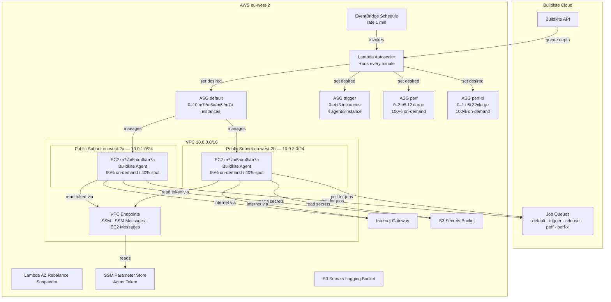
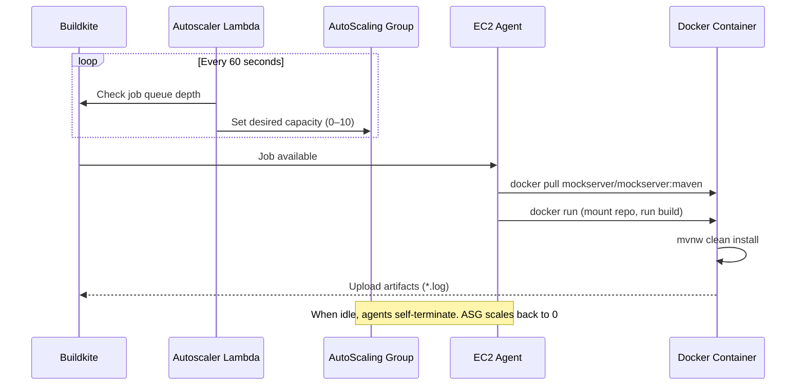
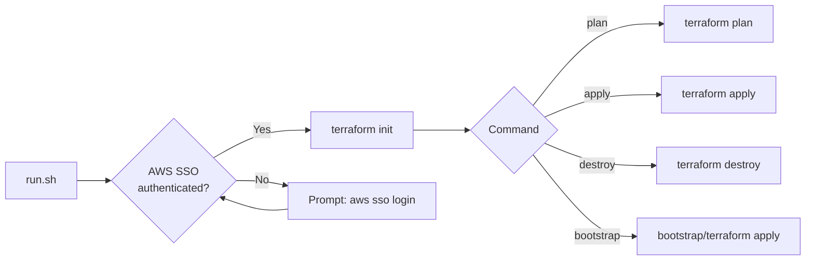
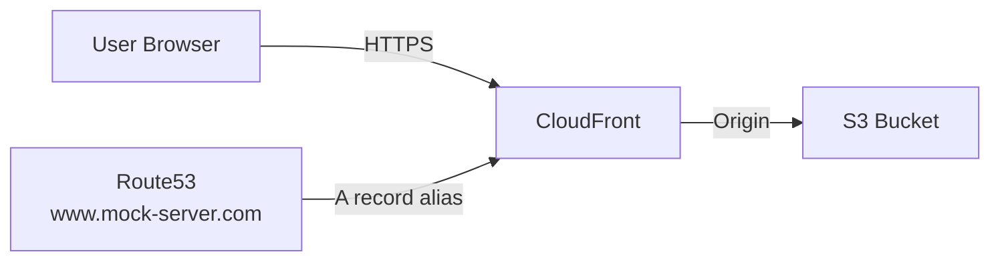

# AWS Infrastructure

## Overview

MockServer uses two AWS accounts for different purposes:

```mermaid
graph TB
    subgraph "Build Agent Account"
        direction TB
        TF["Terraform
buildkite-agents/"]
        ASG_D["ASG default queue"]
        ASG_T["ASG trigger queue"]
        ASG_P["ASG perf queue"]
        ASG_PXL["ASG perf-xl queue"]
        SCALER["Lambda Autoscaler"]
        AZ_LAMBDA["Lambda AZ Rebalance
Suspender"]
        EC2["EC2 m7i/m6a/m6i/m7a instances
0–10 build agents
60% on-demand / 40% spot"]
        EC2_T["EC2 t3 instances
0–4 trigger agents
100% spot, 4 agents/instance"]
        EC2_P["EC2 c5.12xlarge
0–3 perf agents
100% on-demand"]
        EC2_PXL["EC2 c6i.32xlarge
0–1 perf-xl agent
100% on-demand"]
        S3_PERF["S3 Bucket
perf-results history"]
        SSM["SSM Parameter Store
Agent Token"]
        S3_SECRETS["S3 Secrets Bucket"]
        S3_STATE["S3 State Bucket"]
        VPC["VPC 10.0.0.0/16
2 public subnets"]
        VPCE["VPC Endpoints
SSM, SSM Messages, EC2 Messages"]
        IGW["Internet Gateway"]
        LT["Launch Template"]
        CW["CloudWatch Logs
/buildkite/* + Lambda logs"]
        EB["EventBridge Rule
rate(1 minute)"]
    end

    subgraph "Website Account"
        direction TB
        S3["S3 Bucket
Current Website"]
        S3V["17 Versioned S3 Buckets
4-0 through 5-14"]
        S3P["S3 Bucket
jamesdbloom.com"]
        CDN["CloudFront Distribution
Main Site"]
        CDNV["17 Versioned CloudFront
Distributions"]
        CDNP["CloudFront Distribution
jamesdbloom.com"]
        R53["Route53
mock-server.com + 4 other zones"]
        ACM["ACM Certificates
mock-server.com + wildcard"]
    end

    TF -->|provisions| ASG_D
    TF -->|provisions| ASG_T
    TF -->|provisions| ASG_P
    TF -->|provisions| ASG_PXL
    TF -->|provisions| SCALER
    TF -->|state| S3_STATE
    EB -->|triggers| SCALER
    SCALER -->|scales| ASG_D
    SCALER -->|scales| ASG_T
    SCALER -->|scales| ASG_P
    SCALER -->|scales| ASG_PXL
    ASG_P -->|manages| EC2_P
    EC2_P -->|reads token| SSM
    EC2_P -->|reads secrets| S3_SECRETS
    EC2_P -->|reads/writes| S3_PERF
    ASG_PXL -->|manages| EC2_PXL
    EC2_PXL -->|reads/writes| S3_PERF
    ASG_D -->|uses| LT
    ASG_D -->|manages| EC2
    ASG_T -->|manages| EC2_T
    EC2 -->|reads token| SSM
    EC2 -->|reads secrets| S3_SECRETS
    EC2_T -->|reads token| SSM
    EC2_T -->|reads secrets| S3_SECRETS
    VPC -->|internet via| IGW
    VPC -->|private access via| VPCE
    EC2 -->|logs to| CW

    R53 -->|A record alias| CDN
    R53 -->|versioned subdomains| CDNV
    CDN -->|origin| S3
    CDNV -->|origins| S3V
    CDNP -->|origin| S3P
    CDN -->|TLS| ACM
    CDNV -->|TLS| ACM
```



## Account Details

| Purpose | Region | AWS CLI Profile |
|---------|--------|-----------------|
| Pipeline build agents and infrastructure | `eu-west-2` | `mockserver-build` |
| Website (S3, CloudFront, DNS, TLS) | `us-east-1` | `mockserver-website` |

Specific account IDs, SSO portal URLs, and resource identifiers are stored in `~/mockserver-aws-ids.md` (not committed to the repo).

## Build Agent Account

All active resources are in `eu-west-2`, managed by Terraform in `terraform/buildkite-agents/`.

### Architecture



### Resource Inventory

#### Compute

| Resource | Details |
|----------|---------|
| ASG `default` | Min 0, Max 10, 60% on-demand / 40% Spot, instance types m7i/m6a/m6i/m7a.2xlarge (all 8 vCPU / 32 GiB, x86_64; on-demand on m7i), on-demand base capacity 1, 1 agent/instance, AZRebalance suspended |
| ASG `trigger` | Min 0, Max 4, 100% Spot, t3.small/t3a.small/t3.micro, 4 agents/instance — cheap instances for trigger polling jobs |
| ASG `release` | Min 0, Max 2, 100% on-demand, same instance types as default (so it runs on the first one, m7i.2xlarge), 1 agent/instance |
| ASG `perf` | Min 0, Max 3, 100% on-demand, c5.12xlarge, on-demand base 0, 1 agent/instance — scale-to-zero; up to three concurrent perf jobs, each on its own machine |
| ASG `perf-xl` | Min 0, Max 1, 100% on-demand, c6i.32xlarge, on-demand base 0, 1 agent/instance — scale-to-zero; one large perf job at a time |
| Launch Template | m7i.2xlarge (primary for default/release), t3.small (primary for trigger), 250 GiB gp3 root volume, delete-on-termination |
| EC2 Instances | 0–10 default + 0–4 trigger + 0–2 release + 0–3 perf + 0–1 perf-xl (ephemeral), all scale to zero when idle |

#### Networking

| Resource | Details |
|----------|---------|
| VPC | `10.0.0.0/16` |
| Subnets | `10.0.1.0/24` (eu-west-2a), `10.0.2.0/24` (eu-west-2b), both public |
| Internet Gateway | Attached to Buildkite VPC |
| Route Table | Public: local + default to IGW |
| Security Group (agents) | Agent traffic, no inbound rules |
| Security Group (VPC endpoints) | HTTPS (443) from VPC CIDR only |
| VPC Endpoints | SSM, SSM Messages, EC2 Messages (Interface type) |

#### Lambda

| Function | Runtime | Purpose |
|----------|---------|---------|
| Scaler | `provided.al2023` | Scales ASG based on Buildkite queue depth |
| AZ Rebalance Suspender | `python3.13` | Suspends AZRebalance on the ASG |

#### EventBridge

| Schedule | Target |
|----------|--------|
| `rate(1 minute)` | Scaler Lambda |

#### Storage

| Resource | Purpose |
|----------|---------|
| S3 Bucket (state) | Terraform state (versioned, encrypted, public access blocked) |
| S3 Bucket (secrets) | Buildkite managed secrets (versioned, encrypted, public access blocked) |
| S3 Bucket (secrets logs) | Secrets bucket access logs (versioned, encrypted, public access blocked) |
| S3 Bucket (CloudTrail) | CloudTrail audit logs (encrypted, 90-day lifecycle, public access blocked) |
| S3 Bucket (dependency cache) | CI dependency cache for Maven/npm/pip/Bundler (encrypted, 14-day lifecycle, public access blocked) — requires `terraform apply` to create; pipeline cache scripts no-op gracefully until bucket exists |
| S3 Bucket (`mockserver-ci-perf-results`) | Performance regression run history — one JSON per run under `runs/<branch>/<iso>__<sha>.json` (versioning enabled, current versions retained indefinitely, noncurrent expire after 365d, AES256, public access blocked) |

#### Container Registry

| Resource | Purpose |
|----------|---------|
| ECR Public Repository (`mockserver`) | Public Docker image registry at `public.ecr.aws/t2x9c0i6/mockserver` (`t2x9c0i6` is the AWS-assigned registry alias) — avoids Docker Hub rate limits for AWS-based CI/CD |
| ECR Pull-Through Cache rules (`docker-hub`, `quay`) | Private regional cache (eu-west-2) for the Testcontainers backing images. CI pulls in-region; the upstreams (Docker Hub, quay.io) are contacted only on a first miss. **`mcr.microsoft.com` is NOT supported by ECR pull-through** (`UnsupportedUpstreamRegistryException`), so azurite pulls direct from Microsoft — the host pre-pull is its only guard. Applied 2026 (agent stack now elastic-ci-stack v6.71.3). Auto-created cache repos get AES256 + a 30-day expiry via a repository creation template |

#### Secrets

| Resource | Type | Purpose |
|----------|------|---------|
| SSM Parameter | SecureString | Buildkite agent registration token |
| Secrets Manager Secret (`mockserver-build/dockerhub`) | JSON | Docker Hub credentials for CI image push (JSON keys `username`/`token`) |
| Secrets Manager Secret (`ecr-pullthroughcache/dockerhub`) | JSON | Docker Hub credentials for the ECR pull-through cache. Separate secret because ECR mandates the `ecr-pullthroughcache/` name prefix and JSON keys `username`/`accessToken` — the push secret above cannot be reused. Value set out of band |
| Secrets Manager Secret (`mockserver-build/buildkite-api-token`) | String | Buildkite API token for Terraform pipeline management |

#### CloudWatch Log Groups (eu-west-2)

| Log Group | Retention | Purpose |
|-----------|-----------|---------|
| Scaler Lambda | 1 day | Scaler Lambda logs |
| AZ Rebalance Suspender Lambda | 30 days | AZ rebalance suspender logs |
| `/buildkite/auth` | 30 days | Agent auth logs |
| `/buildkite/buildkite-agent` | 30 days | Agent logs |
| `/buildkite/cloud-init` | 30 days | Instance bootstrap logs |
| `/buildkite/cloud-init/output` | 30 days | Instance bootstrap output |
| `/buildkite/docker-daemon` | 30 days | Docker daemon logs |
| `/buildkite/elastic-stack` | 30 days | Elastic stack logs |
| `/buildkite/lifecycled` | 30 days | Instance lifecycle logs |
| `/buildkite/system` | 30 days | System logs |

#### IAM

Policies are scoped per queue — each agent role receives only the secrets and permissions it actually uses.

| Resource | Purpose | Attached to |
|----------|---------|-------------|
| EC2 Instance Role | Buildkite agent permissions (SSM, S3 secrets, Secrets Manager, CloudWatch) | all queues |
| Scaler Lambda Role | ASG scaling + CloudWatch Logs | Lambda |
| AZ Rebalance Suspender Role | ASG process management | Lambda |
| Instance Profile | Attached to EC2 instances | all queues |
| IAM Policy (`buildkite-read-buildkite-api-token`) | Allows agents to read the Buildkite API token from Secrets Manager | trigger, perf |
| IAM Policy (`buildkite-read-dockerhub-secret`) | Allows agents to read Docker Hub credentials from Secrets Manager | default, release |
| IAM Policy (`buildkite-read-build-secrets-default`) | Allows default-queue agents to read buildkite-api-token + sonatype from Secrets Manager | default |
| IAM Policy (`buildkite-read-build-secrets-release`) | Allows release-queue agents to read buildkite-api-token + sonatype + pypi + rubygems from Secrets Manager | release |
| IAM Policy (`buildkite-read-release-secrets`) | Allows release agents to read GPG, GitHub, npm, SwaggerHub, website-role secrets + cross-account sts:AssumeRole | release |
| IAM Policy (`buildkite-ecr-public-push`) | Allows agents to push Docker images to ECR Public | default, release |
| IAM Policy (`buildkite-ecr-pull-through`) | Allows agents to pull CI Testcontainers images through the ECR pull-through cache and trigger first-miss imports (scoped to the `docker-hub/*` and `quay/*` cache repos; no `mcr/*` — mcr.microsoft.com is not a supported upstream) | default, release |
| IAM Policy (`buildkite-dependency-cache`) | Allows agents to read/write the CI dependency cache S3 bucket — DETACHED (runtime wiring reverted; re-attach when cache integrity is implemented) | none |
| IAM Policy (`buildkite-perf-results`) | Allows perf-queue agents to Get/Put/List objects in `mockserver-ci-perf-results` | perf, perf-xl |
| IAM Policy (`buildkite-release-website-tfstate`) | Allows release agents to read/write website Terraform state and lock file | release |
| Service-linked roles | AutoScaling, EC2Spot, Organizations, SSO, Support, TrustedAdvisor, ResourceExplorer, ECR Pull-Through Cache (`AWSServiceRoleForECRPullThroughCache` — reads the upstream credential secret + creates cache repos; managed in `ecr-pull-through-cache.tf`, import if it already exists) | account |

#### Security

| Control | Status |
|---------|--------|
| Account-level S3 public access block | Enabled (all 4 flags) |
| CloudTrail | `mockserver-management-trail` — multi-region, log file validation, KMS-encrypted; management events (incl. Secrets Manager access) + S3 data events on the tfstate bucket |
| GuardDuty | Enabled with S3 data events; HIGH/CRITICAL findings alert via EventBridge -> SNS |
| Access Analyzer | Account-level analyzer enabled |
| VPC flow logs | ALL traffic logged to CloudWatch on all 5 VPCs (default, trigger, release, perf, perf-xl). perf-xl's flow log is keyed by stack name (`agent_vpc_ids_by_stack` in `security-hardening.tf`) so it plans before its VPC exists |
| SNS encryption | `alias/aws/sns` KMS encryption on alerts topic |
| State bucket encryption | KMS CMK (`alias/mockserver-terraform-state`) with key rotation |
| Config bucket encryption | KMS CMK (shared with CloudTrail) |
| Root MFA | Enabled |
| IAM users | None (SSO-only access) |
| Password policy | Not set (no IAM users exist) |

### Scaling Behaviour

#### Default Queue (builds)
- **Minimum:** 0 instances (scales to zero when idle)
- **Maximum:** 10 instances, 1 agent per instance
- **Instance types:** `m7i.2xlarge,m6a.2xlarge,m6i.2xlarge,m7a.2xlarge`, all 8 vCPU / 32 GiB and x86_64 (see "Choosing the default-queue instance types" below)
- **Capacity mix:** 60% on-demand, 40% Spot, with on-demand base capacity of 1 (raised from 20% on-demand after Spot reclamations were killing long Maven builds; see CI/CD doc)
- **Build cost:** about $0.47/hr per on-demand agent (m7i.2xlarge) and $0.16–0.21/hr per Spot agent, eu-west-2 Linux list prices

#### Choosing the default-queue instance types

The type ORDER only steers on-demand capacity. On-demand uses the `prioritized` strategy, so it launches the first type in `instance_types` and moves down the list only when that type has no capacity. The release queue is 100% on-demand on the same list, so it runs on the first type too. Spot uses `capacity-optimized`, which picks whichever listed pool has the most spare capacity and ignores the order. **A type that is too slow must therefore be removed, not moved to the end**, or Spot keeps landing on it.

The `:maven: build` step is long enough that the agent type changes its duration by minutes. On the same commits (October 2026), m6a.2xlarge finished the step about 17% faster than m5.2xlarge, and an m5a.2xlarge build was slow enough to hit the 90-minute step timeout. m5, m5a and m5n were removed for that reason; m5n.2xlarge is not offered in eu-west-2 at all.

| Type | CPU | vCPU / physical cores / GiB | On-demand $/hr (eu-west-2) | Role |
|---|---|---|---|---|
| m7i.2xlarge | Intel Sapphire Rapids | 8 / 4 / 32 | 0.466 | First: all on-demand and release capacity |
| m6a.2xlarge | AMD Milan | 8 / 4 / 32 | 0.400 | On-demand fallback, Spot |
| m6i.2xlarge | Intel Ice Lake | 8 / 4 / 32 | 0.444 | On-demand fallback, Spot |
| m7a.2xlarge | AMD Genoa | 8 / 8 / 32 | 0.536 | Spot (no SMT: 8 vCPU are 8 physical cores) |
| m5.2xlarge (removed) | Intel Skylake | 8 / 4 / 32 | 0.444 | — |

Keep every entry 8 vCPU / 32 GiB: the build container is limited to 12g and holds the 6g-heap Maven reactor and the dashboard build in one cgroup (see `variables.tf`), and the 8-vCPU count is what the build's thread settings and the perf gates assume. Keep the first type x86_64: the stack derives the AMI architecture from the first type's family, and a Graviton (`g`) family there would switch every agent to the arm64 AMI. Swapping m5 for m7i leaves the on-demand vCPU quota usage unchanged (8 vCPU per agent either way). Prices are Linux on-demand list prices for eu-west-2 as of October 2026; check them again before reordering. To see which type a build actually ran on, read the agent's `aws:instance-type` metadata in Buildkite.

#### Trigger Queue (polling)
- **Minimum:** 0 instances (scales to zero when idle)
- **Maximum:** 4 instances, 4 agents per instance (up to 16 concurrent trigger jobs)
- **Instance types:** t3.small, t3a.small, t3.micro
- **Capacity mix:** 100% Spot
- **Cost:** ~$0.004–0.008/hr per instance (~$0.001–0.002/hr per trigger agent)

#### Perf Queue (regression benchmarks)
- **Minimum:** 0 instances (scale-to-zero — mandatory, see AGENTS.md)
- **Maximum:** 3 instances, 1 agent per instance — up to three perf jobs run at once, and each has a whole machine to itself, so concurrent jobs never contend for CPU, memory, Docker or ports. A regression build's measurement steps (run + sample, micro-benchmark, HTTP/2 multiplex, allocation profile) spread across the agents; they share results only through Buildkite artifacts and the S3 history, never through an agent's local disk
- **Instance type:** c5.12xlarge (48 vCPU across 24 physical cores — enough to core-pin server + upstream + k6 to physically disjoint cpusets)
- **Cross-machine variance:** two jobs that run at the same time are on different VMs, and VM-to-VM variance is a few percent. The rolling baseline already spans many machines (every daily run gets a fresh one), but a close A/B comparison should measure both arms within one job on one machine, or repeat each arm
- **Capacity mix:** 100% on-demand (spot interruptions mid-benchmark would corrupt results)
- **On-demand base capacity:** 0
- **Single-AZ pinning:** not implemented (one agent per instance + a single instance type already gives strong run-to-run reproducibility)
- **Managed policies:** `read_buildkite_api_token`, `read_buildkite_api_token_readonly`, `buildkite-perf-results`, `buildkite-imds-hardening`

#### Perf-XL Queue (large benchmarks)
- **Purpose:** performance runs that need far more cores than one c5.12xlarge — the counterpart to `perf`, with the same rules
- **Minimum:** 0 instances (scale-to-zero — mandatory, see AGENTS.md)
- **Maximum:** 1 instance, 1 agent per instance
- **Instance type:** c6i.32xlarge (128 vCPU across 64 physical cores, 256 GiB, 50 Gbit/s). It is Ice Lake rather than perf's Cascade Lake, so numbers from the two queues are not comparable
- **Capacity mix:** 100% on-demand, on-demand base capacity 0
- **Managed policies:** `read_buildkite_api_token_readonly`, `buildkite-perf-results`, `buildkite-imds-hardening` (perf's set without the write API token, which nothing on the perf queues uses)
- **Cost:** $6.464/hr on-demand in eu-west-2 (AWS Pricing API, price list of 2026-09-25), billed only while a job holds the box. Like every stack, its own VPC carries three SSM interface endpoints across two subnets, about $0.066/hr (~$48/month) even at zero instances
- **vCPU quota:** shares the account's "Running On-Demand Standard" quota (384 vCPU in eu-west-2 at the time of writing) with the other on-demand queues. perf at full scale (3 × 48) plus perf-xl (128) is 272 vCPU. With the default and release queues' on-demand instances running too, the realistic peak is about 344 of 384, a margin of about 40 vCPU

#### Common
- **Scaling frequency:** Every 60 seconds
- **Scale trigger:** Buildkite job queue depth
- **Idle cost:** $0 for instances (all queues scale to zero). Each stack's VPC still pays for its three SSM interface endpoints, about $0.066/hr per stack

### Build Flow



## Infrastructure as Code (Terraform)

The Buildkite agent infrastructure is managed by Terraform in `terraform/buildkite-agents/`, using the official [Buildkite Elastic CI Stack for AWS](https://github.com/buildkite/terraform-buildkite-elastic-ci-stack-for-aws) module.

### Directory Structure

```
terraform/
└── buildkite-agents/
    ├── bootstrap/           # One-time state backend setup
    │   ├── main.tf          #   S3 bucket
    │   ├── scripts/         #   Pre-flight check scripts
    │   │   ├── check_dynamodb_table_exists.sh
    │   │   └── check_s3_bucket_exists.sh
    │   └── README.md        #   Bootstrap instructions
    ├── main.tf              # Elastic CI Stack module
    ├── monitoring.tf        # CloudWatch alarms, SNS notifications, dashboard
    ├── backend.tf           # S3 remote state configuration
    ├── build-secrets.tf     # Docker Hub secret + Buildkite agent IAM policy
    ├── ecr-public.tf        # ECR Public repository + push IAM policy
    ├── ecr-pull-through-cache.tf # ECR pull-through cache rules (docker-hub/quay; mcr unsupported) + credential secret + agent IAM
    ├── variables.tf         # Input variables
    ├── outputs.tf           # Outputs (ASG name, VPC ID, dashboard URL)
    ├── versions.tf          # Terraform + provider versions
    ├── terraform.tfvars.example  # Example variable values
    ├── run.sh               # Wrapper script (auth + plan/apply)
    └── README.md
```

### Module Configuration

| Property | Value |
|----------|-------|
| Terraform module | `buildkite/elastic-ci-stack-for-aws/buildkite` ~0.12.x |
| Region | `eu-west-2` |
| Instance types | m7i/m6a/m6i/m7a.2xlarge (on-demand on m7i) |
| Capacity | 60% on-demand / 40% Spot, base capacity 1 on-demand |
| Scaling | 0–10 instances |
| State backend | S3 in `eu-west-2` (native lockfile) |
| Monitoring | CloudWatch alarms, SNS email alerts, dashboard |

### State Backend

Remote state is stored in S3 with `use_lockfile = true` for S3-native file locking (`.tflock`). The state bucket is encrypted with a dedicated KMS CMK (`alias/mockserver-terraform-state`) defined in `bootstrap/main.tf` and referenced by `backend.tf` as `kms_key_id`.

**Apply ordering:** the bootstrap stack must be applied first to create the CMK. After the key exists, run `terraform init -reconfigure` on the main stack to pick up the new `kms_key_id`. Existing state objects re-encrypt on next write.

The bootstrap (`terraform/buildkite-agents/bootstrap/`) uses `import` blocks, making it idempotent — safe to re-run against existing resources.

### Variables

| Variable | Type | Default | Description |
|----------|------|---------|-------------|
| `buildkite_agent_token` | `string` | *(required)* | Buildkite agent registration token (supply via `TF_VAR_buildkite_agent_token` env var, NEVER in `terraform.tfvars` — see below) |
| `region` | `string` | `eu-west-2` | AWS region |
| `instance_types` | `string` | `m7i.2xlarge` | EC2 instance types for default/release queues; the first is used for on-demand (terraform.tfvars sets `m7i.2xlarge,m6a.2xlarge,m6i.2xlarge,m7a.2xlarge`) |
| `min_size` | `number` | `0` | Minimum default queue instances (0 = scale to zero) |
| `max_size` | `number` | `10` | Maximum default queue instances |
| `on_demand_percentage` | `number` | `0` | % on-demand vs spot for default queue (terraform.tfvars overrides to 60) |
| `trigger_instance_types` | `string` | `t3.small` | EC2 instance types for trigger queue (cheap polling) |
| `trigger_min_size` | `number` | `0` | Minimum trigger queue instances |
| `trigger_max_size` | `number` | `4` | Maximum trigger queue instances |
| `release_min_size` | `number` | `0` | Minimum release queue instances |
| `release_max_size` | `number` | `2` | Maximum release queue instances |
| `perf_xl_instance_types` | `string` | `c6i.32xlarge` | EC2 instance type for the perf-xl queue (a single fixed type) |
| `perf_xl_min_size` | `number` | `0` | Minimum perf-xl queue instances (must remain 0) |
| `perf_xl_max_size` | `number` | `1` | Maximum perf-xl queue instances |
| `alert_email` | `string` | `""` | Email address for infrastructure alerts |

#### Buildkite Agent Token Security

The `buildkite_agent_token` is a sensitive credential that grants agent registration. **NEVER** write it to `terraform.tfvars` (even though the file is gitignored, plaintext secrets on local disk are a risk). Supply it at apply time via environment variable:

```bash
export TF_VAR_buildkite_agent_token=$(aws ssm get-parameter \
  --name /buildkite/buildkite/agent-token \
  --with-decryption --query Parameter.Value --output text \
  --profile mockserver-build --region eu-west-2)
```

The `run.sh` wrapper does this automatically (it loads the parameter into `TF_VAR_buildkite_agent_token` before every `init`/`plan`/`apply`).

**Cluster migration:** Buildkite deprecated unclustered (organization-level) agents, so all pipelines and agents now live in the **Default cluster**. The token above is a *cluster* agent token, minted by the `terraform/buildkite-pipelines` stack (`buildkite_cluster_agent_token`) and published to the SSM SecureString `/buildkite/buildkite/agent-token`. That stack also defines the cluster queues (`default`, `trigger`, `release`, `perf`, `perf-xl`) and assigns every pipeline to the cluster via `cluster_id`. Apply order: `buildkite-pipelines` (mints token + queues) **before** `buildkite-agents` (consumes the token from SSM).

### Quick Start

```bash
# Bootstrap state backend (first time only)
./terraform/buildkite-agents/run.sh bootstrap

# Preview changes
./terraform/buildkite-agents/run.sh plan

# Apply changes
./terraform/buildkite-agents/run.sh apply
```

The `run.sh` wrapper handles AWS SSO authentication and environment workarounds (corporate TLS proxy, macOS pyexpat).



## Website Account

S3, CloudFront, Route 53 records, and the cross-account IAM role used by the release pipeline are **managed by Terraform in [`terraform/website/`](../../terraform/website/README.md)**. The IaC pieces below are summarised here; see the module README for the canonical reference, variables, and outputs.

### Architecture



### AWS Organization and SSO

The website account runs its own AWS Organization with a separate IAM Identity Center instance. This is independent from the build account's organization. Access is managed via SSO — no IAM users or long-lived credentials exist. **Manual (one-time)** — predates Terraform.

### S3 Buckets

19 S3 buckets — 1 for the current website, plus versioned archives for each MockServer major/minor release and a personal site. See `~/mockserver-aws-ids.md` for bucket names. **Managed by `terraform/website/sites.tf`** (`aws_s3_bucket.site`, `aws_s3_bucket_public_access_block.site`, `aws_s3_bucket_policy.site` — one of each per `sites` map entry). S3 static-website hosting (`aws_s3_bucket_website_configuration`) is not configured — CloudFront uses the OAC REST origin with `default_root_object` rather than the S3 website endpoint. Bucket *contents* are uploaded by the release pipeline (`scripts/release/components/website.sh`, `…/javadoc.sh`, `…/helm.sh`), not by Terraform.

### CloudFront Distributions

19 distributions — one per S3 bucket, each mapped to a domain alias. The main site serves `mock-server.com`, with versioned subdomains (`4-0` through `5-14`) for archived documentation. **Managed by `terraform/website/sites.tf`** (`aws_cloudfront_distribution.site` per version + `aws_cloudfront_distribution.main` for the apex).

A separate distribution serves `downloads.mock-server.com` from the private `aws-binaries-mockserver` bucket (OAC, reusing the shared WAF web ACL, response-headers policy, and access-logs bucket). **Managed by `terraform/website/binaries.tf`.** It hosts the JVM-less client binary bundles that the Go/.NET/Rust/Ruby/Python/Node launchers download for **`-SNAPSHOT`** versions; released versions are downloaded from GitHub Release assets instead (see [ci-cd.md](ci-cd.md)).

All distributions authenticate to S3 via Origin Access Control (OAC) only; the legacy Origin Access Identity (OAI) grants were removed from the bucket policies after the OAC cutover was verified. S3 buckets are not publicly accessible — only CloudFront can read objects.

Main distribution config: `PriceClass_All`, HTTP/2+3, TLSv1.2_2021 minimum, redirect HTTP→HTTPS, custom 403→404 mapping to `/error403.html`. The private (OAC) bucket returns 403 for any missing object; CloudFront serves the friendly error page but preserves a real **404** status. `error403.html` still `meta refresh`es human visitors to the homepage, so deep-link/moved-URL refreshes land somewhere useful, while search-engine crawlers receive the 404 and drop deleted URLs (old apidocs, retired path-based copies) instead of treating thousands of soft-404s as duplicate indexable pages. The main distribution `depends_on` the per-version distributions so promoting a new `latest_version` doesn't trip the CloudFront "CNAME already associated" error.

A shared CloudFront response headers policy (`mockserver-security-headers`) is attached to the default cache behaviour of both distributions. It enforces: HSTS (`max-age=31536000; includeSubDomains`), `X-Content-Type-Options: nosniff`, `X-Frame-Options: SAMEORIGIN`, `Referrer-Policy: strict-origin-when-cross-origin`, and a conservative Content Security Policy. **Managed by `terraform/website/sites.tf`** (`aws_cloudfront_response_headers_policy.security`).

### Cross-account IAM Role

The build-account Buildkite agents push releases into the website account by assuming `mockserver-release-website` via `sts:AssumeRole`. **Managed by `terraform/website/cross-account-role.tf`.** Permissions are scoped:

- S3 object and bucket verbs (`GetObject`, `PutObject`, `DeleteObject`, `ListBucket`, etc.) on `arn:aws:s3:::aws-website-mockserver-*` only — ACL and website-configuration verbs are removed (buckets use OAC + `BucketOwnerEnforced`)
- S3 bucket verbs on `arn:aws:s3:::aws-binaries-mockserver` (the `downloads.mock-server.com` bundle host, `binaries.tf`) — adds `s3:PutBucketVersioning` + `s3:PutEncryptionConfiguration` (the bucket enables versioning + SSE) and `s3:ListBucket` (backs the provider's `HeadBucket` probe; without it the refresh 403s and the provider misreads it as a deleted bucket, planning a destructive recreate)
- `cloudfront:*` (account-wide — CloudFront lacks resource-level permissions for distribution-list/create)
- `route53:ChangeResourceRecordSets` on the `mock-server.com` hosted zone only

> **Why the release role needs the binaries bucket.** `versioned-site.sh` runs `terraform apply` over the **whole** `terraform/website/` state, so Terraform refreshes (and may create) every resource in it — including `binaries.tf`. Any resource added to that module must have a matching grant in `cross-account-role.tf` or the release's Versioned Site step fails with `AccessDenied`. The `aws-binaries-mockserver` bucket is only *written* by the SNAPSHOT bundle CI step (build-account agent, cross-account write); **released versions ship as GitHub Release assets**, not to S3. The release role manages it purely because its IaC lives in this release-applied state. This gap is exactly what failed release build #49 (binaries bucket added to the state without updating the release role).

The trust policy optionally requires `sts:ExternalId` when `var.role_external_id` is non-empty (inactive until wired — default `""`). When set, the matching value must be supplied at apply time via `TF_VAR_role_external_id` from Secrets Manager; see `terraform/website/README.md` for the wiring procedure.

### Route53 Hosted Zones

| Domain | Records | Purpose |
|--------|---------|---------|
| `mock-server.com` | 26 | Main site + all versioned subdomains |
| `mock-server.org` | 4 | Redirects to `mock-server.com` via CloudFront |
| `jamesdbloom.com` | 8 | Personal site |
| `bluesquashtechnology.com` | 6 | Other domain |
| `subdomain.bluesquashtechnology.com` | 4 | Subdomain delegation |

`mock-server.com` DNS records: apex → CloudFront (main), `www` → alias to apex, `org` → alias to apex, plus 15 versioned subdomain A records (`4-0` through `5-14`) each pointing to their respective CloudFront distribution. ACM validation CNAME records for certificate renewal. CAA records (`0 issue "amazon.com"` and `0 issuewild "amazon.com"`) restrict certificate issuance to Amazon CA — managed by `terraform/website/sites.tf` (`aws_route53_record.caa`).

The hosted zone itself is **manual (one-time)** — it predates Terraform. **All A-alias records** inside it (`aws_route53_record.site` per version, `aws_route53_record.main` for apex, `aws_route53_record.www`) **are managed by `terraform/website/sites.tf`**. ACM validation CNAMEs are managed by AWS as part of the cert lifecycle.

SES email forwarding DNS records (managed by `terraform/ses-email-forwarding/`): apex MX record routing to `inbound-smtp.us-east-1.amazonaws.com`, `_amazonses` TXT for domain verification, 3 DKIM CNAME records (`<token>._domainkey`), and `_dmarc` TXT. See [AWS SES Email Forwarding](aws-ses-email-forwarding.md) for full details.

### ACM Certificates (us-east-1)

| Domain | Expires | Renewal |
|--------|---------|---------|
| `mock-server.com` (+ `*.mock-server.com`, `org.`, `www.`) | 2026-09-17 | Eligible (auto-renew) |
| `*.mock-server.com` | 2026-09-29 | Eligible (auto-renew) |
| `blog.jamesdbloom.com` | — | Eligible |

Certificates are **not** managed by Terraform — issuance was a one-time manual request with DNS validation, and renewals are automatic. The ARN is passed into the `terraform/website/` module as `acm_certificate_arn`.

### S3 Bucket Contents

| Path | Content |
|------|---------|
| `/` (root) | Jekyll website (`www.mock-server.com`) |
| `/versions/<version>/` | Javadoc for each release |
| `/*.tgz` + `index.yaml` | Helm chart repository |

### Website Deployment Process

1. Build Jekyll site: `bundle exec jekyll build`
2. Upload `_site/` contents to S3 bucket root
3. Invalidate CloudFront cache
4. See [Release Process](../operations/release-process.md) for full details

### Security

| Control | Status |
|---------|--------|
| Account-level S3 public access block | Enabled (all 4 flags) |
| Bucket-level S3 public access blocks | Enabled on all 19 buckets |
| CloudFront OAC | All 19 distributions use Origin Access Control — S3 not directly accessible |
| CloudFront security headers | HSTS, CSP, X-Content-Type-Options, X-Frame-Options, Referrer-Policy on all distributions |
| CAA records | `mock-server.com` CAA pinned to `amazon.com` — prevents rogue CA issuance |
| CloudTrail | `mockserver-website-trail` — multi-region, log file validation, 90-day retention |
| Root MFA | Enabled |
| IAM users | None (SSO-only access) |
| CloudFront TLS | TLSv1.2_2021 minimum, HTTP→HTTPS redirect |

### Monthly Cost

~$3.36/month: Route53 ($2.88 for 5 hosted zones), S3 ($0.31), CloudFront (<$0.01).

## Recommendations

No outstanding recommendations. All infrastructure is current.

## AWS CLI Operations

These commands target the Terraform-managed infrastructure in `eu-west-2`. The ASG name is dynamically generated by the Elastic CI Stack module, so look it up first:

```bash
aws sso login --profile mockserver-build

ASG_NAME=$(aws autoscaling describe-auto-scaling-groups \
  --profile mockserver-build --region eu-west-2 \
  --query 'AutoScalingGroups[?contains(Tags[?Key==`Name`].Value | [0], `buildkite`)].AutoScalingGroupName' \
  --output text)

aws autoscaling describe-auto-scaling-groups \
  --auto-scaling-group-names "$ASG_NAME" \
  --region eu-west-2 --profile mockserver-build \
  --query 'AutoScalingGroups[0].{Desired:DesiredCapacity,Instances:Instances[*].{ID:InstanceId,State:LifecycleState}}'

aws ec2 describe-instances \
  --filters "Name=tag:aws:autoscaling:groupName,Values=$ASG_NAME" \
  --region eu-west-2 --profile mockserver-build \
  --query 'Reservations[].Instances[].{ID:InstanceId,State:State.Name,Launch:LaunchTime}'

aws ec2 get-console-output --instance-id <instance-id> \
  --region eu-west-2 --profile mockserver-build

aws autoscaling set-desired-capacity \
  --auto-scaling-group-name "$ASG_NAME" \
  --desired-capacity 4 --region eu-west-2 --profile mockserver-build
```

## AWS CLI Prerequisites

1. **Install AWS CLI:** `brew install awscli`
2. **Configure SSO profiles:** see `~/mockserver-aws-ids.md` for SSO start URLs and regions
   - `aws configure sso --profile mockserver-build`
   - `aws configure sso --profile mockserver-website`
3. **Authenticate:**
   - `aws sso login --profile mockserver-build` (or shell alias `awsl-build`)
   - `aws sso login --profile mockserver-website` (or shell alias `awsl-web`)
4. **Corporate TLS proxy:** set `AWS_CA_BUNDLE` to your corporate root CA PEM file (e.g., `export AWS_CA_BUNDLE=$NODE_EXTRA_CA_CERTS`)
5. **macOS + Python 3.14 + Homebrew:** if `pyexpat` symbol errors occur, set `export DYLD_LIBRARY_PATH=/opt/homebrew/opt/expat/lib`
