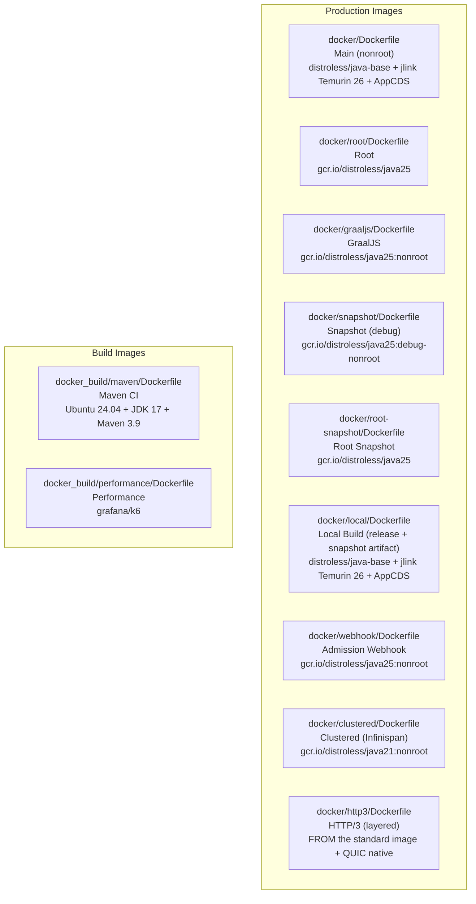
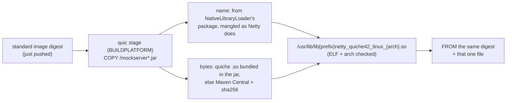
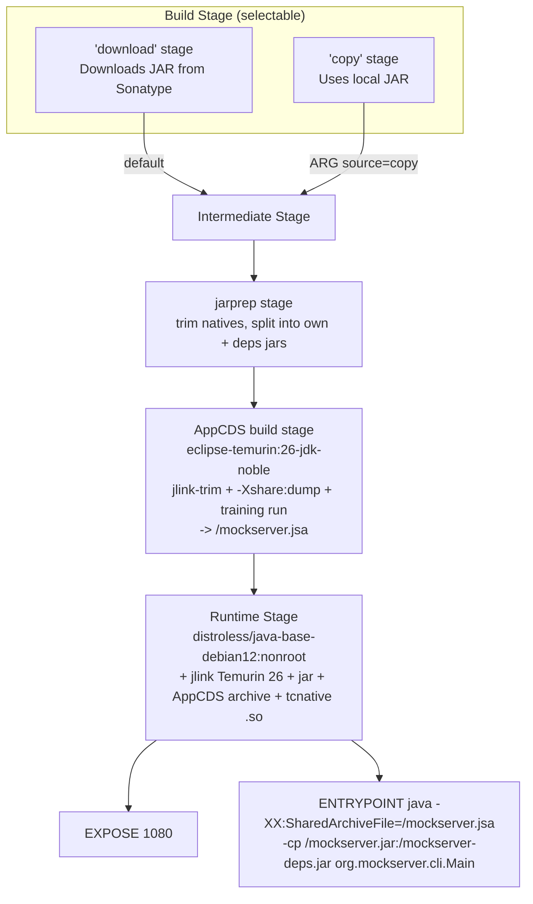
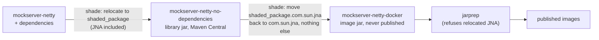
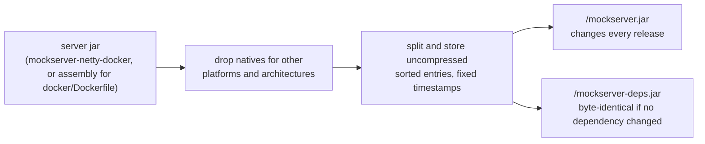

# Docker

## Image Variants

MockServer provides multiple Docker image variants for different use cases:



### Production Images

| Variant | Dockerfile | Base Image | User | Purpose |
|---------|-----------|------------|------|---------|
| Main | `docker/Dockerfile` | `gcr.io/distroless/java-base-debian12:nonroot` + jlink-trimmed Temurin 26 + AppCDS | `nonroot` | Default production **reference** image (download mode); ships netty-tcnative + a baked AppCDS archive (~⅓ faster time-to-ready). JVM is JDK 26; the library is still compiled to the Java 17 floor (runtime-only) |
| Root | `docker/root/Dockerfile` | `gcr.io/distroless/java25` | `root` | When root access is needed |
| GraalJS | `docker/graaljs/Dockerfile` | `gcr.io/distroless/java25:nonroot` | `nonroot` | Includes GraalJS for JS templating |
| Snapshot | `docker/snapshot/Dockerfile` | `gcr.io/distroless/java25:debug-nonroot` | `nonroot` | Testing pre-release builds |
| Root Snapshot | `docker/root-snapshot/Dockerfile` | `gcr.io/distroless/java25` | `root` | Testing pre-release (root) |
| Local | `docker/local/Dockerfile` | `gcr.io/distroless/java-base-debian12:nonroot` + jlink-trimmed Temurin 26 + AppCDS | `nonroot` | The image the release **and** snapshot pipelines actually build+push as `mockserver/mockserver:<ver>` / `:snapshot`; builds from a local JAR, bakes a baked AppCDS archive (~⅓ faster time-to-ready); no netty-tcnative (JDK TLS provider). JVM is JDK 26; the library is still compiled to the Java 17 floor (runtime-only) |
| Webhook | `docker/webhook/Dockerfile` | `gcr.io/distroless/java25:nonroot` | `nonroot` | Kubernetes admission webhook for sidecar injection |
| Clustered | `docker/clustered/Dockerfile` | `gcr.io/distroless/java21:nonroot` | `nonroot` | Infinispan state backend for multi-node clustering |
| HTTP/3 | `docker/http3/Dockerfile` | `FROM ${BASE_IMAGE}` — the standard image's pushed digest | inherited (`nonroot`) | Published as `X.Y.Z-http3` / `snapshot-http3`; the standard image plus this arch's QUIC native in `/usr/lib`, the only published image that can serve HTTP/3 (see [HTTP/3 image variant](#http3-image-variant)) |
| AOT (experimental) | `docker/aot/Dockerfile` | `gcr.io/distroless/java-base-debian12:nonroot` + jlink-trimmed Temurin 25 | `nonroot` | EXPERIMENTAL, published as opt-in `X.Y.Z-aot` / `latest-aot` tags (Docker Hub + ECR Public) from the next release; bakes a JDK 25 AOT cache (JEP 483/514) at image-build time via a training run; ~2× faster time-to-ready; JDK TLS provider (no tcnative) |

### Docker Registries

Images are published to two registries:

| Registry | Image | Notes |
|----------|-------|-------|
| Docker Hub | `mockserver/mockserver` | Primary registry (main MockServer image) |
| Docker Hub | `mockserver/mockserver-webhook` | Admission webhook image |
| AWS ECR Public | `public.ecr.aws/mockserver/mockserver` | Avoids Docker Hub rate limits for AWS-based CI/CD |
| AWS ECR Public | `public.ecr.aws/mockserver/mockserver-webhook` | Webhook image on ECR |

Both registries receive the same tags on every push. On each merge to `master`, the legacy Buildkite pipeline (`.buildkite/scripts/steps/java-docker-push-snapshot.sh`) pushes the `:snapshot`, `:mockserver-snapshot`, `-graaljs` and `-clustered` snapshot variants (plus `:snapshot` / `:mockserver-snapshot` for the webhook image), then, last, `snapshot-http3` / `mockserver-snapshot-http3` (a failure fails the step). During releases, the release pipeline (`scripts/release/components/docker.sh`) pushes `:latest`, `:X.Y.Z`, `:mockserver-X.Y.Z`, `-graaljs`, `clustered-*`, `-aot` (experimental, error-isolated), and webhook release variants, then — last, after those are mirrored and signed — `-http3`. The `:latest` tag is pushed only by the release pipeline, not by the per-merge snapshot step. The `:latest` tag always points to the most recent official release, not the development branch.

Release images are cosign-signed by digest after push (see below). Snapshot images are not signed.

The `-clustered` image variant (`clustered-X.Y.Z`, `clustered-mockserver-X.Y.Z`, `clustered-latest`) is published alongside the base and GraalJS images at release time. It bundles the `mockserver-state-infinispan` module and its transitive dependencies (Infinispan, JGroups, etc.) plus `netty-tcnative-boringssl-static` for native TLS. The release build is **hard-fail with retry** (`scripts/release/components/docker.sh`): a transient registry blip is retried, but a genuine clustered push failure aborts the release rather than being silently swallowed. (Only the experimental `-aot` variant is error-isolated.)

#### Clustered snapshot tags (`snapshot-clustered` / `mockserver-snapshot-clustered`)

The same variant is also published **per master merge**, from the same job, the same shaded JAR and the same `SOURCE_COMMIT` stamp as `:snapshot` and `-graaljs`. Its Infinispan `/libs` classpath is not rebuilt here: the reactor build stages it with `-P clustered-libs` (`scripts/buildkite_quick_build.sh` → `mockserver-state-infinispan/target/clustered-libs`, module JAR included) and hands it over as a Buildkite artifact, so the push step only does a `docker buildx build`. If those jars are missing the step **fails closed** rather than publishing nothing.

Why the snapshot tag exists at all: the daily performance run's clustered-state A/B (`perf-test-run.sh`, performance-programme item 13) measures the Infinispan-vs-in-memory state-backend ratio and needs this image on a scale-to-zero perf agent. It `docker pull`s the tag exactly as it pulls the GraalJS SUT image. **Same-commit pairing is load-bearing** — the run is attributed to the SUT image's `org.opencontainers.image.revision`, so a clustered image from a different commit would file a ratio against code the measured binary never contained. Publishing both from one job makes the pairing structural; the perf harness then re-checks the two revision labels and skips the A/B (loudly, with a recorded reason) rather than measuring a mismatched pair. `docker/clustered/Dockerfile` carries the `SOURCE_COMMIT` / `BUILD_DATE` build args for that reason.

The **AOT experimental variant** (`docker/aot/Dockerfile`) is published as opt-in `X.Y.Z-aot`, `mockserver-X.Y.Z-aot`, and `latest-aot` tags (Docker Hub + ECR Public) from the next release, alongside the base and GraalJS images. Like the clustered image it is error-isolated in the release pipeline: an `-aot` build or push failure does not abort the release, since the main images have already been published by that point (the arm64 training run executes under QEMU emulation and is the most likely failure point). It copies a jlink-trimmed JDK 25 (Eclipse Temurin 25) runtime onto `gcr.io/distroless/java-base-debian12:nonroot`, runs a training start of MockServer during the image build to produce a JDK 25 AOT cache (JEP 483/514), and bakes that cache into the final image layer. At runtime the JVM loads the cache with `-XX:AOTCache=/mockserver.aot`, cutting time-to-ready by roughly half (~0.35 s vs ~0.7–0.8 s for the standard image). The AOT cache is CPU-architecture and JDK-build specific, so a separate cache is baked for each platform in a multi-arch build. When the soft-fail build succeeds, the published `-aot` tags are cosign-signed like every other release image (the signing step adds them only when the build actually pushed); it is not mirrored to GHCR. TLS uses the JDK provider rather than netty-tcnative; functional parity is complete (unlike GraalVM native-image). It can also be built from a repository checkout for local evaluation: `cd docker/aot && touch ca-bundle.pem && docker build .` (the `ca-bundle.pem` file must exist in the build context — it may be empty unless you are behind a corporate TLS-inspection proxy).

### HTTP/3 image variant

**Outcome:** `mockserver/mockserver:X.Y.Z-http3` (and `mockserver-X.Y.Z-http3`, `latest-http3`; per
merge `snapshot-http3`, `mockserver-snapshot-http3`) is the standard image plus ONE file — the QUIC
native for its architecture — so it inherits every other setting and fix by construction. No other
published image can serve HTTP/3: they all run the shaded jar, whose relocated Netty asks for
`libshaded_1package_netty_quiche42_linux_<arch>.so`, a name no published native has (so a stock
`netty-codec-native-quic` jar mounted into `/libs` is never loaded either).



- **Base pinned by digest.** `BASE_IMAGE` is the digest just pushed (release: ECR Public, to stay off
  the Docker Hub pull limit), so the variant is always the same build as its base.
  `docker-validate-sync.sh` fails if `docker/http3/Dockerfile` stops ending on `FROM ${BASE_IMAGE}` or
  re-declares an inherited `ENTRYPOINT`/`CMD`/`HEALTHCHECK`/`USER`/`ENV`/`EXPOSE`.
- **Loaded from `/usr/lib`.** Netty tries `java.library.path` before extracting to `/tmp`, so the
  image serves HTTP/3 with a read-only root filesystem.
- **Base-agnostic.** A shaded base supplies the exact bytes from its own jar (no download); an
  unshaded base (`docker/Dockerfile`, the container-test image) falls back to Maven Central with
  the Netty version from the base jar. That path needs `ca-bundle.pem` behind a TLS-inspecting proxy.
- **Multi-arch without emulation.** The extraction stage runs on `$BUILDPLATFORM`; the target stages
  only copy files.
- **Tested.** `.buildkite/scripts/steps/docker-http3-smoke.sh <http3-image> [<base-image>]` runs the
  image read-only, makes a real HTTP/3 request with the JDK 26 HTTP/3 client trusting only the
  server's CA and, given the base, checks that the base refuses `http3Port` and that the `-http3`
  image with its native hidden (`-Djava.library.path=/nope`) says the native is present but failed
  to load — each with the start-up message, one `underlying error:` line and no stack frames.
- **Where it runs, and what a failure blocks.**

  | Where | Smoke | On failure |
  |---|---|---|
  | Snapshot step, per merge | agent-arch `--load` build over the pushed `:snapshot` digest, before pushing `snapshot-http3` | hard-fail, but LAST under `timeout 20m`: every other snapshot image is already pushed, so only the `snapshot-http3` publish stops |
  | Release (`--execute`) | agent-arch `--load` build over the pushed release digest, before the multi-arch push | hard-fail, but LAST: every core image is already pushed, mirrored and signed, so only the `-http3` publish stops |
  | Release dry run | local build, HTTP/3 request only (the base's message may predate this version) | blocking, last |
  | Container-integration harness | `docker_variant_smoke_http3` over the default reference image | non-blocking |
- **Only the standard image's features.** `-http3` layers on the standard image, so it does not
  include GraalJS (JavaScript templates) or the clustered Infinispan state backend.

### Verifying Image Signatures

Release images are cosign-signed by digest after push using the project's signing key (stored in AWS Secrets Manager `mockserver-release/cosign-key`). Signing uses the same key infrastructure as the Helm chart signing in `scripts/release/components/helm.sh`. The release Docker step runs on the **release** queue (the only queue granted `read_release_secrets`, which includes the cosign key) and auto-installs the pinned cosign binary into `.tmp/` if it is not already on the agent.

To verify a release image:

```bash
# Install cosign: https://docs.sigstore.dev/cosign/system_config/installation/

# Verify by digest (most reliable — binds to exact manifest content)
cosign verify \
  --key https://www.mock-server.com/mockserver-cosign.pub \
  mockserver/mockserver@sha256:<digest>

# Or verify the tag (resolves to digest internally)
cosign verify \
  --key https://www.mock-server.com/mockserver-cosign.pub \
  mockserver/mockserver:8.0.0
```

The public key corresponding to `mockserver-release/cosign-key` is **published at `https://www.mock-server.com/mockserver-cosign.pub`** (source: `jekyll-www.mock-server.com/mockserver-cosign.pub`; an identical copy is at `helm/mockserver/cosign.pub`). It can also be re-derived from the private key with `cosign public-key --key cosign.key`. The same key signs the Helm chart.

Signing is non-fatal in the release pipeline: if the key is absent (or the cosign binary cannot be downloaded), images are published unsigned and the release continues. The cosign binary itself is no longer a prerequisite — the release step downloads and checksum-verifies it on demand.

> **IAM note:** the signing step is gated by `aws secretsmanager describe-secret mockserver-release/cosign-key`, so the release-queue role needs **`secretsmanager:DescribeSecret`** on that secret in addition to `GetSecretValue` — otherwise the probe fails and signing is silently skipped (this caused the 8.0.0 chart/images to publish unsigned until the grant was added to `read_release_secrets`).

### Base Image CVE Baseline

Image scanners (Trivy, Grype, the ArtifactHub Helm security report) will always show a residual set of CVEs against the **distroless base image**, not against MockServer code or its Maven dependencies. This is expected and is not a release blocker.

**Why these appear:** every production image runs on a digest-pinned distroless base — `gcr.io/distroless/java25` for most variants, `gcr.io/distroless/java-base-debian12` for the standard/local and AOT images. That base ships the JRE plus the minimal set of Debian OS libraries the JRE links against — `libc6`, `libexpat1` (XML), `zlib1g`, `libuuid1`, `libpng16` / `liblcms2-2` (AWT imaging), `libbz2-1.0`. Scanners report any open Debian advisory against those packages. They are part of the base layer; MockServer neither installs nor controls them.

**Why a Java/JRE version bump does not clear them:** the CVEs are against the OS packages in the Debian layer, independent of the JRE major version. Changing the *build* toolchain JDK (e.g. building the release on JDK 17 rather than JDK 11) does not alter the runtime base image's OS package set at all.

**Why they often cannot be remediated at build time:** most carry `Fixed in: -` (`Fixable: 0`) in the report, meaning Debian has not yet published a patched package. When no upstream fix exists, there is nothing to pull in — re-pinning to the newest distroless digest removes nothing. Such advisories clear only once Debian ships patched packages **and** the distroless base is rebuilt **and** we adopt the new digest.

**How the digest stays current:** digest re-pinning is automated — Dependabot's `docker` ecosystem (see [`.github/dependabot.yml`](../../.github/dependabot.yml)) opens a bump PR whenever the upstream digest of a pinned base image moves. So when distroless rebuilds with fixed OS packages, the update arrives as a routine dependency PR; no manual re-pin or release-time step is required. Only the Dockerfile directories registered in `dependabot.yml` are auto-bumped — when adding a new Dockerfile directory, register it there too or its base image will not be tracked.

**What to check when triaging a base-image CVE report:**

1. Confirm the flagged package is an OS library from the distroless base (`libc6`, `libexpat1`, `zlib1g`, `libuuid1`, `libpng16`, `liblcms2-2`, `libbz2-1.0`, …) rather than a bundled Maven artifact — only the latter is actionable in our build.
2. Check the `Fixed in` column. `-` means no upstream fix exists yet → expected baseline, no action. A concrete version means distroless has likely already rebuilt → ensure the Dependabot digest-bump PR has merged (or merge it).
3. Assess reachability — these libraries are largely inert for MockServer's HTTP/proxy hot paths (e.g. no untrusted-XML-through-expat path), which is why an unpatched base CVE is rarely a practical risk.

### Base Image Digest Pinning

All production Dockerfiles pin their base images by digest (`FROM image:tag@sha256:...`). The digest must be the **multi-arch INDEX digest** — the top-level manifest-list entry that resolves correctly on both `linux/amd64` and `linux/arm64`.

**Get the correct digest with `docker buildx imagetools inspect`:**

```bash
docker buildx imagetools inspect gcr.io/distroless/java25:nonroot
# Look for the top-level "Digest:" line at the start of the output
```

**Do NOT use `docker manifest inspect -v`** and take the first entry (`[0]`). That command returns the amd64 platform-specific manifest digest. Pinning to a platform-specific digest causes exec-format errors on arm64 hosts.

```bash
# Wrong — returns the amd64 platform manifest, breaks arm64:
docker manifest inspect -v gcr.io/distroless/java25:nonroot | jq '.[0].Digest'

# Correct — returns the multi-arch index digest:
docker buildx imagetools inspect gcr.io/distroless/java25:nonroot \
  | grep '^Digest:' | awk '{print $2}'
```

The release pipeline itself uses `docker buildx imagetools inspect` when resolving digests for cosign signing (see `scripts/release/components/docker.sh`).

**After any Dockerfile base change**, smoke-test the image on both architectures — or at minimum start it and confirm the health check passes. On Apple Silicon, build and run the `linux/arm64` platform natively; the CI amd64 build runs arm64 via QEMU.

Dependabot's `docker` ecosystem (see `.github/dependabot.yml`) opens digest-bump PRs automatically when upstream bases move, so routine base updates arrive as dependency PRs rather than requiring manual re-pins. Dockerfile directories not registered in `dependabot.yml` are not tracked.

### Docker HEALTHCHECK

All production MockServer **server** Dockerfiles include a built-in `HEALTHCHECK` that runs `/mockserver-healthcheck`, a ~2 MB statically linked Go binary, to verify MockServer is serving requests. It sends `PUT /mockserver/status` over plain HTTP to `localhost` — no shell, curl, or JVM required. The one exception is the admission-webhook image (`docker/webhook/Dockerfile`), which deliberately has no `HEALTHCHECK` — it is a short-lived Kubernetes sidecar-injection webhook rather than a long-running server, and its liveness/readiness is governed by Kubernetes probes against the webhook endpoint.

```dockerfile
COPY --from=healthcheck /mockserver-healthcheck /mockserver-healthcheck
HEALTHCHECK --interval=10s --timeout=5s --start-period=120s --retries=3 \
  CMD ["/mockserver-healthcheck"]
```

**Why not a JVM.** A `java … org.mockserver.cli.HealthCheck` probe is a second JVM started inside the container's memory cgroup every 10 s. It inherits `JAVA_TOOL_OPTIONS` (so it also runs ZGC) and adds 24–34 MiB for 0.2–3 s per probe; at `--memory=512m` under load every captured OOM kill coincided with one. The static probe peaks at about 4 MiB resident (2.3 MiB anonymous, the rest shared file pages), exits within 3 s, and does not read `JAVA_TOOL_OPTIONS`.

**Behaviour (parity with `org.mockserver.cli.HealthCheck`, which stays in the jar for the image-build training runs and CLI use):**

| Aspect | Behaviour |
|---|---|
| Port | `MOCKSERVER_SERVER_PORT`, else `SERVER_PORT` (first entry of a comma-separated list, trimmed), else 1080; a non-numeric value falls back to 1080 |
| Request | `PUT /mockserver/status HTTP/1.1` to `localhost` (plain HTTP; `/status` is exempt from control-plane authentication) |
| Healthy | exit 0 only on HTTP `200`; any other status, a refused connection, or a malformed response exits 1 |
| Timeouts | 3 s to connect, 3 s for the response (inside Docker's 5 s `--timeout`) |

A port set only with `-serverPort` or a properties file is not seen by the probe (as before); set `SERVER_PORT` to match.

**Source and build.** The canonical source and its Go tests are in `docker/healthcheck/`. Each image build context carries a byte-identical copy of `mockserver-healthcheck.go` (build contexts cannot reach outside their directory), and `.buildkite/scripts/steps/docker-validate-sync.sh` fails if a copy drifts or a `HEALTHCHECK` starts a JVM again. Every image builds it in a `healthcheck` stage from a digest-pinned `golang:1.27-alpine` index with `CGO_ENABLED=0 GOTOOLCHAIN=local`. It uses only the standard library, so the build downloads no modules and never fetches a newer toolchain (BuildKit does not isolate the stage from the network; nothing in it needs the network). The stage is `FROM --platform=$BUILDPLATFORM` and cross-compiles with `GOOS=$TARGETOS GOARCH=$TARGETARCH` (bare `ARG`s with no default, so BuildKit's values are used), because the Go toolchain crashes with `fatal error: fault` under QEMU user-mode emulation — the non-native leg of a multi-arch build must never run `go`. The same `RUN` reads the binary's ELF `e_machine` (62 = x86-64, 183 = AArch64) and fails the build if it does not match the target. The images therefore need BuildKit (the default for `docker build` and `docker buildx build`); the classic builder (`DOCKER_BUILDKIT=0`) does not define `BUILDPLATFORM` and fails at that `FROM`. `docker/Dockerfile` also runs `go vet` and the Go tests in that stage, natively on the build platform. `docker-validate-sync.sh` fails if any of the eight drops the digest pin or `--platform=$BUILDPLATFORM`, or gives the stage a defaulted or missing `ARG TARGETARCH`, and warns (without failing) when they pin different digests: Dependabot's `healthcheck-golang` group is meant to bump all eight in one PR, but its grouping of digest bumps has been inconsistent here, so consolidate any per-directory PRs by hand.

**Go standard library in the images.** Because every server image now contains this Go binary, image scanners report the Go standard library (`stdlib`, go1.27.x) alongside the JRE and Debian packages. The probe only makes one plain-HTTP request to `localhost`, so most Go advisories are unreachable; bump the golang tag/digest in all eight Dockerfiles together to clear one — Dependabot's `healthcheck-golang` group PRs are not auto-merged, and may arrive split per directory (see [security.md → Go Standard Library in the Images](../operations/security.md#go-standard-library-in-the-images-health-check-probe)).

### Main Dockerfile Build Process



The main Dockerfile supports two source modes via the `source` build ARG:

- **`download`** (default): Downloads `mockserver-netty-jar-with-dependencies.jar` from Sonatype and `netty-tcnative-boringssl-static` from Maven Central
- **`copy`**: Copies a locally-built JAR from the Docker context; downloads `netty-tcnative-boringssl-static` from Maven Central

Both modes download `netty-tcnative-boringssl-static` from Maven Central (`repo1.maven.org`) for TLS performance.

After the source stage the JAR flows through a **jarprep stage** (see [Image Download Size](#image-download-size)) that trims its natives and splits it into `/mockserver.jar` + `/mockserver-deps.jar`, then an **AppCDS build stage** (see [AppCDS Standard Image](#appcds-standard-image-fast-start) below) that jlink-trims a JDK 26 runtime and produces a baked AppCDS archive via a training run; the runtime stage copies that trimmed runtime, the archive, the two jars, and the tcnative `.so` onto `distroless/java-base-debian12`. The JVM in the runtime image is JDK 26; the MockServer library itself is still compiled to the Java 17 bytecode floor, so this is a runtime-only choice (the jar runs unmodified on the newer JVM).

**Exposed port:** 1080

> **MCP endpoint:** When `mcpEnabled=true` (via system property or `mockserver.properties`), the MCP (Model Context Protocol) endpoint is available at `/mockserver/mcp` on the same port. AI agents can connect using HTTP+SSE transport.

**Entry point:** `/usr/lib/jvm/temurin25-trimmed/bin/java -Dfile.encoding=UTF-8 --enable-native-access=ALL-UNNAMED -XX:MaxRAMPercentage=45.0 -XX:SharedArchiveFile=/mockserver.jsa -cp /mockserver.jar:/mockserver-deps.jar:/libs/* -Dmockserver.propertyFile=/config/mockserver.properties org.mockserver.cli.Main` — plus `ENV JAVA_TOOL_OPTIONS="-XX:+UseZGC"` (see **Garbage collector**).

**Native access:** every server image's ENTRYPOINT passes `--enable-native-access=ALL-UNNAMED`, and so do the CDS base dump (`-Xshare:dump`) and the AppCDS/AOT training run in `docker/Dockerfile`, `docker/local` and `docker/aot`. The archives must be dumped with the flag the JVM runs with: a base archive dumped without it logs `[error][cds] Mismatched values for property jdk.module.enable.native.access` on every start and disables optimized module handling. Netty's epoll and tcnative and JNA load native libraries, and without the flag a JDK 24+ runtime prints four `WARNING: A restricted method in java.lang.System has been called` lines on every start. The flag is accepted from JDK 17, so the JDK 21 `-clustered` image is unaffected. `docker-validate-sync.sh` fails if an ENTRYPOINT or a training run drops it. Every server image logs `using native epoll transport` at start-up when epoll loaded.

**Garbage collector:** the server images run **ZGC** (the shipped default from v8.x), delivered as **`ENV JAVA_TOOL_OPTIONS="-XX:+UseZGC"`** rather than a hard-coded ENTRYPOINT flag. This is deliberate and load-bearing: `JAVA_TOOL_OPTIONS` is **prepended** to the ENTRYPOINT args, so a hard-coded `-XX:+UseZGC` would coexist with any GC flag a user prepends via `JAVA_TOOL_OPTIONS` and the JVM aborts at init with *"Multiple garbage collectors selected"*. As an ENV default it is instead **replaced wholesale** when the user sets `JAVA_TOOL_OPTIONS` (Docker `-e` / k8s env override the image `ENV`), keeping the collector overridable on these shell-less distroless images. ZGC collects concurrently with request handling, so tail latency is markedly lower than G1's at equal throughput (measured at 6 server cores on the default heap: p95 at 48,000 req/s 23.2 → 10.5 ms, p99 at 16,000 req/s 20.6 → 0.28 ms, clean throughput 52,000 → 60,000 offered req/s, peak unchanged). Per-variant:

| Variant(s) | JDK | `JAVA_TOOL_OPTIONS` default | Notes |
|---|---|---|---|
| `Dockerfile`, `local` | 26 | `-XX:+UseZGC` | AppCDS archive retrained under ZGC; launch-to-ready ~426–495 ms vs G1 ~463 ms (arm64, within ~7% / parity) |
| `snapshot`, `root`, `root-snapshot`, `graaljs` | 25 | `-XX:+UseZGC` | no start-up archive |
| `clustered` | 21 | `-XX:+UseZGC -XX:+ZGenerational` | JDK 21 ZGC is single-generational by default, so the extra flag is required (and valid) there |
| `aot` | 25 | *(G1, JDK default)* | **kept on G1**: ZGC regressed this variant's cold start ~42% (380 → 540 ms), defeating its minimal-time-to-ready purpose |
| `webhook` | 25 | *(JDK default)* | fixed test tool, not the server; unchanged |

On the Java 25/26 images `-XX:+ZGenerational` is **not** set because it is obsolete from Java 23 and the JVM logs `Ignoring option ZGenerational; support was removed in 24.0`. The AppCDS archive is verified to map under the ENV-supplied ZGC (`-Xshare:on` with the entrypoint `-cp` exits 0, all regions incl. Heap mapped).

**Overriding the collector.** Set `JAVA_TOOL_OPTIONS` at run time — it replaces the ENV default:
- **G1:** `-e JAVA_TOOL_OPTIONS=-XX:+UseG1GC` — verified to start and run G1. The ZGC-trained AppCDS archive **cannot** load under G1 (the JVM logs a CDS error and continues via `-Xshare:auto`), so G1 users start correctly but **lose the AppCDS startup benefit** on the standard/local images.
- **Footgun:** setting `JAVA_TOOL_OPTIONS` for any other reason (e.g. `-Xmx512m`) **replaces the whole value and drops `-XX:+UseZGC`** (verified: such a container no longer runs ZGC). Include the collector yourself, e.g. `-e JAVA_TOOL_OPTIONS="-XX:+UseZGC -Xmx512m"`.
- The JVM prints `Picked up JAVA_TOOL_OPTIONS: …` to stderr at every start; harmless. The HEALTHCHECK probe is not a JVM and ignores `JAVA_TOOL_OPTIONS`.

See [startup-performance.md](../code/startup-performance.md) for the startup-time measurements under each collector.

### Image Server Jar (`mockserver-netty-docker`)

**Outcome:** the published server images (`docker/local` — the standard image — plus `-graaljs`, `-clustered`, `-aot`, and `-http3` on top of the standard image) are built from `mockserver-netty-docker-<version>.jar`, a build-internal jar that is never published. It is the `mockserver-netty-no-dependencies` library jar with one change: JNA sits at `com.sun.jna` instead of `shaded_package.com.sun.jna`. `libjnidispatch` binds its JNI entry points to the unrelocated class names, so only unrelocated JNA loads, and with it the `SO_ORIGINAL_DST` and eBPF original-destination lookups for transparent proxying (see [service-mesh.md](service-mesh.md)). The library jar on Maven Central keeps JNA relocated, because users embed it next to their own JNA (Testcontainers, docker-java).



| Build | Where the image jar comes from |
|---|---|
| Reactor (`./mvnw install`, CI `:maven: build`) | `mockserver/mockserver-netty-docker/target/`, derived from the reactor's library jar; uploaded as a build artifact for the snapshot push |
| Release (`scripts/release/components/docker.sh`) | `mvn -pl mockserver-netty-docker package -Dmockserver.docker.baseVersion=<release>`, derived from the **released** library jar on Maven Central (the release tree is already at the next SNAPSHOT), and the build fails unless that jar's SHA-1 matches Central's `.sha1`, so a stale copy in the Maven cache volume cannot be used; a dry-run before the jar is on Central builds from the checkout |
| Local (`build-local-mockserver-image.sh`, `docker/local/local_docker_build.sh`) | the reactor output, or `~/.m2` after `./mvnw install` |

**Why derive rather than re-shade.** Re-running the full shade over `mockserver-netty` with JNA excluded would duplicate ~40 relocations and every filter, and could drift from the library jar. Deriving it from the library jar keeps every other entry byte-identical by construction: the only entries that differ are JNA's classes and the MockServer classes that reference JNA. The release derives from the jar users download, so the image ships exactly those bytes plus the JNA move. A classifier on `mockserver-netty-no-dependencies` was rejected: its jar would match the `mockserver-netty-no-dependencies-*.jar` globs several scripts use, and a classifier is deployed to Central with its module.

**Guards (fail closed):**
- `mockserver-netty-no-dependencies/src/packaging/assert-jna-relocation.sh` runs at `package` in both modules. For the library jar it requires `shaded_package/com/sun/jna/Native.class` and both linux `libjnidispatch.so` natives under the relocated prefix, and no `com/sun/jna/` entry. For the image jar it requires `com/sun/jna/Native.class` and `com/sun/jna/linux-x86-64/` + `linux-aarch64/libjnidispatch.so`, no relocated JNA entry and no remaining `shaded_package.com.sun.jna` reference in any entry, the same file list as the library jar after the prefix move, and (by CRC) no changed entry whose library copy did not reference relocated JNA.
- `mockserver-jarprep.sh` refuses a shaded jar that still has `shaded_package/com/sun/jna/Native.class`, and fails unless `deps.jar` has `com/sun/jna/Native.class`, so an image build fed the library jar fails.
- `docker-validate-sync.sh` checks that jarprep keeps that refusal, and that the release, snapshot and local scripts that stage a published image's jar stage `mockserver-netty-docker` and never a local `mockserver-netty-no-dependencies/target` build.
- `.buildkite/scripts/steps/docker-transparent-proxy-verify.sh <image>` proves it in a built image: both JNA resolvers report support in the image JVM, and an iptables-REDIRECTed request with a wrong `Host` header reaches its original destination. It fails unless conntrack is unreadable to MockServer in that network namespace, so the lookup can only have come from `SO_ORIGINAL_DST`. It needs `NET_ADMIN`, so it is a local check.

JNA unrelocated in the image is safe: nothing else in the image brings JNA. A jar a user adds under `/libs` comes after `/mockserver-deps.jar` on the classpath, so MockServer's JNA wins; a `/libs` jar built against a different JNA version could then fail.

### Image Download Size

**Outcome:** every published server image (`docker/local` — the standard image — plus `-graaljs`, `-clustered` and `-aot`) and the `docker/Dockerfile` reference run the MockServer jar through one shared script, `docker/jarprep/mockserver-jarprep.sh`, before it enters the image. The script drops every native binary the container's architecture cannot load, stores the jar uncompressed, and splits it into `/mockserver.jar` (MockServer's own `org/mockserver/**` classes) and `/mockserver-deps.jar` (everything else), each on its own layer. Each image downloads about 38 MB less (measured). When a release changes no dependency, an upgrade also reuses the ~46 MB dependency layer and re-downloads about 84 MB less (calculated from measured layer sizes); a release that bumps any dependency re-downloads that layer, as most releases do.



Measured with registry-style compressed layer sizes (`docker save`, gzip layer blobs), built from the 8.0.1-SNAPSHOT shaded jar:

| Image | linux/arm64 before → after (measured) | linux/amd64 before → after (measured) | Upgrade pull when no dependency changed, arm64: before (measured) → after (calculated) |
|---|---|---|---|
| standard (`docker/local`) | 166.5 → 128.5 MB (−22.8%) | 167.4 → 129.7 MB (−22.5%) | 151.5 → ~67.9 MB |
| `-aot` | 164.8 → 126.8 MB (−23.0%) | 165.8 → 128.1 MB (−22.7%) | 149.8 → ~66.2 MB |
| `-graaljs` | 196.1 → 158.2 MB (−19.3%) | 197.5 → 159.9 MB (−19.1%) | 124.1 → ~40.5 MB |
| `-clustered` | 238.8 → 200.9 MB (−15.9%) | 239.9 → 202.2 MB (−15.7%) | 176.3 → ~92.7 MB |

The MockServer jar layer shrinks from 94.5 MB to 45.7 MB (deps) + 10.9 MB (own) in every image. The "before" upgrade pull builds the image twice with `--no-cache` (as the release's fresh builder does), from the 8.0.1-SNAPSHOT jar and from the same tree at 8.0.2-SNAPSHOT, and sums the layers whose digest changed. The "after" figure is calculated, not measured: that same set of changed layers with the new jar layers' measured sizes and the dependency layer reused. Between those two jars only `META-INF/MANIFEST.MF` and `org/mockserver/version/Version.class` differ, both of which go to `own.jar`, and independent builds produce the same dependency-layer digest. Reuse also needs the same jarprep build: a different alpine base or `zip` version could write `deps.jar` differently. Every other changed layer is rebuilt with fresh file timestamps, so it changes on every release even when its contents do not: the jlink runtime, the AppCDS archive or AOT cache, the healthcheck binary, the GraalJS jars and the Infinispan `/libs`. Normalising those timestamps too would take the standard image's upgrade pull to about 21 MB (own jar + archive); that is not done yet. Unpacked, each image is about 117 MB larger, because the jar is stored rather than deflated: the jar layers go from 102.6 MB to 40.8 MB (own) + 178.6 MB (deps), and the standard image's layers from 268.5 to 385.2 MB (summed uncompressed layer tars). Docker Desktop's image `Size` column (439 → 518 MB) mixes compressed and unpacked sizes, so it understates this.

**What the script does, and what guards it:**

| Step | Detail |
|---|---|
| Arch | The arch the build stage *runs on* (`uname -m`) is authoritative; a non-empty `TARGETARCH` must agree, and every jarprep stage declares `ARG TARGETARCH` bare (see [Platform ARGs and native libraries](#platform-args-and-native-libraries)). After the trim, every kept `.so` must have this arch's ELF `e_machine` (62 = x86-64, 183 = AArch64), and at least one must survive. |
| Jar flavour | Detected from the jar: the **shaded** `mockserver-netty-docker` jar (what the published images ship, see [Image Server Jar](#image-server-jar-mockserver-netty-docker)) relocates dependencies under `shaded_package/` except JNA, carries the epoll `.so` as `libshaded_1package_netty_transport_native_epoll_<arch>.so` (the name relocated Netty loads) and has no tcnative natives; the **assembly** `jar-with-dependencies` (what `docker/Dockerfile` and the container smoke tests use) does none of this. A shaded jar with relocated JNA (the `mockserver-netty-no-dependencies` library jar) is refused, as is anything else. |
| Trim | Netty's `META-INF/native/` keeps the `*<arch>.so` suffix (never `linux_<arch>`, which would drop the epoll `.so`); zstd-jni, snappy, JNA and lz4-java keep their `linux/<arch>` directory. |
| Split | `own.jar` = `org/mockserver/**` plus `META-INF/MANIFEST.MF` first (the shaded manifest carries the MockServer version, so it must not sit in `deps.jar`); `deps.jar` = everything else. The manifest gains `Class-Path: mockserver-deps.jar`, so `java -jar /mockserver.jar` still runs, but it does not use the AppCDS archive or AOT cache: those record the ENTRYPOINT's `-cp`, and under `-jar` the JVM logs `shared class paths mismatch` and starts without them. Both are built from a sorted entry list with fixed timestamps, so identical dependency bytes give an identical layer digest. |
| Fail closed | One assertion per native family (epoll under the flavour's name, zstd, snappy, JNA, lz4) for this arch, plus unrelocated JNA classes (`com/sun/jna/Native.class`) and no relocated ones; for the assembly jar also tcnative present. Entry counts, the split predicate and the manifest `Class-Path` are checked. The assembly jar's quiche natives are dropped (jars up to 8.0.0 still bundle them; HTTP/3 ships in `-http3`); the shaded jar's quiche `.so` for this arch is kept, because the `-http3` layer copies it out of the base image's jars. |
| Drift | `.buildkite/scripts/steps/docker-validate-sync.sh` fails if an image context's copy of the script differs from `docker/jarprep/`; if a Dockerfile stops running it or stops COPYing both `/jarprep/own.jar` and `/jarprep/deps.jar` from the jarprep stage; if its runtime stage COPYs `mockserver-netty-jar-with-dependencies.jar`; if an ENTRYPOINT stops using `-cp /mockserver.jar:/mockserver-deps.jar:/libs/*`; if an AppCDS/AOT training command (`-XX:ArchiveClassesAtExit` / `-XX:AOTCacheOutput`) runs anything but `-cp /mockserver.jar:/mockserver-deps.jar org.mockserver.cli.Main`; or if the script stops refusing relocated JNA, or a staging script stops staging `mockserver-netty-docker`. |

**Classpath order is fixed.** The AppCDS archive (standard image) and the AOT cache (`-aot`) record the training classpath, so the training run and the ENTRYPOINT both use `/mockserver.jar:/mockserver-deps.jar` in that order (reversed, `-Xshare:on` aborts with `shared class paths mismatch`). The union of the two jars is the trimmed jar's entry set, so class loading is unchanged. `docker/root`, `docker/snapshot` and `docker/root-snapshot` still ship the single fat jar; no pipeline publishes them. `docker/webhook` ships a separate 14 MB webhook jar with no native binaries.

**Native libraries:** which natives load is unchanged by the trim, verified on arm64 and amd64 by loading each family in the image JVM. In the published (shaded-jar) images epoll loads (under its relocated name), as do snappy, lz4-java and zstd-jni; tcnative is absent (JDK TLS provider), quiche loads only in `-http3` (which installs it under the relocated name in `/usr/lib`), and JNA loads (the image jar keeps it unrelocated, so the stock `jnidispatch` binds). The `docker/Dockerfile` reference image (assembly jar) loads epoll, BoringSSL and JNA, including BoringSSL under `--read-only` (`docker-build-verify.sh`).

### Heap Cap

**Outcome:** every server image sets `-XX:MaxRAMPercentage=45.0`, 45% of the container memory limit. GraalJS (`docker/graaljs`) moved to 45% first, because its GraalJS/Truffle runtime has a larger non-heap footprint; the other images followed when amd64 CI showed 50% leaves too little headroom (see below). **512 MiB is the smallest supported limit** — except the `-clustered` image with `MOCKSERVER_STATE_BACKEND=infinispan`, which needs **768 MiB** (at 512 MiB it peaked at 98% with the JVM's file-backed pages evicted to 10% of idle; at 768 MiB and 1 GiB it peaked at 83% and 73%). The G1-based `-aot` image and the clustered image on its default in-memory backend were each measured once at 512 MiB at 50% and pass (78% and 87%). At 512 MiB under sustained load the containers peak at about 75–85% of the limit in unreclaimable memory at 45% (seven master runs on amd64 CI agents); 256 MiB is not supported without a small explicit `-Xmx`. The in-memory request/expectation rings size off this bounded heap rather than total node memory.

**Why 45%.** Two effects set the floor, and neither shrinks with the heap:

| Component (512 MiB, one core, ~4,800 connections) | Size | Notes |
|---|---|---|
| ZGC heap | the whole `MaxHeapSize` | ZGC commits the heap as memfd-backed **shared memory**, which the kernel cannot reclaim; under load it is fully committed |
| JVM native (metaspace, code cache, thread stacks, GC and Netty bookkeeping) | ~150–175 MiB | largely fixed; grows with cores and connections |
| Kernel socket memory | ~3.9 KiB per connection (~20 MiB at 4,800) | charged to the container's memory cgroup |
| AppCDS archive and code pages (standard image) | ~30 MiB of file-backed pages | reclaimable, but evicting them thrashes the JIT'd and archived code |

At 60% (308 MiB heap) these summed to 87–95% of 512 MiB, and the old JVM `HEALTHCHECK` (see above) added 24–34 MiB for up to 3 s every 10 s — every captured OOM kill coincided with one. The standard image died even with the healthcheck disabled. At 50% with the static probe the `docker_memory_floor_512m` profile (16,000 req/s held for 90 s over ~4,500 connections) peaks at 78–87% on the standard images and 87–88% on GraalJS, which is also the only image where the kernel starts reclaiming the JVM's file-backed pages (down to 79% of idle, above the 70% thrash line). 45% was measured too (82.5% for both, no reclaim). On that host 50% met the ≤90% peak and no-thrash criteria for the standard images, so they shipped at 50% while GraalJS used 45%, which brings its peak to 79–83% (seven runs). Its file-backed pages still dipped to 60–76% of idle in three of those runs, all taken while other sessions were loading the shared host; in those runs the cgroup reached its limit through page cache (GraalJS carries ~62 MB more jars), so the dips track host contention more than the heap percentage — the 50% GraalJS runs dipped to 79–93%. **amd64 CI showed less headroom, so every image now uses 45%.** On `default`-queue agents (m5/m5a/m6i.2xlarge) the reference image at 50% peaked at 87.1–92.7% over 27 master runs (`mockserver-java` 2695–2721; 11 above 90%), and at 78.4–89.3% (mean 84.2%) over the next 10 (2722–2733), after `78f91b24e` cut the default event-log retention at `ERROR` from heap/7 to heap/20. That still leaves an estimated 6–8% chance per run of crossing 90%: when ZGC fills its whole heap, as every earlier run did, the peak sits at about 90%. At 45% the heap is 24 MiB (about 4.7% of the limit; 256 → 232 MiB after ZGC alignment) smaller, so a full heap peaks at about 82–88%. Two amd64 runs of the reference image at a 45% heap (2736, 2737, `-Xmx230m`) peaked at 80.2% and 82.9%, and the GraalJS image at 45% at 81.8% (2735), with no file-page reclaim. The `-aot` (G1) and `-clustered` images have not been measured at 45%; a smaller heap should only lower their peak, and `-clustered` with the Infinispan backend keeps its 768 MiB floor (a 346 MiB heap).

The cap is also well clear of the older large-container failure: under sustained load a 1,536 MiB heap was measured at ~2,271 MiB RSS (Netty direct arenas, GC metadata, thread stacks, malloc arenas), so 75% of a 2 GiB container was OOM-killed.

**Mechanics.** The Helm chart delivers any `app.jvmOptions` value via the `JAVA_TOOL_OPTIONS` environment variable; the JVM **prepends** `JAVA_TOOL_OPTIONS` flags before the command-line args, so the `ENTRYPOINT`'s `-XX:MaxRAMPercentage` is evaluated **last** and wins over any competing `MaxRAMPercentage` in `jvmOptions`. An explicit `-Xmx` in `jvmOptions` (or `JAVA_TOOL_OPTIONS`) does disable `MaxRAMPercentage` — once `-Xmx` is present the flag is ignored. All `docker/**/Dockerfile` images that run `org.mockserver.cli.Main` include this flag at `45.0`, including the G1-based `-aot` image, and `.buildkite/scripts/steps/docker-validate-sync.sh` fails if any image sets a different value. The floor is checked by the `docker_memory_floor_512m` container integration test against the `docker/Dockerfile` reference image. It is blocking (see *Memory floor* below), and in CI it runs only against the reference image unless a build sets `MEMORY_FLOOR_IMAGE` (the GraalJS image was measured that way, see above; see [Container Integration Tests](#container-integration-tests)).

**Heap and heap-derived defaults by container limit** (default `INFO` log level; see [memory-management.md](../code/memory-management.md#example-default-limits-by-heap-size) for the formulas):

| Limit | Heap at 60% (older) | Heap at 50% (before) | Heap at 45% (now) | `maxLogEntries` 60% → 50% → 45% | `maxEventLogSizeInBytes` at `INFO` 60% → 50% → 45% |
|---|---|---|---|---|---|
| 512 MiB | 308 MiB | 256 MiB | 232 MiB | 36,864 → 30,208 → 27,136 | 24.0 → 19.7 → 17.7 MiB |
| 1 GiB | 616 MiB | 512 MiB | 462 MiB | 76,288 → 62,976 → 56,576 | 49.7 → 41.0 → 36.8 MiB |
| 2 GiB | 1,230 MiB | 1,024 MiB | 922 MiB | 154,880 → 128,512 → 115,456 | 100.8 → 83.7 → 75.2 MiB |
| 4 GiB | 2,458 MiB | 2,048 MiB | 1,844 MiB | 250,000 (cap) → 250,000 → 233,472 | 203.2 → 169.0 → 152.0 MiB |

`maxExpectations` stays at its 15,000 cap at every size shown. Users who want the previous heap set an explicit `-Xmx` (and size the limit for it).

**Evidence — `docker_memory_floor_512m`** (2026-09-30, images built from a master jar, arm64 Docker Desktop; peak = anon + shmem + kernel + sock; "old" = 60% with the JVM healthcheck; runs on a quiet host completed ~1.58M requests over ~4,500 connections with p95 about 1–1.6 ms; the six GraalJS 45% runs were contended, with p95 31–485 ms and 1.47–1.59M requests):

| Image | Limit | Heap % | Runs | Peak (% of limit) | Min file pages (% of idle) | Result |
|---|---|---|---|---|---|---|
| `docker/Dockerfile` (reference, what CI builds) | 512 MiB | 60 (old) | 1 | 98.8% | 100% | FAIL |
| `docker/Dockerfile` | 512 MiB | **50** | 3 | 82.7–85.7% | 100% | pass |
| `docker/Dockerfile` | 512 MiB | 45 | 1 | 82.5% | 100% | pass |
| `docker/local` (published) | 512 MiB | 60 (old) | 1 | 97.0% | 100% | FAIL |
| `docker/local` | 512 MiB | **50** | 1 | 82.2% | 100% | pass |
| GraalJS | 512 MiB | 50 | 3 | 87.0–87.9% | 79–93% | pass |
| GraalJS | 512 MiB | **45** | 6 | 79.2–83.1% | 60–100% | 5 pass, 1 fail (file pages 60%); under the current test, with its absolute 17 MiB file-page floor, 4 pass and 2 fail (min 14.7 MiB twice) |
| `docker/Dockerfile` | 1 GiB | 60 (old) | 1 | 78.1% | 100% | pass (control) |
| `docker/Dockerfile` (re-run with the stricter checks) | 512 MiB | **50** | 1 | 80.5% | 87% | pass |
| GraalJS (quiet host) | 512 MiB | **45** | 1 | 80.1% | 100% | pass |
| `-aot` (G1) | 512 MiB | **50** | 1 | 77.7% | 100% | pass |
| `-clustered`, default in-memory backend | 512 MiB | **50** | 1 | 86.6% | 89% | pass |
| `-clustered`, `MOCKSERVER_STATE_BACKEND=infinispan` | 512 MiB | **50** | 1 | 98.2% | 10% | **FAIL** |
| `-clustered`, Infinispan | 768 MiB | **50** | 1 | 82.6% | 100% | pass |
| `-clustered`, Infinispan | 1 GiB | **50** | 1 | 72.7% | 100% | pass |

Bold rows were the shipped caps when measured; every image now ships at 45%. The six contended GraalJS 45% runs predate the test's absolute 17 MiB file-page floor; the rows added afterwards were run with it. The 45% runs and the last 50% GraalJS run overlapped other sessions' containers on the shared host (all six GraalJS 45% runs, most with p95 in the hundreds of milliseconds against ~1 ms on a quiet host), including the one failure.

**Evidence on amd64 CI** (2026-10-01/02, `mockserver-java` master builds on `default`-queue agents, m5/m5a/m6i.2xlarge; same test and peak definition; the image each build made from its own commit unless noted):

| Image | Limit | Heap % | Runs | Peak (% of limit) | Min file pages (% of idle) | Result |
|---|---|---|---|---|---|---|
| `docker/Dockerfile` (`mockserver-java` 2695–2721) | 512 MiB | **50** | 27 | 87.1–92.7% | 66–100% | 11 above 90%, 1 file-page dip (66%, 22.8 MiB) |
| `docker/Dockerfile` (2722–2733, event-log retention heap/20) | 512 MiB | **50** | 10 | 78.4–89.3% | 100% | pass |
| `docker/Dockerfile` (2736, 2737, `-Xmx230m`) | 512 MiB | 45 | 2 | 80.2%, 82.9% | 100% | pass |
| GraalJS, published snapshot `6bb2798ac` (2735) | 512 MiB | **45** | 1 | 81.8% | 100% (26.8 MiB) | pass |

**Heap-percentage sweep** (earlier, same host, from a snapshot jar that predates `03abda7e7` — its log bounds were sized off a doubled heap ceiling — with peak = anon + shmem + kernel, no `sock`; one pinned core, one mocked expectation, `MOCKSERVER_LOG_LEVEL=ERROR`, k6 constant-arrival steps of 15 s at 8k→24k req/s reaching ~4,800 connections, cgroup sampled every 200 ms):

| Image, limit | Heap % | Runs | Peak (% of limit) | OOM-killed | p95 at 24k req/s |
|---|---|---|---|---|---|
| standard, 512 MiB | 60 (old) | 1 | 98.9% | yes (at 20k) | — |
| GraalJS, 512 MiB | 60 (old) | 1 | 95.7% | yes (at 24k) | — |
| standard, 512 MiB | **50** | 3 | 83.7–84.5% | no | 4–16 ms |
| GraalJS, 512 MiB | **50** | 2 | 79.7–84.9% | no | 2–10 ms |
| standard, 512 MiB | 45 | 3 | 78.3–80.0% | no | 2–16 ms |
| GraalJS, 512 MiB | 45 | 2 | 78.5–79.7% | no | 2–13 ms |
| standard, 1 GiB | 60 (old) / **50** | 1 / 1 | 77.8% / 64.0% | no / no | 7 / 10 ms |
| GraalJS, 1 GiB | **50** | 1 | 65.3% | no | 9 ms |
| standard, 2 GiB | 60 (old) / **50** | 1 / 1 | 69.9% / 57.5% | no / no | 9 / 9 ms |
| GraalJS, 2 GiB | 60 (old) / **50** | 1 / 1 | 68.9% / 56.9% | no / no | 13 / 11 ms |
| standard, 256 MiB | 50 | 1 | 99.8% | yes (at 4k) | — |
| standard, 256 MiB, `-Xmx96m` | — | 1 | 94.8% | no (8k max) | 2 ms |

In every surviving run the JVM's file-backed pages stayed at 100% of idle (no reclaim thrash) and the healthcheck never went unhealthy. p95 at the top of the one-core range is noisy (the host was shared) and shows no consistent difference between 45%, 50% and 60%.

### AppCDS Standard Image (fast start)

**Outcome:** the standard image (`docker/local/Dockerfile`, which the release **and** snapshot pipelines build+push, and its download-mode reference `docker/Dockerfile`) bakes an **Application Class Data Sharing (AppCDS)** archive over the MockServer + library classes at image-build time. This cuts container time-to-ready by roughly a third (measured ~855 ms → ~570 ms launch-to-ready on an arm64 host, median of 5; that figure was measured on the JDK 17 runtime and should be re-measured on JDK 26 — a single local container observation post-bump was comparable) while remaining the real HotSpot JVM with 100% feature parity. It uses the same train-at-build + jlink-runtime shape as the experimental `-aot` image, on a JDK 26 runtime with an AppCDS archive rather than the `-aot` variant's JDK 25 Leyden AOT cache. The MockServer library is still compiled to the Java 17 bytecode floor — the JDK 26 runtime is a runtime-only choice.

**Build shape (four stages):**

1. **Source stage** (`download` / `copy` in `docker/Dockerfile`; the build context in `docker/local`) provides `mockserver-netty-jar-with-dependencies.jar` (+ tcnative in `docker/Dockerfile`).
2. **jarprep stage** (alpine): `mockserver-jarprep.sh` trims the natives and splits the jar into `own.jar` + `deps.jar` (see [Image Download Size](#image-download-size)).
3. **AppCDS build stage** (`eclipse-temurin:26-jdk-noble`): `jlink` trims a JDK 26 runtime with the same module set as the binary bundle (`java.se,jdk.unsupported,jdk.crypto.ec,jdk.crypto.cryptoki,jdk.naming.dns,jdk.zipfs,jdk.management`, see `scripts/build-binary-bundle.sh`; `jdk.management` supplies `com.sun.management.ThreadMXBean` for the `jvm_memory_allocated_bytes` Prometheus gauge — `java.se` aggregates only `java.*` modules, so omitting it silently drops that one metric). A jlink image does **not** carry the JDK's default CDS base archive, so `java -Xshare:dump` regenerates it from the bundled `lib/classlist`. A **training run** then starts MockServer with `-XX:ArchiveClassesAtExit=/mockserver.jsa` and `-cp /mockserver.jar:/mockserver-deps.jar`, polls the bundled `org.mockserver.cli.HealthCheck` until the status endpoint answers (which also drives the post-bind warmup so the first-request class burst is archived), and stops cleanly so the JVM writes the dynamic archive at exit. An `ls -l /mockserver.jsa` fails the build if the archive was not produced.
4. **Runtime stage** (`gcr.io/distroless/java-base-debian12:nonroot`, digest-pinned — the **same base+digest as `docker/aot`**): copies the trimmed runtime to `/usr/lib/jvm/temurin25-trimmed`, then `/mockserver-deps.jar` and `/mockserver.jar` on separate layers, the `/mockserver.jsa` archive (and, in `docker/Dockerfile` only, the tcnative `.so`). The entrypoint adds `-XX:SharedArchiveFile=/mockserver.jsa` and keeps the training classpath order.

> **AppCDS (JDK 26) vs Leyden AOT (JDK 25):** this image runs a JDK 26 runtime; `docker/aot/Dockerfile` runs JDK 25. Both use the `jlink --compress=zip-<level>` form (the legacy numeric `--compress=2` was removed after JDK 17). The difference in the baked artifact: this image bakes a classic **AppCDS** archive layered on a `-Xshare:dump` base CDS archive, whereas `-aot` bakes a **Leyden AOT cache** (which does not need the `-Xshare:dump` base layering). AppCDS keeps the standard image on the graceful `-Xshare:auto` fallback so it can never hard-fail on the archive at release time.

**Archive / JDK-build coupling:** a CDS archive is only usable by the exact JDK build it was trained with (same constraint as the AOT cache), so the trimmed JDK runtime is **baked into the image alongside the archive**, and each platform of a multi-arch build trains + bakes its own archive. When re-pinning the `java-base` digest or bumping the Temurin 26 build, the archive is rebuilt automatically by the next image build — no separate step.

**Graceful fallback (validated):** the runtime relies on the JVM default `-Xshare:auto`, so a **missing or corrupt** `/mockserver.jsa` (bind-mounted away, arch mismatch, truncated) logs a CDS warning (`Unable to map shared spaces` / `bad magic number`) and starts **normally** rather than failing. This is the guarantee the DEFAULT image depends on — unlike the `-aot` variant it cannot soft-fail at release time. Verified by running the image with the archive replaced by `/dev/null` and by random bytes: both reached `PUT /mockserver/status` → 200.

**Image size:** 128.5 MB compressed download on linux/arm64 (129.7 MB on linux/amd64), of which the jlink runtime is 46.5 MB and the archive 9.7 MB; 385 MB of unpacked layers. See [Image Download Size](#image-download-size).

**QEMU note (release/CI):** the release pipeline builds multi-arch via `buildx` on amd64 agents, so the **arm64 training run executes under QEMU emulation** and is slower than a native run. This is the same cost the `-aot` image already pays. Unlike `-aot` (which is error-isolated / soft-fail), the standard image is the primary artifact, so a training-run failure under QEMU would fail the build — the training loop polls for up to 120 s and stops cleanly, which is ample on emulated arm64.

**Peak-throughput tip (not shipped):** adding `-XX:TieredStopAtLevel=1` shaves further startup but caps peak JIT throughput — wrong default for load-injection users, so it is **not** set in the shipped images. Testcontainers / ephemeral users who value fast start over sustained throughput can add it via `JAVA_TOOL_OPTIONS`.

### Building Behind a Corporate TLS-Inspecting Proxy

**Outcome:** to build the image variants locally behind a corporate TLS proxy, point `MOCKSERVER_LOCAL_CA_BUNDLE` at your corporate root CA before building — CI and published images are byte-identical because the mechanism is a no-op when the variable is unset.

```bash
export MOCKSERVER_LOCAL_CA_BUNDLE=/path/to/corporate-root-ca.pem
# then build any variant as usual, e.g.:
docker build docker/            # base image (downloads from Maven Central via the proxy)
```

**How it works:** each variant's alpine download or jarprep stage (`docker/`, `docker/root/`, `docker/snapshot/`, `docker/root-snapshot/`, `docker/clustered/`, `docker/graaljs/`, `docker/local/`, `docker/aot/`) `COPY`s a `ca-bundle.pem` from the build context. When that file is non-empty, the stage trusts it before `apk add` and before the `wget` jar downloads from `repo1.maven.org`, so TLS interception does not break the build. When it is empty (the CI/published-image case), an `[ -s ]` guard skips all trust changes, so the build is identical to a no-CA build.

The release/CI scripts and the container-integration-test harness stage this file automatically via the shared `docker/ensure-ca-bundle.sh` helper: it copies `MOCKSERVER_LOCAL_CA_BUNDLE` (or the `NODE_EXTRA_CA_CERTS` / `AWS_CA_BUNDLE` fallbacks) into the context when set, otherwise writes an empty placeholder. All `ca-bundle.pem` files are gitignored. Only `docker/webhook` (single-stage) does **not** use this mechanism. `docker/local` and `docker/aot` need it for the `apk add zip unzip` in their jarprep stage, so every script that builds them stages the file first.

The same download stages also harden Maven Central downloads against transient DNS/connection blips by appending GNU-wget retry directives (`tries`, `timeout`, `waitretry`, `retry_on_host_error`, `retry_connrefused`) to `/etc/wgetrc`. BusyBox wget ignores `/etc/wgetrc`, so this is a safe no-op on images that fall back to it.

### Build Images

| Image | Dockerfile | Base | Purpose |
|-------|-----------|------|---------|
| `mockserver/mockserver:maven` | `docker_build/maven/Dockerfile` | Ubuntu 24.04 | CI builds — JDK 17, Maven 3.9.16 |
| `mockserver/mockserver:performance` | `docker_build/performance/Dockerfile` | `grafana/k6` | Load testing with k6 |

## Docker Compose Examples

Three reference configurations demonstrate different MockServer setup approaches:

### By Volume Mount

```
docker/docker-compose/configure_by_volume_mount/
```

Mounts a `mockserver.properties` file and `initializerJson.json` into the container.

### By Command Arguments

```
docker/docker-compose/configure_by_command/
```

Passes configuration via command-line arguments to the MockServer CLI.

### By Environment Properties

```
docker/docker-compose/configure_by_environment_properties/
```

Uses environment variables (`MOCKSERVER_*`) for configuration.

## Multi-Architecture Build

Production images are built for both `linux/amd64` and `linux/arm64` using Buildkite with QEMU emulation on x86_64 agents:

```bash
# Built and pushed by the release pipeline's Docker step
# (scripts/release/components/docker.sh, via release-runner.sh docker)
```

See [CI/CD](ci-cd.md) for full pipeline details.

### Platform ARGs and native libraries

**Every `ARG TARGETARCH` / `TARGETOS` / `TARGETPLATFORM` (and the `BUILD*` equivalents) is bare — never give one a default, and never fall back to a literal (`${TARGETARCH:-amd64}`).** A stage-level default such as `ARG TARGETARCH=amd64` *overrides* the value BuildKit injects, so on the arm64 leg of `docker buildx build --platform linux/amd64,linux/arm64` the stage still sees `amd64`. The release and snapshot pushes pass no `--build-arg TARGETARCH`, so the arm64 images copied the x86_64 `netty-tcnative` `.so` into `/usr/lib`.

- **In target-platform stages that download or trim natives, the stage's own `uname -m` is the authority.** These are the `download` / `copy` / `tcnative` stages of the download-mode Dockerfiles (`docker/Dockerfile`, `docker/root`, `docker/root-snapshot`, `docker/snapshot`), `docker/graaljs` and `docker/clustered`, plus every `jarprep` stage (through `docker/jarprep/mockserver-jarprep.sh`). They run on the platform being built (buildx emulates a foreign one), so `uname -m` is the image's arch. `case "$(uname -m)"` maps `x86_64` and `aarch64|arm64` explicitly and fails on anything else. A non-empty `TARGETARCH` that disagrees with it fails the build, so `--platform linux/arm64 --build-arg TARGETARCH=amd64` is rejected. It is never used to choose the native.
- **After download or trim, each `.so` in the stage has its ELF `e_machine` compared with the `uname`-derived value** using `od -An -tu2 -j18 -N2` (62 = x86-64, 183 = AArch64). A mismatch fails the build.
- **`BUILDPLATFORM` stages are the exception.** The `healthcheck` and `-http3` `quic` stages run on the build machine and cross-target, so there `uname -m` is the wrong arch. They take the arch from `TARGETARCH` and check the output's ELF machine against it.
- **`.buildkite/scripts/steps/docker-validate-sync.sh`** checks every Dockerfile under `docker/`. It joins `\` continuations into logical instructions and drops comment lines. It fails on:
  - a platform `ARG` given a default (including through a continuation), an `ENV` that sets one, or a fallback that is neither empty nor a command substitution (`${TARGETARCH:-amd64}`, `${TARGETARCH:-${DEF}}`);
  - a target-platform `RUN` that mentions `netty-tcnative` or runs `zip -d` but does not carry, **in that same `RUN`**, the arch-check markers:
    - the `case "$(uname -m)"` mapping with a `*)` arm that exits 1;
    - the `[ "$TARGETARCH" != "$STAGE_ARCH" ]` cross-check exiting 1;
    - the `ACTUAL="$(od -An -tu2 -j18 -N2 "$so")"` read;
    - the `[ "${ACTUAL##* }" != "$ELF_MACHINE" ]` comparison exiting 1.

    Markers inside a shell function or a single-quoted `echo` do not count, and `STAGE_ARCH` / `ELF_MACHINE` may not be reassigned outside the `case`;
  - a stage named `download`, `copy`, `tcnative` or `jarprep` with no such `RUN`, unless it calls `mockserver-jarprep.sh`. `docker/aot`'s `download` and `copy` stages are exempt because it ships no tcnative;
  - `docker/jarprep/mockserver-jarprep.sh`, when present, missing any of the same markers;
  - a `healthcheck` stage that drops `GOARCH="${TARGETARCH:-…}"` or its ELF check.

  This checks that the markers are present. It cannot prove the check actually runs: for example, a loop over no files still passes.
- **`.buildkite/scripts/steps/docker-build-verify.sh`** builds the reference image *without* `--build-arg TARGETARCH`, as the pushes do. It then reads the ELF machine of the image's `/usr/lib` tcnative `.so` and asserts that both `OpenSsl.isAvailable` and `Epoll.isAvailable` are true in the image JVM.

**Where the `/usr/lib` tcnative `.so` matters.** It is the native-TLS fallback when `docker run --read-only` stops Netty extracting the jar's own copy. That applies to `docker/Dockerfile`, which runs the unshaded jar-with-dependencies. The released 8.0.0 reference Dockerfile, built for arm64, fell back to JDK TLS under `--read-only`. The pushed `graaljs` and `clustered` images run the shaded `mockserver-netty-docker` jar. Its relocated netty cannot load the stock tcnative `.so`, so those images use JDK TLS on both arches, whichever arch of `.so` they carry.

## Local Docker Operations

```bash
# Build from local JAR
docker/local/local_docker_build.sh

# Run locally built image
docker/local/local_docker_run.sh

# Run with cAdvisor monitoring
docker/local/local_docker_cadvisor_run.sh

# Launch interactive Maven container
scripts/local_docker_launch.sh
```

## Container Integration Tests

The `container_integration_tests/` directory contains 26 automated tests (16 Docker Compose + 10 Helm/k3d), plus non-blocking smoke tests for image variants:

```mermaid
graph TD
    TESTS[integration_tests.sh]

    subgraph "Docker Compose Tests (16)"
        DC1[Without server port]
        DC2[Default properties file]
        DC3[Custom properties file]
        DC4[Server port by command]
        DC5[Env var long name]
        DC6[Env var short name]
        DC7[Remote host/port]
        DC8[Persisted expectations]
        DC9[Expectation initialiser]
        DC10[Forward with override]
        DC11[mTLS]
        DC12[JVM options]
        DC13[Libs classpath]
        DC14[Graceful shutdown]
        DC15[Metrics]
        DC16[WAR Tomcat]
    end

    subgraph "Helm/k3d Tests (10)"
        H1[Default Helm values]
        H2[Helm with local Docker image]
        H3[Helm with custom port]
        H4[Helm with remote host/port]
        H5[Helm with inline config]
        H6[Helm ConfigMap injection]
        H7[Helm MockServer config chart]
        H8[Sidecar injection webhook]
        H9[Clustered state convergence]
        H10[JGroups DNS_PING discovery]
    end

    TESTS --> DC1
    TESTS --> DC2
    TESTS --> DC3
    TESTS --> DC4
    TESTS --> DC5
    TESTS --> DC6
    TESTS --> DC7
    TESTS --> DC8
    TESTS --> DC9
    TESTS --> DC10
    TESTS --> DC11
    TESTS --> DC12
    TESTS --> DC13
    TESTS --> DC14
    TESTS --> DC15
    TESTS --> DC16
    TESTS --> H1
    TESTS --> H2
    TESTS --> H3
    TESTS --> H4
    TESTS --> H5
    TESTS --> H6
    TESTS --> H7
    TESTS --> H8
    TESTS --> H9
    TESTS --> H10
```



`H8`–`H10` need Java-built images (the webhook handler and the `-clustered` Infinispan
variant). In CI the `mockserver-container-tests` pipeline builds those images from tree-built
jar artifacts (a dedicated `build container-test images (jars)` step hands the jars to the k3d
helm step, which does the `docker build`s), then runs these cases **blocking** with
`REQUIRE_CLUSTERED_IMAGE=true`/`REQUIRE_WEBHOOK_IMAGE=true` so an absent image is a failure, not
a skip. In local dev the harness builds the same images itself (`build_clustered_docker`,
`build_webhook_docker`); a developer without them gets an honest skip.

Each test:
1. Starts MockServer (via Docker Compose or Helm/k3d)
2. Creates expectations via the REST API
3. Validates responses using a curl-based client container
4. Tears down the environment

**Memory floor (`docker_memory_floor_512m`).** A plain-`docker run` test, not Compose: it starts the image as shipped (its own `HEALTHCHECK`, no `-Xmx`) with `--memory=512m --memory-swap=512m` pinned to one logical CPU whose whole physical core it keeps (the hyperthread sibling stays idle; k6 and the sampler share the other cores, checked with `lib/perf-cpu-topology.sh`). k6 ramps a constant arrival rate to 16,000 req/s over ~4,500 keep-alive connections for ~105 s (about ten healthcheck intervals), and an unprivileged helper container sharing the server's PID namespace and the host cgroup namespace samples the container's cgroup v2 accounting every 200 ms (it must not use `--privileged`: the CI agents' user-namespace-remapped daemon refuses it). It fails if the container is OOM-killed, if anon + shmem + kernel + sock memory peaks above 90% of the limit, if the JVM's file-backed pages fall below 70% of idle or below 17 MiB (reclaim thrash; the absolute floor catches an idle baseline that was already depressed), if the `HEALTHCHECK` goes unhealthy, if more than 1% of requests fail, or if the server was not loaded (fewer than 3,000 concurrent connections or fewer than 400,000 successful requests — absolute floors, so a slower CPU does not fail it). `MEMORY_FLOOR_SUT_ENV` passes extra `-e` flags to the server (used to measure the clustered image with `MOCKSERVER_STATE_BACKEND=infinispan`). It needs a Docker host with at least 4 CPUs and cgroup v2, and fails closed otherwise. **It is blocking**: a failure fails the container integration step. It was promoted on 2026-10-05 after seven consecutive master runs on amd64 CI agents at the 45% heap (`mockserver-java` 2788–2794) peaked at 75.3–85.1% against the 88.0% promotion bar. `MEMORY_FLOOR_BLOCKING=false` turns a failure back into a warning (the harness raises every non-blocking warning as a Buildkite annotation; an abort before the verdict records a warning, naming the failed command when one is known). Run it alone against any image with `MEMORY_FLOOR_IMAGE=<image> container_integration_tests/docker_memory_floor_512m/integration_test.sh` (exit status reflects the result either way).

### Helper Scripts

| Script | Purpose |
|--------|---------|
| `integration_tests.sh` | Main orchestrator: builds images, runs all tests, prints summary |
| `docker-compose.sh` | Docker Compose helpers: `start-up`, `tear-down`, `docker-exec`, `container-logs` |
| `helm-deploy.sh` | k3d cluster lifecycle: `start-up-k8s`, `tear-down-k8s`, Helm install/uninstall |
| `logging.sh` | Coloured terminal output, `runCommand`, `retryCommand`, `logTestResult` |

### Environment Variable Controls

| Variable | Purpose |
|----------|---------|
| `SKIP_JAVA_BUILD` | Skip `mvnw package` step |
| `SKIP_DOCKER_BUILD_MOCKSERVER` | Skip building MockServer Docker image |
| `SKIP_DOCKER_REBUILD_CLIENT` | Skip rebuilding the curl client image |
| `SKIP_ALL_TESTS` | Skip all tests (build only) |
| `SKIP_DOCKER_TESTS` | Skip Docker Compose tests |
| `SKIP_HELM_TESTS` | Skip Helm/k3d tests |

See [Testing](../testing.md) for full details on running container integration tests.

## Maven CI Image

### Building Locally

The Maven CI image supports an optional corporate CA certificate for environments behind a TLS inspection proxy:

```bash
# Copy your corporate root CA certificate (optional, for TLS proxy environments)
cp /path/to/your/corporate-root-ca.pem docker_build/maven/corporate-root-ca.pem

# Build the image (native architecture)
docker build -t mockserver/mockserver:maven docker_build/maven/
```

Without a corporate CA cert, create an empty `corporate-root-ca.pem` file (or copy the `.pem.example` placeholder). The Dockerfile detects the empty file and skips certificate injection.

### Cross-Architecture Build (amd64 on Apple Silicon)

Buildkite agents run on amd64 EC2 instances. When building on Apple Silicon, cross-compile to amd64 before pushing:

```bash
docker buildx build \
    --builder desktop-linux \
    --platform linux/amd64 \
    --load \
    -t mockserver/mockserver:maven \
    docker_build/maven/
```

**Important:** Use the `desktop-linux` buildx builder, not `docker-container` builders (e.g. `multiplatform`). The `docker-container` driver runs in its own container and does not inherit the host's TLS certificate trust store, causing `x509: certificate signed by unknown authority` errors behind corporate TLS proxies.

Verify the architecture before pushing:

```bash
docker inspect mockserver/mockserver:maven --format '{{.Architecture}}'
# Should print: amd64
```

### Corporate CA Certificate

The Dockerfile supports injecting a corporate root CA certificate at build time:

- **Placeholder:** `docker_build/maven/corporate-root-ca.pem.example` (empty, committed to git)
- **Real cert:** `docker_build/maven/corporate-root-ca.pem` (gitignored, local only)
- If the cert file has content, it is added to the OS trust store (`update-ca-certificates`) and the Java truststore (`keytool`)
- In CI (Buildkite), the empty placeholder is used — no corporate CA is needed

### Automated Build

The Maven CI image is built and pushed to Docker Hub by the Buildkite pipeline `.buildkite/docker-push-maven.yml`:

- **Trigger:** Manual (via Buildkite UI or API)
- **Auth:** Docker Hub credentials from AWS Secrets Manager (`mockserver-build/dockerhub`)
- **Tag:** `mockserver/mockserver:maven`

See [CI/CD](ci-cd.md) for details.
