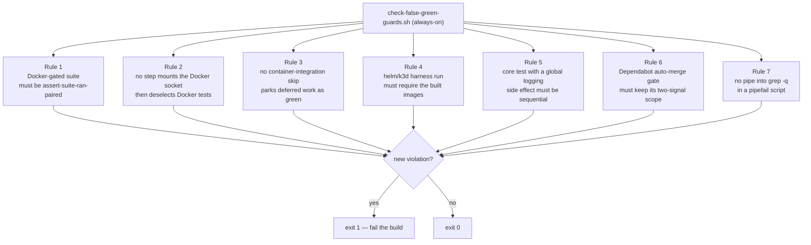

# False-Green Guards

## TL;DR

`.buildkite/scripts/steps/check-false-green-guards.sh` is a standing CI gate that
**fails closed when a new "false-green" test shape is introduced** — a test or CI
step that reports success while verifying nothing. It runs on **every build** and
is a few `grep`/`awk` sweeps (seconds).

It exists because the 2026-07-21 coverage audit classified its findings by the
*shape* of the false green, those categories lived only in plan documents, and the
repository then produced roughly a dozen fresh instances in a single day. This
guard turns the shapes that can be pinned down precisely into an enforced control,
so the pattern cannot recur silently.

It is deliberately narrow. A noisy grep everyone learns to ignore is worse than
nothing, so it enforces only rules that are (a) mechanically checkable with a low
false-positive rate and (b) tied to a real, shipped false green. Two of the
audit's five shapes are **declined** because they have no trustworthy textual
signature — see [Declined rules](#declined-rules).

## What it checks



| Rule | Shape it catches | Real instance it would have caught |
|------|------------------|-------------------------------------|
| **1** | A suite gated by `Assume.assumeTrue(DockerAvailability.isAvailable(...))` that is not paired with an `assert-suite-ran.sh` glob **for its own Maven module**. When Docker is unusable the suite reports SKIPPED and Maven exits 0, so a CI step checking only the exit code goes green having tested nothing. | The HTTP/3 suite and the socket-gated testcontainer/cloud suites, which skipped on 100% of builds while reporting green; and (found by this guard) the `Gcs`/`Azure` `RegistrarConfigWiringTest` cloud suites, which ran under a socket in CI but were never fail-closed-asserted. |
| **2** | A CI step that grants the Docker socket (`run-in-docker.sh -s`/`--docker-socket`) but then deselects the Docker-marked tests (e.g. `pytest -m "not docker"`). It pays to mount the socket, then starts no container, and passes green. | The python client job: `pytest -m "not docker"` deselected every container test while the socket was mounted; the job passed having started nothing. |
| **3** | A container-integration `logTestSkip` invoked with deferral language ("CI wiring is a follow-up", TODO, pending, …). A skip that parks unfinished work reads as green forever. | The `docker_compose_war_tomcat` WAR case, skipped as a "follow-up" and read as green for months. |
| **4** | A CI step that runs the container-integration harness (`integration_tests.sh`) with the helm/k3d cases active (does **not** set `SKIP_HELM_TESTS=true`) but fails to export **both** `REQUIRE_CLUSTERED_IMAGE=true` and `REQUIRE_WEBHOOK_IMAGE=true`. Without both, a missing image records a SKIP instead of a FAILURE and the three image-dependent cases silently stop running. | Deleting the two `REQUIRE_*_IMAGE=true` exports from `helm-integration-test.sh` — which reverts `helm_sidecar_injection`, `helm_clustered_convergence` and `helm_jgroups_dns_ping` to a green SKIP with no guard tripped. |
| **5** | A `mockserver-core` test whose source performs a JVM-global logging side effect — reaching `LogManager.getLogManager().readConfiguration(...)` (a JVM-wide handler `reset()`) via the static logging setters or a forced fresh `<clinit>` — that is **not** in the sequential-includes list of `mockserver-core/pom.xml`. In the parallel phase it races another test's log capture, silently zeroing a capture (a failing test) or falsely passing a silence assertion (a false green). | The release-blocking flake where `ClassInitializationDeadlockTest` / `ConfigurationPropertiesInitializationTest` forced a fresh `MockServerLogger`/`ConfigurationProperties` `<clinit>` in the parallel phase, resetting every logger's handlers mid-run. `ParallelStaticStateGuardTest` structurally cannot catch it — those classes are in neither the parallel-exclude nor the sequential-include list. |
| **6** | The Dependabot auto-merge gate losing one of the four properties its safety rests on: the `/distroless/` scope on the digest branch regex, a trailing hex-run floor of at least 7, the title cross-check that makes path B a two-signal AND, or `update-types` staying within {minor, patch} for every group whose name path A accepts. Each is a plausible tidy-up, and each silently widens what merges into `master` unattended. | Dropping `/distroless/` — a date-tagged bump such as `bump ubuntu from 202401151200 to 202402201200` matches the title regex (date tokens are all hex), so the scope is the only thing rejecting it; and adding `major` to a `*-minor-and-patch` group, which would put majors into a branch literally named `minor-and-patch` and auto-merge them. |
| **7** | A pipe into an early-exit grep (`grep -q`/`-m`/`--quiet`/`--silent`/`--max-count`) in a shell script or GitHub workflow `run:` block that runs under `set -o pipefail`. grep exits on its first match; if the writer still has output it dies of SIGPIPE and pipefail reports the whole pipeline as failed. That is a **false red** in an `if !` check and a **false green** in an `if` check. | This guard's own Rule 6c went red at random (Buildkite `mockserver` build 7643) on an unchanged, correct workflow. `generate-pipeline.sh`'s trigger-all path passed the whole file tree (~470 KB) through `printf \| grep -q` and silently skipped most pipelines. The `quiche`-leak checks in the jar-natives assertions could miss a leaked native. `examples/validate/run.sh` could report success with a failing client. The Dependabot auto-merge workflow could fail to recognise a security PR from its multi-line body, and so refuse it. |

Rule 1's match is **module-scoped**, not class-name-only. The correlation key is
the Maven module directory name — the last path segment before `/target/` in an
`assert-suite-ran` glob, and before `/src/test/` in a gated suite — which is
identical whether the glob is written `mockserver-blob-azure/target/...` (script
runs from within `mockserver/`) or `mockserver/mockserver-netty/target/...` (from
the repo root). A gated suite is "covered" only by a glob belonging to **its own
module**, so a new gated suite in an unpaired module (e.g. a hypothetical
`OracleBlobStoreContractTest` under `mockserver-blob-oracle`) is **not** reported
covered just because its class-name suffix (`*BlobStoreContractTest`) is shared by
a glob for the S3/GCS/Azure modules. That family — `*BlobStoreContractTest`,
`*LiveBrokerIntegrationTest`, `*RegistrarConfigWiringTest` — is exactly the growth
path this guard protects, and a class-name-only match would silently pass it.

One precision limit is worth stating rather than leaving implied: the key is the
module directory's **basename**, so it assumes those basenames are globally unique.
They are today — every Java module is a flat, distinct `mockserver/<module>` — but a
nested module that duplicated an existing basename would collapse two modules onto
one key, and a gated suite in one could then be reported covered by the other's glob.
That is the same fail-open the module-scoping exists to close, so if such a module is
ever added, re-key on a repo-root-relative module suffix.

Matching remains **glob-based within a module**: the guard verifies that *some*
`assert-suite-ran` glob for the suite's module would match the suite's class name.
This is not a residual false-green — the very same glob is what the module's
`assert-suite-ran.sh` invocation runs against the reports, so a within-module
suffix match means the assertion genuinely covers the suite.

Rule 1 also fails on a **dangling** `assert-suite-ran.sh` glob — one that names a
suite that no longer exists (renamed or removed) — so an assertion can never rot
into a permanent no-op. (The dangling check is class-name-only by design: a glob
whose class still exists but has *moved modules* surfaces above as a coverage
miss for the suite, not as a dangling glob.)

### Rule 4 is keyed on behaviour, not on a filename

Rule 4 does **not** hard-code `helm-integration-test.sh`. It sweeps every step
script, keeps the ones whose (comment-stripped) body **invokes the harness**
(`integration_tests.sh`) **with the helm cases active** (does not set
`SKIP_HELM_TESTS=true`), and requires each to export both `REQUIRE_*_IMAGE=true`
flags. Keying on that behaviour means a rename of the step, or a *second* step
that runs the helm harness, is covered automatically, while the docker-compose-only
harness step (`container-tests-run.sh`, which sets `SKIP_HELM_TESTS=true` and needs
no images) is correctly exempt. The exports are checked on the comment-stripped
body, so a commented-out `export REQUIRE_*_IMAGE=true` cannot satisfy the rule.

What Rule 4 does **not** catch: it verifies the exports are *present and set to
`true`*, not that the images are actually built upstream — that remains the
harness's own fail-closed check (`printFailureMessage … Failing closed`). If **no**
step runs the helm harness at all, Rule 4 fails closed rather than passing having
inspected nothing.

### Rule 5 is precise about "global logging side effect", and admits its limits

Rule 5 scopes to **`mockserver-core` test sources only** — the one module with the
parallel/sequential Surefire split it keys on — and flags a class only when a
signature matches a **non-comment** line. The signatures are deliberately narrow:

- the static setters carry the **`ConfigurationProperties.` qualifier**. The bare
  forms (`configuration().logLevel(Level.INFO).disableSystemOut(false)`) call the
  per-instance `Configuration` builder, which is **not** a global side effect;
  requiring the qualifier drops four legitimately-parallel classes
  (`GrpcFailSafeLoggingTest`, `ConfigurationSerializerTest`, `ConfigurationDTOTest`,
  `MockServerLoggerTest`) that a bare grep would have falsely flagged;
- the reflection signature is the **3-argument `Class.forName(…, true, …)`** form
  (a fresh `<clinit>` forced through a chosen classloader), not `Class.forName(` in
  general — the 1-arg `Class.forName(className)` over already-loaded classes and a
  `Class.forName('java.lang.Runtime')` inside a template string are both left alone.

Stated plainly, so the rule is not read as more than it is, Rule 5 does **not**
catch: a call site reached via a **static import** (bare `logLevel("X")`) or via
reflection — indistinguishable from the per-instance builder without semantic
analysis, so the qualified form is the low-false-positive choice; a global logging
side effect in **any module other than `mockserver-core`**; and, because the
reflection signature keys on the *shape* rather than the loaded class name (one real
call site loads a variable), it would also flag a 3-arg `initialize=true` load of a
*non-logging* class — acceptable, since forcing a fresh `<clinit>` in a chosen loader
is itself parallel-unsafe, and there are zero such cases today. If **no** core test
source matches any signature, Rule 5 fails closed (the signatures have rotted).

### Rule 7: why `printf "$x" | grep -q` is unsafe under pipefail

Bash line-buffers its standard output, so a `printf '%s\n' "$multi_line"` or an
`echo` of a multi-line value makes **one `write()` per line**. When
`grep -q` finds a match it exits straight away. Any write after that point
gets SIGPIPE, so the writer exits with 141, or curl exits with 23. Under
`set -o pipefail` the pipeline then reports **failure** even though grep
matched. The result depends on timing: CPU contention changes whether grep
exits before or after the last write. Rerunning the same input can therefore
flip the verdict, and a test that passes locally proves nothing. Once the
input is larger than the pipe buffer (64 KiB on Linux) the writer blocks
while grep is still reading. The failure then **always** happens whenever the
match comes early.

| Instead of | Write (bash; see the heredoc form below for `sh`) |
|------------|-------|
| `printf '%s\n' "$x" \| grep -q PAT` | `grep -q PAT <<<"$x"` |
| `echo "$out" \| grep -Fxq -- "$e"` | `grep -Fxq -- "$e" <<<"$out"` |
| `curl -s URL \| grep -q PAT` | `body="$(curl -s URL \|\| true)"; grep -q PAT <<<"$body"` |
| `docker ps … \| grep -q NAME` | `grep -q NAME <<<"$(docker ps … \|\| true)"` |
| `a \| grep -v X \| grep -q Y` (two-stage) | `live="$(grep -v X <<<"$a" \|\| true)"; grep -q Y <<<"$live"` |

A here-string has no writer process that can be killed. Bash writes the whole
string (to a temp file, or on bash 5.1+ to a pipe when it fits) before grep
starts. A command substitution `$(…)` reads to EOF, so the process inside it
always finishes.

**`<<<` is bash-only.** Under POSIX `sh` it is a syntax error. That includes
busybox `ash`, `dash`, a `#!/bin/sh` script, an `sh -c '…'` payload, a
`docker run --entrypoint sh … -c '…'` payload, `kubectl exec … sh -c`, and a
Dockerfile `RUN`. `helm-validate.sh` runs its checks inside
`alpine/helm … sh -c '…'`, so a here-string there makes the step exit 2 every
time. In an sh context use a **heredoc**. It is POSIX and has no writer process
either:

```sh
if grep -qE "^[[:space:]]+fsGroup:[[:space:]]+2000" <<EOF; then
$rendered_pod_sc
EOF
  echo PASS
fi
```

The closing `EOF` must start at column 0, or use `<<-EOF` with **tab**
indentation. Before rewriting a check, confirm which shell actually runs that
line. A `bash -ec '…'` payload is bash; an `--entrypoint sh` payload is not.

Rule 7 **keeps scanning multi-line `sh -c '…'` payloads** rather than skipping
them. Telling a payload apart from surrounding bash would mean tracking quotes
across lines, and any mistake in that parse would make the rule miss things.
The heredoc fix is valid in every shell, so a flagged line in an sh payload can
always be fixed and needs no allow-list entry.

What Rule 7 does **not** flag:

- A plain grep (no `-q`/`-m`) or a `grep -c`: both read to EOF. GNU grep also
  **drains** stdin when it stops early without `-q`/`-m`, so
  `… | grep PAT >/dev/null` is safe. The here-string is still the clearer form.
- A process substitution (`< <(cmd)`): its exit status is not part of the
  pipeline, so pipefail never sees it.
- Quoted text on a single line, **when it is data or a payload for a new shell**.
  Quoted text is blanked before matching. So an error message that *mentions*
  `x | grep -q y` is not flagged. A single-line `sh -c 'a | grep -q b'` or
  `bash -c "…"` payload is not flagged either: it runs in a **new** shell that
  does not inherit the caller's pipefail.
  - **Exception:** the payload is at risk if it sets pipefail itself
    (`bash -c 'set -o pipefail; … | grep -q …'`), or if the caller exported
    `SHELLOPTS`. Rule 7 misses that single-line case, so review it by hand.
  - This exemption **never** covers code that runs in the current shell. Three
    cases are matched raw:
    - a line whose double quotes contain `$(…)` or a backtick;
    - a line that calls `eval`;
    - a line that ends inside an open quote, because it opens or closes a
      multi-line string and its quote pairing is ambiguous.

    For example, `x="$(printf '%s\n' "$y" | grep -m1 a)"` is flagged. That
    house capture idiom runs in a subshell, which **does** inherit pipefail, and
    it fails with exit 141.
- grep reached indirectly:
  - through a variable (`| "$GREP" -q`) or a wrapper function;
  - behind `sudo`, `stdbuf`, `nice` or `xargs`;
  - inside a compound command after another command, as in
    `| ( cd d && grep -q x )`;
  - under a different name: `zgrep`, `rg -q`, `ag`, or an abbreviated long
    option such as `--qui`.
- Text after a `\"` inside double quotes. `strip_comments` does not understand
  escaped double quotes, so in `echo "a\"b # c"; cmd | grep -q x` the line is
  cut at the `#`, and the pipe after it is never seen.

What Rule 7 flags that is **safe**:

- A heredoc body is scanned like code, so a body line that reads
  `foo | grep -q bar` is flagged. Only data is being written there, so this is a
  false positive. Reword the text or add an allow-list entry.
- A flag-like argument after `--`, as in `grep -v -- -mfoo`, is read as the `-m`
  option and flagged.

Rule 7 **does** flag:

- `|&`
- a grep wrapped in `( … )` or `{ …; }`
- the prefixes `command`, `env` (with options such as `-i`), `timeout` (with
  options, including separate-argument ones like `-s KILL 5`) and `VAR=val`
- `\grep`, `/bin/grep` and `/usr/bin/grep`
- `egrep`/`fgrep`
- flag clusters (`-Fxq`, `-qE`, `-iq`), `-q` placed after the pattern, and
  `--max-count N`
- pipelines split across continuation lines, including blank or comment lines
  between a trailing `|` or `&&` and the grep
- `eval "… | grep -q …"`

**The detector tests itself on every run.**
`.buildkite/scripts/steps/check-false-green-guards.rule7-fixture` holds
must-flag cases (after a `#@flag` line) and must-not-flag cases (after `#@pass`).
The guard fails if the detector reports anything other than exactly the
`#@flag` lines, or if the fixture is missing or empty. When you change
`r7_hits`, add the shape you are fixing to the fixture first.

**Known limitation: `head` and early-exit `awk` are not covered.** A
`… | head -n1`, or an `awk` program that calls `exit`, stops reading in the same
way. The writer can be killed by SIGPIPE and pipefail marks the pipeline as
failed. The *output* is still correct, since `head` printed the lines it read;
only the exit status is wrong. What happens next depends on where that status is
used:

- A plain assignment such as `x="$(cmd | head -1)"` under `set -e` aborts the
  script, which is loud.
- Inside `if`, `||` or `&&`, the status is silently treated as a failure.

There are dozens of `| head` uses in pipefail scripts, and most ignore the
status. Deciding which ones act on it needs per-site judgement, so there is no
low-false-positive textual signature, and Rule 7 leaves them alone. When you
write one whose status matters, use a here-string or a capture instead, for
example `first="$(cmd)"; first="${first%%$'\n'*}"`.

The lesson for other gates is that pipefail turns a harmless early exit by a
reader into a failure of the writer. Before trusting any check shaped like
`writer | reader`, ask whether the reader can exit before the writer finishes.
**A check that sometimes gives the wrong answer is worse than one that always
does**, because a rerun hides it.

## Where it runs

Wired into the **always-on** steps in `.buildkite/scripts/generate-pipeline.sh`
(alongside `clients-version-consistency.sh`), on the `trigger` queue.

This is deliberate. A new false green can be introduced from a Java test source
(routes to `mockserver-java`), a `.buildkite` step script (`mockserver-infra`), a
client test step (that client's pipeline) or a `container_integration_tests`
script — **no single path-filtered pipeline sees them all**, so only an always-on
step catches every case. Rule 7 goes beyond `.buildkite/`: it sweeps every tracked
`*.sh` that sets `pipefail` (container-integration tests, the jar-packaging
assertions, examples, benchmarks), plus everything under `.buildkite/` and `scripts/`.
Sourced libraries run under their caller's `pipefail` without naming it.

Rule 7 also sweeps every GitHub workflow and composite action
(`.github/workflows/*.y*ml`, `.github/actions/**`). A `run:` block runs with
`-o pipefail` when it says `shell: bash`, and it can also `set -o pipefail`
itself, as `dependabot-auto-merge.yml` does. A `run:` block with no `shell:`
uses `bash -e`, which has no pipefail. Rule 7 flags those too: the here-string
form is always safe, and scanning everything means adding `shell: bash` later
cannot silently arm a race. Each YAML file is scanned whole; outside `run:`
blocks the pattern does not occur.

The guard is also linted by `infra-validate-scripts.sh` (`bash -n` +
`shellcheck`) like every other CI script.

## Rationale — why these three, and why not the others

The audit named five false-green shapes. A guard is only worth having if it would
have caught its real instance without crying wolf on legitimate code, so each
shape was judged against that bar.

### Declined rules

- **Self-derived golden fixtures** (LLM codec goldens regenerated from the codec
  they verify via `-Dmockserver.updateLlmGoldens=true`). *Declined:* whether a
  fixture is self-derived is a property of test *design*, not a textual pattern —
  there is no low-false-positive signature to grep for. The real defense already
  shipped: a structural contract test asserting the codec against hand-authored,
  schema-derived expectations (`LlmCodecStructuralContractTest`). A generic
  regeneration/mutation gate is the separately-declined pitest proposal (Gap #5 in
  `docs/plans/test-coverage-gaps.md`).
- **A guard whose own precondition can silently fail** (a gate whose toolchain was
  absent so it never ran; a `nullglob` scoping bug that returned success when the
  build produced nothing). *Declined:* "this bash can fail open" is not detectable
  by a standing grep — it is a logic-bug class. The mitigations are structural:
  `assert-suite-ran.sh` already fails closed when a glob matches nothing (the
  nullglob lesson), and `shellcheck` in `infra-validate-scripts.sh` catches many
  quoting/glob bugs.

The **npm-script variant** of Rule 2 ("`npm run test:unit` ran instead of the
integration suite") is also not covered: which npm script is the "real" one is not
mechanically distinguishable. Rule 2 covers only the crisp contradiction — mount
the socket **and** deselect the tests that need it.

## Allow-lists — how to add an entry

Some Docker-gated files are legitimately **not** assert-suite-ran-paired (for
example the probe's own unit test, `DockerAvailabilityTest`, which calls
`isAvailable()` with stubbed suppliers and starts no container). Each rule has an
allow-list array (`R1_ALLOWLIST` … `R5_ALLOWLIST`, and `R7_ALLOWLIST`; Rule 6 has
none by design).

An allow-list entry is a **justification, never a mute button.** Follow the
precedent of `check-certificate-expiry.sh`, which allow-lists the intentionally
expired fixture *and asserts it is still expired*:

1. Add the entry (a repo-relative path for Rules 1/2/4/5, a `path:lineno` for
   Rules 3 and 7 — for Rule 7, the line the pipeline starts on).
2. Write a comment saying **why** it is legitimately exempt.
3. The guard **verifies the entry still is what it claims** and fails the build if
   not — an entry that names a file that no longer exists, or (Rule 1) a file that
   has since gained an `Assume` gate and become a real suite, or (Rules 2/3) a
   location that no longer matches the pattern, is a hard error. So the allow-list
   cannot quietly rot into a no-op or mask a genuine regression.

If you find yourself wanting to allow-list a **real** finding to make the build
green, stop: the finding is the guard doing its job. Wire the suite up, run the
Docker tests, or make the skip declare a genuine N/A reason instead.

## Self-testing

Prove any rule bites by reintroducing its real defect and confirming the guard
goes red, then restore:

- **Rule 1** — remove an `assert-suite-ran.sh` glob line (e.g. a
  `RegistrarConfigWiringTest` pairing in `java-cloud-store-test.sh`).
- **Rule 2** — re-add `-m "not docker"` to `pytest` in a socket-mounting step.
- **Rule 3** — add a `logTestSkip "... follow-up"` line under
  `container_integration_tests/`.
- **Rule 4** — delete the two `export REQUIRE_*_IMAGE=true` lines from
  `helm-integration-test.sh` (the exact defect the rule exists to catch).
- **Rule 5** — remove a class from the `sequential-tests` `<include>` list in
  `mockserver-core/pom.xml` (e.g. `ClassInitializationDeadlockTest`); it is then
  flagged as a global-logging side effect not run sequentially.
- **Rule 7** — turn any here-string check back into its pipe form, e.g.
  `if printf '%s\n' "$CHANGED_FILES" | grep -qE -- "^test-fixtures/"; then` in
  `generate-pipeline.sh`; it is flagged as `generate-pipeline.sh:<line>: pipes into
  an early-exit grep`.
- **Allow-list rot** — point an allow-list entry at a nonexistent path (Rules 1/5),
  or at a location that no longer matches the rule's condition (Rules 2/3/4/5).
- **Empty corpus** — each rule also fails closed if its sweep matches nothing
  (globs/steps/signatures renamed or moved), rather than passing having scanned
  nothing.

Each should turn the guard's exit code to 1 with a `+++ :bangbang:` line naming
the offender.
