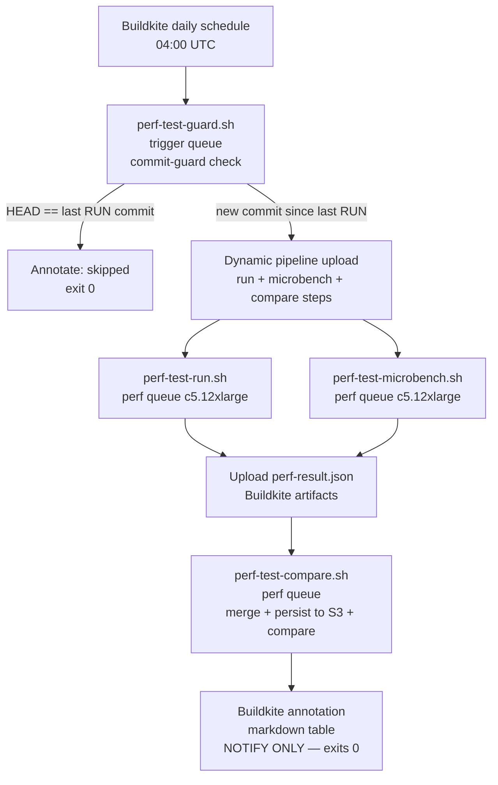

# Performance Tuning

Internal companion to the user-facing [Performance page](https://www.mock-server.com/mock_server/performance.html) and [Performance Configuration include](https://www.mock-server.com/mock_server/configuration_properties.html#performance). Where the website tells users *what knobs exist*, this doc explains *why each knob behaves the way it does*, points at the implementation, and captures the rules-of-thumb that aren't worth publishing externally.

## Where the budget actually goes

Three pools account for almost all of MockServer's CPU and memory under load:

| Pool | Sized by | What it bounds |
|------|----------|----------------|
| Netty event loops (server + outbound client) | `nioEventLoopThreadCount`, `clientNioEventLoopThreadCount` | Concurrent socket I/O — incoming connections, proxied outbound, SSE/WebSocket fan-out |
| Action-handler executor | `actionHandlerThreadCount` | Synchronous response/forward/callback dispatch off the event loop |
| LMAX Disruptor ring buffer + log retention | `maxLogEntries` (auto-derived from heap), `maxExpectations` | Recorded requests, verification log, persistent event store |

Read [docs/code/memory-management.md](../code/memory-management.md) before touching `maxLogEntries` / `maxExpectations` — those defaults are derived from heap size at first read, so changing heap without setting the limits explicitly can quietly shift them by an order of magnitude.

For the request-processing flow itself, [docs/code/request-processing.md](../code/request-processing.md) and [docs/code/netty-pipeline.md](../code/netty-pipeline.md) describe where each handler runs and how requests cross the event-loop / executor boundary.

## Optimization principles

One standing rule governs every performance change in this codebase:

**A performance change must never regress the small/common case in order to speed up the large/rare one.** Fast-path thresholds — the point at which an optimization kicks in, a cache is consulted, or a code path branches — must be chosen **empirically** from the JMH break-even point, not intuition. Always benchmark both tiny-N (the typical unit-test or low-load request) and large-N (the sustained-throughput or high-cardinality case) and gate the change on **no regression in either**. A threshold that is too low hurts the common case; a threshold that is too high means the optimization never fires at the scale it was designed for. The JMH harness in `mockserver-benchmark/` (run via `perf-test-microbench.sh`) and the k6 regression suite in `mockserver-performance-test/` are the canonical verification tools.

## Rules of thumb

These are the heuristics maintainers reach for when tuning real workloads. They are not contractual — measure before you change.

- **CPU-bound matching → grow `nioEventLoopThreadCount`** to `2 × cores` and leave `actionHandlerThreadCount` alone. Useful when most requests resolve from matchers without action dispatch (read-heavy verification workloads).
- **Action-heavy → grow `actionHandlerThreadCount`** to `4 × cores` and keep event loops at default. Useful when actions block on outbound IO (forwards, callbacks, JavaScript template evaluation).
- **Recording-heavy → raise heap before raising `maxLogEntries`.** The default is derived from heap; doubling `maxLogEntries` without giving the JVM more memory just shifts the eviction pressure into GC overhead.
- **Streaming heavy (SSE / WebSocket fan-out) → check the outbound event-loop count first** (`clientNioEventLoopThreadCount` and `webSocketClientEventLoopThreadCount`); the inbound side rarely saturates first.
- **mTLS or per-cert renegotiation in the hot path → enable `proactivelyInitialiseTLS=true`.** Defers nothing to first-connect; turn-on cost is one slow startup, ongoing cost is zero per-connection.
- **Proxy / forward heavy workloads benefit from `forwardConnectionPoolEnabled` (on by default).** MockServer pools and reuses idle HTTP/1.1 keep-alive upstream connections. The k6 forward baseline showed that opening a fresh connection per request can exhaust ephemeral ports under sustained load (21% errors at 750 rps, 68% at 1500 rps, 212k `BindException`s from local port exhaustion); pooling drove this to ~0% errors with no latency regression in a controlled A/B. Pooling is **safe to leave on**: the forward client runs on a dedicated event-loop group disjoint from the server workers (so a loopback object-callback can never self-deadlock a pooled connection) and a connection is only returned to the pool when its HTTP codec is genuinely clean — MockServer's `error()` action (raw bytes / drop connection) and any non-HTTP/malformed upstream reply are never pooled, so a later request can never reuse a corrupted connection. Set `forwardConnectionPoolEnabled=false` to restore the historical fresh-connection-per-request behaviour for unusual upstreams. Pooling applies to HTTP/1.1 keep-alive upstreams and to HTTP/2 upstreams (an HTTP/2 connection is reused with a fresh stream per request, keyed by host/port/scheme/protocol so HTTP/1.1 and HTTP/2 never mix) — this is what stops an HTTPS forward proxy whose client negotiated HTTP/2 in a CONNECT (MITM) tunnel from churning a fresh upstream connection per request. HTTP/3, binary forwarding, streaming responses, proxy-tunnelled connections, `Connection: close` upstreams, and any reply that did not parse as a valid HTTP response always use a fresh connection.
- **Under sustained high-rate, low-latency forwarding/injection, enable `forwardConnectionPoolKeepAlive` (opt-in, default off).** When a fast upstream returns in well under a millisecond, requests are dispatched faster than earlier connections are returned to the pool, so each `acquire` misses, opens a fresh connection, and the surplus is then closed back down to `forwardConnectionPoolMaxIdlePerKey` — requests-per-connection collapses (measured ~210 at 2000 rps falling to ~3.4 at 4000 rps for a trivial GET) and a single instance pegs CPU on connection setup. Raising `forwardConnectionPoolMaxIdlePerKey` alone does not fix this because the bottleneck is the acquire-miss during the in-flight window, not the release cap. `forwardConnectionPoolKeepAlive=true` RETAINS warm connections on release (up to `forwardConnectionPoolMaxTotalPerKey`, default 2000) instead of closing them, so the warm set grows to match the offered concurrency and is reused — eliminating the churn. With keep-warm off the pool's release close-decision is byte-for-byte unchanged. Warm connections are still reaped after `forwardConnectionPoolIdleTimeoutMillis` of inactivity, so the pool drains when load stops (no leak). The acquire hot path is identical in both modes.
- **TCP keepalive on forward/proxy upstream connections is on by default (`forwardSocketKeepAlive`).** The forward client sets `SO_KEEPALIVE` so the OS detects dead/half-open upstream connections faster and keeps NAT/firewall mappings warm. On the native epoll transport the timers are tuned (`forwardSocketKeepAliveIdleSeconds` 60, `forwardSocketKeepAliveIntervalSeconds` 15, `forwardSocketKeepAliveCount` 4 → ~120s dead-peer detection); on NIO only `SO_KEEPALIVE` is set (epoll is required for timer tuning). This is a benign default-on hardening (standard for production HTTP clients; only an occasional probe packet on idle connections) — set `forwardSocketKeepAlive=false` to restore the historical no-keepalive behaviour. **Keepalive complements the idle reaper, it does not replace it:** with the default `forwardConnectionPoolIdleTimeoutMillis` (30s) idle pooled connections are reaped *before* the 60s keepalive idle fires, so the main keepalive wins are (a) half-open detection during active/long-lived/streaming requests (where the reaper does not apply because the connection is in use) and (b) when you raise `forwardConnectionPoolIdleTimeoutMillis` above the keepalive idle. **Stale-connection guidance:** when you enable keep-warm pooling against a real upstream (behind a load balancer/NAT/firewall), keep `forwardConnectionPoolIdleTimeoutMillis` below the upstream/NAT idle-eviction window so idle pooled connections are closed before the path silently drops them; keepalive then catches any that still go half-open during an active request, failing the request cleanly (the caller retries) rather than hanging until the forward timeout.

> **Maintainer verification guard.** The two failure modes this pooling design guards against — the loopback self-deadlock (forward client sharing the server worker group) and the response desync (pooling a dirty keep-alive channel) — only surface in the **failsafe integration phase**, never in a targeted `-Dtest` unit run. This area has regressed **twice** for exactly that reason: per-unit verification skipped the failsafe phase. Any change to the forward connection pool, its quiescence gate (`HttpClientHandler` / `ChannelCleanliness`), or the dedicated forward-client event-loop group (`LifeCycle.forwardClientGroup`, wired via `MockServer.getForwardClientEventLoopGroup()`) **MUST** be verified by running the Extended / Websocket / proxy `*IntegrationTest` classes with pooling on (the default) — for example `ExtendedNettyMockingIntegrationTest`, `WebsocketCallbackRegistryIntegrationTest`, and the proxy integration tests — not just the fast unit guards (`NettyHttpClientConnectionPoolTest`, `ForwardClientEventLoopIsolationTest`, `ForwardConnectionPoolLoopbackCallbackTest`).

## JVM flags

The maven CI build agent invokes the JVM with `-Xms2048m -Xmx6144m` (see `scripts/buildkite_quick_build.sh`). For production-like load testing, set both `-Xms` and `-Xmx` to the same value to avoid heap-resize stalls during the run.

**Docker image heap and GC defaults.** The shipped Docker images cap the JVM heap at 50% of the container memory limit (`-XX:MaxRAMPercentage=50.0` hard-coded in the ENTRYPOINT, `45.0` in the GraalJS image; 512 MiB is the smallest supported limit (768 MiB for a `-clustered` node with the Infinispan backend) — see [docker.md → Heap Cap](../infrastructure/docker.md#heap-cap)) and default to ZGC via `ENV JAVA_TOOL_OPTIONS="-XX:+UseZGC"` (the standard and local images run JDK 26; the root, snapshot and GraalJS images run JDK 25 — ZGC is generational by default on both). The `-clustered` image uses `ENV JAVA_TOOL_OPTIONS="-XX:+UseZGC -XX:+ZGenerational"` (JDK 21 base, where ZGenerational must be set explicitly). The `-aot` image keeps G1 (no `JAVA_TOOL_OPTIONS`; see `docker/aot/Dockerfile`). To override the GC or set an explicit heap, set `JAVA_TOOL_OPTIONS` on the container — it replaces the default entirely, so include `-XX:+UseZGC` if you still want it. Setting `-Xmx` disables `MaxRAMPercentage`; choose one mechanism. Passing a different `MaxRAMPercentage` via `JAVA_TOOL_OPTIONS` does not work: the ENTRYPOINT flag is applied last and wins. For the standalone JAR the JVM default collector (G1) is used unless you pass flags yourself.

A heap dump on OOM is *not* enabled by default; for triage runs add `-XX:+HeapDumpOnOutOfMemoryError -XX:HeapDumpPath=/var/log/mockserver/` via `JAVA_OPTS` (standalone JAR) or `JAVA_TOOL_OPTIONS` (Docker).

### GC selection

ZGC has been production-ready since Java 17. For latency-sensitive deployments — particularly those running with large `maxLogEntries` (deep event ring buffers) — `-XX:+UseZGC` typically holds stop-the-world pauses in the single-digit millisecond range (1–5 ms) regardless of heap size, where G1 (the server-class default) commonly sits in the 50–200 ms range during mixed cycles under sustained allocation.

**Which ZGC you get depends on the JVM.** The Docker images (other than `-clustered`) bundle Java 25 or 26, where ZGC is *generational* and `-XX:+UseZGC` alone selects it. The separate `-XX:+ZGenerational` flag was removed in JDK 24: passing it does no harm but has no effect — the JVM logs `Ignoring option ZGenerational; support was removed in 24.0` and starts normally — so drop it from your flags on the main images. On the `-clustered` image (JDK 21) `-XX:+ZGenerational` is already set. On your own Java 17 JVM, `-XX:+UseZGC` gives the older non-generational collector, whose pauses are single-digit milliseconds rather than the sub-millisecond figures generational ZGC reaches.

These numbers are based on typical GC behaviour, not MockServer-specific benchmarks. Use the `mockserver-performance-test/` k6 harness with `mockserver.outputMemoryUsageCsv=true` to confirm your workload before switching.

Rules of thumb for the **standalone JAR** (Docker images already use ZGC by default):
- **Heap < 2 GB:** stay on G1 (the JDK default). ZGC's fixed overhead is not worth it for small heaps.
- **Heap 2–4 GB:** G1 is fine for almost everything. Switch to ZGC only if you've measured GC pauses on the matcher path.
- **Heap ≥ 4 GB and p99 latency matters:** add `-XX:+UseZGC` via `JAVA_OPTS`. Set `-Xms` and `-Xmx` to the same value (e.g. `-Xms4g -Xmx4g`) so the heap is pre-committed.

In containerised deployments, size the container memory limit at least ~1.5× the `-Xmx` value when using ZGC. The kernel OOM-killer reacts to physical memory (RSS), not virtual address space — what eats RSS beyond `-Xmx` is the JVM's own overhead (code cache, metaspace, JIT, thread stacks) plus Netty's direct buffer pool. ZGC adds a further wrinkle on some cgroup setups: it multi-maps the same physical pages for its coloured-pointer scheme, and under certain RSS-accounting modes those pages are counted multiple times against the cgroup limit, so the kernel can OOM-kill the process even though the actual physical footprint fits. Example: `-Xmx4g` → `--memory=6g`.

Shenandoah is deliberately omitted: it has been production-ready since OpenJDK 15 (JEP 379) and is therefore available in OpenJDK 17, but it is absent from Oracle JDK 17 and not universally available across all JDK distributions. ZGC is the simpler recommendation because it ships in every JDK 17 distribution MockServer supports.

## Measuring

Two enable-it-once-then-leave-it knobs:

- `mockserver.metricsEnabled=true` exposes Prometheus metrics at `GET /mockserver/metrics`. The exposed metrics are listed in [docs/code/metrics.md](../code/metrics.md). Always enable this for any non-trivial perf investigation — Buildkite agents have it off by default to avoid skew.
- `mockserver.outputMemoryUsageCsv=true` writes per-second JVM memory snapshots to `memoryUsage_<yyyy-MM-dd>.csv` in the working directory (or `memoryUsageCsvDirectory` if set). Useful when reproducing a leak: grep for the heap line, plot it, and you get the same data the dashboard summary shows.

The repo has a k6 harness in `mockserver-performance-test/` (`k6/load.js` with thresholds as gates). Use it as a starting point for your own scenarios — don't read the numbers as canonical (they're agent-class-dependent).

MockServer can also drive load itself via a **load scenario** (`PUT /mockserver/loadScenario`, off by default; see [docs/code/load-generation.md](../code/load-generation.md)). This is **dual-purpose with the forward path**: a load scenario sends through the same `NettyHttpClient` the forward/proxy actions use and records into the same forward metrics histograms, so the tuning here (worker threads, the forward client, metrics overhead) applies equally whether the forward traffic comes from a proxied client or from a load scenario. The scenario's own safety caps — `loadGenerationMaxVirtualUsers`, `loadGenerationMaxInFlightRequests`, `loadGenerationMaxRequestsPerSecond` — bound how hard it can push and exist to stop the generator self-DoSing the server, not to tune throughput; raise them deliberately and watch the same metrics you would for any forward load.

## What's deliberately not tuned

These look like knobs but are not — changing them rarely helps and often hurts:

- **Ring buffer size** — directly tied to `maxLogEntries` via `nextPowerOfTwo`; do not try to size them independently. The Disruptor needs the power-of-two for its index masking.
- **`mockserver-core` Surefire two-phase parallel execution** — do not collapse it back to a single phase. The bulk of the suite runs with `parallel=classes` (`threadCount=4`); a small `sequential-tests` execution (`parallel=none`) runs the classes that mutate JVM-global state which cannot be thread-isolated (`ConfigurationProperties` system-property config, the static Prometheus `Metrics` registry, and globally-fixed time for assertions on event-log disruptor-thread timestamps). An earlier single-phase `parallel=classes` attempt deadlocked on a `ConfigurationProperties` ↔ `MockServerLogger` `<clinit>` cycle; that cycle is now fixed (`ClassInitializationDeadlockTest`) and the `UUIDService` / `EpochService` / `TimeService` test-mode switches are thread-scoped, so the parallel phase is stable. `ParallelStaticStateGuardTest` enforces that the parallel-excluded and sequential-included class lists stay in sync.
- **`mockserver-netty` integration tests are NOT fork-parallelised** — and this was tried and deliberately reverted (2026-06-01), so do not re-attempt it without first hardening the tests. Failsafe runs them serially (~328s on a 14-core dev box). Forking the suite (`forkCount=4`, both `reuseForks=true` and `=false` tried, with the 6 `PortFactory`-preallocated-port classes split into a `forkCount=1` sequential bucket) cut wall time to ~180s **but was intermittently flaky** — 4 of 5 validation runs failed. The suite is studded with wall-clock timing assertions in the shared `mockserver-integration-testing` base classes (e.g. `shouldReturnResponseForExpectationWithDelay` bounds a 2s server-side delay at ≤4s; the various `*WithDelay` forward/callback tests are similar) that do not survive the CPU/scheduler contention and per-class JVM churn of parallel forks: observed blow-outs ranged from 8.6s to >1000s, plus TLS-forward timing failures. State isolation is *not* the blocker (port 0 binding, unique temp files, and per-fork `ConfigurationProperties` all hold up) — the timing assertions are. Re-enabling fork parallelism here requires first making those assertions robust (relative/tolerant bounds, or isolating the Scheduler from contention), which is a larger change to shared test infrastructure. Netty *unit* tests are also left single-phase: one timing-bound class (`DashboardWebSocketHandlerTest`, ~30s) dominates and fixed compile overhead swamps any parallel gain.
- **Connection-lifecycle chaos and the preemption cordon** — both are zero-cost on the hot path when no lifecycle chaos is registered and no preemption is active, which is the default state. `NettyResponseWriter.resolveLifecycleProfile()` returns `null` on a single `TcpChaosRegistry.activeCount() == 0` volatile read; the L6 cordon check in `HttpRequestHandler.channelRead0()` returns immediately on a single `PreemptionSimulator.isCordoned()` volatile read. The configuration property `connectionLifecycleChaosEnabled` defaults to `true`, but until a TCP-chaos profile or a preemption is registered these reads always return false/null — no allocation, no branching beyond the initial guard, and no impact on throughput or latency. To eliminate even the volatile reads, set `connectionLifecycleChaosEnabled=false`.
- **`matchersFailFast`** — defaults to `true` (early-exit on first non-matching field) and that is almost always right. Disable only when you specifically need every field's match status in the failure log.
- **`regexMatchingTimeoutMillis`** — defaults to 5000 ms (5 seconds), which hands every regex evaluation off to a thread pool with a `future.get(timeout)` to guard against catastrophic-backtracking (ReDoS). The thread-pool hand-off itself costs a context switch per regex evaluation per matcher per request. If you control all expectations and are confident no regex can back-track catastrophically, set `regexMatchingTimeoutMillis=0` to run the regex inline on the event-loop thread and skip the hand-off entirely. **Do not set this to 0 when expectations come from untrusted sources** — `MatchingTimeoutExecutor` is the ReDoS guard.

## Performance regression pipeline

A daily, notify-only pipeline catches performance regressions automatically by comparing each run against a rolling stored-history baseline. It runs independently of the opt-in `k6 load test` step that already exists in the regular build pipeline (that step stays unchanged).

### What it runs



**Commit guard:** `perf-test-guard.sh` resolves the commit the heavy regression run *last actually executed against* (`last_perf_run_commit` in `lib/last-successful-commit.sh`) and dispatches only when `HEAD` differs. Crucially this keys off **real runs, not lint passes**: the perf-test pipeline passes on its lint step on every push, so "last successful build" would almost always be `HEAD` and the guard would skip forever. Instead, `perf-test-run.sh` records `perf_regression_ran_commit` in the build's Buildkite meta-data when it runs, and the guard reads the most recent such value via the Buildkite API. If `HEAD` equals it, the pipeline annotates "skipped" and exits; otherwise it dynamically uploads the run/microbench/compare steps. (The sibling `last_successful_commit` helper — last *passed build* — remains used by `generate-pipeline.sh` for path-based change detection.)

**Run step (`perf-test-run.sh`, `perf` queue):** Starts a dedicated upstream MockServer (needed for the `forward` behaviour) and the server under test with metrics enabled and default `maxLogEntries`. On hosts with 16+ vCPU it core-pins the server, upstream, and k6 to disjoint cpusets for reproducibility; on smaller hosts it skips pinning with a warning. Runs `regression.js` twice — once over plain HTTP, once over HTTPS (ALPN auto-negotiates HTTP/2), then runs `growth.js` with a background sampler collecting CPU (`docker stats`), heap (`jvm_memory_used_bytes{area="heap"}`), GC (`jvm_gc_collection_seconds_sum`), and threads (`jvm_threads_current`) from `/mockserver/metrics` every 5 seconds. Assembles and uploads `perf-result.json`.

**Microbench step (`perf-test-microbench.sh`, `perf` queue):** Builds `mockserver-core` inside `mockserver/mockserver:maven`, runs the JMH `MatchingBenchmark` (`mockserver/mockserver-benchmark`) with `-prof gc` over focused params. Reshapes JMH output into `perf-microbench.json`.

**Compare step (`perf-test-compare.sh`, `perf` queue):** Merges the two artifacts; persists the run to `s3://mockserver-ci-perf-results/runs/<branch>/<iso>__<sha>.json`; fetches the last N=10 prior runs. If fewer than MIN_BASELINE=5 runs exist it annotates "baseline warming up" and stops. Otherwise it computes a regression threshold per metric using a rolling **median + MAD** baseline and flags regressions.

### Triggering a run

The heavy run is gated so it does not fire on ordinary commits. There are three ways to start one:

- **Daily schedule (automatic).** A Buildkite schedule (`perf_regression_daily`, `0 4 * * *` UTC, defined in `terraform/buildkite-pipelines/pipelines.tf`) creates a `build.source == 'schedule'` build. The commit guard dispatches the heavy steps only if `master` has moved since the last *actual* run (see the meta-data mechanism above).
- **Manual UI build.** Clicking **New Build** on the `mockserver-performance-test` pipeline creates a `build.source == 'ui'` build. This **force-dispatches** the run regardless of the new-commit check, so you can re-measure the same commit on demand.
- **`[perf-run]` build message (API / CLI).** Any build whose message contains `[perf-run]` force-dispatches the run — the programmatic equivalent of the UI button. The daily schedule and the orchestrator's path-based triggers never carry this marker, so it cannot fire the heavy run by accident. Example:
  ```bash
  curl -H "Authorization: Bearer $BK_TOKEN" \
    -X POST "https://api.buildkite.com/v2/organizations/mockserver/pipelines/mockserver-performance-test/builds" \
    -d '{"commit":"<sha>","branch":"master","message":"[perf-run] manual run"}'
  ```

`ui` and `[perf-run]` set `FORCE_RUN=true` in `perf-test-guard.sh`, bypassing the "new commit since last run" check; a `schedule` build respects it. The guard runs on the cheap `trigger` queue; only the dispatched run/microbench/compare steps consume the `perf` queue (up to three c5.12xlarge agents that scale from zero, so allow a few minutes for an agent to launch).

### Behaviours measured

Four behaviours run in `regression.js`, each as a `constant-arrival-rate` k6 scenario tagged `op:<name>`:

| Tag | What it measures |
|-----|-----------------|
| `match` | Static mock match and response |
| `forward` | Forward action to a dedicated upstream MockServer |
| `template` | Velocity response template rendering |
| `large` | ~4 KB JSON response body |

A warmup scenario (`op:warmup`) always runs first so JIT compilation and GC reach steady state before measurements begin.

Each behaviour is measured twice: `<op>_http` over plain HTTP and `<op>_https_h2` over HTTPS with HTTP/2 (ALPN). Result keys are `<op>_<proto>` (`match_http`, `match_https_h2`, etc.).

`growth.js` covers the separate "resource grows over time" class of regression (validated against [issue #2329](https://github.com/mock-server/mockserver/issues/2329): O(n) request-log eviction once the `maxLogEntries` ring fills — up to 250,000 entries, ~115,500 on the 2 GB GraalJS perf SUT — causes CPU/latency to climb). It runs a sustained `load` scenario on the match path at a rate high enough to fill `maxLogEntries` early, with low-rate latency probes at the start (`window:first`) and end (`window:last`) of the run. It emits first/last-window p95 and their ratio.

### Result JSON schema

Two artifacts are produced per run and merged by the compare step before persisting to S3:

- `perf-result.json` — `{metadata, behaviours: {<op>_<proto>: {p50_ms, p95_ms, p99_ms, throughput_rps, error_rate}}, growth: {cpu_peak, heap_start, heap_end, heap_peak, heap_ratio, gc_seconds_delta, threads_peak, p95_start, p95_end, p95_ratio}}`
- `perf-microbench.json` — `{microbench: {<matcherType>_<count>_detailed: {time_per_op, time_unit, alloc_bytes_per_op}}}`

### Regression thresholds

The compare step applies a **rolling median + MAD** baseline over the last N=10 prior runs. A metric is flagged when the head value crosses `max(median + 3 × 1.4826 × MAD, percent-floor)`:

| Metric class | Direction | Min pct floor |
|---|---|---|
| Latency (p50/p95/p99) | Higher is worse | 10% |
| CPU, heap, alloc | Higher is worse | 10% |
| Throughput | Lower is worse | 10% |
| Microbench time/alloc | Higher is worse | 5% |
| Growth slope (CPU ratio, heap ratio) | Higher is worse; absolute floor 1.30 (constant-load CPU/heap should hold ≈ 1.0) so steady-state badness is not normalised away | 10% |
| Growth slope (p95 latency ratio) | Higher is worse; absolute floor 2.0 (latency is noisier; a #2329-class signal is ~hundreds×) — rolling median+MAD stays the sensitive gate | 10% |
| Error rate | Higher is worse; absolute floor 0.005 | — |

The pipeline uses **per-metric gating**. A flagged regression on a **gating** metric fails the build (the compare step exits non-zero — and there is no `soft_fail`, so the build goes red). A flagged regression on a **notify-only** metric is reported just as loudly in the annotation but does not change the exit code. The failing build **is** the regression notification — there is no separate webhook or channel.

Only metrics with a derived, trustworthy budget gate today: the **JMH micro-benchmark** metrics (`*.time_per_op`, `*.alloc_bytes_per_op` — deterministic, hardware-independent) and **`forward.error_rate`** (a discriminating pass/fail guard, not a tuned threshold). Every other metric — all k6 latency percentiles, the growth ratios, `rig_valid_peak_achieved_rps` and `live_set_bytes` — runs notify-only. A notify-only metric graduates to gating once it has ≥ 10 clean runs of history and a budget derived from them; the repo owner decides each promotion. See the performance programme plan ([docs/plans/performance-programme.md](../plans/performance-programme.md)).

### Reading the annotation table

The annotation shows one row per compared metric with columns: metric key, head value, baseline (median), threshold, **Gate** (`gating` or `notify-only`), and Status. Status is `:red_circle: REGRESSION (fails build)` for a flagged gating metric, `:warning: flagged (informational)` for a flagged notify-only metric, `:new: new` for a metric with no baseline yet, and `:white_check_mark: ok` otherwise. The "baseline warming up" annotation appears when fewer than 5 prior runs exist on the branch — this is expected when the pipeline is first deployed or after the S3 history is pruned.

### Re-baselining

The rolling baseline is self-healing: as runs accumulate, old outlier runs age out of the N=10 window. To force a clean baseline (e.g. after a deliberate performance improvement), delete the S3 objects under `s3://mockserver-ci-perf-results/runs/master/` for the range you want to drop. The pipeline will annotate "baseline warming up" until 5 new runs accumulate.

### Key files

| File | Purpose |
|------|---------|
| `.buildkite/pipeline-perf-test.yml` | Pipeline definition — guard step gated on `build.source == 'schedule'`/`'ui'` or a `[perf-run]` build message |
| `.buildkite/scripts/lib/last-successful-commit.sh` | Shared helper: `last_successful_commit` (last passed build) for `generate-pipeline.sh` + `last_perf_run_commit` (last actual run, via `perf_regression_ran_commit` meta-data) for the guard |
| `.buildkite/scripts/steps/perf-test-guard.sh` | Commit-guard + dynamic pipeline upload (`trigger` queue) |
| `.buildkite/scripts/steps/perf-test-run.sh` | k6 run + background sampler + result assembly (`perf` queue) |
| `.buildkite/scripts/steps/perf-test-microbench.sh` | JMH microbench + JSON reshape (`perf` queue) |
| `.buildkite/scripts/steps/perf-test-compare.sh` | S3 persistence + median+MAD compare + annotation (`perf` queue) |
| `.buildkite/scripts/lib/perf-budgets-validate.sh` | Schema check for `perf-budgets.json`, shared by the compare and allocation gates. Both gates decide with jq comparisons, and jq orders *every string above every number* — so a quoted `floor` makes the comparison true regardless of value and silently switches the budget off. The validator rejects a non-numeric `floor`/`min_pct`, an unrecognised `dir`, and any unknown or missing key — a typo of `gating` would otherwise pass every value check while quietly turning a build-failing metric into a notify-only one. It carries a `--self-test` the gates run on every build, so the guard proves it still rejects those shapes rather than being trusted |
| `mockserver-performance-test/k6/regression.js` | k6 regression scenarios (4 behaviours × HTTP+HTTPS/H2, warmup) |
| `mockserver-performance-test/k6/growth.js` | k6 growth/slope scenarios (sustained fill + window probes) |
| `s3://mockserver-ci-perf-results/` | Historical run storage (see [AWS Infrastructure](../infrastructure/aws-infrastructure.md)) |

## When perf regresses unexpectedly

1. Check if `metricsEnabled` is on in the affected environment. If not, turn it on and re-run.
2. Look at `mockserver_action_count_total` by action type — a regression in one action category usually points at the responsible code path.
3. Compare ring-buffer drop counters (`mockserver_log_entries_dropped_total`) to baseline. Any non-zero value means log retention is the bottleneck, not the request path.
4. If event loops are pegged, take a thread dump (`jcmd <pid> Thread.print > dump.txt`) and look for stack traces parked on outbound IO — usually a slow downstream, not a MockServer bug.
5. Pull a JFR recording (`-XX:StartFlightRecording=filename=mockserver.jfr,duration=2m`) if you need allocation-level detail. Open in Mission Control or the IntelliJ profiler.
