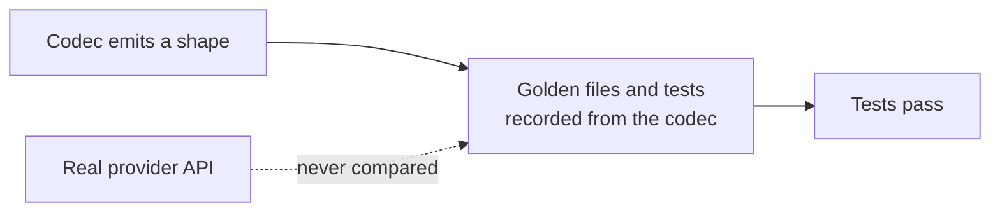

# LLM Provider Wire-Shape Fixes

## Outcome

Every `httpLlmResponse` provider should return what the real provider API returns, and accept
what real SDKs send, so client libraries, agent frameworks and gateways work against a mock
without special cases. GitHub discussion
[#2757](https://github.com/mock-server/mockserver-monorepo/discussions/2757) found that
`BEDROCK` returned Anthropic's Messages shape where the docs promised the AWS Converse API. An
audit of every provider on 2026-10-03 then found the same class of bug elsewhere. The items
below are worked in batches, most SDK-breaking first. The release is **not** gated on finishing
this plan: each item ships when it lands. When every item is closed this file is deleted in the
same commit.

## Why this class of bug got through

The codec tests derive their expected values from the codec itself. Examples:
`shouldEncodeCanonicalTokenUsageCounts` checks only non-streaming bodies and excludes the
OpenAI-compatible aliases, and the Responses tests set `call_id` equal to `id`. Item 16 closes
this gap.

## What remains

| # | Item | Batch |
|---|---|---|
| 2 | OpenAI Responses tool calls and stream completion | 1, in progress |
| 3 | OpenAI Chat streaming usage chunk | 1, in progress |
| 4 | Embeddings: per-provider input fields and one vector per input | 1, after item 1 lands |
| 5 | Proxied streaming LLM calls are never costed | 2 |
| 6 | Gemini thinking tokens counted wrongly | 2 |
| 7 | Ollama `done_reason` missing | 3 |
| 8 | OpenAI-compatible providers drop provider-specific fields | 3 |
| 9 | Anthropic and Bedrock stop reasons not mapped | 3 |
| 10 | Rerank ignores request `top_n`/`top_k`; Cohere v2 path unknown | 3 |
| 11 | Request-decode gaps leave conversation matchers blind | 3 |
| 12 | Bedrock follow-ups from item 1's review | 3 |
| 13 | Dashboard LLM traffic parsing misses real paths and streams | 4 |
| 14 | Suspected shape gaps to verify | 5 |
| 15 | Azure GA path detected as OpenAI | 5 |
| 16 | Contract tests against recorded real-provider responses | 5 |

## Items

| # | Problem | Fix |
|---|---|---|
| 1 | **Closed.** Converse and ConverseStream shapes ship, with the request picking the shape. Evidence: `BedrockConverseCodecTest`, the `bedrock-converse` golden files, `LlmCodecStructuralContractTest.shouldEncodeBedrockConverseStructureOnConversePaths`, and the netty `LlmAgentLoopE2eTest` Converse tests, which include the discussion's exact expectation. `BedrockCodec` delegated to `AnthropicCodec`, so `/model/{model}/converse` returned Anthropic's Messages body (no `usage.totalTokens`, no `output.message`), and Converse requests decoded to an empty conversation. | A Converse codec chosen per request by path (body shape on other paths), raw-JSON ConverseStream event-stream frames, Converse request decode, and Converse response parsing in `BedrockLlmClient`. `/invoke` is unchanged. |
| 2 | `OpenAiResponsesCodec` emits `function_call` items without `call_id` and no `function_call_arguments` events. `response.completed` carries no `output` or `sequence_number`. Decode keys the call by `id` and the result by `call_id`, so `containsToolResultFor` never matches. The OpenAI Agents SDK reads its final turn from `response.completed`, so its loop ends. | Emit the full Responses object and event set with a distinct `call_id`, and link tool results by `call_id`. |
| 3 | `OpenAiChatCompletionsCodec` streaming never sends usage, even with `stream_options.include_usage`. This affects OPENAI, AZURE_OPENAI and the six OpenAI-compatible aliases. Token counts read zero in the Vercel AI SDK, LangChain `stream_usage`, LiteLLM and Langfuse. | With `include_usage`, send the final usage chunk (`choices: []`) before `[DONE]`. |
| 4 | `HttpLlmResponseActionHandler.extractInputFromRequest` reads only a top-level `input`. Gemini `content.parts`, Titan `inputText`, Cohere `texts[]` and Ollama `prompt` therefore become `""`, so every document gets the same vector. Every codec emits one vector even for array input. Also: OpenAI `model` is hard-coded, Cohere-on-Bedrock lacks `id`/`response_type`/`texts` and ignores `embedding_types`, `startsWith("cohere")` misses region-prefixed IDs, Titan v2 lacks `embeddingsByType`, and Gemini `batchEmbedContents` is unsupported. | Read each provider's input field and return one vector per input in each provider's real shape. |
| 5 | `emitForwardGenAiSpan` parses a forwarded LLM response with a single JSON read that throws on SSE, and the throw is swallowed. Ollama NDJSON reads only the first line. Streaming agents (coding CLIs always stream) record zero tokens and zero cost, so `llmCostBudgetUsd` never trips, although the docs say it applies on every forward path. | Parse each provider's streamed usage (final SSE event, Ollama `done:true` line). |
| 6 | `GeminiCodec` sets `candidatesTokenCount` to all output and adds `thoughtsTokenCount` on top, so clients that add the two overcount. `GeminiLlmClient` ignores thoughts, so proxied Gemini 2.5 cost is undercounted. | Split output into candidates plus thoughts on encode; count thoughts as output on parse. |
| 7 | `OllamaCodec` never writes `done_reason`, so a `stopReason` such as `length` cannot be tested. MockServer's own `OllamaLlmClient` reads it. | Emit `done_reason` on the final message. |
| 8 | `OpenAiCompatibleChatCodec` delegates everything to the OpenAI codec. DeepSeek `reasoning_content` and cache-hit usage, Groq `reasoning`, timing usage and `x_groq`, and the xAI and OpenRouter extras are dropped. The docs say these providers produce identical bodies. | Per-provider additions over the OpenAI shape; correct the docs. |
| 9 | `AnthropicCodec` passes `stopReason` through verbatim, so a shared expectation using `stop`, `length` or `tool_calls` produces invalid Anthropic values. | Map to `end_turn`, `max_tokens`, `stop_sequence`, `tool_use` and so on, as the OpenAI and Gemini codecs already normalise. |
| 10 | Rerank applies only the expectation's `topN`, ignoring the request's Cohere `top_n` and Voyage `top_k`. Voyage ignores `return_documents` and hard-codes the model. Cohere's current `/v2/rerank` is unknown to the docs and `ProviderDetector`. | Honour the request fields; add the v2 path. |
| 11 | Gemini decode ignores `systemInstruction`. The OpenAI and Responses decoders map the `developer` role to user. Responses decode ignores `instructions`. Ollama `/api/generate` (`prompt` in, `response` out) decodes to an empty conversation. | Decode each into the conversation model. |
| 12 | From item 1's review: on Converse paths, the chaos content-filter block returns the Anthropic refusal body. Chaos `errorStatus` and structured-output enforcement errors use the Anthropic `{"type":"error"}` envelope for BEDROCK on both APIs (`LlmErrorBodies.bodyFor`). | A Converse refusal (HTTP 200, `stopReason` `content_filtered` or `guardrail_intervened`) and AWS error envelopes, by passing the request into `chaosErrorResponseOrNull`. |
| 13 | `mockserver-ui/src/lib/llmTraffic.ts`: `isBedrockPath` matches only `/model/anthropic.*/invoke`, missing Converse, other models and region-prefixed IDs. `parseOllamaRequest` parses streamed NDJSON as one JSON value and fails. `isGeminiPath` lacks the Vertex `/publishers/google/models/` path that `ProviderDetector` knows. | Match the server's detection; parse NDJSON streams. |
| 14 | Not yet confirmed: Gemini `streamGenerateContent` without `alt=sse` returns a JSON array, but MockServer always sends SSE. Strict typed SDKs (Rust async-openai, openai-go) may reject Responses bodies missing `parallel_tool_calls`, `tool_choice`, `tools` or `annotations`. Groq streaming usage may arrive as `x_groq.usage`. OpenRouter adds `provider`, `reasoning` and SSE comments. | Confirm each against official docs or a recorded response, then fix or drop. |
| 15 | Azure's GA `/openai/v1/chat/completions` path and `*.openai.azure.com` hosts are detected as OPENAI, not AZURE_OPENAI, which affects pricing. Suspected, not confirmed. | Confirm, then extend `ProviderDetector`. |
| 16 | Nothing compares a codec's output with what the real provider sends. | Contract tests against recorded, redacted real-provider requests and responses per provider, streaming included, alongside the golden files (see [llm-codec-fixtures.md](../code/llm-codec-fixtures.md)). |
