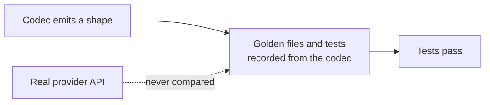

# LLM Provider Wire-Shape Fixes

## Outcome

Every `httpLlmResponse` provider should return what the real provider API returns, and accept
what real SDKs send, so client libraries, agent frameworks and gateways work against a mock
without special cases. GitHub discussion
[#2757](https://github.com/mock-server/mockserver-monorepo/discussions/2757) found that
`BEDROCK` returned Anthropic's Messages shape where the docs promised the AWS Converse API. An
audit of every provider on 2026-10-03 then found the same class of bug elsewhere. The items
below are worked in batches, most SDK-breaking first. The release is **not** gated on finishing
this plan: each item ships when it lands. When every item is closed this file is deleted in the
same commit.

## Why this class of bug got through

The codec tests derive their expected values from the codec itself. Examples:
`shouldEncodeCanonicalTokenUsageCounts` checks only non-streaming bodies and excludes the
OpenAI-compatible aliases, and the Responses tests set `call_id` equal to `id`. Item 16 closes
this gap.

## What remains

| # | Item | Batch |
|---|---|---|
| 6 | Gemini thinking tokens counted wrongly | 2 |
| 7 | Ollama `done_reason` missing | 3 |
| 8 | OpenAI-compatible providers drop provider-specific fields | 3 |
| 9 | Anthropic and Bedrock stop reasons not mapped | 3 |
| 10 | Rerank ignores request `top_n`/`top_k`; Cohere v2 path unknown | 3 |
| 11 | Request-decode gaps leave conversation matchers blind | 3 |
| 12 | Bedrock follow-ups from the Converse fix's review (item 1, closed `afeada5f1`) | 3 |
| 13 | Dashboard LLM traffic parsing misses real paths and streams | 4 |
| 14 | Suspected shape gaps to verify | 5 |
| 15 | Azure GA path detected as OpenAI | 5 |
| 16 | Contract tests against recorded real-provider responses | 5 |
| 17 | Streamed Responses turns are not stored, so they cannot be chained or retrieved | 2 |
| 18 | Codecs other than Responses ignore a configured `ToolUse.id` | 3 |
| 19 | `OpenAiResponsesStore` has no byte bound | 5 |
| 20 | `deterministicFromInput` embeddings allocate in proportion to the input text | 5 |
| 21 | Embedding `dimensions` of zero or below is not validated | 5 |
| 22 | A Cohere `images`-only embedding request returns no vectors | 3 |
| 23 | An empty OpenAI `input` is accepted | 3 |
| 24 | Embedding limits are fixed and reject some real batches | 5 |
| 25 | `proxyPassMappings` LLM forwards are never costed | 2 |
| 26 | Configured-provider fallback misses Gemini streaming and Bedrock paths | 3 |
| 27 | Proxied Bedrock calls have no model, so no cost | 3 |
| 28 | Bedrock, Gemini JSON-array and Ollama default streams are buffered, not relayed | 5 |
| 29 | Azure OpenAI Responses API traffic is read as Chat Completions | 3 |
| 30 | Non-completion streams from LLM hosts are treated as completions | 5 |

## Items

| # | Problem | Fix |
|---|---|---|
| 6 | `GeminiCodec` sets `candidatesTokenCount` to all output and adds `thoughtsTokenCount` on top, so clients that add the two overcount. `GeminiLlmClient` ignores thoughts, so proxied Gemini 2.5 cost is undercounted. | Split output into candidates plus thoughts on encode; count thoughts as output on parse. |
| 7 | `OllamaCodec` never writes `done_reason`, so a `stopReason` such as `length` cannot be tested. MockServer's own `OllamaLlmClient` reads it. | Emit `done_reason` on the final message. |
| 8 | `OpenAiCompatibleChatCodec` delegates everything to the OpenAI codec. Some of these providers also stream usage without `stream_options.include_usage` (Vercel's `@ai-sdk/mistral` reads streamed usage but never sends the opt-in; OpenRouter reportedly does the same), while MockServer applies OpenAI's opt-in to all of them. DeepSeek `reasoning_content` and cache-hit usage, Groq `reasoning`, timing usage and `x_groq`, and the xAI and OpenRouter extras are dropped. The docs say these providers produce identical bodies. | Per-provider additions over the OpenAI shape; correct the docs. |
| 9 | `AnthropicCodec` passes `stopReason` through verbatim, so a shared expectation using `stop`, `length` or `tool_calls` produces invalid Anthropic values. | Map to `end_turn`, `max_tokens`, `stop_sequence`, `tool_use` and so on, as the OpenAI and Gemini codecs already normalise. |
| 10 | Rerank applies only the expectation's `topN`, ignoring the request's Cohere `top_n` and Voyage `top_k`. Voyage ignores `return_documents` and hard-codes the model. Cohere's current `/v2/rerank` is unknown to the docs and `ProviderDetector`. | Honour the request fields; add the v2 path. |
| 11 | Gemini decode ignores `systemInstruction`. The OpenAI Chat decoder maps the `developer` role to user (the Responses decoder's `developer` role and `instructions` were fixed with item 2, and the Responses codec now uses a configured `ToolUse.id` as the `call_id`; the other codecs still generate their tool-call ids). Ollama `/api/generate` (`prompt` in, `response` out) decodes to an empty conversation. | Decode each into the conversation model. |
| 12 | From the Converse fix's review (item 1, closed `afeada5f1`): on Converse paths, the chaos content-filter block returns the Anthropic refusal body. Chaos `errorStatus` and structured-output enforcement errors use the Anthropic `{"type":"error"}` envelope for BEDROCK on both APIs (`LlmErrorBodies.bodyFor`). | A Converse refusal (HTTP 200, `stopReason` `content_filtered` or `guardrail_intervened`) and AWS error envelopes, by passing the request into `chaosErrorResponseOrNull`. |
| 13 | `mockserver-ui/src/lib/llmTraffic.ts`: `isBedrockPath` matches only `/model/anthropic.*/invoke`, missing Converse, other models and region-prefixed IDs. `parseOllamaRequest` parses streamed NDJSON as one JSON value and fails. `isGeminiPath` lacks the Vertex `/publishers/google/models/` path that `ProviderDetector` knows. | Match the server's detection; parse NDJSON streams. |
| 14 | Not yet confirmed: Gemini `streamGenerateContent` without `alt=sse` returns a JSON array, but MockServer always sends SSE. Strict typed SDKs (Rust async-openai, openai-go) may reject Responses bodies missing `parallel_tool_calls`, `tool_choice`, `tools` or `annotations` (all now emitted, with item 2; still to confirm against those SDKs). Groq streaming usage may arrive as `x_groq.usage`. OpenRouter adds `provider`, `reasoning` and SSE comments. | Confirm each against official docs or a recorded response, then fix or drop. |
| 15 | Azure's GA `/openai/v1/chat/completions` path and `*.openai.azure.com` hosts are detected as OPENAI, not AZURE_OPENAI, which affects pricing. Suspected, not confirmed. | Confirm, then extend `ProviderDetector`. |
| 16 | Nothing compares a codec's output with what the real provider sends. | Contract tests against recorded, redacted real-provider requests and responses per provider, streaming included, alongside the golden files (see [llm-codec-fixtures.md](../code/llm-codec-fixtures.md)). |
| 17 | A streamed `OPENAI_RESPONSES` turn is never recorded in `OpenAiResponsesStore`: `HttpLlmResponseActionHandler.handleStreaming` returns the events without calling `recordOpenAiResponsesStateIfApplicable`, which only the non-streaming path does. A streaming client that chains with `previous_response_id` and sends only the `function_call_output` therefore gets no match on `whenContainsToolResultFor`, and `GET /v1/responses/{id}` does not find a streamed response. | Record the streamed turn from the response object of its `response.completed` event, honouring `store:false`. |
| 18 | Only the Responses codec uses a user-set `ToolUse.id` (as the `call_id`, item 2). Every other codec ignores it and generates its own tool-call id, so a test cannot fix the id its client sends back with the tool result. | Use the configured `ToolUse.id` as the tool-call id in each provider that has one, and generate an id only when it is unset. |
| 19 | `OpenAiResponsesStore` is bounded by count only (10,000 responses, least recently used evicted first). Since item 2 each stored turn also holds the request's echoed `tools`, `instructions` and `metadata`, so a long run that sends large tool definitions can retain far more heap than the count suggests (see [memory-management.md](../code/memory-management.md#openai-responses-store)). | Add a byte budget next to the count cap, evicting least recently used first. |
| 20 | From the embedding wire-shape fix's review (item 4, closed `817f4d917`): with `deterministicFromInput`, `EmbeddingVectors.build` builds token and n-gram maps for each input, so allocation grows with the input text: about 175 bytes per input byte (46 MiB for 256 KiB, 175 MiB for 1 MiB, 355 MiB for 2 MiB, single thread, all-unique short tokens). A request at the default 10 MiB `maxRequestBodySize` would allocate about 1.75 GB (extrapolated, not measured). The embedding wire-shape fix's limits (item 4, closed `817f4d917`) bound the response, not this (see [llm-security-audit.md](../code/llm-security-audit.md#embedding-request-limits-2026-10-03)). | Cap the text length of each input for `deterministicFromInput` embeddings, and reject a longer one with a 400 in the provider's error shape. |
| 21 | From the embedding wire-shape fix's review (item 4, closed `817f4d917`): an expectation's embedding `dimensions` of zero or below is not validated. Zero gives empty vectors, and a negative value without `deterministicFromInput` throws `NegativeArraySizeException`, which the client sees as a 502. | Reject it: `"minimum": 1` on `dimensions` in `httpLlmResponse.json`, or a check in `EmbeddingWire.dimensions`. |
| 22 | From the embedding wire-shape fix's review (item 4, closed `817f4d917`): a Bedrock Cohere Embed request with only `images` returns no vectors, because `BedrockCodec.encodeCohereEmbedding` reads only `texts` and `inputs`. | Return one vector per `images` entry. |
| 23 | From the embedding wire-shape fix's review (item 4, closed `817f4d917`): an empty OpenAI-style `input` is accepted. `[]` returns an empty `data` array and `""` returns one vector; the real API rejects both. | Reject an empty `input` with a 400 `invalid_request_error`. |
| 24 | From the embedding wire-shape fix's review (item 4, closed `817f4d917`): the embedding limits are fixed, not configurable (262,144 values per response as JSON numbers, 1,048,576 as base64), and reject some real batches, for example 1,000 inputs at 1,536 dimensions as base64. | Make the totals configurable, or bound embedding responses in flight so the per-request totals can rise (see the residuals in [llm-security-audit.md](../code/llm-security-audit.md#embedding-request-limits-2026-10-03)). |
| 25 | Found while fixing proxied streaming usage (the former item 5): the `proxyPassMappings` reverse-proxy route checks `llmCostBudgetUsd` before forwarding but never calls `emitForwardGenAiSpan`, for whole or streamed responses, so LLM calls through a mapping emit no GenAI span, add no tokens or cost, and can never trip the budget they are checked against. Found by reading `HttpActionHandler`; no test covers it. | Record usage on the proxy-pass path as the other forward paths do (sniff by the mapping's target host, as its budget check does), with the stream scanner on its streaming branch. |
| 26 | Found while fixing proxied streaming usage (the former item 5): when the upstream is not a known provider host, `LlmProviderSniffer` falls back to `llmProvider` only for paths containing one of `LLM_PATH_FRAGMENTS`. `:generatecontent` does not match `:streamGenerateContent` on a `/v1beta/` path, and no fragment matches Bedrock's `/model/{id}/converse`, `/converse-stream`, `/invoke` or `/invoke-with-response-stream`. Gemini streaming and all Bedrock traffic through a gateway or private endpoint are therefore not seen as LLM traffic. Found by reading the sniffer. | Add the streaming Gemini method and the Bedrock paths to the fallback gate. |
| 27 | Found while fixing proxied streaming usage (the former item 5): a Bedrock request names its model in the path (`/model/{modelId}/...`), not the body, and a Converse response has no model. The forward path takes the model from the response, then the request body, so a proxied Converse or ConverseStream call gets a span named `chat unknown`, token counts, and no cost; `llmCostBudgetUsd` cannot count it. InvokeModel for an Anthropic model is costed because its response body carries `model`. Found by reading `emitForwardGenAiSpan` and `LlmPricing`. | Take the Bedrock model id from the request path (URL-decoded; an inference-profile or ARN id needs mapping to a priced model). |
| 28 | Found while fixing proxied streaming usage (the former item 5): the forward client relays a response as a stream only for `Content-Type: text/event-stream`, an `Accept: text/event-stream` request, or a JSON request body with `"stream": true`. Bedrock's `application/vnd.amazon.eventstream`, Gemini's `streamGenerateContent` without `alt=sse` and an Ollama request that leaves `stream` at its default of true match none of these, so the proxy buffers the whole response (up to `maxResponseBodySize`) and the client receives it only when it is complete. Usage is still counted, from the aggregated body. Found by reading `StreamingAwareHttpObjectAggregator`; not reproduced against a live provider. | Relay these as streams: recognise the event-stream content type, the Gemini streaming method, and NDJSON. |
| 29 | Found while fixing proxied streaming usage (the former item 5): `LlmProviderSniffer` maps any `*.openai.azure.com` host to `AZURE_OPENAI` whatever the path, and `AzureOpenAiLlmClient` reads usage with the Chat Completions mapping (`prompt_tokens`, `completion_tokens`). An Azure Responses API response reports `input_tokens` and `output_tokens`, so proxied Azure Responses traffic records no tokens and no cost, streamed or not, and cannot trip `llmCostBudgetUsd`. The uncounted-call log line no longer suggests `stream_options.include_usage` on an Azure `/responses` path. Found by reading the sniffer and client; the Azure Responses usage shape was not checked against a primary source. | Classify Azure `/responses` paths as the Responses API (as `api.openai.com` paths are), or map both usage shapes in the Azure client. |
| 30 | Found while fixing proxied streaming usage (the former item 5): the forward path treats every response from a host or path sniffed as an LLM provider as a completion. A streamed `2xx` response that is not one, such as Ollama's `/api/pull` progress stream, gets a GenAI span and the `no token usage in the streamed ... response` log line (now at most once a minute per provider and model). | Limit accounting to completion endpoints per provider (by path), so other streams are neither given a span nor reported as uncounted. |
