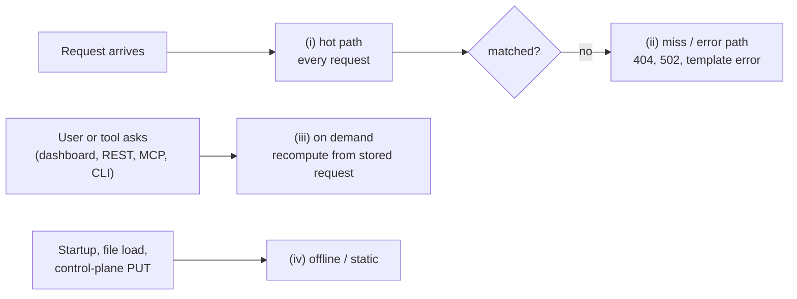

# Usability and Diagnostics Plan

## Outcome

A user should be able to ask "why did this request, forward, verification, template or spec
fail, and what do I change?" and get the answer in one step from the dashboard, REST, an MCP
tool or the CLI, without restarting at DEBUG. The per-request hot path must not get more
expensive; the first item makes it cheaper. Explanations are **recomputed on demand** from the
stored request plus the current expectations, not recorded on every request. Nothing is sent to
an external LLM unless the user configures one, and MockServer stays self-hosted.

## Where each idea's cost lands

| Category | When it runs | Rule for this plan |
|---|---|---|
| (i) hot path | every request | nothing new here; changes must be allocation-neutral or better |
| (ii) miss / error | only on a 404, forward failure, template error | bounded work, no blocking I/O, never an LLM call |
| (iii) on demand | only when a user or tool asks | preferred; hard evaluation budgets, report truncation |
| (iv) offline / static | startup, spec load, expectation PUT, CLI | preferred; advisory, never rejecting |

## What already exists (do not rebuild)

- **Match diagnostics:** `detailedMatchFailures` (default true) builds a `MatchDifference` per
  non-matching candidate; `PUT /mockserver/debugMismatch` (per-expectation diffs for one
  request); `PUT /mockserver/explainUnmatched` re-runs recent unmatched requests against the
  current matchers, ranks the closest expectations and adds remediation hints, within a budget
  (50 expectations, 500 evaluations) — already category (iii).
- **404 hints:** `findClosestMatchHint` feeds the `x-mockserver-closest-match(-hint)` headers
  (`closestMatchHintEnabled`, default true), the optional mismatch diagnostic body, and a DEBUG
  log.
- **Verification:** failures include the closest-request diff (`detailedVerificationFailures`,
  default true).
- **Other failures:** forward failures return a 502 with the raw error; OpenAPI load returns the
  parser messages; unknown `mockserver.*` / `MOCKSERVER_*` keys log a WARN at startup.
- **Dashboard:** Explain Unmatched, Debug Mismatch, Matcher Playground, create-expectation-from-
  unmatched, Verification, Drift, Diff Requests and Baseline Compare views, plus log-pressure and
  dropped-event banners.
- **MCP:** a large tool set, including `explain_unmatched_requests`, `debug_request_mismatch`,
  `retrieve_logs`, `verify_*` and `create_expectation(s_from_recorded_traffic)`; prompts
  `debug_unmatched_request` and `create_mock_from_description` (so natural-language → expectation
  already exists, with the user's own assistant doing the reasoning).
- **Bring-your-own LLM:** `PUT /generateExpectation` (`llmProvider` / `llmBaseUrl` / `llmModel`)
  with a template fallback when no backend is configured; `SemanticDriftExtension` optionally uses
  an LLM for drift.
- **Consumer docs:** `debugging_issues.html`, `troubleshooting_matching.html`, `DEBUGGING.md`.

**Gaps:** explaining why a request matched X instead of a higher-priority Y; expectation lint and
shadowing detection; config did-you-mean; a likely-cause for forward failures; a template dry run;
located OpenAPI errors.

**Done:** per-candidate match detail is now recorded only when INFO logging reads it (`ce24dc676`),
and outbound LLM prompts are redacted (`f5e1e6ce0`). One small follow-up from its security audit:
drift values in non-credential fields get JWT and URL masking but not the `key=value` sweep.

## Items

| # | Problem → proposal | Cost | Performance reasoning | Effort | Risks | Priority |
|---|---|---|---|---|---|---|
| A2 | A 404 flood rescans every expectation per miss for the closest-match hint → cap the scan and memoise per (method, path) until expectations change | (ii) | 404-heavy and proxy-miss loads currently pay O(expectations) per miss | S | A capped hint can miss the true closest match; say so in the header | P1 |
| A3 | "Why did this specific request match X (or nothing)?" → `explain?correlationId=`: re-evaluate the stored request, including why a higher-priority expectation lost | (iii) | Zero hot-path cost | M | Expectations may have changed since arrival: return an `expectationsChangedSince` marker and label results "recomputed now" | P0 |
| B1 | MCP diagnosis tools as the primary AI route: `explain_request` (A3), `explain_forward_failure` (A4), `lint_expectations` (A8), `test_template` (A5), `diagnose_config` (A7), `suggest_expectation_fix` (B3) | (iii) | MockServer runs deterministic computation only; the user's assistant does the reasoning | M | Tool output carries user traffic to the assistant: apply the log redaction settings to tool results by default | P0 |
| A10 | Troubleshooting is split across pages → symptom-first index (404, 502, verify failure, template, spec, config) linking to the tools; document the hint headers and explainUnmatched | (iv) | None | S | Enumerated facts go stale | P1 |
| A4 | A forward failure shows only a raw error → classify the likely cause and fix (DNS, refused, TLS SNI/trust, timeout, pooled-connection close, proxy loop) | (ii) | Runs only on failure; a lookup | S | Must not reveal more of the target than the 502 already does | P1 |
| A5 | Template errors are hard to locate → `PUT /template/test` dry run, plus line/column and missing-variable hints in the failure event | (iii) / (ii) | Dry run on demand; enrichment only on failure | M | Reuse the hardened template-engine sandbox; rate-limit | P1 |
| A6 | OpenAPI load errors are raw → group parser messages, add the JSON-pointer location, flag common causes (unresolved `$ref`, wrong path, YAML tab) | (iv) | Load time only | S | None | P1 |
| A7 | Config typos only get a WARN → did-you-mean suggestions against known keys, plus an "effective config vs defaults" view | (iv) | Once at startup | S | Redact secrets in the effective-config view | P1 |
| A8 | Unreachable or suspicious expectations go unnoticed → lint: shadowed expectations, regex paths that look literal, missing leading slash, STRICT array bodies, `times=0`; surfaced as PUT `warnings`, in the UI, and via `mockserver lint file.json` | (iv) / (iii) | Control plane only; the pairwise shadowing check is O(n²), so on demand, not on every PUT | M | Advisory only, never rejecting | P1 |
| B3 | "Fix my expectation" → turn the diff into a minimal JSON patch with a preview-and-apply action in Explain Unmatched | (iii) | On demand | M | Never auto-apply | P1 |
| B2 | More MCP prompts: `why_did_verify_fail`, `fix_my_expectation`, `why_forward_failed`, chaining the tools above | (iii) | Static text | S | Keep deterministic facts separate from model prose | P1 |
| A9 | Verification failures could say more → "expected 2, got 1; closest 3 requests; 1 arrived after verify started" | (iii) | Verify path only | S | Add fields; do not rewrite the existing message | P2 |
| B6 | Natural-language → expectation without an LLM inside MockServer → document and test the `create_mock_from_description` prompt, with precise schema errors the assistant can act on | (iii) | None | S | Validate against the real schema | P2 |
| B5 | Optional plain-language summary of explain results from a configured LLM (`?narrate=true`) | (iii) | On demand, asynchronous, timeout-bounded, never inline in a 404 | S | Off by default; label as AI-generated; always return the deterministic facts too | P3 |

## Approach to LLM features

1. **MCP first.** MockServer exposes deterministic tools; the user's own assistant reasons over
   them. No runtime cost, no new dependency, the model stays the user's choice.
2. **Deterministic explanations are the base** (A3, A8, B3): reproducible, testable, offline,
   and consumed by both MCP and a bring-your-own LLM.
3. **Bring-your-own LLM stays optional and off by default** (B5), reusing the existing `llm*`
   configuration and no bundled SDK; redaction fails closed.
4. **No hosted LLM, no bundled model, no SaaS.**

## Sequence

1. **Wave 0 — hygiene and performance:** A2 (A1 and B4 are done).
2. **Wave 1 — explain engine:** A3, B1 (A3 plus existing tools with redacted output), A10.
3. **Wave 2 — failure classes:** A4, A5, A6, A7, each with an MCP tool and a dashboard entry.
4. **Wave 3 — fixes:** A8 (including the CLI), B3, B2, A9.
5. **Wave 4 — optional:** B5, B6.

## Performance rules for every item

- Nothing new in category (i). Any change touching the hot path is checked with
  `MatchingBenchmark` on both `detailedMatchFailures` arms.
- Prefer recomputing on demand to recording per request; the answer states it was recomputed and
  whether expectations changed since the request arrived.
- Miss-path work is bounded (capped candidates, memoised where safe), never blocks, and never
  calls an LLM.
- Diagnostics never run on the event-log consumer thread, and on-demand re-evaluation must not
  emit match events of its own (the lesson from the dashboard not-matched flood).
- Explain APIs have hard evaluation budgets and report truncation.
- LLM calls happen only on explicit request, asynchronously, timeout-bounded and redacted.

## Open questions

- Does the dashboard call `/generateExpectation`?
